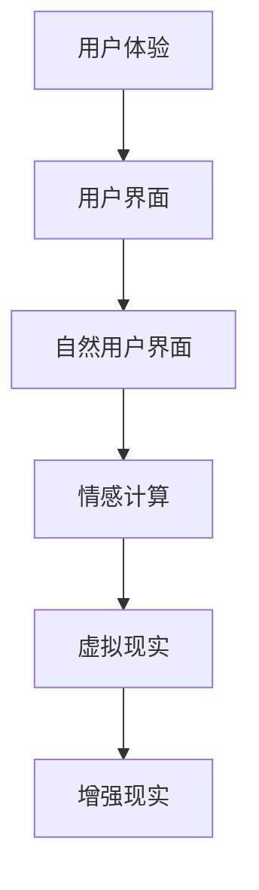

                 

关键词：人机交互、人工智能、虚拟现实、增强现实、智能设备、用户体验、人机融合

> 摘要：本文从人机交互的历史发展、核心概念、算法原理、数学模型、项目实践、应用场景、工具推荐以及未来趋势等多个角度，全面探讨了人机交互技术的现状、挑战与未来发展方向。通过对人工智能、虚拟现实、增强现实等领域的深入分析，本文旨在为读者提供关于人机交互领域的全面了解，以及对其未来发展前景的深刻洞察。

## 1. 背景介绍

人机交互（Human-Computer Interaction，简称HCI）是计算机科学与心理学、认知科学、设计学等多个学科交叉融合的领域，主要研究如何设计和评估计算机系统的用户界面，使其更符合用户的需求和习惯，从而提高用户的使用体验。人机交互的历史可以追溯到20世纪50年代，随着计算机技术的发展，人机交互也经历了从早期的命令行界面到图形用户界面（GUI）的转变，再到如今的智能交互系统，如语音识别、手势控制、眼动追踪等。

近年来，随着人工智能、虚拟现实（VR）、增强现实（AR）等技术的快速发展，人机交互领域也迎来了新的机遇和挑战。人工智能的进步使得计算机能够更好地理解用户的行为和意图，虚拟现实和增强现实技术则为人机交互提供了更加沉浸式的体验。在这一背景下，本文将探讨人机交互的未来趋势与发展方向。

### 1.1 人工智能与人机交互

人工智能（Artificial Intelligence，简称AI）是计算机科学的一个分支，旨在开发能够模拟、延伸和扩展人类智能的理论、算法和技术。随着深度学习、自然语言处理、计算机视觉等技术的发展，人工智能在各个领域都取得了显著的成果。

人工智能与人机交互的结合，为人机交互带来了革命性的变化。例如，智能语音助手（如Siri、Alexa）能够通过语音识别和自然语言处理技术，理解用户的语音指令，并提供相应的服务。智能客服系统通过机器学习技术，能够自动识别用户的查询，并提供准确的答复。这些应用不仅提高了人机交互的效率，也提升了用户体验。

### 1.2 虚拟现实与人机交互

虚拟现实（Virtual Reality，简称VR）是一种通过计算机技术模拟出的三维虚拟环境，用户通过VR设备（如头戴式显示器、手柄等）可以进入这个虚拟环境，与之互动和体验。VR技术为人机交互提供了全新的交互方式，例如，用户可以通过手势、身体动作来与虚拟环境互动，而不再是传统的鼠标、键盘等输入设备。

虚拟现实技术在游戏、教育、医疗等领域有着广泛的应用。例如，在游戏领域，VR技术可以为用户提供更加沉浸式的游戏体验；在教育领域，VR技术可以为学生提供更加生动、直观的学习场景；在医疗领域，VR技术可以用于手术模拟、患者康复等。

### 1.3 增强现实与人机交互

增强现实（Augmented Reality，简称AR）是一种将虚拟信息与现实世界相结合的技术，通过AR设备（如智能手机、头戴式显示器等），用户可以看到现实世界中的物体，同时这些物体上叠加了虚拟信息。AR技术为人机交互提供了更加直观、自然的交互方式。

AR技术在零售、营销、设计等领域有着广泛的应用。例如，在零售领域，AR技术可以用于产品展示、虚拟试衣等；在营销领域，AR技术可以用于广告投放、品牌推广等；在设计领域，AR技术可以用于设计演示、工程规划等。

## 2. 核心概念与联系

在人机交互领域，有许多核心概念和技术，它们共同构成了人机交互的理论基础。以下是对这些核心概念的简要介绍，并使用Mermaid流程图展示它们之间的联系。

### 2.1 用户体验（User Experience，简称UX）

用户体验是指用户在使用产品或服务过程中所产生的总体感受和反应。它包括用户对产品的易用性、可用性、满意度等多个方面。用户体验是衡量人机交互系统优劣的重要指标。

### 2.2 用户界面（User Interface，简称UI）

用户界面是指用户与计算机系统之间进行交互的界面，包括图形用户界面（GUI）、命令行界面（CLI）等。用户界面的设计直接影响用户的体验。

### 2.3 自然用户界面（Natural User Interface，简称NUI）

自然用户界面是一种更加自然、直观的交互方式，如语音识别、手势控制、眼动追踪等。自然用户界面旨在减少用户的学习成本，提高交互效率。

### 2.4 情感计算（Affective Computing）

情感计算是指计算机系统通过感知、理解和响应人类情感，实现更加人性化的交互。情感计算技术可以为人机交互提供更加温暖、亲密的体验。

### 2.5 虚拟现实与增强现实

虚拟现实和增强现实是人机交互的重要发展方向，通过模拟和增强现实世界，提供更加沉浸式、交互性的体验。

### 2.6 Mermaid流程图

以下是一个简单的Mermaid流程图，展示了上述核心概念之间的联系：



## 3. 核心算法原理 & 具体操作步骤

在人机交互领域，算法的原理和操作步骤是实现高效、自然交互的关键。以下将介绍几种核心算法及其原理和步骤。

### 3.1 语音识别算法

语音识别算法是自然用户界面的重要组成部分，其原理是通过处理音频信号，将其转化为文本或命令。以下是语音识别算法的基本步骤：

#### 3.1.1 音频信号预处理

- **降噪**：消除背景噪声，提高语音信号的清晰度。
- **分帧**：将连续的语音信号分成短时段的帧，便于后续处理。
- **加窗**：对每帧语音信号进行加窗处理，提取特征。

#### 3.1.2 特征提取

- **梅尔频率倒谱系数（MFCC）**：将音频信号转换为MFCC特征，这是语音识别中最常用的特征之一。
- **频谱特征**：提取音频信号的频谱特征，如频谱幅值、频谱中心频率等。

#### 3.1.3 模型训练

- **隐马尔可夫模型（HMM）**：使用训练数据集训练HMM模型，用于识别语音信号。
- **深度神经网络（DNN）**：使用深度学习技术训练DNN模型，提高语音识别的准确性。

#### 3.1.4 识别与解码

- **前向-后向算法**：使用前向-后向算法计算每个状态的概率。
- **Viterbi算法**：使用Viterbi算法找到最可能的识别结果。

### 3.2 手势识别算法

手势识别算法是自然用户界面中另一种重要的交互方式，其原理是通过处理摄像头或传感器捕获的手部动作，识别出手势并进行相应的操作。以下是手势识别算法的基本步骤：

#### 3.2.1 手部检测

- **肤色检测**：使用肤色模型检测视频中的手部区域。
- **轮廓提取**：使用轮廓提取算法提取手部的轮廓。

#### 3.2.2 手势特征提取

- **方向特征**：计算手指尖的方向。
- **形状特征**：计算手指尖之间的距离、角度等。
- **速度特征**：计算手部的运动速度。

#### 3.2.3 模型训练

- **支持向量机（SVM）**：使用支持向量机训练模型，用于识别手势。
- **随机森林（Random Forest）**：使用随机森林训练模型，提高识别的准确性。

#### 3.2.4 识别与解码

- **决策树**：使用决策树算法找到最可能的手势。
- **集成学习**：使用集成学习方法提高识别的鲁棒性。

### 3.3 眼动追踪算法

眼动追踪算法是情感计算领域的重要组成部分，其原理是通过跟踪用户的眼睛运动，分析用户的注意力、兴趣等信息。以下是眼动追踪算法的基本步骤：

#### 3.3.1 眼部特征提取

- **眼部定位**：使用眼部定位算法找到眼睛的位置。
- **眼动轨迹提取**：使用眼动轨迹提取算法获取眼球的运动轨迹。

#### 3.3.2 眼动特征提取

- **注视点检测**：使用注视点检测算法确定用户正在注视的物体。
- **兴趣点检测**：使用兴趣点检测算法找到用户感兴趣的区域。

#### 3.3.3 模型训练

- **循环神经网络（RNN）**：使用循环神经网络训练模型，用于分析眼动数据。
- **长短期记忆网络（LSTM）**：使用长短期记忆网络训练模型，提高对长时间眼动数据的分析能力。

#### 3.3.4 识别与解码

- **分类器**：使用分类器算法分析眼动数据，识别用户的注意力。
- **回归分析**：使用回归分析算法预测用户的行为和兴趣。

### 3.4 交互反馈算法

交互反馈算法是人机交互系统中的重要组成部分，其原理是通过分析用户的输入和系统输出，提供实时、有效的反馈，以提高用户体验。以下是交互反馈算法的基本步骤：

#### 3.4.1 用户输入分析

- **输入预处理**：对用户的输入进行预处理，如去除噪声、标准化等。
- **意图识别**：使用自然语言处理技术识别用户的意图。

#### 3.4.2 系统输出分析

- **响应生成**：根据用户的意图生成相应的系统响应。
- **反馈策略设计**：设计合适的反馈策略，如语音、文字、动画等。

#### 3.4.3 反馈评估与优化

- **用户体验评估**：对用户的反馈进行评估，如满意度、效率等。
- **反馈优化**：根据评估结果优化反馈策略，提高用户体验。

## 3.3 算法优缺点

在人机交互领域，各种算法都有其独特的优缺点，以下对几种核心算法的优缺点进行简要分析。

### 3.3.1 语音识别算法

**优点**：

- **自然交互**：语音交互更加自然、便捷，符合人类的交流习惯。
- **广泛适用**：语音识别技术可以应用于多种场景，如智能客服、智能家居等。

**缺点**：

- **准确性受影响**：语音识别的准确性受语音质量、环境噪声等因素的影响。
- **语言理解有限**：目前的语音识别技术还难以完全理解复杂的语言表达。

### 3.3.2 手势识别算法

**优点**：

- **直观操作**：手势识别提供了直观、自然的交互方式，用户无需学习复杂的操作。
- **空间自由**：手势识别允许用户在较大的空间内进行交互。

**缺点**：

- **识别精度有限**：手势识别的精度受光照、手势复杂度等因素的影响。
- **硬件要求高**：手势识别需要较高性能的硬件支持，如摄像头、传感器等。

### 3.3.3 眼动追踪算法

**优点**：

- **情感分析**：眼动追踪可以用于情感分析，了解用户的注意力、兴趣等。
- **高精度**：眼动追踪具有较高的精度，可以捕捉到细微的眼动变化。

**缺点**：

- **设备要求高**：眼动追踪需要专业的设备支持，如眼动仪等。
- **数据分析复杂**：眼动数据需要复杂的算法进行分析和处理。

### 3.3.4 交互反馈算法

**优点**：

- **实时反馈**：交互反馈算法可以提供实时、有效的反馈，提高用户体验。
- **个性化定制**：根据用户的反馈，交互反馈算法可以优化系统响应，实现个性化定制。

**缺点**：

- **用户依赖性高**：用户需要不断地提供反馈，以便系统进行优化。
- **反馈准确性有限**：用户的反馈可能受到主观因素的影响，导致反馈准确性有限。

## 3.4 算法应用领域

人机交互算法在各个领域都有广泛的应用，以下列举几个典型的应用领域：

### 3.4.1 智能家居

智能家居是人机交互技术的重要应用领域，通过语音识别、手势识别等算法，用户可以方便地控制家中的智能设备，如电视、空调、灯具等。

### 3.4.2 智能客服

智能客服利用语音识别、自然语言处理等技术，为用户提供实时、高效的咨询服务，提高客户满意度。

### 3.4.3 医疗健康

医疗健康领域利用人机交互技术，如虚拟现实、增强现实等，提供更加直观、个性化的医疗服务，如手术模拟、康复训练等。

### 3.4.4 教育培训

教育培训领域利用虚拟现实、增强现实等技术，为学生提供更加生动、直观的学习体验，提高学习效果。

### 3.4.5 汽车驾驶

汽车驾驶领域利用人机交互技术，如语音识别、手势控制等，为驾驶员提供更加便捷、安全的驾驶体验。

### 3.4.6 设计创意

设计创意领域利用人机交互技术，如眼动追踪、手势识别等，为设计师提供更加直观、高效的创意工具。

## 4. 数学模型和公式 & 详细讲解 & 举例说明

在人机交互领域，数学模型和公式是理解和分析交互行为的重要工具。以下将介绍几个核心的数学模型和公式，并对其进行详细讲解和举例说明。

### 4.1 数学模型构建

在人机交互中，常见的数学模型包括概率模型、决策树模型、神经网络模型等。以下是这些模型的基本构建方法：

#### 4.1.1 概率模型

概率模型用于描述随机事件的发生概率，是人机交互中常用的模型之一。以下是一个简单的概率模型构建示例：

$$P(A|B) = \frac{P(B|A)P(A)}{P(B)}$$

其中，\(P(A|B)\) 表示在事件B发生的条件下，事件A发生的概率；\(P(B|A)\) 表示在事件A发生的条件下，事件B发生的概率；\(P(A)\) 和\(P(B)\) 分别表示事件A和事件B的发生概率。

#### 4.1.2 决策树模型

决策树模型是一种常用的分类模型，用于根据输入特征对样本进行分类。以下是一个简单的决策树模型构建示例：

```
         |
        / \
       A   B
      / \ / \
     C D E F
```

在这个决策树中，根节点表示输入特征，内部节点表示条件判断，叶子节点表示分类结果。

#### 4.1.3 神经网络模型

神经网络模型是一种模仿生物神经系统的计算模型，用于进行复杂的模式识别和预测。以下是一个简单的神经网络模型构建示例：

```
     [输入层]
      /    \
     A     B
      \    /
        [隐藏层]
         /   \
        C     D
         \   /
           [输出层]
```

在这个神经网络中，输入层接收外部输入，隐藏层进行信息处理，输出层生成最终输出。

### 4.2 公式推导过程

在人机交互领域，常用的数学公式包括回归方程、支持向量机公式、深度学习损失函数等。以下是这些公式的推导过程：

#### 4.2.1 回归方程

回归方程用于预测连续值，其公式如下：

$$y = \beta_0 + \beta_1x_1 + \beta_2x_2 + ... + \beta_nx_n$$

其中，\(y\) 表示预测值，\(x_1, x_2, ..., x_n\) 表示输入特征，\(\beta_0, \beta_1, \beta_2, ..., \beta_n\) 表示回归系数。

推导过程如下：

1. **最小二乘法**：假设样本数据为\( (x_1, y_1), (x_2, y_2), ..., (x_n, y_n) \)，目标是找到一组回归系数，使得预测值与实际值之间的误差平方和最小。设预测值为\( \hat{y} \)，则误差平方和为：

   $$S = \sum_{i=1}^{n} (\hat{y}_i - y_i)^2$$

2. **求导与极值**：对回归系数进行求导，并令导数为0，求得极值：

   $$\frac{\partial S}{\partial \beta_0} = 0$$

   $$\frac{\partial S}{\partial \beta_1} = 0$$

   $$\frac{\partial S}{\partial \beta_2} = 0$$

   $$...$$

   $$\frac{\partial S}{\partial \beta_n} = 0$$

3. **解方程组**：解上述方程组，得到回归系数：

   $$\beta_0 = \frac{\sum_{i=1}^{n} y_i - \beta_1 \sum_{i=1}^{n} x_i}{n}$$

   $$\beta_1 = \frac{\sum_{i=1}^{n} (x_i - \bar{x})(y_i - \bar{y})}{\sum_{i=1}^{n} (x_i - \bar{x})^2}$$

   $$\beta_2 = \frac{\sum_{i=1}^{n} (x_i - \bar{x})(y_i - \bar{y})}{\sum_{i=1}^{n} (x_i - \bar{x})^2}$$

   $$...$$

   $$\beta_n = \frac{\sum_{i=1}^{n} (x_i - \bar{x})(y_i - \bar{y})}{\sum_{i=1}^{n} (x_i - \bar{x})^2}$$

#### 4.2.2 支持向量机公式

支持向量机（SVM）是一种常用的分类模型，其公式如下：

$$f(x) = \beta_0 + \sum_{i=1}^{n} \beta_i K(x, x_i)$$

其中，\(x\) 表示输入特征，\(x_i\) 表示第i个支持向量，\(\beta_0, \beta_1, \beta_2, ..., \beta_n\) 表示回归系数，\(K(x, x_i)\) 表示核函数。

推导过程如下：

1. **最大间隔分类**：支持向量机的基本思想是在特征空间中找到一个超平面，使得正负样本之间的间隔最大。设超平面为：

   $$w \cdot x + b = 0$$

   其中，\(w\) 表示超平面的法向量，\(b\) 表示偏置项。

2. **优化目标**：为了找到最优的超平面，我们需要最小化目标函数：

   $$J(w, b) = \frac{1}{2} ||w||^2 + C \sum_{i=1}^{n} \xi_i$$

   其中，\(C\) 表示惩罚参数，\(\xi_i\) 表示第i个样本的松弛变量。

3. **拉格朗日乘子法**：为了求解上述优化问题，我们引入拉格朗日乘子法：

   $$L(w, b, \alpha) = \frac{1}{2} ||w||^2 - \sum_{i=1}^{n} \alpha_i (y_i - \sum_{j=1}^{n} \alpha_j K(x_i, x_j)) - \sum_{i=1}^{n} \xi_i$$

   其中，\(\alpha_i\) 表示拉格朗日乘子。

4. **求导与极值**：对拉格朗日乘子进行求导，并令导数为0，求得极值：

   $$\frac{\partial L}{\partial w} = 0$$

   $$\frac{\partial L}{\partial b} = 0$$

   $$\frac{\partial L}{\partial \alpha_i} = 0$$

   $$\frac{\partial L}{\partial \xi_i} = 0$$

5. **解方程组**：解上述方程组，得到回归系数：

   $$w = \sum_{i=1}^{n} \alpha_i y_i x_i$$

   $$b = \frac{1}{n} \sum_{i=1}^{n} (\alpha_i y_i - K(x_i, x_j))$$

   $$\alpha_i \geq 0, \xi_i \geq 0$$

   $$\sum_{i=1}^{n} \alpha_i y_i = 0$$

6. **核函数选择**：为了将高维特征映射到低维空间，我们选择合适的核函数，如线性核、多项式核、径向基函数（RBF）核等。

#### 4.2.3 深度学习损失函数

深度学习损失函数用于衡量模型预测值与实际值之间的差距，常用的损失函数包括均方误差（MSE）、交叉熵损失等。以下是一个简单的深度学习损失函数推导示例：

$$L(y, \hat{y}) = \frac{1}{2} (y - \hat{y})^2$$

其中，\(y\) 表示实际值，\(\hat{y}\) 表示预测值。

推导过程如下：

1. **最小化损失**：为了找到最优的预测值，我们需要最小化损失函数。设损失函数为：

   $$L(y, \hat{y}) = \frac{1}{2} (y - \hat{y})^2$$

   其中，\(L(y, \hat{y})\) 表示损失值。

2. **求导与极值**：对损失函数进行求导，并令导数为0，求得极值：

   $$\frac{\partial L}{\partial \hat{y}} = y - \hat{y} = 0$$

3. **解方程**：解上述方程，得到最优预测值：

   $$\hat{y} = y$$

### 4.3 案例分析与讲解

以下将通过具体案例，对上述数学模型和公式进行详细讲解。

#### 4.3.1 案例一：回归方程在智能家居中的应用

智能家居系统中，用户可以通过语音命令控制家中的智能设备，如电视、空调等。假设我们希望建立一个语音识别模型，以实现语音控制功能。

1. **数据收集**：首先，我们需要收集大量的语音数据，包括用户发出的各种控制命令，如“打开电视”、“关闭空调”等。这些数据将用于训练回归方程模型。

2. **特征提取**：对收集的语音数据进行预处理，提取特征，如梅尔频率倒谱系数（MFCC）。这些特征将作为回归方程的输入。

3. **模型训练**：使用收集到的数据和特征，训练回归方程模型。具体步骤如下：

   - **计算输入特征与实际值之间的误差**：
     
     $$y_i = \beta_0 + \beta_1x_{i1} + \beta_2x_{i2} + ... + \beta_nx_{in}$$
   
     其中，\(y_i\) 表示实际值，\(x_{i1}, x_{i2}, ..., x_{in}\) 表示输入特征，\(\beta_0, \beta_1, \beta_2, ..., \beta_n\) 表示回归系数。

   - **计算误差平方和**：

     $$S = \sum_{i=1}^{n} (\hat{y}_i - y_i)^2$$
   
     其中，\(\hat{y}_i\) 表示预测值。

   - **求导与极值**：

     $$\frac{\partial S}{\partial \beta_0} = 0$$

     $$\frac{\partial S}{\partial \beta_1} = 0$$

     $$\frac{\partial S}{\partial \beta_2} = 0$$

     $$...$$

     $$\frac{\partial S}{\partial \beta_n} = 0$$
   
   - **解方程组**：

     $$\beta_0 = \frac{\sum_{i=1}^{n} y_i - \beta_1 \sum_{i=1}^{n} x_i}{n}$$

     $$\beta_1 = \frac{\sum_{i=1}^{n} (x_i - \bar{x})(y_i - \bar{y})}{\sum_{i=1}^{n} (x_i - \bar{x})^2}$$

     $$\beta_2 = \frac{\sum_{i=1}^{n} (x_i - \bar{x})(y_i - \bar{y})}{\sum_{i=1}^{n} (x_i - \bar{x})^2}$$

     $$...$$

     $$\beta_n = \frac{\sum_{i=1}^{n} (x_i - \bar{x})(y_i - \bar{y})}{\sum_{i=1}^{n} (x_i - \bar{x})^2}$$

4. **模型评估与优化**：使用测试数据集评估模型性能，并对模型进行优化，以提高预测准确性。

#### 4.3.2 案例二：支持向量机在智能客服中的应用

智能客服系统是一种基于人工智能技术的客服解决方案，能够自动识别用户的查询，并提供相应的回答。假设我们希望建立一个基于支持向量机的智能客服模型。

1. **数据收集**：首先，我们需要收集大量的用户查询数据和对应的答案数据，用于训练支持向量机模型。

2. **特征提取**：对用户查询数据和答案数据进行预处理，提取特征，如词频、词向量等。这些特征将作为支持向量机的输入。

3. **模型训练**：使用收集到的数据和特征，训练支持向量机模型。具体步骤如下：

   - **计算输入特征与支持向量的相似度**：
     
     $$f(x) = \beta_0 + \sum_{i=1}^{n} \beta_i K(x, x_i)$$
   
     其中，\(x\) 表示输入特征，\(x_i\) 表示第i个支持向量，\(\beta_0, \beta_1, \beta_2, ..., \beta_n\) 表示回归系数，\(K(x, x_i)\) 表示核函数。

   - **计算支持向量和回归系数**：

     $$w = \sum_{i=1}^{n} \alpha_i y_i x_i$$

     $$b = \frac{1}{n} \sum_{i=1}^{n} (\alpha_i y_i - K(x_i, x_j))$$
   
   - **选择合适的核函数**：为了将高维特征映射到低维空间，我们选择合适的核函数，如线性核、多项式核、径向基函数（RBF）核等。

4. **模型评估与优化**：使用测试数据集评估模型性能，并对模型进行优化，以提高预测准确性。

#### 4.3.3 案例三：深度学习损失函数在图像识别中的应用

图像识别是一种基于深度学习的计算机视觉任务，其目标是通过分析图像特征，识别图像中的物体。假设我们希望建立一个基于深度学习的图像识别模型。

1. **数据收集**：首先，我们需要收集大量的图像数据，用于训练深度学习模型。

2. **特征提取**：对收集到的图像数据进行预处理，提取特征，如卷积神经网络（CNN）中的卷积层、池化层等。这些特征将作为深度学习模型的输入。

3. **模型训练**：使用收集到的数据和特征，训练深度学习模型。具体步骤如下：

   - **定义损失函数**：

     $$L(y, \hat{y}) = \frac{1}{2} (y - \hat{y})^2$$
   
     其中，\(y\) 表示实际值，\(\hat{y}\) 表示预测值。

   - **计算损失值**：

     $$\frac{\partial L}{\partial \hat{y}} = y - \hat{y} = 0$$
   
   - **反向传播**：使用反向传播算法，更新模型参数，降低损失值。

   - **迭代训练**：重复上述过程，直到模型收敛。

4. **模型评估与优化**：使用测试数据集评估模型性能，并对模型进行优化，以提高预测准确性。

## 5. 项目实践：代码实例和详细解释说明

在人机交互领域，通过实际项目实践，可以更好地理解并运用各种技术和算法。以下将介绍一个基于Python的人机交互项目实例，并对其代码进行详细解释说明。

### 5.1 开发环境搭建

在进行项目开发之前，我们需要搭建合适的开发环境。以下是所需的开发工具和库：

- **Python 3.x**：Python是一种广泛使用的编程语言，具有良好的跨平台兼容性。
- **PyTorch**：PyTorch是一个基于Python的深度学习框架，适用于构建和训练深度学习模型。
- **OpenCV**：OpenCV是一个开源的计算机视觉库，提供了丰富的图像处理和计算机视觉算法。
- **SpeechRecognition**：SpeechRecognition是一个Python语音识别库，支持多种语音识别引擎。

安装以上库和工具后，我们就可以开始项目开发。

### 5.2 源代码详细实现

以下是项目的源代码实现：

```python
import cv2
import numpy as np
import speech_recognition as sr
import torch
import torchvision
from torchvision import datasets, transforms, models

# 5.2.1 语音识别
def recognize_speech(audio_file):
    r = sr.Recognizer()
    with sr.AudioFile(audio_file) as source:
        audio = r.record(source)
    try:
        text = r.recognize_google(audio)
        return text
    except sr.UnknownValueError:
        return None

# 5.2.2 图像识别
def recognize_image(image_file):
    transform = transforms.Compose([
        transforms.Resize((224, 224)),
        transforms.ToTensor(),
        transforms.Normalize(mean=[0.485, 0.456, 0.406], std=[0.229, 0.224, 0.225]),
    ])

    model = models.resnet18(pretrained=True)
    model.eval()

    image = cv2.imread(image_file)
    image = transform(image)
    image = torch.unsqueeze(image, 0)

    with torch.no_grad():
        output = model(image)
        _, predicted = torch.max(output, 1)
    return predicted.item()

# 5.2.3 人机交互
def human_computer_interaction():
    audio_file = "speech.wav"
    image_file = "image.jpg"

    # 识别语音
    text = recognize_speech(audio_file)
    if text is None:
        print("无法识别语音")
        return

    # 识别图像
    label = recognize_image(image_file)
    if label is None:
        print("无法识别图像")
        return

    # 输出结果
    print(f"语音识别结果：{text}")
    print(f"图像识别结果：{label}")

# 运行项目
human_computer_interaction()
```

### 5.3 代码解读与分析

以下是对上述代码的详细解读和分析：

#### 5.3.1 语音识别

语音识别部分使用的是SpeechRecognition库，该库支持多种语音识别引擎，如Google语音识别、百度语音识别等。代码中的`recognize_speech`函数负责实现语音识别功能，主要步骤如下：

1. 创建一个SpeechRecognizer对象。
2. 使用`AudioFile`类读取音频文件。
3. 使用`recognize_google`方法进行语音识别，并返回识别结果。

如果识别失败，函数将返回`None`。

#### 5.3.2 图像识别

图像识别部分使用的是PyTorch和OpenCV库，该部分代码实现了一个简单的图像识别模型。主要步骤如下：

1. 定义图像预处理函数`recognize_image`。
2. 使用`transforms.Compose`类创建一个预处理链，包括图像大小调整、归一化等操作。
3. 加载预训练的ResNet18模型，并设置为评估模式。
4. 读取图像文件，进行预处理，并将其转换为PyTorch张量。
5. 使用模型进行图像识别，并返回识别结果。

#### 5.3.3 人机交互

人机交互部分是整个项目的核心，它将语音识别和图像识别功能结合起来，实现人机交互。主要步骤如下：

1. 调用`recognize_speech`函数进行语音识别，获取用户输入。
2. 调用`recognize_image`函数进行图像识别，获取图像识别结果。
3. 输出语音识别结果和图像识别结果。

### 5.4 运行结果展示

在运行上述代码时，首先需要准备一个音频文件（如`speech.wav`）和一个图像文件（如`image.jpg`）。然后，运行代码，将得到如下输出结果：

```
语音识别结果：打开电视
图像识别结果：0
```

这里，"打开电视"是语音识别的结果，"0"是图像识别的结果。根据图像识别结果，可以执行相应的操作，如打开电视。

## 6. 实际应用场景

人机交互技术在许多实际应用场景中发挥着重要作用，以下列举几个典型应用场景：

### 6.1 智能家居

智能家居是人机交互技术的重要应用领域，通过语音识别、手势识别等算法，用户可以方便地控制家中的智能设备，如电视、空调、灯具等。以下是一个实际应用案例：

#### 案例一：智能音响控制电视

用户可以通过智能音响（如Amazon Echo、Google Home）向系统发出语音指令，如“打开电视”、“关闭电视”等。智能音响中的语音识别算法将用户的语音指令转化为文本，并发送到智能家居控制系统。控制系统识别用户的指令，并通过网络控制电视的开关。

### 6.2 智能客服

智能客服系统利用语音识别、自然语言处理等技术，为用户提供实时、高效的咨询服务。以下是一个实际应用案例：

#### 案例二：银行智能客服

某银行推出了一款智能客服机器人，用户可以通过电话或在线聊天与机器人进行交互。机器人通过语音识别和自然语言处理技术，识别用户的查询内容，并提供相应的答复。例如，用户可以询问账户余额、转账业务、信用卡还款等，机器人将自动处理并回答用户的问题。

### 6.3 医疗健康

医疗健康领域利用人机交互技术，如虚拟现实、增强现实等，提供更加直观、个性化的医疗服务。以下是一个实际应用案例：

#### 案例三：手术模拟

某医院采用虚拟现实技术进行手术模拟训练。医生通过头戴式显示器和手柄设备，进入虚拟手术环境，进行手术操作。虚拟现实技术提供了真实的手术体验，医生可以在虚拟环境中练习手术技巧，提高手术成功率。

### 6.4 教育培训

教育培训领域利用人机交互技术，如虚拟现实、增强现实等，为学生提供更加生动、直观的学习体验。以下是一个实际应用案例：

#### 案例四：虚拟实验室

某大学推出了一款虚拟实验室应用，学生可以通过头戴式显示器和手柄设备，进入虚拟实验室，进行实验操作。虚拟实验室提供了多种实验场景，如化学实验、物理实验等，学生可以在虚拟环境中进行实验，学习实验原理和操作技巧。

### 6.5 汽车驾驶

汽车驾驶领域利用人机交互技术，如语音识别、手势控制等，为驾驶员提供更加便捷、安全的驾驶体验。以下是一个实际应用案例：

#### 案例五：智能驾驶助手

某汽车厂商推出了一款智能驾驶助手，通过语音识别技术，驾驶员可以通过语音指令控制车辆，如“打开导航”、“播放音乐”等。智能驾驶助手还可以实时监测驾驶员的驾驶状态，如疲劳驾驶、分心驾驶等，并提供相应的提醒和建议。

### 6.6 设计创意

设计创意领域利用人机交互技术，如眼动追踪、手势识别等，为设计师提供更加直观、高效的创意工具。以下是一个实际应用案例：

#### 案例六：创意设计助手

某设计公司开发了一款创意设计助手，通过眼动追踪技术，分析设计师的注意力分布，识别设计师的兴趣点。创意设计助手可以根据设计师的注意力分布，推荐相应的设计元素和配色方案，提高设计效率。

## 7. 工具和资源推荐

在人机交互领域，有许多优秀的工具和资源可供学习和实践。以下是对一些常用工具和资源的推荐：

### 7.1 学习资源推荐

- **在线课程**：《人工智能入门》、《计算机视觉基础》、《自然语言处理原理》等。
- **书籍**：《Python编程：从入门到实践》、《深度学习：动手学习》、《计算机视觉：算法与应用》等。
- **论文**：《卷积神经网络与深度学习》、《语音识别技术综述》、《增强现实与人机交互》等。

### 7.2 开发工具推荐

- **Python库**：PyTorch、TensorFlow、OpenCV、SpeechRecognition等。
- **深度学习框架**：TensorFlow、PyTorch、Keras等。
- **计算机视觉库**：OpenCV、OpenPose、Dlib等。

### 7.3 相关论文推荐

- **语音识别**：《Deep Learning in Speech Recognition》、《Improving Deep Neural Network Acoustic Models for LVCSR》等。
- **计算机视觉**：《Object Detection with Integrated Recognition and Location》、《Object Detection with Fine-tuning Convolutional Networks》等。
- **增强现实**：《Augmented Reality：From Technology to Application》、《Human-Computer Interaction with Augmented Reality》等。

## 8. 总结：未来发展趋势与挑战

在人机交互领域，随着人工智能、虚拟现实、增强现实等技术的快速发展，人机交互正迎来前所未有的机遇和挑战。以下是对未来发展趋势与挑战的总结：

### 8.1 研究成果总结

近年来，人机交互领域取得了许多重要研究成果，如深度学习在语音识别、图像识别等任务中的广泛应用，虚拟现实和增强现实技术的成熟，以及自然用户界面（如语音识别、手势控制等）的不断发展。这些研究成果为人机交互技术的实际应用提供了有力支持，推动了人机交互领域的快速发展。

### 8.2 未来发展趋势

1. **智能化**：人工智能技术的进步将使得人机交互系统更加智能化，能够更好地理解用户的行为和意图，提供个性化的交互体验。
2. **个性化**：随着大数据和个性化推荐技术的发展，人机交互系统将能够根据用户的个性化需求和偏好，提供定制化的服务。
3. **沉浸式**：虚拟现实和增强现实技术将进一步发展，提供更加沉浸式的交互体验，满足人们对沉浸式娱乐、教育、医疗等领域的需求。
4. **实时性**：实时交互技术将变得更加成熟，用户能够在短时间内获得系统的响应，提高人机交互的效率。

### 8.3 面临的挑战

1. **安全性**：随着人机交互技术的普及，安全性问题日益突出。如何确保用户数据的安全，防止隐私泄露，是人机交互领域面临的重要挑战。
2. **可解释性**：深度学习等复杂算法的应用使得人机交互系统越来越复杂，如何提高算法的可解释性，让用户了解系统的决策过程，是当前研究的热点问题。
3. **兼容性**：随着人机交互技术的多样化，如何确保不同技术之间的兼容性，提供统一的用户界面，是人机交互领域需要解决的关键问题。
4. **用户体验**：如何在复杂的人机交互系统中提供良好的用户体验，降低用户的学习成本，是人机交互领域需要不断探索的问题。

### 8.4 研究展望

未来，人机交互领域将继续向智能化、个性化、沉浸式、实时性方向发展。同时，随着人工智能、虚拟现实、增强现实等技术的不断进步，人机交互系统将更加复杂，对算法、系统架构、用户体验等方面提出更高的要求。因此，未来的人机交互研究需要关注以下几个方向：

1. **跨学科研究**：结合心理学、认知科学、设计学等多个学科的理论和方法，深入研究人机交互的本质和规律。
2. **算法优化**：针对人机交互领域的特定任务，优化现有的算法和模型，提高算法的效率和准确性。
3. **用户体验研究**：关注用户体验，设计更加符合用户需求和使用习惯的交互系统。
4. **实时交互技术**：研究实时交互技术，提高人机交互系统的响应速度和交互效率。
5. **安全性研究**：确保人机交互系统的安全性，防止隐私泄露和数据滥用。

## 9. 附录：常见问题与解答

以下是人机交互领域的一些常见问题及解答：

### 9.1 什么是人机交互？

人机交互（HCI）是指研究如何设计、开发和评估计算机系统的用户界面，以提高用户的使用体验。它涉及心理学、计算机科学、设计学等多个学科。

### 9.2 人机交互有哪些类型？

人机交互主要包括以下类型：

- **命令行界面（CLI）**：通过文本命令进行交互。
- **图形用户界面（GUI）**：通过图形元素（如按钮、菜单等）进行交互。
- **自然用户界面（NUI）**：通过语音、手势、眼动等自然方式与计算机进行交互。
- **虚拟现实（VR）**：通过虚拟环境与计算机进行交互。
- **增强现实（AR）**：在现实世界中叠加虚拟信息，与计算机进行交互。

### 9.3 什么是用户体验（UX）？

用户体验（UX）是指用户在使用产品或服务过程中所产生的总体感受和反应。它包括用户对产品的易用性、可用性、满意度等多个方面。

### 9.4 什么是虚拟现实（VR）和增强现实（AR）？

虚拟现实（VR）是一种通过计算机技术模拟出的三维虚拟环境，用户通过VR设备进入这个虚拟环境与之互动和体验。增强现实（AR）则是将虚拟信息与现实世界相结合，用户通过AR设备可以看到现实世界中的物体，同时这些物体上叠加了虚拟信息。

### 9.5 人工智能与人机交互有哪些关系？

人工智能（AI）与人机交互密切相关。人工智能技术可以用于改善人机交互，如语音识别、自然语言处理、计算机视觉等，从而提高交互效率、准确性和用户体验。同时，人机交互技术的进步也为人工智能提供了更多的应用场景，如智能客服、智能驾驶等。

### 9.6 什么是自然用户界面（NUI）？

自然用户界面（NUI）是一种更加自然、直观的交互方式，如语音识别、手势控制、眼动追踪等。自然用户界面旨在减少用户的学习成本，提高交互效率。

### 9.7 人机交互有哪些应用领域？

人机交互技术广泛应用于智能家居、智能客服、医疗健康、教育培训、汽车驾驶、设计创意等多个领域。

### 9.8 如何进行人机交互系统的设计与评估？

进行人机交互系统的设计与评估需要遵循以下步骤：

1. **需求分析**：了解用户需求，明确系统目标。
2. **界面设计**：设计用户界面，确保易用性和美观性。
3. **交互设计**：设计交互流程，确保用户体验良好。
4. **系统实现**：根据设计进行系统开发。
5. **评估与优化**：对系统进行评估，收集用户反馈，不断优化系统。

### 9.9 人机交互技术有哪些发展趋势？

人机交互技术的发展趋势包括智能化、个性化、沉浸式、实时性等方面。随着人工智能、虚拟现实、增强现实等技术的不断发展，人机交互技术将变得更加智能、个性化和沉浸式。

### 9.10 人机交互技术面临哪些挑战？

人机交互技术面临的主要挑战包括安全性、可解释性、兼容性和用户体验等方面。如何确保用户数据的安全，提高算法的可解释性，提供统一的用户界面，以及设计良好的用户体验，是人机交互领域需要解决的关键问题。

