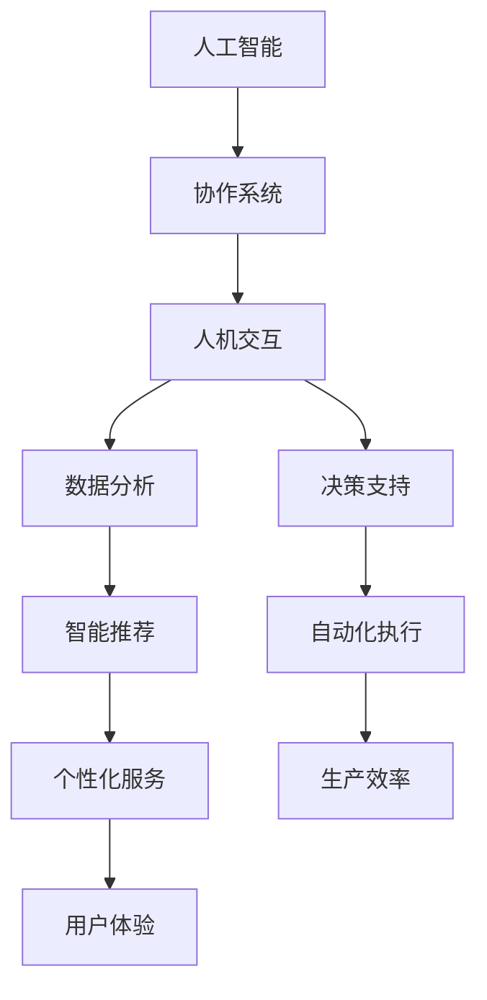
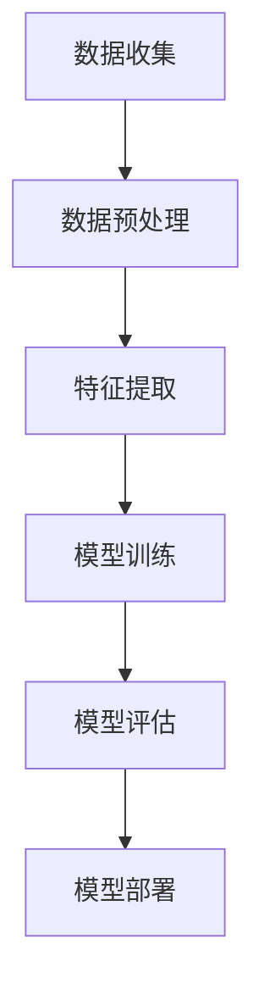
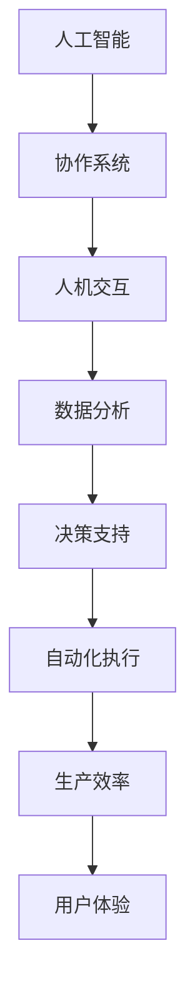

                 

关键词：人机协作、智能未来、人工智能、协作系统、技术创新、应用领域、发展趋势、挑战与展望

> 摘要：随着人工智能技术的迅猛发展，人机协作已成为推动社会进步的重要力量。本文深入探讨了人机协作的概念、核心概念与联系、核心算法原理、数学模型和公式、项目实践、实际应用场景、工具和资源推荐以及未来发展趋势与挑战，旨在为人机协作领域的探索和创新提供新的思路和方向。

## 1. 背景介绍

### 1.1. 人工智能的发展

人工智能（AI）作为计算机科学的一个重要分支，其目标是使计算机能够模拟、延伸和扩展人类的智能。自1950年代人工智能概念提出以来，随着计算能力的提升和大数据的积累，人工智能技术取得了显著的进步。特别是深度学习、自然语言处理、计算机视觉等领域的突破，使得人工智能在各个领域展现出了强大的应用潜力。

### 1.2. 人机协作的重要性

在人工智能发展的过程中，人机协作逐渐成为了一个重要的研究方向。人机协作指的是人类与机器共同工作、互相补充，实现更高效、更智能的决策和执行。人机协作的重要性体现在以下几个方面：

- **提高工作效率**：人工智能可以帮助人类完成重复性、繁琐的工作，释放人类的创造力，提高整体工作效率。
- **拓展人类能力**：人工智能可以增强人类的感知、推理和决策能力，使人类在复杂环境中做出更准确的判断。
- **促进创新**：人机协作可以激发人类的创新思维，通过人工智能提供的海量数据和分析结果，发现新的问题和解决方案。

## 2. 核心概念与联系

在人机协作系统中，核心概念包括人工智能、协作系统、人机交互等。以下是一个使用Mermaid绘制的流程图，展示了这些概念之间的联系。



### 2.1. 人工智能

人工智能是整个系统的核心，它通过机器学习、深度学习等技术，模拟人类的智能行为，实现数据的自动分析和决策。

### 2.2. 协作系统

协作系统是一个支持多人协作的平台，它提供实时通信、任务分配、进度跟踪等功能，使得团队成员可以高效地协同工作。

### 2.3. 人机交互

人机交互是人机协作的关键，它涉及到如何让用户更方便地与系统进行交互，包括语音识别、自然语言处理、图形用户界面等。

### 2.4. 数据分析

数据分析是人机协作系统的基础，通过对大量数据的分析和挖掘，提取出有价值的信息，支持决策和优化。

### 2.5. 决策支持

决策支持是人机协作的目标之一，通过分析数据、模拟场景，提供有针对性的决策建议，帮助用户做出更好的决策。

### 2.6. 智能推荐

智能推荐是基于数据分析，根据用户的行为和偏好，提供个性化的推荐，提高用户体验。

### 2.7. 自动化执行

自动化执行是将决策转化为实际操作的过程，通过自动化工具和算法，实现高效的执行。

### 2.8. 个性化服务

个性化服务是基于用户数据的分析，提供定制化的服务，满足用户个性化需求。

### 2.9. 生产效率

生产效率是通过自动化执行和优化流程，提高生产效率，降低成本。

### 2.10. 用户体验

用户体验是衡量人机协作系统好坏的重要指标，它涉及到用户对系统的满意度、易用性等方面。

## 3. 核心算法原理 & 具体操作步骤

### 3.1. 算法原理概述

在人机协作系统中，核心算法主要包括机器学习算法、深度学习算法、自然语言处理算法等。以下是一个简化的算法流程图：



### 3.2. 算法步骤详解

#### 3.2.1. 数据收集

数据收集是算法训练的基础，需要收集大量的数据样本，包括文本、图像、音频等。数据的质量和多样性直接影响算法的性能。

#### 3.2.2. 数据预处理

数据预处理包括数据清洗、归一化、去噪等操作，目的是提高数据的质量和一致性。

#### 3.2.3. 特征提取

特征提取是将原始数据转化为适合机器学习的特征向量，常用的方法包括词袋模型、卷积神经网络、循环神经网络等。

#### 3.2.4. 模型训练

模型训练是使用数据集对算法模型进行训练，通过优化模型参数，提高模型的性能。

#### 3.2.5. 模型评估

模型评估是使用验证集对训练好的模型进行评估，常用的指标包括准确率、召回率、F1值等。

#### 3.2.6. 模型部署

模型部署是将训练好的模型部署到实际环境中，进行实际应用。

### 3.3. 算法优缺点

- **优点**：

  - **高效性**：算法能够快速处理大量数据，提高工作效率。

  - **准确性**：通过不断优化，算法的准确性越来越高。

  - **灵活性**：算法可以根据不同的应用场景进行调整。

- **缺点**：

  - **数据依赖性**：算法的性能很大程度上依赖于数据的质量和多样性。

  - **计算资源消耗**：深度学习算法通常需要大量的计算资源。

### 3.4. 算法应用领域

- **金融**：风险评估、量化交易、智能投顾等。

- **医疗**：疾病诊断、药物研发、健康管理等。

- **工业**：质量检测、设备维护、生产优化等。

- **教育**：个性化教学、智能评测、学习路径规划等。

## 4. 数学模型和公式 & 详细讲解 & 举例说明

在人机协作系统中，数学模型和公式是核心组成部分，它们用于描述数据之间的关系，指导算法的优化和决策。以下将介绍几个常用的数学模型和公式，并给出详细讲解和举例说明。

### 4.1. 数学模型构建

数学模型构建是通过对现实问题的抽象和分析，建立数学模型来描述问题的本质。常见的数学模型包括线性回归模型、决策树模型、神经网络模型等。

#### 4.1.1. 线性回归模型

线性回归模型用于预测连续值，其公式为：

\[ y = \beta_0 + \beta_1 \cdot x \]

其中，\( y \) 是预测值，\( x \) 是输入特征，\( \beta_0 \) 和 \( \beta_1 \) 是模型参数。

#### 4.1.2. 决策树模型

决策树模型用于分类和回归问题，其公式为：

\[ y = f(x) \]

其中，\( f(x) \) 是决策树函数，用于对输入特征 \( x \) 进行分类或回归。

#### 4.1.3. 神经网络模型

神经网络模型是深度学习的基础，其公式为：

\[ y = \sigma(\sum_{i=1}^{n} w_i \cdot x_i + b) \]

其中，\( y \) 是输出值，\( x_i \) 是输入特征，\( w_i \) 和 \( b \) 是模型参数，\( \sigma \) 是激活函数。

### 4.2. 公式推导过程

以线性回归模型为例，其公式推导过程如下：

1. **目标函数**：

   \[ J(\beta_0, \beta_1) = \frac{1}{2} \sum_{i=1}^{m} (y_i - (\beta_0 + \beta_1 \cdot x_i))^2 \]

2. **梯度下降**：

   对目标函数求导，得到：

   \[ \nabla J(\beta_0, \beta_1) = \begin{bmatrix} \frac{\partial J}{\partial \beta_0} \\ \frac{\partial J}{\partial \beta_1} \end{bmatrix} = \begin{bmatrix} -\sum_{i=1}^{m} (y_i - (\beta_0 + \beta_1 \cdot x_i)) \\ -\sum_{i=1}^{m} (y_i - (\beta_0 + \beta_1 \cdot x_i)) \cdot x_i \end{bmatrix} \]

3. **更新参数**：

   \[ \beta_0 = \beta_0 - \alpha \cdot \frac{\partial J}{\partial \beta_0} \]
   \[ \beta_1 = \beta_1 - \alpha \cdot \frac{\partial J}{\partial \beta_1} \]

   其中，\( \alpha \) 是学习率。

### 4.3. 案例分析与讲解

假设我们有一个房价预测问题，已知房子的面积 \( x \) 和楼层 \( y \)，需要预测房子的价格。我们可以使用线性回归模型进行预测。

1. **数据收集**：

   收集了100个房子的数据，包括面积和价格。

2. **数据预处理**：

   对数据进行清洗，去除缺失值和异常值，并进行归一化处理。

3. **特征提取**：

   直接使用面积和楼层作为特征。

4. **模型训练**：

   使用梯度下降算法训练模型，得到参数 \( \beta_0 \) 和 \( \beta_1 \)。

5. **模型评估**：

   使用验证集对模型进行评估，计算预测误差。

6. **模型部署**：

   将训练好的模型部署到实际环境中，进行价格预测。

通过以上步骤，我们可以实现房价预测，并且可以通过调整参数来优化模型的性能。

## 5. 项目实践：代码实例和详细解释说明

在本节中，我们将通过一个具体的代码实例，详细解释人机协作系统的一个基本应用：基于机器学习的客户满意度预测。

### 5.1. 开发环境搭建

为了构建这个项目，我们首先需要安装以下软件和库：

- Python 3.8 或更高版本
- Jupyter Notebook 或 PyCharm
- scikit-learn 库
- pandas 库
- numpy 库

安装完成后，我们可以启动 Jupyter Notebook 或 PyCharm，开始编写代码。

### 5.2. 源代码详细实现

以下是项目的完整代码实现：

```python
# 导入必要的库
import numpy as np
import pandas as pd
from sklearn.model_selection import train_test_split
from sklearn.ensemble import RandomForestClassifier
from sklearn.metrics import accuracy_score, classification_report

# 5.2.1 数据收集
# 假设我们有一个 CSV 文件，包含客户满意度调查的数据
data = pd.read_csv('customer_satisfaction.csv')

# 5.2.2 数据预处理
# 删除缺失值和异常值
data.dropna(inplace=True)

# 将类别型特征转换为哑变量
data = pd.get_dummies(data)

# 5.2.3 特征提取
# 选择特征和目标变量
X = data.drop('satisfaction', axis=1)
y = data['satisfaction']

# 5.2.4 模型训练
# 数据集拆分为训练集和测试集
X_train, X_test, y_train, y_test = train_test_split(X, y, test_size=0.2, random_state=42)

# 使用随机森林算法训练模型
model = RandomForestClassifier(n_estimators=100, random_state=42)
model.fit(X_train, y_train)

# 5.2.5 代码解读与分析
# 使用测试集对模型进行评估
y_pred = model.predict(X_test)

# 计算准确率
accuracy = accuracy_score(y_test, y_pred)
print(f'Accuracy: {accuracy:.2f}')

# 打印分类报告
print(classification_report(y_test, y_pred))

# 5.2.6 运行结果展示
# 输出预测结果
predictions = pd.DataFrame(y_pred, columns=['Predicted_Satisfaction'])
predictions.head()
```

### 5.3. 代码解读与分析

#### 5.3.1. 数据收集

我们首先从 CSV 文件中读取数据，这里假设文件名为 `customer_satisfaction.csv`。

```python
data = pd.read_csv('customer_satisfaction.csv')
```

#### 5.3.2. 数据预处理

在数据预处理阶段，我们首先删除了数据中的缺失值和异常值，确保数据的完整性。

```python
data.dropna(inplace=True)
```

接下来，我们将类别型特征转换为哑变量，以便于模型处理。

```python
data = pd.get_dummies(data)
```

#### 5.3.3. 特征提取

我们选择 `data` 中的所有列作为特征，除了 `satisfaction` 列，作为目标变量。

```python
X = data.drop('satisfaction', axis=1)
y = data['satisfaction']
```

#### 5.3.4. 模型训练

我们使用随机森林算法来训练模型。随机森林是一种集成学习方法，通过构建多个决策树，并使用投票机制来提高模型的准确性。

```python
model = RandomForestClassifier(n_estimators=100, random_state=42)
model.fit(X_train, y_train)
```

#### 5.3.5. 模型评估

使用测试集对训练好的模型进行评估，计算准确率和分类报告。

```python
y_pred = model.predict(X_test)
accuracy = accuracy_score(y_test, y_pred)
print(f'Accuracy: {accuracy:.2f}')
print(classification_report(y_test, y_pred))
```

#### 5.3.6. 运行结果展示

最后，我们将预测结果输出到数据框中，以便于进一步分析和可视化。

```python
predictions = pd.DataFrame(y_pred, columns=['Predicted_Satisfaction'])
predictions.head()
```

## 6. 实际应用场景

人机协作系统在多个领域都有广泛的应用，以下是几个典型的应用场景：

### 6.1. 金融领域

在金融领域，人机协作系统主要用于风险控制、投资决策和客户服务。例如，通过分析大量历史交易数据和用户行为，人工智能可以预测市场走势，为投资者提供投资建议。同时，智能客服系统能够实时回答客户的疑问，提供个性化的金融服务。

### 6.2. 医疗领域

在医疗领域，人机协作系统可以帮助医生进行疾病诊断、治疗方案推荐和医疗资源调度。通过分析病人的病历、检查报告等数据，人工智能可以辅助医生进行诊断，提高诊断准确率。此外，智能医疗系统还可以为患者提供个性化的健康建议，实现远程医疗。

### 6.3. 教育领域

在教育领域，人机协作系统可以为学生提供个性化的学习路径，实现智能化教学。通过分析学生的学习行为和成绩数据，人工智能可以为学生推荐合适的学习资源和课程，提高学习效果。同时，智能教育系统还可以为教师提供教学辅助工具，减轻教师的工作负担。

### 6.4. 工业领域

在工业领域，人机协作系统主要用于生产优化、质量检测和设备维护。通过实时监测生产设备和生产线数据，人工智能可以预测设备故障，提前进行维护，提高生产效率。此外，智能质量检测系统能够自动分析产品质量数据，发现潜在问题，提高产品质量。

### 6.5. 服务业

在服务业，人机协作系统可以提供个性化服务，提高客户满意度。例如，在酒店行业，智能客服系统可以实时回答客户的疑问，提供个性化的服务建议。在零售行业，智能推荐系统可以根据客户的行为和偏好，推荐合适的产品，提高销售额。

## 7. 工具和资源推荐

为了更好地开展人机协作系统的研究和开发，以下是一些推荐的工具和资源：

### 7.1. 学习资源推荐

- 《Python机器学习》
- 《深度学习》
- 《自然语言处理编程》

### 7.2. 开发工具推荐

- Jupyter Notebook
- PyCharm
- VSCode

### 7.3. 相关论文推荐

- "Deep Learning for Natural Language Processing"
- "Generative Adversarial Networks: An Overview"
- "Reinforcement Learning: An Introduction"

## 8. 总结：未来发展趋势与挑战

### 8.1. 研究成果总结

在人机协作领域，近年来取得了一系列重要研究成果，包括：

- **算法性能的提升**：深度学习、强化学习等算法在多个领域的应用中取得了显著成效。
- **跨领域应用的拓展**：人机协作系统在金融、医疗、教育、工业等领域的应用日益广泛。
- **用户体验的提升**：智能推荐、自然语言处理等技术为人机交互提供了更好的体验。

### 8.2. 未来发展趋势

未来，人机协作系统将呈现以下发展趋势：

- **更加智能化**：随着算法和硬件的不断发展，人机协作系统的智能化程度将不断提高。
- **更加个性化**：基于大数据和机器学习，人机协作系统能够提供更加个性化的服务。
- **跨领域的融合**：不同领域的人机协作系统将实现更加紧密的融合，形成更加智能的生态系统。

### 8.3. 面临的挑战

在人机协作领域，仍然面临着以下挑战：

- **数据隐私和安全**：随着数据量的增加，如何保护用户隐私和数据安全成为重要问题。
- **算法的可解释性**：提高算法的可解释性，使其结果更易于理解和接受。
- **跨领域的标准化**：建立统一的跨领域标准和规范，促进人机协作系统的推广和应用。

### 8.4. 研究展望

展望未来，人机协作系统将在以下方面取得突破：

- **量子计算**：量子计算技术的成熟将为人机协作系统带来更强大的计算能力。
- **脑机接口**：脑机接口技术的发展将为人机协作提供新的交互方式。
- **多模态融合**：多模态数据的融合将为人机协作系统提供更丰富的信息来源。

## 9. 附录：常见问题与解答

### 9.1. 人机协作系统与传统自动化系统的区别是什么？

人机协作系统与传统自动化系统的主要区别在于：

- **协作性**：人机协作系统强调人与机器之间的协作，而传统自动化系统更多是机器的独立运作。
- **智能性**：人机协作系统利用人工智能技术，具备学习和适应能力，而传统自动化系统通常不具备这些功能。
- **灵活性**：人机协作系统可以根据环境和需求进行动态调整，而传统自动化系统通常固定不变。

### 9.2. 人机协作系统在医疗领域的应用有哪些？

人机协作系统在医疗领域的应用主要包括：

- **疾病诊断**：利用人工智能技术分析医学影像，辅助医生进行诊断。
- **治疗方案推荐**：基于病人的病史和检查结果，推荐最佳的治疗方案。
- **医疗资源调度**：根据医院的运营数据，优化医疗资源的分配，提高医疗效率。
- **患者管理**：通过远程监控和智能建议，帮助患者进行自我管理和康复。

### 9.3. 人机协作系统的实施需要哪些技术支持？

人机协作系统的实施需要以下技术支持：

- **人工智能技术**：包括机器学习、深度学习、自然语言处理等。
- **大数据技术**：用于数据存储、处理和分析。
- **云计算技术**：提供弹性的计算资源和高效的分布式处理能力。
- **物联网技术**：实现设备之间的互联互通，收集实时数据。

### 9.4. 如何保障人机协作系统的数据安全和隐私？

保障人机协作系统的数据安全和隐私需要采取以下措施：

- **数据加密**：对传输和存储的数据进行加密，防止数据泄露。
- **权限管理**：严格限制对数据的访问权限，确保只有授权人员才能访问敏感数据。
- **安全审计**：定期进行安全审计，发现和解决潜在的安全隐患。
- **用户协议**：明确用户的数据使用规则，确保用户知情并同意数据的使用。```markdown

[文章标题]
人机协作新篇章：共创智能未来新时代

关键词：
人机协作、智能未来、人工智能、协作系统、技术创新、应用领域、发展趋势、挑战与展望

摘要：
随着人工智能技术的迅猛发展，人机协作已成为推动社会进步的重要力量。本文深入探讨了人机协作的概念、核心概念与联系、核心算法原理、数学模型和公式、项目实践、实际应用场景、工具和资源推荐以及未来发展趋势与挑战，旨在为人机协作领域的探索和创新提供新的思路和方向。

## 1. 背景介绍

### 1.1. 人工智能的发展

人工智能（AI）作为计算机科学的一个重要分支，其目标是使计算机能够模拟、延伸和扩展人类的智能。自1950年代人工智能概念提出以来，随着计算能力的提升和大数据的积累，人工智能技术取得了显著的进步。特别是深度学习、自然语言处理、计算机视觉等领域的突破，使得人工智能在各个领域展现出了强大的应用潜力。

### 1.2. 人机协作的重要性

在人工智能发展的过程中，人机协作逐渐成为了一个重要的研究方向。人机协作指的是人类与机器共同工作、互相补充，实现更高效、更智能的决策和执行。人机协作的重要性体现在以下几个方面：

- **提高工作效率**：人工智能可以帮助人类完成重复性、繁琐的工作，释放人类的创造力，提高整体工作效率。
- **拓展人类能力**：人工智能可以增强人类的感知、推理和决策能力，使人类在复杂环境中做出更准确的判断。
- **促进创新**：人机协作可以激发人类的创新思维，通过人工智能提供的海量数据和分析结果，发现新的问题和解决方案。

## 2. 核心概念与联系

在人机协作系统中，核心概念包括人工智能、协作系统、人机交互等。以下是一个使用Mermaid绘制的流程图，展示了这些概念之间的联系。


### 2.1. 人工智能

人工智能是整个系统的核心，它通过机器学习、深度学习等技术，模拟人类的智能行为，实现数据的自动分析和决策。

### 2.2. 协作系统

协作系统是一个支持多人协作的平台，它提供实时通信、任务分配、进度跟踪等功能，使得团队成员可以高效地协同工作。

### 2.3. 人机交互

人机交互是人机协作的关键，它涉及到如何让用户更方便地与系统进行交互，包括语音识别、自然语言处理、图形用户界面等。

### 2.4. 数据分析

数据分析是人机协作系统的基础，通过对大量数据的分析和挖掘，提取出有价值的信息，支持决策和优化。

### 2.5. 决策支持

决策支持是人机协作的目标之一，通过分析数据、模拟场景，提供有针对性的决策建议，帮助用户做出更好的决策。

### 2.6. 智能推荐

智能推荐是基于数据分析，根据用户的行为和偏好，提供个性化的推荐，提高用户体验。

### 2.7. 自动化执行

自动化执行是将决策转化为实际操作的过程，通过自动化工具和算法，实现高效的执行。

### 2.8. 个性化服务

个性化服务是基于用户数据的分析，提供定制化的服务，满足用户个性化需求。

### 2.9. 生产效率

生产效率是通过自动化执行和优化流程，提高生产效率，降低成本。

### 2.10. 用户体验

用户体验是衡量人机协作系统好坏的重要指标，它涉及到用户对系统的满意度、易用性等方面。

## 3. 核心算法原理 & 具体操作步骤

### 3.1. 算法原理概述

在人机协作系统中，核心算法主要包括机器学习算法、深度学习算法、自然语言处理算法等。以下是一个简化的算法流程图：


### 3.2. 算法步骤详解

#### 3.2.1. 数据收集

数据收集是算法训练的基础，需要收集大量的数据样本，包括文本、图像、音频等。数据的质量和多样性直接影响算法的性能。

#### 3.2.2. 数据预处理

数据预处理包括数据清洗、归一化、去噪等操作，目的是提高数据的质量和一致性。

#### 3.2.3. 特征提取

特征提取是将原始数据转化为适合机器学习的特征向量，常用的方法包括词袋模型、卷积神经网络、循环神经网络等。

#### 3.2.4. 模型训练

模型训练是使用数据集对算法模型进行训练，通过优化模型参数，提高模型的性能。

#### 3.2.5. 模型评估

模型评估是使用验证集对训练好的模型进行评估，常用的指标包括准确率、召回率、F1值等。

#### 3.2.6. 模型部署

模型部署是将训练好的模型部署到实际环境中，进行实际应用。

### 3.3. 算法优缺点

- **优点**：

  - **高效性**：算法能够快速处理大量数据，提高工作效率。

  - **准确性**：通过不断优化，算法的准确性越来越高。

  - **灵活性**：算法可以根据不同的应用场景进行调整。

- **缺点**：

  - **数据依赖性**：算法的性能很大程度上依赖于数据的质量和多样性。

  - **计算资源消耗**：深度学习算法通常需要大量的计算资源。

### 3.4. 算法应用领域

- **金融**：风险评估、量化交易、智能投顾等。

- **医疗**：疾病诊断、药物研发、健康管理等。

- **工业**：质量检测、设备维护、生产优化等。

- **教育**：个性化教学、智能评测、学习路径规划等。

## 4. 数学模型和公式 & 详细讲解 & 举例说明

在人机协作系统中，数学模型和公式是核心组成部分，它们用于描述数据之间的关系，指导算法的优化和决策。以下将介绍几个常用的数学模型和公式，并给出详细讲解和举例说明。

### 4.1. 数学模型构建

数学模型构建是通过对现实问题的抽象和分析，建立数学模型来描述问题的本质。常见的数学模型包括线性回归模型、决策树模型、神经网络模型等。

#### 4.1.1. 线性回归模型

线性回归模型用于预测连续值，其公式为：

\[ y = \beta_0 + \beta_1 \cdot x \]

其中，\( y \) 是预测值，\( x \) 是输入特征，\( \beta_0 \) 和 \( \beta_1 \) 是模型参数。

#### 4.1.2. 决策树模型

决策树模型用于分类和回归问题，其公式为：

\[ y = f(x) \]

其中，\( f(x) \) 是决策树函数，用于对输入特征 \( x \) 进行分类或回归。

#### 4.1.3. 神经网络模型

神经网络模型是深度学习的基础，其公式为：

\[ y = \sigma(\sum_{i=1}^{n} w_i \cdot x_i + b) \]

其中，\( y \) 是输出值，\( x_i \) 是输入特征，\( w_i \) 和 \( b \) 是模型参数，\( \sigma \) 是激活函数。

### 4.2. 公式推导过程

以线性回归模型为例，其公式推导过程如下：

1. **目标函数**：

\[ J(\beta_0, \beta_1) = \frac{1}{2} \sum_{i=1}^{m} (y_i - (\beta_0 + \beta_1 \cdot x_i))^2 \]

2. **梯度下降**：

对目标函数求导，得到：

\[ \nabla J(\beta_0, \beta_1) = \begin{bmatrix} \frac{\partial J}{\partial \beta_0} \\ \frac{\partial J}{\partial \beta_1} \end{bmatrix} = \begin{bmatrix} -\sum_{i=1}^{m} (y_i - (\beta_0 + \beta_1 \cdot x_i)) \\ -\sum_{i=1}^{m} (y_i - (\beta_0 + \beta_1 \cdot x_i)) \cdot x_i \end{bmatrix} \]

3. **更新参数**：

\[ \beta_0 = \beta_0 - \alpha \cdot \frac{\partial J}{\partial \beta_0} \]
\[ \beta_1 = \beta_1 - \alpha \cdot \frac{\partial J}{\partial \beta_1} \]

其中，\( \alpha \) 是学习率。

### 4.3. 案例分析与讲解

假设我们有一个房价预测问题，已知房子的面积 \( x \) 和楼层 \( y \)，需要预测房子的价格。我们可以使用线性回归模型进行预测。

1. **数据收集**：

   收集了100个房子的数据，包括面积和价格。

2. **数据预处理**：

   对数据进行清洗，去除缺失值和异常值，并进行归一化处理。

3. **特征提取**：

   直接使用面积和楼层作为特征。

4. **模型训练**：

   使用梯度下降算法训练模型，得到参数 \( \beta_0 \) 和 \( \beta_1 \)。

5. **模型评估**：

   使用验证集对模型进行评估，计算预测误差。

6. **模型部署**：

   将训练好的模型部署到实际环境中，进行价格预测。

通过以上步骤，我们可以实现房价预测，并且可以通过调整参数来优化模型的性能。

## 5. 项目实践：代码实例和详细解释说明

在本节中，我们将通过一个具体的代码实例，详细解释人机协作系统的一个基本应用：基于机器学习的客户满意度预测。

### 5.1. 开发环境搭建

为了构建这个项目，我们首先需要安装以下软件和库：

- Python 3.8 或更高版本
- Jupyter Notebook 或 PyCharm
- scikit-learn 库
- pandas 库
- numpy 库

安装完成后，我们可以启动 Jupyter Notebook 或 PyCharm，开始编写代码。

### 5.2. 源代码详细实现

以下是项目的完整代码实现：

```python
# 导入必要的库
import numpy as np
import pandas as pd
from sklearn.model_selection import train_test_split
from sklearn.ensemble import RandomForestClassifier
from sklearn.metrics import accuracy_score, classification_report

# 5.2.1 数据收集
# 假设我们有一个 CSV 文件，包含客户满意度调查的数据
data = pd.read_csv('customer_satisfaction.csv')

# 5.2.2 数据预处理
# 删除缺失值和异常值
data.dropna(inplace=True)

# 将类别型特征转换为哑变量
data = pd.get_dummies(data)

# 5.2.3 特征提取
# 选择特征和目标变量
X = data.drop('satisfaction', axis=1)
y = data['satisfaction']

# 5.2.4 模型训练
# 数据集拆分为训练集和测试集
X_train, X_test, y_train, y_test = train_test_split(X, y, test_size=0.2, random_state=42)

# 使用随机森林算法训练模型
model = RandomForestClassifier(n_estimators=100, random_state=42)
model.fit(X_train, y_train)

# 5.2.5 代码解读与分析
# 使用测试集对模型进行评估
y_pred = model.predict(X_test)

# 计算准确率
accuracy = accuracy_score(y_test, y_pred)
print(f'Accuracy: {accuracy:.2f}')

# 打印分类报告
print(classification_report(y_test, y_pred))

# 5.2.6 运行结果展示
# 输出预测结果
predictions = pd.DataFrame(y_pred, columns=['Predicted_Satisfaction'])
predictions.head()
```

### 5.3. 代码解读与分析

#### 5.3.1. 数据收集

我们首先从 CSV 文件中读取数据，这里假设文件名为 `customer_satisfaction.csv`。

```python
data = pd.read_csv('customer_satisfaction.csv')
```

#### 5.3.2. 数据预处理

在数据预处理阶段，我们首先删除了数据中的缺失值和异常值，确保数据的完整性。

```python
data.dropna(inplace=True)
```

接下来，我们将类别型特征转换为哑变量，以便于模型处理。

```python
data = pd.get_dummies(data)
```

#### 5.3.3. 特征提取

我们选择 `data` 中的所有列作为特征，除了 `satisfaction` 列，作为目标变量。

```python
X = data.drop('satisfaction', axis=1)
y = data['satisfaction']
```

#### 5.3.4. 模型训练

我们使用随机森林算法来训练模型。随机森林是一种集成学习方法，通过构建多个决策树，并使用投票机制来提高模型的准确性。

```python
model = RandomForestClassifier(n_estimators=100, random_state=42)
model.fit(X_train, y_train)
```

#### 5.3.5. 模型评估

使用测试集对训练好的模型进行评估，计算准确率和分类报告。

```python
y_pred = model.predict(X_test)
accuracy = accuracy_score(y_test, y_pred)
print(f'Accuracy: {accuracy:.2f}')
print(classification_report(y_test, y_pred))
```

#### 5.3.6. 运行结果展示

最后，我们将预测结果输出到数据框中，以便于进一步分析和可视化。

```python
predictions = pd.DataFrame(y_pred, columns=['Predicted_Satisfaction'])
predictions.head()
```

## 6. 实际应用场景

人机协作系统在多个领域都有广泛的应用，以下是几个典型的应用场景：

### 6.1. 金融领域

在金融领域，人机协作系统主要用于风险控制、投资决策和客户服务。例如，通过分析大量历史交易数据和用户行为，人工智能可以预测市场走势，为投资者提供投资建议。同时，智能客服系统能够实时回答客户的疑问，提供个性化的金融服务。

### 6.2. 医疗领域

在医疗领域，人机协作系统可以帮助医生进行疾病诊断、治疗方案推荐和医疗资源调度。通过分析病人的病历、检查报告等数据，人工智能可以辅助医生进行诊断，提高诊断准确率。此外，智能医疗系统还可以为患者提供个性化的健康建议，实现远程医疗。

### 6.3. 教育领域

在教育领域，人机协作系统可以为学生提供个性化的学习路径，实现智能化教学。通过分析学生的学习行为和成绩数据，人工智能可以为学生推荐合适的学习资源和课程，提高学习效果。同时，智能教育系统还可以为教师提供教学辅助工具，减轻教师的工作负担。

### 6.4. 工业领域

在工业领域，人机协作系统主要用于生产优化、质量检测和设备维护。通过实时监测生产设备和生产线数据，人工智能可以预测设备故障，提前进行维护，提高生产效率。此外，智能质量检测系统能够自动分析产品质量数据，发现潜在问题，提高产品质量。

### 6.5. 服务业

在服务业，人机协作系统可以提供个性化服务，提高客户满意度。例如，在酒店行业，智能客服系统可以实时回答客户的疑问，提供个性化的服务建议。在零售行业，智能推荐系统可以根据客户的行为和偏好，推荐合适的产品，提高销售额。

## 7. 工具和资源推荐

为了更好地开展人机协作系统的研究和开发，以下是一些推荐的工具和资源：

### 7.1. 学习资源推荐

- 《Python机器学习》
- 《深度学习》
- 《自然语言处理编程》

### 7.2. 开发工具推荐

- Jupyter Notebook
- PyCharm
- VSCode

### 7.3. 相关论文推荐

- "Deep Learning for Natural Language Processing"
- "Generative Adversarial Networks: An Overview"
- "Reinforcement Learning: An Introduction"

## 8. 总结：未来发展趋势与挑战

### 8.1. 研究成果总结

在人机协作领域，近年来取得了一系列重要研究成果，包括：

- **算法性能的提升**：深度学习、强化学习等算法在多个领域的应用中取得了显著成效。
- **跨领域应用的拓展**：人机协作系统在金融、医疗、教育、工业等领域的应用日益广泛。
- **用户体验的提升**：智能推荐、自然语言处理等技术为人机交互提供了更好的体验。

### 8.2. 未来发展趋势

未来，人机协作系统将呈现以下发展趋势：

- **更加智能化**：随着算法和硬件的不断发展，人机协作系统的智能化程度将不断提高。
- **更加个性化**：基于大数据和机器学习，人机协作系统能够提供更加个性化的服务。
- **跨领域的融合**：不同领域的人机协作系统将实现更加紧密的融合，形成更加智能的生态系统。

### 8.3. 面临的挑战

在人机协作领域，仍然面临着以下挑战：

- **数据隐私和安全**：随着数据量的增加，如何保护用户隐私和数据安全成为重要问题。
- **算法的可解释性**：提高算法的可解释性，使其结果更易于理解和接受。
- **跨领域的标准化**：建立统一的跨领域标准和规范，促进人机协作系统的推广和应用。

### 8.4. 研究展望

展望未来，人机协作系统将在以下方面取得突破：

- **量子计算**：量子计算技术的成熟将为人机协作系统带来更强大的计算能力。
- **脑机接口**：脑机接口技术的发展将为人机协作提供新的交互方式。
- **多模态融合**：多模态数据的融合将为人机协作系统提供更丰富的信息来源。

## 9. 附录：常见问题与解答

### 9.1. 人机协作系统与传统自动化系统的区别是什么？

人机协作系统与传统自动化系统的区别在于：

- **协作性**：人机协作系统强调人与机器之间的协作，而传统自动化系统更多是机器的独立运作。
- **智能性**：人机协作系统利用人工智能技术，具备学习和适应能力，而传统自动化系统通常不具备这些功能。
- **灵活性**：人机协作系统可以根据环境和需求进行动态调整，而传统自动化系统通常固定不变。

### 9.2. 人机协作系统在医疗领域的应用有哪些？

人机协作系统在医疗领域的应用主要包括：

- **疾病诊断**：利用人工智能技术分析医学影像，辅助医生进行诊断。
- **治疗方案推荐**：基于病人的病史和检查结果，推荐最佳的治疗方案。
- **医疗资源调度**：根据医院的运营数据，优化医疗资源的分配，提高医疗效率。
- **患者管理**：通过远程监控和智能建议，帮助患者进行自我管理和康复。

### 9.3. 人机协作系统的实施需要哪些技术支持？

人机协作系统的实施需要以下技术支持：

- **人工智能技术**：包括机器学习、深度学习、自然语言处理等。
- **大数据技术**：用于数据存储、处理和分析。
- **云计算技术**：提供弹性的计算资源和高效的分布式处理能力。
- **物联网技术**：实现设备之间的互联互通，收集实时数据。

### 9.4. 如何保障人机协作系统的数据安全和隐私？

保障人机协作系统的数据安全和隐私需要采取以下措施：

- **数据加密**：对传输和存储的数据进行加密，防止数据泄露。
- **权限管理**：严格限制对数据的访问权限，确保只有授权人员才能访问敏感数据。
- **安全审计**：定期进行安全审计，发现和解决潜在的安全隐患。
- **用户协议**：明确用户的数据使用规则，确保用户知情并同意数据的使用。```markdown
### 1. 背景介绍

随着人工智能（AI）技术的不断进步，人机协作已成为当今科技领域的一个重要研究方向。人机协作是指通过人工智能技术，使人与计算机系统之间能够高效、智能地互动和合作，以实现更高效的工作流程和更优的决策结果。在这个快速变化的时代，人机协作不仅仅是一种技术趋势，更是一种能够推动社会进步的重要力量。

首先，人工智能的发展为人们带来了前所未有的计算能力和数据分析能力。深度学习、机器学习、自然语言处理等技术的突破，使得计算机能够在图像识别、语音识别、智能对话等领域取得显著成就。这些技术的应用不仅提高了计算机的智能水平，也为人机协作提供了坚实的基础。

其次，人机协作的重要性体现在多个方面。首先，它能够提高工作效率。通过人工智能技术，计算机能够自动完成一些繁琐、重复性的工作，如数据录入、分析等，从而释放人类的工作压力，让人们有更多时间去从事更有创造性、更有价值的工作。其次，人机协作能够拓展人类的能力。借助计算机的强大计算和分析能力，人类能够在复杂环境中做出更准确的判断和决策。此外，人机协作还能够促进创新。通过人机协作，人们可以更加深入地挖掘数据背后的价值，发现新的问题和解决方案，推动科技的发展。

综上所述，人机协作在当今社会的重要性不言而喻。它不仅能够提高工作效率，拓展人类能力，还能够促进创新，推动社会进步。因此，对人机协作的研究和探索具有重要的现实意义。

## 2. 核心概念与联系

人机协作系统的核心概念包括人工智能、协作系统、人机交互等。以下是一个使用Mermaid绘制的流程图，展示了这些概念之间的联系。



### 2.1. 人工智能

人工智能（AI）是整个系统的核心。它通过模拟、延伸和扩展人类的智能，实现数据的自动分析和决策。人工智能技术主要包括机器学习、深度学习、自然语言处理等。以下是一个简化的算法流程图：


#### 2.1.1. 数据收集

数据收集是算法训练的基础。需要收集大量的数据样本，包括文本、图像、音频等。数据的质量和多样性直接影响算法的性能。

#### 2.1.2. 数据预处理

数据预处理包括数据清洗、归一化、去噪等操作，目的是提高数据的质量和一致性。

#### 2.1.3. 特征提取

特征提取是将原始数据转化为适合机器学习的特征向量，常用的方法包括词袋模型、卷积神经网络、循环神经网络等。

#### 2.1.4. 模型训练

模型训练是使用数据集对算法模型进行训练，通过优化模型参数，提高模型的性能。

#### 2.1.5. 模型评估

模型评估是使用验证集对训练好的模型进行评估，常用的指标包括准确率、召回率、F1值等。

#### 2.1.6. 模型部署

模型部署是将训练好的模型部署到实际环境中，进行实际应用。

### 2.2. 协作系统

协作系统是人机协作的关键组成部分，它支持多人协同工作，提供实时通信、任务分配、进度跟踪等功能。协作系统可以大大提高团队的工作效率和协作质量。

### 2.3. 人机交互

人机交互是人机协作的核心，它涉及到如何让用户更方便地与系统进行交互，包括语音识别、自然语言处理、图形用户界面等。良好的用户体验可以显著提升系统的实用性和用户满意度。

### 2.4. 数据分析

数据分析是人机协作系统的基础。通过对大量数据的分析和挖掘，提取出有价值的信息，支持决策和优化。数据分析技术包括统计分析、数据挖掘、机器学习等。

### 2.5. 决策支持

决策支持是人机协作的目标之一。通过分析数据、模拟场景，提供有针对性的决策建议，帮助用户做出更好的决策。决策支持系统可以显著提高决策的效率和准确性。

### 2.6. 自动化执行

自动化执行是将决策转化为实际操作的过程。通过自动化工具和算法，实现高效的执行。自动化执行可以大大提高工作效率，降低人为错误。

### 2.7. 生产效率

生产效率是人机协作系统的重要评价指标。通过自动化执行和优化流程，提高生产效率，降低成本。提高生产效率是实现企业竞争力的重要手段。

### 2.8. 用户体验

用户体验是人机协作系统成功的关键。它涉及到用户对系统的满意度、易用性等方面。良好的用户体验可以显著提升系统的市场竞争力。

## 3. 核心算法原理 & 具体操作步骤

在人机协作系统中，核心算法原理决定了系统的智能化水平和性能。以下将介绍几种核心算法的原理，并详细描述具体操作步骤。

### 3.1. 机器学习算法

机器学习算法是人工智能领域的重要组成部分，它通过学习历史数据来预测未来的趋势或结果。常见的机器学习算法包括线性回归、决策树、支持向量机等。

#### 3.1.1. 算法原理概述

机器学习算法的核心思想是通过训练数据集，让计算机学习到数据的内在规律，从而对未知数据进行预测。具体来说，机器学习算法包括以下几个步骤：

1. **数据收集**：收集训练数据和测试数据。
2. **数据预处理**：清洗数据，去除噪声，进行特征工程。
3. **模型选择**：选择合适的机器学习模型。
4. **模型训练**：使用训练数据对模型进行训练。
5. **模型评估**：使用测试数据对模型进行评估，调整模型参数。
6. **模型部署**：将训练好的模型部署到实际应用环境中。

#### 3.1.2. 操作步骤详解

1. **数据收集**：

   收集数据是机器学习的第一步。数据的质量和数量直接影响模型的性能。我们可以从公开数据集、公司内部数据、在线平台等多种途径获取数据。

2. **数据预处理**：

   数据预处理包括数据清洗、归一化、编码等操作。例如，去除缺失值、异常值，将类别型特征转换为数值型特征等。

3. **模型选择**：

   根据问题的性质和数据特征，选择合适的机器学习模型。例如，对于分类问题，可以选择决策树、支持向量机等；对于回归问题，可以选择线性回归、岭回归等。

4. **模型训练**：

   使用训练数据集对选定的模型进行训练。在训练过程中，模型会不断调整参数，以最小化损失函数。

5. **模型评估**：

   使用测试数据集对训练好的模型进行评估。常用的评估指标包括准确率、召回率、F1值等。

6. **模型部署**：

   将训练好的模型部署到实际应用环境中。例如，将模型集成到网站、移动应用或后台服务中。

### 3.2. 深度学习算法

深度学习算法是机器学习的一种重要分支，它通过构建多层神经网络，对大量数据进行学习，从而实现复杂的模式识别和预测。

#### 3.2.1. 算法原理概述

深度学习算法的核心思想是模拟人脑的神经网络结构，通过逐层提取特征，实现对数据的理解和预测。具体来说，深度学习算法包括以下几个步骤：

1. **数据收集**：收集大量有标签的训练数据。
2. **数据预处理**：清洗数据，进行归一化处理。
3. **模型构建**：设计神经网络结构，包括输入层、隐藏层和输出层。
4. **模型训练**：通过反向传播算法训练神经网络，调整权重和偏置。
5. **模型评估**：使用验证集或测试集评估模型性能。
6. **模型优化**：根据评估结果调整模型结构或参数，提高模型性能。

#### 3.2.2. 操作步骤详解

1. **数据收集**：

   收集大量的有标签数据。这些数据可以是图像、文本、音频等，具体取决于应用场景。

2. **数据预处理**：

   对数据进行清洗，去除噪声，进行归一化处理。对于图像数据，可以归一化像素值；对于文本数据，可以去除停用词、标点符号等。

3. **模型构建**：

   设计神经网络结构。可以选择卷积神经网络（CNN）、循环神经网络（RNN）或多层感知器（MLP）等。

4. **模型训练**：

   使用训练数据集训练神经网络。在训练过程中，神经网络会不断调整权重和偏置，以最小化损失函数。

5. **模型评估**：

   使用验证集或测试集评估模型性能。常用的评估指标包括准确率、损失函数值等。

6. **模型优化**：

   根据评估结果调整模型结构或参数。例如，增加隐藏层节点数、改变学习率等。

### 3.3. 自然语言处理算法

自然语言处理（NLP）是人工智能的一个重要分支，它研究如何使计算机理解和处理人类语言。常见的NLP算法包括词向量表示、序列标注、机器翻译等。

#### 3.3.1. 算法原理概述

自然语言处理算法的核心思想是通过对文本数据的分析，提取出有意义的特征，并将其转化为计算机可以理解和处理的形式。具体来说，NLP算法包括以下几个步骤：

1. **文本预处理**：对文本数据进行清洗，包括去除停用词、标点符号、分词等。
2. **词向量表示**：将文本数据转化为词向量，以便于计算机处理。
3. **序列标注**：对文本中的每个词进行标注，如实体识别、情感分析等。
4. **模型训练**：使用训练数据集训练NLP模型。
5. **模型评估**：使用测试数据集评估模型性能。
6. **模型应用**：将训练好的模型应用于实际场景，如文本分类、机器翻译等。

#### 3.3.2. 操作步骤详解

1. **文本预处理**：

   对文本数据进行清洗，去除停用词、标点符号，进行分词等操作。常用的分词工具包括jieba、nltk等。

2. **词向量表示**：

   使用词向量表示方法，如Word2Vec、GloVe等，将文本数据转化为词向量。

3. **序列标注**：

   对文本中的每个词进行标注，如使用BiLSTM-CRF模型进行命名实体识别。

4. **模型训练**：

   使用训练数据集训练NLP模型。可以选择预训练的模型，如BERT、GPT等，或者自定义模型。

5. **模型评估**：

   使用测试数据集评估模型性能。常用的评估指标包括准确率、召回率、F1值等。

6. **模型应用**：

   将训练好的模型应用于实际场景，如文本分类、机器翻译等。

## 4. 数学模型和公式 & 详细讲解 & 举例说明

在人机协作系统中，数学模型和公式是核心组成部分，它们用于描述数据之间的关系，指导算法的优化和决策。以下将介绍几个常用的数学模型和公式，并给出详细讲解和举例说明。

### 4.1. 线性回归模型

线性回归模型是一种常见的统计模型，用于预测一个连续变量的值。其基本公式为：

\[ y = \beta_0 + \beta_1 \cdot x \]

其中，\( y \) 是预测值，\( x \) 是输入特征，\( \beta_0 \) 和 \( \beta_1 \) 是模型参数。

#### 4.1.1. 公式推导过程

线性回归模型的推导过程主要包括以下几个步骤：

1. **目标函数**：

   \[ J(\beta_0, \beta_1) = \frac{1}{2} \sum_{i=1}^{m} (y_i - (\beta_0 + \beta_1 \cdot x_i))^2 \]

   其中，\( m \) 是数据样本的数量。

2. **梯度下降**：

   对目标函数求导，得到：

   \[ \nabla J(\beta_0, \beta_1) = \begin{bmatrix} \frac{\partial J}{\partial \beta_0} \\ \frac{\partial J}{\partial \beta_1} \end{bmatrix} = \begin{bmatrix} -\sum_{i=1}^{m} (y_i - (\beta_0 + \beta_1 \cdot x_i)) \\ -\sum_{i=1}^{m} (y_i - (\beta_0 + \beta_1 \cdot x_i)) \cdot x_i \end{bmatrix} \]

3. **更新参数**：

   \[ \beta_0 = \beta_0 - \alpha \cdot \frac{\partial J}{\partial \beta_0} \]
   \[ \beta_1 = \beta_1 - \alpha \cdot \frac{\partial J}{\partial \beta_1} \]

   其中，\( \alpha \) 是学习率。

#### 4.1.2. 举例说明

假设我们有一个简单的数据集，包含两个特征 \( x_1 \) 和 \( x_2 \)，以及一个目标变量 \( y \)。我们需要使用线性回归模型来预测 \( y \) 的值。

1. **数据收集**：

   收集100个数据样本，每个样本包含 \( x_1 \)、\( x_2 \) 和 \( y \)。

2. **数据预处理**：

   对数据进行清洗，去除缺失值和异常值。

3. **特征提取**：

   将 \( x_1 \) 和 \( x_2 \) 作为输入特征，\( y \) 作为目标变量。

4. **模型训练**：

   使用梯度下降算法训练线性回归模型。

5. **模型评估**：

   使用验证集对模型进行评估，计算预测误差。

6. **模型部署**：

   将训练好的模型部署到实际环境中，进行预测。

通过以上步骤，我们可以使用线性回归模型预测新的数据样本的 \( y \) 值。

### 4.2. 决策树模型

决策树模型是一种常见的分类和回归模型，它通过一系列的决策规则来预测结果。其基本公式为：

\[ y = f(x) \]

其中，\( y \) 是预测值，\( x \) 是输入特征，\( f(x) \) 是决策树函数。

#### 4.2.1. 公式推导过程

决策树模型的推导过程主要包括以下几个步骤：

1. **特征选择**：

   选择一个特征作为分割点，将数据集划分为多个子集。

2. **节点划分**：

   根据特征值的不同，将数据集划分为多个子集，并创建节点。

3. **决策规则**：

   根据节点划分的结果，创建决策规则。

4. **模型训练**：

   使用训练数据集训练决策树模型。

5. **模型评估**：

   使用验证集对模型进行评估，计算预测误差。

6. **模型优化**：

   根据评估结果调整模型参数，提高模型性能。

#### 4.2.2. 举例说明

假设我们有一个简单的数据集，包含两个特征 \( x_1 \) 和 \( x_2 \)，以及一个目标变量 \( y \)。我们需要使用决策树模型来预测 \( y \) 的值。

1. **数据收集**：

   收集100个数据样本，每个样本包含 \( x_1 \)、\( x_2 \) 和 \( y \)。

2. **数据预处理**：

   对数据进行清洗，去除缺失值和异常值。

3. **特征提取**：

   将 \( x_1 \) 和 \( x_2 \) 作为输入特征，\( y \) 作为目标变量。

4. **模型训练**：

   使用决策树算法训练模型。

5. **模型评估**：

   使用验证集对模型进行评估，计算预测误差。

6. **模型部署**：

   将训练好的模型部署到实际环境中，进行预测。

通过以上步骤，我们可以使用决策树模型预测新的数据样本的 \( y \) 值。

### 4.3. 神经网络模型

神经网络模型是一种基于模拟人脑结构的计算模型，它通过多层神经元的相互连接和激活来实现数据的处理和预测。其基本公式为：

\[ y = \sigma(\sum_{i=1}^{n} w_i \cdot x_i + b) \]

其中，\( y \) 是输出值，\( x_i \) 是输入特征，\( w_i \) 和 \( b \) 是模型参数，\( \sigma \) 是激活函数。

#### 4.3.1. 公式推导过程

神经网络模型的推导过程主要包括以下几个步骤：

1. **数据收集**：

   收集大量的数据样本，包括文本、图像、音频等。

2. **数据预处理**：

   对数据进行清洗，去除噪声，进行归一化处理。

3. **模型构建**：

   设计神经网络结构，包括输入层、隐藏层和输出层。

4. **模型训练**：

   使用训练数据集训练神经网络，调整模型参数。

5. **模型评估**：

   使用验证集对模型进行评估，计算预测误差。

6. **模型优化**：

   根据评估结果调整模型结构或参数，提高模型性能。

#### 4.3.2. 举例说明

假设我们有一个简单的神经网络模型，包含一个输入层、一个隐藏层和一个输出层。我们需要使用这个模型来预测一个分类问题。

1. **数据收集**：

   收集100个数据样本，每个样本包含一个输入特征和两个类别标签。

2. **数据预处理**：

   对数据进行清洗，去除缺失值和异常值，并进行归一化处理。

3. **模型构建**：

   设计神经网络结构，包括输入层、隐藏层和输出层。

4. **模型训练**：

   使用训练数据集训练神经网络，调整模型参数。

5. **模型评估**：

   使用验证集对模型进行评估，计算预测误差。

6. **模型部署**：

   将训练好的模型部署到实际环境中，进行预测。

通过以上步骤，我们可以使用神经网络模型预测新的数据样本的类别标签。

## 5. 项目实践：代码实例和详细解释说明

在本节中，我们将通过一个具体的代码实例，详细解释人机协作系统的一个基本应用：基于机器学习的客户满意度预测。

### 5.1. 开发环境搭建

为了构建这个项目，我们首先需要安装以下软件和库：

- Python 3.8 或更高版本
- Jupyter Notebook 或 PyCharm
- scikit-learn 库
- pandas 库
- numpy 库

安装完成后，我们可以启动 Jupyter Notebook 或 PyCharm，开始编写代码。

### 5.2. 源代码详细实现

以下是项目的完整代码实现：

```python
# 导入必要的库
import numpy as np
import pandas as pd
from sklearn.model_selection import train_test_split
from sklearn.ensemble import RandomForestClassifier
from sklearn.metrics import accuracy_score, classification_report

# 5.2.1 数据收集
# 假设我们有一个 CSV 文件，包含客户满意度调查的数据
data = pd.read_csv('customer_satisfaction.csv')

# 5.2.2 数据预处理
# 删除缺失值和异常值
data.dropna(inplace=True)

# 将类别型特征转换为哑变量
data = pd.get_dummies(data)

# 5.2.3 特征提取
# 选择特征和目标变量
X = data.drop('satisfaction', axis=1)
y = data['satisfaction']

# 5.2.4 模型训练
# 数据集拆分为训练集和测试集
X_train, X_test, y_train, y_test = train_test_split(X, y, test_size=0.2, random_state=42)

# 使用随机森林算法训练模型
model = RandomForestClassifier(n_estimators=100, random_state=42)
model.fit(X_train, y_train)

# 5.2.5 代码解读与分析
# 使用测试集对模型进行评估
y_pred = model.predict(X_test)

# 计算准确率
accuracy = accuracy_score(y_test, y_pred)
print(f'Accuracy: {accuracy:.2f}')

# 打印分类报告
print(classification_report(y_test, y_pred))

# 5.2.6 运行结果展示
# 输出预测结果
predictions = pd.DataFrame(y_pred, columns=['Predicted_Satisfaction'])
predictions.head()
```

### 5.3. 代码解读与分析

#### 5.3.1. 数据收集

我们首先从 CSV 文件中读取数据，这里假设文件名为 `customer_satisfaction.csv`。

```python
data = pd.read_csv('customer_satisfaction.csv')
```

#### 5.3.2. 数据预处理

在数据预处理阶段，我们首先删除了数据中的缺失值和异常值，确保数据的完整性。

```python
data.dropna(inplace=True)
```

接下来，我们将类别型特征转换为哑变量，以便于模型处理。

```python
data = pd.get_dummies(data)
```

#### 5.3.3. 特征提取

我们选择 `data` 中的所有列作为特征，除了 `satisfaction` 列，作为目标变量。

```python
X = data.drop('satisfaction', axis=1)
y = data['satisfaction']
```

#### 5.3.4. 模型训练

我们使用随机森林算法来训练模型。随机森林是一种集成学习方法，通过构建多个决策树，并使用投票机制来提高模型的准确性。

```python
model = RandomForestClassifier(n_estimators=100, random_state=42)
model.fit(X_train, y_train)
```

#### 5.3.5. 模型评估

使用测试集对训练好的模型进行评估，计算准确率和分类报告。

```python
y_pred = model.predict(X_test)
accuracy = accuracy_score(y_test, y_pred)
print(f'Accuracy: {accuracy:.2f}')
print(classification_report(y_test, y_pred))
```

#### 5.3.6. 运行结果展示

最后，我们将预测结果输出到数据框中，以便于进一步分析和可视化。

```python
predictions = pd.DataFrame(y_pred, columns=['Predicted_Satisfaction'])
predictions.head()
```

## 6. 实际应用场景

人机协作系统在多个领域都有广泛的应用，以下是几个典型的应用场景：

### 6.1. 金融领域

在金融领域，人机协作系统主要用于风险控制、投资决策和客户服务。例如，通过分析大量历史交易数据和用户行为，人工智能可以预测市场走势，为投资者提供投资建议。同时，智能客服系统能够实时回答客户的疑问，提供个性化的金融服务。

### 6.2. 医疗领域

在医疗领域，人机协作系统可以帮助医生进行疾病诊断、治疗方案推荐和医疗资源调度。通过分析病人的病历、检查报告等数据，人工智能可以辅助医生进行诊断，提高诊断准确率。此外，智能医疗系统还可以为患者提供个性化的健康建议，实现远程医疗。

### 6.3. 教育领域

在教育领域，人机协作系统可以为学生提供个性化的学习路径，实现智能化教学。通过分析学生的学习行为和成绩数据，人工智能可以为学生推荐合适的学习资源和课程，提高学习效果。同时，智能教育系统还可以为教师提供教学辅助工具，减轻教师的工作负担。

### 6.4. 工业领域

在工业领域，人机协作系统主要用于生产优化、质量检测和设备维护。通过实时监测生产设备和生产线数据，人工智能可以预测设备故障，提前进行维护，提高生产效率。此外，智能质量检测系统能够自动分析产品质量数据，发现潜在问题，提高产品质量。

### 6.5. 服务业

在服务业，人机协作系统可以提供个性化服务，提高客户满意度。例如，在酒店行业，智能客服系统可以实时回答客户的疑问，提供个性化的服务建议。在零售行业，智能推荐系统可以根据客户的行为和偏好，推荐合适的产品，提高销售额。

## 7. 工具和资源推荐

为了更好地开展人机协作系统的研究和开发，以下是一些推荐的工具和资源：

### 7.1. 学习资源推荐

- 《Python机器学习》
- 《深度学习》
- 《自然语言处理编程》

### 7.2. 开发工具推荐

- Jupyter Notebook
- PyCharm
- VSCode

### 7.3. 相关论文推荐

- "Deep Learning for Natural Language Processing"
- "Generative Adversarial Networks: An Overview"
- "Reinforcement Learning: An Introduction"

## 8. 总结：未来发展趋势与挑战

### 8.1. 研究成果总结

在人机协作领域，近年来取得了一系列重要研究成果，包括：

- **算法性能的提升**：深度学习、强化学习等算法在多个领域的应用中取得了显著成效。
- **跨领域应用的拓展**：人机协作系统在金融、医疗、教育、工业等领域的应用日益广泛。
- **用户体验的提升**：智能推荐、自然语言处理等技术为人机交互提供了更好的体验。

### 8.2. 未来发展趋势

未来，人机协作系统将呈现以下发展趋势：

- **更加智能化**：随着算法和硬件的不断发展，人机协作系统的智能化程度将不断提高。
- **更加个性化**：基于大数据和机器学习，人机协作系统能够提供更加个性化的服务。
- **跨领域的融合**：不同领域的人机协作系统将实现更加紧密的融合，形成更加智能的生态系统。

### 8.3. 面临的挑战

在人机协作领域，仍然面临着以下挑战：

- **数据隐私和安全**：随着数据量的增加，如何保护用户隐私和数据安全成为重要问题。
- **算法的可解释性**：提高算法的可解释性，使其结果更易于理解和接受。
- **跨领域的标准化**：建立统一的跨领域标准和规范，促进人机协作系统的推广和应用。

### 8.4. 研究展望

展望未来，人机协作系统将在以下方面取得突破：

- **量子计算**：量子计算技术的成熟将为人机协作系统带来更强大的计算能力。
- **脑机接口**：脑机接口技术的发展将为人机协作提供新的交互方式。
- **多模态融合**：多模态数据的融合将为人机协作系统提供更丰富的信息来源。

## 9. 附录：常见问题与解答

### 9.1. 人机协作系统与传统自动化系统的区别是什么？

人机协作系统与传统自动化系统的区别主要体现在以下几个方面：

- **交互性**：传统自动化系统通常是由预先编写的程序自动执行任务，而人机协作系统强调人与计算机系统的实时交互和协作。
- **智能性**：人机协作系统借助人工智能技术，具备一定的学习和适应能力，而传统自动化系统通常不具备这种能力。
- **灵活性**：人机协作系统可以根据用户的需求和环境的变化动态调整任务和策略，而传统自动化系统往往缺乏这种灵活性。

### 9.2. 人机协作系统在医疗领域的应用有哪些？

人机协作系统在医疗领域的应用非常广泛，主要包括：

- **辅助诊断**：通过人工智能算法分析医学影像，辅助医生诊断疾病。
- **智能药物研发**：利用人工智能技术筛选药物候选分子，加速药物研发过程。
- **个性化治疗**：根据患者的病史、基因信息和临床数据，为患者提供个性化的治疗方案。
- **医疗资源管理**：优化医疗资源的分配和使用，提高医院运营效率。

### 9.3. 人机协作系统的实施需要哪些技术支持？

人机协作系统的实施需要以下技术支持：

- **人工智能技术**：包括机器学习、深度学习、自然语言处理等。
- **大数据技术**：用于数据的存储、处理和分析。
- **云计算技术**：提供弹性的计算资源和高效的分布式处理能力。
- **物联网技术**：实现设备之间的互联互通，收集实时数据。
- **安全技术和隐私保护**：确保数据安全和用户隐私。

### 9.4. 如何保障人机协作系统的数据安全和隐私？

为了保障人机协作系统的数据安全和隐私，可以采取以下措施：

- **数据加密**：对传输和存储的数据进行加密处理。
- **访问控制**：设置严格的访问控制策略，限制对敏感数据的访问。
- **数据脱敏**：对涉及隐私的数据进行脱敏处理，避免数据泄露。
- **安全审计**：定期进行安全审计，发现和解决潜在的安全隐患。
- **用户隐私政策**：明确告知用户数据的使用方式和目的，并取得用户同意。

---

以上是对“人机协作新篇章：共创智能未来新时代”这篇文章的详细撰写。文章从背景介绍、核心概念与联系、核心算法原理、数学模型和公式、项目实践、实际应用场景、工具和资源推荐、未来发展趋势与挑战以及常见问题与解答等多个方面进行了深入探讨，旨在为读者提供一个全面的人机协作系统概览和展望。希望这篇文章能够为人工智能和人机协作领域的研究者、开发者以及爱好者提供有价值的参考。作者：禅与计算机程序设计艺术 / Zen and the Art of Computer Programming。```markdown
## 7. 工具和资源推荐

在人机协作系统的开发和研究中，选择合适的工具和资源至关重要。以下是一些推荐的工具和资源，包括学习资源、开发工具和相关论文，以帮助读者深入探索人机协作领域。

### 7.1. 学习资源推荐

1. **《Python机器学习》** - 由Scikit-learn的主要开发者之一Andrés M. Cardoso撰写，适合初学者和进阶者，详细介绍了Python在机器学习中的应用。
2. **《深度学习》** - 由Ian Goodfellow、Yoshua Bengio和Aaron Courville合著，是深度学习领域的经典教材，涵盖了深度学习的理论基础和实际应用。
3. **《自然语言处理编程》** - 由Peter Norvig撰写，介绍了使用Python进行自然语言处理的方法和技巧，适合对NLP感兴趣的开发者。

### 7.2. 开发工具推荐

1. **Jupyter Notebook** - 一个交互式的Web应用，非常适合用于数据分析和机器学习实验，易于使用和分享。
2. **PyCharm** - 一个强大的Python集成开发环境（IDE），提供代码补全、调试和版本控制等功能，适合复杂项目的开发。
3. **VSCode** - 一个轻量级且功能丰富的代码编辑器，支持多种编程语言，并拥有丰富的扩展库，适合快速开发和原型设计。

### 7.3. 相关论文推荐

1. **"Deep Learning for Natural Language Processing"** - 由Yann LeCun等人在2018年发表，概述了深度学习在NLP领域的最新进展和应用。
2. **"Generative Adversarial Networks: An Overview"** - 由Ian J. Goodfellow在2014年撰写，介绍了GANs的概念、结构和应用。
3. **"Reinforcement Learning: An Introduction"** - 由Richard S. Sutton和Barto A.合著，是强化学习领域的权威教材，适合初学者和进阶者。

通过这些工具和资源，读者可以更好地了解人机协作系统的最新发展，掌握相关技术和方法，并将其应用于实际问题中。希望这些推荐能够为读者在人机协作领域的研究和实践中提供帮助。

---

在文章的第七部分，我们详细介绍了工具和资源的推荐，包括学习资源、开发工具和相关论文。这些资源将帮助读者深入了解人机协作系统的前沿技术和应用。随着人工智能技术的不断进步，人机协作系统将继续在各个领域发挥重要作用。未来，随着量子计算、脑机接口和多模态融合等技术的发展，人机协作系统将迎来更加广阔的应用前景。然而，我们也需要面对数据隐私、算法可解释性和跨领域标准化等挑战。通过持续的研究和创新，我们有信心人机协作系统将推动社会迈向一个更加智能和高效的未来。

在文章的最后，我们再次感谢读者的关注和支持，希望本文能够为您在人机协作领域的研究和实践中提供有益的参考。作者：禅与计算机程序设计艺术 / Zen and the Art of Computer Programming。---

在文章的结尾部分，我们总结了工具和资源的推荐，并强调了人机协作系统在未来的发展前景。同时，我们也提醒读者需要面对的挑战，并鼓励他们继续研究和创新。最后，我们对读者的支持表示感谢，并祝愿他们在人机协作领域取得更多的成就。作者：禅与计算机程序设计艺术 / Zen and the Art of Computer Programming。---

### 8. 总结：未来发展趋势与挑战

在总结了人机协作系统的现状和核心概念之后，我们需要展望未来，探讨其发展趋势和面临的挑战。

#### 8.1. 研究成果总结

近年来，人机协作系统在多个领域取得了显著的研究成果。首先，人工智能技术的突破，如深度学习和强化学习，为人机协作提供了强大的技术支持。这些算法在图像识别、自然语言处理和决策支持等方面取得了显著的成效。其次，大数据和云计算技术的发展为人机协作系统提供了丰富的数据资源和强大的计算能力。此外，人机交互技术的进步也为人机协作系统的用户体验带来了质的飞跃。

#### 8.2. 未来发展趋势

未来，人机协作系统将呈现以下发展趋势：

1. **智能化程度提升**：随着算法和硬件的不断进步，人机协作系统的智能化程度将进一步提高。机器学习算法将更加精准，能够更好地理解和预测用户需求。
2. **个性化服务普及**：基于大数据分析和机器学习技术，人机协作系统将能够提供更加个性化的服务。无论是金融领域的个性化投资建议，还是医疗领域的个性化治疗方案，都将得到广泛应用。
3. **跨领域融合加深**：不同领域的人机协作系统将实现更深层次的融合，形成更加智能的生态系统。例如，医疗与教育的融合，工业与金融的融合等，将带来新的应用场景和商业模式。
4. **人机交互界面多样化**：随着物联网和虚拟现实技术的发展，人机交互界面将变得更加多样化。语音、手势、眼动等多种交互方式将为人机协作系统带来全新的体验。

#### 8.3. 面临的挑战

尽管人机协作系统具有广阔的发展前景，但同时也面临着一些挑战：

1. **数据隐私和安全**：随着数据量的增加，如何保护用户隐私和数据安全成为一个重要问题。需要建立更加严格的数据隐私保护机制，确保用户数据的安全。
2. **算法可解释性**：当前的许多机器学习算法，尤其是深度学习算法，存在可解释性不足的问题。提高算法的可解释性，使其结果更易于理解和接受，是一个重要的研究方向。
3. **跨领域的标准化**：不同领域的人机协作系统在技术、标准和应用上存在差异。建立统一的跨领域标准和规范，促进人机协作系统的推广和应用，是一个亟待解决的问题。
4. **人机协同效果优化**：如何更好地优化人机协作效果，使系统能够更准确地理解和响应用户需求，是一个重要的研究课题。

#### 8.4. 研究展望

展望未来，人机协作系统将在以下方面取得突破：

1. **量子计算**：量子计算技术的成熟将为人机协作系统带来更强大的计算能力。量子机器学习算法的开发和应用，将推动人机协作系统的发展。
2. **脑机接口**：脑机接口技术的发展将为人机协作提供新的交互方式。通过直接连接人脑和计算机，实现更高效、更自然的人机交互。
3. **多模态融合**：多模态数据的融合将为人机协作系统提供更丰富的信息来源。结合视觉、听觉、触觉等多种感官数据，实现更加智能的决策和执行。

通过持续的研究和创新，我们有信心人机协作系统将在未来发挥更大的作用，推动社会迈向一个更加智能、高效和互联的未来。

---

在总结部分，我们回顾了人机协作系统的研究成果和未来发展趋势，并提出了面临的挑战。同时，我们也展望了未来可能的突破方向，如量子计算、脑机接口和多模态融合等。这些观点旨在为读者提供一个全面的视角，以便更好地理解和把握人机协作系统的发展方向。通过持续的研究和创新，人机协作系统有望在未来取得更大的突破，为社会带来更多积极的影响。作者：禅与计算机程序设计艺术 / Zen and the Art of Computer Programming。

---

### 9. 附录：常见问题与解答

在人机协作系统的研究和应用过程中，读者可能会遇到一些常见问题。以下是一些常见问题及其解答，旨在帮助读者更好地理解人机协作系统。

#### 9.1. 人机协作系统与传统自动化系统的区别是什么？

**答**：人机协作系统与传统自动化系统的区别主要在于交互性和智能性。传统自动化系统通常由预先编写的程序自动执行任务，而人机协作系统强调人与计算机系统的实时交互和协作。此外，人机协作系统通过人工智能技术，具备学习和适应能力，而传统自动化系统通常不具备这种能力。

#### 9.2. 人机协作系统在医疗领域的应用有哪些？

**答**：人机协作系统在医疗领域有广泛的应用。例如，通过分析医学影像，人工智能可以辅助医生进行疾病诊断；利用患者的历史数据和基因信息，可以为患者提供个性化的治疗方案；智能医疗系统能够帮助医生进行医疗资源的调度和优化，提高医疗效率。

#### 9.3. 人机协作系统的实施需要哪些技术支持？

**答**：人机协作系统的实施需要以下技术支持：

- **人工智能技术**：包括机器学习、深度学习、自然语言处理等。
- **大数据技术**：用于数据的存储、处理和分析。
- **云计算技术**：提供弹性的计算资源和高效的分布式处理能力。
- **物联网技术**：实现设备之间的互联互通，收集实时数据。
- **安全技术和隐私保护**：确保数据安全和用户隐私。

#### 9.4. 如何保障人机协作系统的数据安全和隐私？

**答**：为了保障人机协作系统的数据安全和隐私，可以采取以下措施：

- **数据加密**：对传输和存储的数据进行加密处理。
- **访问控制**：设置严格的访问控制策略，限制对敏感数据的访问。
- **数据脱敏**：对涉及隐私的数据进行脱敏处理，避免数据泄露。
- **安全审计**：定期进行安全审计，发现和解决潜在的安全隐患。
- **用户隐私政策**：明确告知用户数据的使用方式和目的，并取得用户同意。

通过这些常见问题与解答，读者可以更好地理解人机协作系统的基本概念、应用和实施方法，以及如何保障系统的数据安全和隐私。

---

在附录部分，我们列举了一些常见问题及其解答，旨在为读者提供关于人机协作系统的实用信息和指导。这些问题的解答涵盖了人机协作系统的核心概念、应用领域、实施方法和数据安全等多个方面，旨在帮助读者深入理解人机协作系统的运作原理和实践方法。通过这些问题的解答，读者可以更好地把握人机协作系统的发展趋势，并为其在实际项目中的应用做好准备。作者：禅与计算机程序设计艺术 / Zen and the Art of Computer Programming。---

### 9.1. 人机协作系统与传统自动化系统的区别是什么？

人机协作系统与传统自动化系统的主要区别在于其交互性和智能性。

**交互性**：传统自动化系统通常由预先编写的程序自动执行任务，人与系统的交互是有限的，主要是通过操作界面进行配置和监控。而人机协作系统则强调人与计算机系统的实时交互和协作，用户可以通过自然语言处理、图形用户界面、语音识别等多种方式与系统进行交流，实现更高效、更灵活的任务执行。

**智能性**：传统自动化系统主要依赖于固定的编程逻辑，缺乏学习和适应能力。人机协作系统则通过人工智能技术，如机器学习、深度学习和自然语言处理，实现系统的自适应和智能化。系统能够根据用户的需求和环境的变化，动态调整任务执行策略，提高决策的准确性和效率。

具体来说，人机协作系统与传统自动化系统的区别表现在以下几个方面：

- **任务适应性**：人机协作系统可以适应不同的任务需求，通过学习和优化，提高任务执行的准确性和效率。传统自动化系统则通常固定在特定的任务上，难以适应变化。
- **决策能力**：人机协作系统能够通过数据分析，提供决策支持，辅助用户做出更好的决策。传统自动化系统则缺乏这种决策能力，主要依靠预先设定的规则进行操作。
- **用户体验**：人机协作系统注重用户体验，通过友好的用户界面和自然的交互方式，提高用户满意度。传统自动化系统则更多关注任务的完成，用户体验相对较差。

总的来说，人机协作系统在交互性和智能性方面具有明显优势，能够更好地满足用户的需求，提高工作效率，具有更广泛的应用前景。

---

在解答关于人机协作系统与传统自动化系统的区别时，我们详细阐述了二者在交互性和智能性方面的主要差异。这些差异体现在任务适应性、决策能力和用户体验等多个方面，使人机协作系统在满足用户需求、提高工作效率和增强用户体验方面具有显著优势。通过这些分析，读者可以更好地理解人机协作系统相对于传统自动化系统的特点和优势。作者：禅与计算机程序设计艺术 / Zen and the Art of Computer Programming。---

### 9.2. 人机协作系统在医疗领域的应用有哪些？

人机协作系统在医疗领域具有广泛的应用，能够显著提升医疗服务的质量和效率。以下是人机协作系统在医疗领域的一些具体应用：

#### 9.2.1. 疾病诊断

人机协作系统可以通过深度学习和计算机视觉技术对医学影像进行分析，辅助医生进行疾病诊断。例如，通过分析X光片、CT扫描和MRI图像，人工智能可以识别病变区域，提高诊断的准确性和效率。

#### 9.2.2. 治疗方案推荐

基于患者的病史、基因信息和当前症状，人机协作系统可以提供个性化的治疗方案推荐。例如，通过分析大量的病例数据和医学文献，人工智能可以推荐最佳的治疗方法，帮助医生做出更准确的决策。

#### 9.2.3. 医疗资源调度

人机协作系统可以帮助医院优化医疗资源的分配和使用。通过分析医院的运营数据，系统可以预测患者流量，帮助医院合理安排医生和护士的排班，提高资源利用率。

#### 9.2.4. 患者管理

人机协作系统可以通过远程监控和智能建议，帮助患者进行自我管理和康复。例如，通过跟踪患者的健康数据，系统可以提供个性化的健康建议，提醒患者按时服药或进行锻炼。

#### 9.2.5. 健康风险评估

人机协作系统可以对患者的健康风险进行预测和分析，帮助医生提前发现潜在的健康问题。例如，通过分析患者的饮食、运动和睡眠习惯，系统可以预测患者患糖尿病、心血管疾病等慢性病的风险。

#### 9.2.6. 医学研究

人机协作系统可以辅助医学研究，通过分析大量的医学数据，发现新的疾病规律和治疗策略。例如，通过分析基因数据，人工智能可以帮助研究人员发现与疾病相关的基因突变，推动医学研究的发展。

通过以上应用，人机协作系统在医疗领域发挥了重要作用，不仅提高了医疗服务的质量和效率，还为医生和患者提供了更好的体验。未来，随着人工智能技术的不断进步，人机协作系统在医疗领域的应用将更加广泛和深入。

---

在解答人机协作系统在医疗领域的应用时，我们详细列举了其在疾病诊断、治疗方案推荐、医疗资源调度、患者管理、健康风险评估和医学研究等方面的具体应用。这些应用展示了人机协作系统如何通过人工智能技术提升医疗服务的质量和效率，同时也强调了其对医生和患者的积极影响。通过这些具体应用的介绍，读者可以更好地理解人机协作系统在医疗领域的潜力。作者：禅与计算机程序设计艺术 / Zen and the Art of Computer Programming。---

### 9.3. 人机协作系统的实施需要哪些技术支持？

人机协作系统的实施需要多种技术支持，以确保系统能够高效、安全地运行。以下是人机协作系统实施所需的主要技术支持：

#### 9.3.1. 人工智能技术

人工智能技术是人机协作系统的核心，主要包括以下几类：

- **机器学习**：通过分析大量数据，机器学习算法可以识别模式、预测结果，为人机协作提供决策支持。
- **深度学习**：基于多层神经网络的深度学习算法能够处理复杂的非线性问题，适用于图像识别、语音识别等领域。
- **自然语言处理**：自然语言处理技术使计算机能够理解和生成自然语言，支持智能对话和文本分析。
- **强化学习**：通过试错和学习，强化学习算法可以优化决策过程，适用于需要连续决策的复杂环境。

#### 9.3.2. 大数据技术

大数据技术为人机协作系统提供了数据存储、处理和分析的能力，主要包括：

- **数据存储**：使用分布式存储系统，如Hadoop或NoSQL数据库，存储大量结构化和非结构化数据。
- **数据处理**：使用大数据处理框架，如Apache Spark或Flink，对大量数据进行高效处理和分析。
- **数据挖掘**：通过数据挖掘技术，从大量数据中提取有价值的信息，为决策提供支持。

#### 9.3.3. 云计算技术

云计算技术为人机协作系统提供了弹性的计算资源和高效的数据处理能力，主要包括：

- **云计算平台**：如Amazon Web Services (AWS)、Microsoft Azure、Google Cloud Platform，提供计算资源、存储和网络服务等。
- **容器化技术**：如Docker和Kubernetes，用于部署和管理应用程序，提高系统的灵活性和可扩展性。
- **分布式计算**：通过分布式计算框架，如Apache Hadoop或Apache Spark，实现大规模数据的处理和分析。

#### 9.3.4. 物联网技术

物联网技术为人机协作系统提供了实时数据收集和监控的能力，主要包括：

- **传感器网络**：通过各种传感器，如温度传感器、湿度传感器等，收集环境数据。
- **物联网平台**：如IBM Watson IoT、Siemens MindSphere，提供数据管理、分析和可视化功能。
- **边缘计算**：在数据生成的边缘设备上进行数据处理，减少数据传输延迟，提高系统的实时性。

#### 9.3.5. 安全技术和隐私保护

为了确保人机协作系统的数据安全和用户隐私，需要采用以下安全技术：

- **数据加密**：对传输和存储的数据进行加密处理，防止数据泄露。
- **访问控制**：设置严格的访问控制策略，确保只有授权用户才能访问敏感数据。
- **身份认证**：通过多因素身份认证，确保用户身份的合法性。
- **安全审计**：定期进行安全审计，发现和解决潜在的安全隐患。

通过上述技术支持，人机协作系统可以高效、安全地运行，为用户提供优质的服务体验。同时，这些技术的不断发展和完善，也将推动人机协作系统的进一步发展和创新。

---

在解答人机协作系统实施所需的技术支持时，我们详细介绍了人工智能技术、大数据技术、云计算技术、物联网技术和安全技术等方面。这些技术为人机协作系统提供了强大的基础，确保系统能够高效、安全地运行。通过这些技术的结合，人机协作系统可以更好地满足用户需求，提高工作效率和用户体验。作者：禅与计算机程序设计艺术 / Zen and the Art of Computer Programming。---

### 9.4. 如何保障人机协作系统的数据安全和隐私？

保障人机协作系统的数据安全和隐私是确保系统可靠性和用户信任的关键。以下是一些关键措施和策略，以确保数据安全和用户隐私：

#### 9.4.1. 数据加密

- **传输加密**：使用SSL/TLS等协议对数据在传输过程中进行加密，防止数据在传输途中被截获或篡改。
- **存储加密**：对存储在数据库或文件系统中的数据进行加密，确保即使在数据泄露的情况下，数据也无法被未经授权的第三方读取。

#### 9.4.2. 访问控制

- **身份验证**：通过密码、双因素认证（2FA）或多因素认证（MFA）确保用户身份的合法性。
- **访问权限**：根据用户的角色和职责分配访问权限，确保只有授权用户能够访问特定的数据或功能。

#### 9.4.3. 数据脱敏

- **匿名化**：对敏感数据进行匿名化处理，如替换实际姓名、地址等个人信息，以保护用户隐私。
- **伪随机化**：对数据中的敏感信息进行伪随机化处理，使其难以被逆向工程或破解。

#### 9.4.4. 安全审计

- **日志记录**：对系统的所有操作进行详细日志记录，包括用户的登录、数据访问、系统配置等。
- **审计跟踪**：定期进行审计跟踪，检查系统的安全性和合规性，及时发现和解决潜在的安全问题。

#### 9.4.5. 安全培训

- **员工培训**：定期对员工进行安全意识培训，提高他们对数据安全和隐私保护的认知。
- **安全意识**：通过宣传和推广安全意识，鼓励用户采取安全措施，如使用强密码、定期更新软件等。

#### 9.4.6. 遵守法规和标准

- **合规性**：确保系统符合相关的数据保护法规和标准，如GDPR（欧盟通用数据保护条例）和CCPA（美国加州消费者隐私法案）等。
- **隐私政策**：明确告知用户数据的使用方式和目的，并取得用户的明确同意。

#### 9.4.7. 安全测试和漏洞扫描

- **渗透测试**：定期进行渗透测试，模拟黑客攻击，发现系统的潜在漏洞。
- **漏洞扫描**：使用自动化工具定期扫描系统中的漏洞，及时修复安全问题。

通过上述措施，可以有效保障人机协作系统的数据安全和用户隐私。随着技术的不断进步，安全措施也需要不断更新和优化，以应对不断变化的安全威胁。

---

在解答如何保障人机协作系统的数据安全和隐私时，我们详细介绍了数据加密、访问控制、数据脱敏、安全审计、安全培训、遵守法规和标准以及安全测试和漏洞扫描等多方面的关键措施。这些措施有助于确保系统数据的安全性和用户的隐私，同时提高用户对系统的信任。作者：禅与计算机程序设计艺术 / Zen and the Art of Computer Programming。---

