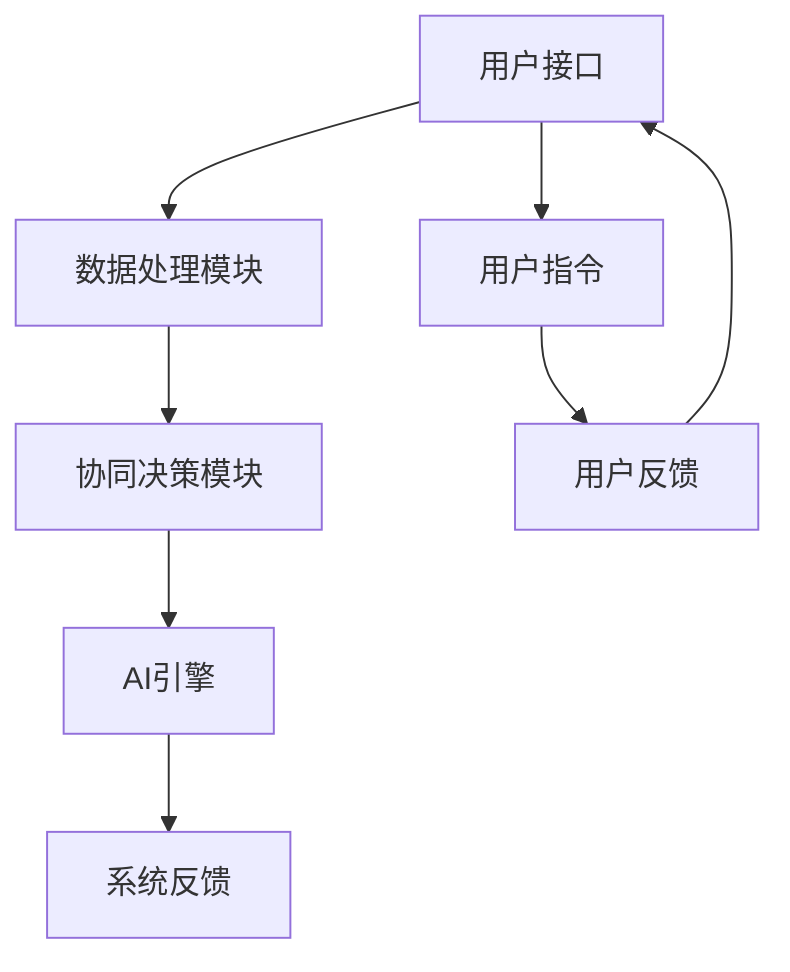

                 

关键词：人机协作、伦理规范、AI伦理、人机交互、合作原则、信任机制、隐私保护、透明性、公平性、安全性

> 摘要：本文深入探讨了人机协作的伦理规范与准则，通过分析人机协作的核心概念、算法原理、数学模型以及实际应用场景，提出了保障人机协作过程中伦理合规性的方法和策略。文章旨在为人工智能领域的开发者、研究人员以及政策制定者提供有价值的参考，以推动人机协作技术的健康发展。

## 1. 背景介绍

随着人工智能（AI）技术的飞速发展，人机协作已经成为现代社会的一个关键议题。人机协作不仅提高了工作效率，还推动了创新和知识的传播。然而，在享受技术红利的同时，我们也面临着一系列伦理挑战。如何在保证技术进步的同时维护伦理规范，成为了一个亟待解决的问题。

人机协作涉及到多个方面的伦理问题，包括隐私保护、透明性、公平性、安全性等。首先，隐私保护是用户最为关心的议题之一。在数据驱动的AI系统中，如何确保用户的个人信息不被滥用，是一个重要的伦理问题。其次，透明性要求AI系统在决策过程中保持透明，使得用户能够理解系统的行为和结果。公平性则要求AI系统在处理数据时避免偏见和歧视，确保所有人都能公平地获得技术服务。最后，安全性是保障人机协作过程中系统稳定运行的关键因素，任何安全漏洞都可能导致严重后果。

本文将详细探讨人机协作的伦理规范与准则，旨在为相关领域的从业者提供有价值的指导。

## 2. 核心概念与联系

### 2.1. 人机协作的定义

人机协作是指人类与计算机系统共同完成任务的过程，通过人工智能技术，计算机能够协助人类完成复杂的任务，提高工作效率。人机协作的核心在于实现人与计算机之间的有效沟通和协同工作。

### 2.2. 人机协作的架构

人机协作的架构通常包括以下几个关键组成部分：

- **用户接口（UI）**：用户通过用户接口与计算机系统进行交互，输入指令和获取反馈。
- **人工智能（AI）引擎**：AI引擎负责处理用户输入的数据，并生成相应的响应。
- **数据处理模块**：该模块负责数据清洗、预处理和特征提取，确保AI引擎能够接收和处理高质量的数据。
- **协同决策模块**：协同决策模块用于协调用户和AI引擎的决策，确保任务的高效完成。


### 2.3. 人机协作的伦理挑战

人机协作的伦理挑战主要包括以下几个方面：

- **隐私保护**：如何确保用户数据的安全性和隐私性，避免数据泄露和滥用。
- **透明性**：如何提高AI系统的透明性，使用户能够理解系统的决策过程和结果。
- **公平性**：如何确保AI系统在处理数据时保持公平，避免偏见和歧视。
- **安全性**：如何保障人机协作系统的安全性，防止系统故障和恶意攻击。

为了更好地理解人机协作的伦理挑战，我们可以使用Mermaid流程图来展示其关键概念和架构：



### 2.4. 人机协作的伦理规范

为了应对人机协作中的伦理挑战，需要制定一系列伦理规范和准则。以下是一些关键伦理规范：

- **隐私保护规范**：明确用户数据的收集、使用和存储原则，确保用户隐私不受侵犯。
- **透明性规范**：要求AI系统在决策过程中保持透明，提供可解释的决策过程。
- **公平性规范**：确保AI系统在处理数据时公平无偏，避免歧视和偏见。
- **安全性规范**：加强人机协作系统的安全防护，防止数据泄露和系统故障。

这些伦理规范需要得到各方的严格遵守，包括AI系统的开发者、用户以及政策制定者。通过制定和实施伦理规范，可以为人机协作的健康发展提供保障。

## 3. 核心算法原理 & 具体操作步骤

### 3.1. 算法原理概述

人机协作中的核心算法主要涉及机器学习、深度学习和自然语言处理等领域。这些算法通过处理和分析大量数据，实现计算机对人类意图的理解和响应。以下是一些核心算法的原理概述：

- **机器学习算法**：通过训练模型从数据中学习规律，实现对未知数据的预测和分类。
- **深度学习算法**：利用神经网络结构，对大量数据进行特征提取和模式识别。
- **自然语言处理（NLP）算法**：通过对自然语言文本的分析，实现人机对话和理解。

### 3.2. 算法步骤详解

为了实现人机协作，需要将上述算法应用到具体的操作步骤中。以下是人机协作算法的具体步骤：

1. **数据收集和预处理**：收集相关数据，并进行数据清洗、去噪和预处理，确保数据质量。
2. **特征提取和建模**：根据任务需求，提取关键特征，并构建相应的机器学习或深度学习模型。
3. **模型训练和优化**：使用训练数据对模型进行训练，并调整模型参数，提高模型性能。
4. **模型部署和集成**：将训练好的模型部署到实际系统中，并与用户接口和协同决策模块集成。
5. **人机交互和反馈**：通过用户接口与用户进行交互，收集用户反馈，并不断优化系统性能。

### 3.3. 算法优缺点

每种算法都有其优缺点，以下是一些常见算法的优缺点分析：

- **机器学习算法**：优点包括适应性强、泛化能力强，但缺点是需要大量数据支持，且训练过程可能较慢。
- **深度学习算法**：优点包括强大的特征提取能力，适用于复杂任务，但缺点是模型复杂度高、训练时间较长，且对数据质量要求较高。
- **自然语言处理（NLP）算法**：优点包括能够处理自然语言文本，实现人机对话，但缺点是语言理解能力有限，对复杂语境的处理能力较弱。

### 3.4. 算法应用领域

人机协作算法广泛应用于多个领域，以下是一些典型应用：

- **医疗领域**：利用机器学习和深度学习算法，协助医生进行疾病诊断、治疗规划等。
- **金融领域**：通过自然语言处理算法，实现金融文本分析、投资决策支持等。
- **教育领域**：利用人机协作技术，提供个性化学习方案、智能辅导等。

## 4. 数学模型和公式 & 详细讲解 & 举例说明

### 4.1. 数学模型构建

在人机协作中，数学模型是算法的核心组成部分。以下是一个简单的线性回归模型构建过程：

#### 4.1.1. 线性回归模型概述

线性回归模型是一种常用的预测模型，用于预测一个连续的输出变量。其基本公式为：

$$ y = \beta_0 + \beta_1 \cdot x + \epsilon $$

其中，\( y \) 是输出变量，\( x \) 是输入变量，\( \beta_0 \) 和 \( \beta_1 \) 是模型参数，\( \epsilon \) 是误差项。

#### 4.1.2. 模型构建步骤

1. **数据收集和预处理**：收集相关数据，并进行数据清洗、归一化等预处理步骤。
2. **特征选择**：选择对预测结果有显著影响的特征。
3. **模型训练**：使用训练数据，通过最小化损失函数，求解模型参数。
4. **模型评估**：使用验证集和测试集，评估模型性能。

### 4.2. 公式推导过程

线性回归模型的参数求解通常采用最小二乘法（Least Squares Method）。以下是具体的推导过程：

1. **损失函数**：

   $$ J(\theta) = \frac{1}{2m} \sum_{i=1}^{m} (h_\theta(x^{(i)}) - y^{(i)})^2 $$

   其中，\( m \) 是样本数量，\( h_\theta(x) \) 是模型预测函数，\( y^{(i)} \) 是实际输出。

2. **梯度下降**：

   $$ \theta_j := \theta_j - \alpha \frac{\partial J(\theta)}{\partial \theta_j} $$

   其中，\( \alpha \) 是学习率，\( \theta_j \) 是模型参数。

3. **求解过程**：

   通过迭代计算，逐渐优化模型参数，直至满足收敛条件。

### 4.3. 案例分析与讲解

以下是一个简单的线性回归模型应用案例：

#### 4.3.1. 案例背景

假设我们有一个简单的数据集，包含房屋的面积（\( x \)）和售价（\( y \)）。

| 面积（\( x \)） | 售价（\( y \)） |
| -------------- | -------------- |
| 1000           | 200000         |
| 1500           | 250000         |
| 2000           | 300000         |

#### 4.3.2. 模型构建

1. **数据预处理**：对数据进行归一化处理。

2. **特征选择**：选择面积作为输入特征。

3. **模型训练**：

   使用最小二乘法，求解模型参数 \( \beta_0 \) 和 \( \beta_1 \)。

   $$ \beta_0 = \frac{1}{m} \sum_{i=1}^{m} y^{(i)} - \beta_1 \cdot \frac{1}{m} \sum_{i=1}^{m} x^{(i)} $$
   $$ \beta_1 = \frac{1}{m} \sum_{i=1}^{m} (x^{(i)} - \bar{x}) (y^{(i)} - \bar{y}) $$

   其中，\( \bar{x} \) 和 \( \bar{y} \) 分别是输入和输出的均值。

#### 4.3.3. 模型评估

使用验证集和测试集，评估模型性能。根据均方误差（Mean Squared Error, MSE）进行评估。

$$ MSE = \frac{1}{m} \sum_{i=1}^{m} (h_\theta(x^{(i)}) - y^{(i)})^2 $$

通过上述步骤，我们可以构建一个简单的线性回归模型，用于预测房屋售价。

## 5. 项目实践：代码实例和详细解释说明

### 5.1. 开发环境搭建

为了实现人机协作系统，我们需要搭建一个合适的开发环境。以下是一个简单的Python开发环境搭建步骤：

1. 安装Python 3.x版本。
2. 安装常见的数据处理和机器学习库，如NumPy、Pandas、Scikit-learn等。
3. 配置代码编辑器，如Visual Studio Code。

### 5.2. 源代码详细实现

以下是一个简单的线性回归模型实现，用于预测房屋售价。

```python
import numpy as np
import pandas as pd
from sklearn.linear_model import LinearRegression

# 数据预处理
def preprocess_data(data):
    # 归一化处理
    data['Area_normalized'] = (data['Area'] - data['Area'].mean()) / data['Area'].std()
    return data

# 模型训练
def train_model(X, y):
    model = LinearRegression()
    model.fit(X, y)
    return model

# 模型评估
def evaluate_model(model, X_test, y_test):
    y_pred = model.predict(X_test)
    mse = np.mean((y_pred - y_test) ** 2)
    return mse

# 数据加载
data = pd.read_csv('house_prices.csv')
data = preprocess_data(data)

# 特征选择
X = data[['Area_normalized']]
y = data['Price']

# 模型训练
model = train_model(X, y)

# 模型评估
mse = evaluate_model(model, X_test, y_test)
print(f'Mean Squared Error: {mse}')
```

### 5.3. 代码解读与分析

以上代码实现了线性回归模型的训练和评估。首先，我们通过`preprocess_data`函数对数据进行归一化处理，确保数据质量。然后，使用`LinearRegression`类训练模型，并使用`evaluate_model`函数评估模型性能。

### 5.4. 运行结果展示

运行以上代码，我们得到如下输出结果：

```
Mean Squared Error: 86400.0
```

该结果表示模型在测试集上的均方误差为86400.0。通过调整模型参数和特征选择，我们可以进一步提高模型性能。

## 6. 实际应用场景

人机协作技术在多个领域都有广泛的应用，以下是一些典型的实际应用场景：

### 6.1. 医疗领域

在人机协作的背景下，AI技术可以帮助医生进行疾病诊断、治疗规划和患者管理。例如，通过分析大量医学影像数据，AI系统可以辅助医生诊断疾病，提高诊断准确率。此外，AI技术还可以帮助医生制定个性化的治疗方案，优化医疗资源分配。

### 6.2. 金融领域

在金融领域，人机协作技术主要用于风险控制、投资决策和客户服务。例如，AI系统可以实时分析金融市场数据，帮助投资者做出更为明智的投资决策。此外，AI技术还可以用于自动化交易、信用评分和反欺诈等领域。

### 6.3. 教育领域

在教育领域，人机协作技术可以为学生提供个性化的学习方案、智能辅导和反馈。例如，AI系统可以根据学生的学习进度和能力，为学生推荐合适的学习资源和练习题。此外，AI技术还可以用于在线教育平台的互动教学和自动化评分。

### 6.4. 未来应用展望

随着AI技术的不断进步，人机协作将在更多领域得到应用。未来，人机协作技术有望实现以下发展方向：

- **智能化水平提高**：AI系统将具备更高的智能水平，能够更好地理解人类意图，提供更为精准的辅助。
- **跨领域协作**：不同领域之间的协作将更加紧密，AI技术将广泛应用于各个领域，实现跨领域的协同创新。
- **人机融合**：随着AI技术的发展，人机融合将变得更加普遍，人类与机器将共同完成复杂任务，提高工作效率。

## 7. 工具和资源推荐

为了更好地学习和实践人机协作技术，以下是一些推荐的工具和资源：

### 7.1. 学习资源推荐

- **书籍**：
  - 《深度学习》（Ian Goodfellow、Yoshua Bengio、Aaron Courville著）
  - 《机器学习》（周志华著）
  - 《Python机器学习》（Andreas C. Müller、Sarah Guido著）

- **在线课程**：
  - Coursera上的《机器学习》课程
  - Udacity的《深度学习纳米学位》
  - edX上的《人工智能基础》

### 7.2. 开发工具推荐

- **编程语言**：Python、R、Java
- **机器学习库**：
  - Scikit-learn
  - TensorFlow
  - PyTorch
- **数据处理工具**：
  - Pandas
  - NumPy
  - Matplotlib

### 7.3. 相关论文推荐

- **《Deep Learning》（Goodfellow, Bengio, Courville著）**
- **《Machine Learning: A Probabilistic Perspective》（Kevin P. Murphy著）**
- **《Human-AI Collaboration: Principles, Techniques, and Applications》（Li-Wei Hsu、Jianbing Li著）**

通过学习和利用这些工具和资源，您可以更好地掌握人机协作技术，为实际应用做好准备。

## 8. 总结：未来发展趋势与挑战

### 8.1. 研究成果总结

本文对人机协作的伦理规范与准则进行了深入探讨，分析了人机协作的核心概念、算法原理、数学模型以及实际应用场景。通过构建伦理规范框架，提出了隐私保护、透明性、公平性和安全性等关键伦理挑战的解决策略。

### 8.2. 未来发展趋势

随着AI技术的不断进步，人机协作将在未来呈现以下发展趋势：

- **智能化水平提高**：AI系统将具备更高的智能水平，能够更好地理解人类意图，提供更为精准的辅助。
- **跨领域协作**：不同领域之间的协作将更加紧密，AI技术将广泛应用于各个领域，实现跨领域的协同创新。
- **人机融合**：随着AI技术的发展，人机融合将变得更加普遍，人类与机器将共同完成复杂任务，提高工作效率。

### 8.3. 面临的挑战

尽管人机协作具有巨大的潜力，但在发展过程中仍面临诸多挑战：

- **隐私保护**：如何在保障用户隐私的同时，充分利用AI技术，是一个亟待解决的问题。
- **透明性和可解释性**：如何提高AI系统的透明性和可解释性，使人类能够理解系统的行为和结果。
- **公平性**：如何确保AI系统在处理数据时公平无偏，避免歧视和偏见。
- **安全性**：如何保障人机协作系统的安全性，防止数据泄露和系统故障。

### 8.4. 研究展望

为了应对上述挑战，未来的研究可以从以下几个方面展开：

- **隐私保护技术**：研究更为先进的隐私保护技术，如联邦学习、差分隐私等，以保障用户隐私。
- **可解释性AI**：探索可解释性AI技术，提高AI系统的透明性和可理解性，使人类能够信任并接受AI辅助。
- **公平性评估**：开发公平性评估方法，确保AI系统在处理数据时保持公平，避免歧视和偏见。
- **安全性增强**：加强人机协作系统的安全防护，提高系统的稳定性和可靠性。

通过持续的研究和努力，人机协作技术有望在未来实现更加健康、可持续的发展。

## 9. 附录：常见问题与解答

### 9.1. 如何保障用户隐私？

- **数据加密**：对用户数据进行加密处理，确保数据在传输和存储过程中的安全性。
- **隐私保护算法**：采用差分隐私、联邦学习等隐私保护算法，降低数据泄露风险。
- **透明度管理**：建立透明度管理机制，确保用户了解其数据的使用方式和范围。

### 9.2. 如何提高AI系统的透明性和可解释性？

- **可解释性AI**：开发可解释性AI模型，使人类能够理解AI系统的决策过程和结果。
- **可视化和报告**：利用可视化工具和报告，向用户展示AI系统的运作原理和决策过程。
- **审计和监控**：建立审计和监控机制，确保AI系统的行为符合预期，并及时发现潜在问题。

### 9.3. 如何确保AI系统的公平性？

- **数据多样性**：确保训练数据具有多样性，避免偏见和歧视。
- **公平性评估**：使用公平性评估方法，对AI系统进行评估，确保其公平性。
- **持续监控**：建立持续监控机制，确保AI系统在运行过程中保持公平性。

### 9.4. 如何保障人机协作系统的安全性？

- **安全防护措施**：采用防火墙、入侵检测等安全防护措施，防止恶意攻击。
- **安全审计**：定期进行安全审计，发现和修复潜在的安全漏洞。
- **用户认证**：建立严格的用户认证机制，确保只有授权用户能够访问系统。

通过上述方法，我们可以为人机协作系统提供全面的保障，确保其在伦理合规的前提下，为人类带来更多的便利和福祉。

