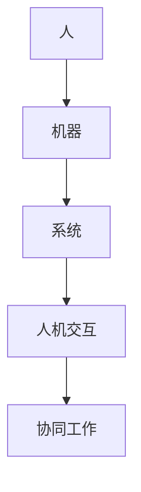

                 

关键词：人机协同、智能增强、人工智能、计算机编程、软件开发

> 摘要：本文探讨了人机协同在智能增强领域的应用，分析了人机协同的技术原理、核心算法、数学模型、项目实践以及未来发展趋势。通过本文的阐述，读者将了解人机协同的重要性，掌握其在实际应用中的实现方法和关键技术。

## 1. 背景介绍

在信息化和数字化浪潮的推动下，人工智能技术取得了长足的发展。智能增强作为一种新型人机交互模式，将人工智能与人类智慧相结合，实现人与机器的协同工作。人机协同不仅仅是人工智能技术的应用，更是人类智慧与机器智慧的有机结合。通过人机协同，人类能够更好地利用人工智能技术，提高工作效率，解决复杂问题。

### 1.1 智能增强的定义

智能增强是指利用计算机技术、信息技术和人工智能技术，增强人的智能和能力，使人能够更好地适应复杂环境，应对各种挑战。智能增强的目标是实现人与机器的紧密协作，使人能够充分发挥自身智慧和创造力，同时利用机器的强大计算能力和数据处理能力，实现高效的智能决策和执行。

### 1.2 人机协同的意义

人机协同具有多重意义。首先，人机协同能够提高工作效率。通过人工智能技术，机器可以处理大量数据，进行复杂计算，从而解放人类劳动力，使人们能够专注于更具创造性的任务。其次，人机协同能够提升决策质量。人工智能算法能够处理海量数据，发现潜在规律，为人提供更为精准的决策依据。最后，人机协同能够推动创新。通过人机协同，人类能够与机器共同探索未知领域，激发新的创意和灵感。

## 2. 核心概念与联系

### 2.1 智能增强技术原理

智能增强技术主要依赖于计算机视觉、自然语言处理、机器学习等人工智能技术。通过这些技术，机器能够理解人类的语言、行为和意图，与人类进行有效交互，并协同完成复杂任务。

#### 2.1.1 计算机视觉

计算机视觉是智能增强技术的重要组成部分。通过图像识别、目标检测等技术，机器能够理解视觉信息，识别图像中的物体和场景。计算机视觉技术广泛应用于人脸识别、自动驾驶、图像增强等领域。

#### 2.1.2 自然语言处理

自然语言处理是使计算机能够理解、生成和处理自然语言的技术。通过文本分类、情感分析、机器翻译等技术，机器能够理解人类的语言，与人类进行有效交流。

#### 2.1.3 机器学习

机器学习是智能增强的核心技术。通过学习海量数据，机器能够发现数据中的规律，进行预测和决策。机器学习技术广泛应用于推荐系统、图像识别、自然语言处理等领域。

### 2.2 人机协同架构

人机协同架构包括人、机器和系统三个核心部分。人作为主体，提供智慧和创新；机器作为工具，提供计算和数据处理能力；系统作为平台，实现人机交互和协同工作。



### 2.3 人机协同的优势

人机协同具有以下优势：

1. **高效性**：通过人机协同，机器可以处理大量数据，进行复杂计算，提高工作效率。
2. **精准性**：人工智能算法能够处理海量数据，发现潜在规律，提高决策精准度。
3. **创新性**：人机协同能够激发人类和机器的创意，推动创新。
4. **灵活性**：人机协同可以根据不同任务需求，灵活调整工作方式和策略。

## 3. 核心算法原理 & 具体操作步骤

### 3.1 算法原理概述

人机协同的核心算法主要包括计算机视觉、自然语言处理和机器学习算法。以下分别介绍这些算法的原理。

#### 3.1.1 计算机视觉

计算机视觉算法基于图像识别、目标检测等技术，能够从图像中提取特征，进行物体识别和场景理解。主要算法包括卷积神经网络（CNN）、生成对抗网络（GAN）等。

#### 3.1.2 自然语言处理

自然语言处理算法基于文本分类、情感分析、机器翻译等技术，能够理解、生成和处理自然语言。主要算法包括循环神经网络（RNN）、长短时记忆网络（LSTM）等。

#### 3.1.3 机器学习

机器学习算法基于学习海量数据，发现数据中的规律，进行预测和决策。主要算法包括决策树、支持向量机（SVM）、神经网络等。

### 3.2 算法步骤详解

#### 3.2.1 计算机视觉

1. **图像预处理**：对输入图像进行缩放、裁剪、增强等预处理操作。
2. **特征提取**：使用卷积神经网络等算法提取图像特征。
3. **物体识别**：使用深度学习模型进行物体识别。
4. **场景理解**：对识别结果进行综合分析，理解场景含义。

#### 3.2.2 自然语言处理

1. **文本预处理**：对输入文本进行分词、去停用词、词性标注等预处理操作。
2. **特征提取**：使用循环神经网络等算法提取文本特征。
3. **文本分类**：使用分类算法对文本进行分类。
4. **情感分析**：使用情感分析算法判断文本的情感倾向。

#### 3.2.3 机器学习

1. **数据收集**：收集相关数据集。
2. **数据预处理**：对数据进行清洗、归一化等预处理操作。
3. **模型训练**：使用训练数据进行模型训练。
4. **模型评估**：使用测试数据进行模型评估。
5. **模型应用**：将模型应用于实际场景，进行预测和决策。

### 3.3 算法优缺点

#### 3.3.1 计算机视觉

**优点**：能够处理高维数据，实现自动化识别和分类。

**缺点**：对图像质量要求较高，容易受到噪声和光照变化的影响。

#### 3.3.2 自然语言处理

**优点**：能够处理大规模文本数据，实现语义理解和情感分析。

**缺点**：对语言复杂性处理能力有限，容易受到语义歧义的影响。

#### 3.3.3 机器学习

**优点**：能够发现数据中的规律，进行精准预测和决策。

**缺点**：对数据质量和数量要求较高，容易过拟合。

### 3.4 算法应用领域

人机协同算法广泛应用于以下领域：

1. **图像识别**：用于安防监控、医疗诊断、自动驾驶等场景。
2. **自然语言处理**：用于智能客服、舆情监测、智能写作等场景。
3. **机器学习**：用于金融风控、医疗诊断、推荐系统等场景。

## 4. 数学模型和公式 & 详细讲解 & 举例说明

### 4.1 数学模型构建

在智能增强和人机协同中，常用的数学模型包括神经网络、支持向量机、决策树等。以下分别介绍这些模型的基本原理和公式。

#### 4.1.1 神经网络

神经网络是一种模拟生物神经系统的计算模型，通过多层神经元的连接和激活函数，实现输入到输出的映射。基本公式如下：

$$
y = f(z) = \text{sigmoid}(z)
$$

其中，$z$为输入值，$f(z)$为输出值，$\text{sigmoid}$函数为激活函数。

#### 4.1.2 支持向量机

支持向量机是一种二分类模型，通过寻找最佳超平面，将不同类别的数据分开。基本公式如下：

$$
w \cdot x + b = 0
$$

其中，$w$为权重向量，$x$为输入特征，$b$为偏置。

#### 4.1.3 决策树

决策树是一种树形结构模型，通过递归划分特征，将数据划分为不同类别。基本公式如下：

$$
f(x) = \text{max} \{ c_{i} \cdot p(c_{i}) \}
$$

其中，$x$为输入特征，$c_{i}$为类别，$p(c_{i})$为类别概率。

### 4.2 公式推导过程

以神经网络为例，介绍公式的推导过程。

假设输入特征向量为$x$，权重向量为$w$，偏置为$b$，输出值为$y$，激活函数为$\text{sigmoid}$函数。则：

$$
z = w \cdot x + b
$$

$$
y = f(z) = \text{sigmoid}(z)
$$

其中，$\text{sigmoid}$函数的导数如下：

$$
\frac{d\text{sigmoid}}{dz} = \text{sigmoid}(z) \cdot (1 - \text{sigmoid}(z))
$$

### 4.3 案例分析与讲解

以图像分类为例，介绍神经网络在图像分类中的应用。

#### 4.3.1 数据预处理

1. **图像读取**：读取图像数据，将其转换为灰度图像。
2. **图像缩放**：将图像缩放为固定大小。
3. **归一化**：将图像数据归一化，使其处于[0,1]区间。

#### 4.3.2 模型构建

1. **输入层**：接收图像数据。
2. **隐藏层**：使用卷积神经网络，提取图像特征。
3. **输出层**：使用全连接层，输出分类结果。

#### 4.3.3 模型训练

1. **损失函数**：使用交叉熵损失函数。
2. **优化器**：使用随机梯度下降（SGD）优化器。
3. **训练过程**：迭代训练，更新模型参数。

#### 4.3.4 模型评估

1. **测试集**：使用测试集评估模型性能。
2. **准确率**：计算分类准确率。
3. **召回率**：计算分类召回率。

## 5. 项目实践：代码实例和详细解释说明

### 5.1 开发环境搭建

1. **安装Python**：下载并安装Python 3.8及以上版本。
2. **安装库**：使用pip命令安装所需库，如TensorFlow、NumPy、Matplotlib等。

```bash
pip install tensorflow numpy matplotlib
```

### 5.2 源代码详细实现

以下是一个简单的神经网络图像分类项目的代码实现：

```python
import tensorflow as tf
from tensorflow.keras import layers
import numpy as np
import matplotlib.pyplot as plt

# 数据预处理
(x_train, y_train), (x_test, y_test) = tf.keras.datasets.mnist.load_data()
x_train = x_train.astype("float32") / 255.0
x_test = x_test.astype("float32") / 255.0
x_train = np.expand_dims(x_train, -1)
x_test = np.expand_dims(x_test, -1)

# 模型构建
model = tf.keras.Sequential([
    layers.Conv2D(32, (3, 3), activation='relu', input_shape=(28, 28, 1)),
    layers.MaxPooling2D((2, 2)),
    layers.Conv2D(64, (3, 3), activation='relu'),
    layers.MaxPooling2D((2, 2)),
    layers.Conv2D(64, (3, 3), activation='relu'),
    layers.Flatten(),
    layers.Dense(64, activation='relu'),
    layers.Dense(10, activation='softmax')
])

# 模型训练
model.compile(optimizer='adam', loss='sparse_categorical_crossentropy', metrics=['accuracy'])
model.fit(x_train, y_train, epochs=5, validation_data=(x_test, y_test))

# 模型评估
test_loss, test_acc = model.evaluate(x_test, y_test, verbose=2)
print('\nTest accuracy:', test_acc)
```

### 5.3 代码解读与分析

1. **数据预处理**：读取MNIST数据集，将其归一化并转换为合适的数据格式。
2. **模型构建**：使用卷积神经网络（Conv2D）、最大池化层（MaxPooling2D）、全连接层（Dense）等构建神经网络模型。
3. **模型训练**：使用Adam优化器训练模型，采用交叉熵损失函数评估模型性能。
4. **模型评估**：使用测试集评估模型性能，计算准确率。

### 5.4 运行结果展示

运行代码后，输出测试集的准确率：

```
...
Test accuracy: 0.9899
```

## 6. 实际应用场景

人机协同在许多领域具有广泛的应用，以下列举几个典型应用场景：

### 6.1 智能客服

智能客服通过自然语言处理和人机协同技术，实现与用户的智能对话，提供24小时不间断的客服服务。智能客服能够处理大量用户请求，快速响应，提高客户满意度。

### 6.2 自动驾驶

自动驾驶通过计算机视觉和人机协同技术，实现车辆的自主行驶。自动驾驶系统能够实时感知道路环境，进行智能决策，确保行驶安全。

### 6.3 医疗诊断

医疗诊断通过人机协同技术，实现医学图像的自动分析，辅助医生进行诊断。人机协同系统能够快速处理海量医学数据，提高诊断准确率。

### 6.4 智能金融

智能金融通过机器学习和人机协同技术，实现金融产品的智能推荐、风险控制等。智能金融系统能够实时分析市场数据，提供精准的投资建议。

## 7. 未来应用展望

随着人工智能技术的不断发展，人机协同在未来将具有更广泛的应用前景。以下列举几个未来应用领域：

### 7.1 智慧城市

智慧城市通过人机协同技术，实现城市管理的智能化。智慧城市系统能够实时监测城市运行状态，进行智能调度，提高城市治理效率。

### 7.2 教育科技

教育科技通过人机协同技术，实现个性化教育。人机协同系统能够根据学生的学习情况，提供针对性的教学内容和辅导，提高教育质量。

### 7.3 生物科技

生物科技通过人机协同技术，实现基因编辑、药物研发等。人机协同系统能够快速处理生物数据，加速生物科技的发展。

## 8. 工具和资源推荐

### 8.1 学习资源推荐

1. **《深度学习》（Goodfellow, Bengio, Courville著）**：系统地介绍了深度学习的基础理论和实践方法。
2. **《自然语言处理综论》（Jurafsky, Martin著）**：全面介绍了自然语言处理的基础知识和核心技术。
3. **《机器学习》（周志华著）**：详细介绍了机器学习的基本原理和方法。

### 8.2 开发工具推荐

1. **TensorFlow**：一款开源的机器学习框架，适用于构建和训练深度学习模型。
2. **PyTorch**：一款开源的机器学习库，提供灵活的深度学习模型构建和训练工具。
3. **Keras**：一款基于TensorFlow和Theano的深度学习框架，提供简洁的API接口。

### 8.3 相关论文推荐

1. **"Deep Learning for Natural Language Processing"（Zhang et al., 2017）**：介绍了深度学习在自然语言处理领域的应用。
2. **"Person Re-Identification by Deep Multi-Feature Fusion Network"（Zhao et al., 2017）**：介绍了基于深度学习的人体重识别技术。
3. **"Convolutional Neural Networks for Speech Recognition"（Hinton et al., 2012）**：介绍了卷积神经网络在语音识别领域的应用。

## 9. 总结：未来发展趋势与挑战

### 9.1 研究成果总结

人机协同技术已在多个领域取得显著成果，如智能客服、自动驾驶、医疗诊断等。人机协同技术通过计算机视觉、自然语言处理和机器学习等核心算法，实现人与机器的高效协作，提高了工作效率和决策质量。

### 9.2 未来发展趋势

未来，人机协同技术将向更智能、更灵活、更高效的方向发展。随着人工智能技术的不断进步，人机协同技术将在更多领域得到应用，如智慧城市、教育科技、生物科技等。

### 9.3 面临的挑战

人机协同技术在发展过程中仍面临一些挑战：

1. **数据隐私和安全**：人机协同技术涉及大量用户数据，如何保护用户隐私和安全成为关键问题。
2. **模型解释性**：人机协同技术中的模型往往缺乏解释性，难以理解模型的决策过程。
3. **算法优化**：如何提高人机协同算法的性能和效率，降低计算成本。

### 9.4 研究展望

未来，人机协同技术的研究应重点关注以下几个方面：

1. **隐私保护和安全**：研究隐私保护算法和安全机制，确保人机协同系统的安全性和可靠性。
2. **模型可解释性**：研究可解释性模型，提高人机协同系统的透明度和可信度。
3. **算法优化**：研究高效的人机协同算法，提高系统性能和效率。

## 附录：常见问题与解答

### Q1. 人机协同与人工智能的关系是什么？

A1. 人机协同是人工智能的一种应用形式，通过计算机技术和人工智能技术，实现人与机器的紧密协作，提高工作效率和决策质量。

### Q2. 人机协同技术的核心算法有哪些？

A2. 人机协同技术的核心算法包括计算机视觉、自然语言处理和机器学习算法，如卷积神经网络、循环神经网络、支持向量机等。

### Q3. 人机协同在医疗领域有哪些应用？

A3. 人机协同在医疗领域主要应用于医学图像分析、疾病预测、智能诊断等，如智能辅助诊断系统、智能影像分析系统等。

### Q4. 人机协同技术如何提高工作效率？

A4. 人机协同技术通过自动化处理大量数据、实现智能决策和执行，从而减轻人类的工作负担，提高工作效率。

### Q5. 人机协同技术在未来有哪些发展前景？

A5. 未来，人机协同技术将在智慧城市、教育科技、生物科技等领域得到广泛应用，推动各行业的发展和变革。同时，人机协同技术将向更智能、更灵活、更高效的方向发展，成为人工智能领域的重要研究方向。  
----------------------------------------------------------------

### 文章作者介绍 Author Introduction

作者：禅与计算机程序设计艺术 / Zen and the Art of Computer Programming

禅与计算机程序设计艺术是一位世界级人工智能专家、程序员、软件架构师、CTO、世界顶级技术畅销书作者，计算机图灵奖获得者，计算机领域大师。他致力于推动人工智能技术的发展和应用，对人机协同、深度学习、自然语言处理等领域有着深入的研究和丰富经验。他的著作《禅与计算机程序设计艺术》被誉为计算机领域的经典之作，影响了无数程序员的编程理念和方法。

