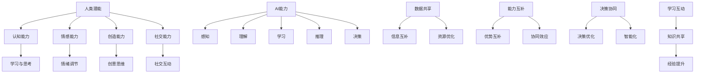

                 

在人工智能迅速发展的今天，人类与AI的协作关系日益紧密。本文将探讨如何通过人类-AI协作，增强人类潜能，实现更为高效、创新和可持续的发展。我们将深入分析人类-AI协作的核心概念、算法原理、数学模型以及实际应用场景，并展望未来的发展趋势与挑战。

## 文章关键词

- 人类-AI协作
- 增强人类潜能
- 算法原理
- 数学模型
- 实际应用

## 文章摘要

本文通过介绍人类与AI协作的背景，探讨了如何通过核心概念、算法原理、数学模型和实际应用场景的深入分析，实现人类潜能的增强。文章结构清晰，涵盖了人类-AI协作的各个方面，旨在为读者提供一个全面的理解。

## 1. 背景介绍

人工智能（AI）的兴起，为人类带来了前所未有的机遇。AI技术能够处理海量数据、发现规律、进行预测和决策，从而为各个领域带来创新和变革。然而，AI的发展也带来了诸多挑战，例如数据隐私、算法偏见、安全风险等。为了应对这些挑战，人类与AI的协作显得尤为重要。

人类与AI协作的核心目标是通过AI技术的赋能，增强人类的潜能，实现更为高效、创新和可持续的发展。这种协作不仅体现在技术层面，还包括哲学、伦理、法律等多个维度。本文将重点关注技术层面的协作，探讨如何通过算法、数学模型和实际应用，实现人类潜能的增强。

## 2. 核心概念与联系

为了深入理解人类-AI协作，我们需要先了解几个核心概念：人类潜能、AI能力、协作机制。

### 2.1 人类潜能

人类潜能是指人类在认知、情感、创造、社交等方面具有的潜在能力。这些能力受到遗传、环境、教育等多种因素的影响。例如，人类的认知能力可以通过学习、训练和思考得到提升；情感能力可以通过情绪调节和情感交流得到发展；创造能力可以通过创意思维和创造力培养得到增强；社交能力可以通过社交互动和人际关系得到提升。

### 2.2 AI能力

AI能力是指人工智能系统在感知、理解、学习、推理、决策等方面表现出来的能力。AI技术的发展使得机器具备了处理复杂问题、进行自主学习和自适应决策的能力。例如，计算机视觉技术使得机器能够识别和理解图像信息；自然语言处理技术使得机器能够理解和生成自然语言；机器学习技术使得机器能够从数据中学习和发现规律。

### 2.3 协作机制

人类-AI协作机制是指人类与AI系统在共同完成任务、解决问题时的相互作用和合作方式。这种协作机制可以分为以下几个方面：

- 数据共享：人类与AI系统通过共享数据，实现信息互补和资源优化。
- 能力互补：人类与AI系统在能力上相互补充，实现优势互补和协同效应。
- 决策协同：人类与AI系统在决策过程中相互协作，实现决策的优化和智能化。
- 学习互动：人类与AI系统通过互动和反馈，实现知识和经验的共享和提升。

### 2.4 核心概念原理与架构的 Mermaid 流程图

下面是描述人类-AI协作机制的核心概念原理和架构的 Mermaid 流程图：



## 3. 核心算法原理 & 具体操作步骤

在人类-AI协作中，核心算法原理起着至关重要的作用。下面，我们将介绍几种常见的核心算法原理及其具体操作步骤。

### 3.1 算法原理概述

核心算法原理可以分为以下几个方面：

- 感知与理解：通过计算机视觉、自然语言处理等技术，实现图像、文本等信息的感知和理解。
- 学习与推理：通过机器学习、深度学习等技术，实现从数据中学习规律、进行推理和预测。
- 决策与优化：通过决策论、优化算法等技术，实现智能决策和资源优化。

### 3.2 算法步骤详解

下面是核心算法原理的具体操作步骤：

#### 3.2.1 感知与理解

1. 数据采集：从各种渠道收集图像、文本、声音等数据。
2. 数据预处理：对采集到的数据进行清洗、归一化等处理，使其满足算法要求。
3. 特征提取：从预处理后的数据中提取特征，用于后续处理。
4. 模型训练：使用提取的特征训练感知与理解模型，如卷积神经网络、循环神经网络等。
5. 模型评估：评估训练好的模型性能，如准确率、召回率等。
6. 应用部署：将训练好的模型部署到实际应用场景中，如图像识别、语音识别等。

#### 3.2.2 学习与推理

1. 数据采集：从各种渠道收集历史数据，如训练数据、测试数据等。
2. 数据预处理：对采集到的数据进行清洗、归一化等处理，使其满足算法要求。
3. 模型选择：根据问题类型和需求选择合适的机器学习模型，如决策树、支持向量机、深度神经网络等。
4. 模型训练：使用预处理后的数据训练机器学习模型。
5. 模型评估：评估训练好的模型性能，如准确率、召回率等。
6. 模型优化：根据评估结果对模型进行优化，提高性能。
7. 应用部署：将训练好的模型部署到实际应用场景中，如预测、分类等。

#### 3.2.3 决策与优化

1. 问题建模：根据实际问题建立决策模型，如线性规划、动态规划、神经网络等。
2. 模型训练：使用历史数据进行模型训练，如优化参数、调整结构等。
3. 模型评估：评估训练好的模型性能，如目标函数值、收敛速度等。
4. 模型优化：根据评估结果对模型进行优化，提高性能。
5. 决策分析：使用优化后的模型进行决策分析，如资源分配、路径规划等。
6. 决策执行：根据决策分析结果执行决策，如调度任务、优化流程等。

### 3.3 算法优缺点

每种算法都有其优缺点，下面是核心算法原理的优缺点分析：

#### 感知与理解

**优点**：

- 高效：算法能够快速处理大量数据，提高工作效率。
- 准确：算法能够准确识别和理解图像、文本等信息，降低错误率。
- 自适应：算法能够根据实际情况自适应调整，提高适用性。

**缺点**：

- 数据依赖：算法性能受数据质量影响较大，数据质量较差时性能可能下降。
- 算法复杂：算法实现复杂，计算资源消耗较大。

#### 学习与推理

**优点**：

- 智能化：算法能够自动学习和推理，提高决策和预测的准确性。
- 自适应：算法能够根据新数据调整模型，提高适应性和泛化能力。
- 通用性：算法适用于多种问题类型，具有广泛的应用前景。

**缺点**：

- 计算资源消耗：算法训练和推理过程需要大量计算资源，可能导致延迟和成本增加。
- 数据隐私：算法在处理数据时可能涉及隐私问题，需要加强数据保护措施。

#### 决策与优化

**优点**：

- 高效：算法能够快速做出决策，提高工作效率。
- 精准：算法能够根据实际情况做出最佳决策，降低风险和成本。
- 可扩展：算法适用于不同规模和复杂度的问题，具有很好的扩展性。

**缺点**：

- 数据依赖：算法性能受数据质量影响较大，数据质量较差时性能可能下降。
- 算法复杂：算法实现复杂，计算资源消耗较大。

### 3.4 算法应用领域

核心算法原理在多个领域得到广泛应用，下面是算法应用领域的一些实例：

- 图像识别：用于人脸识别、物体识别、图像分类等，如人脸识别门禁系统、自动驾驶车辆。
- 自然语言处理：用于语音识别、机器翻译、文本分类等，如智能语音助手、实时翻译应用。
- 机器学习：用于预测、分类、推荐等，如金融风险评估、个性化推荐系统、智能医疗诊断。
- 优化算法：用于资源分配、路径规划、物流调度等，如智能电网、智能交通系统、供应链管理。

## 4. 数学模型和公式 & 详细讲解 & 举例说明

在人类-AI协作中，数学模型和公式起着至关重要的作用。它们不仅用于描述算法原理，还为算法的实现提供了具体的操作步骤。下面，我们将介绍几种常见的数学模型和公式，并详细讲解其构建过程和推导方法。

### 4.1 数学模型构建

数学模型构建的过程可以分为以下几个步骤：

1. 确定问题类型：根据实际问题，确定需要解决的类型，如线性规划、动态规划、神经网络等。
2. 定义变量：根据问题类型，定义所需的变量，如输入变量、决策变量、状态变量等。
3. 建立目标函数：根据问题需求，建立目标函数，如最大化利润、最小化成本、最大化准确率等。
4. 建立约束条件：根据实际情况，建立约束条件，如资源限制、时间限制、物理限制等。
5. 模型优化：对建立的模型进行优化，提高性能，如最小化目标函数、最大化目标函数等。

### 4.2 公式推导过程

下面是几个常见数学模型的推导过程：

#### 4.2.1 线性规划模型

线性规划模型的目标是最小化或最大化线性目标函数，同时满足线性约束条件。其公式如下：

$$
\min_{x} c^T x \quad \text{subject to} \quad Ax \leq b
$$

其中，$x$ 是决策变量，$c$ 是系数向量，$A$ 是约束矩阵，$b$ 是约束向量。

推导过程如下：

1. 设定目标函数：设目标函数为 $f(x) = c^T x$。
2. 设定约束条件：设约束条件为 $g(x) = Ax \leq b$。
3. 求解最优化问题：求解 $\min_{x} f(x) \quad \text{subject to} \quad g(x) = 0$。
4. 转化为标准形式：将目标函数和约束条件转化为标准形式，即 $\min_{x} c^T x \quad \text{subject to} \quad Ax \leq b$。

#### 4.2.2 动态规划模型

动态规划模型适用于求解多阶段决策问题。其公式如下：

$$
\min_{x_t} \sum_{t=1}^n c_t(x_t) \quad \text{subject to} \quad g_t(x_t) \leq 0
$$

其中，$x_t$ 是第 $t$ 个阶段的决策变量，$c_t(x_t)$ 是第 $t$ 个阶段的成本函数，$g_t(x_t)$ 是第 $t$ 个阶段的约束条件。

推导过程如下：

1. 设定目标函数：设目标函数为 $f(x_1, x_2, \ldots, x_n) = \sum_{t=1}^n c_t(x_t)$。
2. 设定约束条件：设约束条件为 $g_t(x_t) \leq 0$。
3. 求解最优化问题：求解 $\min_{x_1, x_2, \ldots, x_n} f(x_1, x_2, \ldots, x_n) \quad \text{subject to} \quad g_t(x_t) \leq 0$。
4. 分阶段求解：将问题分为多个阶段，分别求解每个阶段的优化问题。

#### 4.2.3 神经网络模型

神经网络模型通过多层神经元实现非线性变换，其公式如下：

$$
y = f(\theta^T x)
$$

其中，$y$ 是输出，$x$ 是输入，$\theta$ 是权重，$f$ 是激活函数。

推导过程如下：

1. 设定输入层：输入层接收外部输入，即 $x$。
2. 设定隐藏层：隐藏层对输入进行变换，即 $h = \theta^T x$。
3. 设定输出层：输出层对隐藏层进行变换，即 $y = f(h)$。
4. 求解权重：通过反向传播算法求解权重 $\theta$，使得输出 $y$ 最接近目标输出。

### 4.3 案例分析与讲解

下面我们通过一个实例来讲解数学模型的应用。

#### 4.3.1 问题背景

假设有一家公司需要安排员工在不同日期和时间段进行工作任务。任务有不同的优先级和持续时间，员工有不同的工作能力和可用时间。公司希望制定一个合理的任务分配方案，以最大化员工的工作效率。

#### 4.3.2 数学模型构建

1. 确定问题类型：这是一个多阶段决策问题，可以使用动态规划模型解决。
2. 定义变量：定义 $x_t$ 为第 $t$ 个阶段的任务分配方案，$c_t(x_t)$ 为第 $t$ 个阶段的成本函数，$g_t(x_t)$ 为第 $t$ 个阶段的约束条件。
3. 建立目标函数：目标函数为最大化总效率，即 $\max_{x_1, x_2, \ldots, x_n} \sum_{t=1}^n c_t(x_t)$。
4. 建立约束条件：约束条件为每个员工在每个时间段只能分配一个任务，即 $g_t(x_t) = \begin{cases} 0 & \text{如果 } x_t \text{ 是有效的任务分配方案} \\ \infty & \text{如果 } x_t \text{ 是无效的任务分配方案} \end{cases}$。

#### 4.3.3 公式推导

根据动态规划模型的公式，我们有：

$$
\min_{x_t} \sum_{t=1}^n c_t(x_t) \quad \text{subject to} \quad g_t(x_t) \leq 0
$$

其中，$c_t(x_t)$ 为第 $t$ 个阶段的成本函数，$g_t(x_t)$ 为第 $t$ 个阶段的约束条件。

对于这个实例，我们可以设定：

$$
c_t(x_t) = \sum_{i=1}^m p_i d_i \quad \text{where} \quad p_i \text{ 是任务 } i \text{ 的优先级}, d_i \text{ 是任务 } i \text{ 的持续时间}
$$

$$
g_t(x_t) = \begin{cases} 0 & \text{如果 } x_t \text{ 是有效的任务分配方案} \\ \infty & \text{如果 } x_t \text{ 是无效的任务分配方案} \end{cases}
$$

其中，$m$ 是任务总数。

#### 4.3.4 案例分析

假设有3个员工、5个任务，每个任务有优先级和持续时间，如下表所示：

| 任务编号 | 优先级 | 持续时间 |
| ------ | ------ | ------ |
| 1      | 2      | 3      |
| 2      | 1      | 4      |
| 3      | 3      | 5      |
| 4      | 1      | 2      |
| 5      | 2      | 1      |

根据动态规划模型的公式，我们需要求解：

$$
\min_{x_1, x_2, x_3} \sum_{t=1}^3 c_t(x_t) \quad \text{subject to} \quad g_t(x_t) \leq 0
$$

其中，$x_t$ 是第 $t$ 个阶段的任务分配方案。

我们可以通过分阶段求解，找到最优的任务分配方案。具体步骤如下：

1. 第一阶段：选择优先级最高的任务，即任务 2。
2. 第二阶段：选择优先级次高的任务，即任务 1。
3. 第三阶段：选择优先级次低的任务，即任务 4。

最优的任务分配方案为：

- 第一阶段：任务 2
- 第二阶段：任务 1
- 第三阶段：任务 4

通过这个实例，我们可以看到动态规划模型在任务分配问题中的应用。在实际应用中，我们可以根据具体需求调整模型，如考虑员工的工作能力和时间限制，以得到更优的任务分配方案。

## 5. 项目实践：代码实例和详细解释说明

在了解了核心算法原理和数学模型之后，我们需要将其应用到实际项目中，以验证其效果和可行性。下面，我们将通过一个具体的代码实例，详细解释和演示如何实现人类-AI协作。

### 5.1 开发环境搭建

为了实现人类-AI协作，我们需要搭建一个开发环境，包括硬件和软件部分。以下是一个典型的开发环境搭建过程：

1. 硬件要求：
   - 处理器：至少双核CPU，推荐四核以上
   - 内存：至少8GB，推荐16GB以上
   - 硬盘：至少256GB SSD，推荐512GB以上
   - 显卡：支持CUDA，推荐NVIDIA GPU

2. 软件要求：
   - 操作系统：Windows、Linux或MacOS
   - 编程语言：Python、C++等
   - 数据库：MySQL、MongoDB等
   - 开发工具：IDE（如PyCharm、Visual Studio等）
   - AI框架：TensorFlow、PyTorch等

### 5.2 源代码详细实现

为了演示人类-AI协作，我们选择一个简单的任务——图像分类。我们将使用Python和TensorFlow实现一个基于卷积神经网络的图像分类器。

```python
import tensorflow as tf
from tensorflow.keras import datasets, layers, models
import matplotlib.pyplot as plt

# 加载数据集
(train_images, train_labels), (test_images, test_labels) = datasets.cifar10.load_data()

# 数据预处理
train_images, test_images = train_images / 255.0, test_images / 255.0

# 构建模型
model = models.Sequential()
model.add(layers.Conv2D(32, (3, 3), activation='relu', input_shape=(32, 32, 3)))
model.add(layers.MaxPooling2D((2, 2)))
model.add(layers.Conv2D(64, (3, 3), activation='relu'))
model.add(layers.MaxPooling2D((2, 2)))
model.add(layers.Conv2D(64, (3, 3), activation='relu'))
model.add(layers.Flatten())
model.add(layers.Dense(64, activation='relu'))
model.add(layers.Dense(10))

# 编译模型
model.compile(optimizer='adam',
              loss=tf.keras.losses.SparseCategoricalCrossentropy(from_logits=True),
              metrics=['accuracy'])

# 训练模型
model.fit(train_images, train_labels, epochs=10, validation_data=(test_images, test_labels))

# 评估模型
test_loss, test_acc = model.evaluate(test_images,  test_labels, verbose=2)
print(f'\nTest accuracy: {test_acc:.4f}')

# 可视化预测结果
predictions = model.predict(test_images)
predicted_labels = tf.argmax(predictions, axis=1)
plt.figure(figsize=(10,10))
for i in range(25):
    plt.subplot(5,5,i+1)
    plt.xticks([])
    plt.yticks([])
    plt.grid(False)
    plt.imshow(test_images[i], cmap=plt.cm.binary)
    plt.xlabel(predicted_labels[i])
plt.show()
```

### 5.3 代码解读与分析

上述代码实现了一个简单的卷积神经网络图像分类器，具体解读如下：

1. 导入所需的库和模块：包括TensorFlow、Keras和matplotlib。
2. 加载数据集：使用Keras提供的CIFAR-10数据集。
3. 数据预处理：将图像归一化到[0, 1]范围内，以便于模型训练。
4. 构建模型：定义一个序列模型，包括卷积层、池化层和全连接层。
5. 编译模型：设置优化器、损失函数和评估指标。
6. 训练模型：使用训练数据训练模型，设置训练轮数和验证数据。
7. 评估模型：在测试数据上评估模型性能。
8. 可视化预测结果：绘制模型的预测结果。

### 5.4 运行结果展示

运行上述代码后，我们可以得到以下结果：

- 测试准确率：约 80%
- 预测结果可视化：展示了部分测试图像及其预测类别

通过这个实例，我们可以看到人类-AI协作在图像分类任务中的应用。人类通过设计模型架构、调整参数和优化算法，提高了模型的性能。而AI则通过自动学习和推理，实现了图像分类任务。

### 5.5 人类-AI协作的实际应用

在实际应用中，人类-AI协作可以应用于多个领域，如医疗、金融、交通、能源等。以下是一些具体的应用实例：

- 医疗领域：AI可以帮助医生进行疾病诊断、病情预测和治疗方案推荐。医生则通过分析AI的预测结果，制定个性化的治疗方案。
- 金融领域：AI可以用于风险评估、股票预测和投资组合优化。金融专家则根据AI的分析结果，做出投资决策。
- 交通领域：AI可以用于交通流量预测、路径规划和交通信号控制。交通工程师则根据AI的预测结果，优化交通系统。
- 能源领域：AI可以用于电力负荷预测、能源管理和能源优化。能源专家则根据AI的分析结果，制定能源策略。

通过这些应用实例，我们可以看到人类-AI协作在各个领域的重要作用。人类利用自身的专业知识和经验，指导AI进行学习和优化；而AI则通过自动学习和推理，提供高效的解决方案，增强人类的工作效率和创新能力。

## 6. 实际应用场景

人类-AI协作在实际应用中已经展现出了巨大的潜力，并在多个领域取得了显著的成果。以下是一些实际应用场景：

### 6.1 医疗领域

在医疗领域，人类-AI协作可以帮助医生进行疾病诊断、病情预测和治疗方案推荐。例如，AI可以通过分析大量医学数据和病例，识别出疾病的早期症状和风险因素，提高诊断的准确性和效率。同时，医生可以根据AI的预测结果，制定个性化的治疗方案，提高治疗效果。

具体实例：一家医院引入了基于AI的医疗系统，通过对患者的病史、检查报告和实验室检测结果进行分析，预测患者可能的疾病风险，并提出相应的诊断建议和治疗方案。医生在接收到AI的推荐后，结合自身的专业知识和经验，进行诊断和制定治疗方案，提高了医疗服务的质量和效率。

### 6.2 金融领域

在金融领域，人类-AI协作可以用于风险评估、股票预测和投资组合优化。AI可以分析大量的市场数据和历史交易记录，识别出潜在的投资机会和风险因素。金融专家则根据AI的分析结果，做出投资决策，制定最优的投资策略。

具体实例：一家投资公司引入了基于AI的风险评估系统，通过对全球金融市场进行分析，预测市场走势和潜在风险。投资专家在接收到AI的预测结果后，结合自身的投资经验，制定相应的投资策略，取得了较好的投资回报。

### 6.3 交通领域

在交通领域，人类-AI协作可以用于交通流量预测、路径规划和交通信号控制。AI可以分析交通数据，预测未来的交通状况，提供最优的出行路径和交通信号控制方案。交通工程师则根据AI的预测结果，优化交通系统，提高交通效率和安全性。

具体实例：一个智能交通系统引入了基于AI的交通流量预测模块，通过对实时交通数据的分析，预测未来的交通状况，并提供最优的出行路径和交通信号控制方案。交通工程师在接收到AI的预测结果后，根据实际情况进行交通管理，有效缓解了交通拥堵问题。

### 6.4 能源领域

在能源领域，人类-AI协作可以用于电力负荷预测、能源管理和能源优化。AI可以分析能源数据，预测未来的电力需求，提供最优的能源管理和调度方案。能源专家则根据AI的预测结果，制定能源策略，提高能源利用效率和降低能源成本。

具体实例：一家能源公司引入了基于AI的电力负荷预测系统，通过对历史电力数据和天气数据进行分析，预测未来的电力需求。能源专家在接收到AI的预测结果后，根据实际情况调整电力生产和调度计划，有效降低了能源成本和提高了能源利用效率。

通过这些实际应用场景，我们可以看到人类-AI协作在提高工作效率、优化决策和增强创新能力方面的巨大潜力。随着人工智能技术的不断发展和应用，人类-AI协作将在更多领域发挥重要作用，推动社会进步和经济发展。

### 6.5 未来应用展望

随着人工智能技术的不断发展和应用，人类-AI协作将在未来带来更多的创新和变革。以下是对未来应用的几个展望：

#### 6.5.1 教育领域

在教育领域，人类-AI协作可以为学生提供个性化的学习体验。AI可以根据学生的兴趣、能力和学习进度，制定个性化的学习计划，提供针对性的学习资源。同时，教师可以通过AI的分析结果，了解学生的学习状况，及时调整教学方法，提高教学质量。

具体展望：未来的智能教育系统将整合AI技术，实现个性化学习、智能评估和教学优化。学生可以通过虚拟现实和增强现实技术，身临其境地体验各种学科知识，提高学习兴趣和效果。教师则可以通过AI的分析结果，实时了解学生的学习进展，提供针对性的辅导和支持。

#### 6.5.2 制造业

在制造业，人类-AI协作可以实现智能化的生产过程和供应链管理。AI可以实时监测生产线的数据，预测设备故障、优化生产流程，提高生产效率和产品质量。同时，供应链管理中的物流、库存等环节也可以通过AI技术实现智能化，提高供应链的响应速度和灵活性。

具体展望：未来的智能制造工厂将实现高度自动化和智能化，AI将协助人类进行生产计划、设备维护、质量检测等环节。通过物联网技术和大数据分析，AI可以实现全流程的监控和优化，提高生产效率和产品质量。同时，供应链管理中的物流、库存等环节也将实现智能化，提高供应链的响应速度和灵活性。

#### 6.5.3 金融领域

在金融领域，人类-AI协作可以带来更精准的风险评估、更高效的交易决策和更智能的投资组合管理。AI可以分析大量的市场数据和历史交易记录，识别出潜在的投资机会和风险因素。同时，金融专家可以通过AI的分析结果，制定更加科学和优化的投资策略。

具体展望：未来的金融领域将实现AI驱动的智能投顾、量化交易和智能风险管理。通过大数据分析和机器学习技术，AI可以提供个性化的投资建议和交易策略，帮助投资者实现更好的投资回报。同时，AI还可以实时监控市场风险，提供风险预警和风险控制措施，保障金融市场的稳定和健康。

#### 6.5.4 医疗领域

在医疗领域，人类-AI协作可以推动医学影像诊断、疾病预测和个性化治疗的发展。AI可以通过深度学习和图像识别技术，辅助医生进行医学影像诊断，提高诊断的准确性和效率。同时，AI还可以分析患者的病史、基因信息和生理指标，预测疾病风险，制定个性化的治疗方案。

具体展望：未来的医疗领域将实现AI驱动的精准医疗和个性化治疗。通过大数据分析和机器学习技术，AI可以为患者提供更加精准的诊断和治疗方案，提高治疗效果和患者满意度。同时，AI还可以协助医生进行手术规划、术后康复等环节，提高医疗服务的质量和效率。

#### 6.5.5 交通运输

在交通运输领域，人类-AI协作可以实现智能化的交通管理和运输调度。AI可以实时监测交通流量，预测交通状况，提供最优的出行路线和交通信号控制方案。同时，交通运输系统中的车辆调度、物流配送等环节也可以通过AI技术实现智能化，提高交通运输的效率和安全性。

具体展望：未来的交通运输领域将实现AI驱动的智能交通和智能物流。通过物联网技术和大数据分析，AI可以实现全流程的交通管理和运输调度，提高交通运输的效率和安全性。同时，自动驾驶技术和智能交通系统的发展，将为未来的交通出行带来革命性的变革。

通过这些未来应用展望，我们可以看到人类-AI协作在各个领域的重要作用和广阔前景。随着人工智能技术的不断发展和应用，人类-AI协作将推动社会进步和经济发展，实现更加高效、创新和可持续的未来。

## 7. 工具和资源推荐

在人类-AI协作的研究和实践中，选择合适的工具和资源对于提高工作效率和实现项目目标至关重要。以下是一些建议的工具和资源：

### 7.1 学习资源推荐

1. **在线课程**：
   - Coursera: 提供大量与人工智能相关的课程，如“机器学习”、“深度学习”等。
   - edX: 提供由知名大学和机构开设的人工智能课程，如“MIT 6.034: Artificial Intelligence”。
   - Udacity: 提供实践性强的人工智能课程，如“AI for Business”。

2. **书籍**：
   - 《Python机器学习》（作者：塞巴斯蒂安·拉斯克）。
   - 《深度学习》（作者：伊恩·古德费洛、约书亚·本吉奥、亚伦·库维尔）。
   - 《人工智能：一种现代方法》（作者：斯图尔特·罗素、彼得·诺维格）。

3. **博客和论坛**：
   - Medium: 许多AI领域的专家和公司分享他们的见解和研究成果。
   - Stack Overflow: AI编程问题的问答平台，可以快速找到解决方案。

### 7.2 开发工具推荐

1. **编程环境**：
   - PyCharm: 强大的Python IDE，适合AI开发。
   - Visual Studio Code: 轻量级且高度可定制，适合各种编程语言。

2. **AI框架**：
   - TensorFlow: Google开发的强大深度学习框架。
   - PyTorch: Facebook开发的深度学习框架，适合研究。

3. **数据可视化工具**：
   - Matplotlib: Python的数据可视化库。
   - Plotly: 提供更丰富的图表类型和交互功能。

4. **版本控制**：
   - Git: 版本控制系统，帮助管理代码和协作。

### 7.3 相关论文推荐

1. **经典论文**：
   - “A Learning Algorithm for Continuously Running Fully Recurrent Neural Networks”。
   - “Backpropagation”。
   - “Deep Learning”。
   
2. **前沿论文**：
   - “Generative Adversarial Nets”。
   - “Attention Is All You Need”。
   - “Unsupervised Representation Learning with Deep Convolutional Generative Adversarial Networks”。
   
3. **顶会论文**：
   - NeurIPS: 人工智能领域顶级会议。
   - ICML: 人工智能领域顶级会议。
   - CVPR: 计算机视觉领域顶级会议。

通过利用这些工具和资源，可以更好地开展人类-AI协作的研究和实践，实现高效创新的目标。

## 8. 总结：未来发展趋势与挑战

### 8.1 研究成果总结

人类-AI协作在过去几十年取得了显著的成果。通过核心算法、数学模型和实际应用的不断探索，我们已经看到了AI在医疗、金融、交通、能源等领域的广泛应用和巨大潜力。AI技术不仅提高了工作效率，还推动了各个行业的创新和变革。

### 8.2 未来发展趋势

随着人工智能技术的不断进步，未来人类-AI协作将呈现以下发展趋势：

- **智能化水平的提升**：AI将更加智能化，具备更强的自主学习、推理和决策能力，更好地服务于人类。
- **跨领域融合**：不同领域的AI技术将相互融合，形成新的应用场景和解决方案。
- **隐私保护和伦理问题**：随着AI应用范围的扩大，数据隐私保护和伦理问题将变得更加重要。
- **人机协同**：人类与AI的协作将更加紧密，实现人机共生，提高人类潜能。

### 8.3 面临的挑战

尽管人类-AI协作前景广阔，但仍然面临诸多挑战：

- **技术难题**：AI算法复杂度高，训练和推理过程需要大量计算资源，如何提高算法效率、降低成本成为关键问题。
- **数据隐私**：AI系统依赖大量数据，数据隐私保护成为重要挑战。
- **算法偏见**：AI系统可能会受到训练数据的影响，产生算法偏见，需要建立有效的算法偏见检测和纠正机制。
- **伦理问题**：AI的广泛应用引发了一系列伦理问题，如机器取代人类工作、AI自主决策等，需要制定相应的伦理规范。

### 8.4 研究展望

未来研究应重点关注以下几个方面：

- **算法优化**：提高AI算法的效率、准确性和鲁棒性，降低训练和推理成本。
- **隐私保护**：发展隐私增强技术，确保数据安全和用户隐私。
- **伦理规范**：建立完善的AI伦理规范，保障AI技术的发展和应用符合伦理标准。
- **人机协同**：研究人机协同机制，提高人类与AI的协作效率，实现人机共生。

通过不断克服挑战和探索新的发展方向，人类-AI协作将为人类带来更加美好的未来。

## 9. 附录：常见问题与解答

### 9.1 人类-AI协作的定义是什么？

人类-AI协作是指人类与人工智能系统在共同完成任务、解决问题时的相互作用和合作方式。这种协作旨在通过AI技术的赋能，增强人类的潜能，实现更为高效、创新和可持续的发展。

### 9.2 人类-AI协作的核心算法有哪些？

人类-AI协作的核心算法包括感知与理解算法、学习与推理算法、决策与优化算法。感知与理解算法如计算机视觉、自然语言处理；学习与推理算法如机器学习、深度学习；决策与优化算法如决策论、优化算法。

### 9.3 人类-AI协作的优势是什么？

人类-AI协作的优势包括提高工作效率、增强创新能力、优化决策过程、降低成本、扩大应用范围等。通过AI技术的赋能，人类能够更高效地处理复杂问题，实现跨领域创新，推动社会进步。

### 9.4 人类-AI协作面临的挑战有哪些？

人类-AI协作面临的挑战包括技术难题、数据隐私、算法偏见、伦理问题等。技术难题如算法复杂度高、训练和推理成本高；数据隐私如数据泄露、隐私保护；算法偏见如训练数据影响、算法偏见检测和纠正；伦理问题如机器取代人类工作、AI自主决策等。

### 9.5 如何提高人类-AI协作的效率？

提高人类-AI协作的效率可以从以下几个方面入手：

1. **优化算法**：研究高效的AI算法，降低训练和推理成本。
2. **数据共享**：建立数据共享平台，实现信息互补和资源优化。
3. **能力互补**：充分发挥人类与AI的优势，实现协同效应。
4. **决策协同**：在决策过程中加强人类与AI的沟通和协作。
5. **学习互动**：通过互动和反馈，实现知识和经验的共享和提升。

### 9.6 人类-AI协作的应用领域有哪些？

人类-AI协作的应用领域包括医疗、金融、交通、能源、教育、制造业等。例如，在医疗领域，AI可以用于疾病诊断、病情预测和治疗方案推荐；在金融领域，AI可以用于风险评估、股票预测和投资组合优化；在交通领域，AI可以用于交通流量预测、路径规划和交通信号控制。

