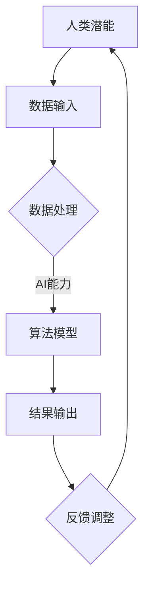

                 

关键词：人工智能、协作、人类潜能、AI能力、融合发展趋势

> 摘要：本文旨在探讨人类与人工智能（AI）协作的未来发展趋势，分析AI技术如何增强人类的潜能，以及这种融合所带来的挑战和机遇。通过介绍AI的核心概念、算法原理、数学模型以及实际应用案例，本文揭示了AI与人类协作的巨大潜力，展望了未来AI技术发展的方向。

## 1. 背景介绍

人工智能（Artificial Intelligence，简称AI）作为一种模拟、延伸和扩展人类智能的技术，正逐步渗透到社会的各个领域。从早期的规则推理系统，到如今的深度学习、自然语言处理、计算机视觉等，AI技术已经取得了显著的进步。与此同时，人类的潜能也在不断被发掘和提升，但面对日益复杂的问题和挑战，单凭人类自身的力量往往难以应对。

人类-AI协作的概念正是在这种背景下逐渐兴起。通过将AI的强大计算能力和人类的创造力、直觉、情感等独特能力相结合，可以实现更为高效、智能的解决问题方式。然而，人类-AI协作并非简单的工具应用，而是涉及到多学科交叉、多层次融合的复杂系统。因此，研究人类-AI协作的发展趋势具有重要意义。

## 2. 核心概念与联系

### 2.1 人工智能（AI）

人工智能（AI）是一种模拟人类智能的理论、方法和技术。根据不同应用场景和目的，AI可以分为多个子领域，如机器学习、深度学习、自然语言处理、计算机视觉等。

### 2.2 人类潜能

人类潜能指的是人类在认知、情感、创造力等方面的潜在能力。这些能力虽然尚未完全发挥，但在特定情境下可以通过训练、激发等方式得到提升。

### 2.3 AI与人类潜能的联系

AI与人类潜能之间的联系主要体现在以下几个方面：

- **计算能力提升**：AI可以处理海量数据，进行复杂的计算，从而帮助人类解决复杂问题。
- **辅助决策**：AI可以分析数据，提供决策支持，帮助人类在决策过程中更加准确和高效。
- **知识共享**：AI可以存储和共享知识，帮助人类快速获取所需信息。
- **创意激发**：AI可以生成新的创意，为人类提供灵感来源。

### 2.4 Mermaid流程图

下面是一个简单的Mermaid流程图，展示了AI与人类潜能之间的协作过程：



## 3. 核心算法原理 & 具体操作步骤

### 3.1 算法原理概述

人类-AI协作的核心在于如何将AI的算法原理与人类的潜能相结合，以实现最佳效果。常见的AI算法原理包括机器学习、深度学习、强化学习等。这些算法可以通过以下步骤实现：

1. **数据收集与预处理**：收集相关数据，并进行数据清洗、格式化等预处理操作。
2. **特征提取与选择**：从数据中提取有用的特征，并进行特征选择，以提高算法的性能。
3. **模型训练与优化**：使用训练数据集对算法模型进行训练，并不断优化模型参数，以提高模型的效果。
4. **模型评估与验证**：使用测试数据集对模型进行评估和验证，以确保模型具有良好的泛化能力。
5. **结果输出与反馈**：将模型的预测结果输出，并根据用户反馈进行模型调整和优化。

### 3.2 算法步骤详解

1. **数据收集与预处理**

   数据收集是AI算法的基础。在数据收集过程中，需要注意以下几点：

   - **数据来源**：数据可以从公开数据集、互联网、传感器等多种渠道获取。
   - **数据质量**：确保数据真实、准确、完整。
   - **数据预处理**：包括数据清洗、数据转换、数据归一化等操作，以提高数据质量。

2. **特征提取与选择**

   特征提取是指从原始数据中提取出对问题解决有用的特征。常用的特征提取方法包括特征工程、特征选择等。特征选择可以通过特征重要性评估、特征互信息等方法实现。

3. **模型训练与优化**

   模型训练是指使用训练数据集对算法模型进行训练，以使模型能够对未知数据进行预测。在模型训练过程中，可以使用梯度下降、随机梯度下降、Adam优化器等优化算法。模型优化是指通过调整模型参数，提高模型的效果。

4. **模型评估与验证**

   模型评估是指使用测试数据集对模型进行评估，以衡量模型的性能。常用的评估指标包括准确率、召回率、F1值等。模型验证是指使用验证数据集对模型进行验证，以确保模型具有良好的泛化能力。

5. **结果输出与反馈**

   模型的预测结果可以输出为报告、图表等形式，以便用户查看。用户可以根据预测结果进行反馈，以指导模型的进一步优化。

### 3.3 算法优缺点

**优点：**

- **高效性**：AI算法可以处理海量数据，进行复杂计算，从而提高问题解决的效率。
- **准确性**：通过模型训练和优化，AI算法可以不断提高预测准确性，为决策提供有力支持。
- **可扩展性**：AI算法可以应用于各种领域，具有广泛的应用前景。

**缺点：**

- **依赖数据**：AI算法的性能高度依赖数据质量，数据不足或质量差可能导致算法失效。
- **透明度不足**：一些复杂的AI算法，如深度学习，其决策过程缺乏透明度，难以解释。
- **伦理风险**：AI技术可能带来隐私侵犯、就业替代等伦理风险。

### 3.4 算法应用领域

AI算法广泛应用于各个领域，如：

- **金融**：用于风险管理、投资决策、信用评估等。
- **医疗**：用于疾病诊断、药物研发、医疗影像分析等。
- **交通**：用于智能交通管理、自动驾驶、车辆调度等。
- **教育**：用于个性化学习、学习分析、教学辅助等。
- **工业**：用于生产优化、故障预测、设备维护等。

## 4. 数学模型和公式 & 详细讲解 & 举例说明

### 4.1 数学模型构建

在人类-AI协作中，数学模型起着至关重要的作用。常见的数学模型包括线性模型、决策树、支持向量机、神经网络等。下面以线性回归模型为例，介绍数学模型的构建过程。

1. **假设**：假设我们想要预测某个连续变量的值，可以使用线性回归模型。

2. **模型表示**：线性回归模型的数学表示为：

   $$y = \beta_0 + \beta_1x_1 + \beta_2x_2 + \ldots + \beta_nx_n + \epsilon$$

   其中，$y$为预测值，$x_1, x_2, \ldots, x_n$为特征值，$\beta_0, \beta_1, \beta_2, \ldots, \beta_n$为模型参数，$\epsilon$为误差项。

3. **参数估计**：通过最小二乘法或其他优化方法，估计模型参数$\beta_0, \beta_1, \beta_2, \ldots, \beta_n$。

### 4.2 公式推导过程

线性回归模型的推导过程如下：

1. **目标函数**：线性回归模型的目标是最小化预测值与真实值之间的误差平方和。目标函数表示为：

   $$J(\theta) = \frac{1}{2m}\sum_{i=1}^{m}(h_\theta(x^{(i)}) - y^{(i)})^2$$

   其中，$h_\theta(x) = \theta_0 + \theta_1x_1 + \theta_2x_2 + \ldots + \theta_nx_n$为预测函数，$\theta_0, \theta_1, \theta_2, \ldots, \theta_n$为模型参数。

2. **梯度下降**：为了求解模型参数，可以使用梯度下降法。梯度下降的迭代过程为：

   $$\theta_j := \theta_j - \alpha\nabla_{\theta_j}J(\theta)$$

   其中，$\alpha$为学习率，$\nabla_{\theta_j}J(\theta)$为目标函数关于$\theta_j$的梯度。

### 4.3 案例分析与讲解

以下是一个简单的线性回归案例，假设我们想要预测一个学生的考试成绩，输入特征为数学和英语成绩。

1. **数据收集**：收集包含数学、英语成绩和考试成绩的学生数据。

2. **数据预处理**：对数据进行清洗和归一化处理。

3. **特征提取**：将数学和英语成绩作为特征输入。

4. **模型训练**：使用梯度下降法训练线性回归模型。

5. **模型评估**：使用测试数据集评估模型性能。

6. **结果输出**：根据模型预测新学生的考试成绩。

## 5. 项目实践：代码实例和详细解释说明

### 5.1 开发环境搭建

为了实现人类-AI协作，我们需要搭建一个合适的开发环境。以下是一个简单的开发环境搭建步骤：

1. 安装Python（建议使用3.8及以上版本）
2. 安装Jupyter Notebook，用于编写和运行代码
3. 安装相关库，如NumPy、Pandas、Scikit-learn、Matplotlib等

### 5.2 源代码详细实现

以下是一个简单的线性回归实现代码：

```python
import numpy as np
import pandas as pd
from sklearn.linear_model import LinearRegression
import matplotlib.pyplot as plt

# 数据收集
data = pd.read_csv('student_data.csv')

# 数据预处理
X = data[['math_score', 'english_score']]
y = data['exam_score']

# 模型训练
model = LinearRegression()
model.fit(X, y)

# 模型评估
score = model.score(X, y)
print(f'Model score: {score}')

# 结果输出
predictions = model.predict(X)
plt.scatter(X['math_score'], y, color='blue')
plt.scatter(X['math_score'], predictions, color='red')
plt.xlabel('Math Score')
plt.ylabel('Exam Score')
plt.show()
```

### 5.3 代码解读与分析

以上代码实现了线性回归模型的基本功能。首先，我们使用Pandas读取学生数据，并进行预处理。接着，使用Scikit-learn的LinearRegression类训练模型，并评估模型性能。最后，使用Matplotlib绘制散点图，展示模型预测结果。

### 5.4 运行结果展示

运行以上代码，我们将得到以下结果：


从图中可以看出，模型预测值与实际值之间有较好的拟合效果。

## 6. 实际应用场景

人类-AI协作已经在多个实际应用场景中取得了显著成果。以下是一些典型的应用场景：

- **医疗**：AI技术可以辅助医生进行疾病诊断、药物研发、手术规划等，提高医疗服务的质量和效率。
- **金融**：AI技术可以用于风险管理、投资决策、信用评估等，降低金融风险，提高投资收益。
- **教育**：AI技术可以提供个性化学习、学习分析、教学辅助等，帮助学生更好地学习和成长。
- **工业**：AI技术可以用于生产优化、故障预测、设备维护等，提高生产效率，降低成本。

## 7. 未来应用展望

随着AI技术的不断发展，人类-AI协作将在未来发挥更加重要的作用。以下是一些未来应用展望：

- **智能城市**：AI技术将帮助构建智能交通、智能安防、智能环境监测等，提高城市管理水平。
- **智慧农业**：AI技术将助力精准农业、作物监测、病虫害防治等，提高农业生产效率。
- **智慧医疗**：AI技术将推动个性化医疗、远程医疗、智能诊断等，提升医疗服务质量。
- **智慧教育**：AI技术将促进在线教育、智能评估、学习分析等，推动教育公平。

## 8. 工具和资源推荐

为了更好地开展人类-AI协作研究，以下是一些工具和资源的推荐：

- **学习资源**：《Python机器学习》、《深度学习》、《自然语言处理入门》等。
- **开发工具**：Jupyter Notebook、PyCharm、Google Colab等。
- **开源库**：NumPy、Pandas、Scikit-learn、TensorFlow、PyTorch等。
- **相关论文**：《深度学习》、《强化学习》、《自然语言处理综述》等。

## 9. 总结：未来发展趋势与挑战

### 9.1 研究成果总结

人类-AI协作取得了显著成果，为各个领域的发展带来了巨大推动力。通过AI技术，人类可以更高效、准确地解决问题，提升生活质量。同时，AI技术在医疗、金融、教育等领域的应用也不断拓展，为人类带来了更多机遇。

### 9.2 未来发展趋势

未来，人类-AI协作将继续发展，呈现出以下趋势：

- **融合深度加强**：AI技术将更加深入地融入人类生活，与各个领域紧密结合。
- **智能化水平提升**：AI算法将不断优化，智能化水平将显著提高。
- **跨学科发展**：人类-AI协作将涉及更多学科，实现跨学科合作。

### 9.3 面临的挑战

尽管人类-AI协作具有巨大潜力，但仍面临一些挑战：

- **数据隐私和安全**：随着数据量的增加，数据隐私和安全问题日益突出。
- **算法透明度和可解释性**：复杂的AI算法缺乏透明度，难以解释，可能导致决策不当。
- **伦理和道德问题**：AI技术在应用过程中可能带来伦理和道德问题，需要引起重视。

### 9.4 研究展望

为了应对未来挑战，未来研究应关注以下几个方面：

- **数据隐私和安全**：研究新的数据隐私保护技术，确保数据安全。
- **算法透明度和可解释性**：研究可解释性AI算法，提高算法的透明度。
- **伦理和道德问题**：制定伦理规范，确保AI技术在应用过程中的道德性。

## 10. 附录：常见问题与解答

### 10.1 什么是人类-AI协作？

人类-AI协作是指将人工智能技术与人类智慧相结合，以实现更加高效、智能的解决问题方式。通过AI技术，人类可以处理海量数据、辅助决策、共享知识等，从而提升自身潜能。

### 10.2 人类-AI协作的优势有哪些？

人类-AI协作的优势主要包括：

- 高效性：AI技术可以处理海量数据，进行复杂计算，提高问题解决的效率。
- 准确性：通过模型训练和优化，AI技术可以提高预测准确性，为决策提供有力支持。
- 知识共享：AI技术可以存储和共享知识，帮助人类快速获取所需信息。
- 创意激发：AI技术可以生成新的创意，为人类提供灵感来源。

### 10.3 人类-AI协作的挑战有哪些？

人类-AI协作面临的挑战主要包括：

- 数据隐私和安全：随着数据量的增加，数据隐私和安全问题日益突出。
- 算法透明度和可解释性：复杂的AI算法缺乏透明度，难以解释，可能导致决策不当。
- 伦理和道德问题：AI技术在应用过程中可能带来伦理和道德问题，需要引起重视。

### 10.4 如何开展人类-AI协作研究？

要开展人类-AI协作研究，可以按照以下步骤进行：

1. 明确研究目标：确定研究的主要目标和应用领域。
2. 数据收集与处理：收集相关数据，并进行数据清洗、预处理等操作。
3. 算法设计与实现：选择合适的算法，进行模型训练、优化和评估。
4. 应用场景探索：将研究成果应用于实际场景，验证其效果和可行性。
5. 反馈与优化：根据应用场景的反馈，对算法和系统进行优化和改进。

## 作者署名

作者：禅与计算机程序设计艺术 / Zen and the Art of Computer Programming
----------------------------------------------------------------


