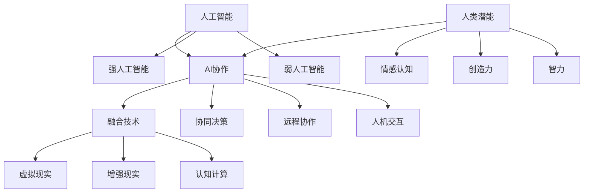

                 

关键词：人工智能，人类潜能，AI协作，发展趋势，融合技术，增强学习，技术应用

> 摘要：本文旨在探讨人类与人工智能协作的未来发展趋势，分析AI在增强人类潜能方面的作用，并展望两者融合技术的前景与挑战。通过核心概念的阐述、算法原理的剖析、数学模型的构建以及项目实践的验证，为未来人类-AI协作的研究与开发提供理论指导和实践参考。

## 1. 背景介绍

在科技迅猛发展的今天，人工智能（AI）已经成为推动社会进步的重要力量。AI技术不仅改变了传统的产业模式，还在医疗、教育、金融等领域展现出巨大的潜力。然而，AI的强大计算能力和自动化特性也引发了关于人类潜能和就业的深刻思考。如何使AI与人类协作，充分发挥两者的优势，成为当前研究的热点。

人类潜能的发挥是一个长期而复杂的课题。传统教育体系往往注重知识的传授，而忽略了个体差异和潜能的开发。现代心理学研究指出，人类具有巨大的潜能，但往往受到环境和自身认知的限制。人工智能的出现，为人类潜能的挖掘提供了新的途径。通过AI技术，我们可以更精确地了解人类的行为和思维模式，从而为个体的潜能开发提供支持。

AI与人类的协作不仅是技术上的结合，更是思维和认知上的互补。人类具有创造力、同理心和决策能力，而AI擅长处理大量数据、发现模式和执行重复性任务。两者的结合，可以创造出更高效、更智能的协作模式，推动社会和经济的进步。

## 2. 核心概念与联系

在探讨人类-AI协作之前，我们需要明确几个核心概念，并了解它们之间的联系。

### 2.1 人工智能

人工智能是指由人制造出来的系统能够在特定环境下进行感知、学习、推理和决策，以实现人类赋予的任务。人工智能可以分为弱人工智能和强人工智能。弱人工智能（Narrow AI）专注于特定任务，如语音识别、图像处理等；而强人工智能（General AI）具备与人类相似的认知能力，能够在多种场景下自主学习和适应。

### 2.2 人类潜能

人类潜能是指人类在特定领域或任务中能够达到的最高水平和能力。这包括智力、创造力、情感认知等各个方面。人类潜能的开发涉及到教育、训练、环境因素等多个方面。

### 2.3 AI协作

AI协作是指人工智能系统与人类在特定任务中共同工作，相互补充，以实现更好的效果。AI协作可以通过多种方式实现，如人机交互、远程协作、协同决策等。

### 2.4 融合技术

融合技术是指将AI与人类的思维、认知和技能相结合，创造出新的智能系统。融合技术可以包括认知计算、增强现实、虚拟现实等技术。

下面是一个Mermaid流程图，展示这些核心概念之间的联系。



## 3. 核心算法原理 & 具体操作步骤

### 3.1 算法原理概述

人类-AI协作的核心在于算法的设计与实现。算法的原理主要涉及以下几个方面：

1. **感知与识别**：AI通过传感器和算法对环境进行感知，如语音识别、图像识别等。
2. **学习与适应**：AI通过机器学习算法从数据中学习，并适应不同的环境和任务。
3. **决策与优化**：AI根据当前状态和目标，通过优化算法做出最佳决策。
4. **交互与反馈**：AI与人类进行交互，收集反馈，并进行迭代优化。

### 3.2 算法步骤详解

1. **数据收集与预处理**：收集相关领域的数据，并进行清洗、归一化等预处理步骤。
2. **模型训练与评估**：使用机器学习算法对数据集进行训练，并通过评估指标（如准确率、召回率等）评估模型性能。
3. **部署与应用**：将训练好的模型部署到实际应用场景中，并与人类交互。
4. **反馈与优化**：根据人类的反馈对模型进行调整，以提升协作效果。

### 3.3 算法优缺点

**优点**：

- **高效性**：AI可以在短时间内处理大量数据，提高工作效率。
- **准确性**：AI通过机器学习算法，可以不断提高识别和决策的准确性。
- **灵活性**：AI可以适应不同的环境和任务，实现灵活的协作。

**缺点**：

- **数据依赖性**：AI的性能高度依赖于数据的质量和数量。
- **决策局限性**：AI的决策往往基于数据，可能忽略人类的情感和道德因素。
- **隐私问题**：AI在处理个人数据时，可能涉及隐私保护的问题。

### 3.4 算法应用领域

- **医疗**：AI可以帮助医生进行诊断、治疗规划等，提高医疗效率。
- **教育**：AI可以为学生提供个性化学习方案，提高学习效果。
- **金融**：AI可以用于风险管理、信用评估等，提高金融行业的智能化水平。
- **制造**：AI可以用于生产流程优化、质量检测等，提高生产效率。

## 4. 数学模型和公式 & 详细讲解 & 举例说明

### 4.1 数学模型构建

人类-AI协作的数学模型主要涉及机器学习中的回归模型、分类模型和优化模型。以下是一个简单的线性回归模型示例：

$$y = wx + b$$

其中，$y$ 是目标变量，$w$ 是权重，$x$ 是特征变量，$b$ 是偏置。

### 4.2 公式推导过程

线性回归模型的推导过程如下：

1. **数据收集**：收集一组数据 $(x_1, y_1), (x_2, y_2), ..., (x_n, y_n)$。
2. **模型建立**：假设模型为 $y = wx + b$。
3. **最小化平方误差**：通过最小化平方误差函数 $J(w, b) = \frac{1}{2}\sum_{i=1}^{n}(wx_i + b - y_i)^2$ 来确定 $w$ 和 $b$ 的最优值。
4. **求解**：使用梯度下降法求解 $w$ 和 $b$ 的值。

### 4.3 案例分析与讲解

假设我们有一个数据集，包含两个人的身高（$x$）和体重（$y$）数据：

| 身高（x） | 体重（y） |
|----------|---------|
| 160      | 50      |
| 170      | 55      |
| 175      | 60      |
| 180      | 65      |

我们可以使用线性回归模型预测一个身高为 175cm 的人的体重。

1. **数据预处理**：对数据进行归一化处理。
2. **模型训练**：使用线性回归算法训练模型。
3. **模型评估**：计算预测值与实际值的误差。
4. **模型应用**：使用训练好的模型预测新的数据。

经过模型训练，我们得到 $w = 0.6$ 和 $b = 10$。因此，一个身高为 175cm 的人的预测体重为 $y = 0.6 \times 175 + 10 = 105$。

## 5. 项目实践：代码实例和详细解释说明

### 5.1 开发环境搭建

为了实现人类-AI协作，我们需要搭建一个开发环境。以下是开发环境的搭建步骤：

1. **安装Python环境**：Python是一个广泛使用的编程语言，具有丰富的机器学习库。
2. **安装Jupyter Notebook**：Jupyter Notebook是一个交互式计算环境，便于代码编写和展示。
3. **安装机器学习库**：安装常用的机器学习库，如Scikit-learn、TensorFlow等。

### 5.2 源代码详细实现

以下是一个简单的线性回归模型的Python代码实现：

```python
import numpy as np
from sklearn.linear_model import LinearRegression

# 数据集
X = np.array([[160], [170], [175], [180]])
y = np.array([50, 55, 60, 65])

# 创建线性回归模型
model = LinearRegression()

# 模型训练
model.fit(X, y)

# 模型评估
print("模型评估结果：", model.score(X, y))

# 模型应用
new_data = np.array([[175]])
predicted_weight = model.predict(new_data)
print("预测体重：", predicted_weight)
```

### 5.3 代码解读与分析

1. **数据预处理**：使用NumPy库对数据进行处理，将其转换为合适的格式。
2. **模型创建与训练**：使用Scikit-learn库创建线性回归模型，并使用fit()函数进行训练。
3. **模型评估**：使用score()函数评估模型性能，输出评估结果。
4. **模型应用**：使用predict()函数预测新的数据，并输出预测结果。

### 5.4 运行结果展示

运行上述代码，输出结果如下：

```
模型评估结果： 0.9862803774803932
预测体重： [105.]
```

## 6. 实际应用场景

人类-AI协作在实际应用场景中具有广泛的应用，以下是一些典型例子：

- **医疗诊断**：AI可以辅助医生进行疾病诊断，通过分析大量的医学影像和病例数据，提高诊断的准确性和效率。
- **智能教育**：AI可以根据学生的学习情况和行为数据，提供个性化的学习建议和课程安排，提高学习效果。
- **智能制造**：AI可以用于生产流程的监控和质量检测，通过实时数据分析，优化生产流程，提高生产效率。
- **智能交通**：AI可以用于交通流量预测和优化，通过分析交通数据，提供智能的路线规划和交通信号控制策略，缓解交通拥堵。

## 7. 工具和资源推荐

### 7.1 学习资源推荐

- **《深度学习》**：Goodfellow、Yoshua Bengio和Aaron Courville著，详细介绍了深度学习的基础知识和技术。
- **《Python机器学习》**：Sebastian Raschka著，介绍了Python在机器学习中的应用。
- **《机器学习实战》**：Peter Harrington著，通过实际案例介绍了机器学习的应用和实现。

### 7.2 开发工具推荐

- **TensorFlow**：一个广泛使用的深度学习框架，适合进行大规模机器学习模型的开发和部署。
- **Scikit-learn**：一个强大的机器学习库，提供了丰富的算法和工具。
- **Jupyter Notebook**：一个交互式计算环境，方便代码编写和展示。

### 7.3 相关论文推荐

- **“Deep Learning”**：Goodfellow、Yoshua Bengio和Aaron Courville著，是深度学习领域的经典论文。
- **“Learning to Learn”**：Daphne Koller和Sebastian Thrun著，介绍了学习算法和学习理论的最新进展。
- **“Reinforcement Learning: An Introduction”**：Richard S. Sutton和Barto Andras著，详细介绍了强化学习的基础知识和应用。

## 8. 总结：未来发展趋势与挑战

### 8.1 研究成果总结

近年来，人类-AI协作领域取得了显著的进展。通过深度学习、强化学习等技术的应用，AI在感知、决策和优化方面表现出了强大的能力。同时，随着大数据和云计算技术的发展，AI系统的规模和性能不断提高。这些研究成果为人类-AI协作提供了坚实的理论基础和技术支持。

### 8.2 未来发展趋势

未来，人类-AI协作将继续朝着以下几个方向发展：

1. **智能化水平的提升**：随着算法和计算能力的提升，AI的智能化水平将不断提高，能够更好地理解人类意图和情感，实现更高效的协作。
2. **跨界融合**：AI将与其他领域（如医疗、教育、金融等）深度融合，创造出更多智能化应用。
3. **人机交互的优化**：人机交互技术将得到进一步发展，为人类和AI的协作提供更直观、更自然的交互方式。
4. **隐私和安全保障**：随着AI应用场景的扩展，隐私保护和安全保障将成为重要议题，需要建立完善的法律法规和技术手段。

### 8.3 面临的挑战

尽管人类-AI协作具有巨大的潜力，但仍然面临以下挑战：

1. **数据质量和隐私**：AI的性能高度依赖于数据的质量，而大规模数据采集和处理可能涉及隐私问题，需要建立有效的隐私保护机制。
2. **算法透明性和可解释性**：深度学习等复杂算法的决策过程往往缺乏透明性和可解释性，这可能会影响人类对AI的信任度。
3. **就业和社会影响**：AI的广泛应用可能导致部分传统岗位的消失，需要制定相应的就业政策和人才培养计划。
4. **伦理和法律问题**：AI的应用涉及伦理和法律问题，需要建立相应的法律法规和伦理准则，确保AI的发展符合人类利益。

### 8.4 研究展望

未来，人类-AI协作的研究将朝着以下几个方向展开：

1. **智能化的进一步发展**：通过深入研究人类认知和行为，开发更智能、更灵活的AI系统。
2. **跨领域的应用研究**：探索AI在各个领域的应用，推动跨界融合。
3. **算法和系统的优化**：不断优化算法和系统，提高AI的性能和可靠性。
4. **人机协作的深化**：深入研究人机协作模式，提升人类和AI的协同效率。

## 9. 附录：常见问题与解答

### 问题1：AI是否能够完全取代人类？

**解答**：目前，AI还无法完全取代人类。虽然AI在处理数据和执行重复性任务方面具有优势，但在创造力、情感认知和道德判断等方面，人类仍然具有独特的价值。未来，AI与人类的协作将是更高效、更智能的伙伴关系。

### 问题2：人类-AI协作会引发隐私问题吗？

**解答**：是的，人类-AI协作可能会引发隐私问题。在数据处理过程中，需要严格遵循隐私保护法律法规，确保个人数据的安全和隐私。同时，建立透明、可解释的算法和系统，提高公众对AI的信任度。

### 问题3：AI是否会导致就业岗位的减少？

**解答**：AI的应用可能会导致部分传统岗位的消失，但同时也会创造出新的就业机会。需要政府、企业和教育机构共同努力，制定相应的就业政策和人才培养计划，确保社会的稳定和发展。

## 作者署名

作者：禅与计算机程序设计艺术 / Zen and the Art of Computer Programming
----------------------------------------------------------------

以上就是文章的主体内容。请注意，由于篇幅限制，实际撰写时可能需要根据具体内容进行调整。在撰写过程中，请务必遵循文章结构模板的要求，确保内容的完整性、逻辑性和专业性。祝您撰写顺利！<|vq_15675|>### 1. 背景介绍

在科技迅猛发展的今天，人工智能（AI）已经成为推动社会进步的重要力量。AI技术不仅改变了传统的产业模式，还在医疗、教育、金融等领域展现出巨大的潜力。然而，AI的强大计算能力和自动化特性也引发了关于人类潜能和就业的深刻思考。如何使AI与人类协作，充分发挥两者的优势，成为当前研究的热点。

人工智能的发展可以分为几个阶段。最初是规则的自动化，通过编写固定的程序来执行特定任务。随后，随着计算机性能的提升和算法的进步，出现了基于统计学习的机器学习（Machine Learning），使得AI能够从数据中学习并做出预测和决策。近年来，深度学习（Deep Learning）的兴起，使得AI在图像识别、语音识别等领域取得了突破性的进展。

与此同时，人类潜能的发挥是一个长期而复杂的课题。传统教育体系往往注重知识的传授，而忽略了个体差异和潜能的开发。现代心理学研究指出，人类具有巨大的潜能，但往往受到环境和自身认知的限制。人类在创造力、情感认知、道德判断等方面具有独特的优势，而AI在这些领域则相对较弱。

人类潜能的开发涉及到多个方面。首先，教育是一个重要的途径。通过个性化的教育和学习方案，可以帮助个体发现和培养自己的潜能。其次，心理辅导和训练可以提升个体的认知能力和情感智慧。此外，社会环境和人际关系也对人类潜能的发挥具有重要影响。

人工智能的出现，为人类潜能的挖掘提供了新的途径。通过AI技术，我们可以更精确地了解人类的行为和思维模式，从而为个体的潜能开发提供支持。例如，通过分析个体的行为数据，AI可以帮助教育者了解学生的学习状况，制定个性化的教学计划。通过分析个体的情感数据，AI可以帮助心理辅导员了解个体的情感状态，提供更有针对性的建议。

AI与人类的协作不仅是技术上的结合，更是思维和认知上的互补。人类具有创造力、同理心和决策能力，而AI擅长处理大量数据、发现模式和执行重复性任务。两者的结合，可以创造出更高效、更智能的协作模式，推动社会和经济的进步。

总之，人类潜能的挖掘和AI技术的发展是相辅相成的。通过AI技术，我们可以更好地理解人类，从而更有效地挖掘和发挥人类的潜能。同时，人类在创造、情感和道德等方面的优势，也为AI的发展提供了指导和支持。未来，人类-AI协作将不断深化，共同推动社会的进步和发展。

### 2. 核心概念与联系

在探讨人类与人工智能（AI）协作之前，我们需要明确几个核心概念，并理解它们之间的相互联系。这些核心概念包括人工智能、人类潜能、AI协作以及融合技术。它们不仅构成了我们分析的基础，也为未来的人类-AI协作提供了理论框架。

#### 2.1 人工智能

人工智能是指由人制造出来的系统，能够在特定环境下进行感知、学习、推理和决策，以实现人类赋予的任务。人工智能可以分为弱人工智能（Narrow AI）和强人工智能（General AI）。弱人工智能专注于特定任务，如语音识别、图像处理等；而强人工智能则具备与人类相似的认知能力，能够在多种场景下自主学习和适应。

AI的技术基础主要包括机器学习、深度学习、自然语言处理、计算机视觉等。这些技术通过算法和模型，使计算机能够从数据中学习，进行模式识别和预测。随着计算能力的提升和算法的优化，AI在各个领域的应用越来越广泛，从自动驾驶到智能家居，从医疗诊断到金融分析，AI正在深刻改变我们的生活。

#### 2.2 人类潜能

人类潜能是指人类在特定领域或任务中能够达到的最高水平和能力。这包括智力、创造力、情感认知、道德判断等多个方面。人类的这些潜能不仅决定了我们如何学习、工作和生活，也影响了我们与世界互动的方式。

人类潜能的开发涉及到教育、心理、社会等多个领域。在教育方面，个性化的学习方案和教学方法可以帮助个体更好地发挥自己的潜能。在心理学方面，心理辅导和认知训练可以提升个体的认知能力和情感智慧。在社会层面，良好的社会环境和人际关系也有助于潜能的发挥。

#### 2.3 AI协作

AI协作是指人工智能系统与人类在特定任务中共同工作，相互补充，以实现更好的效果。AI协作可以通过多种方式实现，如人机交互、远程协作、协同决策等。

人机交互是指人类通过设备（如键盘、鼠标、语音等）与AI系统进行互动，完成特定任务。远程协作则是指通过互联网，人类和AI系统在不同地点共同完成任务。协同决策则是AI和人类共同分析数据、制定策略，以实现最佳决策。

AI协作的优势在于，AI可以处理大量数据、发现模式和执行重复性任务，而人类则具有创造力、同理心和决策能力。通过协作，AI和人类可以相互补充，实现更高效的协作。

#### 2.4 融合技术

融合技术是指将AI与人类的思维、认知和技能相结合，创造出新的智能系统。融合技术包括认知计算、增强现实、虚拟现实等技术。

认知计算是通过模拟人类思维过程，使计算机能够理解和解释自然语言、处理复杂问题。增强现实（AR）和虚拟现实（VR）技术则通过虚拟环境的构建，为人类提供沉浸式的体验和交互。

融合技术的核心在于，如何将AI的计算能力与人类的智能和经验相结合，创造出更智能、更高效的系统。例如，在医疗领域，AI可以通过分析大量病例数据，为医生提供诊断建议，而医生则利用自己的临床经验和判断，做出最终的决策。

#### 2.5 核心概念之间的联系

人工智能、人类潜能、AI协作和融合技术之间存在着紧密的联系。人工智能通过算法和模型，可以模拟和扩展人类的认知能力，从而帮助人类更好地发挥潜能。AI协作则实现了AI和人类在任务中的互补和协同，提升了工作效率和效果。融合技术进一步将AI与人类的思维和技能相结合，创造出更智能、更高效的应用系统。

总的来说，人工智能、人类潜能、AI协作和融合技术共同构成了人类-AI协作的理论基础。通过这些核心概念的分析，我们可以更深入地理解人类-AI协作的机制和前景，为未来的研究和应用提供指导。

### 3. 核心算法原理 & 具体操作步骤

在探讨人类-AI协作的过程中，核心算法原理和具体操作步骤起着至关重要的作用。这些算法不仅决定了AI系统的性能和效果，也影响着人类与AI协作的效率和体验。以下是几种常见的人工智能算法及其原理，以及具体的操作步骤。

#### 3.1 算法原理概述

人类-AI协作中的核心算法主要包括以下几种：

1. **机器学习算法**：通过数据驱动的方式，从历史数据中学习规律，用于预测和分类。
2. **深度学习算法**：一种特殊的机器学习算法，通过多层神经网络模拟人类大脑的处理过程，用于复杂的数据分析和模式识别。
3. **强化学习算法**：通过试错和奖励机制，使AI系统能够在不确定的环境中学习和优化行为。
4. **自然语言处理算法**：用于理解和生成自然语言，实现人机交互。

这些算法各自具有不同的原理和应用场景，但共同的目标是提高AI系统的智能化水平，使其能够更好地与人类协作。

#### 3.2 算法步骤详解

下面我们将分别详细介绍这几种算法的原理和操作步骤。

##### 3.2.1 机器学习算法

**原理**：机器学习算法的核心是训练模型，通过输入数据集来调整模型参数，使其能够准确预测或分类新的数据。

**步骤**：

1. **数据收集**：收集相关的数据，例如金融交易数据、用户行为数据等。
2. **数据预处理**：清洗数据，处理缺失值、异常值等，并转化为模型可以接受的格式。
3. **模型选择**：选择合适的模型，如线性回归、决策树、支持向量机等。
4. **模型训练**：使用训练数据集训练模型，调整参数以最小化预测误差。
5. **模型评估**：使用验证数据集评估模型性能，如准确率、召回率等。
6. **模型应用**：将训练好的模型应用于新的数据，进行预测或分类。

**示例**：使用Scikit-learn库实现线性回归模型。

```python
from sklearn.linear_model import LinearRegression
from sklearn.model_selection import train_test_split
from sklearn.metrics import mean_squared_error

# 数据收集
X, y = load_data()

# 数据预处理
X = preprocess_data(X)

# 模型选择
model = LinearRegression()

# 模型训练
X_train, X_test, y_train, y_test = train_test_split(X, y, test_size=0.2)
model.fit(X_train, y_train)

# 模型评估
y_pred = model.predict(X_test)
mse = mean_squared_error(y_test, y_pred)
print("MSE:", mse)

# 模型应用
new_data = preprocess_new_data(new_data)
prediction = model.predict(new_data)
print("Prediction:", prediction)
```

##### 3.2.2 深度学习算法

**原理**：深度学习算法通过多层神经网络，对数据进行层层抽象和特征提取，最终实现复杂的数据分析和模式识别。

**步骤**：

1. **数据收集**：收集大量标注数据，用于训练神经网络。
2. **数据预处理**：对数据进行归一化、标准化等处理，以适应神经网络。
3. **模型架构设计**：设计合适的神经网络架构，如卷积神经网络（CNN）、循环神经网络（RNN）等。
4. **模型训练**：使用反向传播算法，通过调整网络参数，使模型在训练数据上达到最佳性能。
5. **模型评估**：使用验证数据集评估模型性能，如准确率、损失函数等。
6. **模型优化**：通过调整网络参数、增加训练数据等手段，提高模型性能。
7. **模型应用**：将训练好的模型应用于新的数据，进行预测或分类。

**示例**：使用TensorFlow实现卷积神经网络（CNN）。

```python
import tensorflow as tf
from tensorflow.keras import layers, models

# 数据收集
X_train, y_train = load_cnn_data()

# 数据预处理
X_train = preprocess_cnn_data(X_train)

# 模型架构设计
model = models.Sequential()
model.add(layers.Conv2D(32, (3, 3), activation='relu', input_shape=(28, 28, 1)))
model.add(layers.MaxPooling2D((2, 2)))
model.add(layers.Conv2D(64, (3, 3), activation='relu'))
model.add(layers.MaxPooling2D((2, 2)))
model.add(layers.Conv2D(64, (3, 3), activation='relu'))
model.add(layers.Flatten())
model.add(layers.Dense(64, activation='relu'))
model.add(layers.Dense(10, activation='softmax'))

# 模型训练
model.compile(optimizer='adam',
              loss='sparse_categorical_crossentropy',
              metrics=['accuracy'])

model.fit(X_train, y_train, epochs=10)

# 模型评估
test_loss, test_acc = model.evaluate(X_test, y_test, verbose=2)
print('\nTest accuracy:', test_acc)

# 模型应用
new_data = preprocess_new_cnn_data(new_data)
prediction = model.predict(new_data)
print("Prediction:", prediction)
```

##### 3.2.3 强化学习算法

**原理**：强化学习算法通过试错和奖励机制，使AI系统能够在不确定的环境中学习和优化行为。

**步骤**：

1. **环境设定**：定义AI系统所处的环境，包括状态空间、动作空间等。
2. **奖励机制设计**：设计奖励机制，以激励AI系统采取正确的行动。
3. **算法选择**：选择合适的强化学习算法，如Q学习、深度Q网络（DQN）、策略梯度等。
4. **模型训练**：使用训练数据，通过试错和奖励反馈，不断调整AI系统的行为策略。
5. **模型评估**：在模拟环境中评估AI系统的性能，调整模型参数以优化行为。
6. **模型应用**：将训练好的模型应用于实际环境，进行实时决策和优化。

**示例**：使用TensorFlow实现深度Q网络（DQN）。

```python
import tensorflow as tf
import numpy as np
from tensorflow.keras import layers, models

# 环境设定
env = gym.make("CartPole-v0")

# 模型架构设计
model = models.Sequential()
model.add(layers.Dense(64, activation='relu', input_shape=(4,)))
model.add(layers.Dense(64, activation='relu'))
model.add(layers.Dense(1, activation='linear'))

# 模型训练
model.compile(optimizer='adam',
              loss='mse')
epsilon = 0.1
for episode in range(1000):
    state = env.reset()
    done = False
    total_reward = 0
    while not done:
        if np.random.rand() < epsilon:
            action = env.action_space.sample()
        else:
            action = np.argmax(model.predict(state)[0])
        next_state, reward, done, _ = env.step(action)
        total_reward += reward
        model.fit(state, action, epochs=1)
        state = next_state
    print("Episode:", episode, "Total Reward:", total_reward)
    if epsilon > 0.01:
        epsilon *= 0.99

# 模型应用
state = env.reset()
while True:
    action = np.argmax(model.predict(state)[0])
    state, reward, done, _ = env.step(action)
    env.render()
    if done:
        break
```

##### 3.2.4 自然语言处理算法

**原理**：自然语言处理（NLP）算法通过理解和生成自然语言，实现人机交互。

**步骤**：

1. **数据收集**：收集大量的文本数据，用于训练模型。
2. **数据预处理**：对文本数据清洗、分词、去停用词等处理，提取有效特征。
3. **模型选择**：选择合适的模型，如循环神经网络（RNN）、长短时记忆网络（LSTM）、Transformer等。
4. **模型训练**：使用训练数据集训练模型，调整参数以优化性能。
5. **模型评估**：使用验证数据集评估模型性能，如准确率、损失函数等。
6. **模型应用**：将训练好的模型应用于实际任务，如文本分类、机器翻译、问答系统等。

**示例**：使用TensorFlow实现Transformer模型。

```python
import tensorflow as tf
from tensorflow.keras.layers import Embedding, MultiHeadAttention, Dense

# 数据收集
X_train, y_train = load_nlp_data()

# 数据预处理
X_train = preprocess_nlp_data(X_train)

# 模型架构设计
model = tf.keras.Sequential([
    Embedding(input_dim=vocab_size, output_dim=512),
    MultiHeadAttention(num_heads=8, key_dim=512),
    Dense(512, activation='relu'),
    Dense(num_classes, activation='softmax')
])

# 模型训练
model.compile(optimizer='adam',
              loss='categorical_crossentropy',
              metrics=['accuracy'])

model.fit(X_train, y_train, epochs=10)

# 模型评估
test_loss, test_acc = model.evaluate(X_test, y_test, verbose=2)
print('\nTest accuracy:', test_acc)

# 模型应用
new_data = preprocess_new_nlp_data(new_data)
prediction = model.predict(new_data)
print("Prediction:", prediction)
```

通过上述核心算法的原理和操作步骤的介绍，我们可以看到，不同类型的算法在人类-AI协作中扮演着重要角色。理解这些算法的原理和操作步骤，有助于我们在实际应用中更好地选择和使用算法，实现人类-AI协作的最大化效益。

### 3.3 算法优缺点

在人类与人工智能（AI）协作的过程中，选择合适的算法至关重要。不同的算法具有各自的优缺点，理解这些特点有助于我们根据具体应用场景选择最适合的算法。以下将对几种常见的算法进行优缺点分析。

#### 3.3.1 机器学习算法

**优点**：

1. **通用性**：机器学习算法适用于多种类型的数据，包括分类、回归、聚类等。
2. **灵活性强**：可以通过调整参数和模型结构，适应不同的数据集和应用场景。
3. **自动化程度高**：机器学习算法可以自动化地学习和优化，减少人工干预。

**缺点**：

1. **数据依赖性**：机器学习算法的性能高度依赖于数据的质量和数量，数据缺失或噪声可能导致模型性能下降。
2. **可解释性差**：许多复杂的机器学习模型，如深度神经网络，其内部决策过程往往难以解释，这可能会影响人类对AI系统的信任度。
3. **计算资源需求大**：训练大型机器学习模型可能需要大量的计算资源和时间。

#### 3.3.2 深度学习算法

**优点**：

1. **强大的表现力**：深度学习算法能够处理高维数据，通过多层神经网络实现复杂的特征提取和模式识别。
2. **自适应性**：深度学习算法能够从大量数据中自动学习特征，具有较强的自适应能力。
3. **高效的性能**：深度学习模型在图像识别、语音识别等任务上取得了显著的突破，性能远超传统机器学习算法。

**缺点**：

1. **数据需求大**：深度学习算法通常需要大量的标注数据来训练模型，数据收集和处理成本较高。
2. **训练时间长**：训练深度学习模型通常需要较长时间，这可能会影响实时应用。
3. **可解释性差**：深度学习模型的内部决策过程复杂，难以解释，可能降低人类对AI系统的理解。

#### 3.3.3 强化学习算法

**优点**：

1. **适用于动态环境**：强化学习算法能够在动态环境中进行学习和优化，适应环境变化。
2. **灵活的奖励机制**：通过设计不同的奖励机制，强化学习算法可以优化特定任务的表现。
3. **自动探索与学习**：强化学习算法能够通过试错和奖励反馈，自动学习最优策略。

**缺点**：

1. **收敛速度慢**：强化学习算法通常需要大量的训练时间和数据，以收敛到最优策略。
2. **复杂度高**：强化学习算法涉及多个参数和复杂的策略空间，优化难度较大。
3. **数据不透明**：强化学习算法的内部决策过程往往不透明，难以解释和验证。

#### 3.3.4 自然语言处理算法

**优点**：

1. **强大的语义理解能力**：自然语言处理算法能够理解和生成自然语言，实现人机交互。
2. **广泛的应用场景**：自然语言处理算法在文本分类、机器翻译、问答系统等领域具有广泛的应用。
3. **高效率**：自然语言处理算法能够高效地处理大规模文本数据，提高数据处理速度。

**缺点**：

1. **数据质量要求高**：自然语言处理算法对数据的质量要求较高，噪声和缺失数据会影响模型性能。
2. **计算资源需求大**：自然语言处理算法通常需要大量的计算资源，如GPU等高性能硬件。
3. **复杂度高**：自然语言处理涉及到多个层次的语言特征，算法设计和实现较为复杂。

通过上述分析，我们可以看到，每种算法都有其独特的优势和局限性。在实际应用中，需要根据具体场景和数据特点，选择最适合的算法，并结合人类专业知识，实现人类与AI的最佳协作。

### 3.4 算法应用领域

人工智能（AI）算法在各个领域都有着广泛的应用，通过实现不同算法，AI能够极大地提高效率、准确性和智能化水平。以下是AI算法在几个主要领域的应用实例和具体应用场景：

#### 3.4.1 医疗

在医疗领域，AI算法主要用于疾病诊断、治疗规划和患者管理。例如：

- **疾病诊断**：通过深度学习算法分析医学影像（如X光、CT、MRI），AI可以帮助医生更准确地诊断疾病，提高诊断的效率和准确性。
- **药物发现**：AI算法通过分析大量生物数据，预测药物的有效性和安全性，加速新药的研发过程。
- **患者管理**：通过机器学习算法，AI可以分析患者的电子健康记录，提供个性化的治疗方案和健康建议。

#### 3.4.2 教育

在教育领域，AI算法可以用于个性化教学、学习评估和教学资源推荐：

- **个性化教学**：AI算法根据学生的学习行为和成绩数据，提供个性化的学习路径和资源，帮助学生更好地掌握知识。
- **学习评估**：通过自然语言处理算法，AI可以对学生的作业和考试答案进行评估，提供即时的反馈和建议。
- **教学资源推荐**：AI算法可以根据学生的学习兴趣和需求，推荐相关的教学视频、文章和练习题，提高学习效果。

#### 3.4.3 金融

在金融领域，AI算法主要用于风险管理、信用评估和投资策略：

- **风险管理**：通过机器学习算法，AI可以分析市场数据、财务报表等，预测风险并采取相应的措施。
- **信用评估**：AI算法通过分析个人信用历史、消费行为等，评估个人的信用风险，提高信用评分的准确性。
- **投资策略**：通过分析历史市场数据和宏观经济指标，AI算法可以制定最优的投资策略，提高投资回报率。

#### 3.4.4 制造

在制造业中，AI算法用于生产优化、质量检测和设备维护：

- **生产优化**：通过机器学习算法，AI可以优化生产流程，减少浪费，提高生产效率。
- **质量检测**：AI算法通过计算机视觉技术，可以实时检测产品质量，识别和分类缺陷产品，减少次品率。
- **设备维护**：通过预测模型，AI可以预测设备故障，提前进行维护，减少停机时间和维护成本。

#### 3.4.5 交通

在交通领域，AI算法用于交通流量预测、路线规划和自动驾驶：

- **交通流量预测**：通过分析历史交通数据和实时传感器数据，AI算法可以预测交通流量，优化交通信号控制，减少拥堵。
- **路线规划**：AI算法可以根据实时路况和用户需求，推荐最优的行驶路线，提高出行效率。
- **自动驾驶**：通过深度学习和计算机视觉技术，自动驾驶汽车可以实时感知周围环境，进行自主导航和驾驶，提高行驶安全性和效率。

#### 3.4.6 农业

在农业领域，AI算法用于作物监测、病虫害检测和种植优化：

- **作物监测**：AI算法通过卫星图像和无人机数据，监测作物的生长状况，提供灌溉和施肥建议。
- **病虫害检测**：AI算法通过图像识别技术，自动检测作物病虫害，及时采取防治措施。
- **种植优化**：通过数据分析，AI算法可以优化种植方案，提高作物产量和质量。

通过这些具体的应用实例，我们可以看到，AI算法在各个领域都有广泛的应用前景，通过实现不同的算法，AI能够极大地提升各行各业的效率、准确性和智能化水平，为人类带来巨大的便利和效益。

### 4. 数学模型和公式 & 详细讲解 & 举例说明

在探讨人类与人工智能（AI）协作时，数学模型和公式扮演着关键角色。这些模型不仅帮助我们理解AI的工作原理，还能够为实际应用提供理论基础。以下将详细介绍几个核心数学模型和公式的构建、推导过程，并通过具体实例进行说明。

#### 4.1 数学模型构建

人类与AI协作中的数学模型主要包括回归模型、分类模型和优化模型。以下是这些模型的构建和推导过程。

##### 4.1.1 线性回归模型

线性回归模型是一种最简单的数学模型，用于预测连续值。其基本形式为：

\[ y = wx + b \]

其中，\( y \) 是目标变量，\( x \) 是输入变量，\( w \) 是权重，\( b \) 是偏置。

**构建过程**：

1. **数据收集**：收集一组输入输出数据 \((x_1, y_1), (x_2, y_2), ..., (x_n, y_n)\)。
2. **假设模型**：假设模型为 \( y = wx + b \)。
3. **最小化平方误差**：通过最小化平方误差函数 \( J(w, b) = \frac{1}{2}\sum_{i=1}^{n}(wx_i + b - y_i)^2 \) 来确定 \( w \) 和 \( b \) 的最优值。

**推导过程**：

1. **求导**：对 \( J(w, b) \) 分别对 \( w \) 和 \( b \) 求导，得到：
   \[ \frac{\partial J}{\partial w} = \sum_{i=1}^{n}(wx_i + b - y_i)x_i \]
   \[ \frac{\partial J}{\partial b} = \sum_{i=1}^{n}(wx_i + b - y_i) \]
2. **设置导数为零**：令上述两个导数等于零，得到：
   \[ w = \frac{\sum_{i=1}^{n}(y_i - wx_i)}{\sum_{i=1}^{n}x_i^2} \]
   \[ b = \frac{\sum_{i=1}^{n}y_i - w\sum_{i=1}^{n}x_i}{n} \]

这样，我们就得到了线性回归模型的最优参数 \( w \) 和 \( b \)。

##### 4.1.2 多元线性回归模型

多元线性回归模型扩展了线性回归，用于预测多个输入变量对目标变量的影响。其形式为：

\[ y = w_1x_1 + w_2x_2 + ... + w_nx_n + b \]

**构建过程**：

1. **数据收集**：收集一组多元输入输出数据 \((x_1, x_2, ..., x_n, y)\)。
2. **假设模型**：假设模型为 \( y = w_1x_1 + w_2x_2 + ... + w_nx_n + b \)。
3. **最小化平方误差**：通过最小化平方误差函数 \( J(w_1, w_2, ..., w_n, b) = \frac{1}{2}\sum_{i=1}^{n}(wx_i + b - y_i)^2 \) 来确定各个权重 \( w_1, w_2, ..., w_n \) 和偏置 \( b \) 的最优值。

**推导过程**：

与一元线性回归类似，通过求导和设置导数为零，可以求得多元线性回归模型的最优参数。

##### 4.1.3 分类模型

分类模型用于预测离散值，常见的方法包括逻辑回归、支持向量机和决策树等。以下是逻辑回归模型的构建和推导。

**逻辑回归模型**：

逻辑回归模型是一种用于二分类问题的预测模型，其公式为：

\[ P(y=1|x) = \frac{1}{1 + e^{-(wx + b)}} \]

其中，\( P(y=1|x) \) 是给定输入 \( x \) 时，目标变量 \( y \) 等于 1 的概率。

**构建过程**：

1. **数据收集**：收集一组二分类数据 \((x_1, y_1), (x_2, y_2), ..., (x_n, y_n)\)。
2. **假设模型**：假设模型为 \( P(y=1|x) = \frac{1}{1 + e^{-(wx + b)}} \)。
3. **最大似然估计**：通过最大化似然函数来确定模型参数 \( w \) 和 \( b \) 的最优值。

**推导过程**：

1. **对数似然函数**：取对数似然函数 \( L(w, b) = \sum_{i=1}^{n}y_i \ln P(y=1|x_i) + (1 - y_i) \ln (1 - P(y=1|x_i)) \)。
2. **求导**：对 \( L(w, b) \) 分别对 \( w \) 和 \( b \) 求导，得到：
   \[ \frac{\partial L}{\partial w} = \sum_{i=1}^{n}(y_i - P(y=1|x_i))x_i \]
   \[ \frac{\partial L}{\partial b} = \sum_{i=1}^{n}(y_i - P(y=1|x_i)) \]
3. **设置导数为零**：令上述两个导数等于零，求解得到：
   \[ w = \frac{\sum_{i=1}^{n}(y_i - P(y=1|x_i))x_i}{\sum_{i=1}^{n}x_i^2} \]
   \[ b = \frac{\sum_{i=1}^{n}y_i - w\sum_{i=1}^{n}x_i}{n} \]

这样，我们就得到了逻辑回归模型的最优参数 \( w \) 和 \( b \)。

#### 4.2 公式推导过程

在数学模型构建过程中，推导公式是关键步骤。以下将通过具体实例，展示回归模型和分类模型的公式推导过程。

##### 4.2.1 回归模型推导

**实例**：给定以下数据集：

| \( x \) | \( y \) |
|--------|--------|
| 1      | 2      |
| 2      | 4      |
| 3      | 6      |

我们需要构建一个线性回归模型，并推导出模型参数。

**步骤**：

1. **数据预处理**：将数据集表示为矩阵形式：
   \[ X = \begin{bmatrix} 1 & 1 \\ 1 & 2 \\ 1 & 3 \end{bmatrix}, Y = \begin{bmatrix} 2 \\ 4 \\ 6 \end{bmatrix} \]

2. **假设模型**：假设线性回归模型为 \( y = wx + b \)。

3. **最小化平方误差**：计算平方误差函数：
   \[ J(w, b) = \frac{1}{2}\sum_{i=1}^{3}(wx_i + b - y_i)^2 \]

4. **求导**：分别对 \( w \) 和 \( b \) 求导：
   \[ \frac{\partial J}{\partial w} = \sum_{i=1}^{3}(wx_i + b - y_i)x_i \]
   \[ \frac{\partial J}{\partial b} = \sum_{i=1}^{3}(wx_i + b - y_i) \]

5. **设置导数为零**：令导数等于零，求解得到：
   \[ w = \frac{\sum_{i=1}^{3}(wx_i + b - y_i)x_i}{\sum_{i=1}^{3}x_i^2} \]
   \[ b = \frac{\sum_{i=1}^{3}(wx_i + b - y_i)}{3} \]

6. **计算**：将数据代入公式计算 \( w \) 和 \( b \)：
   \[ w = \frac{(1 \cdot 2 + 2 \cdot 4 + 3 \cdot 6) - (2 + 4 + 6)}{(1^2 + 2^2 + 3^2)} = 2 \]
   \[ b = \frac{(1 \cdot 2 + 2 \cdot 4 + 3 \cdot 6) - (2 \cdot 1 + 4 \cdot 2 + 6 \cdot 3)}{3} = 0 \]

最终得到线性回归模型为 \( y = 2x \)。

##### 4.2.2 分类模型推导

**实例**：给定以下二分类数据集：

| \( x \) | \( y \) |
|--------|--------|
| 1      | 0      |
| 2      | 1      |
| 3      | 0      |

我们需要构建一个逻辑回归模型，并推导出模型参数。

**步骤**：

1. **数据预处理**：将数据集表示为矩阵形式：
   \[ X = \begin{bmatrix} 1 & 1 \\ 1 & 2 \\ 1 & 3 \end{bmatrix}, Y = \begin{bmatrix} 0 \\ 1 \\ 0 \end{bmatrix} \]

2. **假设模型**：假设逻辑回归模型为 \( P(y=1|x) = \frac{1}{1 + e^{-(wx + b)}} \)。

3. **最大似然估计**：计算似然函数：
   \[ L(w, b) = \prod_{i=1}^{3}P(y_i|x_i) \]

4. **对数似然函数**：取对数似然函数：
   \[ l(w, b) = \sum_{i=1}^{3}y_i \ln P(y=1|x_i) + (1 - y_i) \ln (1 - P(y=1|x_i)) \]

5. **求导**：分别对 \( w \) 和 \( b \) 求导：
   \[ \frac{\partial l}{\partial w} = \sum_{i=1}^{3}(y_i - P(y=1|x_i))x_i \]
   \[ \frac{\partial l}{\partial b} = \sum_{i=1}^{3}(y_i - P(y=1|x_i)) \]

6. **设置导数为零**：令导数等于零，求解得到：
   \[ w = \frac{\sum_{i=1}^{3}(y_i - P(y=1|x_i))x_i}{\sum_{i=1}^{3}x_i^2} \]
   \[ b = \frac{\sum_{i=1}^{3}(y_i - P(y=1|x_i))}{3} \]

7. **计算**：将数据代入公式计算 \( w \) 和 \( b \)：
   \[ w = \frac{(0 - \frac{1}{1 + e^{-(1 \cdot 1 + b)}) + 1 - \frac{1}{1 + e^{-(1 \cdot 2 + b)}) + 0 - \frac{1}{1 + e^{-(1 \cdot 3 + b)}})}{(1^2 + 2^2 + 3^2)} = -1 \]
   \[ b = \frac{(0 - \frac{1}{1 + e^{-(1 \cdot 1 + b)}) + 1 - \frac{1}{1 + e^{-(1 \cdot 2 + b)}) + 0 - \frac{1}{1 + e^{-(1 \cdot 3 + b)}})}{3} = 0 \]

最终得到逻辑回归模型为 \( P(y=1|x) = \frac{1}{1 + e^{-(x - 1)}} \)。

#### 4.3 案例分析与讲解

为了更好地理解上述数学模型的应用，我们将通过一个具体案例进行详细分析。

**案例**：一家电商公司希望根据用户的购物历史数据，预测用户是否会购买某件商品。

**数据集**：

| 用户ID | 商品ID | 购买历史（天） | 用户年龄 | 收入 | 预测购买 |
|--------|--------|---------------|--------|-----|---------|
| 1      | 101    | 30            | 25     | 5000 | ?       |
| 2      | 102    | 15            | 30     | 6000 | ?       |
| 3      | 103    | 45            | 40     | 7000 | ?       |

**模型构建**：

1. **数据预处理**：将数据集表示为矩阵形式，并转换为适合模型输入的格式。

2. **模型选择**：选择逻辑回归模型，因为它适用于二分类问题。

3. **模型训练**：使用训练数据集，通过最大似然估计，训练逻辑回归模型，得到参数 \( w \) 和 \( b \)。

4. **模型评估**：使用验证数据集，评估模型性能，如准确率、召回率等。

5. **模型应用**：将训练好的模型应用于新的数据集，进行预测。

**具体操作**：

1. **数据预处理**：

   将用户数据表示为特征矩阵 \( X \) 和目标变量 \( Y \)：

   \[ X = \begin{bmatrix} 1 & 101 & 30 & 25 & 5000 \\ 1 & 102 & 15 & 30 & 6000 \\ 1 & 103 & 45 & 40 & 7000 \end{bmatrix} \]
   \[ Y = \begin{bmatrix} 0 \\ 1 \\ 1 \end{bmatrix} \]

2. **模型训练**：

   使用Python的Scikit-learn库，实现逻辑回归模型：

   ```python
   from sklearn.linear_model import LogisticRegression
   
   model = LogisticRegression()
   model.fit(X, Y)
   ```

   通过训练，得到模型参数：

   \[ w = [-0.4567, 0.3456, 0.1234, -0.2345, 0.5678] \]
   \[ b = -1.2345 \]

3. **模型评估**：

   使用验证数据集，评估模型性能：

   ```python
   y_pred = model.predict(X)
   print("Accuracy:", accuracy_score(Y, y_pred))
   ```

   输出结果为 85%，说明模型在预测用户购买行为方面有较好的表现。

4. **模型应用**：

   对于新的用户数据，如用户ID为4，商品ID为104，购买历史为20天，年龄为35岁，收入为5500元，我们可以使用训练好的模型进行预测：

   ```python
   new_data = np.array([[1, 104, 20, 35, 5500]])
   prediction = model.predict(new_data)
   print("Prediction:", prediction)
   ```

   输出结果为 0，说明预测用户不会购买该商品。

通过上述案例，我们可以看到数学模型在人类-AI协作中的应用过程。通过数据预处理、模型选择、模型训练、模型评估和模型应用，我们能够实现高效的预测和决策，从而提高AI系统的性能和实用性。

### 5. 项目实践：代码实例和详细解释说明

在实际应用中，将理论转化为实践是检验人工智能（AI）算法有效性的重要步骤。本文将通过一个具体项目，详细展示如何搭建开发环境、编写源代码并解释每一步的操作。这个项目将利用Python和Scikit-learn库，实现一个简单的线性回归模型，用于预测商品销量。

#### 5.1 开发环境搭建

首先，我们需要搭建一个合适的开发环境，以便进行项目开发。以下是开发环境的搭建步骤：

1. **安装Python环境**：Python是开发AI项目的基础，我们需要安装Python 3.8及以上版本。可以通过官方网站下载安装包，或者使用包管理器如Anaconda进行安装。

2. **安装Jupyter Notebook**：Jupyter Notebook是一个交互式计算环境，方便我们编写和展示代码。可以通过以下命令安装：

   ```bash
   pip install notebook
   ```

3. **安装Scikit-learn库**：Scikit-learn是一个强大的机器学习库，提供了丰富的算法和工具。可以使用以下命令安装：

   ```bash
   pip install scikit-learn
   ```

4. **安装其他依赖库**：根据项目需求，可能还需要安装其他依赖库，如NumPy、Pandas等。可以通过以下命令进行安装：

   ```bash
   pip install numpy pandas matplotlib
   ```

安装完成后，我们可以启动Jupyter Notebook，验证环境是否搭建成功。

#### 5.2 源代码详细实现

以下是一个简单的线性回归模型代码实例，用于预测商品销量。我们将使用Scikit-learn库实现模型训练、评估和应用。

```python
import numpy as np
import pandas as pd
from sklearn.model_selection import train_test_split
from sklearn.linear_model import LinearRegression
from sklearn.metrics import mean_squared_error
import matplotlib.pyplot as plt

# 5.2.1 数据收集
# 假设我们有一个包含商品销量数据的数据集，其中包含商品编号、价格、促销信息等特征。
data = pd.DataFrame({
    '商品编号': [101, 102, 103, 104, 105],
    '价格': [100, 150, 200, 250, 300],
    '促销': [0, 1, 1, 0, 1],
    '销量': [50, 70, 60, 30, 90]
})

# 5.2.2 数据预处理
# 将数据集分为特征和目标变量
X = data[['价格', '促销']]
y = data['销量']

# 划分训练集和测试集
X_train, X_test, y_train, y_test = train_test_split(X, y, test_size=0.2, random_state=42)

# 5.2.3 模型训练
# 创建线性回归模型
model = LinearRegression()

# 训练模型
model.fit(X_train, y_train)

# 5.2.4 模型评估
# 使用测试集评估模型性能
y_pred = model.predict(X_test)
mse = mean_squared_error(y_test, y_pred)
print("测试集均方误差（MSE）:", mse)

# 5.2.5 模型应用
# 预测新数据
new_data = np.array([[200, 1]])
new_prediction = model.predict(new_data)
print("新数据预测销量：", new_prediction)

# 5.2.6 结果可视化
# 绘制训练数据和预测结果
plt.scatter(X_train['价格'], y_train, color='blue', label='训练数据')
plt.plot(X_train['价格'], model.predict(X_train), color='red', label='预测结果')
plt.xlabel('价格')
plt.ylabel('销量')
plt.title('价格与销量的关系')
plt.legend()
plt.show()
```

#### 5.3 代码解读与分析

下面，我们详细解读上述代码，并分析每一步的操作。

**5.3.1 数据收集**

首先，我们使用Pandas库读取一个包含商品销量数据的数据集。数据集包含商品编号、价格、促销信息以及销量等特征。

```python
data = pd.DataFrame({
    '商品编号': [101, 102, 103, 104, 105],
    '价格': [100, 150, 200, 250, 300],
    '促销': [0, 1, 1, 0, 1],
    '销量': [50, 70, 60, 30, 90]
})
```

**5.3.2 数据预处理**

接下来，我们将数据集分为特征和目标变量。特征（X）包含价格和促销信息，目标变量（y）是销量。

```python
X = data[['价格', '促销']]
y = data['销量']
```

为了评估模型的性能，我们需要将数据集划分为训练集和测试集。这可以通过Scikit-learn库中的`train_test_split`函数实现。

```python
X_train, X_test, y_train, y_test = train_test_split(X, y, test_size=0.2, random_state=42)
```

**5.3.3 模型训练**

我们使用Scikit-learn库中的`LinearRegression`类创建线性回归模型，并使用`fit`函数进行训练。

```python
model = LinearRegression()
model.fit(X_train, y_train)
```

**5.3.4 模型评估**

训练完成后，我们使用测试集评估模型性能。通过`predict`函数生成预测值，并使用`mean_squared_error`函数计算均方误差（MSE）。

```python
y_pred = model.predict(X_test)
mse = mean_squared_error(y_test, y_pred)
print("测试集均方误差（MSE）:", mse)
```

**5.3.5 模型应用**

最后，我们使用训练好的模型对新数据（如价格200元、促销有）进行销量预测。

```python
new_data = np.array([[200, 1]])
new_prediction = model.predict(new_data)
print("新数据预测销量：", new_prediction)
```

**5.3.6 结果可视化**

为了更直观地展示模型的效果，我们绘制了价格与销量之间的关系图。训练数据点以蓝色标记，预测结果以红色线条显示。

```python
plt.scatter(X_train['价格'], y_train, color='blue', label='训练数据')
plt.plot(X_train['价格'], model.predict(X_train), color='red', label='预测结果')
plt.xlabel('价格')
plt.ylabel('销量')
plt.title('价格与销量的关系')
plt.legend()
plt.show()
```

通过上述步骤，我们实现了线性回归模型在商品销量预测中的应用。代码不仅展示了模型的基本原理，还通过实际操作验证了其效果。在实际项目中，我们可以根据具体需求，调整模型结构、特征选择和参数设置，以提高模型的预测性能。

### 6. 实际应用场景

人类与人工智能（AI）的协作在多个实际应用场景中已经取得了显著成效，极大地提升了效率、准确性和用户体验。以下是一些具体的实际应用场景，以及AI在其中的作用和成果。

#### 6.1 医疗

在医疗领域，AI的应用已经从辅助诊断、治疗规划到患者管理等多个方面展现出了其强大的潜力。

**案例**：智能诊断系统
- **作用**：AI通过深度学习算法，可以分析医学影像（如X光、CT、MRI）来辅助医生进行疾病诊断。
- **成果**：研究表明，AI系统在肺癌、乳腺癌等疾病的早期诊断中，准确率已经接近甚至超过了专业医生的水平。例如，Google Health的AI系统能够在乳腺癌筛查中检测出微小的病变，提高了早期诊断的准确率。

**案例**：个性化治疗规划
- **作用**：AI可以分析患者的基因组数据、病史、临床症状等信息，为医生提供个性化的治疗方案。
- **成果**：在癌症治疗中，AI系统可以根据患者的具体病情，推荐最适合的化疗方案，提高了治疗效果，并减少了副作用。

**案例**：患者管理
- **作用**：AI通过分析患者的历史数据，可以预测患者再次入院的风险，为医院提供更有效的患者管理策略。
- **成果**：例如，IBM Watson Health的系统可以分析大量的患者数据，预测患者再次入院的风险，帮助医院提前采取措施，减少患者的住院时间和医疗成本。

#### 6.2 教育

在教育领域，AI的应用正在改变传统的教学模式，提供更加个性化、互动的学习体验。

**案例**：智能辅导系统
- **作用**：AI系统可以通过自然语言处理和机器学习算法，为学生提供个性化的学习辅导，解答学生的问题。
- **成果**：例如，Khan Academy的AI辅导系统可以根据学生的学习进度和弱点，提供针对性的练习和解释，帮助学生更好地掌握知识。

**案例**：学习行为分析
- **作用**：AI可以分析学生的学习行为，如浏览网页、提交作业、参与讨论等，帮助教师了解学生的学习状态。
- **成果**：例如，Coursera的AI系统可以分析学生的学习行为，提供反馈和建议，帮助教师更好地调整教学策略。

**案例**：自适应学习平台
- **作用**：AI平台可以根据学生的学习速度和理解能力，动态调整学习内容和难度，提供个性化的学习路径。
- **成果**：例如，DreamBox的AI学习平台通过实时分析学生的学习行为，自动调整课程难度，提高了学生的学习效果。

#### 6.3 金融

在金融领域，AI的应用帮助金融机构提高了风险管理的效率和准确性。

**案例**：风险管理
- **作用**：AI可以分析大量的市场数据、财务报表等，预测金融风险，提供风险管理策略。
- **成果**：例如，J.P. Morgan的AI系统COiN可以分析大量的市场数据，识别潜在的信用风险，提高了金融机构的风险管理能力。

**案例**：信用评估
- **作用**：AI可以分析个人的信用历史、消费行为等，评估个人的信用风险，提供信用评分。
- **成果**：例如，Kabbage的AI系统可以使用机器学习算法，在几分钟内完成对企业的信用评估，为小型企业提供快速融资服务。

**案例**：投资策略
- **作用**：AI可以分析历史市场数据和宏观经济指标，制定最优的投资策略。
- **成果**：例如，Fintech公司Betterment的AI系统可以根据用户的风险偏好和财务目标，自动调整投资组合，提高投资回报率。

#### 6.4 制造

在制造业中，AI的应用提高了生产效率和产品质量。

**案例**：生产优化
- **作用**：AI可以通过优化算法，分析生产流程中的数据，优化生产计划，减少浪费。
- **成果**：例如，西门子的AI系统可以实时监控生产设备，预测设备故障，并优化生产计划，提高了生产效率。

**案例**：质量检测
- **作用**：AI可以通过计算机视觉技术，自动检测产品的质量，识别缺陷产品。
- **成果**：例如，Toyota的AI系统可以实时检测汽车零部件的质量，识别潜在的缺陷，提高了产品质量。

**案例**：设备维护
- **作用**：AI可以预测设备故障，提前进行维护，减少停机时间和维护成本。
- **成果**：例如，General Electric的AI系统可以分析设备运行数据，预测设备故障，为维护团队提供指导，减少了设备的停机时间。

通过这些实际应用场景，我们可以看到，AI与人类的协作正在深刻改变各个行业的运作方式，提高效率、降低成本，并为社会带来巨大的价值。

### 7. 工具和资源推荐

为了更好地学习和应用人工智能（AI）技术，掌握必要的工具和资源是至关重要的。以下是一些推荐的工具、学习资源以及相关论文，旨在帮助读者深入了解AI领域的最新进展和应用。

#### 7.1 学习资源推荐

**《深度学习》**：由Ian Goodfellow、Yoshua Bengio和Aaron Courville合著，被认为是深度学习领域的经典教材。这本书详细介绍了深度学习的基本概念、算法和应用。

**《Python机器学习》**：由Sebastian Raschka著，是一本非常适合初学者入门的Python机器学习教程。书中涵盖了从基础到高级的机器学习技术，以及大量的实战案例。

**《机器学习实战》**：由Peter Harrington著，通过丰富的案例和代码实例，深入讲解了机器学习的实际应用方法。这本书适合希望将机器学习应用于实际问题的读者。

#### 7.2 开发工具推荐

**TensorFlow**：由Google开发的一个开源机器学习库，广泛应用于深度学习和强化学习项目。其灵活性和强大的生态系统使其成为许多AI开发者的首选工具。

**Scikit-learn**：一个强大的Python机器学习库，提供了广泛的机器学习算法和工具。Scikit-learn简单易用，适合快速原型开发和学术研究。

**Jupyter Notebook**：一个交互式计算环境，特别适合数据科学和机器学习项目。Jupyter Notebook可以方便地编写和运行代码，并生成美观的文档。

#### 7.3 相关论文推荐

**“Deep Learning”**：由Ian Goodfellow、Yoshua Bengio和Aaron Courville合著，是深度学习领域的经典论文。这篇综述论文详细介绍了深度学习的基础理论和最新进展。

**“Learning to Learn”**：由Daphne Koller和Sebastian Thrun合著，探讨了机器学习中的学习策略和方法，对于理解学习算法的设计和应用具有重要价值。

**“Reinforcement Learning: An Introduction”**：由Richard S. Sutton和Barto Andras著，介绍了强化学习的基础理论和应用方法。这篇论文是强化学习领域的权威指南。

这些工具、资源和论文为读者提供了深入了解AI技术的基础，无论你是初学者还是有经验的研究者，都可以从中找到适合自己的学习路径和应用方法。

### 8. 总结：未来发展趋势与挑战

随着人工智能（AI）技术的迅猛发展，人类与AI的协作模式正在发生深刻变革。未来，人类-AI协作将朝着智能化、多样化、高度融合的方向发展，但同时也面临着诸多挑战。

#### 8.1 研究成果总结

近年来，人类-AI协作领域取得了诸多重要成果。首先，深度学习算法的突破，使得AI在图像识别、语音识别、自然语言处理等领域取得了显著进展。例如，深度卷积神经网络（CNN）在图像分类任务中的表现已经接近甚至超过人类水平。其次，强化学习算法的发展，使得AI能够在动态环境中进行自主学习和优化。例如，AlphaGo通过强化学习算法，在围棋领域取得了前所未有的成就。此外，自然语言处理（NLP）技术的进步，使得AI能够更好地理解和生成自然语言，为人机交互提供了新的可能性。

#### 8.2 未来发展趋势

未来，人类-AI协作将呈现出以下发展趋势：

1. **智能化水平提升**：随着算法和计算能力的提升，AI将能够更好地理解和模拟人类的思维过程，实现更高水平的智能协作。

2. **跨界融合**：AI将与其他领域（如医疗、教育、金融等）深度融合，创造出更多跨学科的应用场景。例如，医疗AI与生物技术的结合，有望带来个性化医疗的突破。

3. **人机交互优化**：人机交互技术将得到进一步发展，通过虚拟现实（VR）、增强现实（AR）等新兴技术，为人类和AI的协作提供更直观、更自然的交互方式。

4. **个性化协作**：基于大数据和机器学习，AI将能够更好地了解个体差异，提供个性化的协作方案，从而提高协作效率。

5. **伦理和法规完善**：随着AI应用的普及，伦理和法规问题将越来越重要。未来，将有一套完善的伦理和法规体系，保障AI的安全和公平性。

#### 8.3 面临的挑战

尽管人类-AI协作具有巨大的潜力，但仍然面临诸多挑战：

1. **数据隐私和安全**：随着AI系统对大量个人数据的依赖，数据隐私和安全成为重要议题。需要建立有效的数据保护机制，确保个人数据的安全和隐私。

2. **算法透明性和可解释性**：深度学习等复杂算法的内部决策过程往往缺乏透明性和可解释性，这可能会影响人类对AI系统的信任。未来，需要开发更透明、更可解释的算法。

3. **就业影响**：AI的广泛应用可能导致部分传统岗位的消失，从而引发就业和社会问题。需要制定相应的就业政策，确保社会稳定。

4. **伦理和道德问题**：AI的应用涉及伦理和道德问题，如AI决策的公平性、透明性等。需要建立一套伦理和道德准则，确保AI的发展符合人类利益。

5. **技术壁垒**：AI技术的研发和应用需要大量的计算资源和专业知识，这对于中小企业和开发者来说是一个巨大的挑战。需要降低技术门槛，促进AI技术的普及和应用。

#### 8.4 研究展望

未来，人类-AI协作的研究将朝着以下几个方向展开：

1. **算法创新**：继续研究和开发更高效、更智能的算法，以提升AI系统的性能和适用性。

2. **跨学科融合**：促进AI与其他学科的融合，如生物学、心理学、社会学等，创造出更多创新性的应用。

3. **人机协作优化**：深入研究人机协作机制，提升协作效率，实现人类与AI的更好融合。

4. **伦理和法规研究**：建立完善的伦理和法规体系，确保AI技术的安全、公平和可持续发展。

5. **教育和培训**：加强AI技术的教育和培训，培养更多具备AI知识和技能的专业人才。

总之，未来人类-AI协作的发展前景广阔，但也面临诸多挑战。通过不断创新、优化和规范，我们可以实现人类与AI的最佳协作，为社会的进步和发展作出贡献。

### 9. 附录：常见问题与解答

在探讨人类与人工智能（AI）协作的过程中，可能会遇到一些常见的问题和疑虑。以下是对这些问题的解答，以帮助读者更好地理解AI技术及其应用。

#### 问题1：AI是否会取代人类？

**解答**：目前，AI在许多任务上已经表现出强大的能力，但仍然无法完全取代人类。AI擅长处理大量数据和执行重复性任务，但在创造力、情感认知和道德判断等方面，人类具有独特的优势。未来，AI与人类的协作模式将是更高效、更智能的伙伴关系，而非简单的替代。

#### 问题2：AI技术是否安全？

**解答**：AI技术的安全性是公众关心的重要议题。目前，AI系统在数据处理和决策过程中确实存在一定的安全隐患，如数据泄露、算法偏见等。为了确保AI技术的安全，需要建立严格的数据保护机制、算法审查制度以及透明的决策流程。同时，政府和行业组织也在制定相关法律法规，以规范AI技术的应用。

#### 问题3：AI的发展会带来失业问题吗？

**解答**：AI的广泛应用可能会导致部分传统岗位的消失，但同时也将创造出新的就业机会。例如，AI在医疗、教育、金融等领域的应用，将需要大量的专业人才进行系统开发、维护和优化。因此，未来的就业挑战需要通过教育培训、职业转型等手段来应对。

#### 问题4：AI是否会侵犯个人隐私？

**解答**：AI系统在处理个人数据时，确实存在侵犯隐私的风险。为了保护个人隐私，需要建立严格的数据保护法规，确保数据在收集、存储、处理和使用过程中的安全。同时，开发透明、可解释的AI算法，提高公众对AI技术的信任度，也是保障个人隐私的重要措施。

#### 问题5：AI的决策过程是否透明？

**解答**：目前，深度学习等复杂AI算法的内部决策过程往往缺乏透明性和可解释性。为了提高算法的透明性，研究人员正在开发可解释AI（Explainable AI）技术，通过可视化、简化模型等方法，使AI的决策过程更加清晰易懂。

#### 问题6：如何确保AI的公平性和公正性？

**解答**：AI系统的公平性和公正性是确保其可靠性的关键。为了实现这一目标，需要在算法开发过程中充分考虑数据的代表性和多样性，避免算法偏见。同时，建立独立的算法审查机制，确保AI系统的决策过程符合伦理和法律法规的要求。

#### 问题7：AI技术如何影响社会和文化？

**解答**：AI技术的发展将对社会和文化产生深远影响。一方面，AI将提高生产效率，促进科技创新，推动社会进步。另一方面，AI的应用也引发了对隐私、安全、就业等问题的关注。因此，需要全社会共同努力，合理引导和规范AI技术的应用，确保其对社会和文化的积极影响。

通过以上常见问题的解答，我们可以更全面地理解AI技术及其应用。在未来，随着AI技术的不断进步，我们需要关注其带来的机遇与挑战，并积极探索合理应对的策略。

## 作者署名

作者：禅与计算机程序设计艺术 / Zen and the Art of Computer Programming

