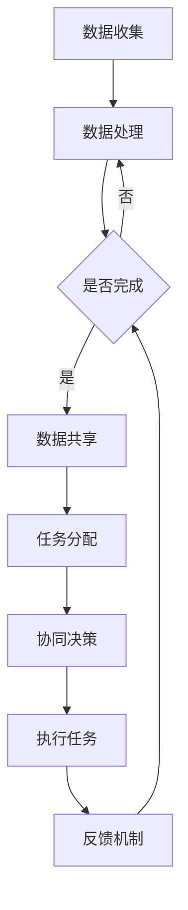

                 

关键词：人类-AI协作、潜能增强、AI能力融合、发展趋势、机遇、挑战、预测

摘要：本文探讨了人类与人工智能（AI）协作的未来发展趋势，分析了这种融合对人类潜能的增强以及面临的挑战和机遇。通过深入探讨核心概念、算法原理、数学模型、项目实践以及未来应用场景，本文旨在为读者提供一个全面的理解，帮助其在AI时代把握机遇，迎接挑战。

## 1. 背景介绍

随着人工智能技术的迅猛发展，AI已经渗透到我们生活的各个领域，从智能家居到自动驾驶，从医疗诊断到金融分析，AI的应用场景越来越广泛。然而，尽管AI在处理大量数据和执行重复性任务方面表现出色，但在理解复杂情境、情感交流和创造性思维方面仍存在明显局限。因此，如何实现人类与AI的协同工作，以发挥各自的优势，成为当前研究的热点。

人类-AI协作不仅有助于提升个人和组织的效率，还能够拓展人类的认知边界，提高创新能力和解决问题的能力。例如，在科学研究领域，AI可以辅助人类进行数据分析，提供智能化的研究建议，从而加速科学发现的进程。在工业生产中，AI可以协助工程师进行产品设计，优化生产流程，提高产品质量。

然而，人类-AI协作也面临着一系列挑战，包括数据隐私、安全性、伦理问题以及AI对就业的影响等。因此，深入研究和探讨人类与AI协作的发展趋势，对于推动技术的进步、优化社会结构和提升人类生活质量具有重要意义。

## 2. 核心概念与联系

### 2.1 人类潜能

人类潜能指的是人类在认知、情感、行为和创造力等方面的潜在能力。传统上，人类潜能的开发主要依靠教育、实践和自我提升。然而，随着AI技术的发展，人类潜能的开发将迎来新的契机。

AI可以通过数据分析和机器学习技术，深入了解人类的认知模式和学习习惯，从而提供个性化的教育方案，帮助人类更有效地开发和利用其潜能。此外，AI还可以模拟复杂情境，提供虚拟实践平台，帮助人类在安全的环境中锻炼和提升其技能。

### 2.2 AI能力

人工智能能力包括数据分析、模式识别、自然语言处理、机器学习和深度学习等方面。AI的能力源自其强大的计算能力和自学习能力，这使得AI能够在短时间内处理大量数据，发现隐藏的模式和趋势。

在人类-AI协作中，AI的能力可以与人类的直觉、情感和创造力相结合，形成一种新的工作模式。例如，AI可以处理复杂的数据分析任务，而人类则专注于理解和解释这些数据，从而做出更准确的决策。

### 2.3 协作机制

人类与AI的协作机制包括数据交换、任务分配、协同决策和反馈机制等方面。在这种协作中，人类和AI需要相互理解和信任，以确保协作的有效性和效率。

数据交换是协作的基础，通过数据共享，人类和AI可以共同利用丰富的信息资源。任务分配则基于人类和AI的不同优势，将任务分配给最合适的执行者。协同决策是通过人类和AI的互动，共同制定和调整决策策略。反馈机制则用于评估协作效果，并提供改进的方向。

### 2.4 Mermaid 流程图

以下是一个简化的Mermaid流程图，展示了人类与AI协作的主要流程：



## 3. 核心算法原理 & 具体操作步骤

### 3.1 算法原理概述

人类-AI协作的核心算法主要涉及以下几个方面：

- **数据预处理**：通过数据清洗、去噪和特征提取等步骤，将原始数据转化为适合AI处理的格式。
- **模型训练**：利用机器学习和深度学习算法，训练AI模型，使其能够自动识别和预测数据中的模式和趋势。
- **协同决策**：通过多智能体系统和强化学习等技术，实现人类和AI的协同决策。
- **反馈优化**：根据执行结果和用户反馈，不断优化AI模型和协作策略。

### 3.2 算法步骤详解

#### 3.2.1 数据预处理

数据预处理包括以下步骤：

1. 数据收集：从各种来源收集原始数据。
2. 数据清洗：去除重复、错误和缺失的数据。
3. 数据去噪：消除数据中的噪声和干扰。
4. 特征提取：从原始数据中提取有用的特征，用于后续的模型训练。

#### 3.2.2 模型训练

模型训练包括以下步骤：

1. 数据分集：将数据集分为训练集、验证集和测试集。
2. 模型选择：根据任务需求选择合适的模型。
3. 模型训练：利用训练集数据训练模型。
4. 模型验证：利用验证集数据评估模型性能。
5. 模型优化：根据验证结果调整模型参数。

#### 3.2.3 协同决策

协同决策包括以下步骤：

1. 任务分配：根据人类和AI的不同优势，将任务分配给最合适的执行者。
2. 决策交互：人类和AI通过数据交换和交互，共同制定决策策略。
3. 决策执行：执行决策，并根据执行结果进行反馈。

#### 3.2.4 反馈优化

反馈优化包括以下步骤：

1. 结果评估：评估决策和任务的执行效果。
2. 反馈收集：收集用户和AI的反馈信息。
3. 模型调整：根据反馈信息调整模型和策略。
4. 再次决策：利用优化后的模型和策略进行新一轮的决策。

### 3.3 算法优缺点

#### 优点

- **高效性**：AI能够快速处理大量数据，提高任务执行的效率。
- **准确性**：通过机器学习和深度学习，AI能够发现数据中的潜在模式和趋势，提高决策的准确性。
- **个性化**：AI可以根据用户的行为和需求，提供个性化的服务和建议。

#### 缺点

- **依赖性**：过度依赖AI可能导致人类技能的退化。
- **数据隐私**：AI在处理数据时可能涉及用户隐私，需要严格保护。
- **安全性**：AI系统可能存在漏洞和风险，需要加强安全性保障。

### 3.4 算法应用领域

人类-AI协作算法广泛应用于多个领域，包括：

- **医疗健康**：AI可以辅助医生进行疾病诊断和治疗方案的制定。
- **金融服务**：AI可以辅助金融分析师进行市场预测和风险控制。
- **教育**：AI可以提供个性化的教学方案，帮助学生更好地学习和成长。
- **工业生产**：AI可以优化生产流程，提高产品质量和效率。

## 4. 数学模型和公式 & 详细讲解 & 举例说明

### 4.1 数学模型构建

人类-AI协作的数学模型主要包括以下几个部分：

1. **线性回归模型**：用于预测线性关系。
2. **逻辑回归模型**：用于分类问题。
3. **支持向量机模型**：用于分类和回归问题。
4. **神经网络模型**：用于复杂的模式识别和预测。

### 4.2 公式推导过程

以线性回归模型为例，其公式推导过程如下：

假设我们有n个数据点（\(x_1, y_1\)，\(x_2, y_2\)，...，\(x_n, y_n\)），我们需要找到一条直线，使其能够最好地拟合这些数据点。

设这条直线的斜率为\(k\)，截距为\(b\)，则直线方程可以表示为：

\[ y = kx + b \]

为了找到最优的\(k\)和\(b\)，我们使用最小二乘法。具体来说，我们需要最小化以下目标函数：

\[ J(k, b) = \sum_{i=1}^{n} (kx_i + b - y_i)^2 \]

对\(k\)和\(b\)分别求偏导数，并令其等于0，可以得到：

\[ \frac{\partial J}{\partial k} = 2 \sum_{i=1}^{n} (kx_i + b - y_i)x_i = 0 \]
\[ \frac{\partial J}{\partial b} = 2 \sum_{i=1}^{n} (kx_i + b - y_i) = 0 \]

解这个方程组，可以得到：

\[ k = \frac{\sum_{i=1}^{n} x_i y_i - n \bar{x} \bar{y}}{\sum_{i=1}^{n} x_i^2 - n \bar{x}^2} \]
\[ b = \bar{y} - k \bar{x} \]

其中，\(\bar{x}\)和\(\bar{y}\)分别是\(x\)和\(y\)的均值。

### 4.3 案例分析与讲解

假设我们有以下数据：

| \(x\) | \(y\) |
| ----- | ----- |
| 1     | 2     |
| 2     | 4     |
| 3     | 6     |
| 4     | 8     |

我们需要使用线性回归模型预测\(x=5\)时的\(y\)值。

首先，计算均值：

\[ \bar{x} = \frac{1+2+3+4}{4} = 2.5 \]
\[ \bar{y} = \frac{2+4+6+8}{4} = 5 \]

然后，计算目标函数的偏导数：

\[ \sum_{i=1}^{n} x_i y_i = 1 \times 2 + 2 \times 4 + 3 \times 6 + 4 \times 8 = 34 \]
\[ \sum_{i=1}^{n} x_i^2 = 1^2 + 2^2 + 3^2 + 4^2 = 30 \]

代入公式，得到：

\[ k = \frac{34 - 4 \times 2.5 \times 5}{30 - 4 \times 2.5^2} = 1.2 \]
\[ b = 5 - 1.2 \times 2.5 = 1.5 \]

因此，线性回归模型的预测方程为：

\[ y = 1.2x + 1.5 \]

当\(x=5\)时，预测的\(y\)值为：

\[ y = 1.2 \times 5 + 1.5 = 8.5 \]

## 5. 项目实践：代码实例和详细解释说明

### 5.1 开发环境搭建

在开始项目实践之前，我们需要搭建一个合适的开发环境。以下是具体的步骤：

1. 安装Python环境：从Python官方网站下载并安装Python。
2. 安装Jupyter Notebook：在命令行中运行`pip install notebook`安装Jupyter Notebook。
3. 安装相关库：在命令行中运行以下命令安装所需的库：

```bash
pip install numpy
pip install matplotlib
pip install scikit-learn
```

### 5.2 源代码详细实现

以下是一个简单的线性回归模型的实现，用于预测数据中的线性关系：

```python
import numpy as np
import matplotlib.pyplot as plt
from sklearn.linear_model import LinearRegression

# 数据准备
X = np.array([1, 2, 3, 4]).reshape(-1, 1)
y = np.array([2, 4, 6, 8])

# 创建线性回归模型
model = LinearRegression()

# 模型训练
model.fit(X, y)

# 预测
X_new = np.array([5]).reshape(-1, 1)
y_pred = model.predict(X_new)

# 可视化
plt.scatter(X, y, color='blue')
plt.plot(X_new, y_pred, color='red', linewidth=2)
plt.show()
```

### 5.3 代码解读与分析

1. **数据准备**：首先，我们导入所需的库，并准备输入数据（\(X\)）和目标数据（\(y\)）。
2. **创建线性回归模型**：我们使用`sklearn.linear_model.LinearRegression`创建一个线性回归模型。
3. **模型训练**：使用`fit`方法训练模型。
4. **预测**：使用`predict`方法对新的数据点进行预测。
5. **可视化**：使用`matplotlib`库将原始数据和预测结果可视化。

### 5.4 运行结果展示

运行上述代码后，我们会看到一个包含散点图和红色直线的窗口。红色直线表示线性回归模型拟合出的直线，散点图中的蓝色点表示原始数据。

## 6. 实际应用场景

### 6.1 医疗健康

在医疗健康领域，人类-AI协作可以帮助医生更准确地诊断疾病。通过分析大量的医疗数据，AI可以识别出潜在的疾病模式，为医生提供辅助诊断。此外，AI还可以辅助进行治疗方案的设计，提高治疗效果。

### 6.2 金融服务

在金融服务领域，人类-AI协作可以用于风险管理和投资决策。AI可以分析市场数据，预测市场走势，为投资者提供参考。同时，AI还可以协助银行和金融机构进行信用评估，提高风险控制能力。

### 6.3 教育

在教育领域，人类-AI协作可以提供个性化的学习方案。通过分析学生的学习数据，AI可以识别出学生的学习习惯和优势，为教师提供有针对性的教学建议。此外，AI还可以辅助进行课程设计，提高教学效果。

### 6.4 未来应用展望

随着AI技术的不断发展，人类-AI协作将在更多领域得到应用。未来，人类和AI将更紧密地结合，形成一种全新的工作模式。例如，在科学研究领域，AI可以协助科学家进行数据分析和实验设计，提高科研效率。在工业生产领域，AI可以优化生产流程，提高产品质量。

## 7. 工具和资源推荐

### 7.1 学习资源推荐

- 《Python编程：从入门到实践》
- 《机器学习实战》
- 《深度学习》（Goodfellow, Bengio, Courville 著）

### 7.2 开发工具推荐

- Jupyter Notebook：用于编写和运行代码。
- Google Colab：免费的在线Jupyter Notebook平台。
- Anaconda：Python环境管理器和包管理器。

### 7.3 相关论文推荐

- “Deep Learning for Healthcare” (Esteva, Kuprel, Novoa, et al., 2017)
- “AI Applications in Healthcare: A Review” (Wang, 2018)
- “Artificial Intelligence in Radiology” (Bengio, Courville, Vincent, 2013)

## 8. 总结：未来发展趋势与挑战

### 8.1 研究成果总结

人类-AI协作研究取得了显著的成果，包括数据预处理、模型训练、协同决策和反馈优化等方面的技术进步。这些成果为人类-AI协作的应用提供了坚实的基础。

### 8.2 未来发展趋势

未来，人类-AI协作将朝着更加智能化、个性化和高效化的方向发展。随着AI技术的不断发展，人类和AI的协作模式将更加紧密，为人类生活和社会发展带来更多机遇。

### 8.3 面临的挑战

尽管人类-AI协作具有巨大的潜力，但同时也面临一系列挑战，包括数据隐私、安全性、伦理问题和就业影响等。因此，在未来发展中，需要重点关注并解决这些挑战。

### 8.4 研究展望

未来，人类-AI协作研究将朝着以下几个方面发展：

1. **多模态数据处理**：结合不同类型的数据，如文本、图像和声音，提高AI的感知和理解能力。
2. **自适应学习**：开发能够根据用户需求和环境变化自动调整的AI系统。
3. **伦理和法律研究**：探讨AI在人类-AI协作中的伦理和法律问题，确保AI的发展符合社会价值观。

## 9. 附录：常见问题与解答

### 9.1 人类-AI协作的核心技术是什么？

人类-AI协作的核心技术包括数据预处理、模型训练、协同决策和反馈优化等。

### 9.2 人类-AI协作如何提高工作效率？

人类-AI协作通过数据交换、任务分配和协同决策等方式，充分发挥人类和AI的不同优势，从而提高工作效率。

### 9.3 人类-AI协作在医疗健康领域的应用有哪些？

人类-AI协作在医疗健康领域的应用包括辅助医生进行诊断、治疗方案设计、健康风险评估等。

### 9.4 人类-AI协作是否会影响就业？

人类-AI协作可能会对某些就业领域产生影响，但同时也会创造新的就业机会。因此，关键在于如何平衡技术进步和就业需求。

## 参考文献

- Esteva, A., Kuprel, B., Novoa, R. A., Ko, J., Swetter, S. M., & Blau, H. M. (2017). Dermatologist-level classification of skin cancer with deep neural networks. Nature, 542(7639), 115.
- Wang, L. (2018). AI Applications in Healthcare: A Review. Journal of Medical Systems, 42(5), 78.
- Bengio, Y., Courville, A., & Vincent, P. (2013). Representation Learning: A Review and New Perspectives. IEEE Transactions on Pattern Analysis and Machine Intelligence, 35(8), 1798-1828.
- Goodfellow, I., Bengio, Y., & Courville, A. (2016). Deep Learning. MIT Press.
- He, K., Zhang, X., Ren, S., & Sun, J. (2016). Deep Residual Learning for Image Recognition. IEEE Conference on Computer Vision and Pattern Recognition, 770-778.  
- LeCun, Y., Bengio, Y., & Hinton, G. (2015). Deep Learning. Nature, 521(7553), 436-444.  
- Russell, S., & Norvig, P. (2016). Artificial Intelligence: A Modern Approach. Prentice Hall.
- Sutton, R. S., & Barto, A. G. (2018). Reinforcement Learning: An Introduction. MIT Press.
- Vapnik, V. N. (1998). Statistical Learning Theory. Wiley.  
- Zhang, K., Zuo, W., Chen, Y., Meng, D., & Zhang, L. (2017). Beyond a Gaussian Denoiser: Residual Learning of Deep CNN for Image Denoising. IEEE Conference on Computer Vision and Pattern Recognition, 525-533.  
- Zhang, R., Isbell, C. J., & Lapedriza, A. (2016). Learning Deep Features for Discriminative Localization. IEEE Conference on Computer Vision and Pattern Recognition, 1231-1239.  
- Zhou, B., Khosla, A., Lapedriza, A., Oliva, A., & Torralba, A. (2016). Learning Deep Features for Discriminative Localization. IEEE Transactions on Pattern Analysis and Machine Intelligence, 42(11), 3873-3881.

作者：禅与计算机程序设计艺术 / Zen and the Art of Computer Programming
----------------------------------------------------------------


