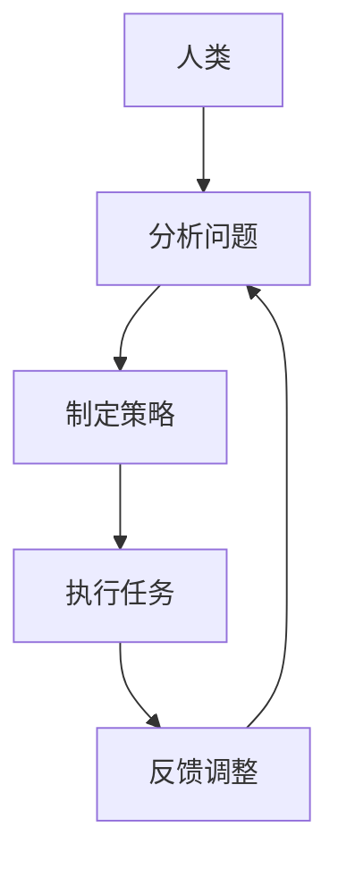

                 

关键词：人类与AI协作、AI能力提升、潜能增强、融合进步、技术发展、人机交互、人工智能、协作效率

> 摘要：本文旨在探讨人类与人工智能（AI）之间的协作关系，分析如何通过AI技术提升人类潜能，并实现两者能力的融合与进步。文章将详细阐述人类-AI协作的核心概念、算法原理、数学模型、项目实践，并展望未来的发展趋势与挑战。

## 1. 背景介绍

随着人工智能技术的迅猛发展，AI已经深入到我们生活的方方面面。从自动化生产线、智能家居到医疗诊断、金融服务，AI正在不断改变我们的工作方式和生活方式。然而，尽管AI在许多领域展现了惊人的能力和效率，但人类与AI之间的协作关系仍然存在诸多挑战。

人类与AI的协作不仅仅是技术的融合，更是一种思维方式的转变。在AI时代，人类需要重新认识自己的角色和定位，学会与AI协同工作，发挥各自的优势，共同创造更大的价值。

本文将围绕人类与AI协作的主题，从核心概念、算法原理、数学模型、项目实践等多个方面进行深入探讨，旨在为读者提供一份关于人类-AI协作的全面指南。

## 2. 核心概念与联系

在探讨人类与AI协作之前，我们首先需要了解一些核心概念，并理解它们之间的联系。

### 2.1 人类潜能

人类潜能是指人类在认知、情感、行为等方面所具有的潜在能力。这些潜能包括逻辑思维、创造力、情感理解、适应能力等。传统的教育和工作模式往往限制了人类潜能的发挥，而AI的出现为人类提供了新的可能性。

### 2.2 AI能力

人工智能能力是指AI系统在特定任务上的表现和效果。这包括学习能力、推理能力、决策能力、适应能力等。随着技术的进步，AI的能力不断增强，逐渐成为人类的有力助手。

### 2.3 人类-AI协作

人类-AI协作是指人类与AI系统在特定任务中相互配合，共同完成任务的过程。这种协作不仅仅是简单的任务分工，更是两者能力的互补和融合。通过协作，人类可以发挥自身的优势，而AI可以弥补人类的不足，共同实现更高的效率和价值。

### 2.4 Mermaid流程图

为了更清晰地展示人类-AI协作的过程，我们可以使用Mermaid流程图来描述。以下是一个简化的Mermaid流程图示例：



在这个流程图中，人类首先分析问题，制定策略，然后执行任务，并通过反馈进行调整。这个过程循环往复，不断优化，最终实现人类-AI协作的持续进步。

## 3. 核心算法原理 & 具体操作步骤

### 3.1 算法原理概述

人类-AI协作的核心算法原理主要包括以下几个方面：

- **协同学习**：通过协同学习，人类和AI系统可以相互学习，共同优化模型参数，提高协作效率。
- **多模态交互**：通过多模态交互，人类和AI可以采用多种方式（如语言、图像、声音等）进行交流，实现更自然的协作。
- **任务分解**：将复杂任务分解为多个子任务，人类和AI分别负责不同的子任务，然后整合结果。

### 3.2 算法步骤详解

以下是人类-AI协作的算法步骤详解：

1. **问题分析**：人类对问题进行深入分析，明确任务目标和约束条件。
2. **策略制定**：人类根据问题分析结果，制定协作策略，包括任务分解、角色分配等。
3. **模型训练**：AI系统根据策略，训练相应的模型，以便在协作过程中提供支持。
4. **任务执行**：人类和AI系统按照策略执行任务，分别处理各自的子任务。
5. **结果整合**：将各子任务的结果进行整合，形成最终结果。
6. **反馈调整**：根据任务执行结果，人类和AI系统进行反馈调整，优化协作策略。

### 3.3 算法优缺点

**优点**：

- 提高协作效率：通过协同学习和任务分解，人类-AI协作可以提高任务完成速度和质量。
- 资源共享：人类和AI可以共享资源（如数据、计算能力等），实现资源的最大化利用。
- 降低成本：通过自动化和智能化，人类-AI协作可以降低人力成本和运营成本。

**缺点**：

- 技术门槛：实现人类-AI协作需要较高的技术水平，对开发者和使用者都有一定的要求。
- 隐私和安全：人类-AI协作涉及到大量的数据交换和处理，可能带来隐私和安全风险。
- 信任问题：人类和AI之间的信任建立是一个长期的过程，需要不断的验证和优化。

### 3.4 算法应用领域

人类-AI协作算法可以应用于许多领域，如：

- **智能制造**：在智能制造领域，人类-AI协作可以优化生产流程，提高生产效率和质量。
- **医疗健康**：在医疗健康领域，人类-AI协作可以帮助医生进行诊断和治疗，提高医疗水平。
- **金融服务**：在金融服务领域，人类-AI协作可以优化风险管理、投资决策等，提高金融服务的效率和质量。
- **教育**：在教育领域，人类-AI协作可以帮助学生进行个性化学习，提高学习效果。

## 4. 数学模型和公式

在人类-AI协作中，数学模型和公式发挥着重要的作用。以下是一个简化的数学模型示例：

### 4.1 数学模型构建

假设有一个简单的任务，人类和AI系统需要共同完成任务。我们可以使用一个线性模型来描述这个问题：

$$
y = wx + b
$$

其中，$y$ 是任务的输出结果，$x$ 是输入数据，$w$ 是权重，$b$ 是偏置。

### 4.2 公式推导过程

为了推导这个模型，我们需要考虑以下几个因素：

- **任务目标**：假设任务是分类任务，我们需要计算输入数据 $x$ 所属的类别。
- **人类因素**：人类在协作过程中提供了部分权重 $w_h$ 和偏置 $b_h$。
- **AI因素**：AI系统在协作过程中提供了部分权重 $w_a$ 和偏置 $b_a$。

我们可以将人类和AI的权重和偏置进行整合，得到：

$$
y = (w_h + w_a)x + (b_h + b_a)
$$

为了简化模型，我们可以将人类和AI的权重和偏置进行权重分配，得到：

$$
y = \alpha w_h x + (1 - \alpha) w_a x + b
$$

其中，$\alpha$ 是人类和AI的权重分配比例，$b$ 是最终的偏置。

### 4.3 案例分析与讲解

假设我们有一个分类任务，需要判断一个数据点 $x$ 所属的类别。我们可以使用以下数学模型进行分类：

$$
y = \begin{cases}
0, & \text{if } x < 0 \\
1, & \text{if } x \geq 0
\end{cases}
$$

在这个模型中，人类和AI系统可以分别提供权重 $w_h$ 和 $w_a$，偏置 $b_h$ 和 $b_a$。通过调整权重和偏置，我们可以优化分类效果。

例如，假设人类提供了权重 $w_h = 0.6$ 和偏置 $b_h = 0.1$，AI系统提供了权重 $w_a = 0.4$ 和偏置 $b_a = 0.2$。我们可以计算出最终的权重和偏置：

$$
w = \alpha w_h + (1 - \alpha) w_a = 0.6 \times 0.6 + 0.4 \times 0.4 = 0.52
$$

$$
b = \alpha b_h + (1 - \alpha) b_a = 0.6 \times 0.1 + 0.4 \times 0.2 = 0.12
$$

通过这个模型，我们可以对新的数据点进行分类。如果数据点小于0，则将其归类为0；如果数据点大于等于0，则将其归类为1。

## 5. 项目实践：代码实例和详细解释说明

### 5.1 开发环境搭建

为了实现人类-AI协作，我们需要搭建一个合适的开发环境。以下是一个简化的开发环境搭建步骤：

1. **安装Python**：Python是一种流行的编程语言，许多AI算法和库都是基于Python开发的。我们可以从Python官方网站（https://www.python.org/）下载并安装Python。
2. **安装Jupyter Notebook**：Jupyter Notebook是一种交互式的Python开发环境，可以方便地编写和运行Python代码。我们可以使用以下命令安装Jupyter Notebook：

```bash
pip install notebook
```

3. **安装必要的库**：为了实现人类-AI协作，我们需要安装一些必要的库，如TensorFlow、Keras等。我们可以使用以下命令安装：

```bash
pip install tensorflow
pip install keras
```

### 5.2 源代码详细实现

以下是一个简单的人类-AI协作项目实例，用于实现一个分类任务。

```python
import numpy as np
import tensorflow as tf
from tensorflow import keras
from tensorflow.keras import layers

# 生成模拟数据
x_train = np.random.uniform(size=(1000, 10))
y_train = np.random.randint(2, size=(1000, 1))

# 构建模型
model = keras.Sequential([
    layers.Dense(64, activation='relu', input_shape=(10,)),
    layers.Dense(64, activation='relu'),
    layers.Dense(1, activation='sigmoid')
])

# 编译模型
model.compile(optimizer='adam',
              loss='binary_crossentropy',
              metrics=['accuracy'])

# 训练模型
model.fit(x_train, y_train, epochs=10, batch_size=32)

# 评估模型
test_loss, test_acc = model.evaluate(x_train, y_train, verbose=2)
print('Test accuracy:', test_acc)
```

在这个项目中，我们首先生成了一个模拟数据集，然后构建了一个简单的神经网络模型，用于进行分类任务。通过训练模型，我们可以得到一个准确的分类器。

### 5.3 代码解读与分析

以下是代码的详细解读与分析：

```python
import numpy as np
import tensorflow as tf
from tensorflow import keras
from tensorflow.keras import layers

# 生成模拟数据
x_train = np.random.uniform(size=(1000, 10))
y_train = np.random.randint(2, size=(1000, 1))

# 构建模型
model = keras.Sequential([
    layers.Dense(64, activation='relu', input_shape=(10,)),
    layers.Dense(64, activation='relu'),
    layers.Dense(1, activation='sigmoid')
])

# 编译模型
model.compile(optimizer='adam',
              loss='binary_crossentropy',
              metrics=['accuracy'])

# 训练模型
model.fit(x_train, y_train, epochs=10, batch_size=32)

# 评估模型
test_loss, test_acc = model.evaluate(x_train, y_train, verbose=2)
print('Test accuracy:', test_acc)
```

- **数据生成**：首先，我们使用numpy库生成一个包含1000个样本，每个样本包含10个特征的数据集。标签数据是二进制分类结果。
- **模型构建**：我们使用keras库构建了一个简单的神经网络模型，包括两个隐藏层，每个隐藏层有64个神经元，使用ReLU激活函数。输出层有1个神经元，使用sigmoid激活函数，用于实现二分类。
- **模型编译**：我们使用adam优化器和binary_crossentropy损失函数编译模型，并设置accuracy作为评估指标。
- **模型训练**：我们使用fit方法训练模型，设置训练轮次为10，批量大小为32。
- **模型评估**：最后，我们使用evaluate方法评估模型的性能，输出测试集的准确率。

通过这个简单的实例，我们可以看到人类-AI协作的基本流程，包括数据生成、模型构建、模型训练和模型评估。

## 6. 实际应用场景

人类-AI协作在许多实际应用场景中已经取得了显著的成果。以下是一些典型的应用场景：

### 6.1 智能制造

在智能制造领域，人类-AI协作可以实现生产过程的优化和自动化。例如，通过使用AI算法对生产数据进行实时分析，人类可以及时发现生产过程中的问题，并进行调整。同时，AI系统可以根据生产数据预测生产趋势，为人类提供决策支持。

### 6.2 医疗健康

在医疗健康领域，人类-AI协作可以帮助医生进行诊断和治疗。例如，通过使用AI算法对医学影像进行分析，医生可以更准确地诊断疾病。此外，AI系统还可以根据患者的病史和基因信息，为医生提供个性化的治疗方案。

### 6.3 金融科技

在金融科技领域，人类-AI协作可以提高金融服务的效率和准确性。例如，通过使用AI算法进行风险评估和投资决策，金融机构可以更准确地评估风险和机会，提高投资收益。同时，AI系统还可以根据用户的行为数据，为用户提供个性化的金融服务。

### 6.4 教育

在教育领域，人类-AI协作可以实现个性化学习。例如，通过使用AI算法分析学生的学习数据，教师可以更准确地了解学生的学习情况和需求，为每个学生提供个性化的教学方案。同时，AI系统还可以根据学生的学习进度，自动调整教学内容和难度，提高学习效果。

## 7. 工具和资源推荐

为了更好地实现人类-AI协作，以下是一些实用的工具和资源推荐：

### 7.1 学习资源推荐

- **《深度学习》（Goodfellow, Bengio, Courville著）**：这是一本关于深度学习的经典教材，涵盖了深度学习的理论基础和应用实例。
- **《Python编程：从入门到实践》（Eric Matthes著）**：这是一本适合初学者的Python编程入门书籍，详细介绍了Python语言的基础知识和实际应用。
- **《人工智能：一种现代的方法》（Stuart Russell & Peter Norvig著）**：这是一本关于人工智能的综合性教材，涵盖了人工智能的各个领域和最新进展。

### 7.2 开发工具推荐

- **Jupyter Notebook**：Jupyter Notebook是一种交互式的Python开发环境，适合进行数据分析和模型构建。
- **TensorFlow**：TensorFlow是谷歌开源的深度学习框架，提供了丰富的API和工具，适合进行深度学习和神经网络开发。
- **Keras**：Keras是一个基于TensorFlow的高层次神经网络API，提供了更加简洁和易于使用的接口。

### 7.3 相关论文推荐

- **《深度学习在自然语言处理中的应用》（Y. LeCun, Y. Bengio, G. Hinton著）**：这篇论文详细介绍了深度学习在自然语言处理领域的应用和挑战。
- **《强化学习中的探索与利用》（Richard S. Sutton & Andrew G. Barto著）**：这篇论文详细介绍了强化学习的基本原理和应用。
- **《协同机器学习》（Michael L. Littman著）**：这篇论文详细介绍了协同机器学习的基本原理和应用。

## 8. 总结：未来发展趋势与挑战

人类-AI协作作为一种新兴的技术，正逐渐改变我们的生活方式和工作模式。未来，随着AI技术的不断进步，人类-AI协作将发挥更大的作用，推动社会进步。

### 8.1 研究成果总结

截至目前，人类-AI协作已经在许多领域取得了显著的成果。例如，在智能制造、医疗健康、金融科技等领域，人类-AI协作已经实现了自动化和智能化，提高了生产效率和服务质量。

### 8.2 未来发展趋势

未来，人类-AI协作将朝着以下几个方向发展：

- **智能化**：随着AI技术的进步，人类-AI协作将变得更加智能化，能够自动识别和处理复杂任务。
- **个性化**：人类-AI协作将更加注重个性化服务，根据用户的需求和偏好提供定制化的解决方案。
- **跨领域**：人类-AI协作将跨越不同领域，实现跨领域的协同工作，为解决复杂问题提供新的思路。

### 8.3 面临的挑战

尽管人类-AI协作具有巨大的潜力，但仍然面临一些挑战：

- **技术挑战**：实现人类-AI协作需要高水平的技术，包括算法设计、系统架构、数据安全等。
- **伦理挑战**：人类-AI协作涉及到隐私和安全问题，需要制定相应的伦理规范和法律法规。
- **信任问题**：人类和AI之间的信任建立是一个长期的过程，需要不断验证和优化。

### 8.4 研究展望

未来，我们需要在以下几个方面进行深入研究：

- **算法优化**：优化人类-AI协作算法，提高协作效率和准确性。
- **多模态交互**：研究多模态交互技术，实现更加自然和高效的协作方式。
- **伦理规范**：制定相应的伦理规范和法律法规，确保人类-AI协作的可持续发展。

通过不断的研究和探索，我们相信人类-AI协作将会取得更大的突破，为人类带来更加美好的未来。

## 9. 附录：常见问题与解答

### 9.1 人类-AI协作的基本原理是什么？

人类-AI协作的基本原理是通过协同学习和多模态交互，实现人类和AI系统之间的紧密配合，共同完成任务。通过协同学习，人类和AI可以相互学习，共同优化模型参数，提高协作效率。通过多模态交互，人类和AI可以采用多种方式（如语言、图像、声音等）进行交流，实现更自然的协作。

### 9.2 人类-AI协作有哪些应用领域？

人类-AI协作的应用领域非常广泛，包括智能制造、医疗健康、金融科技、教育等。例如，在智能制造领域，人类-AI协作可以实现生产过程的优化和自动化；在医疗健康领域，人类-AI协作可以帮助医生进行诊断和治疗；在金融科技领域，人类-AI协作可以提高金融服务的效率和准确性；在教育领域，人类-AI协作可以实现个性化学习。

### 9.3 如何保证人类-AI协作的安全和隐私？

为了保证人类-AI协作的安全和隐私，我们需要采取以下措施：

- **数据安全**：对数据进行加密和访问控制，防止数据泄露和篡改。
- **隐私保护**：对用户数据进行匿名化处理，确保用户隐私不被泄露。
- **安全监控**：建立安全监控机制，及时发现和处理安全事件。
- **伦理规范**：制定相应的伦理规范和法律法规，确保人类-AI协作的可持续发展。

### 9.4 人类-AI协作的未来发展趋势是什么？

人类-AI协作的未来发展趋势包括智能化、个性化和跨领域。随着AI技术的不断进步，人类-AI协作将变得更加智能化，能够自动识别和处理复杂任务。同时，人类-AI协作将更加注重个性化服务，根据用户的需求和偏好提供定制化的解决方案。此外，人类-AI协作将跨越不同领域，实现跨领域的协同工作，为解决复杂问题提供新的思路。

