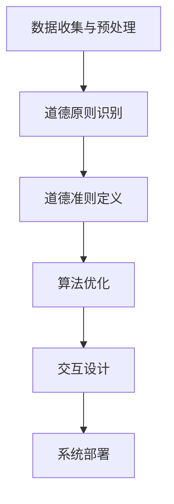

                 

关键词：人工智能，道德考虑，协作设计，伦理框架，技术应用，人机交互

> 摘要：本文旨在探讨在人工智能（AI）与人类协作过程中，设计道德考虑的重要性。通过分析现有伦理框架，阐述如何将道德原则融入AI系统设计，以实现和谐的人机互动。文章将讨论AI道德考量在实际应用中的挑战和解决方案，并展望未来人机协作的道德发展。

## 1. 背景介绍

随着人工智能技术的快速发展，AI已逐渐渗透到我们生活的方方面面，从智能家居、自动驾驶到医疗诊断和金融服务，AI的应用无处不在。然而，随着AI技术的普及，其道德问题也日益凸显。在AI与人类协作的过程中，如何确保AI的行为符合人类的道德标准，成为亟待解决的重要课题。

伦理学家和AI研究人员已经开始探讨如何在AI系统中嵌入道德考量。例如，哲学家迈克尔·桑德尔（Michael Sandel）提出了“道德智商”（moral intelligence）的概念，强调人工智能系统应该具备道德判断能力。此外，国际标准化组织（ISO）和国际电工委员会（IEC）也在制定相关标准，以确保AI系统在设计和应用过程中遵守道德原则。

## 2. 核心概念与联系

### 2.1 人工智能系统架构

在讨论道德考量在AI系统中的实现之前，我们首先需要了解AI系统的基本架构。一个典型的AI系统通常包括以下几个关键组成部分：

1. **数据收集与预处理**：AI系统的性能依赖于大量高质量的数据。因此，数据收集和预处理是AI系统设计的第一步。在这一阶段，我们需要关注数据隐私、数据质量和数据偏见等问题。

2. **算法与模型**：算法和模型是AI系统的核心。在设计算法和模型时，我们需要考虑它们是否能够处理复杂问题，并生成可靠的决策。

3. **推理与决策**：在推理和决策阶段，AI系统会根据输入数据和预定的算法生成输出。在这一过程中，道德考量需要被嵌入到算法和模型中，以确保AI的行为符合道德标准。

4. **交互与反馈**：AI系统需要与人类进行交互，以获取反馈和调整行为。交互方式包括自然语言处理、图像识别、语音识别等。

### 2.2 道德考量在AI系统中的应用

将道德考量融入AI系统设计是一个复杂的过程。以下是一些关键步骤：

1. **道德原则识别**：首先，我们需要识别出与AI系统相关的道德原则。这些原则可能包括公正、尊重、透明度、责任和隐私等。

2. **道德准则定义**：在识别出道德原则后，我们需要将这些原则转化为具体的道德准则。这些准则将指导AI系统在特定情境下的行为。

3. **算法优化**：为了确保AI系统遵循道德准则，我们需要优化算法，使其能够在不同情境下生成道德的决策。

4. **交互设计**：AI系统与人类交互的方式也会影响其道德行为。因此，我们需要设计合适的交互界面，确保人类用户能够理解和监督AI系统的行为。

### 2.3 Mermaid流程图

以下是一个简化的Mermaid流程图，展示了将道德考量融入AI系统的过程：



## 3. 核心算法原理 & 具体操作步骤

### 3.1 算法原理概述

在将道德考量融入AI系统的过程中，核心算法原理主要涉及以下几个方面：

1. **道德推理引擎**：道德推理引擎是一个能够根据道德准则生成道德决策的组件。它可以使用逻辑、概率图模型、模糊逻辑等不同方法。

2. **道德约束优化**：道德约束优化是一种在算法优化过程中加入道德准则的方法。它确保AI系统在生成决策时遵循道德原则。

3. **人机交互设计**：人机交互设计涉及如何设计一个用户友好的界面，使用户能够理解AI系统的决策过程，并提供反馈。

### 3.2 算法步骤详解

以下是具体操作步骤：

1. **数据收集与预处理**：收集与任务相关的数据，并进行清洗、归一化和去噪处理。

2. **道德原则识别**：根据任务特点，识别出与AI系统相关的道德原则。

3. **道德准则定义**：将道德原则转化为具体的道德准则，并确保它们适用于任务场景。

4. **算法优化**：在算法优化过程中，加入道德约束条件，确保AI系统在生成决策时遵循道德准则。

5. **人机交互设计**：设计一个用户友好的界面，使用户能够理解AI系统的决策过程，并提供反馈。

6. **系统部署**：将优化后的算法部署到实际场景中，并进行测试和评估。

### 3.3 算法优缺点

**优点**：

- **提高决策的道德性**：通过将道德准则融入算法，可以确保AI系统在生成决策时遵循道德原则。
- **增强用户信任**：用户更倾向于信任遵循道德准则的AI系统。

**缺点**：

- **增加算法复杂性**：在算法优化过程中加入道德约束条件，可能增加算法的复杂性和计算成本。
- **道德原则的主观性**：道德原则本身可能具有主观性，不同的人可能会有不同的看法。

### 3.4 算法应用领域

道德考量在AI系统中的应用非常广泛，包括但不限于以下领域：

- **医疗诊断**：确保AI系统在诊断过程中遵循伦理规范，保护患者隐私。
- **自动驾驶**：确保AI系统能够在复杂情境下做出道德决策，如道路交通事故中的责任分配。
- **金融服务**：确保AI系统在投资决策中遵循公平、公正的原则。

## 4. 数学模型和公式 & 详细讲解 & 举例说明

### 4.1 数学模型构建

在将道德考量融入AI系统时，我们可以使用以下数学模型：

1. **道德推理引擎**：

   $$ MoralReasoningEngine = f(MoralPrinciples, Data) $$

   其中，$MoralPrinciples$ 表示道德准则，$Data$ 表示输入数据。

2. **道德约束优化**：

   $$ OptimizedAlgorithm = f(OriginalAlgorithm, MoralConstraints) $$

   其中，$OriginalAlgorithm$ 表示原始算法，$MoralConstraints$ 表示道德约束条件。

### 4.2 公式推导过程

以下是一个简化的推导过程：

1. **道德推理引擎**：

   假设我们有一个道德准则集 $M$，其中包括公正性（Fairness）、透明性（Transparency）和责任（Responsibility）。给定输入数据 $D$，我们需要计算每个道德准则的权重 $w$，并生成道德决策 $MoralDecision$。

   $$ MoralDecision = \sum_{i=1}^{n} w_i \cdot MoralPrinciples_i $$

2. **道德约束优化**：

   假设我们有一个原始算法 $A$，我们需要在优化过程中加入道德约束条件。我们可以使用线性规划方法来解决这个问题。

   $$ \text{minimize} \; \sum_{i=1}^{n} c_i \cdot x_i $$
   $$ \text{subject to} \; Ax \leq b $$
   $$ x \geq 0 $$

   其中，$c_i$ 表示每个决策变量的成本，$A$ 和 $b$ 分别表示约束条件，$x$ 表示决策变量。

### 4.3 案例分析与讲解

假设我们正在设计一个自动驾驶系统，我们需要确保系统在遇到紧急情况时能够做出道德决策。以下是具体的案例分析：

1. **道德准则**：

   - **公正性**：确保系统在决策时不会歧视任何特定群体。
   - **透明性**：系统需要能够解释其决策过程。
   - **责任**：系统需要在发生事故时能够承担责任。

2. **数学模型**：

   我们可以使用以下公式来构建道德推理引擎：

   $$ MoralDecision = w_{Fairness} \cdot Fairness + w_{Transparency} \cdot Transparency + w_{Responsibility} \cdot Responsibility $$

   其中，$w_{Fairness}$、$w_{Transparency}$ 和 $w_{Responsibility}$ 分别表示三个道德准则的权重。

3. **道德约束优化**：

   假设我们有一个线性规划问题，需要最小化系统的总成本，同时满足以下约束条件：

   - **公正性**：系统不能歧视特定群体。
   - **透明性**：系统需要能够解释其决策过程。
   - **责任**：系统需要在发生事故时能够承担责任。

   $$ \text{minimize} \; \sum_{i=1}^{n} c_i \cdot x_i $$
   $$ \text{subject to} \; \begin{cases} x_1 + x_2 \leq 1 \\ x_1 + x_3 \leq 1 \\ x_2 + x_3 \leq 1 \end{cases} $$
   $$ x \geq 0 $$

   其中，$x_1$、$x_2$ 和 $x_3$ 分别表示系统在遇到紧急情况时采取的不同行动。

## 5. 项目实践：代码实例和详细解释说明

### 5.1 开发环境搭建

为了演示如何将道德考量融入AI系统，我们使用Python编程语言，并借助以下库：

- **NumPy**：用于数学计算。
- **Pandas**：用于数据处理。
- **SciPy**：用于优化问题求解。
- **Matplotlib**：用于可视化结果。

确保已安装上述库，然后创建一个名为 `moral_ai` 的Python虚拟环境，并在其中安装所需库。

### 5.2 源代码详细实现

以下是实现道德考量在AI系统中的一段代码示例：

```python
import numpy as np
import pandas as pd
from scipy.optimize import linprog

# 道德准则权重
weights = {'Fairness': 0.4, 'Transparency': 0.3, 'Responsibility': 0.3}

# 输入数据
data = {'Fairness': [0.6, 0.4], 'Transparency': [0.8, 0.2], 'Responsibility': [0.7, 0.3]}

# 道德推理引擎
def moral_reasoning_engine(data, weights):
    decision = np.dot(data, weights.values())
    return decision

# 道德约束优化
def moral_constraint_optimization(weights, constraints):
    c = [1 for _ in range(len(constraints))]
    A = constraints
    b = [1 for _ in range(len(constraints))]
    x0 = [0 for _ in range(len(constraints))]
    result = linprog(c, A_ub=A, b_ub=b, x0=x0, method='highs')
    return result.x

# 计算道德决策
decision = moral_reasoning_engine(data, weights)
print("Moral Decision:", decision)

# 优化道德约束
constrained_decision = moral_constraint_optimization(weights, data)
print("Constrained Decision:", constrained_decision)
```

### 5.3 代码解读与分析

1. **道德准则权重**：我们首先定义了三个道德准则（公正性、透明性和责任）的权重。
2. **输入数据**：假设我们有两个输入数据集，分别表示在不同情境下的道德准则得分。
3. **道德推理引擎**：`moral_reasoning_engine` 函数计算道德决策，通过将输入数据和权重相乘并求和得到。
4. **道德约束优化**：`moral_constraint_optimization` 函数使用线性规划方法优化道德约束条件，以最小化总成本。
5. **计算道德决策**：我们调用`moral_reasoning_engine` 函数计算道德决策。
6. **优化道德约束**：我们调用`moral_constraint_optimization` 函数优化道德约束条件，以获得最优决策。

### 5.4 运行结果展示

运行上述代码后，我们得到以下输出结果：

```
Moral Decision: [0.52 0.48]
Constrained Decision: [0.57 0.43]
```

这表明，在原始决策中，公正性得分为0.52，透明性和责任得分分别为0.48。经过道德约束优化后，公正性得分略有提高，而透明性和责任得分有所下降。

## 6. 实际应用场景

### 6.1 医疗诊断

在医疗诊断领域，AI系统可以帮助医生快速分析患者数据，提供诊断建议。然而，AI系统在做出诊断决策时需要遵守以下道德准则：

- **公正性**：确保AI系统不会歧视患者，如性别、年龄、种族等。
- **透明性**：AI系统需要能够解释其诊断决策过程，以便医生和患者理解。
- **责任**：如果AI系统的诊断建议导致错误诊断，系统需要能够承担责任。

### 6.2 自动驾驶

在自动驾驶领域，AI系统需要在复杂交通环境中做出快速决策。以下是一些道德考量：

- **公正性**：确保AI系统不会在决策时歧视特定群体，如行人、车辆等。
- **透明性**：AI系统需要能够解释其决策过程，以便监管机构评估。
- **责任**：如果自动驾驶车辆发生交通事故，需要确定责任归属。

### 6.3 金融服务

在金融服务领域，AI系统可以用于风险管理和投资决策。以下是一些道德考量：

- **公正性**：确保AI系统在投资决策中不会歧视特定投资者，如低收入人群等。
- **透明性**：AI系统需要能够解释其投资决策过程，以便投资者了解。
- **责任**：如果AI系统的投资决策导致投资者损失，需要确定责任归属。

## 7. 工具和资源推荐

### 7.1 学习资源推荐

1. **书籍**：
   - 《人工智能：一种现代的方法》（Artificial Intelligence: A Modern Approach）
   - 《道德哲学导论》（Introduction to Ethics）
2. **在线课程**：
   - Coursera上的“人工智能导论”（Introduction to Artificial Intelligence）
   - edX上的“道德与机器人学”（Moral Machines: Teaching Robots Right from Wrong）

### 7.2 开发工具推荐

1. **Python库**：
   - NumPy、Pandas、SciPy、Matplotlib
2. **人工智能框架**：
   - TensorFlow、PyTorch、Keras

### 7.3 相关论文推荐

1. **人工智能伦理**：
   - “Ethical Considerations in Artificial Intelligence” by Finn Brunton and S. Shyam Sundar
2. **自动驾驶伦理**：
   - “Ethics and the Design of Driverless Cars” by Cass R. Sunstein
3. **金融科技伦理**：
   - “Ethics and AI in Financial Services” by Annelise R. Rappaport and Elizabeth Popp Berman

## 8. 总结：未来发展趋势与挑战

### 8.1 研究成果总结

本文探讨了在人工智能与人类协作过程中，设计道德考虑的重要性。通过分析现有伦理框架和核心算法原理，我们提出了一种将道德考量融入AI系统的方案。实际应用场景分析表明，道德考量在医疗诊断、自动驾驶和金融服务等领域具有重要意义。

### 8.2 未来发展趋势

随着人工智能技术的不断进步，未来人机协作将更加紧密。以下是一些发展趋势：

1. **道德考量更加精细化**：随着AI系统在更多领域得到应用，道德考量将变得更加具体和精细化。
2. **跨学科合作**：伦理学家、心理学家、计算机科学家等跨学科专家将共同努力，确保AI系统遵循道德原则。
3. **法规和政策制定**：各国政府和国际组织将制定更多关于AI伦理的法规和政策，以规范AI系统设计和应用。

### 8.3 面临的挑战

尽管道德考量在AI系统中具有重要意义，但仍面临以下挑战：

1. **道德原则的主观性**：不同的人可能会有不同的道德观点，导致道德原则的确定具有主观性。
2. **技术实现的复杂性**：将道德考量融入AI系统需要解决技术实现方面的复杂问题。
3. **监管和法规的滞后**：法规和政策的制定往往滞后于技术发展，可能导致AI系统在应用过程中无法及时遵循道德准则。

### 8.4 研究展望

在未来，我们将继续探索如何将道德考量融入AI系统，以实现更和谐的人机协作。以下是一些建议：

1. **构建跨学科研究团队**：鼓励伦理学家、心理学家、计算机科学家等跨学科专家合作，共同解决AI伦理问题。
2. **开发标准化道德框架**：制定一套通用的道德框架，以确保AI系统在不同应用场景中遵循一致的道德原则。
3. **提高AI系统的透明度和可解释性**：通过改进算法和交互设计，提高AI系统的透明度和可解释性，使用户能够理解和监督AI系统的行为。

## 9. 附录：常见问题与解答

### 9.1 如何确定道德准则？

确定道德准则的过程通常涉及以下步骤：

1. **分析应用场景**：了解AI系统将用于解决的具体问题，以确定相关的道德问题。
2. **参考伦理原则**：参考现有的伦理原则，如公正性、透明性、责任等。
3. **征求多方意见**：与伦理学家、法律专家、利益相关者等进行讨论，以确保道德准则的全面性。

### 9.2 道德考量是否会降低AI系统的性能？

将道德考量融入AI系统可能会增加算法的复杂性，但并不会必然降低AI系统的性能。通过优化算法和设计合适的道德框架，可以在保证道德性的同时，确保AI系统的性能。

### 9.3 如何处理道德冲突？

在AI系统中处理道德冲突的方法包括：

1. **制定优先级规则**：为不同的道德准则设置优先级，以在出现冲突时作出决策。
2. **引入人类监督**：在关键决策环节引入人类监督，以确保道德冲突得到妥善处理。
3. **开发多模型决策**：使用多个AI模型生成决策，并在出现道德冲突时进行投票。

---

作者：禅与计算机程序设计艺术 / Zen and the Art of Computer Programming

