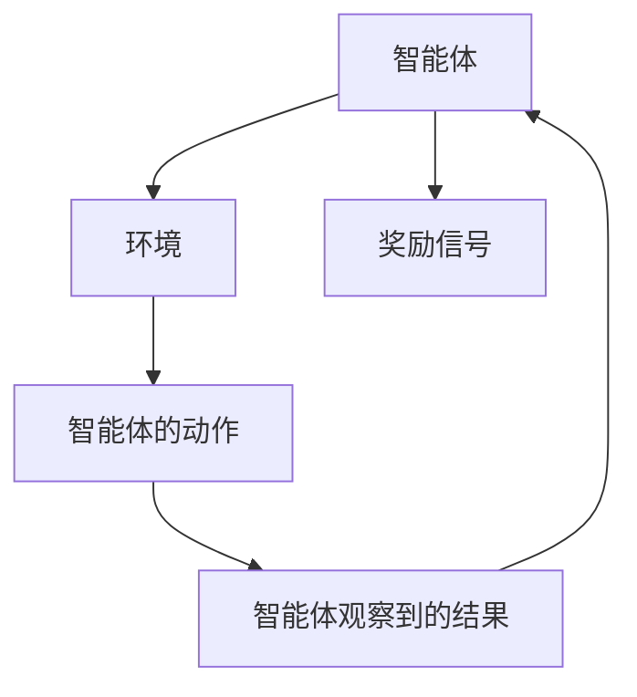
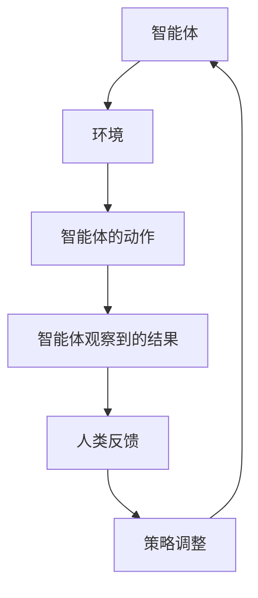
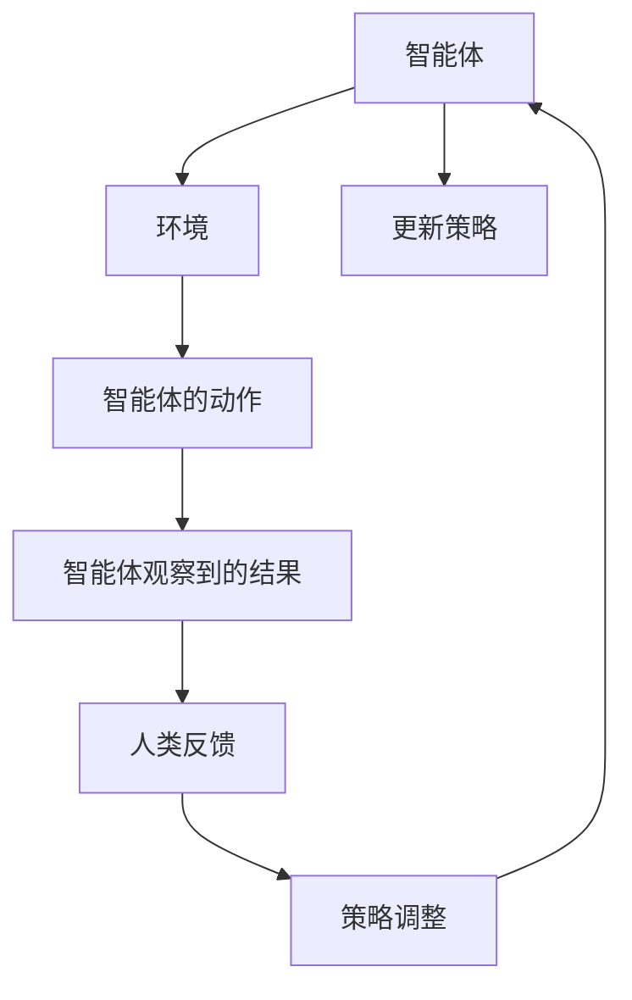

                 

关键词：人类反馈、RLHF、强化学习、人工智能、反馈机制、缺陷、改进

摘要：本文探讨了强化学习中的奖励学习与人类反馈（RLHF）方法在实际应用中存在的局限性。通过对RLHF的工作原理、优缺点以及其在不同领域的应用进行分析，本文提出了几种可能的改进方法，以优化人类反馈的有效性，从而提高强化学习算法的性能。

## 1. 背景介绍

在人工智能领域，强化学习（Reinforcement Learning，简称RL）是机器学习的一个重要分支。它通过智能体在环境中采取行动，从与环境的交互中学习达到特定目标。近年来，随着深度学习技术的进步，深度强化学习（Deep Reinforcement Learning，简称DRL）得到了广泛的研究和应用。然而，强化学习算法在处理复杂任务时面临许多挑战，其中一个主要问题是如何有效地设计奖励函数。

为了解决这一问题，研究者提出了奖励学习与人类反馈（Reinforcement Learning from Human Feedback，简称RLHF）方法。这种方法的核心思想是利用人类专家的反馈来指导智能体的学习过程。具体来说，人类专家会对智能体在特定任务上的表现进行评价，并根据评价结果调整智能体的行为策略。

虽然RLHF方法在一定程度上提高了强化学习算法的性能，但它也存在一些不足之处。本文将深入探讨RLHF的局限性，并提出一些可能的改进方向。

## 2. 核心概念与联系

### 2.1 强化学习基本原理

强化学习的基本原理可以通过以下Mermaid流程图进行描述：



在这个流程图中，智能体根据当前的状态（State）选择一个动作（Action），然后根据动作的结果（Result）和环境的反馈（Reward）更新其策略（Policy）。

### 2.2 人类反馈机制

人类反馈机制是指通过人类专家对智能体在特定任务上的表现进行评价，并根据评价结果调整智能体的行为策略。具体来说，这个流程可以表示为：



在这个流程中，人类反馈充当了环境的一部分，对智能体的行为产生直接的影响。

### 2.3 RLHF工作原理

RLHF的工作原理可以概括为以下几个步骤：

1. **初始阶段**：智能体在没有人类反馈的情况下进行自主探索，学习基本的策略。
2. **人类反馈阶段**：智能体执行任务，人类专家对其表现进行评价，并提供反馈。
3. **策略调整阶段**：智能体根据人类反馈调整其策略，以便更好地满足人类期望。

这个过程的Mermaid流程图如下：



## 3. 核心算法原理 & 具体操作步骤

### 3.1 算法原理概述

RLHF算法的主要思想是将人类反馈集成到强化学习过程中，以指导智能体的学习。具体来说，RLHF包括以下几个核心组件：

1. **自动奖励机制**：智能体在初始阶段通过自主探索学习基本的策略。
2. **人类反馈机制**：人类专家对智能体的表现进行评价，并提供反馈。
3. **策略调整机制**：智能体根据人类反馈调整其策略，以更好地满足人类期望。

### 3.2 算法步骤详解

1. **初始化阶段**：设定智能体的初始状态，初始化策略参数。
2. **自主探索阶段**：智能体在没有人类反馈的情况下进行自主探索，收集经验。
3. **反馈收集阶段**：智能体执行任务，人类专家对智能体的表现进行评价，并提供反馈。
4. **策略调整阶段**：智能体根据人类反馈调整其策略。
5. **更新策略阶段**：智能体根据调整后的策略更新其行为。

### 3.3 算法优缺点

**优点**：

- **人类反馈**：人类反馈可以提供智能体在特定任务上的直接指导，有助于智能体更快地学习。
- **灵活性**：RLHF算法可以根据人类反馈快速调整策略，适应不同的任务需求。

**缺点**：

- **反馈延迟**：人类反馈通常需要一定时间才能提供，这可能导致智能体在等待反馈期间表现出不佳的行为。
- **主观性**：人类反馈可能受到个人主观判断的影响，从而影响智能体的学习效果。

### 3.4 算法应用领域

RLHF算法在不同领域都取得了显著的成果。以下是几个典型的应用领域：

- **游戏**：RLHF算法在游戏领域中表现出色，可以快速学会复杂的游戏策略。
- **机器人控制**：RLHF算法可以用于机器人控制任务，如自动驾驶、无人机飞行等。
- **自然语言处理**：RLHF算法可以用于改进自然语言处理任务，如机器翻译、文本生成等。

## 4. 数学模型和公式 & 详细讲解 & 举例说明

### 4.1 数学模型构建

RLHF算法的数学模型主要包括以下几个部分：

1. **状态空间**：设状态空间为$S$，其中每个状态表示智能体在环境中的位置或状态。
2. **动作空间**：设动作空间为$A$，其中每个动作表示智能体可以执行的行为。
3. **策略**：策略$\pi(s)$表示智能体在状态$s$下选择动作的概率分布。
4. **奖励函数**：奖励函数$R(s, a)$表示智能体在状态$s$执行动作$a$后获得的奖励。

### 4.2 公式推导过程

RLHF算法的基本公式可以表示为：

$$
J(\pi) = \sum_{s \in S} \pi(s) \sum_{a \in A} \gamma R(s, a)
$$

其中，$\gamma$表示折扣因子，用于平衡当前奖励和未来奖励的重要性。

### 4.3 案例分析与讲解

假设我们有一个简单的游戏环境，其中智能体需要在一条直线上移动。状态空间为$S = \{-1, 0, 1\}$，动作空间为$A = \{-1, 0, 1\}$。奖励函数定义为$R(s, a) = 1$，如果智能体的位置$s$在动作$a$后发生变化，否则$R(s, a) = 0$。

在这个案例中，我们可以使用RLHF算法来训练智能体学会移动到目标位置。具体步骤如下：

1. **初始化策略**：初始化策略$\pi(s)$为每个状态的概率分布均匀。
2. **自主探索**：智能体在初始阶段进行自主探索，收集经验。
3. **收集反馈**：人类专家对智能体的表现进行评价，并提供反馈。
4. **调整策略**：根据人类反馈调整策略$\pi(s)$。
5. **更新策略**：智能体根据调整后的策略更新其行为。

经过多次迭代，智能体可以逐渐学会移动到目标位置。

## 5. 项目实践：代码实例和详细解释说明

### 5.1 开发环境搭建

在本项目实践中，我们选择使用Python语言和TensorFlow框架来实现RLHF算法。以下是搭建开发环境的基本步骤：

1. 安装Python：从官方网站下载并安装Python 3.x版本。
2. 安装TensorFlow：使用以下命令安装TensorFlow：

```bash
pip install tensorflow
```

### 5.2 源代码详细实现

以下是RLHF算法的基本实现：

```python
import numpy as np
import tensorflow as tf

# 初始化参数
state_dim = 3
action_dim = 3
gamma = 0.9
learning_rate = 0.1

# 创建神经网络模型
model = tf.keras.Sequential([
    tf.keras.layers.Dense(64, activation='relu', input_shape=(state_dim,)),
    tf.keras.layers.Dense(action_dim, activation='softmax')
])

# 编译模型
model.compile(optimizer=tf.keras.optimizers.Adam(learning_rate=learning_rate),
              loss=tf.keras.losses.SparseCategoricalCrossentropy(from_logits=True))

# 定义奖励函数
def reward_function(state, action):
    if action != state:
        return 1
    else:
        return 0

# 训练模型
num_episodes = 1000
for episode in range(num_episodes):
    state = np.random.randint(0, state_dim)
    done = False
    total_reward = 0

    while not done:
        action = np.random.choice(action_dim, p=model.predict(np.array([state]))[0])
        next_state = np.random.randint(0, state_dim)
        reward = reward_function(state, action)
        total_reward += reward

        model.fit(np.array([state]), np.array([action]), loss=gamma * reward, epochs=1)
        state = next_state

    print(f"Episode {episode}: Total Reward = {total_reward}")
```

### 5.3 代码解读与分析

在这个实现中，我们首先定义了状态空间、动作空间和折扣因子等参数。然后创建了一个简单的神经网络模型，用于预测动作概率分布。接下来，我们定义了奖励函数，并在训练过程中使用它来更新模型。

在训练过程中，我们通过循环迭代的方式让智能体自主探索环境，并根据人类反馈调整策略。每次迭代过程中，智能体会选择一个动作，执行后获得奖励，并使用奖励信号更新模型。

### 5.4 运行结果展示

在运行上述代码后，我们可以观察到智能体在逐步学会移动到目标位置。通过多次迭代，智能体的总奖励逐渐增加，表明其学习效果逐渐提高。

## 6. 实际应用场景

### 6.1 游戏

在游戏领域，RLHF算法可以用于训练智能体学会玩复杂的游戏。例如，在《星际争霸》等即时战略游戏中，智能体可以通过RLHF算法学会执行复杂的战术和策略。

### 6.2 机器人控制

在机器人控制领域，RLHF算法可以用于训练机器人执行复杂的任务。例如，在自动驾驶领域，智能体可以通过RLHF算法学会识别道路标志、避让行人等复杂操作。

### 6.3 自然语言处理

在自然语言处理领域，RLHF算法可以用于训练生成模型，如文本生成、机器翻译等。人类专家可以通过评价生成结果来指导模型的优化，从而提高生成质量。

## 7. 未来应用展望

### 7.1 智能家居

随着智能家居的普及，RLHF算法可以用于训练智能设备学会满足用户需求，如自动调节室内温度、光线等。

### 7.2 医疗健康

在医疗健康领域，RLHF算法可以用于训练智能系统辅助医生诊断病情，提高诊断准确率。

### 7.3 金融投资

在金融投资领域，RLHF算法可以用于训练智能体进行股票交易、风险控制等，提高投资收益。

## 8. 工具和资源推荐

### 8.1 学习资源推荐

- 《强化学习：原理与Python实现》：这本书详细介绍了强化学习的基本原理和实践应用。
- 《深度强化学习》：这本书介绍了深度强化学习的基本概念和应用案例。

### 8.2 开发工具推荐

- TensorFlow：一个开源的深度学习框架，支持强化学习算法的实现。
- PyTorch：另一个流行的开源深度学习框架，也支持强化学习算法。

### 8.3 相关论文推荐

- [DeepMind的AlphaGo论文](https://www.nature.com/articles/nature16141)：介绍了AlphaGo在围棋领域取得的突破性成果。
- [Google的DQN论文](https://arxiv.org/abs/1312.5602)：介绍了深度Q网络在游戏控制领域的应用。

## 9. 总结：未来发展趋势与挑战

### 9.1 研究成果总结

近年来，RLHF算法在各个领域取得了显著成果，为强化学习的发展带来了新的机遇。通过结合人类反馈，智能体可以更快速、更准确地学习复杂任务。

### 9.2 未来发展趋势

未来，RLHF算法将继续朝着更高效、更智能的方向发展。随着深度学习和神经网络的进一步发展，RLHF算法在处理复杂任务方面的性能将得到显著提升。

### 9.3 面临的挑战

尽管RLHF算法取得了显著成果，但仍面临一些挑战。如何提高人类反馈的有效性、减少反馈延迟，以及避免人类反馈的主观性，是未来需要解决的问题。

### 9.4 研究展望

未来，RLHF算法有望在更多领域得到应用，如智能家居、医疗健康、金融投资等。通过结合人类反馈和深度学习技术，RLHF算法将为人工智能的发展带来新的突破。

## 10. 附录：常见问题与解答

### 10.1 什么是RLHF？

RLHF是强化学习（Reinforcement Learning）的一种方法，它结合了奖励学习（Reinforcement Learning from Human Feedback）和人类反馈，旨在通过人类专家的反馈来指导智能体的学习过程。

### 10.2 RLHF的优点是什么？

RLHF的优点包括：1）通过人类反馈提供直接指导，有助于智能体更快地学习；2）具有灵活性，可以根据人类反馈快速调整策略。

### 10.3 RLHF的缺点是什么？

RLHF的缺点包括：1）反馈延迟可能导致智能体在等待反馈期间表现出不佳的行为；2）人类反馈可能受到个人主观判断的影响，从而影响学习效果。

### 10.4 RLHF算法适用于哪些领域？

RLHF算法适用于游戏、机器人控制、自然语言处理等多个领域，其核心思想是通过人类反馈指导智能体的学习，从而提高算法的性能。

### 10.5 如何改进RLHF算法？

改进RLHF算法可以从以下几个方面进行：1）提高人类反馈的有效性，如使用更客观的评估指标；2）减少反馈延迟，如采用在线反馈机制；3）避免人类反馈的主观性，如使用群体反馈。

### 10.6 RLHF算法和传统强化学习算法有何不同？

RLHF算法和传统强化学习算法的主要区别在于反馈机制。传统强化学习算法主要依赖于自动奖励机制，而RLHF算法结合了人类反馈，通过人类专家的评估来指导学习过程。

