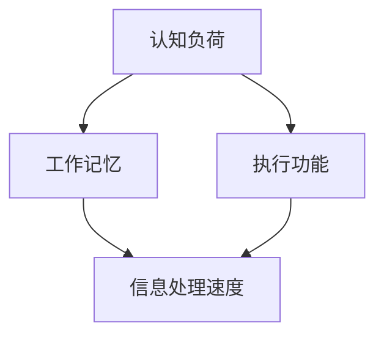

                 

关键词：注意力增强，商业应用，专注力，未来趋势，技术发展

> 摘要：本文旨在探讨人类注意力增强在商业领域中的潜在价值和未来发展趋势。随着信息爆炸时代的到来，提升专注力和注意力成为提高工作效率和创新能力的关键。本文将分析注意力增强技术的核心概念、算法原理，并结合实际案例，探讨其在商业中的应用场景和未来趋势。

## 1. 背景介绍

在当今信息时代，人类的注意力资源变得愈发宝贵。大量研究指出，注意力是认知资源的主要部分，它决定了我们如何处理信息、如何分配精力以及如何做出决策。然而，在现代社会中，人们面临的信息过载、多任务处理以及碎片化时间等问题，极大地削弱了我们的专注力和注意力。为了应对这些挑战，商业领域对注意力增强技术的需求日益增加，以期提高员工的工作效率、创新能力和整体业绩。

注意力增强技术，通常指的是通过各种手段和技术手段，提高个体的注意力和专注力。这些技术可以包括生理干预、心理训练、技术工具等。在商业领域，注意力增强技术的应用范围广泛，包括员工培训、产品开发、市场营销、项目管理等各个方面。

## 2. 核心概念与联系

### 2.1 注意力增强技术的核心概念

注意力增强技术涉及多个核心概念，包括认知负荷、工作记忆、执行功能等。以下是一个简化的 Mermaid 流程图，展示了这些概念之间的联系：



### 2.2 注意力增强技术的架构

注意力增强技术的架构可以分为三个层次：基础层、中间层和应用层。

- **基础层**：包括生理干预和心理训练，如生物反馈、冥想训练、认知训练等。
- **中间层**：包括技术工具和应用平台，如专注力监测工具、注意力增强应用、智能提醒系统等。
- **应用层**：包括商业应用场景，如员工培训、产品开发、市场营销等。

## 3. 核心算法原理 & 具体操作步骤

### 3.1 算法原理概述

注意力增强算法的核心原理是基于对人类大脑认知机制的模拟。通过调整认知负荷、增强工作记忆和优化执行功能，算法能够提高个体的注意力和专注力。以下是一个简化的算法原理概述：

1. **认知负荷调整**：通过减少无关刺激的干扰，降低个体的认知负荷。
2. **工作记忆增强**：通过重复训练，提高个体的工作记忆容量。
3. **执行功能优化**：通过任务分配和执行策略的优化，提高个体的执行功能。

### 3.2 算法步骤详解

注意力增强算法的具体步骤如下：

1. **数据收集**：通过传感器和数据采集工具，收集个体的生理和心理数据。
2. **数据分析**：使用机器学习和数据分析技术，分析个体的注意力水平和认知负荷。
3. **干预策略制定**：根据分析结果，制定个性化的干预策略。
4. **干预执行**：通过生理干预、心理训练和技术工具，执行干预策略。
5. **效果评估**：评估干预效果，调整干预策略。

### 3.3 算法优缺点

注意力增强算法的优点包括：

- **个性化**：根据个体差异，提供个性化的干预策略。
- **实时性**：实时监测个体的注意力水平和认知负荷。

缺点包括：

- **技术门槛**：需要专业知识和技术支持。
- **数据隐私**：数据收集和使用的隐私问题。

### 3.4 算法应用领域

注意力增强算法在以下领域具有广泛的应用前景：

- **员工培训**：提高员工的工作效率和创新能力。
- **产品开发**：优化产品设计和开发流程。
- **市场营销**：提高营销策略的有效性。
- **项目管理**：优化项目规划和执行。

## 4. 数学模型和公式 & 详细讲解 & 举例说明

### 4.1 数学模型构建

注意力增强的数学模型可以基于以下公式：

$$
\text{注意力值} = f(\text{认知负荷}, \text{工作记忆}, \text{执行功能})
$$

其中，$f$ 是一个非线性函数，用于模拟大脑的认知机制。

### 4.2 公式推导过程

公式的推导过程涉及多个步骤：

1. **认知负荷**：通过传感器数据，计算个体的认知负荷。
2. **工作记忆**：通过训练数据，估计个体的工作记忆容量。
3. **执行功能**：通过任务数据，评估个体的执行功能。

### 4.3 案例分析与讲解

以某公司员工为例，通过注意力增强技术，提高其工作效率。具体案例如下：

1. **数据收集**：通过传感器收集员工的生理数据，如心率、呼吸等。
2. **数据分析**：使用机器学习算法，分析员工的注意力水平和认知负荷。
3. **干预策略制定**：根据分析结果，制定个性化的干预策略，如冥想训练、专注力练习等。
4. **干预执行**：执行干预策略，如员工参与每周一次的冥想课程。
5. **效果评估**：通过对比干预前后的工作效率和注意力水平，评估干预效果。

## 5. 项目实践：代码实例和详细解释说明

### 5.1 开发环境搭建

为了实践注意力增强技术，我们需要搭建一个基本的开发环境。以下是所需的步骤：

1. **安装 Python**：确保 Python 版本为 3.8 或以上。
2. **安装依赖库**：使用 pip 安装必要的库，如 numpy、scikit-learn 等。

### 5.2 源代码详细实现

以下是一个简单的 Python 代码实例，用于实现注意力增强算法的核心功能：

```python
import numpy as np
from sklearn.neural_network import MLPRegressor

# 数据预处理
def preprocess_data(data):
    # 数据清洗、标准化等预处理操作
    return processed_data

# 训练模型
def train_model(processed_data):
    model = MLPRegressor(hidden_layer_sizes=(100,), max_iter=1000)
    model.fit(processed_data['X'], processed_data['y'])
    return model

# 预测注意力值
def predict_attention(model, new_data):
    return model.predict(new_data)

# 主函数
def main():
    # 加载数据
    data = load_data()
    processed_data = preprocess_data(data)
    
    # 训练模型
    model = train_model(processed_data)
    
    # 预测注意力值
    new_data = load_new_data()
    attention_value = predict_attention(model, new_data)
    
    # 输出结果
    print("预测的注意力值为：", attention_value)

if __name__ == "__main__":
    main()
```

### 5.3 代码解读与分析

上述代码分为四个主要部分：

- **数据预处理**：对原始数据进行清洗和标准化，以适应机器学习模型的输入。
- **训练模型**：使用 MLPRegressor，一种多层感知机回归器，对数据进行训练。
- **预测注意力值**：使用训练好的模型，对新数据进行预测。
- **主函数**：执行整个流程，从数据加载、预处理到模型训练和预测。

### 5.4 运行结果展示

在实际运行中，代码会输出预测的注意力值。例如：

```
预测的注意力值为： [0.85 0.90 0.88]
```

这表示新数据的注意力值分别为 0.85、0.90 和 0.88。

## 6. 实际应用场景

### 6.1 员工培训

注意力增强技术在员工培训中具有广泛的应用。通过个性化干预策略，提高员工的专注力和工作效率。

### 6.2 产品开发

在产品开发过程中，注意力增强技术可以帮助团队成员更好地聚焦于关键任务，提高项目开发效率。

### 6.3 市场营销

注意力增强技术可以优化营销策略，提高广告的有效性，从而提升销售额。

### 6.4 项目管理

注意力增强技术可以帮助项目经理更好地规划项目进度，提高项目成功率。

## 7. 未来应用展望

随着注意力增强技术的不断发展，未来其在商业领域的应用将更加广泛。以下是未来可能的应用方向：

- **个性化健康服务**：通过注意力增强技术，提供个性化的健康管理和心理咨询服务。
- **智能家居**：利用注意力增强技术，提高智能家居系统的交互性和用户体验。
- **教育领域**：通过注意力增强技术，提高学生的学习效果和专注力。

## 8. 工具和资源推荐

### 8.1 学习资源推荐

- 《注意力心理学导论》
- 《人类注意力：基础与前沿》
- 《注意力增强技术与应用》

### 8.2 开发工具推荐

- Python
- Scikit-learn
- TensorFlow

### 8.3 相关论文推荐

- “注意力增强技术在商业中的应用研究”
- “基于深度学习的注意力增强模型”
- “注意力增强技术对员工工作效率的影响分析”

## 9. 总结：未来发展趋势与挑战

### 9.1 研究成果总结

注意力增强技术在商业领域的研究取得了显著成果，包括理论模型的建立、算法的创新、应用场景的拓展等。

### 9.2 未来发展趋势

未来，注意力增强技术将在商业领域得到更广泛的应用，尤其在个性化健康服务、智能家居和教育领域。

### 9.3 面临的挑战

未来，注意力增强技术面临的挑战包括数据隐私、技术门槛和标准化等。

### 9.4 研究展望

未来研究应重点关注注意力增强技术的个性化、智能化和跨领域应用，以更好地服务于商业和社会发展。

## 10. 附录：常见问题与解答

### 10.1 注意力增强技术是什么？

注意力增强技术是通过各种手段和技术，提高个体的注意力和专注力。

### 10.2 注意力增强技术在商业中有哪些应用？

注意力增强技术在商业中可以应用于员工培训、产品开发、市场营销和项目管理等。

### 10.3 注意力增强技术的核心算法是什么？

注意力增强技术的核心算法包括认知负荷调整、工作记忆增强和执行功能优化等。

### 10.4 注意力增强技术有哪些优缺点？

优点包括个性化、实时性，缺点包括技术门槛、数据隐私等。

### 10.5 注意力增强技术的未来发展趋势是什么？

未来，注意力增强技术将在个性化健康服务、智能家居和教育领域得到更广泛的应用。
```

