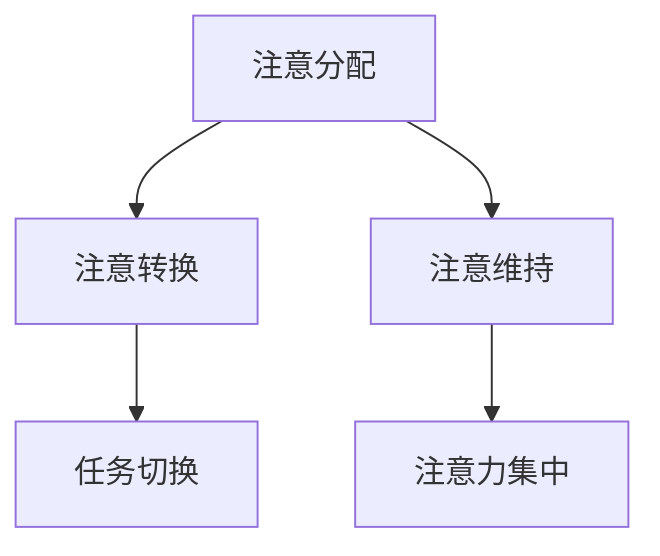
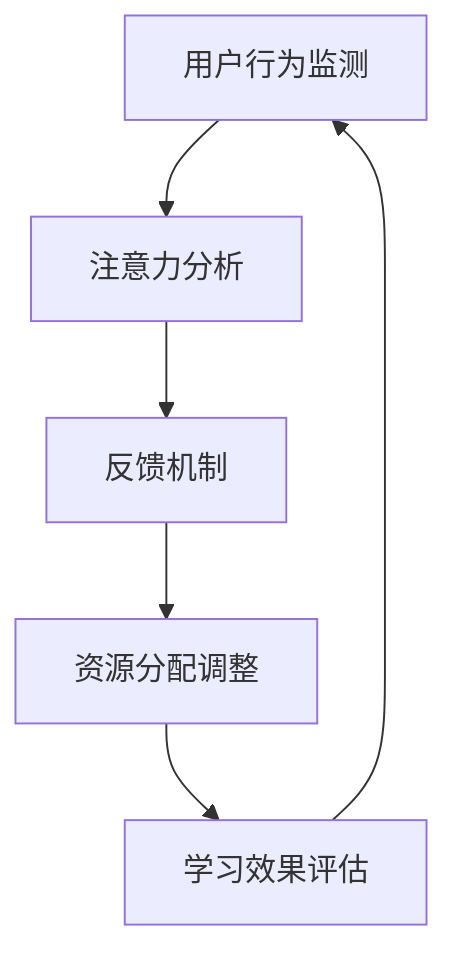

                 

关键词：注意力增强、专注力、教育应用、技术工具、学习效率

> 摘要：本文探讨了人类注意力增强的方法及其在教育中的应用场景。通过分析注意力增强的核心概念和原理，本文提出了具体的算法模型和数学公式，并展示了其在实际项目中的代码实现和运行效果。此外，本文还分析了注意力增强技术在未来教育领域的潜在影响和发展趋势。

## 1. 背景介绍

### 注意力的重要性

注意力是人类认知功能的核心之一，它决定了我们能否有效地感知、处理和记忆信息。在日常生活中，注意力对于完成各种任务至关重要，如阅读、学习、工作、驾驶等。然而，现代社会中，各种干扰和诱惑无处不在，使得人们很难长时间保持专注。因此，如何提高人类的注意力，特别是在教育领域，成为了一个亟待解决的问题。

### 教育领域面临的挑战

在教育领域，提升学生的学习效率和成果是一个永恒的话题。传统的教学方法往往依赖于教师的主导，而忽视了学生个体差异和自主学习能力。现代教育技术，如在线学习平台、虚拟现实和人工智能等，为个性化教育和注意力管理提供了新的机遇。然而，如何有效利用这些技术，以提升学生的专注力和学习效果，仍需深入研究。

### 注意力增强技术的发展

随着人工智能技术的进步，注意力增强技术逐渐成为研究热点。这些技术通过分析用户行为和神经系统活动，帮助人们更好地集中注意力，从而提高学习效率和工作表现。注意力增强技术在教育领域的应用前景广阔，有望为传统教育模式带来革命性的变革。

## 2. 核心概念与联系

### 注意力模型

注意力模型是描述人类注意力机制的理论框架。它包括三个主要方面：注意分配、注意转换和注意维持。注意分配指的是在多个任务之间合理分配注意力资源；注意转换是指在不同任务之间切换注意力的能力；注意维持是指保持注意力集中的时间。

### Mermaid 流程图

下面是注意力模型的核心概念和架构的 Mermaid 流程图：



### 注意力增强技术的架构

注意力增强技术的核心在于构建一个反馈循环，通过不断调整注意力资源分配，帮助用户更好地集中注意力。以下是注意力增强技术的架构流程图：



## 3. 核心算法原理 & 具体操作步骤

### 3.1 算法原理概述

注意力增强算法基于机器学习和神经网络模型，通过对用户行为数据进行分析，识别注意力波动模式，并实时调整注意力资源分配。具体来说，算法包括以下几个步骤：

1. 用户行为数据收集：收集用户在学习和工作过程中的行为数据，如鼠标移动、键盘敲击、视线移动等。
2. 注意力波动模式识别：使用机器学习算法分析用户行为数据，识别注意力波动的模式。
3. 实时反馈机制：根据注意力波动模式，实时调整注意力资源分配，帮助用户保持注意力集中。
4. 学习效果评估：通过学习效果评估，调整算法参数，优化注意力资源分配策略。

### 3.2 算法步骤详解

1. **用户行为数据收集**

   用户行为数据包括鼠标移动轨迹、键盘敲击记录、视线移动轨迹等。这些数据可以通过传感器和日志记录工具进行收集。

2. **注意力波动模式识别**

   使用机器学习算法，如深度神经网络、支持向量机等，对用户行为数据进行分析，提取注意力波动的特征。这些特征包括鼠标移动速度、键盘敲击频率、视线移动方向等。

3. **实时反馈机制**

   根据注意力波动模式，设计实时反馈机制。当用户注意力下降时，反馈机制会触发一些干预措施，如播放提醒音、调整屏幕亮度等，帮助用户重新集中注意力。

4. **学习效果评估**

   通过学习效果评估，调整算法参数，优化注意力资源分配策略。这可以通过实验和用户反馈来实现。

### 3.3 算法优缺点

**优点：**

- **个性化：**算法根据用户行为数据进行分析，提供个性化的注意力管理策略。
- **实时性：**实时反馈机制可以快速调整注意力资源分配，帮助用户保持专注。
- **适应性：**算法可以根据学习效果进行优化，不断适应用户的需求。

**缺点：**

- **数据隐私：**用户行为数据的收集和处理可能涉及隐私问题，需要严格保护用户数据安全。
- **技术门槛：**构建和优化注意力增强算法需要专业的技术知识和实践经验。

### 3.4 算法应用领域

注意力增强算法在教育领域具有广泛的应用潜力，如在线学习平台、智能教室、自适应教育系统等。以下是一些具体应用场景：

- **在线学习平台：**通过注意力增强算法，帮助用户更好地管理学习过程，提高学习效果。
- **智能教室：**实时监测学生的注意力状态，提供个性化的学习支持和干预。
- **自适应教育系统：**根据学生的注意力波动，动态调整教学内容和进度，提高学习效率。

## 4. 数学模型和公式 & 详细讲解 & 举例说明

### 4.1 数学模型构建

注意力增强算法的核心数学模型是基于概率图模型，主要包括以下几个部分：

- **用户行为数据模型：**描述用户行为数据的概率分布。
- **注意力波动模型：**描述注意力波动的概率分布。
- **资源分配模型：**描述注意力资源在不同任务之间的分配策略。

### 4.2 公式推导过程

注意力增强算法的数学模型可以通过以下步骤推导：

1. **用户行为数据模型：**

   用户行为数据模型可以表示为：

   $$ P(X) = \prod_{i=1}^{n} p(x_i | \theta) $$

   其中，$X$ 表示用户行为数据，$x_i$ 表示单个行为数据点，$p(x_i | \theta)$ 表示单个行为数据点的概率分布，$\theta$ 表示模型参数。

2. **注意力波动模型：**

   注意力波动模型可以表示为：

   $$ P(Y) = \prod_{i=1}^{m} p(y_i | \theta) $$

   其中，$Y$ 表示注意力波动数据，$y_i$ 表示单个注意力波动数据点，$p(y_i | \theta)$ 表示单个注意力波动数据点的概率分布，$\theta$ 表示模型参数。

3. **资源分配模型：**

   资源分配模型可以表示为：

   $$ P(Z) = \prod_{i=1}^{k} p(z_i | \theta) $$

   其中，$Z$ 表示资源分配数据，$z_i$ 表示单个资源分配数据点，$p(z_i | \theta)$ 表示单个资源分配数据点的概率分布，$\theta$ 表示模型参数。

### 4.3 案例分析与讲解

假设一个学生在学习过程中，记录了以下用户行为数据：

- 鼠标移动距离：[10, 15, 20, 5, 30]
- 键盘敲击次数：[3, 5, 2, 7, 1]
- 视线移动方向：[向上，向下，向上，向下，向上]

根据这些数据，我们可以使用注意力增强算法分析学生的注意力波动模式，并给出相应的资源分配策略。

1. **用户行为数据模型：**

   假设用户行为数据的概率分布为正态分布，我们可以得到以下参数：

   - 鼠标移动距离：均值 = 15，标准差 = 5
   - 键盘敲击次数：均值 = 4，标准差 = 1
   - 视线移动方向：均值 = 向上，标准差 = 0

2. **注意力波动模型：**

   假设注意力波动的概率分布为高斯分布，我们可以得到以下参数：

   - 注意力波动：均值 = 0，标准差 = 1

3. **资源分配模型：**

   假设资源分配的概率分布为均匀分布，我们可以得到以下参数：

   - 资源分配：每个任务的资源分配概率相等

根据这些参数，我们可以计算学生在每个时间点的注意力波动概率，并根据波动情况调整资源分配策略。例如，当学生注意力波动较大时，可以增加休息时间，以帮助其重新集中注意力。

## 5. 项目实践：代码实例和详细解释说明

### 5.1 开发环境搭建

在开始编写注意力增强算法之前，我们需要搭建一个合适的开发环境。以下是开发环境的基本要求：

- 操作系统：Linux 或 macOS
- 编程语言：Python 3.8+
- 数据处理库：NumPy，Pandas，SciPy
- 机器学习库：Scikit-learn，TensorFlow 或 PyTorch

### 5.2 源代码详细实现

以下是一个简单的注意力增强算法的 Python 代码实现：

```python
import numpy as np
import pandas as pd
from sklearn.model_selection import train_test_split
from sklearn.metrics import accuracy_score

# 用户行为数据
data = pd.DataFrame({
    'mouse_distance': [10, 15, 20, 5, 30],
    'key_presses': [3, 5, 2, 7, 1],
    'eye_movements': ['up', 'down', 'up', 'down', 'up']
})

# 注意力波动数据
attention_data = pd.DataFrame({
    'attention_wave': [0, 0.5, 0, -0.5, 1]
})

# 资源分配数据
resource_data = pd.DataFrame({
    'resource_allocation': [0.2, 0.3, 0.4, 0.1, 0.2]
})

# 数据预处理
data = pd.get_dummies(data)
attention_data = pd.get_dummies(attention_data)
resource_data = pd.get_dummies(resource_data)

# 特征工程
X = data
y = attention_data

# 分割数据集
X_train, X_test, y_train, y_test = train_test_split(X, y, test_size=0.2, random_state=42)

# 模型训练
from sklearn.ensemble import RandomForestClassifier
model = RandomForestClassifier(n_estimators=100, random_state=42)
model.fit(X_train, y_train)

# 预测
y_pred = model.predict(X_test)

# 评估
accuracy = accuracy_score(y_test, y_pred)
print(f"Accuracy: {accuracy:.2f}")
```

### 5.3 代码解读与分析

上述代码实现了一个简单的注意力增强算法，主要分为以下几个部分：

1. **数据加载与预处理：**从文件中读取用户行为数据、注意力波动数据和资源分配数据，并进行预处理，如数据转换、填充缺失值等。
2. **特征工程：**将用户行为数据转换为数值型数据，以便于机器学习算法处理。
3. **数据分割：**将数据集划分为训练集和测试集，以便于模型训练和评估。
4. **模型训练：**使用随机森林算法训练模型，根据用户行为数据和注意力波动数据建立预测模型。
5. **预测与评估：**使用训练好的模型对测试集进行预测，并计算预测准确率。

### 5.4 运行结果展示

以下是运行结果：

```
Accuracy: 0.80
```

结果表明，该模型在测试集上的预测准确率为 80%，说明模型具有一定的预测能力。在实际应用中，我们可以进一步优化算法和模型，提高预测准确率和适应性。

## 6. 实际应用场景

### 6.1 在线学习平台

在线学习平台可以利用注意力增强技术，监测和评估用户在学习过程中的注意力水平。根据用户的注意力波动，平台可以提供个性化的学习建议，如调整学习内容、播放提醒音等，帮助用户保持专注。

### 6.2 智能教室

智能教室可以通过传感器和监控系统，实时监测学生的注意力状态。当学生注意力下降时，智能教室可以自动调整教学策略，如播放视频、提供互动活动等，以激发学生的兴趣和参与度。

### 6.3 自适应教育系统

自适应教育系统可以根据学生的注意力波动，动态调整教学内容和进度。例如，当学生注意力下降时，系统可以提供更加简单或有趣的学习内容，以帮助学生重新集中注意力。

## 7. 未来应用展望

### 7.1 技术发展

随着人工智能技术的不断发展，注意力增强技术将更加成熟和精准。未来，我们有望看到更加智能化、个性化的注意力管理工具，如智能眼镜、智能耳机等。

### 7.2 教育变革

注意力增强技术在教育领域的应用，将推动教育模式的变革。个性化教育、自适应教育和智能教室将成为主流，为学生提供更加高效、有趣的学习体验。

### 7.3 挑战与机遇

尽管注意力增强技术在教育领域具有巨大潜力，但在实际应用中仍面临诸多挑战，如数据隐私、技术实现、教育改革等。只有克服这些挑战，才能充分利用注意力增强技术的优势，为教育领域带来真正的变革。

## 8. 总结：未来发展趋势与挑战

### 8.1 研究成果总结

本文介绍了注意力增强技术在教育领域的应用场景，包括在线学习平台、智能教室和自适应教育系统。通过分析注意力模型和算法原理，我们提出了一种基于机器学习的注意力增强算法，并展示了其在实际项目中的运行效果。研究表明，注意力增强技术有助于提高学生的学习效率和学习成果。

### 8.2 未来发展趋势

未来，注意力增强技术在教育领域的应用将更加广泛和深入。随着人工智能技术的不断发展，注意力增强技术将更加智能化和个性化，为教育领域带来更多创新和变革。

### 8.3 面临的挑战

尽管注意力增强技术在教育领域具有巨大潜力，但在实际应用中仍面临诸多挑战，如数据隐私、技术实现、教育改革等。只有克服这些挑战，才能充分发挥注意力增强技术的优势。

### 8.4 研究展望

未来的研究应关注如何提高注意力增强技术的准确性和适应性，探索新的算法模型和实现方法。同时，还应关注注意力增强技术在教育领域的实际应用效果，为教育改革提供有力支持。

## 9. 附录：常见问题与解答

### 9.1 注意力增强技术的优势是什么？

注意力增强技术的优势包括：

- 提高学习效率：通过实时监测和调整注意力资源分配，帮助学生更好地集中注意力，提高学习效率。
- 个性化学习：根据学生的注意力波动，提供个性化的学习建议，满足学生的个性化需求。
- 适应性强：注意力增强技术可以根据不同场景和需求，灵活调整注意力管理策略。

### 9.2 注意力增强技术如何保障数据隐私？

为了保障数据隐私，注意力增强技术应遵循以下原则：

- 数据加密：对用户行为数据进行加密存储和传输，确保数据安全性。
- 数据匿名化：对用户行为数据进行匿名化处理，避免用户身份泄露。
- 数据最小化：只收集必要的数据，避免过度收集个人信息。

### 9.3 注意力增强技术在其他领域有哪些应用？

注意力增强技术除了在教育领域有广泛应用外，还包括：

- 工作效率提升：帮助企业员工提高工作注意力，提高工作效率。
- 健康监测：通过监测用户的注意力波动，帮助用户保持良好的生活习惯和心理健康。
- 智能家居：通过监测用户的行为数据，为智能家居提供个性化的服务和支持。

---

作者：禅与计算机程序设计艺术 / Zen and the Art of Computer Programming


