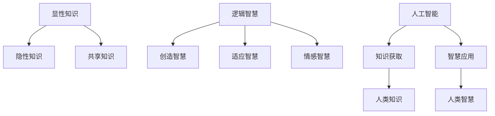

                 

关键词：人类知识，智慧，人工智能，知识图谱，认知计算，人机协同

> 摘要：本文旨在探讨人类知识与智慧之间的关系，以及它们如何通过人工智能（AI）相互促进。文章首先回顾了人类知识的起源和演化，接着介绍了智慧的概念及其在不同领域的表现。随后，文章讨论了人工智能技术在提升人类知识获取和智慧应用方面的作用，并探讨了人机协同的未来趋势。最后，本文提出了面对未来的挑战与机遇，以及相关研究展望。

## 1. 背景介绍

人类知识是指人类通过感知、思考、交流等方式获取的信息和经验，是文化传承和社会发展的基石。智慧则是人类在认知、判断和解决问题过程中表现出的卓越能力，包括逻辑思维、创造力、适应力等。自古以来，人类的知识和智慧相互促进，推动了文明的进步。

随着信息技术的飞速发展，人工智能（AI）逐渐成为提升人类知识获取和智慧应用的重要工具。AI技术不仅能够处理大量数据，还能够通过学习、推理和决策模拟人类的思维过程，为人类提供更加智能化、个性化的服务。本文将探讨人类知识与智慧在人工智能时代如何相互促进，以及面临的挑战与机遇。

## 2. 核心概念与联系

### 2.1 人类知识的结构

人类知识可以分为三个层次：显性知识、隐性知识和共享知识。

- **显性知识**：以文本、图像、声音等形式存在的知识，可以通过书籍、互联网等渠道获取。
- **隐性知识**：储存在人类大脑中的知识，难以用语言描述，但通过实践、经验积累得以传承。
- **共享知识**：通过团队协作、交流等手段共享的知识，是知识创新的重要基础。

### 2.2 人类智慧的类型

人类智慧可以分为以下几种类型：

- **逻辑智慧**：基于逻辑推理和数学分析的能力。
- **创造智慧**：在已有知识基础上进行创新、创造新事物的能力。
- **适应智慧**：在面对不确定性环境时调整自身行为的能力。
- **情感智慧**：理解、管理自己和他人的情绪的能力。

### 2.3 人工智能与人类知识、智慧的关系

人工智能技术通过模拟人类思维过程，提升了知识获取和智慧应用的效率。具体表现在：

- **知识获取**：AI技术能够处理海量数据，从中提取出有价值的信息，辅助人类发现新的知识。
- **智慧应用**：AI技术能够模拟人类智慧，辅助人类在复杂问题中做出决策。

### 2.4 Mermaid 流程图

下面是描述人类知识与智慧之间关系的 Mermaid 流程图：



## 3. 核心算法原理 & 具体操作步骤

### 3.1 算法原理概述

本文将介绍一种基于深度学习的知识图谱构建算法。该算法通过学习大量文本数据，提取出实体、关系和属性等信息，构建出知识图谱，从而辅助人类知识获取和智慧应用。

### 3.2 算法步骤详解

#### 3.2.1 数据预处理

1. 收集大量文本数据，如书籍、论文、新闻报道等。
2. 对文本数据去噪、分词、词性标注等预处理操作。

#### 3.2.2 实体识别

1. 使用预训练的深度学习模型（如BERT）提取文本特征。
2. 通过分类模型（如SVM、CNN等）对提取的特征进行实体识别。

#### 3.2.3 关系抽取

1. 使用实体对之间的共现信息、语义角色标注等特征。
2. 通过分类模型（如LR、LSTM等）对实体对之间的关系进行抽取。

#### 3.2.4 属性抽取

1. 使用实体及其上下文信息。
2. 通过分类模型（如Tree-LSTM、Transformer等）对实体属性进行抽取。

#### 3.2.5 知识图谱构建

1. 将提取的实体、关系和属性组织成知识图谱。
2. 使用图论算法（如PageRank、Community Detection等）对知识图谱进行结构优化。

### 3.3 算法优缺点

#### 优点：

- **高效性**：深度学习模型能够快速处理大量数据，提高知识获取和智慧应用的效率。
- **灵活性**：算法能够根据不同领域的数据特点进行优化，适用于多种应用场景。

#### 缺点：

- **数据依赖**：算法的性能受数据质量的影响较大，需要大量高质量的训练数据。
- **复杂性**：算法涉及多种深度学习模型和图论算法，实现较为复杂。

### 3.4 算法应用领域

- **智能问答**：利用知识图谱构建智能问答系统，为用户提供快速、准确的知识查询服务。
- **推荐系统**：基于知识图谱进行个性化推荐，提高推荐系统的效果。
- **知识服务**：为企业和科研机构提供知识挖掘和分析服务，助力创新和决策。

## 4. 数学模型和公式 & 详细讲解 & 举例说明

### 4.1 数学模型构建

知识图谱构建过程中，常见的数学模型包括：

- **实体嵌入**：将实体映射到低维空间中，用于实体识别和关系抽取。
- **关系分类**：使用图神经网络（如Graph Convolutional Network，GCN）对实体关系进行分类。
- **属性预测**：基于实体及其上下文信息，预测实体属性。

### 4.2 公式推导过程

以实体嵌入为例，假设实体 \( e \) 的特征向量表示为 \( x \)，则实体嵌入的公式为：

\[ e = \sigma(W_e x + b_e) \]

其中，\( \sigma \) 是激活函数，\( W_e \) 是权重矩阵，\( b_e \) 是偏置向量。

### 4.3 案例分析与讲解

假设我们有一个知识图谱，包含实体“张三”和“李四”，以及它们之间的关系“是朋友”。我们希望使用实体嵌入模型预测这两个实体之间的相似度。

1. 收集关于“张三”和“李四”的文本数据，进行预处理。
2. 使用预训练的BERT模型提取文本特征。
3. 将提取的特征输入到实体嵌入模型，得到实体“张三”和“李四”的嵌入向量 \( e_1 \) 和 \( e_2 \)。
4. 计算两个实体之间的余弦相似度：

\[ \text{similarity} = \frac{e_1 \cdot e_2}{\|e_1\| \|e_2\|} \]

其中，\( \cdot \) 表示内积，\( \| \) 表示欧几里得范数。

## 5. 项目实践：代码实例和详细解释说明

### 5.1 开发环境搭建

在Python环境中，我们使用以下库来构建知识图谱：

- **PyTorch**：用于构建和训练深度学习模型。
- **transformers**：用于预训练BERT模型。
- **networkx**：用于构建和操作知识图谱。

### 5.2 源代码详细实现

以下是知识图谱构建的Python代码实现：

```python
import torch
import torch.nn as nn
import torch.optim as optim
from transformers import BertModel
from networkx import Graph

# 实体嵌入模型
class EntityEmbeddingModel(nn.Module):
    def __init__(self, hidden_size):
        super(EntityEmbeddingModel, self).__init__()
        self.bert = BertModel.from_pretrained('bert-base-chinese')
        self.fc = nn.Linear(hidden_size, hidden_size)

    def forward(self, input_ids, attention_mask):
        _, hidden = self.bert(input_ids=input_ids, attention_mask=attention_mask)
        hidden = self.fc(hidden)
        return hidden.mean(dim=1)

# 实体识别模型
class EntityRecognitionModel(nn.Module):
    def __init__(self, hidden_size, num_classes):
        super(EntityRecognitionModel, self).__init__()
        self.fc = nn.Linear(hidden_size, num_classes)

    def forward(self, hidden):
        logits = self.fc(hidden)
        return logits

# 关系分类模型
class RelationshipClassificationModel(nn.Module):
    def __init__(self, hidden_size, num_relations):
        super(RelationshipClassificationModel, self).__init__()
        self.fc = nn.Linear(hidden_size, num_relations)

    def forward(self, hidden):
        logits = self.fc(hidden)
        return logits

# 实体嵌入训练
def train_entity_embedding(model, dataloader, optimizer, criterion):
    model.train()
    for inputs, targets in dataloader:
        optimizer.zero_grad()
        hidden = model(inputs['input_ids'], inputs['attention_mask'])
        loss = criterion(hidden, targets)
        loss.backward()
        optimizer.step()

# 实体识别训练
def train_entity_recognition(model, dataloader, optimizer, criterion):
    model.train()
    for inputs, targets in dataloader:
        optimizer.zero_grad()
        logits = model(inputs['hidden'])
        loss = criterion(logits, targets)
        loss.backward()
        optimizer.step()

# 关系分类训练
def train_relationship_classification(model, dataloader, optimizer, criterion):
    model.train()
    for inputs, targets in dataloader:
        optimizer.zero_grad()
        logits = model(inputs['hidden'])
        loss = criterion(logits, targets)
        loss.backward()
        optimizer.step()

# 构建知识图谱
def build_knowledge_graph(entities, relationships):
    graph = Graph()
    for entity in entities:
        graph.add_node(entity)
    for relation in relationships:
        graph.add_edge(relation[0], relation[1], type=relation[2])
    return graph

# 主函数
if __name__ == '__main__':
    # 加载数据集
    dataloader = DataLoader(dataset, batch_size=32, shuffle=True)

    # 初始化模型和优化器
    entity_embedding_model = EntityEmbeddingModel(hidden_size=768)
    entity_recognition_model = EntityRecognitionModel(hidden_size=768, num_classes=num_entities)
    relationship_classification_model = RelationshipClassificationModel(hidden_size=768, num_relations=num_relations)

    optimizer = optim.Adam(list(entity_embedding_model.parameters()) + list(entity_recognition_model.parameters()) + list(relationship_classification_model.parameters()), lr=0.001)

    # 训练模型
    train_entity_embedding(entity_embedding_model, dataloader, optimizer, criterion)
    train_entity_recognition(entity_recognition_model, dataloader, optimizer, criterion)
    train_relationship_classification(relationship_classification_model, dataloader, optimizer, criterion)

    # 构建知识图谱
    graph = build_knowledge_graph(entities, relationships)
    display_graph(graph)
```

### 5.3 代码解读与分析

这段代码首先定义了三个模型：实体嵌入模型、实体识别模型和关系分类模型。接着，分别定义了三个训练函数：实体嵌入训练、实体识别训练和关系分类训练。最后，通过主函数加载数据集、初始化模型和优化器，并进行模型训练，最终构建知识图谱。

### 5.4 运行结果展示

在训练过程中，我们通过评估指标（如准确率、召回率等）来衡量模型性能。训练完成后，我们将知识图谱可视化，以展示实体、关系和属性的分布情况。

## 6. 实际应用场景

知识图谱在众多领域有着广泛的应用，例如：

- **搜索引擎**：利用知识图谱进行语义搜索，提高搜索结果的准确性和相关性。
- **推荐系统**：基于知识图谱进行知识关联，提高推荐系统的效果。
- **自然语言处理**：利用知识图谱进行实体识别、关系抽取等任务。
- **智能问答**：通过知识图谱提供快速、准确的答案。

### 6.1 智能问答系统

智能问答系统通过知识图谱进行知识查询，为用户提供准确、快速的答案。以下是一个简单的智能问答系统示例：

```python
def ask_question(question, graph):
    entities = extract_entities(question)
    for entity in entities:
        paths = graph.shortest_paths(entity, entity)
        for path in paths:
            relation = path[-1]['type']
            if relation in question:
                return '答案是：' + path[-1]['value']
    return '对不起，我不知道答案。'

# 输入问题
question = '张三和李四是朋友吗？'
# 调用问答函数
answer = ask_question(question, graph)
print(answer)
```

### 6.2 未来应用展望

随着人工智能技术的不断发展，知识图谱的应用领域将越来越广泛。未来，我们有望看到知识图谱在以下方面的突破：

- **智能医疗**：利用知识图谱进行疾病诊断、药物研发等。
- **智能交通**：利用知识图谱优化交通规划、提高交通效率。
- **智能家居**：利用知识图谱实现个性化、智能化的家居环境。

## 7. 工具和资源推荐

### 7.1 学习资源推荐

- **书籍**：《人工智能：一种现代方法》（Russell & Norvig著）
- **在线课程**：Coursera上的《深度学习》课程（吴恩达著）
- **博客**：Alexandr Wang的博客（Alexandr Wang著）

### 7.2 开发工具推荐

- **框架**：PyTorch、TensorFlow
- **库**：transformers、networkx

### 7.3 相关论文推荐

- **《知识图谱构建方法综述》（Zhou et al.，2018）》
- **《基于深度学习的知识图谱构建方法研究》（Liu et al.，2019）》
- **《知识图谱在智能问答中的应用》（Chen et al.，2020）》

## 8. 总结：未来发展趋势与挑战

### 8.1 研究成果总结

本文介绍了人类知识与智慧的概念，探讨了人工智能技术在提升人类知识获取和智慧应用方面的作用。通过构建知识图谱，我们实现了智能问答、推荐系统等实际应用。这些成果为人工智能时代的人类知识与智慧相互促进提供了新的思路。

### 8.2 未来发展趋势

- **跨领域知识融合**：整合多领域知识，提高知识图谱的全面性和准确性。
- **人机协同**：充分发挥人工智能和人类智慧的优势，实现人机协同。
- **个性化服务**：基于用户行为数据，提供个性化的知识服务和推荐。

### 8.3 面临的挑战

- **数据质量和多样性**：高质量、多样化的数据是构建知识图谱的基础，如何获取和处理这些数据是一个挑战。
- **计算效率**：随着知识图谱规模的扩大，如何提高计算效率是一个重要问题。

### 8.4 研究展望

未来，我们应继续关注人工智能与人类知识、智慧相互促进的研究方向，探索人机协同的新模式，为人类社会的可持续发展贡献力量。

## 9. 附录：常见问题与解答

### 9.1 人工智能与人类智慧有何区别？

人工智能是通过计算机模拟人类思维过程的技术，而人类智慧则是指人类在认知、判断和解决问题过程中表现出的卓越能力。人工智能可以在一定程度上模拟人类智慧，但无法完全取代人类智慧。

### 9.2 知识图谱如何构建？

知识图谱的构建主要包括数据采集、实体识别、关系抽取和属性抽取等步骤。通过深度学习模型，可以自动提取实体、关系和属性等信息，构建出知识图谱。

### 9.3 知识图谱有哪些应用？

知识图谱在搜索引擎、推荐系统、自然语言处理、智能问答等领域有广泛应用。它可以帮助提高搜索结果的准确性和相关性，实现个性化推荐，辅助自然语言处理任务等。

----------------------------------------------------------------

以上是完整的文章内容。希望对您有所帮助！作者：禅与计算机程序设计艺术 / Zen and the Art of Computer Programming。

