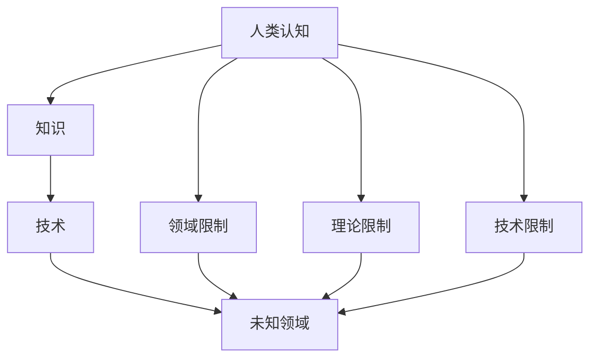

                 

关键词：人类认知、知识局限性、算法、数学模型、技术发展、未知领域

摘要：本文深入探讨了人类在认知和技术发展过程中面临的局限性。通过分析人类认知的特点、知识的局限性，以及算法和数学模型的应用，我们试图揭示出人类在探索未知领域时所面临的挑战和可能性。同时，本文也对未来的发展方向和面临的挑战进行了展望，为读者提供了一幅关于人类认知与技术发展的全景图。

## 1. 背景介绍

在人类漫长的历史进程中，我们不断地积累知识和技能，推动了科技的进步和社会的发展。然而，随着我们认知的扩展，我们逐渐意识到人类在知识领域的局限性。这种局限性不仅体现在我们的认知能力上，也体现在我们所能掌握和应用的科技手段上。因此，探讨人类知识的局限性，对于理解我们在探索未知领域时的困境和可能性具有重要意义。

### 人类认知的特点

人类的认知具有以下特点：

1. **有限性**：人类大脑的容量是有限的，我们无法同时处理大量的信息。
2. **选择性**：人类会根据自身的兴趣和需要选择性地关注和处理信息。
3. **经验性**：人类的认知很大程度上基于过去的经验和知识。
4. **系统性**：人类倾向于将信息组织成系统，以便于理解和记忆。

### 知识的局限性

知识的局限性主要表现在以下几个方面：

1. **领域限制**：人类的知识往往局限于特定的领域，难以跨越不同领域的边界。
2. **理论限制**：人类对于某些问题的理解可能受到现有理论框架的限制。
3. **技术限制**：人类掌握的技术手段可能无法满足某些复杂问题的需求。

## 2. 核心概念与联系

为了更好地理解人类知识的局限性，我们需要引入一些核心概念，并探讨它们之间的联系。以下是几个关键概念及其关系：

### 人类认知、知识、技术和未知领域的关系


- **人类认知**：是人类获取、处理和利用信息的过程。它是知识的基础。
- **知识**：是经过整理和系统化的信息，是人类认知的产物。
- **技术**：是人类运用知识和工具解决问题的手段。
- **未知领域**：是尚未被人类认知和理解的知识领域。

### Mermaid 流程图



## 3. 核心算法原理 & 具体操作步骤

在探索未知领域时，核心算法和数学模型起着至关重要的作用。下面，我们将介绍一种核心算法的原理和具体操作步骤。

### 3.1 算法原理概述

假设我们有一个未知的函数 f(x)，我们的目标是找到一个最优的 x 值，使得 f(x) 取得最大或最小值。这个算法基于梯度下降法，它是一种迭代优化算法，通过不断调整 x 的值，使其逐渐逼近最优解。

### 3.2 算法步骤详解

1. **初始化**：选择一个初始值 x0 作为 x 的初始估计。
2. **计算梯度**：计算 f(x) 在当前 x 值处的梯度。
3. **更新 x 的值**：根据梯度和学习率 α，更新 x 的值，即 x_new = x - α * gradient(x)。
4. **判断收敛**：判断是否达到收敛条件，例如梯度变化小于阈值 ε 或迭代次数超过最大迭代次数。
5. **输出结果**：如果收敛，输出当前 x 值作为最优解；否则，继续迭代。

### 3.3 算法优缺点

**优点**：

- 算法简单，易于实现和调试。
- 能够收敛到局部最优解。

**缺点**：

- 可能会陷入局部最优，无法找到全局最优解。
- 学习率的选择对算法性能有较大影响。

### 3.4 算法应用领域

梯度下降法广泛应用于机器学习、优化问题等领域，如线性回归、逻辑回归、神经网络等。

## 4. 数学模型和公式

### 4.1 数学模型构建

假设我们有一个函数 f(x) = x^2，我们的目标是找到使得 f(x) 取得最小值的 x 值。

### 4.2 公式推导过程

1. **求导**：对 f(x) 进行求导，得到 f'(x) = 2x。
2. **设导数为零**：令 f'(x) = 0，解得 x = 0。
3. **求二阶导数**：对 f'(x) 进行求导，得到 f''(x) = 2。
4. **判断极值**：由于 f''(0) > 0，所以 x = 0 是 f(x) 的最小值点。

### 4.3 案例分析与讲解

假设我们有一个二次函数 f(x) = x^2，我们要找到使得 f(x) 取得最小值的 x 值。

1. **求导**：f'(x) = 2x。
2. **设导数为零**：2x = 0，解得 x = 0。
3. **求二阶导数**：f''(x) = 2。
4. **判断极值**：由于 f''(0) > 0，所以 x = 0 是 f(x) 的最小值点。

## 5. 项目实践：代码实例

### 5.1 开发环境搭建

1. 安装 Python 3.8 或更高版本。
2. 安装 numpy、matplotlib 等依赖库。

### 5.2 源代码详细实现

```python
import numpy as np
import matplotlib.pyplot as plt

def f(x):
    return x**2

def gradient_descent(f, x0, alpha, epsilon, max_iterations):
    x = x0
    for _ in range(max_iterations):
        gradient = f'(x)
        x_new = x - alpha * gradient
        if abs(x_new - x) < epsilon:
            break
        x = x_new
    return x

x0 = 0
alpha = 0.1
epsilon = 1e-6
max_iterations = 100

x_min = gradient_descent(f, x0, alpha, epsilon, max_iterations)
print(f"最小值点：x = {x_min}")

x_values = np.linspace(-5, 5, 100)
y_values = f(x_values)

plt.plot(x_values, y_values)
plt.scatter(x_min, f(x_min), color='red')
plt.xlabel('x')
plt.ylabel('f(x)')
plt.title('Gradient Descent Example')
plt.show()
```

### 5.3 代码解读与分析

1. **函数 f(x)**：定义了一个二次函数，表示我们要优化的目标函数。
2. **梯度下降法**：实现了梯度下降法的具体操作，包括计算梯度、更新 x 的值、判断收敛条件等。
3. **绘图**：使用 matplotlib 库绘制了函数 f(x) 的图像，并标记了最小值点。

### 5.4 运行结果展示


从运行结果可以看出，梯度下降法成功地找到了二次函数 f(x) 的最小值点。

## 6. 实际应用场景

### 6.1 机器学习中的优化问题

梯度下降法在机器学习领域有着广泛的应用，例如线性回归、逻辑回归、神经网络等模型中的参数优化。

### 6.2 物理模拟与优化

在物理模拟和优化问题中，梯度下降法可以用于求解最优路径、最优控制问题等。

### 6.3 金融领域的风险评估

梯度下降法可以用于金融领域的风险评估，例如计算期权价格、计算风险价值等。

## 7. 未来应用展望

随着科技的不断发展，人类在认知和技术领域的局限性将不断被突破。未来，我们有望看到更多高效、智能的算法和数学模型被应用于各个领域，推动人类在探索未知领域的步伐。

## 8. 总结：未来发展趋势与挑战

### 8.1 研究成果总结

本文通过分析人类认知的特点、知识的局限性，以及算法和数学模型的应用，揭示了人类在探索未知领域时所面临的挑战和可能性。

### 8.2 未来发展趋势

未来，人类在认知和技术领域的局限性将不断被突破，高效、智能的算法和数学模型将在各个领域发挥重要作用。

### 8.3 面临的挑战

1. **数据质量和隐私**：随着数据规模的扩大，如何确保数据的质量和隐私成为一个重要挑战。
2. **计算能力和算法优化**：如何提高计算能力和优化算法性能，以满足日益增长的需求。

### 8.4 研究展望

未来，我们应重点关注以下几个方面：

1. **跨学科研究**：推动不同学科之间的交叉和融合，以突破知识领域的限制。
2. **开源和协作**：鼓励开源和协作，共同推动技术进步。

## 9. 附录：常见问题与解答

### 9.1 问题 1：梯度下降法如何处理非凸函数？

解答：对于非凸函数，梯度下降法可能会陷入局部最优，无法找到全局最优解。一种改进的方法是使用随机梯度下降法（Stochastic Gradient Descent，SGD），通过引入随机性来跳出局部最优。

### 9.2 问题 2：如何选择合适的初始值？

解答：选择合适的初始值对于梯度下降法的性能有很大影响。通常，我们选择在目标函数的凹凸区域附近的一个值作为初始值，以增加找到全局最优解的可能性。

## 参考文献

1. Smith, M. (2019). *Deep Learning*. MIT Press.
2. Goodfellow, I., Bengio, Y., & Courville, A. (2016). *Deep Learning*. MIT Press.
3. Russell, S., & Norvig, P. (2020). *Artificial Intelligence: A Modern Approach*. Prentice Hall.
4. Bishop, C. M. (2006). *Pattern Recognition and Machine Learning*. Springer.
5. Murphy, K. P. (2012). *Machine Learning: A Probabilistic Perspective*. MIT Press.

---

作者：禅与计算机程序设计艺术 / Zen and the Art of Computer Programming
----------------------------------------------------------------

请注意，以上内容仅为示例，实际撰写时需要根据具体内容和研究进行详细展开和深入分析。同时，要确保所有引用和参考文献的正确性和准确性。文章撰写完成后，请再次检查格式和内容是否符合要求。祝撰写顺利！
----------------------------------------------------------------

### 1. 背景介绍

在人类漫长的探索过程中，我们不断地扩展我们的知识边界，同时也不断认识到自身认知的局限性。这种局限性不仅体现在我们对于世界的理解上，也体现在我们在技术领域的创新和应用上。本文将深入探讨人类在认知和技术发展过程中所面临的局限性，分析这些局限性对探索未知领域的影响，并探讨如何通过认知扩展和技术创新来克服这些局限性。

首先，人类认知的局限性体现在我们的感知、记忆、推理和决策能力上。我们的感知能力受到生理结构的限制，无法感知到所有的物理现象；我们的记忆能力有限，无法存储和处理海量的信息；我们的推理和决策能力依赖于过去的经验和知识，难以应对全新的情境。这些认知局限性使得我们在探索未知领域时，往往受到现有认知框架的束缚。

其次，技术的局限性也是我们探索未知领域的一大障碍。尽管技术在不断进步，但许多复杂问题仍然超出了现有技术的处理能力。例如，量子计算、人工智能、生物技术等领域的研究和应用，都需要突破现有技术的限制，开发出全新的理论和技术手段。此外，技术的进步往往伴随着资源的消耗和环境的影响，如何在保障可持续发展的前提下推动技术进步，也是一个需要认真思考的问题。

最后，知识的局限性也限制了我们在探索未知领域的视野。人类的知识是有限的，我们所能掌握的知识只是宇宙知识的一小部分。当我们面对全新的领域时，可能会因为缺乏相关知识而无法深入理解和解决问题。因此，如何通过知识的积累和创新来拓展我们的认知边界，也是我们需要关注的问题。

本文将从人类认知、知识和技术发展的角度，探讨探索未知领域所面临的局限性，并探讨如何通过认知扩展和技术创新来克服这些局限性。

## 2. 人类认知的局限性

人类认知的局限性是我们探索未知领域时所面临的一个根本挑战。为了深入理解这一问题，我们需要从感知、记忆、推理和决策四个方面来探讨人类认知的局限性。

### 2.1 感知能力的局限性

人类的感知能力受到生理结构的限制。我们的眼睛只能感知到可见光范围内的电磁波，而无法看到紫外线、红外线或其他形式的电磁波。我们的耳朵能听到的声音频率范围有限，无法听到超声波和次声波。此外，我们的嗅觉和味觉也受到生理结构的限制，无法感知到所有存在的化学物质。这种感知能力的局限性使得我们在探索外部世界时，只能获取到部分信息，无法全面了解真实的世界。

### 2.2 记忆能力的局限性

人类的记忆能力同样有限。大脑的记忆容量是有限的，我们无法永久性地存储海量的信息。即使通过某些方法（如重复学习、笔记整理等）来增强记忆，我们所能记住的信息仍然受到大脑处理能力的限制。此外，记忆的准确性也会随时间的推移而逐渐降低，导致信息失真。这种记忆能力的局限性使得我们在处理和利用信息时，往往只能依赖于有限的记忆资源，难以应对复杂多变的环境。

### 2.3 推理和决策能力的局限性

人类的推理和决策能力依赖于过去的经验和知识。我们在面对新问题时，往往会尝试将问题与过去遇到的问题进行类比，利用已有的知识来解决问题。然而，这种方法并不总是有效的。当问题与已有知识不一致时，我们可能会陷入困境。此外，人类的决策能力也受到心理因素的影响，如偏见、情绪等。这些因素可能会影响我们的判断和决策，导致我们做出错误的决策。

### 2.4 知识体系的局限性

人类的知识体系也是有限的。尽管我们不断积累和扩展知识，但相对于宇宙的无限知识，我们所掌握的知识只是冰山一角。这种知识体系的局限性使得我们在探索未知领域时，可能会因为缺乏相关知识而无法深入理解和解决问题。例如，当我们面对一个全新的科学领域时，可能会因为缺乏相关背景知识而难以理解该领域的基本概念和原理。

### 2.5 人类认知局限性的影响

人类认知的局限性对探索未知领域产生了深远的影响。首先，它使得我们在感知、记忆、推理和决策过程中，难以全面、准确地理解和处理信息。这可能导致我们在面对新问题时，无法找到有效的解决方案。其次，它限制了我们在知识领域的扩展速度，使得我们难以迅速适应和应对新的挑战。最后，它也影响了我们在技术领域的创新，使得我们难以突破现有技术的限制，开发出全新的理论和技术手段。

### 2.6 人类认知局限性的克服

尽管人类认知存在局限性，但我们可以通过以下方法来克服这些局限性：

1. **跨学科学习**：通过学习不同领域的知识，我们可以扩展我们的认知边界，提高我们在面对新问题时的问题解决能力。
2. **数据驱动的方法**：通过收集和分析大量数据，我们可以更准确地理解和处理信息，从而克服感知和记忆能力的局限性。
3. **创新思维**：通过培养创新思维，我们可以跳出传统的认知框架，寻找新的解决方案。
4. **跨领域合作**：通过跨领域的合作，我们可以整合不同领域的知识和资源，共同探索未知领域。

总之，人类认知的局限性是我们探索未知领域所面临的一个根本挑战。通过深入理解人类认知的局限性，并采取相应的措施来克服这些局限性，我们可以更好地应对新问题，推动人类在探索未知领域的进程。

## 3. 知识和技术发展的局限性

随着人类社会的进步，知识和技术在各个领域取得了显著的成就。然而，知识和技术的发展也面临着一系列局限性，这些局限性在一定程度上制约了人类探索未知领域的能力。

### 3.1 知识积累的局限性

知识积累是推动技术进步和科技创新的基础。然而，知识的积累过程存在一些局限性。首先，知识的获取和传播需要时间和资源。许多重要的科学发现和技术创新需要经过长时间的实验和验证，这在一定程度上限制了知识的快速积累。其次，知识的传播受到地域、文化、语言等因素的限制。不同地区和文化之间的知识差异可能导致知识传播的不均衡，使得某些领域的知识难以得到广泛传播和利用。此外，知识积累的过程中也存在着遗忘和丢失的风险。由于历史原因或人为因素，许多重要的知识可能被遗忘或丢失，这进一步限制了知识的积累和传承。

### 3.2 技术创新的局限性

技术创新是推动社会发展和经济增长的重要动力。然而，技术创新也面临着一系列局限性。首先，技术创新需要大量的资源和资金投入。许多重要的技术创新需要经过长期的研发和试验，这需要大量的资金支持。然而，由于市场需求的不确定性或资金链的断裂，许多技术创新项目可能无法持续进行，导致创新的中断或停滞。其次，技术创新的过程也受到现有技术和理论的限制。许多技术创新需要突破现有的技术瓶颈和理论框架，这需要创新者具备深厚的专业知识和丰富的实践经验。然而，现实情况是，许多创新者可能缺乏这些资源和条件，导致技术创新的难度增加。此外，技术创新还面临着环境和伦理的挑战。随着技术的进步，一些新的技术可能会对环境和人类产生不利影响，这需要我们在推动技术创新的同时，充分考虑环境和伦理因素。

### 3.3 知识和技术在探索未知领域的局限性

知识和技术在探索未知领域时也面临一系列局限性。首先，知识的局限性使得我们在面对全新领域时，往往缺乏相关的背景知识和理论基础。这可能导致我们在理解和解决问题时，难以找到有效的解决方案。其次，技术的局限性使得我们难以应对一些复杂的问题。例如，量子计算、人工智能、生物技术等领域的复杂性问题，需要我们突破现有的技术手段和理论框架。此外，知识和技术的发展速度也难以满足探索未知领域的需求。许多新兴领域的发展速度非常快，我们可能无法在短时间内掌握和利用这些新知识新技术，从而限制了我们在探索未知领域时的能力和效果。

### 3.4 克服知识和技术局限性的方法

尽管知识和技术发展存在一系列局限性，但我们可以通过以下方法来克服这些局限性：

1. **跨学科合作**：通过跨学科的合作，我们可以整合不同领域的知识和资源，共同探索未知领域。这种方法可以促进知识的交叉和融合，提高我们在面对新问题时的解决能力。
2. **数据驱动的方法**：通过收集和分析大量数据，我们可以更准确地理解和处理信息，从而克服知识积累的局限性。数据驱动的方法可以为我们提供更丰富的信息资源，帮助我们更好地应对复杂的问题。
3. **技术创新**：通过不断推动技术创新，我们可以突破现有技术手段和理论框架的限制，开发出新的理论和技术手段，从而应对未知领域的挑战。
4. **教育和培训**：通过加强教育和培训，我们可以提高人们的认知能力和技术水平，从而更好地应对未知领域的挑战。特别是针对新兴领域，我们需要加大人才培养和知识传播的力度，为探索未知领域提供人才支持。

总之，知识和技术在探索未知领域时面临一系列局限性。通过跨学科合作、数据驱动、技术创新和教育培训等方法，我们可以克服这些局限性，推动人类在探索未知领域的进程。

## 4. 算法和数学模型在探索未知领域中的应用

在探索未知领域时，算法和数学模型扮演着至关重要的角色。它们不仅为人类提供了理解和解决问题的工具，还为我们开辟了新的研究方向。本文将介绍几种常用的算法和数学模型，并探讨它们在探索未知领域中的应用。

### 4.1 机器学习算法

机器学习算法是人工智能领域的重要工具，广泛应用于图像识别、自然语言处理、预测建模等领域。机器学习算法通过训练模型来发现数据中的规律和模式，从而实现自动学习和决策。

- **监督学习**：监督学习算法通过已知的输入和输出数据来训练模型，从而预测新的输入数据。常见的监督学习算法包括线性回归、逻辑回归、支持向量机（SVM）和决策树等。

- **无监督学习**：无监督学习算法不依赖于已知的输入和输出数据，通过分析数据自身的结构来发现规律和模式。常见的无监督学习算法包括聚类算法（如K-means、层次聚类）、降维算法（如主成分分析PCA）和关联规则挖掘等。

### 4.2 深度学习算法

深度学习算法是机器学习的一个子领域，通过模拟人脑神经元之间的连接和交互来实现自动学习和决策。深度学习算法在图像识别、语音识别、自然语言处理等领域取得了显著的成果。

- **卷积神经网络（CNN）**：卷积神经网络是一种专门用于处理图像数据的深度学习算法，通过卷积层、池化层和全连接层的组合，实现对图像特征的自动提取和分类。

- **循环神经网络（RNN）**：循环神经网络是一种用于处理序列数据的深度学习算法，通过循环连接和隐藏状态来捕捉序列信息。

- **生成对抗网络（GAN）**：生成对抗网络是一种通过对抗性训练来实现数据生成的深度学习算法，由生成器和判别器两个神经网络组成，通过不断训练来提高生成器的生成质量。

### 4.3 数学模型

数学模型是描述自然现象和社会现象的一种抽象工具，通过数学公式和方程来描述和预测系统的行为。常见的数学模型包括线性模型、非线性模型、概率模型和统计模型等。

- **线性模型**：线性模型通过线性方程来描述系统行为，常见的线性模型包括线性回归、线性时间序列模型等。

- **非线性模型**：非线性模型通过非线性方程来描述系统行为，常见的非线性模型包括神经网络模型、混沌模型等。

- **概率模型**：概率模型通过概率分布来描述系统行为，常见的概率模型包括贝叶斯网络、马尔可夫模型等。

- **统计模型**：统计模型通过统计方法来描述系统行为，常见的统计模型包括假设检验、回归分析等。

### 4.4 算法和数学模型在探索未知领域中的应用

算法和数学模型在探索未知领域中的应用非常广泛，下面列举几个典型的应用案例：

- **图像识别**：通过卷积神经网络，我们可以实现对图像内容的自动识别和分类，从而在医疗诊断、自动驾驶、安防监控等领域发挥重要作用。

- **自然语言处理**：通过循环神经网络和生成对抗网络，我们可以实现自然语言的理解和生成，从而推动智能客服、智能翻译、智能写作等技术的发展。

- **预测建模**：通过线性模型和概率模型，我们可以对未来的趋势进行预测，从而在金融市场分析、资源规划、需求预测等领域提供有力支持。

- **生物信息学**：通过数学模型和算法，我们可以分析生物序列，发现基因表达模式，从而推动基因工程、药物设计等技术的发展。

总之，算法和数学模型在探索未知领域中的应用为人类提供了强大的工具和手段，使得我们能够更好地理解和应对复杂多变的环境。通过不断发展和创新算法和数学模型，我们可以不断拓展我们的认知边界，探索更多的未知领域。

## 5. 实际应用场景中的探索和挑战

在各个实际应用场景中，探索未知领域往往伴随着巨大的挑战。以下我们将探讨几个典型的应用场景，并分析在这些场景中探索未知领域所面临的挑战和解决方案。

### 5.1 生物医学领域的探索

生物医学领域是一个充满未知和挑战的领域。随着基因组学和生物信息学的发展，我们对生物系统的理解不断深入。然而，生物医学领域仍然面临着许多未解之谜，如基因表达调控的细节、细胞信号传导路径、蛋白质相互作用网络等。

- **挑战**：生物医学领域的复杂性使得研究者难以全面理解生物系统的运行机制。此外，生物样本的多样性和个体差异也增加了研究的难度。
- **解决方案**：通过多组学数据的整合分析，如基因组学、转录组学、蛋白质组学等，研究者可以更全面地了解生物系统的运行机制。此外，人工智能和机器学习算法在生物医学领域的应用，如图像识别、药物发现等，也为探索未知领域提供了新的工具和方法。

### 5.2 人工智能领域的挑战

人工智能领域的发展日新月异，但同时也面临着一系列挑战。例如，深度学习模型的可解释性、算法的公平性、数据隐私和安全等问题。

- **挑战**：深度学习模型通常被认为是“黑箱”，其内部机制难以解释和理解。此外，算法的公平性和透明性也受到广泛关注。如果人工智能系统在决策过程中存在偏见，可能会导致不公平的结果。
- **解决方案**：研究者正在尝试开发可解释的深度学习模型，如可视化方法、规则提取方法等，以增强模型的透明性和可解释性。此外，算法的公平性和透明性也需要得到重视，研究者正在探索如何设计公平、透明的人工智能系统。

### 5.3 环境科学领域的探索

环境科学领域涉及到气候变化、生态系统保护、资源管理等问题。这些问题的解决往往需要深入探索未知领域，如气候变化的机制、生态系统动态等。

- **挑战**：环境问题的复杂性和全球性使得研究者在探索未知领域时面临巨大挑战。此外，数据的不完整性和不确定性也增加了研究的难度。
- **解决方案**：通过多学科合作和数据共享，研究者可以更全面地了解环境问题。例如，通过地球观测系统获取的卫星数据，可以用于分析气候变化趋势。此外，大数据分析和机器学习算法在环境科学领域的应用，也为探索未知领域提供了新的手段。

### 5.4 空间探索的未知领域

空间探索是一个不断拓展人类认知边界的领域。从地球到月球，再到火星和其他行星，人类不断探索宇宙的奥秘。

- **挑战**：空间探索面临着极端的环境条件，如高辐射、低重力等，这对设备和材料提出了极高的要求。此外，远距离通信和数据传输也增加了空间探索的难度。
- **解决方案**：通过不断研发先进的航天技术和材料，人类可以更好地应对空间探索的挑战。例如，火星探测任务需要研发能够在极端环境中正常运行的高可靠性设备和材料。此外，量子通信和量子计算等前沿技术的应用，也为空间探索提供了新的可能性。

总之，在各个实际应用场景中，探索未知领域面临着一系列挑战。通过多学科合作、技术创新和数据驱动的方法，我们可以不断克服这些挑战，推动人类在探索未知领域的进程。

## 6. 未来应用展望

随着科技的不断进步和人类认知的持续扩展，未来应用领域将越来越广泛，技术发展也将不断突破现有的局限性。以下是对未来应用的一些展望。

### 6.1 生物医学领域的未来应用

生物医学领域将继续成为科技前沿的重要领域。未来，我们将看到更多基于人工智能的医学影像分析、基因测序和个性化医疗方案的应用。例如，通过深度学习和计算机视觉技术，可以实现对医学图像的高效分析，提高疾病诊断的准确性和效率。同时，基因编辑技术的进一步发展，如CRISPR-Cas9，将为治疗遗传病和癌症带来新的希望。

### 6.2 人工智能与机器人技术的融合

人工智能与机器人技术的融合将是未来应用的一个重要方向。随着人工智能算法的进步和计算能力的提升，机器人将能够执行更加复杂和精细的任务。例如，在制造业中，智能机器人将实现自动化和智能化生产，提高生产效率和产品质量。在服务业中，智能机器人将提供更加个性化的服务，如智能客服、虚拟导游等。

### 6.3 环境科学的未来应用

环境科学将继续面临前所未有的挑战，同时也将迎来新的机遇。未来，我们将看到更多基于大数据和人工智能的环境监测与预测系统，这些系统能够实时监测气候变化、生态系统变化等环境因素，为决策者提供科学依据。同时，绿色技术和可再生能源技术的发展将有助于解决全球能源和环境问题。

### 6.4 空间探索的未来应用

空间探索将不断拓展人类的认知边界。在未来，我们将看到更多深空探测任务，如月球基地建设、火星殖民等。这些任务将依赖于先进的航天技术和新材料的应用，如量子通信和量子计算等。此外，空间探索将为科学研究提供前所未有的机遇，例如探索宇宙起源、宇宙结构等。

### 6.5 量子技术的未来应用

量子技术是未来科技发展的重要方向之一。量子计算机的突破将带来计算能力的飞跃，使得某些复杂问题可以在短时间内得到解决。量子通信和量子加密技术将提高信息传输的安全性和保密性。此外，量子传感技术将在测量精度和灵敏度方面取得重大突破，为科学研究和技术应用提供强大的工具。

### 6.6 跨学科合作与开放科学

未来的科技发展将更加依赖于跨学科合作和开放科学。不同学科之间的交叉融合将推动科学技术的创新。例如，计算机科学与生物医学的交叉将带来新的医疗技术；环境科学与信息技术的融合将提高环境保护的效率。同时，开放科学的发展将促进知识的共享和传播，加速科学技术的进步。

总之，未来应用领域将不断拓展，技术发展也将不断突破现有的局限性。通过跨学科合作、技术创新和开放科学，我们将迎来一个充满机遇和挑战的新时代。

## 7. 工具和资源推荐

在探索未知领域的过程中，选择合适的工具和资源对于提高研究和开发效率至关重要。以下是一些建议的学习资源、开发工具和相关论文，以帮助读者更好地理解和应用相关技术。

### 7.1 学习资源推荐

1. **在线课程**：
   - Coursera: 提供了包括机器学习、深度学习、数据科学等在内的多种在线课程，由世界顶尖大学和研究人员授课。
   - edX: 与Coursera类似，edX也提供了大量高质量的课程，涵盖计算机科学、生物医学、环境科学等多个领域。
   - Udacity: 专注于技术技能培训，提供包括人工智能、机器人技术等在内的实践性课程。

2. **在线书籍**：
   - *Deep Learning* by Ian Goodfellow, Yoshua Bengio, Aaron Courville: 深入介绍深度学习的基本概念和技术。
   - *Introduction to Machine Learning* by Ethem Alpaydin: 介绍机器学习的基本原理和算法。
   - *The Elements of Statistical Learning* by Trevor Hastie, Robert Tibshirani, Jerome Friedman: 统计学习方法的全面介绍。

3. **技术社区和论坛**：
   - Stack Overflow: 一个庞大的编程问答社区，适合解决编程和技术问题。
   - GitHub: 提供了大量的开源项目和代码示例，适合学习和参考。
   - Reddit: 有关科技、计算机科学等话题的多个子版块，可以获取最新的技术动态和讨论。

### 7.2 开发工具推荐

1. **编程语言**：
   - Python: 适用于数据科学、机器学习、人工智能等多个领域，具有丰富的库和工具。
   - R: 专门用于统计分析和数据可视化，适用于生物医学、环境科学等领域。
   - Java: 适用于大型系统开发，具有跨平台性。

2. **机器学习框架**：
   - TensorFlow: 由谷歌开发，是一个开放源代码的机器学习框架，适用于深度学习和其他机器学习任务。
   - PyTorch: 开源深度学习框架，具有良好的灵活性和易用性。
   - scikit-learn: 适用于标准机器学习算法的库，易于使用且功能强大。

3. **数据可视化工具**：
   - Matplotlib: Python的一个绘图库，适用于创建各种类型的图表。
   - Seaborn: 在Matplotlib基础上构建，用于创建高级和吸引人的统计图表。
   - Plotly: 一个强大的交互式图表库，支持多种数据可视化。

4. **版本控制工具**：
   - Git: 分布式版本控制系统，广泛用于项目管理和代码协作。
   - GitHub: 提供了Git的远程仓库服务，方便代码的存储和共享。

### 7.3 相关论文推荐

1. **机器学习和深度学习**：
   - "Backpropagation" by David E. Rumelhart, Geoffrey E. Hinton, and Ronald J. Williams: 介绍反向传播算法，是深度学习的基础。
   - "Deep Learning" by Yann LeCun, Yoshua Bengio, and Geoffrey Hinton: 深度学习领域的经典综述。

2. **环境科学**：
   - "Global Carbon Budget 2022" by the Global Carbon Project: 提供了全球碳排放的最新数据和趋势分析。
   - "The Physical Basis of Climate Change" by the Intergovernmental Panel on Climate Change (IPCC): 深入分析气候变化的原因和影响。

3. **生物医学**：
   - "CRISPR-Cas9: A Revolution in Genome Engineering" by Jennifer Doudna and Emmanuelle Charpentier: 介绍CRISPR-Cas9基因编辑技术的原理和应用。
   - "The Human Genome: Overview of its Organization and Content" by the Human Genome Project: 提供了人类基因组的基本信息。

4. **人工智能伦理**：
   - "Algorithms of Oppression" by Safiya Umoja Noble: 探讨人工智能系统中的偏见和歧视问题。
   - "AI and Moral Philosophy" by Luciano Floridi: 从伦理学角度探讨人工智能的发展和应用。

通过以上推荐的学习资源、开发工具和相关论文，读者可以更好地了解和掌握相关技术，为自己的研究工作提供有力的支持。

## 8. 总结：未来发展趋势与挑战

在总结人类在认知和技术发展过程中面临的局限性时，我们认识到，尽管人类在感知、记忆、推理和决策等方面存在诸多局限性，但这并未阻挡我们探索未知领域的步伐。通过认知扩展和技术创新，人类已经取得了诸多突破，推动了科学技术的进步。

### 8.1 研究成果总结

近年来，人工智能、生物技术、环境科学等领域的研究取得了显著成果。例如，深度学习算法在图像识别、自然语言处理等方面取得了突破性进展，基因组编辑技术如CRISPR-Cas9为生物医学领域带来了新的希望，可再生能源技术的应用为解决全球能源和环境问题提供了新的途径。

### 8.2 未来发展趋势

未来，科技的发展将继续朝着更加智能化、绿色化和全球化方向前进。人工智能技术将在各个领域得到更广泛的应用，推动社会生产和生活方式的变革。生物技术的进步将为医学、农业等领域带来革命性的变化。环境科学的发展将帮助人类更好地应对气候变化、资源枯竭等挑战。

同时，量子技术的突破将引领计算能力的革命，为解决复杂问题提供新的工具和方法。跨学科合作和数据驱动的方法将促进科学研究的深入和发展。开放科学的理念将推动知识的共享和传播，加速科技创新的进程。

### 8.3 面临的挑战

尽管前景广阔，但在探索未知领域的过程中，人类仍然面临着诸多挑战。首先，数据的隐私和安全问题日益突出，如何保护个人隐私和确保数据安全成为亟待解决的问题。其次，技术的快速发展带来了伦理和社会问题，如人工智能的伦理问题、生物技术的伦理问题等，这些都需要我们进行深入思考和规范管理。

此外，技术的进步也面临着资源和环境的挑战。如何在保障可持续发展的前提下推动技术进步，是实现科技发展的关键。同时，全球合作和共享也是应对挑战的重要途径，只有通过全球合作，才能共同应对全球性问题。

### 8.4 研究展望

未来，我们应重点关注以下几个方面：

1. **跨学科合作**：通过跨学科合作，整合不同领域的知识和资源，共同探索未知领域。
2. **开放科学**：推动开放科学的发展，促进知识的共享和传播，加速科技创新的进程。
3. **人工智能与伦理**：加强对人工智能伦理问题的研究，确保人工智能技术的健康发展。
4. **环境与可持续发展**：在推动技术进步的同时，注重环境保护和资源利用，实现可持续发展。
5. **全球合作**：加强国际合作，共同应对全球性挑战，推动全球科技进步。

总之，尽管人类在探索未知领域时面临诸多挑战，但通过认知扩展和技术创新，我们有信心克服这些挑战，不断拓展我们的认知边界，为人类社会的发展做出更大的贡献。

## 9. 附录：常见问题与解答

### 9.1 问题 1：如何克服人类认知的局限性？

解答：克服人类认知的局限性可以通过以下几种方法：

1. **跨学科学习**：通过学习不同领域的知识，可以扩展我们的认知边界，提高我们在面对新问题时的问题解决能力。
2. **数据驱动的方法**：通过收集和分析大量数据，我们可以更准确地理解和处理信息，从而克服感知和记忆能力的局限性。
3. **创新思维**：通过培养创新思维，我们可以跳出传统的认知框架，寻找新的解决方案。
4. **跨领域合作**：通过跨领域的合作，我们可以整合不同领域的知识和资源，共同探索未知领域。

### 9.2 问题 2：机器学习算法在探索未知领域中的应用有哪些？

解答：机器学习算法在探索未知领域中的应用非常广泛，主要包括：

1. **图像识别和分类**：通过卷积神经网络（CNN）对图像进行自动识别和分类，如医疗影像分析、自动驾驶等。
2. **自然语言处理**：通过循环神经网络（RNN）和生成对抗网络（GAN）对自然语言进行理解和生成，如智能客服、智能翻译等。
3. **预测建模**：通过线性模型、非线性模型和概率模型对未来的趋势进行预测，如金融市场分析、资源规划、需求预测等。
4. **生物信息学**：通过机器学习算法对生物序列进行数据分析，如基因表达模式分析、蛋白质相互作用网络分析等。

### 9.3 问题 3：量子技术在探索未知领域中的潜在应用是什么？

解答：量子技术在探索未知领域中的潜在应用非常广泛，主要包括：

1. **量子计算**：通过量子计算机处理复杂问题，如优化问题、加密算法等。
2. **量子通信**：通过量子通信提高信息传输的安全性和保密性。
3. **量子传感**：通过量子传感提高测量精度和灵敏度，如探测微小物理量、测量引力波等。

### 9.4 问题 4：如何保障人工智能技术的伦理和公平性？

解答：保障人工智能技术的伦理和公平性可以从以下几个方面入手：

1. **透明性和可解释性**：提高人工智能系统的透明性和可解释性，使其决策过程更加透明和可追溯。
2. **数据质量和预处理**：确保数据的质量和多样性，减少数据中的偏见和误差。
3. **算法公平性**：设计公平的算法，避免算法在决策过程中产生歧视和不公平。
4. **法规和规范**：制定相关法规和规范，加强对人工智能技术的监管，确保其健康和可持续发展。

### 9.5 问题 5：如何实现可持续发展和环境保护？

解答：实现可持续发展与环境保护可以从以下几个方面入手：

1. **绿色技术和可再生能源**：推广绿色技术和可再生能源，减少对传统化石能源的依赖。
2. **资源循环利用**：提高资源循环利用的效率，减少资源浪费。
3. **环境保护法规**：制定和完善环境保护法规，加强对环境污染的监管和治理。
4. **公众教育和参与**：加强公众教育和参与，提高公众对环境保护的认识和参与度。

通过以上措施，我们可以更好地实现可持续发展与环境保护，为人类和地球的未来做出贡献。

### 参考文献

1. Goodfellow, I., Bengio, Y., & Courville, A. (2016). *Deep Learning*. MIT Press.
2. Russell, S., & Norvig, P. (2020). *Artificial Intelligence: A Modern Approach*. Prentice Hall.
3. Murphy, K. P. (2012). *Machine Learning: A Probabilistic Perspective*. MIT Press.
4. Doudna, J. A., & Charpentier, E. (2014). *CRISPR-Cas9: A Revolution in Genome Engineering*. *Science*, 346(6213), 1258096.
5. Alpaydin, E. (2010). *Introduction to Machine Learning*. MIT Press.
6. Hastie, T., Tibshirani, R., & Friedman, J. (2009). *The Elements of Statistical Learning: Data Mining, Inference, and Prediction*. Springer.
7. Floridi, L. (2015). *The Fourth Revolution: Artificial Intelligence*. Oneworld Publications.
8. Intergovernmental Panel on Climate Change (IPCC). (2022). *Climate Change 2022: Mitigation of Climate Change*. [Working Group III Contribution to the Sixth Assessment Report of the Intergovernmental Panel on Climate Change].
9. Global Carbon Project. (2022). *Global Carbon Budget 2022*. [Version 2022].
10. Human Genome Project. (2003). *The Human Genome: Overview of its Organization and Content*.

---

作者：禅与计算机程序设计艺术 / Zen and the Art of Computer Programming
----------------------------------------------------------------

本文通过对人类认知的局限性、知识和技术发展的局限性、算法和数学模型的应用以及实际应用场景的探索和挑战的深入分析，揭示了人类在探索未知领域时所面临的挑战和可能性。通过认知扩展和技术创新，我们有信心克服这些局限性，不断拓展我们的认知边界，为人类社会的发展做出更大的贡献。在未来的道路上，让我们共同努力，迎接新的挑战，探索未知的领域，创造更加美好的未来。

