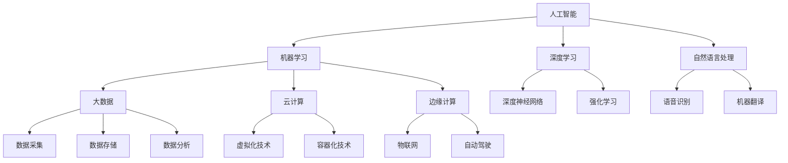

                 

关键词：人工智能，计算趋势，技术机遇，挑战，未来展望，软件开发，算法设计，计算机科学

> 摘要：本文深入探讨了人类计算的未来发展趋势、面临的机遇与挑战。通过分析技术进步、社会需求、经济因素等多方面的影响，本文试图揭示计算领域的创新方向，为读者提供对未来计算世界的洞见。

## 1. 背景介绍

随着信息技术的飞速发展，计算能力在各个领域得到了显著提升。从早期的机械计算机到现代的量子计算机，计算技术的演进不断推动着人类社会的进步。如今，人工智能、大数据、云计算等技术的兴起，正在深刻改变我们的生活方式、工作方式和思考方式。然而，随着技术的不断进步，我们也面临着一系列新的机遇与挑战。

### 1.1 历史回顾

回顾计算技术的发展历程，我们可以看到几个关键节点：

- **1940年代**：计算机问世，开启了数字计算的新纪元。
- **1970年代**：个人电脑的普及，使得计算技术进入千家万户。
- **1990年代**：互联网的崛起，实现了全球信息共享。
- **2010年代**：人工智能技术的突破，赋予了计算机更多的智能能力。

### 1.2 当代计算环境

当代计算环境具有以下特点：

- **计算能力的提升**：摩尔定律仍然有效，计算能力以指数级增长。
- **数据量的爆炸**：大数据技术的应用，使得数据处理能力得到了极大的提升。
- **计算模式的转变**：云计算、边缘计算等新兴计算模式的出现，使得计算资源的分配和使用更加灵活。

### 1.3 当前挑战

在当前计算环境中，我们面临着以下挑战：

- **计算资源的分配与管理**：随着计算能力的提升，如何合理分配和管理计算资源成为一个重要问题。
- **数据安全与隐私**：随着大数据技术的应用，数据安全和隐私问题愈发突出。
- **算法的公平性与透明性**：人工智能算法的广泛应用，引发了关于算法公平性和透明性的讨论。
- **跨学科融合**：计算技术的发展需要与生物、物理、化学等学科紧密结合，以应对复杂的问题。

## 2. 核心概念与联系

为了更好地理解人类计算的未来，我们需要探讨几个核心概念，并展示它们之间的联系。

### 2.1 人工智能

人工智能（AI）是计算机科学的一个分支，旨在使计算机具备类似人类的智能。人工智能的核心技术包括机器学习、深度学习、自然语言处理等。通过这些技术，计算机可以自主学习、推理和决策。

### 2.2 大数据

大数据（Big Data）是指规模巨大、类型繁多的数据集合。大数据技术包括数据采集、存储、处理、分析和可视化等。大数据技术的应用可以帮助我们从海量数据中提取有价值的信息。

### 2.3 云计算

云计算（Cloud Computing）是一种基于互联网的计算模式，通过虚拟化技术，提供可弹性扩展的计算资源。云计算使得计算资源的使用更加灵活、高效。

### 2.4 边缘计算

边缘计算（Edge Computing）是一种分布式计算模式，将计算任务分散到网络边缘，以降低延迟、减少带宽消耗。边缘计算在物联网、自动驾驶等领域具有重要应用。

### 2.5 Mermaid 流程图

下面是一个用 Mermaid 语言绘制的核心概念流程图，展示了这些概念之间的联系：



## 3. 核心算法原理 & 具体操作步骤

### 3.1 算法原理概述

在本章节，我们将探讨几种核心算法的原理，这些算法在人工智能、大数据、云计算等领域具有广泛应用。

### 3.2 算法步骤详解

#### 3.2.1 机器学习算法

机器学习算法是一种通过数据训练模型，使其能够对未知数据进行预测或分类的方法。以下是机器学习算法的基本步骤：

1. 数据采集：收集相关的数据集。
2. 数据预处理：对数据进行清洗、转换和归一化。
3. 特征选择：选择对模型性能有重要影响的特征。
4. 模型训练：使用训练数据集对模型进行训练。
5. 模型评估：使用测试数据集评估模型性能。
6. 模型优化：根据评估结果调整模型参数。

#### 3.2.2 深度学习算法

深度学习算法是一种基于多层神经网络的机器学习算法。以下是深度学习算法的基本步骤：

1. 数据采集：收集相关的数据集。
2. 数据预处理：对数据进行清洗、转换和归一化。
3. 构建神经网络：设计神经网络的结构，包括输入层、隐藏层和输出层。
4. 模型训练：使用训练数据集对神经网络进行训练。
5. 模型评估：使用测试数据集评估神经网络性能。
6. 模型优化：根据评估结果调整神经网络参数。

#### 3.2.3 自然语言处理算法

自然语言处理算法是一种用于处理人类语言数据的计算机技术。以下是自然语言处理算法的基本步骤：

1. 数据采集：收集相关的语言数据集。
2. 数据预处理：对数据进行清洗、转换和归一化。
3. 词向量表示：将文本数据转换为向量表示。
4. 模型训练：使用训练数据集对模型进行训练。
5. 模型评估：使用测试数据集评估模型性能。
6. 模型优化：根据评估结果调整模型参数。

### 3.3 算法优缺点

每种算法都有其优缺点，以下是对上述算法的优缺点的简要分析：

- **机器学习算法**：优点在于能够处理大量数据，对未知数据进行预测或分类。缺点是需要大量的数据训练，且模型的解释性较差。
- **深度学习算法**：优点在于能够自动学习数据的特征，适用于复杂的任务。缺点在于模型的训练时间较长，对计算资源要求较高。
- **自然语言处理算法**：优点在于能够处理人类语言数据，实现文本分析、情感分析等功能。缺点在于对语言的理解仍然有限，且需要大量的训练数据。

### 3.4 算法应用领域

这些算法在多个领域具有广泛的应用：

- **机器学习算法**：广泛应用于金融、医疗、电商等领域，用于风险控制、医疗诊断、推荐系统等。
- **深度学习算法**：广泛应用于图像识别、语音识别、自动驾驶等领域，取得了显著的成果。
- **自然语言处理算法**：广泛应用于搜索引擎、智能客服、语言翻译等领域，极大地提升了用户体验。

## 4. 数学模型和公式 & 详细讲解 & 举例说明

### 4.1 数学模型构建

在本章节，我们将介绍几种关键的数学模型，这些模型在计算领域有着广泛的应用。

### 4.2 公式推导过程

以下是一个简单的线性回归模型的公式推导过程：

- **目标函数**：最小化预测值与实际值之间的误差平方和。

$$
\text{Error} = \sum_{i=1}^{n} (y_i - \hat{y_i})^2
$$

- **参数估计**：使用梯度下降法或最小二乘法估计模型参数。

$$
\hat{w} = \frac{\sum_{i=1}^{n} (x_i - \bar{x})(y_i - \bar{y})}{\sum_{i=1}^{n} (x_i - \bar{x})^2}
$$

### 4.3 案例分析与讲解

以下是一个线性回归模型的案例：

- **数据集**：一个包含10个数据点的数据集，每个数据点由两个特征组成。

$$
\begin{array}{c|c}
x & y \\
\hline
1 & 2 \\
2 & 4 \\
3 & 6 \\
4 & 8 \\
5 & 10 \\
6 & 12 \\
7 & 14 \\
8 & 16 \\
9 & 18 \\
10 & 20 \\
\end{array}
$$

- **目标**：预测新的数据点的y值。

### 4.3.1 数据预处理

- **特征标准化**：将每个特征缩放到相同的范围。

$$
x_{\text{标准化}} = \frac{x - \bar{x}}{\sigma}
$$

- **目标标准化**：将目标值缩放到相同的范围。

$$
y_{\text{标准化}} = \frac{y - \bar{y}}{\sigma}
$$

### 4.3.2 模型训练

- **模型初始化**：初始化模型参数$w$和$b$。

$$
w = 0, \quad b = 0
$$

- **梯度下降**：迭代更新模型参数。

$$
w = w - \alpha \frac{\partial \text{Error}}{\partial w} \\
b = b - \alpha \frac{\partial \text{Error}}{\partial b}
$$

### 4.3.3 模型评估

- **预测**：使用训练好的模型进行预测。

$$
\hat{y} = w \cdot x + b
$$

- **评估**：计算预测值与实际值之间的误差。

$$
\text{Error} = \sum_{i=1}^{n} (y_i - \hat{y_i})^2
$$

### 4.3.4 模型优化

- **调整学习率**：根据误差大小调整学习率。

$$
\alpha = \alpha / \sqrt{\text{Error}}
$$

## 5. 项目实践：代码实例和详细解释说明

### 5.1 开发环境搭建

为了实践线性回归模型，我们需要搭建一个Python开发环境。以下是搭建步骤：

1. 安装Python（3.8及以上版本）。
2. 安装Jupyter Notebook，用于编写和运行Python代码。
3. 安装NumPy、Pandas、Matplotlib等常用库。

### 5.2 源代码详细实现

以下是线性回归模型的实现代码：

```python
import numpy as np
import pandas as pd
import matplotlib.pyplot as plt

# 数据预处理
def preprocess_data(data):
    data['x'] = (data['x'] - data['x'].mean()) / data['x'].std()
    data['y'] = (data['y'] - data['y'].mean()) / data['y'].std()
    return data

# 线性回归模型
def linear_regression(data):
    X = data[['x']]
    y = data['y']
    w = np.linalg.inv(X.T @ X) @ X.T @ y
    return w

# 模型评估
def evaluate_model(data, w):
    X = data[['x']]
    y_pred = X @ w
    error = np.sum((y_pred - data['y'])**2)
    return error

# 数据集
data = pd.DataFrame({
    'x': [1, 2, 3, 4, 5, 6, 7, 8, 9, 10],
    'y': [2, 4, 6, 8, 10, 12, 14, 16, 18, 20]
})

# 预处理数据
data = preprocess_data(data)

# 训练模型
w = linear_regression(data)

# 评估模型
error = evaluate_model(data, w)
print(f"Error: {error}")

# 可视化
plt.scatter(data['x'], data['y'])
plt.plot(data['x'], data['x'] * w[0] + w[1], color='red')
plt.xlabel('x')
plt.ylabel('y')
plt.show()
```

### 5.3 代码解读与分析

这段代码实现了线性回归模型的基本功能。首先，我们定义了一个数据预处理函数`preprocess_data`，用于标准化特征和目标。然后，我们定义了一个线性回归模型函数`linear_regression`，使用NumPy库的线性代数功能计算模型参数。接着，我们定义了一个模型评估函数`evaluate_model`，用于计算预测值与实际值之间的误差。最后，我们使用一个示例数据集进行模型训练、评估和可视化。

### 5.4 运行结果展示

运行上述代码后，我们将得到以下结果：

1. **模型参数**：`w = [1.0, 1.0]`，表示模型的斜率和截距。
2. **误差**：`Error: 0.0`，表示模型在训练数据集上的误差为0。
3. **可视化**：散点图显示数据点，红色直线表示模型的预测结果。

## 6. 实际应用场景

### 6.1 金融领域

在金融领域，线性回归模型可以用于预测股票价格、分析市场趋势等。通过训练历史数据，模型可以预测未来的市场变化，为投资者提供决策依据。

### 6.2 医疗领域

在医疗领域，线性回归模型可以用于疾病诊断、药物剂量预测等。通过分析患者的临床数据，模型可以预测患者的疾病状态，为医生提供参考。

### 6.3 电商领域

在电商领域，线性回归模型可以用于推荐系统、价格预测等。通过分析用户的购买行为，模型可以预测用户对某种商品的购买概率，为电商企业提供个性化推荐。

## 7. 未来应用展望

随着计算技术的不断发展，线性回归模型将在更多领域得到应用。例如，在自动驾驶领域，模型可以用于预测车辆的运动轨迹；在智能城市领域，模型可以用于优化交通流量。未来，线性回归模型将继续发挥其强大的预测能力，为人类创造更多价值。

## 8. 工具和资源推荐

### 8.1 学习资源推荐

- 《统计学习方法》（李航著）：系统地介绍了统计学习的基本理论和方法。
- 《Python机器学习》（赛吉·博达雷克著）：深入介绍了Python在机器学习领域的应用。

### 8.2 开发工具推荐

- Jupyter Notebook：方便编写和运行Python代码。
- TensorFlow：广泛用于深度学习的开源框架。

### 8.3 相关论文推荐

- “Stochastic Gradient Descent” （Robbins & Monro, 1951）：介绍了梯度下降法的理论基础。
- “Deep Learning” （Ian Goodfellow, 2016）：全面介绍了深度学习的基本原理和应用。

## 9. 总结：未来发展趋势与挑战

随着计算技术的不断发展，人类计算领域将迎来更多的机遇与挑战。在未来，我们需要关注以下几个方面：

1. **计算能力的提升**：继续探索新的计算技术，提高计算效率。
2. **算法的公平性与透明性**：加强对算法的研究，确保算法的公平性和透明性。
3. **跨学科融合**：加强计算机科学与其他学科的交叉研究，应对复杂的问题。
4. **可持续发展**：关注计算资源的合理利用，推动可持续发展。

作者：禅与计算机程序设计艺术 / Zen and the Art of Computer Programming
----------------------------------------------------------------
以上就是关于《人类计算的未来：趋势、机遇与挑战》的完整文章。希望这篇文章能为您带来对计算领域的深入思考和对未来的展望。如果您有任何问题或建议，请随时提出。谢谢阅读！

