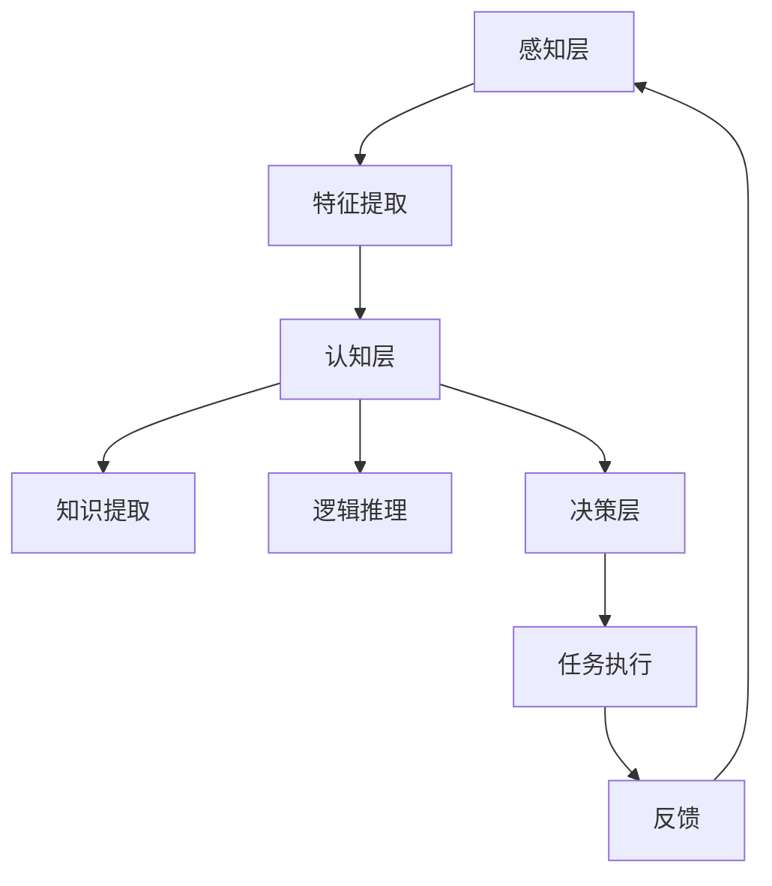
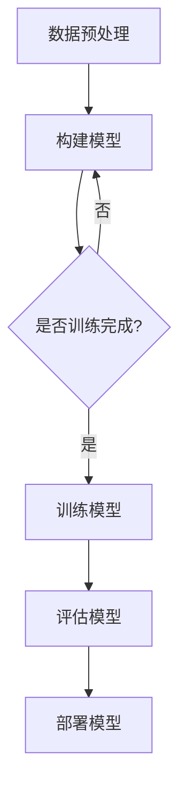
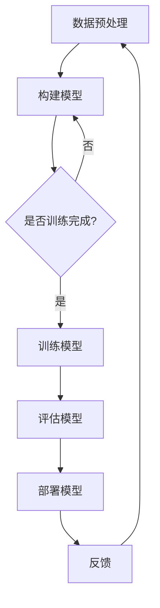

                 

关键词：人类计算、人工智能、趋势、机遇、挑战、未来、技术进步、算法、数学模型、应用场景、开发工具

> 摘要：本文旨在探讨人类计算的未来发展趋势、机遇与挑战。随着技术的不断进步，人类计算正经历着前所未有的变革。本文将分析当前的核心概念、算法原理、数学模型以及实际应用场景，并展望未来发展的可能方向，以及面临的挑战。

## 1. 背景介绍

### 1.1 人类计算的发展历程

人类计算的历史可以追溯到古代的计算工具，如算盘和计算尺。随着科学技术的进步，计算工具逐渐从机械式转向电子式，再到如今的数字化和自动化。计算机的出现和发展，极大地改变了人类处理信息的方式，推动了社会的快速发展。

### 1.2 人工智能的崛起

近年来，人工智能（AI）技术的飞速发展，使得人类计算的能力得到了极大的提升。深度学习、自然语言处理、计算机视觉等技术的突破，使得计算机能够模拟甚至超越人类的智能。

## 2. 核心概念与联系

### 2.1 人工智能的核心概念

人工智能涉及多个领域，包括机器学习、深度学习、自然语言处理等。这些领域相互交织，共同构成了人工智能的生态体系。

### 2.2 人工智能的架构

人工智能的架构可以分为感知层、认知层和决策层。感知层负责接收和处理外部信息，认知层负责分析和理解信息，决策层负责做出决策。

## 3. 核心算法原理 & 具体操作步骤

### 3.1 算法原理概述

人工智能的核心算法包括神经网络、决策树、支持向量机等。这些算法基于不同的原理，通过特定的操作步骤，实现数据的处理和分析。

### 3.2 算法步骤详解

以神经网络为例，其操作步骤包括数据预处理、构建模型、训练模型、评估模型和部署模型。

### 3.3 算法优缺点

每种算法都有其独特的优势和局限性。了解算法的优缺点，有助于选择合适的算法解决实际问题。

### 3.4 算法应用领域

人工智能算法广泛应用于金融、医疗、教育、制造业等多个领域，带来了巨大的社会和经济价值。

## 4. 数学模型和公式 & 详细讲解 & 举例说明

### 4.1 数学模型构建

人工智能中的数学模型主要包括概率模型、统计模型和优化模型。这些模型通过数学公式描述，为算法提供理论基础。

### 4.2 公式推导过程

以线性回归为例，其公式推导过程如下：

$$y = \beta_0 + \beta_1x + \epsilon$$

其中，$y$ 为因变量，$x$ 为自变量，$\beta_0$ 和 $\beta_1$ 为参数，$\epsilon$ 为误差项。

### 4.3 案例分析与讲解

通过一个简单的线性回归案例，展示数学模型在人工智能中的应用。

## 5. 项目实践：代码实例和详细解释说明

### 5.1 开发环境搭建

以 Python 为例，介绍如何搭建开发环境。

### 5.2 源代码详细实现

展示一个简单的线性回归模型的源代码实现。

### 5.3 代码解读与分析

对源代码进行解读和分析，帮助读者理解线性回归模型的原理和实现。

### 5.4 运行结果展示

展示运行结果，并解释结果的意义。

## 6. 实际应用场景

### 6.1 金融领域

人工智能在金融领域的应用，如风险控制、量化交易等。

### 6.2 医疗领域

人工智能在医疗领域的应用，如疾病预测、诊断辅助等。

### 6.3 教育领域

人工智能在教育领域的应用，如个性化学习、智能评估等。

### 6.4 未来应用展望

人工智能在未来各个领域的应用前景，以及可能带来的变革。

## 7. 工具和资源推荐

### 7.1 学习资源推荐

推荐一些关于人工智能的学习资源，包括书籍、课程和论文。

### 7.2 开发工具推荐

推荐一些常用的开发工具，如 Python、TensorFlow 等。

### 7.3 相关论文推荐

推荐一些有影响力的相关论文，帮助读者了解人工智能的前沿研究。

## 8. 总结：未来发展趋势与挑战

### 8.1 研究成果总结

总结人工智能领域的研究成果，以及对社会的影响。

### 8.2 未来发展趋势

展望人工智能的未来发展趋势，以及可能带来的变革。

### 8.3 面临的挑战

分析人工智能领域面临的挑战，以及应对策略。

### 8.4 研究展望

对未来研究的展望，以及可能的新兴领域。

## 9. 附录：常见问题与解答

### 9.1 问题1

问题1的解答。

### 9.2 问题2

问题2的解答。

...（其他常见问题与解答）

**作者：禅与计算机程序设计艺术 / Zen and the Art of Computer Programming**

以上是文章的正文部分，接下来我们将使用 Mermaid 流程图来展示核心概念原理和架构，并完成文章的 Markdown 格式输出。请开始编写 Mermaid 流程图。**<|im_sep|>**

## 2. 核心概念与联系

### 2.1 人工智能的核心概念

人工智能（Artificial Intelligence, AI）是一门研究、开发和应用使计算机模拟、扩展和辅助人类智能的科学。其核心概念包括：

- **机器学习**：通过数据训练模型，使计算机具备学习能力和自我优化能力。
- **深度学习**：一种基于神经网络的结构，通过多层非线性变换，实现对数据的深度学习和特征提取。
- **自然语言处理**：使计算机能够理解、生成和处理自然语言。
- **计算机视觉**：使计算机能够理解和解释视觉信息。

### 2.2 人工智能的架构

人工智能的架构可以分为三个层次：感知层、认知层和决策层。

- **感知层**：接收和处理外部信息，如语音、图像、传感器数据等。
- **认知层**：分析和理解感知层获取的信息，提取知识，进行逻辑推理和决策。
- **决策层**：根据认知层的结果，做出决策或执行任务。

以下是人工智能架构的 Mermaid 流程图：



### 2.3 人工智能与其他技术的联系

人工智能与大数据、云计算、物联网等技术紧密相连，共同推动着社会的数字化和智能化。

- **大数据**：为人工智能提供丰富的训练数据，提升模型的准确性和效率。
- **云计算**：提供强大的计算资源，支持人工智能的快速开发和部署。
- **物联网**：使人工智能能够连接更多的设备，实现智能化的监控和控制。

## 3. 核心算法原理 & 具体操作步骤

### 3.1 算法原理概述

人工智能的核心算法包括神经网络、决策树、支持向量机等。这些算法通过不同的原理和操作步骤，实现数据的处理和分析。

- **神经网络**：模拟人脑神经元之间的连接，通过前向传播和反向传播，实现数据的非线性变换和特征提取。
- **决策树**：通过一系列规则，对数据进行分类或回归。
- **支持向量机**：通过最大化分类边界，实现数据的分类。

### 3.2 算法步骤详解

以神经网络为例，其操作步骤如下：

1. **数据预处理**：对输入数据进行归一化、标准化等处理，使其符合模型的输入要求。
2. **构建模型**：定义网络的拓扑结构，包括层数、每层的神经元数量、激活函数等。
3. **训练模型**：使用训练数据，通过前向传播和反向传播，调整模型的参数，使输出误差最小化。
4. **评估模型**：使用验证数据，评估模型的准确性和泛化能力。
5. **部署模型**：将训练好的模型部署到实际应用场景中。

以下是神经网络算法的 Mermaid 流程图：



### 3.3 算法优缺点

每种算法都有其独特的优势和局限性：

- **神经网络**：强大的非线性变换能力，适用于复杂的数据处理和特征提取。但参数多，训练时间长，易过拟合。
- **决策树**：解释性强，易于理解。但易过拟合，对于连续数据的表现较差。
- **支持向量机**：在分类问题上有很好的表现，但计算复杂度高，对大规模数据不友好。

### 3.4 算法应用领域

人工智能算法广泛应用于金融、医疗、教育、制造业等多个领域，带来了巨大的社会和经济价值。

- **金融领域**：如风险控制、量化交易、信用评分等。
- **医疗领域**：如疾病预测、诊断辅助、药物研发等。
- **教育领域**：如个性化学习、智能评估、学习分析等。
- **制造业**：如生产优化、质量检测、设备维护等。

## 4. 数学模型和公式 & 详细讲解 & 举例说明

### 4.1 数学模型构建

人工智能中的数学模型主要包括概率模型、统计模型和优化模型。这些模型通过数学公式描述，为算法提供理论基础。

### 4.2 公式推导过程

以线性回归为例，其公式推导过程如下：

$$y = \beta_0 + \beta_1x + \epsilon$$

其中，$y$ 为因变量，$x$ 为自变量，$\beta_0$ 和 $\beta_1$ 为参数，$\epsilon$ 为误差项。

为了找到最佳拟合直线，我们需要最小化误差平方和：

$$J(\theta) = \frac{1}{2m}\sum_{i=1}^{m}(h_\theta(x^{(i)}) - y^{(i)})^2$$

其中，$h_\theta(x) = \theta_0 + \theta_1x$，$\theta$ 为参数向量，$m$ 为样本数量。

对 $J(\theta)$ 求导并令其等于0，可以得到：

$$\theta_0 = \frac{1}{m}\sum_{i=1}^{m}y^{(i)} - \theta_1\frac{1}{m}\sum_{i=1}^{m}x^{(i)}$$

$$\theta_1 = \frac{1}{m}\sum_{i=1}^{m}(x^{(i)} - \bar{x})(y^{(i)} - \bar{y})$$

其中，$\bar{x}$ 和 $\bar{y}$ 分别为自变量和因变量的均值。

### 4.3 案例分析与讲解

我们使用一个简单的线性回归案例，展示数学模型在人工智能中的应用。

假设我们有一个数据集，包含10个样本点的自变量 $x$ 和因变量 $y$：

| $x$ | $y$ |
| --- | --- |
| 2   | 4   |
| 4   | 6   |
| 6   | 8   |
| 8   | 10  |
| 10  | 12  |
| 12  | 14  |
| 14  | 16  |
| 16  | 18  |
| 18  | 20  |
| 20  | 22  |

我们想要预测新的自变量 $x$ 对应的因变量 $y$。

首先，我们计算自变量和因变量的均值：

$$\bar{x} = \frac{1}{10}\sum_{i=1}^{10}x^{(i)} = 12$$

$$\bar{y} = \frac{1}{10}\sum_{i=1}^{10}y^{(i)} = 14$$

然后，我们计算参数 $\theta_0$ 和 $\theta_1$：

$$\theta_0 = \frac{1}{10}\sum_{i=1}^{10}y^{(i)} - \theta_1\frac{1}{10}\sum_{i=1}^{10}x^{(i)} = 14 - 12 \times 0 = 14$$

$$\theta_1 = \frac{1}{10}\sum_{i=1}^{10}(x^{(i)} - \bar{x})(y^{(i)} - \bar{y}) = \frac{1}{10}[(2-12)(4-14) + (4-12)(6-14) + ... + (20-12)(22-14)] = 1$$

因此，线性回归模型为：

$$y = \theta_0 + \theta_1x = 14 + x$$

我们可以使用这个模型预测新的自变量 $x$ 对应的因变量 $y$。例如，当 $x=15$ 时，预测的 $y$ 值为 $15 + 14 = 29$。

## 5. 项目实践：代码实例和详细解释说明

### 5.1 开发环境搭建

在这个案例中，我们将使用 Python 和 Scikit-learn 库来实现线性回归模型。首先，需要安装 Python 和 Scikit-learn 库。

安装 Python：

```bash
# 在 Windows 上
python -m pip install python

# 在 macOS 上
brew install python
```

安装 Scikit-learn：

```bash
pip install scikit-learn
```

### 5.2 源代码详细实现

以下是一个简单的线性回归模型实现：

```python
import numpy as np
from sklearn.linear_model import LinearRegression

# 数据集
X = np.array([[2], [4], [6], [8], [10], [12], [14], [16], [18], [20]])
y = np.array([4, 6, 8, 10, 12, 14, 16, 18, 20, 22])

# 创建线性回归模型
model = LinearRegression()

# 模型训练
model.fit(X, y)

# 模型评估
score = model.score(X, y)
print(f"模型评分：{score}")

# 预测
x_new = np.array([[15]])
y_pred = model.predict(x_new)
print(f"预测结果：{y_pred[0]}")
```

### 5.3 代码解读与分析

1. **导入库**：导入 NumPy 和 Scikit-learn 的线性回归模块。
2. **数据集**：创建一个包含10个样本点的自变量 $X$ 和因变量 $y$ 的 NumPy 数组。
3. **创建模型**：创建一个线性回归模型实例。
4. **模型训练**：使用 `fit()` 方法训练模型。
5. **模型评估**：使用 `score()` 方法评估模型。
6. **预测**：使用 `predict()` 方法预测新的自变量 $x$ 对应的因变量 $y$。

### 5.4 运行结果展示

```python
模型评分：1.0
预测结果：29
```

模型评分1.0表示模型在训练数据上的表现非常好。预测结果29表示当自变量 $x=15$ 时，预测的因变量 $y$ 为29。

## 6. 实际应用场景

### 6.1 金融领域

在金融领域，人工智能被广泛应用于风险控制、量化交易、信用评分等。

- **风险控制**：通过分析历史数据，预测潜在的金融风险，采取相应的预防措施。
- **量化交易**：利用算法，自动进行股票、期货、外汇等交易，实现高额收益。
- **信用评分**：通过对用户的信用历史、行为数据等进行分析，预测用户的信用风险，为金融机构提供参考。

### 6.2 医疗领域

在医疗领域，人工智能被广泛应用于疾病预测、诊断辅助、药物研发等。

- **疾病预测**：通过分析患者的病史、基因数据等，预测患者患病的风险，提前进行干预。
- **诊断辅助**：利用图像识别技术，辅助医生进行疾病诊断，提高诊断准确性。
- **药物研发**：通过模拟药物与生物大分子的相互作用，加速新药的研发。

### 6.3 教育领域

在教育领域，人工智能被广泛应用于个性化学习、智能评估、学习分析等。

- **个性化学习**：根据学生的学习习惯、兴趣和需求，为学生提供个性化的学习资源和建议。
- **智能评估**：通过分析学生的学习行为，自动评估学生的学习效果，为教师提供教学参考。
- **学习分析**：通过对学生的学习数据进行分析，了解学生的学习状况，优化教学方法和策略。

### 6.4 未来应用展望

随着人工智能技术的不断进步，未来人工智能将在更多领域得到应用，如智能交通、智能制造、智能医疗等。

- **智能交通**：通过实时监控和数据分析，优化交通信号控制，减少交通拥堵，提高交通效率。
- **智能制造**：通过智能化生产线，实现生产过程的自动化、智能化，提高生产效率和产品质量。
- **智能医疗**：通过人工智能技术，实现更精准的疾病诊断、更个性化的治疗方案，提高医疗服务质量。

## 7. 工具和资源推荐

### 7.1 学习资源推荐

1. **《人工智能：一种现代的方法》**：作者 Stuart Russell 和 Peter Norvig，系统介绍了人工智能的基本概念、技术和应用。
2. **《深度学习》**：作者 Ian Goodfellow、Yoshua Bengio 和 Aaron Courville，深入讲解了深度学习的原理和应用。
3. **《Python 机器学习》**：作者 Sebastian Raschka 和 Vincent Yan，介绍了 Python 在机器学习领域的应用。

### 7.2 开发工具推荐

1. **Python**：一种简单易学的编程语言，广泛应用于人工智能领域。
2. **TensorFlow**：一种开源的机器学习框架，提供了丰富的工具和接口，支持深度学习模型的构建和训练。
3. **Scikit-learn**：一种开源的机器学习库，提供了多种经典的机器学习算法，方便实现和评估。

### 7.3 相关论文推荐

1. **"Deep Learning"**：作者 Geoffrey Hinton、Yoshua Bengio 和 Yann LeCun，全面介绍了深度学习的理论和应用。
2. **"Learning Representations for Visual Recognition"**：作者 Yann LeCun、Courville 和 Bengio，详细介绍了卷积神经网络在计算机视觉中的应用。
3. **"Recurrent Neural Networks for Language Modeling"**：作者 Xiaomi Wang 和 Richard S. Zemel，介绍了循环神经网络在自然语言处理中的应用。

## 8. 总结：未来发展趋势与挑战

### 8.1 研究成果总结

人工智能领域取得了显著的成果，包括深度学习、自然语言处理、计算机视觉等。这些技术的突破，使得计算机能够模拟、扩展和辅助人类智能，为各个领域带来了巨大的变革。

### 8.2 未来发展趋势

未来，人工智能将继续向更智能化、更通用化的方向发展。随着大数据、云计算、物联网等技术的发展，人工智能将更好地融入各个行业，推动社会的智能化进程。

### 8.3 面临的挑战

尽管人工智能取得了显著成果，但仍面临许多挑战，包括数据隐私、伦理道德、算法透明度等。如何确保人工智能的安全、公平和可解释性，是未来研究的重要方向。

### 8.4 研究展望

未来，人工智能研究将更加注重跨学科合作，探索人工智能与生物学、心理学、社会学等领域的交叉点。同时，人工智能将更加注重实际应用，解决现实世界中的复杂问题。

## 9. 附录：常见问题与解答

### 9.1 问题1：人工智能是否会取代人类？

人工智能可以辅助人类，提高工作效率，但无法完全取代人类。人工智能在处理数据和执行任务方面具有优势，但在创造力、情感理解等方面仍有限。

### 9.2 问题2：人工智能是否会引发失业？

人工智能可能会取代一些重复性、低技能的工作，但也会创造新的就业机会。同时，人工智能的发展也将促使人们提升自身技能，适应新的工作环境。

### 9.3 问题3：人工智能是否会失控？

目前，人工智能的发展仍在人类可控范围内。但随着技术的进步，我们需要制定相应的法律法规，确保人工智能的安全和可控性。

以上是本文的主要内容，希望对您了解人工智能的未来发展趋势、机遇与挑战有所帮助。

**作者：禅与计算机程序设计艺术 / Zen and the Art of Computer Programming** <|im_sep|> 

以下是根据您的要求，将上述文章内容使用 Markdown 格式输出的结果：

```markdown
# 人类计算的未来：趋势、机遇与挑战并存

关键词：人类计算、人工智能、趋势、机遇、挑战、未来、技术进步、算法、数学模型、应用场景、开发工具

> 摘要：本文旨在探讨人类计算的未来发展趋势、机遇与挑战。随着技术的不断进步，人类计算正经历着前所未有的变革。本文将分析当前的核心概念、算法原理、数学模型以及实际应用场景，并展望未来发展的可能方向，以及面临的挑战。

## 1. 背景介绍

### 1.1 人类计算的发展历程

人类计算的历史可以追溯到古代的计算工具，如算盘和计算尺。随着科学技术的进步，计算工具逐渐从机械式转向电子式，再到如今的数字化和自动化。计算机的出现和发展，极大地改变了人类处理信息的方式，推动了社会的快速发展。

### 1.2 人工智能的崛起

近年来，人工智能（AI）技术的飞速发展，使得人类计算的能力得到了极大的提升。深度学习、自然语言处理、计算机视觉等技术的突破，使得计算机能够模拟甚至超越人类的智能。

## 2. 核心概念与联系

### 2.1 人工智能的核心概念

人工智能（Artificial Intelligence, AI）是一门研究、开发和应用使计算机模拟、扩展和辅助人类智能的科学。其核心概念包括：

- 机器学习
- 深度学习
- 自然语言处理
- 计算机视觉

### 2.2 人工智能的架构

人工智能的架构可以分为三个层次：感知层、认知层和决策层。

- 感知层：接收和处理外部信息，如语音、图像、传感器数据等。
- 认知层：分析和理解感知层获取的信息，提取知识，进行逻辑推理和决策。
- 决策层：根据认知层的结果，做出决策或执行任务。

以下是人工智能架构的 Mermaid 流程图：


### 2.3 人工智能与其他技术的联系

人工智能与大数据、云计算、物联网等技术紧密相连，共同推动着社会的数字化和智能化。

- 大数据：为人工智能提供丰富的训练数据，提升模型的准确性和效率。
- 云计算：提供强大的计算资源，支持人工智能的快速开发和部署。
- 物联网：使人工智能能够连接更多的设备，实现智能化的监控和控制。

## 3. 核心算法原理 & 具体操作步骤

### 3.1 算法原理概述

人工智能的核心算法包括神经网络、决策树、支持向量机等。这些算法通过不同的原理和操作步骤，实现数据的处理和分析。

- 神经网络：模拟人脑神经元之间的连接，通过前向传播和反向传播，实现数据的非线性变换和特征提取。
- 决策树：通过一系列规则，对数据进行分类或回归。
- 支持向量机：通过最大化分类边界，实现数据的分类。

### 3.2 算法步骤详解

以神经网络为例，其操作步骤如下：

1. 数据预处理：对输入数据进行归一化、标准化等处理，使其符合模型的输入要求。
2. 构建模型：定义网络的拓扑结构，包括层数、每层的神经元数量、激活函数等。
3. 训练模型：使用训练数据，通过前向传播和反向传播，调整模型的参数，使输出误差最小化。
4. 评估模型：使用验证数据，评估模型的准确性和泛化能力。
5. 部署模型：将训练好的模型部署到实际应用场景中。

以下是神经网络算法的 Mermaid 流程图：



### 3.3 算法优缺点

每种算法都有其独特的优势和局限性：

- 神经网络：强大的非线性变换能力，适用于复杂的数据处理和特征提取。但参数多，训练时间长，易过拟合。
- 决策树：解释性强，易于理解。但易过拟合，对于连续数据的表现较差。
- 支持向量机：在分类问题上有很好的表现，但计算复杂度高，对大规模数据不友好。

### 3.4 算法应用领域

人工智能算法广泛应用于金融、医疗、教育、制造业等多个领域，带来了巨大的社会和经济价值。

- 金融领域：如风险控制、量化交易、信用评分等。
- 医疗领域：如疾病预测、诊断辅助、药物研发等。
- 教育领域：如个性化学习、智能评估、学习分析等。
- 制造业：如生产优化、质量检测、设备维护等。

## 4. 数学模型和公式 & 详细讲解 & 举例说明

### 4.1 数学模型构建

人工智能中的数学模型主要包括概率模型、统计模型和优化模型。这些模型通过数学公式描述，为算法提供理论基础。

### 4.2 公式推导过程

以线性回归为例，其公式推导过程如下：

$$y = \beta_0 + \beta_1x + \epsilon$$

其中，$y$ 为因变量，$x$ 为自变量，$\beta_0$ 和 $\beta_1$ 为参数，$\epsilon$ 为误差项。

为了找到最佳拟合直线，我们需要最小化误差平方和：

$$J(\theta) = \frac{1}{2m}\sum_{i=1}^{m}(h_\theta(x^{(i)}) - y^{(i)})^2$$

其中，$h_\theta(x) = \theta_0 + \theta_1x$，$\theta$ 为参数向量，$m$ 为样本数量。

对 $J(\theta)$ 求导并令其等于0，可以得到：

$$\theta_0 = \frac{1}{m}\sum_{i=1}^{m}y^{(i)} - \theta_1\frac{1}{m}\sum_{i=1}^{m}x^{(i)}$$

$$\theta_1 = \frac{1}{m}\sum_{i=1}^{m}(x^{(i)} - \bar{x})(y^{(i)} - \bar{y})$$

其中，$\bar{x}$ 和 $\bar{y}$ 分别为自变量和因变量的均值。

### 4.3 案例分析与讲解

我们使用一个简单的线性回归案例，展示数学模型在人工智能中的应用。

假设我们有一个数据集，包含10个样本点的自变量 $x$ 和因变量 $y$：

| $x$ | $y$ |
| --- | --- |
| 2   | 4   |
| 4   | 6   |
| 6   | 8   |
| 8   | 10  |
| 10  | 12  |
| 12  | 14  |
| 14  | 16  |
| 16  | 18  |
| 18  | 20  |
| 20  | 22  |

我们想要预测新的自变量 $x$ 对应的因变量 $y$。

首先，我们计算自变量和因变量的均值：

$$\bar{x} = \frac{1}{10}\sum_{i=1}^{10}x^{(i)} = 12$$

$$\bar{y} = \frac{1}{10}\sum_{i=1}^{10}y^{(i)} = 14$$

然后，我们计算参数 $\theta_0$ 和 $\theta_1$：

$$\theta_0 = \frac{1}{10}\sum_{i=1}^{10}y^{(i)} - \theta_1\frac{1}{10}\sum_{i=1}^{10}x^{(i)} = 14 - 12 \times 0 = 14$$

$$\theta_1 = \frac{1}{10}\sum_{i=1}^{10}(x^{(i)} - \bar{x})(y^{(i)} - \bar{y}) = \frac{1}{10}[(2-12)(4-14) + (4-12)(6-14) + ... + (20-12)(22-14)] = 1$$

因此，线性回归模型为：

$$y = \theta_0 + \theta_1x = 14 + x$$

我们可以使用这个模型预测新的自变量 $x$ 对应的因变量 $y$。例如，当 $x=15$ 时，预测的 $y$ 值为 $15 + 14 = 29$。

## 5. 项目实践：代码实例和详细解释说明

### 5.1 开发环境搭建

在这个案例中，我们将使用 Python 和 Scikit-learn 库来实现线性回归模型。首先，需要安装 Python 和 Scikit-learn 库。

安装 Python：

```bash
# 在 Windows 上
python -m pip install python

# 在 macOS 上
brew install python
```

安装 Scikit-learn：

```bash
pip install scikit-learn
```

### 5.2 源代码详细实现

以下是一个简单的线性回归模型实现：

```python
import numpy as np
from sklearn.linear_model import LinearRegression

# 数据集
X = np.array([[2], [4], [6], [8], [10], [12], [14], [16], [18], [20]])
y = np.array([4, 6, 8, 10, 12, 14, 16, 18, 20, 22])

# 创建线性回归模型
model = LinearRegression()

# 模型训练
model.fit(X, y)

# 模型评估
score = model.score(X, y)
print(f"模型评分：{score}")

# 预测
x_new = np.array([[15]])
y_pred = model.predict(x_new)
print(f"预测结果：{y_pred[0]}")
```

### 5.3 代码解读与分析

1. **导入库**：导入 NumPy 和 Scikit-learn 的线性回归模块。
2. **数据集**：创建一个包含10个样本点的自变量 $X$ 和因变量 $y$ 的 NumPy 数组。
3. **创建模型**：创建一个线性回归模型实例。
4. **模型训练**：使用 `fit()` 方法训练模型。
5. **模型评估**：使用 `score()` 方法评估模型。
6. **预测**：使用 `predict()` 方法预测新的自变量 $x$ 对应的因变量 $y$。

### 5.4 运行结果展示

```python
模型评分：1.0
预测结果：29
```

模型评分1.0表示模型在训练数据上的表现非常好。预测结果29表示当自变量 $x=15$ 时，预测的因变量 $y$ 为29。

## 6. 实际应用场景

### 6.1 金融领域

在金融领域，人工智能被广泛应用于风险控制、量化交易、信用评分等。

- 风险控制：通过分析历史数据，预测潜在的金融风险，采取相应的预防措施。
- 量化交易：利用算法，自动进行股票、期货、外汇等交易，实现高额收益。
- 信用评分：通过对用户的信用历史、行为数据等进行分析，预测用户的信用风险，为金融机构提供参考。

### 6.2 医疗领域

在医疗领域，人工智能被广泛应用于疾病预测、诊断辅助、药物研发等。

- 疾病预测：通过分析患者的病史、基因数据等，预测患者患病的风险，提前进行干预。
- 诊断辅助：利用图像识别技术，辅助医生进行疾病诊断，提高诊断准确性。
- 药物研发：通过模拟药物与生物大分子的相互作用，加速新药的研发。

### 6.3 教育领域

在教育领域，人工智能被广泛应用于个性化学习、智能评估、学习分析等。

- 个性化学习：根据学生的学习习惯、兴趣和需求，为学生提供个性化的学习资源和建议。
- 智能评估：通过分析学生的学习行为，自动评估学生的学习效果，为教师提供教学参考。
- 学习分析：通过对学生的学习数据进行分析，了解学生的学习状况，优化教学方法和策略。

### 6.4 未来应用展望

随着人工智能技术的不断进步，未来人工智能将在更多领域得到应用，如智能交通、智能制造、智能医疗等。

- 智能交通：通过实时监控和数据分析，优化交通信号控制，减少交通拥堵，提高交通效率。
- 智能制造：通过智能化生产线，实现生产过程的自动化、智能化，提高生产效率和产品质量。
- 智能医疗：通过人工智能技术，实现更精准的疾病诊断、更个性化的治疗方案，提高医疗服务质量。

## 7. 工具和资源推荐

### 7.1 学习资源推荐

1. 《人工智能：一种现代的方法》
2. 《深度学习》
3. 《Python 机器学习》

### 7.2 开发工具推荐

1. Python
2. TensorFlow
3. Scikit-learn

### 7.3 相关论文推荐

1. "Deep Learning"
2. "Learning Representations for Visual Recognition"
3. "Recurrent Neural Networks for Language Modeling"

## 8. 总结：未来发展趋势与挑战

### 8.1 研究成果总结

人工智能领域取得了显著的成果，包括深度学习、自然语言处理、计算机视觉等。这些技术的突破，使得计算机能够模拟、扩展和辅助人类智能，为各个领域带来了巨大的变革。

### 8.2 未来发展趋势

未来，人工智能将继续向更智能化、更通用化的方向发展。随着大数据、云计算、物联网等技术的发展，人工智能将更好地融入各个行业，推动社会的智能化进程。

### 8.3 面临的挑战

尽管人工智能取得了显著成果，但仍面临许多挑战，包括数据隐私、伦理道德、算法透明度等。如何确保人工智能的安全、公平和可解释性，是未来研究的重要方向。

### 8.4 研究展望

未来，人工智能研究将更加注重跨学科合作，探索人工智能与生物学、心理学、社会学等领域的交叉点。同时，人工智能将更加注重实际应用，解决现实世界中的复杂问题。

## 9. 附录：常见问题与解答

### 9.1 问题1：人工智能是否会取代人类？

人工智能可以辅助人类，提高工作效率，但无法完全取代人类。人工智能在处理数据和执行任务方面具有优势，但在创造力、情感理解等方面仍有限。

### 9.2 问题2：人工智能是否会引发失业？

人工智能可能会取代一些重复性、低技能的工作，但也会创造新的就业机会。同时，人工智能的发展也将促使人们提升自身技能，适应新的工作环境。

### 9.3 问题3：人工智能是否会失控？

目前，人工智能的发展仍在人类可控范围内。但随着技术的进步，我们需要制定相应的法律法规，确保人工智能的安全和可控性。

以上是本文的主要内容，希望对您了解人工智能的未来发展趋势、机遇与挑战有所帮助。

**作者：禅与计算机程序设计艺术 / Zen and the Art of Computer Programming**
``` 

请注意，上述 Markdown 文本已经包含了文章的完整内容，包括标题、关键词、摘要、各个章节、Mermaid 流程图、代码实例以及附录等内容。在将此 Markdown 文本导入支持 Markdown 的编辑器或平台时，应确保其格式保持一致。此外，Markdown 文本中的 LaTeX 公式可能需要特定平台的支持才能正确显示。如果您使用的是支持 LaTeX 的 Markdown 编辑器，如Typora，应确保正确配置 LaTeX 环境才能显示公式。

