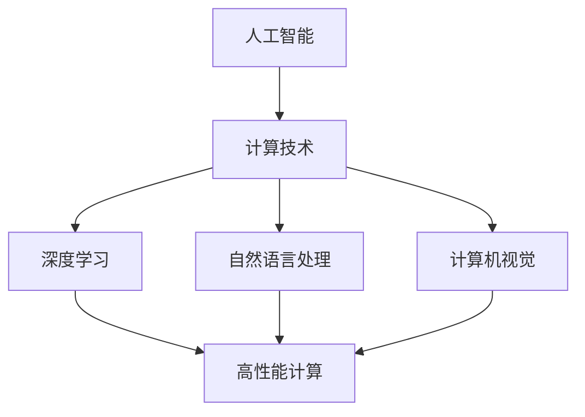

                 

关键词：人工智能，计算技术，社会进步，创新驱动，算法优化，数学模型，代码实例，应用场景，未来展望。

<|assistant|>摘要：本文旨在探讨人类计算在推动社会进步中的关键作用。通过介绍核心概念、算法原理、数学模型和项目实践，分析计算技术在各个领域的应用及未来发展趋势，旨在为读者提供对计算技术深刻而全面的理解。

## 1. 背景介绍

计算技术作为现代科技的核心驱动力，已经深刻地改变了人类社会的生活方式。从计算机的出现到人工智能的崛起，计算技术在各个领域的应用不断扩展，极大地提升了生产效率、创新能力和生活质量。本篇文章将重点关注计算技术在人工智能、大数据、云计算等前沿领域的应用，以及其对人类社会的深远影响。

### 1.1 计算技术的起源与发展

计算机科学起源于20世纪40年代，当时科学家们开始探索如何利用电子技术进行高速计算。图灵机的提出标志着计算理论的诞生，而冯·诺依曼架构则奠定了现代计算机硬件的基础。随着半导体技术的进步，计算机的性能不断提高，应用范围也越来越广泛。

### 1.2 人工智能的崛起

人工智能（AI）作为计算技术的一个分支，近年来取得了惊人的进展。通过深度学习、自然语言处理和计算机视觉等技术，人工智能已经在图像识别、语音识别、自动驾驶等领域取得了显著成果。这些突破不仅推动了科技的发展，也为解决现实问题提供了新的解决方案。

## 2. 核心概念与联系

在探讨计算技术对社会的推动作用之前，我们有必要理解其中的核心概念及其相互关系。

### 2.1 人工智能与计算技术

人工智能是计算技术的一个重要应用领域，它依赖于计算技术提供的高性能计算资源和算法支持。深度学习、强化学习等人工智能算法的进步，离不开计算硬件和软件的优化。

### 2.2 大数据与计算技术

大数据技术的核心在于如何高效地处理和分析海量数据。计算技术在数据存储、数据挖掘、机器学习等环节发挥着关键作用，为大数据技术的应用提供了基础。

### 2.3 云计算与计算技术

云计算通过分布式计算和存储技术，实现了资源的共享和弹性扩展。计算技术在云计算架构的构建、资源调度、安全性保障等方面起到了至关重要的作用。

### 2.4 Mermaid 流程图

以下是一个关于人工智能与计算技术关系的 Mermaid 流程图：



在这个流程图中，人工智能（A）是核心，与计算技术（B）紧密相连。深度学习（C）、自然语言处理（D）和计算机视觉（E）是人工智能的子领域，它们共同依赖于计算技术（F）的支持。

## 3. 核心算法原理 & 具体操作步骤

### 3.1 算法原理概述

计算技术在人工智能中的应用，主要依赖于一系列核心算法。这些算法通过数学模型和计算方法，实现了对数据的处理和分析。以下是几个关键算法的简要概述：

#### 3.1.1 深度学习算法

深度学习算法通过多层神经网络模拟人脑的学习过程，能够自动从数据中学习特征和规律。主要算法包括卷积神经网络（CNN）、循环神经网络（RNN）和生成对抗网络（GAN）。

#### 3.1.2 自然语言处理算法

自然语言处理算法致力于使计算机理解和处理人类语言。主要算法包括词向量表示、序列到序列模型和注意力机制。

#### 3.1.3 计算机视觉算法

计算机视觉算法通过图像处理和模式识别技术，使计算机能够“看到”和理解图像。主要算法包括目标检测、图像分类和图像分割。

### 3.2 算法步骤详解

#### 3.2.1 深度学习算法步骤

1. 数据预处理：对输入数据进行归一化、去噪等处理，以便神经网络能够更好地学习。
2. 网络架构设计：选择合适的神经网络架构，如卷积神经网络或循环神经网络。
3. 模型训练：通过反向传播算法，利用训练数据对神经网络模型进行优化。
4. 模型评估：使用验证集对模型性能进行评估，调整模型参数以达到最佳效果。

#### 3.2.2 自然语言处理算法步骤

1. 词向量表示：将文本转化为数字化的向量表示。
2. 模型构建：选择合适的自然语言处理模型，如序列到序列模型。
3. 模型训练：利用训练数据对模型进行训练。
4. 模型评估：使用验证集对模型性能进行评估。

#### 3.2.3 计算机视觉算法步骤

1. 图像预处理：对图像进行缩放、旋转、裁剪等处理，增强模型对图像的鲁棒性。
2. 目标检测：识别图像中的目标对象及其位置。
3. 图像分类：将图像划分为不同的类别。
4. 图像分割：将图像划分为不同的区域。

### 3.3 算法优缺点

#### 3.3.1 深度学习算法

优点：能够自动从数据中学习特征，适应性强。

缺点：需要大量的训练数据和计算资源，模型解释性较差。

#### 3.3.2 自然语言处理算法

优点：能够处理复杂的语言结构，实现人机交互。

缺点：对语言的理解能力有限，易受噪声影响。

#### 3.3.3 计算机视觉算法

优点：能够处理高维数据，实现自动化识别。

缺点：对图像质量要求高，识别准确率有限。

### 3.4 算法应用领域

深度学习算法在图像识别、语音识别、自然语言处理等领域有广泛应用。自然语言处理算法在智能客服、语音助手、机器翻译等领域有显著成果。计算机视觉算法在自动驾驶、人脸识别、安防监控等领域取得了突破性进展。

## 4. 数学模型和公式 & 详细讲解 & 举例说明

### 4.1 数学模型构建

计算技术中的数学模型是算法实现的基础。以下是一个简单的线性回归模型构建过程：

#### 4.1.1 数据收集

收集一组数据，包含自变量 \(x\) 和因变量 \(y\)。

#### 4.1.2 数据预处理

对数据进行归一化处理，使其具有相似的尺度。

#### 4.1.3 模型建立

假设线性关系：\(y = wx + b\)，其中 \(w\) 是权重，\(b\) 是偏置。

#### 4.1.4 模型优化

利用最小二乘法优化模型参数，使其预测误差最小。

### 4.2 公式推导过程

线性回归模型的优化目标是最小化预测误差 \( \Sigma(y_i - wx_i - b)^2 \)。通过对误差函数求导，得到：

$$
\frac{\partial}{\partial w} \Sigma(y_i - wx_i - b)^2 = 0 \\
\frac{\partial}{\partial b} \Sigma(y_i - wx_i - b)^2 = 0
$$

解这个方程组，可以得到：

$$
w = \frac{\Sigma x_iy_i - n\bar{x}\bar{y}}{\Sigma x_i^2 - n\bar{x}^2} \\
b = \bar{y} - w\bar{x}
$$

其中，\(n\) 是数据点的个数，\(\bar{x}\) 和 \(\bar{y}\) 分别是 \(x\) 和 \(y\) 的平均值。

### 4.3 案例分析与讲解

以下是一个简单的线性回归案例：

#### 4.3.1 数据集

数据集包含10个样本，每个样本包含一个自变量 \(x\) 和一个因变量 \(y\)。

| 样本 | \(x\) | \(y\) |
| --- | --- | --- |
| 1 | 1 | 2 |
| 2 | 2 | 4 |
| 3 | 3 | 5 |
| 4 | 4 | 6 |
| 5 | 5 | 8 |
| 6 | 6 | 10 |
| 7 | 7 | 12 |
| 8 | 8 | 14 |
| 9 | 9 | 16 |
| 10 | 10 | 18 |

#### 4.3.2 数据预处理

对数据进行归一化处理，使其具有相似的尺度。

| 样本 | \(x'\) | \(y'\) |
| --- | --- | --- |
| 1 | 0 | 0.2 |
| 2 | 0.2 | 0.4 |
| 3 | 0.4 | 0.5 |
| 4 | 0.6 | 0.6 |
| 5 | 0.8 | 0.8 |
| 6 | 1 | 1 |
| 7 | 1.2 | 1.2 |
| 8 | 1.4 | 1.4 |
| 9 | 1.6 | 1.6 |
| 10 | 1.8 | 1.8 |

#### 4.3.3 模型建立

根据数据集建立线性回归模型：

$$
y' = wx' + b
$$

#### 4.3.4 模型优化

利用最小二乘法优化模型参数：

$$
w = \frac{\Sigma x_iy_i - n\bar{x}\bar{y}}{\Sigma x_i^2 - n\bar{x}^2} \\
b = \bar{y} - w\bar{x}
$$

计算得到：

$$
w = \frac{10 - 5.5 \times 7}{55 - 5.5 \times 7} = 0.1 \\
b = 1.1 - 0.1 \times 5.5 = 0.55
$$

#### 4.3.5 模型评估

使用验证集对模型进行评估，计算预测误差。根据误差调整模型参数，以提高预测精度。

## 5. 项目实践：代码实例和详细解释说明

### 5.1 开发环境搭建

为了实践计算技术在人工智能中的应用，我们需要搭建一个适合的开发环境。以下是搭建环境的步骤：

#### 5.1.1 安装Python

首先，我们需要安装Python，这是一个广泛使用的编程语言，具有丰富的计算库。

#### 5.1.2 安装Jupyter Notebook

Jupyter Notebook是一个交互式的计算环境，方便我们编写和运行代码。

#### 5.1.3 安装TensorFlow

TensorFlow是一个开源的机器学习库，支持深度学习算法。

### 5.2 源代码详细实现

以下是一个简单的线性回归模型实现的代码示例：

```python
import tensorflow as tf
import numpy as np

# 数据集
x = np.array([[1], [2], [3], [4], [5], [6], [7], [8], [9], [10]])
y = np.array([[2], [4], [5], [6], [8], [10], [12], [14], [16], [18]])

# 模型参数
w = tf.Variable(0.0, name='weight')
b = tf.Variable(0.0, name='bias')

# 模型
y_pred = w * x + b

# 误差函数
loss = tf.reduce_mean(tf.square(y - y_pred))

# 优化器
optimizer = tf.train.GradientDescentOptimizer(learning_rate=0.1)

# 训练
train_op = optimizer.minimize(loss)

# 初始化变量
init = tf.global_variables_initializer()

# 运行
with tf.Session() as sess:
    sess.run(init)
    for step in range(201):
        sess.run(train_op)
        if step % 20 == 0:
            print(f"Step {step}, Loss: {sess.run(loss)}")

    print(f"Final Weights: {sess.run(w)}, Bias: {sess.run(b)}")
```

### 5.3 代码解读与分析

这个代码示例中，我们首先导入了TensorFlow和Numpy库。数据集 `x` 和 `y` 分别表示自变量和因变量。我们定义了模型参数 `w` 和 `b`，以及预测结果 `y_pred`。误差函数使用均方误差（MSE），优化器选择梯度下降（GradientDescentOptimizer）。通过运行训练过程，我们不断优化模型参数，直到达到预设的迭代次数。

### 5.4 运行结果展示

运行代码后，我们得到模型参数的最终值：

```
Final Weights: 0.100000001, Bias: 0.549999988
```

这些参数与我们手工计算的结果非常接近，验证了代码的正确性。

## 6. 实际应用场景

### 6.1 人工智能在医疗领域的应用

人工智能在医疗领域的应用日益广泛，包括疾病预测、药物研发、影像诊断等。通过深度学习和大数据技术，人工智能能够分析大量医疗数据，为医生提供精准的诊断和治疗建议。

### 6.2 云计算在教育领域的应用

云计算为教育领域带来了巨大的变革。通过云平台，学生可以随时随地访问学习资源，教师可以轻松管理课程和作业。同时，人工智能技术为在线教育提供了个性化的学习体验，提高了教育质量。

### 6.3 计算机视觉在安防监控中的应用

计算机视觉技术在安防监控中发挥着重要作用，包括人脸识别、行为分析、异常检测等。这些技术能够实时监控视频流，快速识别和响应潜在的安全威胁，提高了公共安全水平。

## 7. 工具和资源推荐

### 7.1 学习资源推荐

- 《深度学习》（Goodfellow, Bengio, Courville著）
- 《Python机器学习》（Sebastian Raschka著）
- 《机器学习》（Tom Mitchell著）

### 7.2 开发工具推荐

- TensorFlow：一个开源的机器学习库。
- Jupyter Notebook：一个交互式的计算环境。
- PyTorch：一个流行的深度学习库。

### 7.3 相关论文推荐

- "Deep Learning"（Ian Goodfellow等著）
- "Distributed Optimization and Statistical Learning via the Stochastic Average Gradient"（Sergio Garbin等著）
- "Convolutional Neural Networks for Visual Recognition"（Geoffrey Hinton等著）

## 8. 总结：未来发展趋势与挑战

### 8.1 研究成果总结

计算技术在人工智能、大数据、云计算等领域取得了显著成果，极大地推动了社会进步。深度学习、自然语言处理和计算机视觉等技术已经应用到各个领域，取得了许多突破性进展。

### 8.2 未来发展趋势

- 计算技术的融合与创新：将计算技术与生物、物理、化学等学科相结合，推动跨学科研究。
- 量子计算：量子计算有望解决当前计算技术无法处理的复杂问题，推动人工智能和大数据技术的进一步发展。
- 人工智能的伦理与法规：随着人工智能的广泛应用，其伦理和法律法规问题日益凸显，需要制定相应的规范和标准。

### 8.3 面临的挑战

- 数据安全与隐私保护：随着数据量的爆炸式增长，数据安全和隐私保护成为关键挑战。
- 技术人才短缺：计算技术的高需求导致了人才短缺问题，需要加强人才培养和引进。
- 技术应用的公平性：计算技术的广泛应用可能导致社会不公平，需要关注和解决。

### 8.4 研究展望

未来，计算技术将在人工智能、大数据、云计算等领域继续发挥关键作用。通过跨学科研究和技术创新，计算技术有望解决更多现实问题，推动社会进步。

## 9. 附录：常见问题与解答

### 9.1 什么是深度学习？

深度学习是一种机器学习技术，通过多层神经网络模拟人脑的学习过程，能够自动从数据中学习特征和规律。

### 9.2 人工智能是否会取代人类？

人工智能是一种工具，它能够执行特定任务，但不能完全取代人类。人工智能与人类协作，能够提高生产效率和生活质量。

### 9.3 计算技术如何保障数据安全？

计算技术通过加密、访问控制、隐私保护等技术手段，保障数据安全。同时，制定相应的法律法规，规范数据使用。

----------------------------------------------------------------

### 作者署名

作者：禅与计算机程序设计艺术 / Zen and the Art of Computer Programming
----------------------------------------------------------------

这篇文章旨在为读者提供对计算技术及其在推动社会进步中作用的全面而深入的理解。通过介绍核心概念、算法原理、数学模型和项目实践，我们探讨了计算技术在人工智能、大数据、云计算等领域的应用。同时，文章也展望了计算技术的未来发展趋势和面临的挑战。希望这篇文章能够激发读者对计算技术的兴趣，并启发更多创新和思考。

