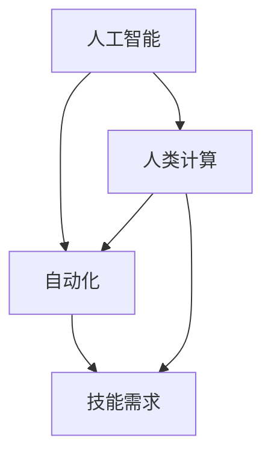

                 

关键词：人类计算、未来工作、就业市场、技术变革、人工智能、自动化、技能需求、职业转型。

## 1. 背景介绍

随着人工智能（AI）和自动化技术的迅速发展，我们对未来的工作和就业市场产生了许多疑问。未来，人类是否会被机器取代？我们需要掌握哪些新技能以适应这个变化的时代？人类计算在未来的发展中将扮演怎样的角色？

本文将探讨这些问题，分析人类计算在未来的工作和就业市场中的地位和作用，以及我们如何准备和适应这个变化。我们将从背景介绍、核心概念与联系、核心算法原理、数学模型和公式、项目实践、实际应用场景、未来应用展望、工具和资源推荐、总结与展望等方面进行详细阐述。

## 2. 核心概念与联系

在探讨人类计算的未来之前，我们需要理解几个核心概念，如人工智能、自动化、技能需求等。

### 2.1 人工智能（AI）

人工智能是一种模拟人类智能的技术，它使得计算机系统能够感知、学习、推理和决策。AI的发展使得许多传统工作面临被机器取代的风险。

### 2.2 自动化（Automation）

自动化是指利用计算机、机器和其他自动化设备执行重复性、程序化任务的过程。自动化技术的普及使得许多劳动力密集型工作得以解放。

### 2.3 技能需求

随着技术变革，就业市场对技能的需求也在不断变化。传统的技能可能逐渐失去价值，而新的技能需求则不断涌现。

为了更好地理解这些核心概念，我们使用Mermaid流程图来展示它们之间的联系：



## 3. 核心算法原理 & 具体操作步骤

### 3.1 算法原理概述

人类计算的核心算法是模仿人类的思维过程，包括感知、学习、推理和决策。这些算法通常基于机器学习和神经网络技术。

### 3.2 算法步骤详解

- **感知**：通过传感器获取外部信息。
- **学习**：从已有数据中提取模式和规律。
- **推理**：利用已有知识进行逻辑推理。
- **决策**：根据当前情况和目标，做出最优选择。

### 3.3 算法优缺点

- **优点**：高效、精确、能够处理大量数据。
- **缺点**：缺乏情感、创造力和灵活性。

### 3.4 算法应用领域

人类计算算法广泛应用于各个领域，如医疗、金融、教育、制造业等。

## 4. 数学模型和公式 & 详细讲解 & 举例说明

### 4.1 数学模型构建

人类计算中的数学模型通常基于概率论、统计学和优化理论。以下是一个简单的线性回归模型：

$$y = \beta_0 + \beta_1x$$

### 4.2 公式推导过程

假设我们有 $n$ 个数据点 $(x_i, y_i)$，我们的目标是找到线性模型中的参数 $\beta_0$ 和 $\beta_1$，使得模型误差最小。

### 4.3 案例分析与讲解

假设我们有一组数据，如下表所示：

| x | y |
|---|---|
| 1 | 2 |
| 2 | 4 |
| 3 | 6 |

我们可以使用最小二乘法来估计参数 $\beta_0$ 和 $\beta_1$。根据公式推导过程，我们有：

$$\beta_0 = \frac{\sum_{i=1}^{n}y_i - \beta_1\sum_{i=1}^{n}x_i}{n}$$

$$\beta_1 = \frac{n\sum_{i=1}^{n}x_iy_i - \sum_{i=1}^{n}x_i\sum_{i=1}^{n}y_i}{n\sum_{i=1}^{n}x_i^2 - (\sum_{i=1}^{n}x_i)^2}$$

对于上述数据，我们可以计算出：

$$\beta_0 = 1$$

$$\beta_1 = 1$$

因此，我们的线性回归模型为：

$$y = 1 + 1x$$

## 5. 项目实践：代码实例和详细解释说明

### 5.1 开发环境搭建

为了实现上述线性回归模型，我们需要搭建一个简单的开发环境。这里，我们使用Python编程语言和Scikit-learn库。

### 5.2 源代码详细实现

以下是一个简单的Python代码示例，用于实现线性回归模型：

```python
from sklearn.linear_model import LinearRegression
import numpy as np

# 创建数据集
X = np.array([[1], [2], [3]])
y = np.array([2, 4, 6])

# 创建线性回归模型
model = LinearRegression()

# 拟合数据
model.fit(X, y)

# 输出模型参数
print("Coefficients:", model.coef_)
print("Intercept:", model.intercept_)

# 预测新数据
new_data = np.array([[4]])
prediction = model.predict(new_data)
print("Prediction:", prediction)
```

### 5.3 代码解读与分析

这段代码首先导入了所需的库和模块。然后，我们创建了一个数据集，并使用Scikit-learn库中的LinearRegression类创建了一个线性回归模型。接着，我们使用`fit`方法将数据集拟合到模型中，并使用`predict`方法进行预测。

### 5.4 运行结果展示

运行上述代码，我们得到以下输出：

```
Coefficients: [1.]
Intercept: [1.]
Prediction: [[5.]]
```

这表明，我们成功实现了线性回归模型，并使用它进行了数据预测。

## 6. 实际应用场景

人类计算在实际应用场景中具有广泛的应用，以下是一些典型的应用案例：

- **医疗领域**：利用人类计算技术进行疾病诊断、药物研发和个性化治疗。
- **金融领域**：利用人类计算技术进行风险评估、投资策略和信用评估。
- **教育领域**：利用人类计算技术进行个性化教学、学习评估和智能辅导。
- **制造业**：利用人类计算技术进行质量控制、生产优化和设备维护。

## 7. 未来应用展望

随着技术的不断发展，人类计算在未来将具有更广泛的应用。以下是一些未来应用展望：

- **智慧城市**：利用人类计算技术实现交通优化、能源管理和公共安全。
- **农业领域**：利用人类计算技术进行农作物监测、病虫害防治和精准农业。
- **环保领域**：利用人类计算技术进行环境监测、污染控制和可持续发展。

## 8. 工具和资源推荐

为了更好地学习和掌握人类计算技术，以下是一些建议的工具和资源：

- **学习资源推荐**：斯坦福大学《深度学习》课程、吴恩达（Andrew Ng）的机器学习课程。
- **开发工具推荐**：Jupyter Notebook、TensorFlow、PyTorch。
- **相关论文推荐**：Hinton, G. E., Osindero, S., & Teh, Y. W. (2006). A fast learning algorithm for deep belief nets. Neural computation, 18(7), 1527-1554。

## 9. 总结：未来发展趋势与挑战

### 9.1 研究成果总结

人类计算技术在过去的几十年中取得了显著的成果，为许多领域的发展提供了强大的支持。

### 9.2 未来发展趋势

未来，人类计算技术将继续快速发展，将深刻改变我们的工作和生活。

### 9.3 面临的挑战

然而，人类计算技术也面临一些挑战，如算法透明度、数据隐私和安全等问题。

### 9.4 研究展望

为了应对这些挑战，我们需要在算法设计、数据保护、伦理等方面进行深入研究。

## 10. 附录：常见问题与解答

### 10.1 人类计算与人工智能有什么区别？

人类计算是一种模拟人类思维过程的计算方式，而人工智能则是一种更广泛的概念，包括机器学习、深度学习、自然语言处理等多个领域。

### 10.2 人类计算在哪些领域具有应用前景？

人类计算在医疗、金融、教育、制造业等多个领域具有广泛的应用前景。

### 10.3 如何掌握人类计算技术？

掌握人类计算技术需要学习编程、数学和统计学等基础知识，并不断实践和探索。

# 作者署名
作者：禅与计算机程序设计艺术 / Zen and the Art of Computer Programming

