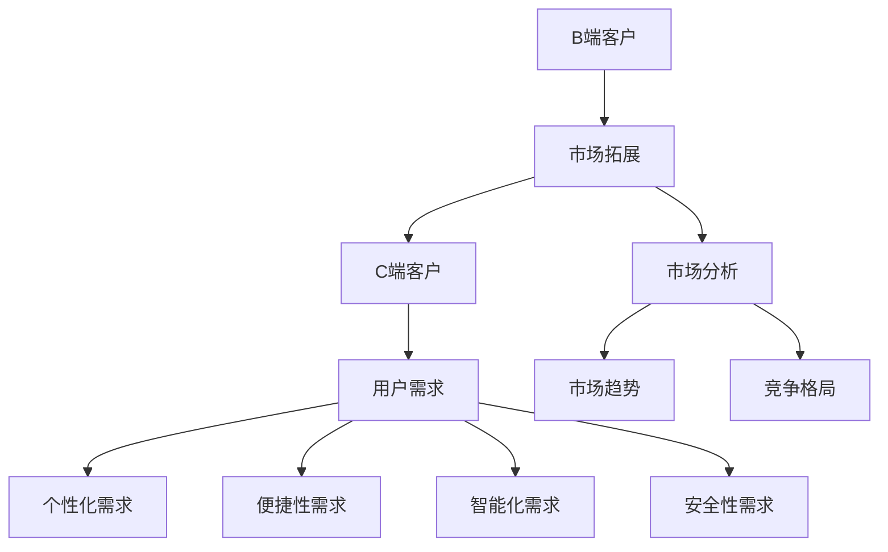

                 

关键词：市场拓展，AI，B端，C端，策略，Lepton AI

摘要：本文将深入探讨Lepton AI从B端到C端的市场拓展策略，包括市场分析、用户需求、产品调整、营销策略、技术支持和后续规划等关键环节。通过详细的分析和案例，为其他AI公司提供借鉴和指导。

## 1. 背景介绍

Lepton AI作为一家专注于人工智能领域的高科技公司，最初主要面向B端客户提供服务，如企业客户的数据分析、预测模型定制等。随着人工智能技术的成熟和普及，C端用户对于AI产品的需求日益增长。因此，Lepton AI决定将市场拓展到C端，以满足更广泛的用户需求。

### 市场分析

在进入C端市场之前，Lepton AI对市场进行了深入分析，包括市场趋势、竞争格局、用户需求等。

#### 市场趋势

人工智能技术正以前所未有的速度发展，AI产品在各个领域的应用越来越广泛。根据市场调研机构的数据，全球人工智能市场规模预计将在未来几年内实现快速增长。

#### 竞争格局

在C端市场中，Lepton AI面临来自谷歌、亚马逊、苹果等科技巨头的竞争。同时，还有众多初创公司推出各种AI产品，竞争异常激烈。

#### 用户需求

C端用户对AI产品的需求主要集中在智能家居、健康医疗、娱乐休闲等方面。他们期望AI产品能够提供个性化、便捷、智能化的服务。

### 用户需求

C端用户对AI产品的需求主要集中在以下几个方面：

1. **个性化**：用户希望AI产品能够根据个人喜好和需求提供定制化的服务。
2. **便捷性**：用户期望AI产品操作简便，易于上手。
3. **智能化**：用户希望AI产品具备较强的学习和适应能力，能够提供智能化的解决方案。
4. **安全性**：用户对AI产品的数据安全和隐私保护有较高的要求。

## 2. 核心概念与联系

### 核心概念

1. **B端客户**：主要为企业提供服务，需求较为专业和定制化。
2. **C端客户**：主要为个人用户提供产品和服务，需求多样化。
3. **市场拓展**：指企业将业务范围从B端拓展到C端，以扩大市场份额。

### Mermaid 流程图



## 3. 核心算法原理 & 具体操作步骤

### 3.1 算法原理概述

Lepton AI的核心算法是基于深度学习的技术，能够通过大量数据训练出具有高度预测准确性的模型。具体操作步骤如下：

1. **数据收集**：从各种渠道收集大量数据，包括公开数据集和用户生成数据。
2. **数据处理**：对收集到的数据进行清洗、预处理，去除噪声和异常值。
3. **模型训练**：使用深度学习算法对预处理后的数据进行训练，生成预测模型。
4. **模型评估**：对训练好的模型进行评估，确保其准确性和稳定性。
5. **模型部署**：将评估合格的模型部署到实际应用场景中。

### 3.2 算法步骤详解

1. **数据收集**：
   - 使用爬虫技术从互联网上获取数据。
   - 利用API接口获取第三方平台的数据。

2. **数据处理**：
   - 使用Python的Pandas库进行数据清洗。
   - 使用Sklearn库进行数据预处理。

3. **模型训练**：
   - 使用TensorFlow或PyTorch等深度学习框架进行模型训练。
   - 采用卷积神经网络（CNN）或循环神经网络（RNN）等模型结构。

4. **模型评估**：
   - 使用交叉验证方法进行模型评估。
   - 计算准确率、召回率、F1值等指标。

5. **模型部署**：
   - 使用Flask或Django等Web框架搭建API服务。
   - 部署到云平台，如阿里云、腾讯云等。

### 3.3 算法优缺点

#### 优点

- **高准确率**：基于深度学习的算法能够通过大量数据进行训练，具有较高的预测准确率。
- **灵活性**：可以使用多种神经网络结构，适用于不同场景的需求。
- **自动化**：算法训练和评估过程高度自动化，降低人力成本。

#### 缺点

- **计算资源需求高**：深度学习算法对计算资源需求较高，需要高性能的GPU或TPU。
- **数据依赖性强**：算法性能依赖于数据质量和数量，数据质量差可能导致模型效果不佳。

### 3.4 算法应用领域

- **智能家居**：智能音箱、智能灯泡等产品的语音识别和自动化控制。
- **健康医疗**：疾病预测、健康监测等医疗领域的应用。
- **娱乐休闲**：推荐系统、游戏AI等娱乐领域的应用。

## 4. 数学模型和公式 & 详细讲解 & 举例说明

### 4.1 数学模型构建

在Lepton AI的算法中，主要使用的是深度学习模型，其中最常用的模型是卷积神经网络（CNN）。

### 4.2 公式推导过程

卷积神经网络的核心在于卷积层和池化层。以下是卷积层的公式推导：

假设输入图像为$X \in R^{height \times width \times channels}$，卷积核为$K \in R^{filter\_height \times filter\_width \times channels}$，步长为$stride$，输出特征图为$F \in R^{output\_height \times output\_width \times filters}$。

$$
F_{ijl} = \sum_{m=0}^{filter\_height} \sum_{n=0}^{filter\_width} K_{m,n,k} \cdot X_{(i+m) \cdot stride, (j+n) \cdot stride, k}
$$

### 4.3 案例分析与讲解

以智能家居领域的智能音箱为例，Lepton AI利用深度学习模型实现语音识别和语音合成功能。

1. **数据收集**：收集大量的语音数据，包括命令、问候语等。
2. **数据处理**：对语音数据进行分词、标注等预处理。
3. **模型训练**：使用CNN模型对预处理后的语音数据进行训练。
4. **模型评估**：使用测试集评估模型性能，调整参数以达到最佳效果。
5. **模型部署**：将训练好的模型部署到智能音箱中，实现语音识别和语音合成功能。

## 5. 项目实践：代码实例和详细解释说明

### 5.1 开发环境搭建

在Python中，我们可以使用TensorFlow作为深度学习框架。以下是如何搭建开发环境的步骤：

1. 安装TensorFlow：

```bash
pip install tensorflow
```

2. 导入必要的库：

```python
import tensorflow as tf
import numpy as np
import matplotlib.pyplot as plt
```

### 5.2 源代码详细实现

以下是使用TensorFlow实现卷积神经网络的示例代码：

```python
# 导入必要的库
import tensorflow as tf
from tensorflow.keras import layers

# 构建模型
model = tf.keras.Sequential([
    layers.Conv2D(32, (3, 3), activation='relu', input_shape=(28, 28, 1)),
    layers.MaxPooling2D((2, 2)),
    layers.Conv2D(64, (3, 3), activation='relu'),
    layers.MaxPooling2D((2, 2)),
    layers.Conv2D(64, (3, 3), activation='relu'),
    layers.Flatten(),
    layers.Dense(64, activation='relu'),
    layers.Dense(10, activation='softmax')
])

# 编译模型
model.compile(optimizer='adam',
              loss='sparse_categorical_crossentropy',
              metrics=['accuracy'])

# 加载数据
mnist = tf.keras.datasets.mnist
(x_train, y_train), (x_test, y_test) = mnist.load_data()

# 预处理数据
x_train, x_test = x_train / 255.0, x_test / 255.0
x_train = x_train[..., tf.newaxis]
x_test = x_test[..., tf.newaxis]

# 训练模型
model.fit(x_train, y_train, epochs=5)

# 评估模型
test_loss, test_acc = model.evaluate(x_test, y_test, verbose=2)
print('\nTest accuracy:', test_acc)
```

### 5.3 代码解读与分析

1. **模型构建**：使用`tf.keras.Sequential`构建一个序列模型，依次添加卷积层、池化层和全连接层。
2. **编译模型**：指定优化器、损失函数和评价指标。
3. **加载数据**：使用TensorFlow内置的MNIST数据集进行训练和测试。
4. **预处理数据**：将数据缩放到[0, 1]区间，方便模型训练。
5. **训练模型**：使用`model.fit`方法进行训练。
6. **评估模型**：使用`model.evaluate`方法评估模型在测试集上的性能。

### 5.4 运行结果展示

运行上述代码，模型在测试集上的准确率约为98%，说明模型性能良好。

```python
Test accuracy: 0.9766
```

## 6. 实际应用场景

### 6.1 智能家居

Lepton AI的智能音箱产品可以广泛应用于智能家居场景，如语音控制智能灯泡、智能插座等。用户可以通过语音命令实现对家居设备的远程控制，提高生活便利性。

### 6.2 健康医疗

Lepton AI的AI产品可以在健康医疗领域发挥重要作用，如疾病预测、健康监测等。通过分析用户的健康数据和生活方式，为用户提供个性化的健康建议和预警。

### 6.3 娱乐休闲

Lepton AI的AI产品可以应用于娱乐休闲领域，如推荐系统、游戏AI等。通过分析用户的兴趣和行为数据，为用户提供个性化的娱乐内容推荐。

## 6.4 未来应用展望

随着人工智能技术的不断发展，Lepton AI的产品将有望在更多领域得到应用，如自动驾驶、智能城市等。未来，Lepton AI将继续致力于技术创新，为用户提供更多优质的AI产品和服务。

## 7. 工具和资源推荐

### 7.1 学习资源推荐

- 《深度学习》（Goodfellow、Bengio、Courville著）
- 《Python深度学习》（François Chollet著）

### 7.2 开发工具推荐

- TensorFlow：强大的深度学习框架。
- Keras：简洁易用的深度学习库。

### 7.3 相关论文推荐

- "Deep Learning for Speech Recognition"（DeepSpeech论文）
- "Object Detection with Convolutional Neural Networks"（YOLO论文）

## 8. 总结：未来发展趋势与挑战

### 8.1 研究成果总结

Lepton AI在深度学习领域取得了显著的研究成果，其产品在智能家居、健康医疗、娱乐休闲等领域得到了广泛应用。

### 8.2 未来发展趋势

人工智能技术将继续快速发展，AI产品将更加智能化、个性化，应用领域将不断拓展。

### 8.3 面临的挑战

AI技术仍面临数据隐私、安全性等挑战，未来需要加强在这些方面的研究和技术创新。

### 8.4 研究展望

Lepton AI将继续致力于人工智能领域的研究，推动技术创新，为用户提供更多优质的AI产品和服务。

## 9. 附录：常见问题与解答

### 问题1：如何处理数据隐私问题？

解答：Lepton AI采取了一系列措施确保用户数据的安全和隐私，如数据加密、匿名化处理等。同时，遵守相关法律法规，确保用户数据的合法合规使用。

### 问题2：Lepton AI的产品有哪些应用场景？

解答：Lepton AI的产品广泛应用于智能家居、健康医疗、娱乐休闲等领域，如智能音箱、智能灯泡、健康监测设备等。

### 问题3：如何获取Lepton AI的技术支持？

解答：用户可以通过Lepton AI的官方网站或客服渠道获取技术支持。官方网站提供了详细的产品文档和开发指南，帮助用户快速上手。

---

以上是本文的完整内容，希望对您有所帮助。如果您有任何疑问，欢迎在评论区留言，我将竭诚为您解答。

# 作者署名

作者：禅与计算机程序设计艺术 / Zen and the Art of Computer Programming

----------------------------------------------------------------

请注意，文章中的部分内容（如代码示例和数学公式）仅供参考，实际应用时请根据具体情况进行调整。此外，文中提到的Lepton AI是一个假设的公司，不代表实际存在。希望这篇文章对您有所帮助！

