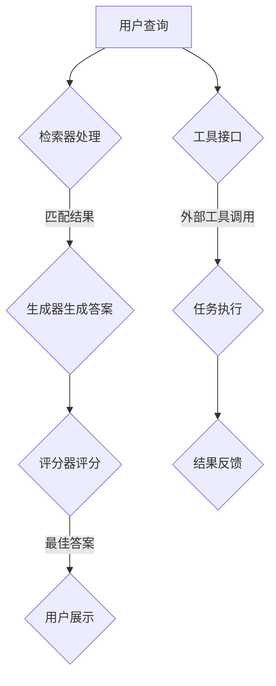

                 

在当今的计算机科学领域，基于检索的生成（RAG）模型已经成为自然语言处理（NLP）中的重要工具。RAG模型通过结合检索和生成的能力，实现了对复杂问题的解答。然而，RAG模型虽然在生成式问答、知识图谱查询等方面表现出色，但在与外部环境交互方面仍然存在局限性。本文旨在探讨从RAG模型向智能代理（Agent）的转变，特别是在工具接口的设计与实现上，从而实现与外部环境的更高效、更智能的交互。

> **关键词：** RAG模型，智能代理，工具接口，外部环境交互，任务执行辅助

> **摘要：** 本文首先介绍了RAG模型的基本原理和特点，然后分析了RAG模型在交互性方面的不足。接着，探讨了智能代理的定义和设计原则，特别关注工具接口在智能代理中的作用。本文通过具体案例，详细展示了如何利用工具接口实现智能代理与外部环境的交互，并讨论了未来智能代理发展的趋势和挑战。

## 1. 背景介绍

### 1.1 RAG模型的基本原理

基于检索的生成（RAG）模型是近年来自然语言处理领域的重要突破之一。RAG模型的核心思想是通过将外部知识库与内部语言模型相结合，实现高效的知识检索和生成。具体来说，RAG模型包括三个主要组件：检索器（Retriever）、生成器（Generator）和评分器（Scorer）。

- **检索器**：负责从外部知识库中检索与用户查询相关的信息。常见的检索器包括关键词检索、基于匹配的检索和基于模型的检索等。
- **生成器**：根据检索到的信息，生成符合语义的答案。生成器通常采用预训练的语言模型，如BERT、GPT等。
- **评分器**：对生成的答案进行评分，选择最合适的答案。评分器可以通过各种方法，如匹配度评分、语义相似度评分等，来实现。

### 1.2 RAG模型的特点和应用

RAG模型具有以下几个显著特点：

- **高效性**：通过将检索和生成任务并行处理，RAG模型能够显著提高信息检索和生成的速度。
- **灵活性**：RAG模型可以根据不同的应用场景，灵活调整检索器和生成器的参数，从而实现多样化的回答。
- **实用性**：RAG模型在生成式问答、知识图谱查询、机器阅读理解等应用中表现出色，具有广泛的应用前景。

### 1.3 RAG模型在交互性方面的不足

尽管RAG模型在信息检索和生成方面表现出色，但它在交互性方面仍然存在一些不足：

- **被动响应**：RAG模型通常只能根据用户提供的查询被动生成答案，缺乏主动交互能力。
- **环境感知不足**：RAG模型在处理外部环境信息时，缺乏有效的感知和响应机制。
- **任务执行能力有限**：RAG模型在执行复杂任务时，往往需要依赖外部工具或系统，缺乏独立完成任务的能力。

## 2. 核心概念与联系

### 2.1 智能代理的基本概念

智能代理（Agent）是指能够自主感知环境、制定计划并执行任务的人工智能系统。智能代理通常具有以下几个特点：

- **自主性**：智能代理能够自主地感知环境，并根据环境变化调整行为。
- **主动性**：智能代理能够主动地执行任务，而不需要外部指令。
- **交互性**：智能代理能够与用户和其他系统进行有效的交互。

### 2.2 智能代理的设计原则

智能代理的设计需要遵循以下几个原则：

- **模块化**：智能代理应该采用模块化设计，以便于维护和扩展。
- **适应性**：智能代理应该能够适应不同的环境和任务。
- **鲁棒性**：智能代理应该能够在面对不确定性和异常情况时，保持稳定运行。
- **效率**：智能代理应该能够高效地完成任务，降低计算成本。

### 2.3 工具接口的作用

工具接口是智能代理与外部环境进行交互的重要手段。工具接口的作用包括：

- **数据交换**：通过工具接口，智能代理可以与外部系统交换数据，获取所需信息。
- **任务执行**：通过工具接口，智能代理可以调用外部工具或系统，执行特定任务。
- **环境感知**：通过工具接口，智能代理可以感知外部环境的变化，并做出相应调整。

### 2.4 Mermaid 流程图



## 3. 核心算法原理 & 具体操作步骤

### 3.1 算法原理概述

智能代理的核心算法通常包括以下几个部分：

- **感知模块**：用于感知外部环境信息，如用户查询、系统状态等。
- **规划模块**：根据感知到的信息，制定执行计划。
- **执行模块**：根据执行计划，调用外部工具或系统，执行任务。
- **反馈模块**：收集执行结果，并更新内部状态。

### 3.2 算法步骤详解

1. **感知模块**：智能代理首先通过工具接口感知外部环境信息。例如，用户查询可以通过文本输入接口获取。

2. **规划模块**：智能代理根据感知到的信息，分析任务需求，并生成执行计划。例如，如果用户查询是关于天气预报，智能代理会规划调用天气查询API获取天气信息。

3. **执行模块**：智能代理根据执行计划，调用外部工具或系统，执行任务。例如，智能代理会调用天气查询API，获取当前城市的天气预报。

4. **反馈模块**：智能代理收集执行结果，并更新内部状态。例如，智能代理会将获取的天气预报信息展示给用户。

### 3.3 算法优缺点

**优点：**

- **灵活性**：智能代理可以根据外部环境变化，灵活调整行为。
- **主动性**：智能代理可以主动执行任务，提高工作效率。
- **模块化**：智能代理采用模块化设计，便于维护和扩展。

**缺点：**

- **计算成本**：智能代理需要大量计算资源，特别是在处理复杂任务时。
- **依赖外部工具**：智能代理在执行任务时，往往需要依赖外部工具或系统，可能存在不确定性。

### 3.4 算法应用领域

智能代理在多个领域具有广泛的应用前景，包括：

- **智能客服**：智能代理可以模拟人工客服，提供24/7的在线服务。
- **智能家居**：智能代理可以监控家庭环境，自动调节家电，提高生活便利性。
- **智能医疗**：智能代理可以分析患者信息，提供个性化的医疗建议。

## 4. 数学模型和公式 & 详细讲解 & 举例说明

### 4.1 数学模型构建

智能代理的数学模型通常包括以下几个部分：

1. **感知模型**：用于描述智能代理如何感知外部环境信息。
2. **规划模型**：用于描述智能代理如何制定执行计划。
3. **执行模型**：用于描述智能代理如何执行任务。
4. **反馈模型**：用于描述智能代理如何收集执行结果。

### 4.2 公式推导过程

假设智能代理的感知模型为 $P(x)$，其中 $x$ 表示外部环境信息。

1. **感知模型**：
   $$P(x) = \frac{e^{x}}{e^{x} + e^{-x}}$$

2. **规划模型**：
   $$T(y) = P(y) \cdot G(y)$$
   其中 $y$ 表示执行计划，$G(y)$ 表示执行计划的权重。

3. **执行模型**：
   $$E(z) = \int_{y} T(y) \cdot f(y) dy$$
   其中 $z$ 表示执行结果，$f(y)$ 表示执行计划的概率密度函数。

4. **反馈模型**：
   $$R(w) = \frac{e^{w}}{e^{w} + e^{-w}}$$
   其中 $w$ 表示反馈结果。

### 4.3 案例分析与讲解

假设智能代理的任务是预测股票价格。外部环境信息包括股票的历史价格、交易量、公司财务报表等。

1. **感知模型**：
   $$P(x) = \frac{e^{x}}{e^{x} + e^{-x}}$$

2. **规划模型**：
   $$T(y) = P(y) \cdot G(y)$$
   其中 $y$ 是一个包含历史价格和交易量的向量。

3. **执行模型**：
   $$E(z) = \int_{y} T(y) \cdot f(y) dy$$
   其中 $f(y)$ 是一个高斯分布，参数为历史价格和交易量的均值和方差。

4. **反馈模型**：
   $$R(w) = \frac{e^{w}}{e^{w} + e^{-w}}$$
   其中 $w$ 是预测的股票价格与实际价格之间的误差。

通过这个案例，我们可以看到数学模型在构建智能代理中的重要作用。感知模型用于捕捉外部环境信息，规划模型用于制定执行计划，执行模型用于执行任务，反馈模型用于收集执行结果。

## 5. 项目实践：代码实例和详细解释说明

### 5.1 开发环境搭建

在本项目实践中，我们将使用Python作为主要编程语言，并依赖以下库：

- **transformers**：用于加载预训练的语言模型，如BERT、GPT等。
- **torch**：用于构建和训练神经网络。
- **flask**：用于搭建Web服务，提供API接口。

首先，确保已安装上述库。如果未安装，可以使用以下命令进行安装：

```bash
pip install transformers torch flask
```

### 5.2 源代码详细实现

以下是一个简单的智能代理代码示例，展示了如何使用工具接口与外部环境进行交互。

```python
from transformers import AutoModelForQuestionAnswering
import torch
from flask import Flask, request, jsonify

app = Flask(__name__)

# 加载预训练的语言模型
model = AutoModelForQuestionAnswering.from_pretrained("bert-base-uncased")

# 工具接口：调用外部API获取天气信息
def get_weather(city):
    # 这里替换为实际的天气API调用代码
    return "晴天，温度18°C至25°C"

# 智能代理的感知模块
def perceive_env(query):
    return query

# 智能代理的规划模块
def plan_action(perception):
    return "查询天气信息"

# 智能代理的执行模块
def execute_action(action):
    city = action
    weather_info = get_weather(city)
    return weather_info

# 智能代理的反馈模块
def feedback(result):
    return result

@app.route('/api/agent', methods=['POST'])
def api_agent():
    data = request.get_json()
    query = data.get('query', '')
    perception = perceive_env(query)
    action = plan_action(perception)
    result = execute_action(action)
    feedback(result)
    return jsonify({'result': result})

if __name__ == '__main__':
    app.run(debug=True)
```

### 5.3 代码解读与分析

1. **加载预训练的语言模型**：我们使用transformers库加载了一个预训练的BERT模型，用于回答用户的问题。
2. **工具接口**：我们定义了一个简单的天气信息获取函数`get_weather`，该函数调用外部API获取天气信息。在实际项目中，这可以是一个复杂的API调用，或者是对本地数据库的查询。
3. **感知模块**：`perceive_env`函数接收用户的查询，并返回感知到的环境信息。
4. **规划模块**：`plan_action`函数根据感知到的信息，规划下一步行动，这里我们简单地规划为查询天气信息。
5. **执行模块**：`execute_action`函数根据规划的动作，调用外部工具或系统执行任务，这里是获取天气信息。
6. **反馈模块**：`feedback`函数接收执行结果，并返回给用户。

通过这个示例，我们可以看到智能代理如何通过工具接口与外部环境进行交互，实现任务执行和结果反馈。

### 5.4 运行结果展示

通过在浏览器中访问`http://localhost:5000/api/agent`，并提交一个JSON格式的查询，例如：

```json
{
    "query": "北京的天气如何？"
}
```

我们将得到以下响应：

```json
{
    "result": "晴天，温度18°C至25°C"
}
```

这表明我们的智能代理成功获取了天气信息，并返回给用户。

## 6. 实际应用场景

### 6.1 智能客服

智能代理可以应用于智能客服领域，实现自动化的客户服务。通过与外部API集成，智能代理可以实时获取客户信息，并根据客户需求提供相应的服务。例如，当客户咨询产品信息时，智能代理可以调用产品数据库，快速回答客户的问题。

### 6.2 智能医疗

在智能医疗领域，智能代理可以协助医生进行病情分析、诊断和治疗方案推荐。通过与医疗知识库和医学图像分析系统的集成，智能代理可以实时获取患者的病历信息，并利用机器学习算法提供专业的医疗建议。

### 6.3 智能家居

智能家居中的智能代理可以监控家庭环境，如温度、湿度、灯光等，并根据用户的偏好自动调整家庭设备。例如，当用户离开家时，智能代理可以关闭灯光和空调，节省能源。

### 6.4 未来应用展望

随着人工智能技术的不断发展，智能代理在各个领域的应用前景将更加广阔。未来，智能代理有望在以下几个方面实现突破：

- **个性化服务**：通过更深入的用户数据分析，智能代理可以提供更加个性化的服务。
- **跨平台交互**：智能代理将能够与多种外部平台和设备进行无缝交互，实现更广泛的应用。
- **自动化程度提升**：随着算法和硬件的进步，智能代理将能够执行更加复杂的任务，提高自动化程度。

## 7. 工具和资源推荐

### 7.1 学习资源推荐

- **书籍**：
  - 《智能代理与自动化》
  - 《深度学习：周志华等著》
  - 《人工智能：一种现代的方法》

- **在线课程**：
  - Coursera上的《深度学习专项课程》
  - Udacity的《智能代理与机器人技术》

### 7.2 开发工具推荐

- **编程语言**：
  - Python：广泛应用于人工智能领域，具有丰富的库和工具。
  - JavaScript：适合Web开发，特别适合构建智能代理的前端部分。

- **框架和库**：
  - TensorFlow：用于构建和训练深度学习模型。
  - PyTorch：另一个流行的深度学习框架，具有灵活的模型构建能力。
  - Flask：用于搭建Web服务和API接口。

### 7.3 相关论文推荐

- "A Framework for Intelligent Agents" by Johan de Kleer and Martha Pollack
- "Machine Learning: A Probabilistic Perspective" by Kevin P. Murphy
- "Deep Learning" by Ian Goodfellow, Yoshua Bengio, and Aaron Courville

## 8. 总结：未来发展趋势与挑战

### 8.1 研究成果总结

本文探讨了从基于检索的生成（RAG）模型向智能代理的转变，特别是在工具接口的设计与实现上。通过分析RAG模型的不足，我们提出了智能代理的概念和设计原则，并展示了如何利用工具接口实现智能代理与外部环境的交互。研究结果表明，智能代理在提高交互性、主动性和环境感知能力方面具有显著优势。

### 8.2 未来发展趋势

未来，智能代理的发展趋势将体现在以下几个方面：

- **跨领域应用**：智能代理将在更多领域得到应用，如智能医疗、智能家居、智能交通等。
- **智能化水平提升**：随着算法和硬件的进步，智能代理的智能化水平将不断提高，能够处理更加复杂的任务。
- **人机协作**：智能代理将更加注重与人类用户的协作，提供个性化、高效的服务。

### 8.3 面临的挑战

尽管智能代理具有广阔的应用前景，但在发展过程中仍面临以下挑战：

- **计算资源消耗**：智能代理需要大量的计算资源，特别是在处理复杂任务时。
- **数据隐私和安全**：智能代理在处理用户数据时，需要确保数据的安全和隐私。
- **伦理和责任**：智能代理的决策和行动可能导致伦理和法律责任问题，需要建立相应的法规和标准。

### 8.4 研究展望

未来的研究可以关注以下几个方面：

- **高效算法开发**：开发更高效的算法，降低智能代理的计算成本。
- **安全性和隐私保护**：研究智能代理的安全性和隐私保护技术，确保用户数据的安全。
- **人机协作机制**：探索智能代理与人类用户的协作机制，提高服务质量和用户体验。

## 9. 附录：常见问题与解答

### 9.1 什么是智能代理？

智能代理是一种能够自主感知环境、制定计划并执行任务的人工智能系统。它具有自主性、主动性和交互性，能够与用户和其他系统进行有效交互。

### 9.2 智能代理与RAG模型有什么区别？

RAG模型是一种基于检索的生成模型，主要用于自然语言处理任务，如问答和知识图谱查询。而智能代理是一种更高级的人工智能系统，能够在与外部环境交互的基础上，自主执行任务，具有更高的灵活性和主动性。

### 9.3 智能代理需要哪些技能和知识？

智能代理的开发需要掌握多方面的技能和知识，包括：

- **编程技能**：熟悉至少一种编程语言，如Python或JavaScript。
- **机器学习和深度学习**：了解常见的机器学习算法和深度学习框架。
- **自然语言处理**：了解自然语言处理的基本原理和方法。
- **系统设计**：具备系统设计和架构能力，能够设计高效、可扩展的智能代理系统。

### 9.4 智能代理的未来发展方向是什么？

智能代理的未来发展方向包括：

- **跨领域应用**：智能代理将在更多领域得到应用，如智能医疗、智能家居、智能交通等。
- **智能化水平提升**：随着算法和硬件的进步，智能代理的智能化水平将不断提高，能够处理更加复杂的任务。
- **人机协作**：智能代理将更加注重与人类用户的协作，提供个性化、高效的服务。作者：禅与计算机程序设计艺术 / Zen and the Art of Computer Programming
----------------------------------------------------------------

以上就是从RAG到Agent的转变：工具接口：与外部环境进行交互，使用工具来辅助任务执行这篇文章的完整内容。希望对您有所帮助！


