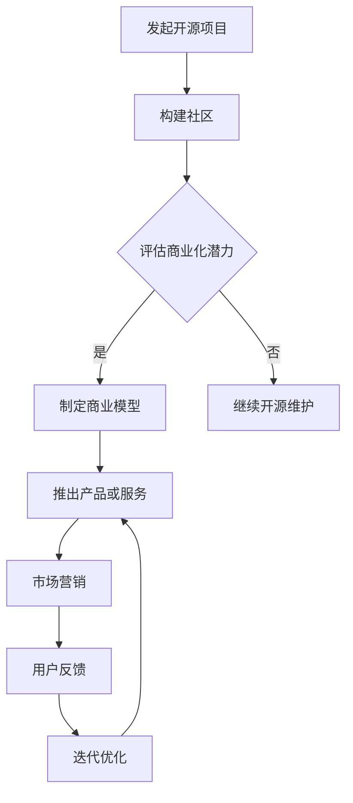

                 

关键词：开源项目、商业化、代码、策略、市场、利润、生态系统、影响力

摘要：本文旨在探讨如何将开源项目转化为商业成功。我们将分析开源项目的核心要素，探讨如何构建可持续的商业模型，同时保持项目的开放性和创新性。通过案例分析，提供实用的商业化策略，帮助开源项目实现从代码到现金的转变。

## 1. 背景介绍

开源项目已经成为现代软件开发不可或缺的一部分。它们不仅促进了技术的传播和合作，还为企业带来了巨大的创新机会。然而，尽管开源项目在技术社区中获得了广泛的认可，但许多项目仍然面临着商业化的问题。

开源项目的商业化不仅有助于项目自身的可持续发展，还能为参与者带来经济回报。这种回报不仅体现在直接的经济收益上，还体现在品牌影响力、用户忠诚度和技术生态系统的建设上。

本文将探讨以下主题：

- 开源项目的核心要素及其商业化潜力
- 构建可持续商业模型的方法
- 案例研究：成功和失败的开源项目商业化实例
- 开源项目的未来发展趋势与挑战

## 2. 核心概念与联系

### 2.1 开源项目的基本概念

开源项目通常定义为：其源代码可以被任何人自由查看、修改和分发的软件项目。这种开放性促进了社区的协作和创新，同时也带来了一系列挑战，如版权问题、质量控制和用户支持。

### 2.2 商业化与开源项目的结合

商业化与开源项目的结合指的是将开源项目转化为商业机会的过程。这通常涉及以下要素：

- **产品或服务**：基于开源项目的产品或服务。
- **用户群体**：目标市场，包括个人用户和企业用户。
- **收入来源**：例如，订阅费、定制开发、咨询服务等。
- **社区管理**：平衡开源社区的自由性和商业需求。

### 2.3 Mermaid 流程图

以下是一个简化的 Mermaid 流程图，展示了开源项目商业化的关键步骤：



## 3. 核心算法原理 & 具体操作步骤

### 3.1 算法原理概述

开源项目的商业化策略可以概括为以下几个原则：

1. **价值定位**：明确项目的市场价值，找到潜在的商业机会。
2. **社区建设**：建立一个活跃的社区，鼓励用户参与和贡献。
3. **商业模式**：设计一个可持续的商业模式，确保项目的经济回报。
4. **市场营销**：推广项目，吸引更多的用户和投资者。
5. **持续迭代**：根据用户反馈和市场变化，不断优化产品或服务。

### 3.2 算法步骤详解

1. **价值定位**
    - 研究市场需求。
    - 评估项目的优势。
    - 定义目标用户群体。

2. **社区建设**
    - 提供全面的文档。
    - 设立论坛和聊天室。
    - 组织社区活动，如会议和研讨会。

3. **商业模式**
    - 确定收入来源。
    - 设定定价策略。
    - 管理社区贡献者和商业客户的关系。

4. **市场营销**
    - 制定营销计划。
    - 利用社交媒体和在线广告。
    - 参与相关行业活动。

5. **持续迭代**
    - 监控用户反馈。
    - 定期发布更新。
    - 调整战略，以适应市场变化。

### 3.3 算法优缺点

**优点**：
- **创新性**：开源项目鼓励创新和快速迭代。
- **灵活性**：社区成员可以自由地贡献和调整代码。
- **成本效益**：用户可以通过免费使用节省开发成本。

**缺点**：
- **版权问题**：如何平衡开源精神和商业利益。
- **质量控制**：社区代码可能存在不一致和质量问题。
- **用户支持**：商业用户可能需要更专业的支持服务。

### 3.4 算法应用领域

开源项目商业化的策略适用于多种场景，包括：

- **企业软件**：例如，MySQL、Red Hat。
- **云服务**：如OpenStack、Kubernetes。
- **开源硬件**：如Arduino、Raspberry Pi。
- **平台生态系统**：如WordPress、Etsy。

## 4. 数学模型和公式 & 详细讲解 & 举例说明

### 4.1 数学模型构建

为了评估开源项目的商业化潜力，我们可以使用以下数学模型：

\[ \text{商业价值} = \text{收入} - \text{成本} + \text{品牌效应} \]

其中：
- **收入**：包括订阅费、广告收入、咨询服务等。
- **成本**：包括研发成本、运营成本、营销成本等。
- **品牌效应**：开源项目在市场上的知名度和影响力。

### 4.2 公式推导过程

为了简化，我们假设收入和成本是线性关系，并且品牌效应是一个常数。因此，我们可以推导出以下公式：

\[ \text{商业价值} = (r - c) \cdot q + b \]

其中：
- \( r \)：每单位产品的收入。
- \( c \)：每单位产品的成本。
- \( q \)：产品销售量。
- \( b \)：品牌效应的常数。

### 4.3 案例分析与讲解

假设一个开源项目的收入为每单位10美元，成本为每单位5美元，销售量为1000单位，品牌效应为10000美元。我们可以计算出：

\[ \text{商业价值} = (10 - 5) \cdot 1000 + 10000 = 5000 + 10000 = 15000 \]

这意味着该开源项目的商业价值为15000美元。

### 4.4 案例分析：Red Hat

Red Hat 是一个成功的开源企业软件案例。以下是他们的商业模型：

- **收入来源**：订阅服务、咨询和培训。
- **成本**：研发、客户支持、市场营销等。
- **品牌效应**：开源领导者的声誉。

根据公开数据，Red Hat 在2021年的收入超过了150亿美元。这表明，通过有效的商业模式和品牌建设，开源项目可以实现巨大的商业价值。

## 5. 项目实践：代码实例和详细解释说明

### 5.1 开发环境搭建

为了演示开源项目的商业化，我们将以一个简单的Web应用程序为例。以下是搭建开发环境的基本步骤：

1. 安装Python 3.8及以上版本。
2. 安装Flask框架。
3. 创建一个虚拟环境并激活。
4. 安装所需的依赖包，如Flask、Jinja2等。

### 5.2 源代码详细实现

以下是一个简单的Flask应用程序的源代码：

```python
from flask import Flask, render_template

app = Flask(__name__)

@app.route('/')
def index():
    return render_template('index.html')

if __name__ == '__main__':
    app.run(debug=True)
```

`index.html` 文件的内容：

```html
<!DOCTYPE html>
<html>
<head>
    <title>开源项目示例</title>
</head>
<body>
    <h1>欢迎来到开源项目示例！</h1>
    <p>这是一个简单的Web应用程序。</p>
</body>
</html>
```

### 5.3 代码解读与分析

这个简单的应用程序展示了如何使用Flask框架创建一个基础的Web服务器。它接收HTTP请求并返回一个HTML页面。这种类型的代码是开源项目的基础。

### 5.4 运行结果展示

通过运行这个应用程序，我们可以在浏览器中访问它，看到以下输出：

```
http://127.0.0.1:5000/
```

这将显示一个包含欢迎信息的页面。

### 5.5 商业化应用

我们可以将这个简单的Web应用程序商业化，通过以下方式：

- **定制开发**：为特定客户提供定制化的Web应用程序。
- **服务订阅**：提供基于云的Web应用程序服务，用户可以订阅。
- **培训服务**：为开发人员提供Flask框架的培训。

这些商业化的方式可以帮助我们将开源项目转化为收入。

## 6. 实际应用场景

开源项目商业化的实际应用场景非常广泛，包括但不限于以下领域：

- **企业软件**：如Red Hat的Linux发行版。
- **云计算**：如OpenStack和Kubernetes。
- **开源硬件**：如Arduino和Raspberry Pi。
- **平台生态系统**：如WordPress和Etsy。

在这些领域，成功的开源项目不仅为开发者提供了强大的工具和平台，还为商业公司带来了巨大的经济回报。

### 6.1 企业软件

企业软件是开源项目商业化的典型领域。Red Hat通过提供基于Linux的企业级解决方案，实现了巨大的商业成功。他们的商业模式包括订阅服务、定制开发和咨询服务。

### 6.2 云计算

云计算领域的开源项目，如OpenStack和Kubernetes，也取得了巨大的成功。这些项目为企业提供了灵活、可扩展的云基础设施，同时为企业带来了大量的商业机会。

### 6.3 开源硬件

开源硬件项目，如Arduino和Raspberry Pi，通过提供易于使用和可定制的硬件平台，吸引了大量的开发者和企业客户。这些项目通过硬件销售、配件销售和开发服务实现了商业化。

### 6.4 平台生态系统

平台生态系统，如WordPress和Etsy，通过提供强大的在线平台，为商家和消费者提供了便捷的交易环境。这些平台通过交易费、广告费和会员费实现了商业化。

## 7. 工具和资源推荐

为了更好地实现开源项目的商业化，以下是一些建议的工具和资源：

### 7.1 学习资源推荐

- 《开源项目如何赚钱》
- 《开源之道》
- 《产品经理手册》

### 7.2 开发工具推荐

- Git：版本控制工具。
- GitHub：代码托管平台。
- Docker：容器化工具。
- Kubernetes：容器编排工具。

### 7.3 相关论文推荐

- "Open Source Models in the Commercial Software Industry" by Chyung, Y. H., & Talbot, J. A.
- "The Economics of Open Source Software Development" by Bessen, J.
- "Commercialization of Open Source Software: A Survey of Businesses and Developers" by Zemlianski, S., & Fitzgerald, B.

## 8. 总结：未来发展趋势与挑战

开源项目商业化的未来充满了机遇和挑战。以下是对未来发展趋势和挑战的总结：

### 8.1 研究成果总结

- 开源项目在技术传播和创新方面具有巨大优势。
- 多种商业模型已成功应用于开源项目。
- 开源社区和商业需求之间的平衡是关键。

### 8.2 未来发展趋势

- **云计算和物联网**：这些领域预计将成为开源项目商业化的主要驱动力。
- **平台化**：越来越多的企业将通过开源平台实现商业化。
- **社区参与**：社区参与将更加深入，社区将成为商业成功的关键因素。

### 8.3 面临的挑战

- **版权问题**：如何平衡开源精神和商业利益。
- **质量控制**：如何确保社区代码的质量。
- **用户支持**：如何满足商业用户的专业支持需求。

### 8.4 研究展望

未来的研究应重点关注如何更好地平衡开源社区的自由性和商业需求，以及如何通过技术创新实现开源项目的商业化。

## 9. 附录：常见问题与解答

### Q：开源项目的商业化是否会损害社区？

A：不完全是这样。关键在于如何平衡开源精神和商业需求。成功的商业化可以提供资源，支持项目的长期发展，同时保持社区的开放性和创新性。

### Q：开源项目的商业化需要多少时间才能实现盈利？

A：这取决于多种因素，包括项目的市场潜力、商业模式的可行性、团队的能力等。一些项目可能在短期内实现盈利，而其他项目可能需要更长的时间。

### Q：如何确保开源项目在商业化过程中保持高质量？

A：通过严格的代码审查、定期发布更新和社区参与。确保项目代码的质量和可靠性是商业化成功的关键。

作者：禅与计算机程序设计艺术 / Zen and the Art of Computer Programming

