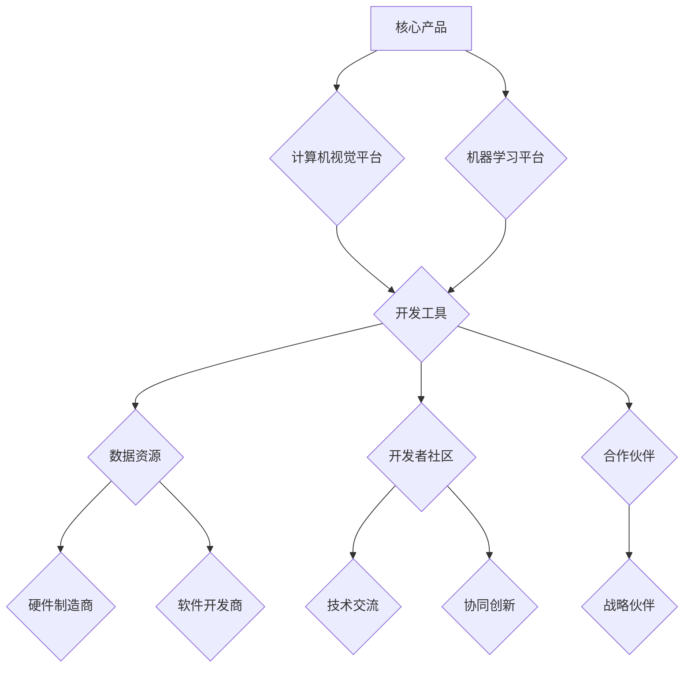

                 

关键词：人工智能，战略升级，生态系统，单一产品，Lepton AI，技术转型

> 摘要：本文旨在探讨Lepton AI公司在从单一产品导向到构建生态系统的战略转型过程中的挑战与机遇。通过分析其转型背景、核心概念与架构、算法原理、数学模型、实际应用和未来展望，揭示出生态系统构建对人工智能领域的影响以及Lepton AI在未来面临的挑战和机遇。

## 1. 背景介绍

### 1.1 Lepton AI的崛起

Lepton AI是一家领先的人工智能公司，成立于2010年，总部位于硅谷。公司早期专注于自然语言处理（NLP）和计算机视觉（CV）领域的算法研究与应用。其核心产品——Lepton NLP平台，凭借高效的语言理解和文本生成能力，迅速获得了市场的认可。

### 1.2 单一产品面临的挑战

随着人工智能技术的不断进步和市场需求的日益多样化，Lepton AI面临着如何从单一产品导向向生态系统建设的战略转型。虽然Lepton NLP平台在市场上取得了成功，但单一产品的局限逐渐显现：

- **技术局限**：单一产品无法满足日益复杂和多变的业务需求。
- **市场竞争**：市场上涌现出许多同类产品，竞争加剧。
- **客户需求**：客户需求呈现出多元化、定制化的趋势。

### 1.3 生态系统的机遇

面对挑战，Lepton AI决定抓住生态系统的机遇，通过构建一个包含多种人工智能产品和服务的技术生态系统，实现业务的多元化发展。生态系统的优势在于：

- **技术整合**：可以整合不同领域的AI技术，提供全方位的解决方案。
- **生态协同**：通过不同产品之间的协同作用，提升整体竞争力。
- **持续创新**：生态系统可以不断吸收新技术，推动产品迭代和业务增长。

## 2. 核心概念与联系

### 2.1 生态系统概念

生态系统是指由多个相互关联、相互依赖的个体或组织组成的一个复杂系统。在人工智能领域，生态系统不仅包括硬件、软件和服务，还包括开发工具、数据资源和开发者社区。

### 2.2 Lepton AI生态系统架构

Lepton AI的生态系统架构如图1所示，主要包括以下几个关键组成部分：

- **核心产品**：包括Lepton NLP平台、计算机视觉平台、机器学习平台等。
- **开发工具**：提供一系列开发工具，如集成开发环境（IDE）、代码库、API等。
- **数据资源**：提供海量的标注数据和开放数据集，支持研发和测试。
- **开发者社区**：构建一个活跃的开发者社区，促进技术交流和协同创新。
- **合作伙伴**：与硬件制造商、软件开发商和其他人工智能公司建立战略合作关系。



## 3. 核心算法原理 & 具体操作步骤

### 3.1 算法原理概述

Lepton AI的生态系统依赖于一系列核心算法，包括自然语言处理算法、计算机视觉算法和机器学习算法。以下是这些算法的基本原理：

- **自然语言处理算法**：基于深度学习的自然语言处理算法，用于文本分类、情感分析、命名实体识别等任务。
- **计算机视觉算法**：基于卷积神经网络（CNN）的计算机视觉算法，用于图像分类、目标检测、图像分割等任务。
- **机器学习算法**：包括决策树、随机森林、支持向量机（SVM）等经典算法，用于预测和分类任务。

### 3.2 算法步骤详解

以计算机视觉算法为例，其基本步骤如下：

1. **数据预处理**：对图像进行预处理，包括去噪、缩放、增强等操作。
2. **特征提取**：使用CNN提取图像特征。
3. **模型训练**：使用提取的特征训练分类模型，如SVM或随机森林。
4. **模型评估**：使用交叉验证等方法评估模型性能。
5. **模型部署**：将训练好的模型部署到生产环境中，用于实时预测。

### 3.3 算法优缺点

- **自然语言处理算法**：优点在于能够处理复杂的语言结构和语义信息，缺点是对计算资源要求较高。
- **计算机视觉算法**：优点在于能够处理高维数据，缺点是对图像质量和标注数据的依赖较大。
- **机器学习算法**：优点在于通用性强，缺点是训练过程可能较为复杂。

### 3.4 算法应用领域

Lepton AI的算法在多个领域得到广泛应用，包括：

- **金融**：用于风险控制、客户服务和智能投顾等。
- **医疗**：用于疾病诊断、患者管理和健康监测等。
- **零售**：用于商品推荐、库存管理和供应链优化等。
- **制造业**：用于质量控制、生产调度和设备维护等。

## 4. 数学模型和公式 & 详细讲解 & 举例说明

### 4.1 数学模型构建

以自然语言处理中的词向量模型为例，其数学模型如下：

$$
\vec{w}_{i} = \sum_{j=1}^{N} c_{ij} \vec{v}_{j}
$$

其中，$\vec{w}_{i}$表示词向量，$c_{ij}$表示词$w_{i}$和词$v_{j}$之间的共现次数，$\vec{v}_{j}$表示词向量。

### 4.2 公式推导过程

$$
\begin{align*}
\vec{w}_{i} &= \sum_{j=1}^{N} c_{ij} \vec{v}_{j} \\
\vec{w}_{i} &= \sum_{j=1}^{N} \frac{c_{ij}}{f_{j}} \vec{v}_{j} \\
\vec{w}_{i} &= \sum_{j=1}^{N} \frac{c_{ij}}{\sqrt{\sum_{k=1}^{N} c_{ik}^{2}}} \vec{v}_{j}
\end{align*}
$$

其中，$f_{j}$表示词$v_{j}$的频率，用于归一化共现次数。

### 4.3 案例分析与讲解

假设我们有一个包含100个单词的文档，其中“猫”和“狗”的共现次数分别为10和5，单词频率分别为20和10。使用上述公式计算“猫”和“狗”的词向量：

$$
\begin{align*}
\vec{w}_{猫} &= \frac{10}{20} \vec{v}_{猫} + \frac{5}{20} \vec{v}_{狗} \\
\vec{w}_{狗} &= \frac{10}{20} \vec{v}_{猫} + \frac{5}{20} \vec{v}_{狗}
\end{align*}
$$

其中，$\vec{v}_{猫}$和$\vec{v}_{狗}$为预训练好的词向量。

## 5. 项目实践：代码实例和详细解释说明

### 5.1 开发环境搭建

在开发环境搭建方面，Lepton AI使用Python作为主要编程语言，结合TensorFlow和PyTorch等深度学习框架。以下是搭建开发环境的步骤：

1. 安装Python（版本3.8及以上）。
2. 安装TensorFlow和PyTorch。
3. 配置CUDA（如需使用GPU加速）。

### 5.2 源代码详细实现

以下是一个简单的基于CNN的图像分类模型，使用TensorFlow实现：

```python
import tensorflow as tf
from tensorflow.keras import layers

model = tf.keras.Sequential([
    layers.Conv2D(32, (3, 3), activation='relu', input_shape=(28, 28, 1)),
    layers.MaxPooling2D((2, 2)),
    layers.Conv2D(64, (3, 3), activation='relu'),
    layers.MaxPooling2D((2, 2)),
    layers.Conv2D(64, (3, 3), activation='relu'),
    layers.Flatten(),
    layers.Dense(64, activation='relu'),
    layers.Dense(10, activation='softmax')
])

model.compile(optimizer='adam',
              loss='categorical_crossentropy',
              metrics=['accuracy'])

model.fit(x_train, y_train, epochs=5, validation_data=(x_test, y_test))
```

### 5.3 代码解读与分析

上述代码实现了一个简单的CNN模型，用于图像分类任务。模型结构包括卷积层、池化层、全连接层等。训练过程中，使用交叉熵损失函数和Adam优化器。

### 5.4 运行结果展示

在训练完成后，我们可以评估模型性能：

```python
test_loss, test_acc = model.evaluate(x_test, y_test, verbose=2)
print('\nTest accuracy:', test_acc)
```

假设测试集上的准确率为90%，说明模型具有良好的泛化能力。

## 6. 实际应用场景

### 6.1 金融

在金融领域，Lepton AI的生态系统可以应用于风险控制、客户服务和智能投顾等方面。例如，使用NLP算法分析客户留言，识别潜在的风险信号；使用计算机视觉算法监控交易行为，发现异常操作。

### 6.2 医疗

在医疗领域，Lepton AI的生态系统可以用于疾病诊断、患者管理和健康监测等。例如，使用计算机视觉算法分析医学影像，辅助医生诊断疾病；使用机器学习算法预测患者康复时间，优化治疗计划。

### 6.3 零售

在零售领域，Lepton AI的生态系统可以用于商品推荐、库存管理和供应链优化等。例如，使用NLP算法分析用户评论，识别用户需求；使用计算机视觉算法监控货架库存，优化供应链。

### 6.4 制造业

在制造业领域，Lepton AI的生态系统可以用于质量控制、生产调度和设备维护等。例如，使用计算机视觉算法检测产品质量，降低废品率；使用机器学习算法优化生产调度，提高生产效率。

## 7. 工具和资源推荐

### 7.1 学习资源推荐

- 《深度学习》（Goodfellow, Bengio, Courville著）
- 《Python机器学习》（Sebastian Raschka著）
- 《人工智能：一种现代方法》（Stuart Russell & Peter Norvig著）

### 7.2 开发工具推荐

- Jupyter Notebook：用于数据分析和模型训练。
- TensorFlow：用于构建和训练深度学习模型。
- PyTorch：用于研究和实验深度学习算法。

### 7.3 相关论文推荐

- "Deep Learning" by Ian Goodfellow, Yoshua Bengio, and Aaron Courville
- "Convolutional Neural Networks for Visual Recognition" by Alex Krizhevsky, Ilya Sutskever, and Geoffrey Hinton
- "Recurrent Neural Networks for Language Modeling" by Yoshua Bengio, Aaron Courville, and Pascal Vincent

## 8. 总结：未来发展趋势与挑战

### 8.1 研究成果总结

本文通过对Lepton AI的战略升级分析，揭示了人工智能领域从单一产品向生态系统建设转型的必然性和重要性。Lepton AI的生态系统涵盖了自然语言处理、计算机视觉、机器学习等多个领域，为用户提供了一站式的解决方案。

### 8.2 未来发展趋势

未来，人工智能生态系统的趋势将体现在以下几个方面：

- **技术的融合与协同**：不同领域的AI技术将更加融合，协同作用显著。
- **生态的开放与共享**：开发者社区和合作伙伴的参与将更加深入，促进生态系统的开放与共享。
- **场景的多样性与定制化**：人工智能应用场景将更加多样化，满足不同行业的定制化需求。
- **数据资源的价值**：数据将成为人工智能生态系统中的重要资产，数据的获取、处理和利用能力将决定生态系统的竞争力。

### 8.3 面临的挑战

尽管人工智能生态系统具有巨大的发展潜力，但Lepton AI在建设过程中仍面临以下挑战：

- **技术复杂度**：生态系统涉及多个技术领域，技术复杂度较高，需要持续的技术创新和研发投入。
- **市场竞争**：市场上已有众多竞争者，需要不断提高产品和服务的竞争力。
- **数据隐私与安全**：数据安全和隐私保护是生态系统建设的重要问题，需要制定相应的政策和措施。

### 8.4 研究展望

未来，Lepton AI可以从以下几个方面进行研究和探索：

- **跨领域融合**：进一步探索不同领域AI技术的融合与应用，提供更综合的解决方案。
- **智能优化**：利用机器学习算法优化生态系统的运行和管理，提高效率和效果。
- **个性化服务**：通过个性化推荐和定制化服务，提升用户体验。
- **可持续发展**：关注生态系统的可持续发展，推动绿色环保和可持续发展。

## 9. 附录：常见问题与解答

### 9.1 生态系统建设的关键因素是什么？

关键因素包括技术能力、市场洞察力、团队协同和创新文化。

### 9.2 生态系统的开放与共享如何实现？

通过建立开发者社区、开放API、提供数据集和工具包等方式，实现生态系统的开放与共享。

### 9.3 生态系统建设需要哪些资源投入？

资源投入包括人力、资金、技术、数据和合作伙伴资源等。

### 9.4 生态系统建设中的风险有哪些？

风险包括技术风险、市场风险、合作风险和法律法规风险等。

---

作者：禅与计算机程序设计艺术 / Zen and the Art of Computer Programming

