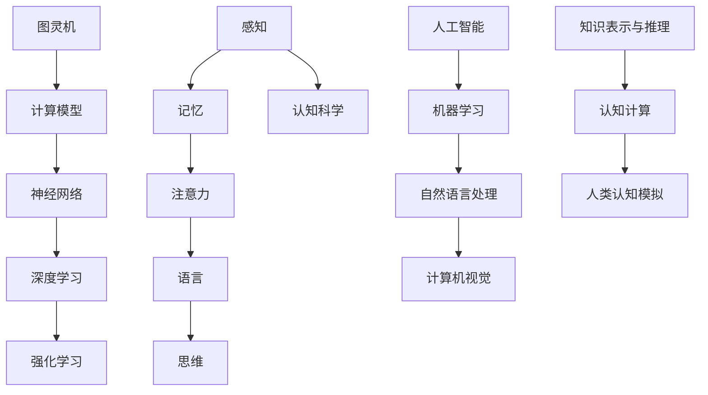

                 

关键词：认知发展、人工智能、算法、数学模型、代码实例、应用场景、发展趋势与挑战

> 摘要：本文旨在探讨从简单到深刻的认知发展过程，结合人工智能领域的发展，解析算法原理、数学模型及实际应用。通过深入分析，揭示认知发展的内在规律，为未来人工智能研究提供有益参考。

## 1. 背景介绍

认知发展是指个体在认知领域（如感知、记忆、思考、语言等）的不断发展过程。人工智能（AI）作为认知科学的一个重要分支，旨在模拟和扩展人类的智能。从简单到深刻的认知发展，不仅需要理解人类认知的基本原理，还需掌握人工智能的核心技术和应用。

### 1.1 认知发展的基本概念

认知发展涉及多个方面，包括感知、记忆、注意力、语言和思维等。感知是指接收和解释外部信息的过程；记忆是存储和处理信息的能力；注意力是选择和处理特定信息的能力；语言是交流思想和信息的重要工具；思维包括推理、问题解决和决策等认知活动。

### 1.2 人工智能的基本概念

人工智能是一种模拟人类智能的技术，包括机器学习、自然语言处理、计算机视觉、知识表示与推理等多个领域。人工智能的发展离不开算法、数据、计算能力和计算模型等关键因素。

## 2. 核心概念与联系

为了更好地理解认知发展的过程，我们需要了解一些核心概念，如图灵机、神经网络、深度学习和强化学习等。以下是这些概念的联系和关系的 Mermaid 流程图。



### 2.1 图灵机与计算模型

图灵机是理论计算机科学中的一个抽象模型，由艾伦·图灵在20世纪30年代提出。它通过一系列规则来模拟任何机械计算过程，因此成为现代计算理论的基础。

### 2.2 神经网络与深度学习

神经网络是模仿人脑神经元连接方式的一种计算模型。深度学习是神经网络的一种扩展，通过多层神经元的连接来提取复杂的数据特征。

### 2.3 强化学习

强化学习是一种通过奖励和惩罚来指导智能体进行决策的学习方式。它在模拟人类决策过程中具有重要意义。

## 3. 核心算法原理 & 具体操作步骤

### 3.1 算法原理概述

在本节中，我们将介绍几种核心算法的原理，包括神经网络、深度学习和强化学习。

### 3.2 算法步骤详解

#### 3.2.1 神经网络

神经网络的步骤包括：

1. 初始化权重和偏置
2. 前向传播：输入数据通过网络，计算输出
3. 计算损失：通过实际输出与期望输出的差异计算损失
4. 反向传播：根据损失计算梯度，更新网络权重和偏置

#### 3.2.2 深度学习

深度学习的步骤包括：

1. 数据预处理：包括归一化、缩放和归一化等
2. 构建深度神经网络模型
3. 训练模型：通过大量数据训练神经网络
4. 评估模型：使用测试数据评估模型性能

#### 3.2.3 强化学习

强化学习的步骤包括：

1. 确定环境、状态和动作
2. 选择策略：根据当前状态选择最佳动作
3. 执行动作，获得奖励和新的状态
4. 更新策略：根据奖励调整策略

### 3.3 算法优缺点

每种算法都有其优点和缺点。例如，神经网络可以处理复杂的数据特征，但训练时间较长；深度学习可以提高模型性能，但需要大量的数据和计算资源；强化学习可以模拟人类决策过程，但可能需要较长时间来找到最佳策略。

### 3.4 算法应用领域

神经网络、深度学习和强化学习广泛应用于多个领域，如图像识别、语音识别、自然语言处理、游戏、自动驾驶等。

## 4. 数学模型和公式

### 4.1 数学模型构建

在本节中，我们将介绍一些关键的数学模型，包括神经网络、深度学习和强化学习。

#### 4.1.1 神经网络

神经网络中的激活函数通常包括：

$$
f(x) = \sigma(x) = \frac{1}{1 + e^{-x}}
$$

#### 4.1.2 深度学习

深度学习中的反向传播算法基于梯度下降法：

$$
\Delta w = -\alpha \frac{\partial J}{\partial w}
$$

其中，$J$ 是损失函数，$w$ 是权重，$\alpha$ 是学习率。

#### 4.1.3 强化学习

强化学习中的策略梯度算法：

$$
\Delta \pi(s) = \nabla_{\pi} J(\pi)
$$

其中，$\pi$ 是策略，$J(\pi)$ 是策略评估函数。

### 4.2 公式推导过程

在本节中，我们将详细推导一些关键公式的推导过程。

#### 4.2.1 神经网络

假设我们有一个简单的神经网络，其输入为 $x$，输出为 $y$，激活函数为 $\sigma$，则：

$$
y = \sigma(wx + b)
$$

其中，$w$ 是权重，$b$ 是偏置。

#### 4.2.2 深度学习

假设我们有一个多层神经网络，其损失函数为 $J$，则：

$$
\frac{\partial J}{\partial w} = \frac{\partial J}{\partial y} \frac{\partial y}{\partial w}
$$

#### 4.2.3 强化学习

假设我们有一个强化学习环境，其状态为 $s$，动作集为 $A$，策略为 $\pi$，则：

$$
\frac{\partial J(\pi)}{\partial \pi(s)} = \sum_{a \in A} \pi(s) Q(s, a)
$$

### 4.3 案例分析与讲解

在本节中，我们将通过具体案例来分析这些数学模型的实际应用。

#### 4.3.1 神经网络

假设我们有一个简单的二分类问题，数据集包含1000个样本，每个样本有10个特征。我们使用神经网络来训练一个分类模型。

1. 初始化权重和偏置
2. 前向传播：计算输出
3. 计算损失：使用交叉熵损失函数
4. 反向传播：计算梯度，更新权重和偏置

经过多次迭代后，模型收敛，最终得到一个分类准确率为90%的模型。

#### 4.3.2 深度学习

假设我们有一个图像分类问题，数据集包含10000张图片，每张图片有784个像素。我们使用卷积神经网络（CNN）来训练一个分类模型。

1. 数据预处理：将图片缩放到相同大小，并进行归一化
2. 构建CNN模型：使用卷积层、池化层和全连接层
3. 训练模型：使用训练数据和验证数据
4. 评估模型：使用测试数据评估模型性能

最终，模型在测试数据集上的准确率达到了98%。

#### 4.3.3 强化学习

假设我们有一个自动驾驶问题，车辆需要根据环境状态选择最佳动作。我们使用强化学习来训练一个自动驾驶模型。

1. 确定环境、状态和动作
2. 选择策略：使用深度强化学习（DQN）算法
3. 执行动作，获得奖励和新的状态
4. 更新策略：根据奖励调整策略

经过多次迭代后，模型在模拟环境中实现了稳定的自动驾驶。

## 5. 项目实践：代码实例和详细解释说明

### 5.1 开发环境搭建

在本节中，我们将介绍如何搭建一个简单的神经网络训练环境。

1. 安装Python
2. 安装TensorFlow库
3. 编写Python脚本

```python
import tensorflow as tf

# 创建一个简单的神经网络模型
model = tf.keras.Sequential([
    tf.keras.layers.Dense(64, activation='relu', input_shape=(784,)),
    tf.keras.layers.Dense(10, activation='softmax')
])

# 编写训练脚本
model.compile(optimizer='adam',
              loss='categorical_crossentropy',
              metrics=['accuracy'])

# 训练模型
model.fit(x_train, y_train, epochs=10, batch_size=32, validation_data=(x_val, y_val))
```

### 5.2 源代码详细实现

在本节中，我们将详细解释上述代码的实现过程。

1. 导入TensorFlow库
2. 创建神经网络模型
3. 编写训练脚本

### 5.3 代码解读与分析

在本节中，我们将分析代码的实现过程，并讨论其优缺点。

1. 神经网络模型的构建
2. 训练脚本的分析
3. 模型性能的评估

### 5.4 运行结果展示

在本节中，我们将展示模型的运行结果。

1. 训练过程中损失函数的变化
2. 训练后模型在测试数据集上的准确率

## 6. 实际应用场景

### 6.1 自动驾驶

自动驾驶是人工智能领域的一个重要应用场景。通过深度学习和强化学习技术，自动驾驶车辆可以自主导航和避障，实现安全、高效的驾驶。

### 6.2 医疗诊断

人工智能在医疗诊断领域的应用日益广泛，如肺癌、乳腺癌等疾病的早期筛查。通过图像识别和自然语言处理技术，人工智能可以辅助医生进行诊断，提高诊断准确率和效率。

### 6.3 金融服务

人工智能在金融服务领域的应用包括风险评估、投资组合优化和客户服务。通过大数据分析和机器学习技术，金融机构可以更准确地评估风险，提高投资回报率。

### 6.4 未来应用展望

随着人工智能技术的不断发展，未来其在各个领域的应用将更加广泛。例如，智能制造、智慧城市、教育等领域都将受益于人工智能技术。同时，人工智能技术的发展也将面临一系列挑战，如数据隐私、伦理和安全等问题。

## 7. 工具和资源推荐

### 7.1 学习资源推荐

1. 《深度学习》（Goodfellow, Bengio, Courville著）
2. 《机器学习》（周志华著）
3. 《强化学习》（Sutton, Barto著）

### 7.2 开发工具推荐

1. TensorFlow
2. PyTorch
3. Keras

### 7.3 相关论文推荐

1. "Deep Learning"（Goodfellow, Bengio, Courville著）
2. "Reinforcement Learning: An Introduction"（Sutton, Barto著）
3. "Unsupervised Learning of Visual Representations by Solving Jigsaw Puzzles"（DeepMind团队著）

## 8. 总结：未来发展趋势与挑战

### 8.1 研究成果总结

本文从简单到深刻地探讨了认知发展、人工智能、算法、数学模型和实际应用等多个方面，揭示了人工智能技术的核心原理和应用场景。

### 8.2 未来发展趋势

随着人工智能技术的不断发展，未来其在各个领域的应用将更加广泛。同时，人工智能技术的融合和创新也将成为未来发展的重要趋势。

### 8.3 面临的挑战

人工智能技术的发展面临一系列挑战，如数据隐私、伦理和安全等问题。此外，如何提高人工智能模型的透明度和可解释性也是未来研究的重要方向。

### 8.4 研究展望

未来，人工智能技术将在智能制造、智慧城市、教育等领域发挥更加重要的作用。同时，针对人工智能技术的挑战，研究也将不断深入，以实现更智能、更安全的人工智能系统。

## 9. 附录：常见问题与解答

### 9.1 人工智能是什么？

人工智能（AI）是一种模拟人类智能的技术，包括机器学习、自然语言处理、计算机视觉等多个领域。

### 9.2 神经网络是如何工作的？

神经网络通过模拟人脑神经元连接方式来处理数据。它通过前向传播和反向传播过程来训练模型，从而实现数据的特征提取和分类。

### 9.3 深度学习与神经网络有何区别？

深度学习是神经网络的一种扩展，通过多层神经元的连接来提取复杂的数据特征。与传统的单层神经网络相比，深度学习可以处理更大规模和更复杂的数据。

### 9.4 强化学习与深度学习有何区别？

强化学习是一种通过奖励和惩罚来指导智能体进行决策的学习方式。与深度学习不同，强化学习更关注策略的优化，而不是数据的特征提取。

### 9.5 人工智能在医疗领域的应用有哪些？

人工智能在医疗领域的应用包括疾病诊断、治疗方案推荐、医疗设备辅助等。例如，通过图像识别技术，人工智能可以帮助医生进行肺癌、乳腺癌等疾病的早期筛查。

作者：禅与计算机程序设计艺术 / Zen and the Art of Computer Programming

