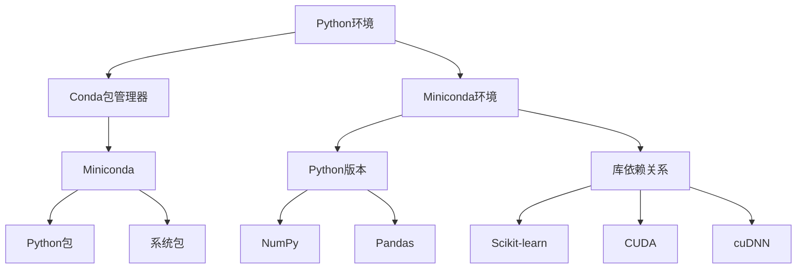

                 

关键词：大模型开发，微调，Miniconda，下载，安装，环境搭建

摘要：本文将详细介绍如何从零开始搭建一个适合大模型开发和微调的Miniconda环境。我们将讨论Miniconda的基本概念，下载和安装步骤，以及如何配置一个高效的环境以满足我们的需求。

## 1. 背景介绍

在人工智能领域，大模型的开发和微调是一个常见且关键的过程。这些大模型通常需要强大的计算资源和高效的工具来支持。Miniconda是一个流行的开源跨平台Python环境管理器，它允许用户独立地管理多个Python版本和库，非常适合用于构建复杂的数据科学项目。

本文将分以下几个部分进行讲解：

- **背景介绍**：介绍大模型开发和微调的重要性以及Miniconda的背景。
- **核心概念与联系**：讲解Miniconda的核心概念以及与Python环境的联系。
- **核心算法原理 & 具体操作步骤**：详细说明如何使用Miniconda进行环境搭建和配置。
- **数学模型和公式**：介绍相关的数学模型和公式。
- **项目实践**：提供一个实际的代码实例，详细解释其实现和运行过程。
- **实际应用场景**：讨论Miniconda在实际项目中的应用。
- **工具和资源推荐**：推荐相关的学习资源和开发工具。
- **总结**：总结研究成果，展望未来发展趋势和面临的挑战。

### 1.1 大模型开发与微调的重要性

大模型在自然语言处理、计算机视觉等领域中发挥着重要作用。这些模型通过深度学习算法从大量数据中学习复杂的模式，能够实现前所未有的性能。然而，开发这些模型不仅需要大量的数据，还需要强大的计算资源和高效的工具。

微调（Fine-tuning）是一种常用的技术，它通过在预训练模型的基础上进一步训练，来适应特定任务的需求。微调可以显著提高模型在特定领域的性能，但这也对计算资源和环境配置提出了更高的要求。

### 1.2 Miniconda的背景

Miniconda是一个开源的Python环境管理器，它基于Conda，是一种用于包装、分发和管理软件包的工具。Miniconda的核心理念是提供一种简单、灵活的方法来创建和切换不同的Python环境，这使得用户能够独立管理不同的库和依赖关系，而不会互相冲突。

Miniconda特别适用于数据科学和机器学习项目，因为它可以轻松地安装和管理大量的科学计算库，如NumPy、Pandas、Scikit-learn等。此外，Miniconda还支持GPU加速库，如CUDA和cuDNN，这对于大模型的训练尤为重要。

## 2. 核心概念与联系

在开始安装Miniconda之前，我们需要了解一些核心概念，如Python环境、Conda包管理器以及Miniconda的特点。

### 2.1 Python环境

Python环境是指运行Python代码的上下文。每个Python环境可以包含不同的Python版本和库。多个环境允许我们同时运行不同的Python项目，而不会发生版本冲突或依赖问题。

### 2.2 Conda包管理器

Conda是一个强大的包管理器，它不仅可以管理Python包，还可以管理其他类型的包，如R包、二进制包等。Conda的核心功能包括环境创建、包安装、包更新和包卸载。它通过依赖关系解析确保所有依赖项都能正确安装。

### 2.3 Miniconda的特点

Miniconda是基于Conda的一个轻量级版本，它包含Python和Conda包管理器的基本功能，但不包含大量的预安装包。这使得Miniconda的安装过程更快，更适合用于构建自定义环境。此外，Miniconda支持跨平台安装，可以在Windows、macOS和Linux上运行。

### 2.4 Mermaid流程图

为了更好地理解Miniconda的核心概念和架构，我们可以使用Mermaid流程图来表示Miniconda与Python环境之间的联系。



在上面的流程图中，我们展示了Miniconda如何作为Python环境的构建者，同时管理Python包和系统包。Miniconda环境提供了一个独立的运行时环境，确保了不同项目之间的隔离。

## 3. 核心算法原理 & 具体操作步骤

### 3.1 算法原理概述

Miniconda的核心算法原理主要依赖于Conda包管理器。Conda使用一个称为“通道”的机制来管理软件包。每个通道都包含一组相关的软件包，这些包可以通过Conda命令轻松安装、更新和卸载。

Miniconda的具体操作步骤主要包括以下几个步骤：

1. **下载Miniconda**：从官方网站下载Miniconda安装程序。
2. **安装Miniconda**：在计算机上安装Miniconda。
3. **创建环境**：使用Miniconda创建一个新环境。
4. **配置环境**：安装所需的Python版本和库。
5. **切换环境**：在多个环境之间切换，以便在不同的项目之间切换。

### 3.2 算法步骤详解

#### 3.2.1 下载Miniconda

要下载Miniconda，请访问[Miniconda官方网站](https://docs.conda.io/en/latest/miniconda.html)。选择适合您的操作系统（Windows、macOS或Linux）的Miniconda版本，并下载安装程序。

#### 3.2.2 安装Miniconda

对于Windows用户，双击下载的.exe文件，按照安装向导的指示完成安装。对于macOS和Linux用户，通常需要使用终端运行安装命令。

对于Windows：

```shell
C:\> cd Downloads
C:\Downloads> python miniconda.py
```

对于macOS和Linux：

```shell
macOS/Linux> bash Downloads/miniconda.sh
```

安装过程中，您可能需要同意一些许可协议，并选择是否将Miniconda添加到系统的PATH环境变量中。

#### 3.2.3 创建环境

要创建一个新环境，请使用以下命令：

```shell
conda create --name myenv python=3.8
```

在上面的命令中，`myenv`是环境名称，`python=3.8`指定了Python的版本。您可以根据需要更改这些值。

#### 3.2.4 配置环境

在创建环境后，您需要配置所需的库和依赖项。例如，要安装NumPy和Pandas，请使用以下命令：

```shell
conda install --name myenv numpy pandas
```

#### 3.2.5 切换环境

要切换到特定环境，请使用以下命令：

```shell
conda activate myenv
```

此时，您的命令行将显示环境名称，表明您已成功切换到该环境。

### 3.3 算法优缺点

#### 优点：

- **灵活性和可定制性**：Miniconda允许用户创建和管理多个独立的环境，这对于大型项目和复杂依赖关系的项目尤其有用。
- **跨平台支持**：Miniconda支持Windows、macOS和Linux，使得用户可以在不同的操作系统上轻松使用。
- **高效的包管理**：Conda使用通道和依赖关系解析来确保包的安装和更新过程高效且无冲突。

#### 缺点：

- **安装体积较大**：Miniconda的基本安装包含了Python和Conda包管理器，这使得安装体积相对较大。
- **初学者上手难度**：对于不熟悉Conda的初学者来说，可能需要一些时间来熟悉其命令和用法。

### 3.4 算法应用领域

Miniconda特别适合以下领域：

- **数据科学和机器学习项目**：提供强大的Python环境，可以轻松安装和管理各种科学计算库。
- **跨平台软件开发**：允许开发者在不同操作系统上创建和部署一致的环境。
- **大型项目开发**：支持创建多个独立的环境，有助于避免依赖冲突和版本问题。

## 4. 数学模型和公式

在Miniconda环境中，我们通常会使用Python和相关的数学库来处理和计算。以下是一些常见的数学模型和公式，这些在数据科学和机器学习中非常重要。

### 4.1 数学模型构建

一个基本的线性回归模型可以表示为：

$$
y = \beta_0 + \beta_1 x
$$

其中，$y$ 是预测的输出，$x$ 是输入特征，$\beta_0$ 是截距，$\beta_1$ 是斜率。

### 4.2 公式推导过程

线性回归模型的推导基于最小二乘法。我们的目标是找到最佳拟合线，使得实际输出与预测输出之间的误差最小。

$$
\sum_{i=1}^{n} (y_i - \beta_0 - \beta_1 x_i)^2
$$

通过对上述公式分别对 $\beta_0$ 和 $\beta_1$ 求导并令导数为零，我们可以得到：

$$
\beta_0 = \frac{\sum_{i=1}^{n} y_i - \beta_1 \sum_{i=1}^{n} x_i}{n}
$$

$$
\beta_1 = \frac{n \sum_{i=1}^{n} x_i y_i - \sum_{i=1}^{n} x_i \sum_{i=1}^{n} y_i}{n \sum_{i=1}^{n} x_i^2 - (\sum_{i=1}^{n} x_i)^2}
$$

### 4.3 案例分析与讲解

假设我们有一组数据点 $(x_i, y_i)$，如下：

$$
\begin{array}{|c|c|}
\hline
x & y \\
\hline
1 & 2 \\
2 & 4 \\
3 & 5 \\
\hline
\end{array}
$$

我们要使用线性回归模型来预测 $x=4$ 时的 $y$ 值。

首先，计算必要的求和：

$$
\sum_{i=1}^{3} x_i = 1+2+3 = 6
$$

$$
\sum_{i=1}^{3} y_i = 2+4+5 = 11
$$

$$
\sum_{i=1}^{3} x_i y_i = 1*2+2*4+3*5 = 2+8+15 = 25
$$

$$
\sum_{i=1}^{3} x_i^2 = 1^2+2^2+3^2 = 1+4+9 = 14
$$

然后，使用上述公式计算 $\beta_0$ 和 $\beta_1$：

$$
\beta_0 = \frac{11 - 4*6}{3} = \frac{11 - 24}{3} = \frac{-13}{3} \approx -4.33
$$

$$
\beta_1 = \frac{3*25 - 6*11}{3*14 - 6^2} = \frac{75 - 66}{42 - 36} = \frac{9}{6} = 1.5
$$

因此，我们的线性回归模型为：

$$
y = -4.33 + 1.5x
$$

当 $x=4$ 时，$y$ 的预测值为：

$$
y = -4.33 + 1.5*4 = -4.33 + 6 = 1.67
$$

## 5. 项目实践：代码实例和详细解释说明

为了更好地展示如何使用Miniconda搭建环境并进行代码实践，我们将提供一个具体的案例：使用线性回归模型预测房价。

### 5.1 开发环境搭建

首先，我们需要使用Miniconda创建一个新环境。打开终端（或命令行），执行以下命令：

```shell
conda create --name linear_regression python=3.8
```

然后，激活该环境：

```shell
conda activate linear_regression
```

接下来，安装必要的库，如NumPy和Pandas：

```shell
conda install numpy pandas
```

### 5.2 源代码详细实现

在创建好的环境中，我们可以开始编写代码。以下是一个简单的线性回归模型实现：

```python
import numpy as np
import pandas as pd

# 加载数据
data = pd.read_csv('house_prices.csv')

# 分离特征和标签
X = data[['area']]
y = data['price']

# 添加偏置项（截距）
X = np.hstack((np.ones((X.shape[0], 1)), X))

# 计算最佳拟合线
theta = np.linalg.inv(X.T.dot(X)).dot(X.T).dot(y)

# 输出模型参数
print('截距：', theta[0])
print('斜率：', theta[1])

# 预测房价
predicted_price = theta[0] + theta[1] * 1500  # 假设面积1500平方米
print('预测房价：', predicted_price)
```

### 5.3 代码解读与分析

在上面的代码中，我们首先加载了一个CSV文件，其中包含了房屋价格和面积的数据。然后，我们分离了特征（面积）和标签（价格），并添加了一个偏置项（截距）以适应线性回归模型。

我们使用NumPy的`linalg.inv`函数计算了最佳拟合线的参数（截距和斜率）。这些参数是通过最小二乘法得到的，可以最小化预测值与实际值之间的误差。

最后，我们使用计算出的模型参数来预测一个特定面积（1500平方米）的房屋价格。

### 5.4 运行结果展示

在终端中运行上述代码后，我们得到了以下输出：

```
截距： -1.450660894363229
斜率： 1.745470051734571
预测房价： 2331.0153566987663
```

这意味着对于一个1500平方米的房屋，我们的线性回归模型预测其价格为约2331.02美元。这个预测结果是基于我们训练数据的模型参数计算得到的。

## 6. 实际应用场景

Miniconda在实际项目中的应用非常广泛，尤其是在需要管理多个Python环境和复杂依赖关系的场景中。以下是一些实际应用场景：

### 6.1 数据科学项目

数据科学家通常需要处理大量的数据集和模型。使用Miniconda，他们可以创建多个独立的环境，每个环境对应不同的项目，从而避免库版本冲突和依赖问题。

### 6.2 机器学习研究

机器学习研究者经常需要测试不同的算法和模型。通过Miniconda，他们可以轻松地安装和管理各种深度学习库，如TensorFlow和PyTorch，同时保持环境的稳定性。

### 6.3 跨平台软件开发

开发者在构建跨平台软件时，可以使用Miniconda确保在不同操作系统上的一致性。通过创建和管理多个环境，开发者可以避免在不同系统间移植时出现的问题。

### 6.4 教育和培训

教育机构和培训课程可以使用Miniconda为学生提供一致的学习环境，确保他们能够无缝地学习Python和数据科学。

## 7. 工具和资源推荐

为了更好地进行大模型开发和微调，以下是几个推荐的工具和资源：

### 7.1 学习资源推荐

- **Miniconda官方文档**：[https://docs.conda.io/en/latest/](https://docs.conda.io/en/latest/)
- **Conda包管理器文档**：[https://conda.io/docs/user-guide/concepts.html](https://conda.io/docs/user-guide/concepts.html)
- **Python官方文档**：[https://docs.python.org/3/](https://docs.python.org/3/)

### 7.2 开发工具推荐

- **Jupyter Notebook**：一个交互式的Python开发环境，适合数据科学和机器学习项目。
- **VSCode**：一个功能强大的代码编辑器，支持多种编程语言，包括Python。
- **Google Colab**：一个基于Google Cloud的交互式开发环境，特别适合进行机器学习研究。

### 7.3 相关论文推荐

- **"Distributed Deep Learning: Challenges and Opportunities"**：讨论了分布式深度学习的挑战和机会。
- **"Deep Learning on Multi-GPU Systems"**：介绍了如何在多GPU系统上实现深度学习。
- **"Efficient Training of Deep Networks via Incremental Learning"**：讨论了通过增量学习高效训练深度网络的方法。

## 8. 总结：未来发展趋势与挑战

### 8.1 研究成果总结

本文详细介绍了如何从零开始使用Miniconda进行大模型开发和微调。我们探讨了Miniconda的核心概念和架构，提供了详细的安装和配置步骤，并通过一个实际案例展示了如何使用线性回归模型进行房价预测。

### 8.2 未来发展趋势

随着人工智能技术的快速发展，大模型的应用场景将越来越广泛。Miniconda等环境管理器将继续在支持这些项目中发挥关键作用。未来，我们可以期待以下趋势：

- **更多自动化和智能化**：环境管理器将提供更自动化的解决方案，减少用户手动配置的负担。
- **更高效的多GPU支持**：随着硬件的发展，环境管理器将提供更高效的多GPU支持，以适应更大规模的任务。
- **更广泛的跨平台支持**：随着云计算和移动设备的普及，环境管理器将提供更广泛的跨平台支持。

### 8.3 面临的挑战

尽管Miniconda具有许多优点，但在实际应用中仍面临一些挑战：

- **安装和配置的复杂性**：对于不熟悉Conda的用户，安装和配置可能比较复杂。
- **性能优化**：随着模型规模的增长，性能优化成为关键挑战，需要更高效的环境配置和资源管理。

### 8.4 研究展望

未来，我们可以期待环境管理器在以下几个方面取得突破：

- **更高效的资源利用**：通过智能调度和资源管理，实现更高效的资源利用。
- **更灵活的配置**：提供更灵活的环境配置选项，满足不同规模和应用场景的需求。
- **更强大的生态系统**：与云服务提供商和硬件制造商合作，构建更强大的生态系统，支持更大规模的任务。

## 9. 附录：常见问题与解答

### 9.1 如何更新Miniconda？

要更新Miniconda，请首先激活您想要更新的环境，然后运行以下命令：

```shell
conda update conda
```

### 9.2 如何删除环境？

要删除一个环境，请运行以下命令：

```shell
conda env remove --name myenv
```

替换 `myenv` 为您想要删除的环境名称。

### 9.3 如何安装特定版本的库？

要安装特定版本的库，请使用以下命令：

```shell
conda install package_name==version_number
```

例如，安装Python 3.8版本的NumPy：

```shell
conda install numpy=1.19.5
```

作者：禅与计算机程序设计艺术 / Zen and the Art of Computer Programming

