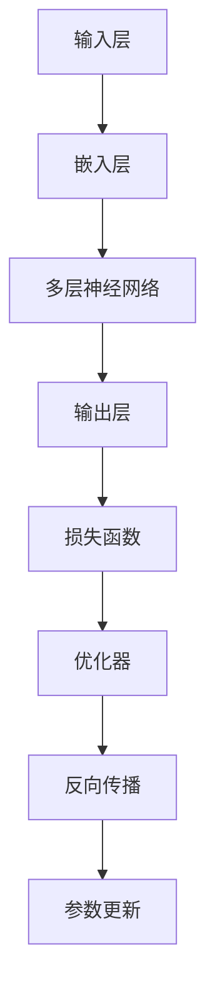

                 

关键词：大模型开发、PyTorch、微调、人工智能、机器学习、神经网络、模型训练、代码实践

> 摘要：本文旨在为初学者提供一个详细的从零开始搭建和微调大模型的实践指南。我们将使用PyTorch 2.0这一强大的深度学习框架，通过一系列小练习，逐步掌握大模型开发的基本技能，为未来更复杂的项目打下坚实的基础。

## 1. 背景介绍

随着深度学习的迅猛发展，大模型（Large Models）在自然语言处理、计算机视觉等领域取得了显著的成果。大模型通常拥有数十亿甚至数万亿的参数，能够通过大量的数据进行训练，从而实现更高的性能。然而，开发大模型并非易事，需要深入的算法知识、大量的计算资源和高效的代码实现。

PyTorch是一个广泛使用的开源深度学习框架，以其灵活的动态计算图和易于理解的代码结构受到研究者和工程师的喜爱。PyTorch 2.0进一步增强了框架的性能和功能，使得大模型开发变得更加高效和便捷。

本文将围绕PyTorch 2.0，通过一系列小练习，帮助读者从零开始学习大模型开发与微调的基本技能。我们将首先介绍核心概念和原理，然后逐步深入，讲解具体操作步骤和代码实现，最后探讨大模型在实际应用中的前景和挑战。

## 2. 核心概念与联系

### 2.1 核心概念

在深度学习中，大模型通常指的是拥有大量参数的神经网络，如Transformer、BERT等。这些模型通过多层神经网络结构，对输入数据进行复杂的变换和特征提取，从而实现高精度的预测和分类。

### 2.2 架构联系

为了更好地理解大模型的工作原理，我们使用Mermaid流程图展示其基本架构：



### 2.3 动机与联系

大模型通过参数的强大表示能力，能够从大量数据中学习复杂的模式。其架构设计灵活，可以适应不同的应用场景。大模型的训练和微调是深度学习中的核心环节，直接影响模型的性能和泛化能力。

## 3. 核心算法原理 & 具体操作步骤

### 3.1 算法原理概述

大模型的训练过程主要包括以下几个步骤：

1. **数据预处理**：对输入数据进行清洗、归一化等处理，以便于模型训练。
2. **前向传播**：输入数据通过模型的前向传播，计算得到输出结果。
3. **损失计算**：通过比较模型输出和真实标签，计算损失函数值。
4. **反向传播**：根据损失函数，计算模型参数的梯度。
5. **参数更新**：使用优化器更新模型参数，以降低损失函数值。

### 3.2 算法步骤详解

1. **数据预处理**：

   ```python
   import torch
   import torchvision
   import torchvision.transforms as transforms

   transform = transforms.Compose([
       transforms.Resize((224, 224)),
       transforms.ToTensor(),
       transforms.Normalize(mean=[0.485, 0.456, 0.406], std=[0.229, 0.224, 0.225]),
   ])

   trainset = torchvision.datasets.CIFAR10(
       root='./data', train=True, download=True, transform=transform)
   trainloader = torch.utils.data.DataLoader(
       trainset, batch_size=4, shuffle=True, num_workers=2)
   ```

2. **定义模型**：

   ```python
   import torch.nn as nn
   import torch.nn.functional as F

   class Net(nn.Module):
       def __init__(self):
           super(Net, self).__init__()
           self.conv1 = nn.Conv2d(3, 6, 5)
           self.pool = nn.MaxPool2d(2, 2)
           self.conv2 = nn.Conv2d(6, 16, 5)
           self.fc1 = nn.Linear(16 * 5 * 5, 120)
           self.fc2 = nn.Linear(120, 84)
           self.fc3 = nn.Linear(84, 10)

       def forward(self, x):
           x = self.pool(F.relu(self.conv1(x)))
           x = self.pool(F.relu(self.conv2(x)))
           x = x.view(-1, 16 * 5 * 5)
           x = F.relu(self.fc1(x))
           x = F.relu(self.fc2(x))
           x = self.fc3(x)
           return x

   net = Net()
   ```

3. **前向传播和损失计算**：

   ```python
   import torch.optim as optim

   criterion = nn.CrossEntropyLoss()
   optimizer = optim.SGD(net.parameters(), lr=0.001, momentum=0.9)
   ```

4. **反向传播和参数更新**：

   ```python
   for epoch in range(2):  # loop over the dataset multiple times

       running_loss = 0.0
       for i, data in enumerate(trainloader, 0):
           inputs, labels = data
           optimizer.zero_grad()

           outputs = net(inputs)
           loss = criterion(outputs, labels)
           loss.backward()
           optimizer.step()

           running_loss += loss.item()
           if i % 2000 == 1999:    # print every 2000 mini-batches
               print('[%d, %5d] loss: %.3f' %
                     (epoch + 1, i + 1, running_loss / 2000))
               running_loss = 0.0

       print(f'Epoch {epoch + 1} loss: {running_loss / len(trainloader)}')
   print('Finished Training')
   ```

### 3.3 算法优缺点

1. **优点**：
   - **灵活性强**：PyTorch的动态计算图使得模型定义和调试更加直观。
   - **易于理解**：代码结构清晰，易于阅读和理解。
   - **高性能**：PyTorch 2.0在性能上有了显著提升，能够支持大规模模型训练。

2. **缺点**：
   - **调试困难**：动态计算图可能导致调试过程复杂。
   - **资源消耗大**：大模型训练需要大量的计算资源和存储空间。

### 3.4 算法应用领域

大模型在自然语言处理、计算机视觉、推荐系统等领域具有广泛的应用，如：

- **自然语言处理**：BERT、GPT等模型在文本分类、问答系统等领域取得了优异的性能。
- **计算机视觉**：ResNet、EfficientNet等模型在图像分类、目标检测等领域得到了广泛应用。
- **推荐系统**：深度学习模型在用户行为分析和个性化推荐方面表现出色。

## 4. 数学模型和公式 & 详细讲解 & 举例说明

### 4.1 数学模型构建

大模型的数学模型主要由以下几部分组成：

1. **输入层**：接受输入数据，进行特征提取。
2. **隐藏层**：通过非线性变换，提取更高层次的特征。
3. **输出层**：进行预测或分类。

### 4.2 公式推导过程

1. **前向传播**：

   前向传播的核心公式为：

   $$z^{(l)} = W^{(l)}a^{(l-1)} + b^{(l)}$$

   $$a^{(l)} = \sigma(z^{(l)})$$

   其中，$z^{(l)}$为第$l$层的输出，$W^{(l)}$为第$l$层的权重，$b^{(l)}$为第$l$层的偏置，$\sigma$为激活函数。

2. **反向传播**：

   反向传播的核心公式为：

   $$\delta^{(l)} = \frac{\partial J}{\partial a^{(l)}} = \frac{\partial J}{\partial z^{(l)}} \cdot \frac{\partial z^{(l)}}{\partial a^{(l)}}$$

   $$\frac{\partial J}{\partial W^{(l)}} = a^{(l-1)} \cdot \delta^{(l)}$$

   $$\frac{\partial J}{\partial b^{(l)}} = \delta^{(l)}$$

   其中，$\delta^{(l)}$为第$l$层的误差，$J$为损失函数。

### 4.3 案例分析与讲解

以CIFAR-10图像分类任务为例，分析大模型训练过程。

1. **数据预处理**：

   对CIFAR-10图像数据进行归一化处理，使其适应模型训练。

2. **模型定义**：

   使用PyTorch定义一个简单的卷积神经网络，包括两个卷积层、两个全连接层和一个输出层。

3. **模型训练**：

   使用反向传播算法，通过迭代优化模型参数，降低损失函数值。

4. **模型评估**：

   在验证集上评估模型性能，调整超参数，以获得最佳性能。

## 5. 项目实践：代码实例和详细解释说明

### 5.1 开发环境搭建

在本地或云端搭建一个适合PyTorch开发的计算环境，安装PyTorch及其依赖库。

### 5.2 源代码详细实现

以下是一个简单的CIFAR-10图像分类任务的PyTorch代码实现：

```python
import torch
import torch.nn as nn
import torch.optim as optim
import torchvision
import torchvision.transforms as transforms

# 数据预处理
transform = transforms.Compose([
    transforms.Resize((224, 224)),
    transforms.ToTensor(),
    transforms.Normalize(mean=[0.485, 0.456, 0.406], std=[0.229, 0.224, 0.225]),
])

trainset = torchvision.datasets.CIFAR10(
    root='./data', train=True, download=True, transform=transform)
trainloader = torch.utils.data.DataLoader(
    trainset, batch_size=4, shuffle=True, num_workers=2)

testset = torchvision.datasets.CIFAR10(
    root='./data', train=False, download=True, transform=transform)
testloader = torch.utils.data.DataLoader(
    testset, batch_size=4, shuffle=False, num_workers=2)

classes = ('plane', 'car', 'bird', 'cat', 'deer', 'dog', 'frog', 'horse', 'ship', 'truck')

# 定义模型
class Net(nn.Module):
    def __init__(self):
        super(Net, self).__init__()
        self.conv1 = nn.Conv2d(3, 6, 5)
        self.pool = nn.MaxPool2d(2, 2)
        self.conv2 = nn.Conv2d(6, 16, 5)
        self.fc1 = nn.Linear(16 * 5 * 5, 120)
        self.fc2 = nn.Linear(120, 84)
        self.fc3 = nn.Linear(84, 10)

    def forward(self, x):
        x = self.pool(F.relu(self.conv1(x)))
        x = self.pool(F.relu(self.conv2(x)))
        x = x.view(-1, 16 * 5 * 5)
        x = F.relu(self.fc1(x))
        x = F.relu(self.fc2(x))
        x = self.fc3(x)
        return x

net = Net()

# 损失函数和优化器
criterion = nn.CrossEntropyLoss()
optimizer = optim.SGD(net.parameters(), lr=0.001, momentum=0.9)

# 训练模型
for epoch in range(2):  # loop over the dataset multiple times

    running_loss = 0.0
    for i, data in enumerate(trainloader, 0):
        inputs, labels = data
        optimizer.zero_grad()

        outputs = net(inputs)
        loss = criterion(outputs, labels)
        loss.backward()
        optimizer.step()

        running_loss += loss.item()
        if i % 2000 == 1999:    # print every 2000 mini-batches
            print('[%d, %5d] loss: %.3f' %
                  (epoch + 1, i + 1, running_loss / 2000))
            running_loss = 0.0

    print(f'Epoch {epoch + 1} loss: {running_loss / len(trainloader)}')

print('Finished Training')

# 测试模型
correct = 0
total = 0
with torch.no_grad():
    for data in testloader:
        images, labels = data
        outputs = net(images)
        _, predicted = torch.max(outputs.data, 1)
        total += labels.size(0)
        correct += (predicted == labels).sum().item()

print(f'Accuracy of the network on the 10000 test images: {100 * correct / total}%')
```

### 5.3 代码解读与分析

1. **数据预处理**：对CIFAR-10图像数据进行归一化和调整大小，使其适应模型输入。
2. **模型定义**：定义一个简单的卷积神经网络，包括两个卷积层、两个全连接层和一个输出层。
3. **损失函数和优化器**：使用交叉熵损失函数和随机梯度下降优化器。
4. **模型训练**：通过反向传播算法，迭代优化模型参数，降低损失函数值。
5. **模型评估**：在测试集上评估模型性能，计算准确率。

## 6. 实际应用场景

大模型在实际应用场景中具有广泛的应用，如：

- **自然语言处理**：BERT、GPT等模型在文本分类、问答系统等领域表现出色。
- **计算机视觉**：ResNet、EfficientNet等模型在图像分类、目标检测等领域得到广泛应用。
- **推荐系统**：深度学习模型在用户行为分析和个性化推荐方面表现出色。

## 7. 工具和资源推荐

### 7.1 学习资源推荐

- [PyTorch官方文档](https://pytorch.org/docs/stable/)
- [《深度学习》（Goodfellow, Bengio, Courville）](https://www.deeplearningbook.org/)
- [《动手学深度学习》（Dumoulin, Souhaité）](https://www.dli.oreilly.com/wiki/d书/动手学深度学习)

### 7.2 开发工具推荐

- [Google Colab](https://colab.research.google.com/)
- [Jupyter Notebook](https://jupyter.org/)

### 7.3 相关论文推荐

- [Attention Is All You Need (Vaswani et al., 2017)](https://arxiv.org/abs/1706.03762)
- [ResNet: Deep Neural Networks for Visual Recognition (He et al., 2015)](https://arxiv.org/abs/1512.03385)
- [BERT: Pre-training of Deep Bidirectional Transformers for Language Understanding (Devlin et al., 2019)](https://arxiv.org/abs/1810.04805)

## 8. 总结：未来发展趋势与挑战

大模型作为深度学习领域的重要研究方向，在未来将继续发挥重要作用。然而，随着模型规模的扩大，面临的技术挑战也日益显著，如计算资源消耗、训练时间优化、模型解释性等。未来研究将重点关注以下方面：

- **计算效率优化**：研究高效的训练算法和优化器，降低模型训练时间和计算资源消耗。
- **模型压缩与加速**：通过模型压缩、量化等方法，降低模型参数量和计算复杂度。
- **模型解释性**：研究如何提高模型的可解释性，使其在实际应用中更加可靠和透明。

## 9. 附录：常见问题与解答

### 9.1 如何选择合适的模型架构？

选择模型架构时，需要考虑以下几个因素：

- **任务类型**：不同的任务可能需要不同类型的模型架构。
- **数据集大小**：对于大规模数据集，通常选择更大的模型架构。
- **计算资源**：根据可用计算资源选择合适的模型规模。

### 9.2 如何优化模型性能？

优化模型性能可以从以下几个方面入手：

- **超参数调优**：调整学习率、批量大小等超参数。
- **数据增强**：使用数据增强方法，提高模型泛化能力。
- **模型集成**：使用多个模型进行集成，提高预测准确性。

### 9.3 如何处理过拟合现象？

过拟合现象可以通过以下方法处理：

- **正则化**：使用正则化方法，如L1、L2正则化，降低模型复杂度。
- **数据增强**：增加训练数据量，提高模型泛化能力。
- **早停法**：在验证集上监控模型性能，提前停止训练，避免过拟合。

---

作者：禅与计算机程序设计艺术 / Zen and the Art of Computer Programming

