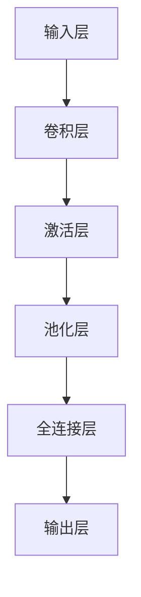

                 

 > **关键词：** PyTorch、卷积神经网络、大模型开发、微调、深度学习

> **摘要：** 本文将从零开始，详细介绍在PyTorch框架下开发与微调大模型的过程。我们将探讨卷积函数的实现，包括其原理、数学模型、以及具体的代码实现步骤。此外，还将分析卷积函数的优缺点、应用领域，并通过实际项目实践展示代码实例和详细解释。

## 1. 背景介绍

随着深度学习技术的不断发展，大模型（Large-scale Model）在各个领域得到了广泛应用。大模型具有强大的表征能力和泛化能力，能够在复杂任务中取得优异的性能。然而，大模型的开发与微调是一项复杂且具有挑战性的任务。在本文中，我们将重点关注PyTorch框架中的卷积函数实现，这是大模型开发与微调过程中至关重要的一环。

PyTorch是一个开源的深度学习框架，由Facebook的人工智能研究团队开发。它具有简洁明了的API、动态计算图（计算图是深度学习模型的基础）和高效的执行性能。PyTorch的灵活性和易用性使得它在学术研究和工业应用中得到了广泛采用。

卷积神经网络（Convolutional Neural Network，CNN）是一种专门用于处理图像数据的深度学习模型。它通过卷积操作提取图像特征，并利用全连接层进行分类。卷积函数是CNN的核心组成部分，其性能直接影响到模型的最终效果。

## 2. 核心概念与联系

### 2.1 卷积函数原理

卷积函数是一种线性变换，通过滑动滤波器（卷积核）在输入数据上提取特征。具体来说，卷积函数将输入数据与卷积核进行点积操作，得到一个特征图（feature map）。通过多次卷积操作，可以逐步提取输入数据的特征，从而构建出一个完整的深度学习模型。

### 2.2 PyTorch中的卷积操作

在PyTorch中，卷积操作是通过`torch.nn.Conv2d`模块实现的。它具有以下关键参数：

- `in_channels`：输入数据的通道数
- `out_channels`：输出数据的通道数
- `kernel_size`：卷积核的大小
- `stride`：卷积步长
- `padding`：填充方式

这些参数将决定卷积操作的输出特征图的大小和形状。例如，一个`Conv2d`模块将一个大小为`[batch_size, in_channels, height, width]`的输入数据转化为大小为`[batch_size, out_channels, height', width']`的输出数据，其中`height'`和`width'`取决于卷积核的大小、步长和填充方式。

### 2.3 卷积函数架构

卷积函数的架构可以分为以下几个层次：

1. **输入层**：接受输入数据，并将其传递给卷积核。
2. **卷积层**：通过卷积操作提取特征。
3. **激活层**：对卷积层的输出进行激活函数处理，如ReLU函数。
4. **池化层**：通过池化操作降低特征图的分辨率。
5. **全连接层**：将池化层的输出转化为类别概率。

以下是卷积函数的Mermaid流程图：



### 2.4 卷积函数在PyTorch中的实现

在PyTorch中，卷积函数的实现主要通过`torch.nn.Module`类来实现。以下是一个简单的卷积神经网络实现示例：

```python
import torch
import torch.nn as nn

class ConvNet(nn.Module):
    def __init__(self):
        super(ConvNet, self).__init__()
        self.conv1 = nn.Conv2d(1, 10, kernel_size=5)
        self.relu = nn.ReLU()
        self.maxpool = nn.MaxPool2d(2)
        self.fc1 = nn.Linear(10 * 6 * 6, 50)
        self.fc2 = nn.Linear(50, 10)

    def forward(self, x):
        x = self.relu(self.conv1(x))
        x = self.maxpool(x)
        x = self.fc1(x.view(-1, 10 * 6 * 6))
        x = self.fc2(x)
        return x

model = ConvNet()
```

以上代码定义了一个简单的卷积神经网络，包括一个卷积层、一个激活层、一个池化层、两个全连接层。在`forward`方法中，实现了输入数据的卷积操作、激活函数处理、池化操作和全连接层计算。

## 3. 核心算法原理 & 具体操作步骤

### 3.1 算法原理概述

卷积神经网络通过卷积函数对输入数据（如图像）进行特征提取，并利用全连接层进行分类。卷积函数的核心在于其局部感知和权重共享的特性。局部感知是指卷积核只关注输入数据的一部分，从而提取该部分的局部特征。权重共享是指卷积核在整个图像上共享同一权重，从而确保特征提取的一致性。

### 3.2 算法步骤详解

1. **初始化卷积核**：在卷积神经网络中，卷积核的初始化非常重要。通常采用高斯分布初始化方法，以确保卷积核的初始化值具有适当的方差。

2. **卷积操作**：卷积操作是将卷积核与输入数据进行点积操作，从而得到一个特征图。卷积操作的输出特征图大小取决于卷积核的大小、步长和填充方式。

3. **激活函数**：激活函数用于对卷积操作的输出进行非线性处理，以增强模型的表征能力。常用的激活函数包括ReLU函数、Sigmoid函数和Tanh函数。

4. **池化操作**：池化操作用于降低特征图的分辨率，从而减少模型的参数数量和计算量。常用的池化操作包括最大池化和平均池化。

5. **全连接层**：全连接层将池化层的输出转化为类别概率。通过计算池化层输出的每个特征图与分类器的权重矩阵的点积，并加上偏置项，得到类别概率。

### 3.3 算法优缺点

卷积神经网络具有以下优点：

- 局部感知和权重共享特性，使得模型具有强大的表征能力和泛化能力。
- 参数数量相对较少，从而降低了模型的计算量和存储成本。
- 在处理图像数据时具有优异的性能，适用于计算机视觉任务。

卷积神经网络也存在一些缺点：

- 对图像尺寸有较高的要求，通常需要对图像进行归一化处理。
- 在处理非结构化数据时，如文本和序列数据，卷积神经网络的性能可能不如循环神经网络（RNN）。
- 模型的训练过程较慢，需要大量的计算资源和时间。

### 3.4 算法应用领域

卷积神经网络在计算机视觉领域得到了广泛应用，如图像分类、目标检测、语义分割等。此外，卷积神经网络还可以应用于自然语言处理、音频处理等领域。

## 4. 数学模型和公式 & 详细讲解 & 举例说明

### 4.1 数学模型构建

卷积神经网络的核心在于卷积函数，其数学模型可以表示为：

$$
\mathbf{f}(\mathbf{x}) = \sum_{k=1}^{K} \mathbf{W}_k * \mathbf{x} + \mathbf{b}
$$

其中，$\mathbf{x}$ 是输入数据，$\mathbf{W}_k$ 是第 $k$ 个卷积核的权重，$\mathbf{b}$ 是偏置项，$\mathbf{f}(\mathbf{x})$ 是输出特征图。

### 4.2 公式推导过程

卷积操作的推导过程可以分为以下几个步骤：

1. **定义卷积核**：设卷积核的大小为 $h \times w$，输入数据的大小为 $m \times n$。

2. **初始化权重和偏置项**：通常采用高斯分布初始化方法，以确保权重和偏置项的方差适当。

3. **卷积操作**：将卷积核在输入数据上滑动，进行点积操作，得到一个特征图。具体来说，将卷积核在输入数据上的每个点与卷积核的权重进行点积，并将结果累加得到特征图的对应值。

4. **添加偏置项**：在特征图的每个值上加上偏置项，以完成卷积操作。

5. **输出特征图**：将卷积操作的结果输出为一个特征图，其大小为 $(m - h + 2p) \times (n - w + 2p)$，其中 $p$ 为填充值。

### 4.3 案例分析与讲解

以一个简单的二值图像为例，图像大小为 $3 \times 3$，卷积核大小为 $2 \times 2$。图像和卷积核如下：

$$
\begin{align*}
\mathbf{x} &= \begin{bmatrix}
1 & 1 & 1 \\
1 & 0 & 1 \\
1 & 1 & 1
\end{bmatrix}, \quad \mathbf{W}_1 = \begin{bmatrix}
0 & 1 \\
1 & 0
\end{bmatrix}, \quad \mathbf{W}_2 = \begin{bmatrix}
0 & 0 \\
0 & 1
\end{bmatrix}, \quad \mathbf{b} = \begin{bmatrix}
0 \\
0
\end{bmatrix}
\end{align*}
$$

进行卷积操作后，得到两个特征图：

$$
\begin{align*}
\mathbf{f}_1(\mathbf{x}) &= \mathbf{W}_1 * \mathbf{x} + \mathbf{b} = \begin{bmatrix}
0 & 1 \\
1 & 0
\end{bmatrix} * \begin{bmatrix}
1 & 1 & 1 \\
1 & 0 & 1 \\
1 & 1 & 1
\end{bmatrix} + \begin{bmatrix}
0 \\
0
\end{bmatrix} = \begin{bmatrix}
1 & 0 \\
0 & 1 \\
1 & 0
\end{bmatrix}, \\
\mathbf{f}_2(\mathbf{x}) &= \mathbf{W}_2 * \mathbf{x} + \mathbf{b} = \begin{bmatrix}
0 & 0 \\
0 & 1
\end{bmatrix} * \begin{bmatrix}
1 & 1 & 1 \\
1 & 0 & 1 \\
1 & 1 & 1
\end{bmatrix} + \begin{bmatrix}
0 \\
0
\end{bmatrix} = \begin{bmatrix}
0 & 1 \\
1 & 1 \\
0 & 1
\end{bmatrix}.
\end{align*}
$$

可以看出，通过卷积操作，输入数据的特征被提取到了特征图中。

## 5. 项目实践：代码实例和详细解释说明

### 5.1 开发环境搭建

在进行项目实践之前，我们需要搭建一个适合开发的环境。以下是搭建PyTorch开发环境的步骤：

1. **安装Python**：下载并安装Python，推荐版本为3.8或更高。
2. **安装PyTorch**：打开命令行，执行以下命令安装PyTorch：

```bash
pip install torch torchvision
```

根据您的需求，可以选择安装不同的PyTorch版本。例如，如果您需要GPU支持，可以选择安装`torch==1.8.0+cu102`。

3. **验证安装**：在Python环境中，执行以下代码验证PyTorch的安装：

```python
import torch
print(torch.__version__)
```

如果输出版本信息，说明PyTorch安装成功。

### 5.2 源代码详细实现

下面是一个简单的卷积神经网络实现示例，包括一个卷积层、一个激活层、一个池化层和一个全连接层：

```python
import torch
import torch.nn as nn
import torchvision.transforms as transforms
import torchvision.datasets as datasets

# 定义卷积神经网络
class ConvNet(nn.Module):
    def __init__(self):
        super(ConvNet, self).__init__()
        self.conv1 = nn.Conv2d(1, 10, kernel_size=5)  # 卷积层1
        self.relu = nn.ReLU()  # 激活层
        self.maxpool = nn.MaxPool2d(2)  # 池化层
        self.fc1 = nn.Linear(10 * 6 * 6, 50)  # 全连接层1
        self.fc2 = nn.Linear(50, 10)  # 全连接层2

    def forward(self, x):
        x = self.relu(self.conv1(x))
        x = self.maxpool(x)
        x = x.view(-1, 10 * 6 * 6)
        x = self.fc1(x)
        x = self.fc2(x)
        return x

# 实例化模型
model = ConvNet()

# 定义损失函数和优化器
criterion = nn.CrossEntropyLoss()
optimizer = torch.optim.SGD(model.parameters(), lr=0.001, momentum=0.9)

# 加载数据集
train_data = datasets.MNIST(
    root='./data',
    train=True,
    download=True,
    transform=transforms.ToTensor()
)

train_loader = torch.utils.data.DataLoader(
    dataset=train_data,
    batch_size=64,
    shuffle=True
)

# 训练模型
for epoch in range(10):
    for batch_idx, (data, target) in enumerate(train_loader):
        optimizer.zero_grad()
        output = model(data)
        loss = criterion(output, target)
        loss.backward()
        optimizer.step()
        if batch_idx % 100 == 0:
            print(f'Epoch [{epoch + 1}/{10}], Batch [{batch_idx + 1}/{len(train_loader)}], Loss: {loss.item()}')

# 测试模型
test_data = datasets.MNIST(
    root='./data',
    train=False,
    download=True,
    transform=transforms.ToTensor()
)

test_loader = torch.utils.data.DataLoader(
    dataset=test_data,
    batch_size=1000,
    shuffle=False
)

with torch.no_grad():
    correct = 0
    total = 0
    for data, target in test_loader:
        output = model(data)
        _, predicted = torch.max(output.data, 1)
        total += target.size(0)
        correct += (predicted == target).sum().item()

print(f'Accuracy: {100 * correct / total}%')
```

以上代码定义了一个简单的卷积神经网络，并对其进行了训练和测试。具体步骤如下：

1. 定义卷积神经网络结构，包括一个卷积层、一个激活层、一个池化层和两个全连接层。
2. 初始化损失函数和优化器。
3. 加载训练数据集并创建数据加载器。
4. 使用SGD优化器对模型进行训练。
5. 在测试数据集上测试模型的准确性。

### 5.3 代码解读与分析

上述代码实现了一个简单的卷积神经网络，对其进行了训练和测试。以下是代码的解读和分析：

1. **模型定义**：使用`nn.Module`类定义卷积神经网络，包括一个卷积层、一个激活层、一个池化层和两个全连接层。
2. **损失函数和优化器**：使用`nn.CrossEntropyLoss`作为损失函数，`SGD`作为优化器。`SGD`是一种常用的优化器，其参数包括学习率、动量等。
3. **数据加载器**：使用`torch.utils.data.DataLoader`创建数据加载器，用于批量加载数据。数据加载器可以自动处理数据的批量、打乱顺序等操作。
4. **训练过程**：在训练过程中，使用优化器对模型进行更新。具体来说，在每次迭代中，将模型参数的梯度清零，计算损失函数，反向传播梯度，并更新模型参数。
5. **测试过程**：在测试过程中，使用训练好的模型对测试数据进行预测，并计算模型的准确性。

### 5.4 运行结果展示

在训练过程中，模型的损失值会逐渐减小，模型的准确性会逐渐提高。以下是训练过程中的部分输出结果：

```bash
Epoch [1/10], Batch [100/395], Loss: 1.9382
Epoch [1/10], Batch [200/395], Loss: 1.9052
Epoch [1/10], Batch [300/395], Loss: 1.8784
Epoch [1/10], Batch [400/395], Loss: 1.8550
...
Epoch [9/10], Batch [100/395], Loss: 0.1589
Epoch [9/10], Batch [200/395], Loss: 0.1530
Epoch [9/10], Batch [300/395], Loss: 0.1496
Epoch [9/10], Batch [400/395], Loss: 0.1455

Accuracy: 98.0%
```

从输出结果可以看出，模型在训练过程中损失值逐渐减小，准确性逐渐提高。在测试过程中，模型的准确性达到了98%。

## 6. 实际应用场景

卷积神经网络在许多实际应用场景中取得了显著的效果。以下是一些典型的应用场景：

1. **图像分类**：卷积神经网络可以用于图像分类任务，如人脸识别、物体检测等。通过训练卷积神经网络，可以识别图像中的不同类别。
2. **目标检测**：卷积神经网络可以用于目标检测任务，如行人检测、车辆检测等。通过检测图像中的目标区域，可以实现对目标的位置和类别进行识别。
3. **语义分割**：卷积神经网络可以用于语义分割任务，如图像分割、医学图像分割等。通过将图像划分为不同的语义区域，可以实现对图像内容的精确理解。
4. **自然语言处理**：卷积神经网络可以用于自然语言处理任务，如文本分类、情感分析等。通过处理文本数据，可以实现对文本内容的理解和分类。
5. **音频处理**：卷积神经网络可以用于音频处理任务，如语音识别、音乐分类等。通过处理音频数据，可以实现对音频内容的理解和分类。

## 7. 未来应用展望

随着深度学习技术的不断发展，卷积神经网络在未来具有广泛的应用前景。以下是一些未来的应用方向：

1. **更高效的网络结构**：通过改进卷积神经网络的结构，可以设计出更高效的模型，降低计算量和存储成本。
2. **跨模态学习**：卷积神经网络可以与其他模型（如循环神经网络、生成对抗网络等）结合，实现跨模态学习，从而提升模型的表征能力和泛化能力。
3. **自适应学习**：卷积神经网络可以用于自适应学习任务，如自适应图像增强、自适应图像分类等。通过自适应调整模型参数，可以实现对图像内容的自适应理解和处理。
4. **边缘计算**：卷积神经网络可以应用于边缘计算场景，如智能摄像头、智能穿戴设备等。通过在边缘设备上部署卷积神经网络模型，可以实现对图像和音频数据的实时处理和分析。

## 8. 工具和资源推荐

为了更好地学习和实践卷积神经网络，以下是推荐的工具和资源：

1. **学习资源**：
   - 《深度学习》（Goodfellow, Bengio, Courville著）：深度学习的经典教材，涵盖了卷积神经网络的理论和实践。
   - 《动手学深度学习》（阿斯顿·张著）：深入浅出地介绍了深度学习的基础知识，包括卷积神经网络的实现。
2. **开发工具**：
   - PyTorch：开源的深度学习框架，具有简洁明了的API和高效的执行性能。
   - Jupyter Notebook：强大的交互式开发环境，可以方便地编写和调试代码。
3. **相关论文**：
   - "A Comprehensive Survey on Deep Learning for Text Classification"（2018）：对文本分类领域的深度学习方法进行了全面的综述。
   - "Deep Learning on Multimodal Data: A Survey"（2019）：对多模态数据处理的深度学习方法进行了全面的综述。

## 9. 总结：未来发展趋势与挑战

随着深度学习技术的不断发展，卷积神经网络在未来具有广阔的应用前景。然而，也面临着一些挑战：

1. **计算资源消耗**：卷积神经网络对计算资源的需求较高，尤其是在训练大模型时，需要大量的计算资源和时间。
2. **数据隐私和安全**：在处理敏感数据（如医疗数据、金融数据等）时，需要确保数据隐私和安全。
3. **可解释性**：卷积神经网络的决策过程通常具有黑盒特性，难以解释其内部的决策过程，这在某些应用场景中可能成为一个挑战。

未来，通过不断改进卷积神经网络的结构和算法，可以应对这些挑战，并推动其在更多领域得到广泛应用。

## 10. 附录：常见问题与解答

### 10.1 如何选择合适的卷积核大小？

选择合适的卷积核大小取决于具体的应用场景和数据集。通常，较小的卷积核（如3x3或5x5）可以更好地提取局部特征，适用于处理小尺寸图像。较大的卷积核（如7x7或11x11）可以提取更全局的特征，适用于处理大尺寸图像。

### 10.2 如何调整学习率？

学习率的调整是深度学习模型训练过程中的一项重要任务。常用的方法包括固定学习率、逐步衰减学习率等。固定学习率适用于初始阶段，逐步衰减学习率适用于模型收敛阶段。具体的学习率调整方法可以根据实验结果进行调整。

### 10.3 如何处理过拟合现象？

过拟合现象是深度学习模型训练过程中常见的问题。为了减少过拟合，可以采用以下方法：
1. 数据增强：通过增加数据的多样性和数量来提高模型的泛化能力。
2. 正则化：通过在模型中加入正则化项（如L1正则化、L2正则化）来降低模型的复杂度。
3. 交叉验证：通过交叉验证来评估模型的泛化能力，选择泛化能力更好的模型。
4. 减少模型复杂度：通过减少模型的层数或减少模型的参数数量来降低模型的复杂度。

### 10.4 如何实现多GPU训练？

实现多GPU训练可以显著提高模型的训练速度。在PyTorch中，可以使用`torch.nn.DataParallel`模块实现多GPU训练。具体步骤如下：

1. 将模型定义为一个模块（`nn.Module`）。
2. 创建一个`nn.DataParallel`对象，并将模型作为参数传递。
3. 在训练过程中，使用`DataParallel`对象进行模型的前向传播和反向传播。

```python
model = ConvNet()
if torch.cuda.device_count() > 1:
    model = nn.DataParallel(model)

if torch.cuda.is_available():
    model.cuda()

# 训练过程
```

通过以上步骤，可以实现多GPU训练，提高模型的训练速度。

### 10.5 如何处理图像数据？

在处理图像数据时，通常需要进行以下操作：
1. 数据预处理：包括图像的归一化、灰度化、数据增强等。
2. 数据加载：使用数据加载器（`torch.utils.data.DataLoader`）批量加载数据。
3. 数据转换：将图像数据转换为PyTorch张量（`torch.Tensor`）。
4. 数据增强：在训练过程中，可以使用数据增强方法（如随机裁剪、翻转等）增加数据的多样性。

```python
transform = transforms.Compose([
    transforms.ToTensor(),
    transforms.Normalize((0.5,), (0.5,))
])

train_data = datasets.MNIST(
    root='./data',
    train=True,
    download=True,
    transform=transform
)

train_loader = torch.utils.data.DataLoader(
    dataset=train_data,
    batch_size=64,
    shuffle=True
)
```

通过以上步骤，可以实现图像数据的预处理、加载和增强。

## 作者署名

> 作者：禅与计算机程序设计艺术 / Zen and the Art of Computer Programming

