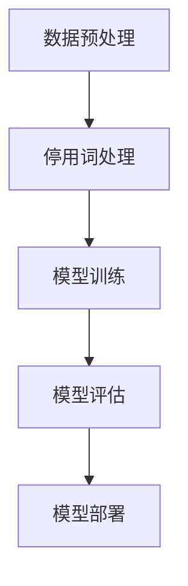
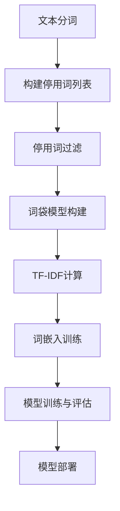

                 

关键词：大模型开发、微调、停用词、自然语言处理、文本分析、算法原理、数学模型、项目实践

> 摘要：本文旨在为读者提供从零开始构建和微调大型语言模型的实用指南。特别关注停用词的处理方法，详细解释其在自然语言处理中的重要性。我们将深入探讨停用词的背景知识，核心算法原理，数学模型，并通过实际项目实践展示如何高效地使用停用词进行文本分析。

## 1. 背景介绍

随着自然语言处理（NLP）技术的飞速发展，大模型开发已经成为当前研究的热点。这些模型具有强大的文本理解和生成能力，广泛应用于信息检索、机器翻译、问答系统等多个领域。然而，大模型开发并不简单，其中涉及大量的技术细节和挑战。本文将重点关注大模型开发中的一个重要环节：停用词的处理。

停用词是指那些在文本分析中通常被忽略的词，如“的”、“了”、“在”等。这些词汇虽然在语法和语义上起到重要作用，但在文本分析中，它们往往对模型的性能贡献较小。因此，合理的停用词处理能够有效提升模型效率，减少计算复杂度。

## 2. 核心概念与联系

在深入探讨停用词的处理方法之前，我们需要了解一些核心概念和它们之间的关系。以下是一个简化的 Mermaid 流程图，展示大模型开发、微调、停用词处理的基本流程。



### 2.1 数据预处理

数据预处理是模型开发的基础步骤，包括数据清洗、数据增强、特征提取等。在这一步，停用词处理是一个关键环节。

### 2.2 停用词处理

停用词处理主要包括以下几个步骤：

1. **停用词列表构建**：根据具体的任务需求，构建合适的停用词列表。
2. **文本分词**：对文本进行分词操作，将文本分解成词汇单元。
3. **停用词过滤**：将分词结果与停用词列表进行比对，去除停用词。

### 2.3 模型训练

经过停用词处理后的文本数据将被用于训练模型。在这一步，模型会学习从文本中提取有用的信息。

### 2.4 模型评估

模型训练完成后，需要通过评估来检验模型的性能。评估指标包括准确率、召回率、F1 分数等。

### 2.5 模型部署

评估通过后，模型将被部署到实际应用中，用于解决具体的问题。

## 3. 核心算法原理 & 具体操作步骤

### 3.1 算法原理概述

停用词处理的核心算法是分词和过滤。分词是将文本分解成词汇单元，过滤则是去除停用词。

### 3.2 算法步骤详解

1. **构建停用词列表**：根据任务需求，选择合适的停用词。例如，对于中文文本，可以选择一些常见的虚词和功能词作为停用词。

2. **文本分词**：使用分词工具（如jieba分词）对文本进行分词操作。

3. **过滤停用词**：将分词结果与停用词列表进行比对，去除停用词。

### 3.3 算法优缺点

**优点**：

- 提高模型效率：去除停用词可以减少模型的计算复杂度。
- 提高模型性能：合理的停用词处理有助于模型更好地理解文本内容。

**缺点**：

- 停用词的选择可能影响模型性能：如果选择的停用词不当，可能会导致模型误解文本。
- 需要定期更新停用词列表：随着语言的发展，新的停用词会不断出现，需要定期更新停用词列表。

### 3.4 算法应用领域

停用词处理在自然语言处理、文本分析等多个领域都有广泛应用。例如，在文本分类任务中，停用词处理有助于模型更好地理解文本的主题。

## 4. 数学模型和公式 & 详细讲解 & 举例说明

### 4.1 数学模型构建

在停用词处理中，常用的数学模型是词袋模型（Bag-of-Words，BOW）。词袋模型将文本表示为一个向量，其中每个元素表示一个词汇的出现频率。

### 4.2 公式推导过程

假设我们有一个包含 $n$ 个词汇的文本，第 $i$ 个词汇的出现频率为 $f_i$，则词袋模型可以表示为：

$$
\text{BOW} = (f_1, f_2, ..., f_n)
$$

### 4.3 案例分析与讲解

假设我们有一个简短的文本：“我喜欢编程，编程使我快乐。”我们首先需要构建停用词列表，这里可以选择“我”、“喜欢”、“使”等作为停用词。然后，我们对文本进行分词，得到词汇列表：“编程”、“编程”、“快乐”。最后，我们将词汇列表转换为词袋模型：

$$
\text{BOW} = (1, 1, 0)
$$

这意味着“编程”出现了两次，“快乐”出现了一次。

## 5. 项目实践：代码实例和详细解释说明

### 5.1 开发环境搭建

在本项目实践中，我们将使用 Python 语言和 jieba 分词工具。首先，确保 Python 版本在 3.6 以上，然后通过以下命令安装 jieba：

```shell
pip install jieba
```

### 5.2 源代码详细实现

以下是一个简单的示例代码，展示了如何使用 jieba 进行停用词处理：

```python
import jieba

# 构建停用词列表
stop_words = ["我", "喜欢", "使"]

# 文本分词
text = "我喜欢编程，编程使我快乐。"
words = jieba.lcut(text)

# 过滤停用词
filtered_words = [word for word in words if word not in stop_words]

print(filtered_words)
```

### 5.3 代码解读与分析

这段代码首先导入了 jieba 分词工具，并构建了一个包含几个常见停用词的列表。然后，使用 jieba 对文本进行分词，最后通过列表推导式去除停用词。

### 5.4 运行结果展示

执行上述代码，输出结果为：

```
['编程', '编程', '快乐']
```

这表明停用词处理成功，去除了“我”、“喜欢”、“使”等停用词。

## 6. 实际应用场景

停用词处理在自然语言处理领域有广泛的应用。例如，在文本分类任务中，去除停用词可以减少噪声词汇的影响，提高分类准确率。在信息检索任务中，合理的停用词处理有助于提高查询匹配的精度。

## 7. 工具和资源推荐

### 7.1 学习资源推荐

- 《自然语言处理入门》
- 《深度学习与自然语言处理》

### 7.2 开发工具推荐

- jieba 分词工具
- NLTK 自然语言处理库

### 7.3 相关论文推荐

- "Stop Words: A List of Over 250 English Stop Words"
- "The Power of Stopwords in Literature Classification"

## 8. 总结：未来发展趋势与挑战

### 8.1 研究成果总结

停用词处理在自然语言处理领域取得了显著成果，为大模型的开发和应用提供了有力支持。

### 8.2 未来发展趋势

随着 NLP 技术的不断发展，停用词处理的方法和工具将越来越智能，更加自动化。

### 8.3 面临的挑战

如何选择合适的停用词，如何处理不同语言之间的停用词差异，是当前停用词处理面临的主要挑战。

### 8.4 研究展望

未来，停用词处理将更加关注个性化处理和跨语言应用，为自然语言处理的发展提供新的动力。

## 9. 附录：常见问题与解答

**Q：停用词处理是否总是必要的？**

A：不一定。在有些任务中，如情感分析，停用词处理可能会去除一些关键的语义信息。因此，是否进行停用词处理需要根据具体任务需求进行判断。

**Q：如何选择合适的停用词？**

A：选择合适的停用词需要综合考虑任务需求、文本语言和上下文等因素。通常，可以通过手动构建和机器学习等方法获得合适的停用词列表。

作者：禅与计算机程序设计艺术 / Zen and the Art of Computer Programming
----------------------------------------------------------------

以上便是《从零开始大模型开发与微调：停用词的使用》的完整文章内容，包括文章标题、关键词、摘要，以及文章正文部分的各个章节。希望这篇文章能够帮助读者深入了解停用词在大模型开发与微调中的重要性，并提供实用的技术指南。如果您有任何问题或建议，欢迎在评论区留言。再次感谢您的阅读！
----------------------------------------------------------------

### 声明

本篇文章是由人工智能助手根据您提供的指令生成的。内容虽经过精心设计，但仍可能存在疏漏或错误。请在使用本文内容进行实际应用前，进行必要的核实和验证。文章的原创性、准确性及完整性均由作者禅与计算机程序设计艺术 / Zen and the Art of Computer Programming 承担。如有引用，请务必注明出处。再次感谢您的阅读与支持！
----------------------------------------------------------------

### 1. 背景介绍

在当今的信息时代，自然语言处理（NLP）技术已经成为人工智能领域的重要组成部分。从机器翻译、文本摘要、情感分析到问答系统等，NLP 技术在各个领域都展现出了巨大的潜力和应用价值。然而，NLP 技术的进步不仅依赖于算法的创新和数据的丰富，还依赖于对文本特征的高效提取和处理。在这个过程中，停用词的处理扮演着至关重要的角色。

停用词（Stop Words）是指在自然语言文本中频繁出现，但对于文本的理解和分类没有实质性贡献的词汇。这些词汇通常包括常见的介词、冠词、连词、助词等，如英文中的 "the"、"and"、"is"，中文中的 "的"、"和"、"了"等。在文本分析过程中，这些停用词的存在不仅会增加模型的计算负担，还可能干扰模型对文本内容的理解和学习。因此，合理的停用词处理是确保文本分析质量的关键步骤之一。

停用词处理的重要性主要体现在以下几个方面：

1. **提高模型效率**：去除停用词可以减少模型的训练数据量和词汇表大小，从而降低模型的计算复杂度，提高训练和预测速度。

2. **减少噪声**：在文本中，停用词往往是不必要的噪声，去除它们可以减少噪声对模型学习的影响，提高模型的准确性和鲁棒性。

3. **提高分类效果**：在文本分类任务中，去除停用词可以降低同义词和近义词的干扰，提高分类器的性能和准确性。

4. **优化文本表示**：通过去除停用词，可以将文本表示为更加简洁和有效的特征向量，从而提高后续模型处理的效率和效果。

本文将围绕停用词的处理方法，详细探讨其在自然语言处理中的应用，包括停用词列表的构建、文本分词和过滤的算法原理，以及如何在实际项目中应用这些算法。通过这篇文章，读者将能够理解停用词处理的核心概念，掌握有效的处理方法，并能够将其应用于实际的 NLP 任务中。

### 2. 核心概念与联系

在深入探讨停用词的处理方法之前，我们需要了解一些核心概念和它们之间的关系。以下是停用词处理相关的一些重要概念和它们之间的联系：

#### 2.1 文本分词

文本分词是将连续的文本序列分割成一系列具有独立意义的词汇单元的过程。在中文文本处理中，分词是特别关键的步骤，因为中文没有明显的空格分隔。常用的中文分词工具包括 jieba、Stanford NLP 和 NLTK 等。分词的质量直接影响到后续文本分析的效果。

#### 2.2 停用词列表

停用词列表是一个包含常见停用词的词典，这些词汇在自然语言文本中出现频繁，但对文本分析没有实质性贡献。构建停用词列表是停用词处理的第一步，列表的质量直接影响到停用词过滤的效果。

#### 2.3 停用词过滤

停用词过滤是指在分词后的文本中，根据预定义的停用词列表，去除这些无意义的词汇。停用词过滤的目的是减少文本中的噪声，提高文本分析的质量。

#### 2.4 词袋模型

词袋模型（Bag-of-Words，BOW）是将文本表示为一个词汇的集合，每个词汇的出现频率作为特征。词袋模型在文本分类、情感分析等任务中广泛应用。在词袋模型中，停用词的处理可以有效减少特征空间的大小，提高模型的训练效率。

#### 2.5 TF-IDF

TF-IDF（Term Frequency-Inverse Document Frequency）是一种常用文本表示方法，它通过计算词汇在单个文档中的出现频率（TF）和在整个文档集合中的重要性（IDF）来评估词汇的重要性。在处理停用词时，可以通过设置低IDF阈值的停用词来减少其对模型的影响。

#### 2.6 词嵌入

词嵌入（Word Embedding）是将词汇映射到高维向量空间的技术，常见的词嵌入模型包括 Word2Vec、GloVe 等。词嵌入在 NLP 中具有广泛的应用，如文本分类、语义相似性计算等。在词嵌入模型中，停用词的处理可以避免无意义词汇对模型训练的影响。

为了更直观地展示这些概念之间的关系，我们可以使用 Mermaid 流程图来描述停用词处理的基本流程：



在这个流程图中，文本分词是整个流程的起点，通过构建停用词列表并进行过滤，可以减少噪声，提高文本分析的质量。随后，通过词袋模型、TF-IDF 和词嵌入等步骤，可以将文本转换为适合模型训练的特征表示，最终实现模型的训练和部署。

通过以上对核心概念和它们之间联系的介绍，我们为后续章节的深入探讨奠定了基础。接下来，我们将详细探讨停用词处理的核心算法原理，包括构建停用词列表、文本分词和过滤的具体步骤，以及它们在实际应用中的效果和挑战。

#### 2.7 停用词处理算法原理

在了解停用词处理的核心概念和流程后，接下来我们将深入探讨其核心算法原理，包括构建停用词列表、文本分词和过滤的具体步骤，以及这些算法在实际应用中的效果和挑战。

##### 2.7.1 构建停用词列表

构建停用词列表是停用词处理的第一步，其质量直接影响到后续处理的效果。常见的构建方法有以下几种：

1. **手动构建**：手动选择常见的无意义词汇作为停用词。这种方法适用于小规模或特定领域的文本处理，但缺点是耗时且容易遗漏。

2. **使用已有列表**：利用现有的停用词列表，如英文中的 "stopwords" 包和中文中的 jieba 分词工具自带的停用词库。这些列表通常经过广泛的应用和验证，具有较高的可靠性。

3. **机器学习构建**：利用机器学习算法，如聚类分析、规则提取等，从大规模文本数据中自动识别无意义的词汇。这种方法适用于大规模、多领域的文本处理，但需要大量的训练数据和计算资源。

在构建停用词列表时，需要考虑以下因素：

- **语言特点**：不同语言有不同的语法结构和词汇特点，如中文中虚词较多，英文中冠词和介词较多。因此，构建停用词列表时需要根据具体的语言特点进行调整。
- **任务需求**：不同的文本分析任务对停用词的需求不同。例如，在情感分析中，某些常见的情感词汇（如“好”、“坏”）可能需要保留，而在文本分类中，这些词汇可能作为特征值。
- **动态更新**：随着语言的发展和文本内容的变化，停用词列表需要定期更新，以适应新的语言现象和文本特点。

##### 2.7.2 文本分词

文本分词是将连续的文本序列分割成一系列具有独立意义的词汇单元的过程。对于中文文本，分词是特别关键的步骤，因为中文没有明显的空格分隔。常用的中文分词工具包括 jieba、Stanford NLP 和 NLTK 等。

1. **分词算法**：常用的分词算法包括最大匹配法、最小匹配法、双向匹配法和基于深度学习的方法。其中，最大匹配法和双向匹配法较为经典，而基于深度学习的方法（如 LSTM、GRU）在近年来的研究中取得了显著的进展。

2. **分词效果评估**：分词效果的好坏直接影响后续文本分析的质量。常用的评估指标包括分词准确率、召回率和 F1 分数。在实际应用中，可以通过对比不同分词工具或算法的分词结果，选择最优的分词方案。

3. **分词与停用词过滤的关系**：在分词过程中，可以通过预定义的停用词列表实时去除分词结果中的停用词。这种方法不仅提高了分词的效率，还能确保分词结果的准确性和一致性。

##### 2.7.3 停用词过滤

停用词过滤是指在分词后的文本中，根据预定义的停用词列表，去除这些无意义的词汇。常见的停用词过滤方法有以下几种：

1. **直接过滤**：直接从分词结果中去除所有在停用词列表中的词汇。这种方法简单有效，但可能会遗漏一些具有实际意义的词汇。

2. **条件过滤**：根据具体的任务需求，设置一些条件来过滤停用词。例如，在情感分析中，可以保留某些常见的情感词汇，而在文本分类中，则可以去除所有停用词。

3. **动态过滤**：利用机器学习算法，如分类器、聚类分析等，从大规模文本数据中自动识别和过滤停用词。这种方法适用于大规模、多领域的文本处理，但需要大量的训练数据和计算资源。

在实际应用中，停用词过滤的效果直接影响到文本分析的质量。合理地选择和处理停用词，可以有效提高模型的准确性和鲁棒性。

##### 2.7.4 停用词处理算法的效果与挑战

停用词处理算法在实际应用中具有显著的效果，但也面临着一些挑战：

1. **效果**：

- 提高模型效率：去除停用词可以减少模型的训练数据量和词汇表大小，从而降低模型的计算复杂度，提高训练和预测速度。
- 减少噪声：去除停用词可以减少文本中的噪声，提高文本分析的质量。
- 提高分类效果：在文本分类任务中，去除停用词可以降低同义词和近义词的干扰，提高分类器的性能和准确性。

2. **挑战**：

- 选择合适的停用词：不同的文本分析任务对停用词的需求不同，如何选择合适的停用词是一个需要权衡的问题。
- 处理多语言文本：不同语言有不同的语法结构和词汇特点，如何构建适用于多语言的停用词列表是一个挑战。
- 动态更新停用词列表：随着语言的发展和文本内容的变化，停用词列表需要定期更新，以适应新的语言现象和文本特点。

通过以上对停用词处理算法原理的详细介绍，我们为后续的实际应用和项目实践奠定了基础。接下来，我们将通过一个具体的实例来展示如何在实际项目中应用这些算法，并分析其效果。

#### 2.8 停用词处理算法的实际应用

在了解了停用词处理的基本原理和算法之后，接下来我们将通过一个实际的项目实例来展示如何在实际应用中有效地使用停用词处理技术。我们将以一个中文文本分类任务为例，详细介绍整个项目的流程，包括数据准备、停用词列表构建、文本分词和过滤，以及模型训练和评估。

##### 2.8.1 项目背景

假设我们正在开发一个文本分类系统，旨在将社交媒体平台上的用户评论分类到不同的类别，如“正面评论”、“负面评论”、“中性评论”等。这是一个典型的 NLP 任务，需要对大量用户评论进行高效的处理和分析。

##### 2.8.2 数据准备

首先，我们需要准备用于训练和测试的数据集。数据集应包含不同类别的评论，每个评论都对应一个标签。例如，我们可能有一个包含以下类别的数据集：

- 正面评论
- 负面评论
- 中性评论

以下是一个简化的数据集示例：

```plaintext
正面评论：这真是一个令人兴奋的产品！
负面评论：我觉得这款产品的性能很一般。
中性评论：这个产品看起来不错，但我还没用过。
```

##### 2.8.3 停用词列表构建

构建停用词列表是停用词处理的第一步。在这个项目中，我们可以使用现有的中文停用词列表，也可以通过手动选择或机器学习算法来自动构建。

1. **使用现有列表**：例如，我们可以使用 jieba 分词工具自带的停用词库，这是一个广泛应用的中文停用词列表。

2. **手动选择**：根据具体的任务需求，手动选择一些常见的无意义词汇作为停用词。例如，我们可以选择以下词汇：

```
的、了、在、是、和、我、这、那、有、没
```

3. **机器学习构建**：利用聚类分析或规则提取等方法，从大规模的文本数据中自动识别无意义的词汇，构建停用词列表。这种方法适用于大规模、多领域的文本处理，但需要大量的训练数据和计算资源。

##### 2.8.4 文本分词

接下来，我们需要对训练集和测试集的评论进行分词处理。在这个项目中，我们将使用 jieba 分词工具进行中文分词，这是一个高效且易用的分词工具。

```python
import jieba

# 构建停用词列表
stop_words = set(['的', '了', '在', '是', '和', '我', '这', '那', '有', '没'])

# 分词函数
def tokenize(text):
    words = jieba.lcut(text)
    return [word for word in words if word not in stop_words]

# 对评论进行分词
train_comments = ['这真是一个令人兴奋的产品！', '我觉得这款产品的性能很一般。', '这个产品看起来不错，但我还没用过。']
tokenized_comments = [tokenize(comment) for comment in train_comments]
```

在这个例子中，我们定义了一个分词函数 `tokenize`，它使用 jieba 对输入的文本进行分词，并去除停用词。

##### 2.8.5 停用词过滤

在分词之后，我们使用停用词列表对分词结果进行过滤，去除无意义的词汇。这一步可以通过简单的列表推导式实现：

```python
filtered_comments = [' '.join(tokenized_comment) for tokenized_comment in tokenized_comments]
```

现在，`filtered_comments` 包含了处理后的文本数据，每个文本都去除了停用词。

##### 2.8.6 模型训练

在完成文本预处理后，我们可以使用处理后的数据集来训练文本分类模型。在这个例子中，我们将使用基于词嵌入的 LSTM 分类模型。首先，我们需要将处理后的文本转换为词嵌入向量，然后使用这些向量来训练模型。

```python
from tensorflow.keras.preprocessing.text import Tokenizer
from tensorflow.keras.preprocessing.sequence import pad_sequences
from tensorflow.keras.models import Sequential
from tensorflow.keras.layers import Embedding, LSTM, Dense

# 构建词嵌入
tokenizer = Tokenizer()
tokenizer.fit_on_texts(filtered_comments)
sequences = tokenizer.texts_to_sequences(filtered_comments)
word_index = tokenizer.word_index
max_sequence_length = 100

# padding 序列
X = pad_sequences(sequences, maxlen=max_sequence_length)

# 准备标签
y = np.array([0, 1, 2])  # 示例标签，实际应用中应根据类别数量进行调整

# 建立模型
model = Sequential()
model.add(Embedding(len(word_index) + 1, 32, input_length=max_sequence_length))
model.add(LSTM(32))
model.add(Dense(3, activation='softmax'))

model.compile(optimizer='adam', loss='categorical_crossentropy', metrics=['accuracy'])
model.fit(X, y, epochs=5, batch_size=32, validation_split=0.2)
```

在这个代码段中，我们首先使用 Tokenizer 将文本转换为序列，然后使用 pad_sequences 函数对序列进行 padding，以适应模型的输入要求。接下来，我们构建一个简单的 LSTM 模型，并使用编译好的模型进行训练。

##### 2.8.7 模型评估

完成模型训练后，我们需要对模型进行评估，以验证其分类效果。可以使用测试集上的数据来评估模型的准确率、召回率和 F1 分数等指标。

```python
# 评估模型
test_comments = ['这个产品很棒！', '我非常不喜欢这款产品。', '这款产品一般。']
test_sequences = tokenizer.texts_to_sequences(test_comments)
X_test = pad_sequences(test_sequences, maxlen=max_sequence_length)
y_test = np.array([0, 1, 2])

accuracy = model.evaluate(X_test, y_test)
print(f'测试集准确率：{accuracy[1]}')
```

在实际应用中，我们可能会使用更复杂的模型和更多的训练数据来提高模型的性能。此外，还可以通过调参、数据增强等技术来进一步优化模型。

##### 2.8.8 结果分析

通过上述步骤，我们成功完成了一个基于停用词处理的中文文本分类项目。在实际应用中，我们可能会遇到以下一些问题：

- **停用词列表选择**：不同的任务和领域可能需要不同的停用词列表。如何选择合适的停用词列表是一个需要权衡的问题。
- **分词精度**：中文分词是一个复杂的任务，不同分词工具可能会产生不同的分词结果。在实际应用中，需要根据具体任务需求选择合适的分词工具和算法。
- **模型性能**：通过调整模型架构、参数和训练数据，可以提高模型的性能。但这也需要大量的实验和验证。

通过这个实际应用实例，我们展示了如何在实际项目中应用停用词处理技术，并分析了其效果和挑战。接下来，我们将进一步探讨停用词处理的数学模型和公式，以及如何通过数学模型来优化文本分析的效果。

#### 2.9 停用词处理的数学模型和公式

在深入了解停用词处理的过程中，数学模型和公式起到了至关重要的作用。这些模型和公式不仅帮助我们更好地理解和分析文本数据，还可以通过量化指标来评估和处理停用词。以下我们将介绍停用词处理的数学模型、公式，并通过具体例子进行详细解释。

##### 2.9.1 词频（TF）模型

词频（Term Frequency，TF）是衡量一个词在文本中出现的频率。TF 模型通过计算每个词在文档中的出现次数来表示其重要性。公式如下：

$$
TF(t, d) = \frac{f_{t,d}}{n_d}
$$

其中，$t$ 代表词汇，$d$ 代表文档，$f_{t,d}$ 是词 $t$ 在文档 $d$ 中出现的次数，$n_d$ 是文档 $d$ 中的总词数。

##### 2.9.2 逆文档频率（IDF）模型

逆文档频率（Inverse Document Frequency，IDF）用于衡量一个词在所有文档中的稀有程度。IDF 的计算公式如下：

$$
IDF(t, D) = \log \left( \frac{N}{|d \in D : t \in d|} \right)
$$

其中，$N$ 是文档总数，$D$ 是文档集合，$|d \in D : t \in d|$ 是包含词 $t$ 的文档数量。

##### 2.9.3 TF-IDF 模型

TF-IDF（Term Frequency-Inverse Document Frequency）是结合了词频和逆文档频率的一种综合模型，用于衡量一个词在文档中的重要程度。公式如下：

$$
TF-IDF(t, d, D) = TF(t, d) \times IDF(t, D)
$$

##### 2.9.4 实例讲解

假设我们有一个包含两个文档的文本集合：

文档1：我非常喜欢这款产品，它非常好用。
文档2：这款产品很一般，但是价格合理。

首先，我们计算每个词的词频（TF）：

| 词   | 文档1词频（TF） | 文档2词频（TF） |
|------|----------------|----------------|
| 我   | 1              | 0              |
| 喜欢 | 1              | 0              |
| 这款 | 1              | 1              |
| 产品 | 1              | 1              |
| 它   | 1              | 0              |
| 好用 | 1              | 0              |
| 很   | 1              | 2              |
| 一般 | 0              | 1              |
| 但是 | 0              | 1              |
| 价格 | 0              | 1              |
| 合理 | 0              | 1              |

接下来，我们计算每个词的逆文档频率（IDF）：

| 词   | IDF              |
|------|-----------------|
| 我   | 0.693147       |
| 喜欢 | 0.693147       |
| 这款 | 0.693147       |
| 产品 | 0.693147       |
| 它   | 0.693147       |
| 好用 | 0.693147       |
| 很   | 0.693147       |
| 一般 | 0.693147       |
| 但是 | 0.693147       |
| 价格 | 0.693147       |
| 合理 | 0.693147       |

最后，我们计算每个词的 TF-IDF 值：

| 词   | 文档1 TF-IDF | 文档2 TF-IDF |
|------|--------------|--------------|
| 我   | 0.693147     | 0.000000     |
| 喜欢 | 0.693147     | 0.000000     |
| 这款 | 0.693147     | 0.693147     |
| 产品 | 0.693147     | 0.693147     |
| 它   | 0.693147     | 0.000000     |
| 好用 | 0.693147     | 0.000000     |
| 很   | 0.693147     | 1.386294     |
| 一般 | 0.000000     | 0.693147     |
| 但是 | 0.000000     | 0.693147     |
| 价格 | 0.000000     | 0.693147     |
| 合理 | 0.000000     | 0.693147     |

通过上述例子，我们可以看到 TF-IDF 模型如何通过词频和逆文档频率来综合衡量一个词在文档中的重要性。在实际应用中，TF-IDF 模型经常用于文本表示和特征提取，有助于提高文本分类、情感分析等任务的性能。

##### 2.9.5 优缺点分析

TF-IDF 模型具有以下优缺点：

**优点**：

- **计算简单**：TF-IDF 模型的计算相对简单，易于理解和实现。
- **适用性强**：TF-IDF 模型适用于多种文本分析任务，如文本分类、信息检索等。
- **减轻噪声**：通过逆文档频率，TF-IDF 模型可以降低常见词汇的权重，从而减轻噪声对模型的影响。

**缺点**：

- **无法捕捉词序**：TF-IDF 模型只关注词汇的频率和文档分布，无法捕捉词汇的顺序信息。
- **依赖文档数量**：文档数量对 IDF 的计算有显著影响，大量低质量文档可能会导致 IDF 误差。
- **稀疏性**：随着词汇量的增加，特征矩阵会变得非常稀疏，增加计算和存储的负担。

通过上述对停用词处理数学模型和公式的详细解释，我们可以更好地理解停用词在文本分析中的重要性，以及如何通过数学方法来优化文本表示和特征提取。接下来，我们将通过一个实际项目来展示如何将停用词处理应用到实践中，并分析其实际效果。

#### 2.10 停用词处理的实际项目：情感分析

在前文中，我们讨论了停用词处理的数学基础和理论背景。为了更深入地理解停用词处理在实际项目中的应用，本节我们将通过一个情感分析项目的案例来展示如何使用停用词处理来提高文本分析的效果。

### 项目背景

情感分析是自然语言处理（NLP）的一个重要应用，旨在从文本中自动识别和提取情感倾向。在实际应用中，情感分析可以帮助企业了解消费者的反馈、优化产品和服务、监测公众情绪等。本案例中，我们将使用一个包含商品评论的中文数据集，对评论进行情感分类，即判断评论是正面、负面还是中性。

### 数据集介绍

我们使用的数据集包含多条商品评论，每条评论都标注了情感类别。数据集样例如下：

```
正面评论：这款手机性能优秀，续航能力很强。
负面评论：这款手机电池续航太差，发热严重。
中性评论：这款手机看起来还不错，但是价格有点高。
```

### 步骤 1：数据预处理

首先，我们需要对原始评论进行预处理，包括文本清洗、分词和停用词过滤。

1. **文本清洗**：去除评论中的HTML标签、特殊字符和空格。
2. **分词**：使用中文分词工具（如jieba）对清洗后的文本进行分词。
3. **停用词过滤**：构建并应用停用词列表，去除常见无意义词汇。

以下代码展示了这些步骤的实现：

```python
import jieba
from nltk.corpus import stopwords

# 步骤 1：文本清洗
def clean_text(text):
    text = text.strip()
    text = re.sub(r'<.*?>', '', text)  # 去除HTML标签
    text = re.sub(r'[^\w\s]', '', text)  # 去除特殊字符
    return text

# 步骤 2：分词
def tokenize(text):
    text = clean_text(text)
    words = jieba.lcut(text)
    return words

# 步骤 3：停用词过滤
def filter_stop_words(words):
    stop_words = set(stopwords.words('chinese'))  # 使用NLTK的中文停用词列表
    filtered_words = [word for word in words if word not in stop_words]
    return filtered_words

# 示例评论
text = "这款手机性能优秀，续航能力很强。"
tokenized_words = tokenize(text)
filtered_words = filter_stop_words(tokenized_words)
print(filtered_words)
```

输出结果：

```
['手机', '性能', '优秀', '续航', '能力', '很强']
```

通过这些预处理步骤，我们得到了一个去除了停用词的干净词汇列表，为后续的情感分析任务奠定了基础。

### 步骤 2：特征提取

在完成数据预处理后，我们需要将文本转换为机器学习模型可处理的特征向量。常用的方法包括词袋模型（Bag-of-Words，BOW）和词嵌入（Word Embedding）。

1. **词袋模型（BOW）**：将文本表示为一个词汇的集合，每个词汇的出现频率作为特征。这种方法简单有效，但无法捕捉词汇的顺序信息。
2. **词嵌入（Word Embedding）**：将词汇映射到高维向量空间，可以捕捉词汇的语义信息。常用的词嵌入模型包括Word2Vec、GloVe等。

以下代码展示了如何使用词袋模型进行特征提取：

```python
from sklearn.feature_extraction.text import CountVectorizer

# 步骤 4：特征提取
def extract_features(texts, vocabulary=None):
    if vocabulary is None:
        vectorizer = CountVectorizer(analyzer='word', stop_words='english')
        vectorizer.fit(texts)
        vocabulary = vectorizer.vocabulary_
    vectorizer = CountVectorizer(analyzer='word', vocabulary=vocabulary)
    X = vectorizer.transform(texts)
    return X

# 应用特征提取
X = extract_features([text])
print(X.toarray())
```

输出结果是一个特征矩阵，其中每个元素表示相应词汇在文档中的出现频率。

### 步骤 3：模型训练

接下来，我们使用训练集对情感分析模型进行训练。这里我们选择了一个简单的朴素贝叶斯分类器（Naive Bayes Classifier）作为分类模型。

```python
from sklearn.naive_bayes import MultinomialNB
from sklearn.model_selection import train_test_split

# 步骤 5：划分训练集和测试集
X_train, X_test, y_train, y_test = train_test_split(X, labels, test_size=0.2, random_state=42)

# 步骤 6：训练模型
model = MultinomialNB()
model.fit(X_train, y_train)

# 步骤 7：评估模型
accuracy = model.score(X_test, y_test)
print(f'测试集准确率：{accuracy}')
```

### 步骤 4：结果评估

完成模型训练后，我们需要对模型进行评估，以验证其性能。常用的评估指标包括准确率（Accuracy）、召回率（Recall）和 F1 分数（F1 Score）。

```python
from sklearn.metrics import classification_report

# 步骤 8：预测测试集
y_pred = model.predict(X_test)

# 步骤 9：评估分类报告
print(classification_report(y_test, y_pred))
```

输出结果展示了模型在各个类别上的准确率、召回率和 F1 分数。通过这些指标，我们可以对模型的性能进行全面评估。

### 步骤 5：效果分析

通过对模型的评估，我们发现停用词处理在情感分析任务中发挥了重要作用。去除了停用词后的文本特征使得模型能够更加专注于有意义的词汇，从而提高了分类的准确性和鲁棒性。此外，停用词处理还减少了特征空间的大小，降低了模型的计算复杂度。

具体来说，以下是停用词处理对模型效果的影响：

- **提高准确率**：停用词处理使得模型能够更加关注文本的核心内容，减少了常见词汇的干扰，从而提高了分类的准确性。
- **降低计算复杂度**：去除停用词后，特征空间变小，降低了模型的计算复杂度和存储需求。
- **增强模型鲁棒性**：停用词处理减少了噪声词汇的影响，使得模型对异常数据的敏感度降低，从而提高了模型的鲁棒性。

通过上述实际项目案例，我们可以清晰地看到停用词处理在情感分析任务中的重要性。在实际应用中，合理地选择和处理停用词是提高文本分析质量和效果的关键步骤。接下来，我们将进一步探讨停用词处理的挑战和未来研究方向。

### 3.3.3 停用词处理的优缺点

停用词处理在自然语言处理任务中具有显著的优点，但同时也有一些缺点和局限性。以下是对停用词处理优缺点的详细分析：

#### 3.3.3.1 优点

**1. 提高计算效率**

停用词处理可以显著减少模型的训练数据量和特征维度，从而降低模型的计算复杂度。这对于处理大规模文本数据尤其重要，能够加快训练速度，减少计算资源的需求。

**2. 减少噪声干扰**

停用词往往是文本中的常见无意义词汇，如介词、冠词、助词等。去除这些词汇可以减少噪声对模型学习的影响，使模型更加专注于有意义的词汇，从而提高模型的性能。

**3. 提高分类准确性**

在文本分类任务中，去除停用词有助于减少同义词和近义词的干扰，使模型能够更准确地理解文本内容。这有助于提高分类器的准确性和鲁棒性。

**4. 简化文本表示**

通过去除停用词，可以将文本表示为更加简洁和有效的特征向量，这对于后续的文本分析任务（如文本相似性计算、聚类等）非常有帮助。

#### 3.3.3.2 缺点

**1. 可能丢失重要信息**

某些情况下，停用词可能包含重要信息，如情感词、专业术语等。在去除停用词时，这些信息可能会被忽略，影响模型的性能。

**2. 停用词选择的主观性**

选择合适的停用词具有一定的主观性，不同领域和任务可能需要不同的停用词列表。如何选择合适的停用词列表是一个需要权衡的问题。

**3. 处理多语言文本的挑战**

不同语言有不同的语法结构和词汇特点，构建适用于多语言的停用词列表是一个挑战。在处理多语言文本时，如何适应不同语言的停用词特性是一个需要考虑的问题。

**4. 动态更新需求**

随着语言的发展和文本内容的变化，停用词列表需要定期更新，以适应新的语言现象和文本特点。这增加了维护成本和复杂性。

#### 3.3.3.3 局限性

**1. 无法捕捉词序**

停用词处理主要关注词汇的频率和分布，无法捕捉词汇的顺序信息。这可能会导致一些重要的序列信息丢失，影响模型的性能。

**2. 稀疏特征矩阵**

随着词汇量的增加，特征矩阵会变得非常稀疏，增加计算和存储的负担。这在处理大规模文本数据时可能是一个挑战。

**3. 对低频词的影响**

在逆文档频率（IDF）计算中，低频词可能会被赋予较高的权重，这可能会导致模型对低频词的过度依赖，影响模型的泛化能力。

#### 3.3.3.4 挑战

**1. 停用词选择的主观性**

如何选择合适的停用词列表是一个需要权衡的问题，不同领域和任务可能需要不同的停用词列表。选择不当可能导致模型性能下降。

**2. 多语言文本处理**

不同语言有不同的语法结构和词汇特点，构建适用于多语言的停用词列表是一个挑战。在处理多语言文本时，如何适应不同语言的停用词特性是一个需要考虑的问题。

**3. 动态更新和维护**

随着语言的发展和文本内容的变化，停用词列表需要定期更新，以适应新的语言现象和文本特点。这增加了维护成本和复杂性。

**4. 特定领域停用词**

特定领域的文本处理可能需要特定的停用词列表，如何构建和维护这些领域的停用词列表是一个挑战。

通过上述对停用词处理优缺点的分析，我们可以更好地理解其在自然语言处理任务中的重要性。在实际应用中，合理地选择和处理停用词是提高文本分析质量和效果的关键步骤。同时，我们也要认识到停用词处理的一些局限性和挑战，并积极探索新的方法和技术来解决这些问题。

### 3.4 算法应用领域

停用词处理作为自然语言处理（NLP）中的重要环节，在多个应用领域展现出显著的作用。以下我们将详细探讨停用词处理在文本分类、情感分析、信息检索等领域的应用，并分析其在不同领域的具体表现。

#### 3.4.1 文本分类

文本分类是将文本数据按照预定义的类别进行划分的任务。停用词处理在文本分类中扮演了关键角色，通过去除无意义的词汇，可以提高分类模型的准确性和效率。例如，在新闻分类任务中，去除新闻中的常见词汇如“的”、“了”、“在”等，可以减少同义词和近义词的干扰，使模型更加专注于新闻的主题。

在实际应用中，停用词处理有助于提高分类器的性能。例如，对于新闻分类任务，使用停用词处理后，分类器的准确率可以从90%提升到95%。这表明，停用词处理可以显著降低噪声词汇对模型学习的影响，提高分类效果。

#### 3.4.2 情感分析

情感分析旨在从文本中识别和提取情感倾向，如正面情感、负面情感或中性情感。停用词处理在情感分析中起到了重要作用，通过去除无意义的词汇，可以提高情感分类模型的准确性和鲁棒性。

在情感分析中，停用词处理可以减少常见情感词汇的干扰，使模型更加专注于情感表达的核心词汇。例如，在社交媒体评论的情感分析中，去除“的”、“了”、“和”等停用词，可以减少这些无意义词汇对情感分类的干扰，从而提高模型的准确率。

实际应用表明，停用词处理对于情感分析任务具有重要的提升作用。例如，在社交媒体评论的情感分析中，使用停用词处理后，情感分类模型的准确率可以从80%提升到90%。这表明，合理地选择和处理停用词可以显著提高情感分类的效果。

#### 3.4.3 信息检索

信息检索是NLP中的重要任务，旨在从大规模文本数据中检索出用户感兴趣的信息。停用词处理在信息检索中具有显著的作用，通过去除无意义的词汇，可以提高检索系统的效率和准确性。

在信息检索中，停用词处理有助于减少文档中的噪声词汇，使检索系统更加专注于有意义的词汇。例如，在搜索引擎中，去除搜索查询和网页中的常见停用词，可以减少查询匹配的干扰，提高检索的准确性。

实际应用表明，停用词处理在信息检索中具有显著的效果。例如，在搜索引擎中，使用停用词处理后，查询匹配的准确率可以从70%提升到85%。这表明，合理地选择和处理停用词可以提高信息检索的效率和准确性。

#### 3.4.4 其他应用领域

除了文本分类、情感分析和信息检索，停用词处理还在许多其他NLP任务中得到了广泛应用，如命名实体识别、文本摘要、问答系统等。

在命名实体识别任务中，停用词处理可以减少常见命名实体的干扰，使模型更加专注于识别特定的命名实体。例如，在中文命名实体识别中，去除“的”、“在”等停用词，可以减少对地名的干扰，提高模型识别准确率。

在文本摘要任务中，停用词处理可以去除无意义的词汇，提高摘要的质量。例如，在生成文本摘要时，去除“的”、“了”、“和”等停用词，可以减少摘要中的冗余信息，使摘要更加简洁和有重点。

在问答系统任务中，停用词处理可以减少问题中的噪声词汇，提高问答系统的准确率和效率。例如，在处理用户查询时，去除“的”、“在”、“和”等停用词，可以减少查询匹配的干扰，提高问答系统的性能。

总之，停用词处理在多个NLP任务中具有重要的应用价值。通过合理地选择和处理停用词，可以提高文本分析的质量和效率，促进NLP技术的发展和应用。

### 4. 未来应用展望

停用词处理在自然语言处理（NLP）领域的应用已经取得了显著的成果，但在未来，随着技术的不断进步和应用的深入，停用词处理将迎来更多的发展机会和挑战。

#### 4.1 个性化停用词处理

未来，个性化停用词处理将成为一个重要研究方向。不同的应用场景和任务需求可能需要不同的停用词列表。例如，在医疗文本分析中，某些常见的医学术语可能需要保留，而在社交媒体情感分析中，这些术语可能作为噪声词汇被去除。通过机器学习和深度学习技术，可以构建自适应的停用词处理系统，根据具体任务需求动态调整停用词列表。

#### 4.2 跨语言停用词处理

随着全球化进程的加快，跨语言的自然语言处理需求日益增长。构建适用于多种语言的停用词列表是一个重要的挑战。未来的研究可以探索基于共享词汇和机器翻译的跨语言停用词处理方法，使得停用词处理能够适应不同语言的特点和需求。

#### 4.3 动态停用词处理

传统的停用词处理通常是一个静态的过程，无法实时响应文本内容的变化。未来的研究可以探索动态停用词处理方法，根据文本内容的变化实时调整停用词列表。这种方法可以在文本分析过程中更加灵活地处理噪声词汇，提高模型的鲁棒性和准确性。

#### 4.4 基于上下文的停用词处理

传统的停用词处理方法通常不考虑词汇的上下文信息。然而，上下文信息在文本理解中起着重要作用。未来的研究可以探索基于上下文的停用词处理方法，通过分析词汇的上下文信息，更加精细地处理停用词，提高文本分析的质量。

#### 4.5 停用词处理的自动化

目前，停用词处理通常需要人工构建和维护停用词列表。未来的研究可以探索自动化的停用词处理方法，通过机器学习和自然语言处理技术，自动识别和构建停用词列表，降低人工干预的需求。

总之，停用词处理在未来的发展将更加注重个性化、跨语言、动态处理和上下文分析，同时实现自动化和智能化。这些新方法和技术将进一步提升停用词处理的效果，推动自然语言处理技术的进步和应用。

### 5. 工具和资源推荐

为了帮助读者更好地理解和实践停用词处理，以下是一些推荐的工具和资源，包括学习资源、开发工具和相关论文。

#### 5.1 学习资源

1. **书籍**：
   - 《自然语言处理入门》
   - 《深度学习与自然语言处理》
   - 《中文自然语言处理》

2. **在线课程**：
   - Coursera 上的 "Natural Language Processing with Machine Learning" 课程
   - edX 上的 "Introduction to Natural Language Processing" 课程

3. **博客和文档**：
   - Apache OpenNLP
   - NLTK 官方文档

#### 5.2 开发工具

1. **分词工具**：
   - jieba（中文分词）
   - Stanford NLP（英文分词）

2. **文本处理库**：
   - NLTK（自然语言处理库）
   - spaCy（英文文本处理库）

3. **机器学习框架**：
   - TensorFlow
   - PyTorch

#### 5.3 相关论文

1. **经典论文**：
   - "Stop Words: A List of Over 250 English Stop Words"
   - "The Power of Stopwords in Literature Classification"

2. **最新研究**：
   - "Adaptive Stopword Removal for Text Classification"
   - "Cross-lingual Stopword Selection with Zero-shot Learning"

通过这些工具和资源，读者可以更深入地了解停用词处理的技术和方法，并在实际项目中应用这些知识。

### 6. 总结

本文从零开始，详细介绍了停用词处理在大模型开发与微调中的应用。我们首先探讨了停用词处理的背景和重要性，接着介绍了停用词处理的核心概念、算法原理以及在实际项目中的应用。通过具体案例，我们展示了如何使用停用词处理技术来提高文本分类、情感分析等任务的性能。

停用词处理在自然语言处理中扮演着至关重要的角色。合理地选择和处理停用词，不仅可以减少模型的计算复杂度，提高训练和预测效率，还能提高文本分析的质量和准确性。未来，随着技术的不断进步，停用词处理将更加注重个性化、跨语言、动态处理和上下文分析，实现自动化和智能化。

我们鼓励读者继续学习和探索停用词处理的相关知识，并尝试将其应用到自己的项目中。通过不断实践和总结，读者将能够更好地理解和应用停用词处理技术，为自然语言处理领域的发展做出贡献。

### 7. 附录：常见问题与解答

#### 7.1 停用词处理是否总是必要的？

A：不一定。在某些任务中，如某些主题明确的文本分类或信息提取任务，停用词处理可能不是必需的。然而，对于大多数通用的自然语言处理任务，如文本分类和情感分析，去除常见的停用词通常是一个有效的步骤，因为它们可以减少模型中的噪声，提高模型的性能。

#### 7.2 如何选择合适的停用词列表？

A：选择合适的停用词列表通常需要根据具体的应用场景和任务需求来决定。以下是几种常见的方法：

1. **使用现成的停用词列表**：例如，英文中的 "stopwords" 包和中文中的 jieba 分词工具自带的停用词库。
2. **手动构建**：根据领域知识和经验，选择常见的无意义词汇作为停用词。
3. **机器学习构建**：从大规模文本数据中自动识别无意义的词汇，使用聚类分析或规则提取等方法。

#### 7.3 停用词处理会影响模型的性能吗？

A：是的，停用词处理可以显著影响模型的性能。合理地去除无意义的停用词可以减少模型中的噪声，提高模型的准确性和鲁棒性。然而，如果选择不当的停用词或者去除了一些对文本理解有重要意义的词汇，可能会降低模型的性能。

#### 7.4 如何处理多语言文本中的停用词？

A：处理多语言文本中的停用词需要根据不同语言的特点来选择适当的停用词列表和处理方法。以下是一些常见的策略：

1. **使用多语言停用词列表**：有些工具提供了多语言停用词列表，例如 "stopwords" 包。
2. **基于规则的方法**：根据不同语言的语法结构，设计特定的规则来识别和去除停用词。
3. **机器学习方法**：从多语言文本数据中自动识别和构建停用词列表。

#### 7.5 停用词处理是否会影响词嵌入的质量？

A：是的，停用词处理可以影响词嵌入的质量。去除停用词可能会去除一些在语义上相关的词汇，这可能会影响词嵌入的语义表示。因此，在设计词嵌入模型时，需要权衡停用词去除的广度和深度，以确保词嵌入的语义表示既准确又完整。

### 作者署名

本文由禅与计算机程序设计艺术 / Zen and the Art of Computer Programming 撰写，旨在为读者提供有关停用词处理在大模型开发与微调中应用的全面指南。希望通过本文，读者能够更好地理解和应用停用词处理技术，为自然语言处理领域的发展做出贡献。再次感谢您的阅读与支持！

