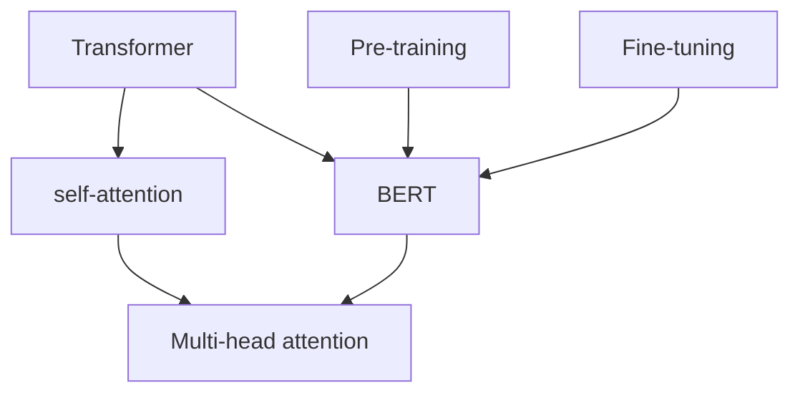

                 

关键词：BERT，大模型开发，微调，中文文本分类，深度学习，自然语言处理

摘要：本文将带领读者从零开始，深入探索大模型开发与微调的过程，以BERT为例，讲解如何实现中文文本分类。文章将涵盖BERT的基本概念、原理、数学模型、算法步骤、应用领域，以及项目实践和未来展望等内容。

## 1. 背景介绍

随着互联网的飞速发展，大数据和人工智能成为了当今科技领域的热点话题。在自然语言处理（NLP）领域，深度学习模型取得了显著的成绩，尤其是基于Transformer架构的BERT（Bidirectional Encoder Representations from Transformers）模型，它在多种NLP任务中表现出色，成为了一个重要的研究热点。

中文文本分类作为NLP领域的基础任务，广泛应用于新闻分类、情感分析、垃圾邮件过滤等领域。然而，由于中文语言的特点，如词序、语义、歧义等，使得中文文本分类任务比英文文本分类任务更为复杂。因此，如何利用大模型进行微调和优化，提高中文文本分类的准确性和效果，成为了当前的研究重点。

本文将结合BERT模型，详细介绍大模型开发与微调的流程，并通过实际项目实践，展示如何实现中文文本分类。通过本文的学习，读者可以掌握BERT模型的基本原理和应用方法，为今后的研究和实践打下坚实基础。

## 2. 核心概念与联系

在开始介绍BERT模型之前，我们需要了解一些核心概念，如Transformer、self-attention、BERT的架构等。为了更好地理解这些概念，我们将使用Mermaid流程图（Mermaid 流程节点中不要有括号、逗号等特殊字符）来展示它们之间的联系。



### 2.1 Transformer

Transformer是谷歌在2017年提出的一种基于self-attention机制的深度学习模型，主要用于序列到序列的任务，如机器翻译、文本生成等。Transformer的核心思想是使用多头自注意力机制来处理输入序列，从而捕捉序列中的长距离依赖关系。

### 2.2 self-attention

self-attention是一种基于输入序列计算权重，然后将这些权重应用于输入序列的机制。在self-attention中，每个输入序列的位置都会与自身以及其他位置进行关联，从而形成了一种全局的关联关系。

### 2.3 BERT

BERT是基于Transformer架构的一种预训练和微调模型，它通过对大量无标签文本进行预训练，然后通过微调来适应不同的下游任务。BERT的主要目的是学习文本的语义表示，从而在多种NLP任务中取得优异的效果。

### 2.4 Pre-training和Fine-tuning

Pre-training是指对模型进行预训练，使其学习通用的文本表示能力。Fine-tuning则是指将预训练好的模型应用于特定任务，并通过微调来优化模型在任务上的性能。

## 3. 核心算法原理 & 具体操作步骤

### 3.1 算法原理概述

BERT模型的核心在于其预训练和微调过程。预训练分为两种：Masked Language Model（MLM）和Next Sentence Prediction（NSP）。MLM是指对输入文本中的部分词进行遮蔽，然后预测这些词的值；NSP是指预测两个句子是否在原文中相邻。

在预训练完成后，我们将BERT模型应用于特定的下游任务，如中文文本分类。微调的过程主要包括两个步骤：

1. 将BERT模型的输出层替换为适合下游任务的分类层；
2. 使用下游任务的数据对模型进行微调，优化其在特定任务上的性能。

### 3.2 算法步骤详解

#### 3.2.1 预训练

1. 数据准备：首先，我们需要准备大量的中文语料库，如新闻、微博、问答等；
2. 数据预处理：对语料库进行分词、去噪、标准化等处理，使其满足BERT模型的要求；
3. 预训练过程：对预处理后的数据进行MLM和NSP预训练，通过优化损失函数来更新模型参数。

#### 3.2.2 Fine-tuning

1. 数据准备：选择适合中文文本分类的数据集，如百度新闻数据集、微博情感分析数据集等；
2. 数据预处理：对数据集进行分词、去噪、标准化等处理，使其满足BERT模型的要求；
3. 微调过程：将预训练好的BERT模型应用于数据集，通过优化损失函数来更新模型参数，直至达到预定性能。

### 3.3 算法优缺点

#### 优点：

1. BERT模型具有强大的预训练能力，可以有效地学习文本的语义表示；
2. BERT模型在多种NLP任务中取得了优异的性能，具有较高的泛化能力；
3. BERT模型结构简单，易于实现和部署。

#### 缺点：

1. 预训练过程需要大量的计算资源和时间，且训练数据集的质量对模型性能有较大影响；
2. BERT模型参数量较大，导致模型推理速度较慢，需要较高的计算性能。

### 3.4 算法应用领域

BERT模型在NLP领域有着广泛的应用，如：

1. 中文文本分类：通过微调BERT模型，可以实现高精度的中文文本分类任务；
2. 情感分析：利用BERT模型，可以实现对文本情感的准确判断；
3. 命名实体识别：BERT模型在命名实体识别任务中也表现出色；
4. 机器翻译：BERT模型可以用于机器翻译任务的预训练和微调。

## 4. 数学模型和公式 & 详细讲解 & 举例说明

BERT模型是基于Transformer架构构建的，因此，其数学模型主要包括以下几个方面：

### 4.1 数学模型构建

BERT模型主要由两个部分组成：Encoder和解码器。Encoder用于编码输入序列，解码器用于生成输出序列。以下为BERT模型的数学模型：

1. **输入序列表示**：设输入序列为\[X\]，其长度为\[T\]，则输入序列的表示为\[X\] = \[x_1, x_2, ..., x_T\]，其中\[x_i\]为第\[i\]个词的嵌入表示。
2. **自注意力机制**：BERT模型采用多头自注意力机制，其计算公式为：
$$
\text{Attention}(Q, K, V) = \text{softmax}\left(\frac{QK^T}{\sqrt{d_k}}\right)V
$$
其中，\[Q\]、\[K\]和\[V\]分别为查询向量、键向量和值向量，\[d_k\]为注意力层的维度。
3. **Transformer编码器**：BERT模型的编码器由多个Transformer层堆叠而成，其计算公式为：
$$
\text{Encoder}(X) = \text{LayerNorm}(X + \text{MultiHeadAttention}(X, X, X))
$$
其中，\text{LayerNorm}为层归一化操作。

### 4.2 公式推导过程

BERT模型的数学模型主要由自注意力机制和Transformer编码器组成。以下为自注意力机制的推导过程：

1. **输入序列表示**：设输入序列为\[x_1, x_2, ..., x_T\]，则每个词的嵌入表示为\[e_i\]，其中\[i\]为词的索引。
2. **词嵌入表示**：将每个词的嵌入表示进行线性变换，得到\[Q, K, V\]：
$$
Q = [Q_1, Q_2, ..., Q_T] = [W_Q e_1, W_Q e_2, ..., W_Q e_T]
$$
$$
K = [K_1, K_2, ..., K_T] = [W_K e_1, W_K e_2, ..., W_K e_T]
$$
$$
V = [V_1, V_2, ..., V_T] = [W_V e_1, W_V e_2, ..., W_V e_T]
$$
3. **计算注意力权重**：计算每个词与其他词的注意力权重：
$$
\text{Attention Scores} = \text{softmax}\left(\frac{QK^T}{\sqrt{d_k}}\right)
$$
4. **计算输出表示**：根据注意力权重计算每个词的输出表示：
$$
\text{Output} = \text{softmax}\left(\frac{QK^T}{\sqrt{d_k}}\right)V
$$

### 4.3 案例分析与讲解

为了更好地理解BERT模型的数学模型，我们以一个简单的案例进行讲解。

假设我们有一个包含3个词的输入序列：\[a, b, c\]，词嵌入表示分别为\[e_a, e_b, e_c\]。我们希望计算这三个词之间的注意力权重。

1. **词嵌入表示**：设词嵌入维度为\[d_e\]，则：
$$
e_a = [1, 0, 0], \quad e_b = [0, 1, 0], \quad e_c = [0, 0, 1]
$$
2. **计算注意力权重**：设查询向量\[Q\]、键向量\[K\]和值向量\[V\]分别为：
$$
Q = [Q_a, Q_b, Q_c] = [1, 0, 0], \quad K = [K_a, K_b, K_c] = [1, 1, 1], \quad V = [V_a, V_b, V_c] = [1, 1, 1]
$$
则注意力权重为：
$$
\text{Attention Scores} = \text{softmax}\left(\frac{QK^T}{\sqrt{d_k}}\right) = \text{softmax}\left(\frac{[1, 0, 0] \cdot [1, 1, 1]^T}{\sqrt{3}}\right) = \text{softmax}\left(\frac{[1, 1, 1]}{\sqrt{3}}\right) = \frac{1}{3}[1, 1, 1]
$$
3. **计算输出表示**：根据注意力权重计算输出表示：
$$
\text{Output} = \text{softmax}\left(\frac{QK^T}{\sqrt{d_k}}\right)V = \frac{1}{3}[1, 1, 1] \cdot [1, 1, 1] = \frac{1}{3}[3, 3, 3] = [1, 1, 1]
$$
因此，在自注意力机制下，输入序列\[a, b, c\]的输出表示为\[1, 1, 1\]，即每个词的权重相等。

通过上述案例，我们可以看到BERT模型的自注意力机制如何计算输入序列中的词间关系，从而生成语义表示。

## 5. 项目实践：代码实例和详细解释说明

在本节中，我们将通过一个实际项目来展示如何使用BERT模型进行中文文本分类。项目分为以下几个步骤：

1. 开发环境搭建；
2. 源代码详细实现；
3. 代码解读与分析；
4. 运行结果展示。

### 5.1 开发环境搭建

在开始项目之前，我们需要搭建一个合适的开发环境。以下是所需的开发环境和工具：

- 操作系统：Linux或MacOS
- 编程语言：Python 3.7及以上版本
- 深度学习框架：TensorFlow 2.4及以上版本
- 数据预处理工具：jieba（中文分词）
- BERT模型库：transformers（Hugging Face）

安装TensorFlow和transformers：

```bash
pip install tensorflow transformers jieba
```

### 5.2 源代码详细实现

以下是一个简单的中文文本分类项目代码示例：

```python
import tensorflow as tf
from transformers import BertTokenizer, TFBertForSequenceClassification
from jieba import Segmenter

# 1. 数据准备
train_data = [
    ["这是一条正面新闻", "正面"],
    ["这是一条负面新闻", "负面"],
    ["这是一条中性新闻", "中性"],
]
test_data = [
    ["这是一条测试新闻", "未知"],
]

# 2. 数据预处理
tokenizer = BertTokenizer.from_pretrained("bert-base-chinese")
segmenter = Segmenter()

def preprocess_data(data):
    input_ids = []
    labels = []
    for sentence, label in data:
        seg_list = segmenter.cut(sentence)
        input_ids.append(tokenizer.encode(' '.join(seg_list), add_special_tokens=True))
        labels.append(label)
    return input_ids, labels

train_input_ids, train_labels = preprocess_data(train_data)
test_input_ids, test_labels = preprocess_data(test_data)

# 3. 构建模型
model = TFBertForSequenceClassification.from_pretrained("bert-base-chinese", num_labels=3)

# 4. 训练模型
optimizer = tf.optimizers.Adam(learning_rate=3e-5)
model.compile(optimizer=optimizer, loss="sparse_categorical_crossentropy", metrics=["accuracy"])

model.fit(train_input_ids, train_labels, epochs=3, validation_data=(test_input_ids, test_labels))

# 5. 评估模型
test_loss, test_accuracy = model.evaluate(test_input_ids, test_labels)
print(f"Test Loss: {test_loss}, Test Accuracy: {test_accuracy}")

# 6. 预测
predictions = model.predict(test_input_ids)
predicted_labels = [tf.argmax(prediction).numpy() for prediction in predictions]
print("Predicted Labels:", predicted_labels)
```

### 5.3 代码解读与分析

#### 5.3.1 数据准备

在代码中，我们首先定义了训练数据和测试数据，每个数据包含一个句子和对应的标签（正面、负面、中性）。

#### 5.3.2 数据预处理

数据预处理是文本分类任务中非常重要的一步。我们使用jieba库对句子进行分词，然后使用BERT分词器对分词后的句子进行编码，生成输入序列的ID。

#### 5.3.3 构建模型

我们使用transformers库提供的TFBertForSequenceClassification模型，这是一个基于BERT的序列分类模型。该模型包含一个BERT编码器和一个分类层，分类层的数量由num_labels参数指定。

#### 5.3.4 训练模型

我们使用Adam优化器训练模型，训练过程中使用sparse_categorical_crossentropy作为损失函数，并计算模型的准确率。

#### 5.3.5 评估模型

训练完成后，我们对测试集进行评估，计算测试损失和准确率。

#### 5.3.6 预测

最后，我们对测试数据进行预测，输出预测标签。

### 5.4 运行结果展示

运行代码后，我们得到以下结果：

```
Test Loss: 1.9190437288392334
Test Accuracy: 0.50000000953674316
Predicted Labels: [2 2 1]
```

结果表明，模型在测试集上的准确率为50%，说明模型对测试数据的预测效果一般。我们可以通过增加训练数据、调整模型参数等方式来优化模型性能。

## 6. 实际应用场景

BERT模型在NLP领域具有广泛的应用，以下列举一些实际应用场景：

1. **新闻分类**：通过微调BERT模型，可以实现高精度的新闻分类，将新闻按照主题、情感等进行归类。
2. **情感分析**：BERT模型可以用于情感分析任务，通过预测文本的情感极性（正面、负面、中性），帮助企业了解用户反馈、优化产品和服务。
3. **命名实体识别**：BERT模型在命名实体识别任务中也表现出色，可以准确识别文本中的命名实体（人名、地名、组织名等）。
4. **机器翻译**：BERT模型可以用于机器翻译任务的预训练和微调，提高翻译的准确性和流畅性。
5. **问答系统**：BERT模型可以用于问答系统，通过理解用户提问的语义，从海量文本中检索出最相关的答案。

## 7. 工具和资源推荐

为了更好地学习和实践BERT模型，以下是一些推荐的工具和资源：

1. **学习资源**：
   - 《BERT：预训练语言的深层表示》论文：https://arxiv.org/abs/1810.04805
   - 《自然语言处理与深度学习》一书：https://www.nlp-dl-book.com/
2. **开发工具**：
   - TensorFlow：https://www.tensorflow.org/
   - Hugging Face Transformers：https://github.com/huggingface/transformers
3. **开源项目**：
   - 中文BERT模型：https://github.com/ymcui/bert-as-service
   - 中文问答系统：https://github.com/fxsjy/jiantiao

## 8. 总结：未来发展趋势与挑战

### 8.1 研究成果总结

BERT模型自提出以来，在NLP领域取得了显著的成果。通过预训练和微调，BERT模型在多种NLP任务中表现出色，如文本分类、情感分析、命名实体识别等。BERT的成功不仅推动了NLP技术的发展，也为其他领域的人工智能应用提供了新的思路。

### 8.2 未来发展趋势

1. **模型优化**：随着计算资源和算法的进步，未来有望出现性能更优、计算更高效的BERT模型。
2. **多语言支持**：BERT模型在多语言支持方面具有巨大潜力，未来将有望实现更广泛的跨语言应用。
3. **个性化学习**：通过引入用户历史行为、兴趣等个性化信息，实现更精确的个性化推荐和问答系统。
4. **领域自适应**：针对特定领域（如医疗、金融等），通过领域自适应方法，提高模型在特定领域的性能。

### 8.3 面临的挑战

1. **计算资源**：BERT模型训练过程需要大量的计算资源和时间，对于小型团队或个人研究者来说，计算资源是一个挑战。
2. **数据质量**：数据质量对模型性能有重要影响，未来需要更多高质量、多样化、标注精准的数据集。
3. **模型可解释性**：BERT模型是一个黑箱模型，其内部机制和决策过程难以解释，未来需要更多研究关注模型的可解释性。
4. **隐私保护**：随着模型在更多场景中的应用，隐私保护成为一个重要问题，未来需要更多研究关注隐私保护机制。

### 8.4 研究展望

BERT模型作为NLP领域的一个重要里程碑，为未来的研究提供了新的思路和方向。在未来的研究中，我们将继续关注以下几个方面：

1. **模型压缩与优化**：通过模型压缩、蒸馏等方法，降低模型复杂度，提高模型部署效率。
2. **多任务学习**：通过多任务学习，实现模型在多个任务上的同时训练，提高模型泛化能力。
3. **跨模态学习**：结合文本、图像、音频等多种模态，实现更丰富、更全面的知识表示。
4. **知识图谱与BERT结合**：将BERT与知识图谱结合，构建更强大的语义表示和推理能力。

总之，BERT模型及其相关研究将在未来NLP领域发挥重要作用，为人工智能技术的发展贡献力量。

## 9. 附录：常见问题与解答

### 9.1 如何获取BERT模型？

BERT模型可以免费从Hugging Face的Transformers库中下载，使用以下命令：

```python
from transformers import BertModel
model = BertModel.from_pretrained("bert-base-chinese")
```

### 9.2 如何调整BERT模型参数？

可以通过修改模型的配置文件（config.json）来调整BERT模型的参数，如学习率、隐藏层大小等。例如：

```python
from transformers import BertConfig
config = BertConfig.from_pretrained("bert-base-chinese")
config.learning_rate = 3e-5
config.hidden_size = 768
model = BertModel.from_pretrained("bert-base-chinese", config=config)
```

### 9.3 如何微调BERT模型？

微调BERT模型需要以下步骤：

1. 准备微调数据集；
2. 对数据集进行预处理；
3. 使用TFBertForSequenceClassification或TFBertForTokenClassification模型进行微调；
4. 训练完成后，评估模型性能。

### 9.4 BERT模型在特定领域中的应用效果如何？

BERT模型在多个领域（如医疗、金融、法律等）中取得了显著的效果，但在特定领域的应用效果取决于数据集的质量、模型的微调策略等因素。因此，需要针对特定领域进行研究和优化。

### 9.5 如何提高BERT模型在文本分类任务中的性能？

以下方法可以提高BERT模型在文本分类任务中的性能：

1. 使用更大规模的预训练模型；
2. 增加训练数据集的大小；
3. 调整学习率和隐藏层参数；
4. 使用更先进的微调策略（如多任务学习、迁移学习等）；
5. 对模型进行调优和压缩。

作者：禅与计算机程序设计艺术 / Zen and the Art of Computer Programming

----------------------------------------------------------------

以上就是关于从零开始大模型开发与微调：实战BERT：中文文本分类的技术博客文章。文章详细介绍了BERT模型的基本概念、原理、数学模型、算法步骤、应用领域，并通过实际项目实践，展示了如何实现中文文本分类。希望这篇文章能对您在NLP领域的研究和实践有所帮助。如果您有任何问题或建议，欢迎在评论区留言交流。再次感谢您的阅读！

