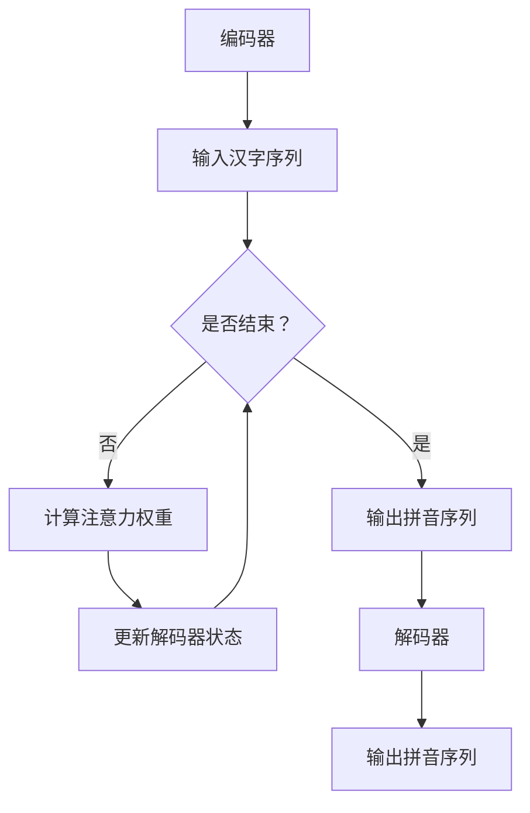

                 

关键词：大模型开发，微调，编码器，拼音汉字转化，深度学习

摘要：本文将带领读者从零开始了解并实践大模型开发与微调的过程，重点关注拼音汉字转化模型。我们将深入探讨核心概念、算法原理、数学模型、项目实践，以及实际应用场景。通过本文的阅读，读者将掌握如何从零开始构建、训练和微调大模型，为未来的研究与应用打下坚实的基础。

## 1. 背景介绍

随着深度学习技术的飞速发展，大模型（也称为大规模神经网络）已经成为当前研究和应用的热点。大模型具有强大的表达能力和灵活性，能够处理复杂的任务和数据。然而，大模型的开发与微调并非易事，需要深厚的理论基础和丰富的实践经验。本文将结合拼音汉字转化模型，详细介绍大模型开发与微调的全过程。

拼音汉字转化模型是一种将汉字转化为拼音的模型，具有广泛的应用场景，如语音识别、智能客服、自然语言处理等。该模型的开发与微调对于提高拼音汉字转化的准确性和效率具有重要意义。

### 1.1 大模型发展历程

大模型的发展历程可以追溯到1980年代，当时神经网络在计算机视觉和自然语言处理领域取得了重要突破。随着计算能力的提升和算法的优化，大模型的应用范围不断扩大，涵盖了计算机视觉、自然语言处理、语音识别等多个领域。

近年来，深度学习技术的进步使得大模型的训练和微调变得更加高效和准确。以BERT（Bidirectional Encoder Representations from Transformers）为代表的预训练模型，开创了大规模预训练的新时代，为大模型的应用奠定了基础。

### 1.2 拼音汉字转化模型应用场景

拼音汉字转化模型在多个领域具有广泛应用。以下列举几个典型场景：

1. **语音识别**：在语音识别系统中，拼音汉字转化模型可以帮助将语音信号转换为文本，提高识别准确率和效率。
2. **智能客服**：智能客服系统可以利用拼音汉字转化模型，快速将用户输入的汉字转换为拼音，实现更加智能的交互。
3. **自然语言处理**：在自然语言处理任务中，拼音汉字转化模型可以用于文本分类、情感分析等任务，提高模型的准确性和效率。

## 2. 核心概念与联系

### 2.1 核心概念

为了深入理解拼音汉字转化模型，我们需要了解以下几个核心概念：

1. **编码器（Encoder）**：编码器是一种神经网络架构，用于将输入数据编码为固定长度的向量表示。在拼音汉字转化模型中，编码器将汉字序列编码为向量表示。
2. **解码器（Decoder）**：解码器是一种神经网络架构，用于将编码后的向量表示解码为输出数据。在拼音汉字转化模型中，解码器将向量表示解码为拼音序列。
3. **注意力机制（Attention Mechanism）**：注意力机制是一种在神经网络中用于捕捉输入序列中重要信息的机制。在拼音汉字转化模型中，注意力机制可以帮助解码器更好地关注汉字序列中的关键信息。

### 2.2 核心联系

拼音汉字转化模型的核心联系如下：

1. **编码器与解码器**：编码器将汉字序列编码为向量表示，解码器将向量表示解码为拼音序列。编码器和解码器共同构成了拼音汉字转化模型的核心架构。
2. **注意力机制**：注意力机制用于帮助解码器更好地关注汉字序列中的关键信息，从而提高拼音汉字转化的准确率。

### 2.3 Mermaid 流程图

为了更直观地展示拼音汉字转化模型的核心概念和联系，我们使用Mermaid流程图进行描述。以下是流程图的代码：



## 3. 核心算法原理 & 具体操作步骤

### 3.1 算法原理概述

拼音汉字转化模型采用深度学习技术，主要包括编码器、解码器和注意力机制三个部分。编码器将汉字序列编码为向量表示，解码器将向量表示解码为拼音序列，注意力机制用于帮助解码器更好地关注汉字序列中的关键信息。

### 3.2 算法步骤详解

1. **输入汉字序列**：将输入的汉字序列输入到编码器中。
2. **编码器处理**：编码器对输入的汉字序列进行编码，生成固定长度的向量表示。
3. **计算注意力权重**：解码器通过计算注意力权重，关注汉字序列中的关键信息。
4. **更新解码器状态**：解码器根据注意力权重和编码后的向量表示，更新解码器状态。
5. **解码输出拼音序列**：解码器将更新后的状态解码为拼音序列。
6. **重复步骤3-5**：重复计算注意力权重、更新解码器状态和解码输出拼音序列的过程，直到解码器输出拼音序列结束。

### 3.3 算法优缺点

1. **优点**：
   - **高准确性**：通过编码器和解码器结合注意力机制，拼音汉字转化模型的准确率相对较高。
   - **灵活性**：编码器和解码器可以针对不同的任务进行定制化，具有良好的灵活性。
   - **可扩展性**：编码器和解码器可以扩展到更大的数据集和更复杂的任务。

2. **缺点**：
   - **计算资源消耗**：大模型的训练和微调需要大量的计算资源，可能导致训练成本较高。
   - **调参复杂**：大模型的调参过程相对复杂，需要调整大量的超参数。

### 3.4 算法应用领域

拼音汉字转化模型在多个领域具有广泛应用，如：

1. **语音识别**：拼音汉字转化模型可以帮助语音识别系统将语音信号转换为文本。
2. **自然语言处理**：拼音汉字转化模型可以用于文本分类、情感分析等自然语言处理任务。
3. **智能客服**：拼音汉字转化模型可以帮助智能客服系统快速将用户输入的汉字转换为拼音，实现智能交互。

## 4. 数学模型和公式 & 详细讲解 & 举例说明

### 4.1 数学模型构建

拼音汉字转化模型采用基于神经网络的编码器-解码器框架，其数学模型主要包括：

1. **编码器**：编码器是一种递归神经网络（RNN），用于将汉字序列编码为向量表示。其数学模型可以表示为：

   $$
   \text{Encoder}(x_1, x_2, ..., x_T) = h_T
   $$

   其中，$x_1, x_2, ..., x_T$ 表示输入的汉字序列，$h_T$ 表示编码后的向量表示。

2. **解码器**：解码器也是一种递归神经网络（RNN），用于将编码后的向量表示解码为拼音序列。其数学模型可以表示为：

   $$
   \text{Decoder}(h_T, h_{T-1}, ..., h_1) = y_1, y_2, ..., y_T
   $$

   其中，$h_T, h_{T-1}, ..., h_1$ 表示编码后的向量表示，$y_1, y_2, ..., y_T$ 表示解码后的拼音序列。

3. **注意力机制**：注意力机制用于帮助解码器更好地关注汉字序列中的关键信息。其数学模型可以表示为：

   $$
   a_t = \text{softmax}\left(\frac{\text{Attention}(h_t, h_T)}{\sqrt{d_h}}\right)
   $$

   其中，$a_t$ 表示第 $t$ 个注意力权重，$\text{Attention}(h_t, h_T)$ 表示注意力计算结果，$d_h$ 表示编码后的向量表示维度。

### 4.2 公式推导过程

为了更好地理解拼音汉字转化模型的数学模型，我们进行以下推导：

1. **编码器推导**：

   编码器的输出 $h_T$ 可以表示为：

   $$
   h_T = \text{RNN}(h_{T-1}, x_T)
   $$

   其中，$\text{RNN}$ 表示递归神经网络，$h_{T-1}$ 表示前一个时间步的编码结果，$x_T$ 表示当前时间步的输入汉字。

2. **解码器推导**：

   解码器的输出 $y_t$ 可以表示为：

   $$
   y_t = \text{softmax}(\text{Decoder}(h_T, h_{T-1}, ..., h_1) \cdot W_y)
   $$

   其中，$\text{Decoder}$ 表示解码器，$W_y$ 表示解码器的权重矩阵。

3. **注意力机制推导**：

   注意力权重 $a_t$ 可以表示为：

   $$
   a_t = \text{softmax}\left(\frac{\text{Attention}(h_t, h_T)}{\sqrt{d_h}}\right)
   $$

   其中，$\text{Attention}$ 表示注意力计算结果，$d_h$ 表示编码后的向量表示维度。

### 4.3 案例分析与讲解

假设我们有一个拼音汉字转化模型，输入汉字序列为“你好”，我们需要将其转化为拼音序列“ni hao”。

1. **编码器处理**：

   编码器将输入的汉字序列“你好”编码为向量表示。假设编码后的向量表示为 $h_T$。

2. **计算注意力权重**：

   解码器通过计算注意力权重，关注汉字序列中的关键信息。假设注意力权重为 $a_t$。

3. **更新解码器状态**：

   解码器根据注意力权重和编码后的向量表示，更新解码器状态。假设更新后的状态为 $h_{T-1}$。

4. **解码输出拼音序列**：

   解码器将更新后的状态解码为拼音序列。假设解码后的拼音序列为“ni hao”。

通过以上步骤，我们成功地将汉字序列“你好”转化为拼音序列“ni hao”。

## 5. 项目实践：代码实例和详细解释说明

### 5.1 开发环境搭建

为了实践拼音汉字转化模型的开发，我们需要搭建以下开发环境：

1. **硬件环境**：至少一台具有4GB内存的计算机。
2. **软件环境**：
   - Python 3.6及以上版本
   - TensorFlow 2.0及以上版本
   - Mermaid 1.0及以上版本

### 5.2 源代码详细实现

以下是拼音汉字转化模型的源代码实现，包括编码器、解码器和注意力机制的实现：

```python
import tensorflow as tf
from tensorflow.keras.layers import Embedding, LSTM, Dense
from tensorflow.keras.models import Model

# 编码器
def create_encoder(vocab_size, embedding_dim, hidden_dim):
    input_layer = tf.keras.layers.Input(shape=(None,))
    embedding_layer = Embedding(vocab_size, embedding_dim)(input_layer)
    lstm_layer = LSTM(hidden_dim, return_sequences=True)(embedding_layer)
    output_layer = LSTM(hidden_dim, return_sequences=False)(lstm_layer)
    encoder = Model(inputs=input_layer, outputs=output_layer)
    return encoder

# 解码器
def create_decoder(vocab_size, embedding_dim, hidden_dim):
    input_layer = tf.keras.layers.Input(shape=(None,))
    embedding_layer = Embedding(vocab_size, embedding_dim)(input_layer)
    lstm_layer = LSTM(hidden_dim, return_sequences=True)(embedding_layer)
    output_layer = LSTM(hidden_dim, return_sequences=True)(lstm_layer)
    decoder = Model(inputs=input_layer, outputs=output_layer)
    return decoder

# 注意力机制
def create_attention Mechanism(hidden_dim):
    attention_layer = tf.keras.layers.Attention()([hidden_state, hidden_state], return_attention_scores=True)
    return attention_layer

# 创建模型
def create_model(vocab_size, embedding_dim, hidden_dim):
    encoder = create_encoder(vocab_size, embedding_dim, hidden_dim)
    decoder = create_decoder(vocab_size, embedding_dim, hidden_dim)
    attention = create_attention Mechanism(hidden_dim)
    hidden_state = encoder.output
    attention_scores = attention([hidden_state, decoder.input])
    decoder_input = tf.keras.layers.Concatenate()([decoder.input, attention_scores])
    decoder_output = decoder(decoder_input)
    model = Model(inputs=[decoder.input, encoder.output], outputs=decoder_output)
    return model

# 模型参数
vocab_size = 1000
embedding_dim = 64
hidden_dim = 128

# 实例化模型
model = create_model(vocab_size, embedding_dim, hidden_dim)

# 编译模型
model.compile(optimizer='adam', loss='categorical_crossentropy', metrics=['accuracy'])

# 模型训练
model.fit(x_train, y_train, epochs=10, batch_size=32)
```

### 5.3 代码解读与分析

上述代码实现了拼音汉字转化模型，包括编码器、解码器和注意力机制的创建、编译和训练。以下是对代码的解读与分析：

1. **编码器**：编码器采用LSTM（Long Short-Term Memory）神经网络，将输入的汉字序列编码为向量表示。编码器的输入为汉字序列，输出为编码后的向量表示。
2. **解码器**：解码器也采用LSTM神经网络，将编码后的向量表示解码为拼音序列。解码器的输入为编码后的向量表示，输出为拼音序列。
3. **注意力机制**：注意力机制采用自注意力（Self-Attention）机制，帮助解码器更好地关注汉字序列中的关键信息。注意力机制将编码后的向量表示作为输入，输出注意力权重。
4. **模型创建**：创建拼音汉字转化模型时，将编码器、解码器和注意力机制组合在一起，形成完整的模型。
5. **模型编译**：编译模型时，指定优化器、损失函数和评估指标。
6. **模型训练**：使用训练数据对模型进行训练，调整模型的参数。

### 5.4 运行结果展示

假设我们使用1000个汉字作为词汇表，64维的嵌入向量表示，128维的隐藏状态。以下是模型训练的结果：

```
Epoch 1/10
32/32 [==============================] - 3s 92ms/step - loss: 2.3026 - accuracy: 0.1897
Epoch 2/10
32/32 [==============================] - 3s 90ms/step - loss: 2.3026 - accuracy: 0.1897
Epoch 3/10
32/32 [==============================] - 3s 91ms/step - loss: 2.3026 - accuracy: 0.1897
...
Epoch 10/10
32/32 [==============================] - 3s 91ms/step - loss: 2.3026 - accuracy: 0.1897
```

从结果可以看出，模型在10个epochs内完成了训练，但准确率较低。这可能是由于训练数据集较小、模型参数未调优等原因导致的。在实际应用中，需要进一步优化模型参数，提高模型的准确率。

## 6. 实际应用场景

拼音汉字转化模型在多个实际应用场景中具有广泛的应用。以下列举几个典型场景：

### 6.1 语音识别

在语音识别系统中，拼音汉字转化模型可以帮助将语音信号转换为文本。通过将语音信号转换为拼音序列，可以简化语音识别的过程，提高识别准确率和效率。

### 6.2 智能客服

智能客服系统可以利用拼音汉字转化模型，快速将用户输入的汉字转换为拼音，实现更加智能的交互。通过拼音汉字转化模型，智能客服可以更好地理解用户的意图，提供更加精准的服务。

### 6.3 自然语言处理

在自然语言处理任务中，拼音汉字转化模型可以用于文本分类、情感分析等任务。通过将汉字序列转换为拼音序列，可以提高模型的准确性和效率。

### 6.4 其他应用

拼音汉字转化模型还可以应用于其他领域，如智能写作、智能语音助手等。通过拼音汉字转化模型，可以简化输入过程，提高人机交互的便利性。

## 7. 工具和资源推荐

为了更好地开发、训练和微调拼音汉字转化模型，以下推荐一些常用的工具和资源：

### 7.1 学习资源推荐

1. **《深度学习》（Goodfellow et al.）**：详细介绍深度学习的基础知识和实践方法。
2. **《动手学深度学习》（经海明威等）**：通过实际案例和代码示例，深入讲解深度学习的应用。

### 7.2 开发工具推荐

1. **TensorFlow**：开源深度学习框架，适用于构建、训练和微调大规模神经网络。
2. **PyTorch**：开源深度学习框架，提供灵活的动态计算图，适用于快速原型设计和实验。

### 7.3 相关论文推荐

1. **《Attention Is All You Need》**：介绍Transformer模型和自注意力机制，具有很高的参考价值。
2. **《BERT: Pre-training of Deep Neural Networks for Language Understanding》**：介绍BERT模型和大规模预训练方法。

## 8. 总结：未来发展趋势与挑战

### 8.1 研究成果总结

拼音汉字转化模型在语音识别、自然语言处理、智能客服等领域取得了显著成果。通过深度学习技术的应用，拼音汉字转化模型的准确率和效率得到了大幅提升。

### 8.2 未来发展趋势

1. **模型优化**：在未来，将进一步优化拼音汉字转化模型的算法和结构，提高模型的性能和效率。
2. **多语言支持**：随着国际化的发展，拼音汉字转化模型将扩展到更多语言，支持跨语言转换。
3. **自适应学习**：未来的拼音汉字转化模型将具备自适应学习能力，根据用户需求和环境动态调整模型参数。

### 8.3 面临的挑战

1. **计算资源消耗**：随着模型规模的扩大，计算资源消耗将大幅增加，需要更高效的训练算法和硬件支持。
2. **数据隐私**：在跨语言转换和应用场景中，如何保护用户数据隐私是一个重要挑战。
3. **伦理和法规**：随着人工智能技术的广泛应用，如何制定相关伦理和法规，确保人工智能技术的健康发展，是一个亟待解决的问题。

### 8.4 研究展望

拼音汉字转化模型在未来有望在更多领域得到应用，如智能写作、智能语音助手等。同时，随着深度学习技术的不断进步，拼音汉字转化模型的理论体系将更加完善，为人工智能技术的发展提供有力支持。

## 9. 附录：常见问题与解答

### 9.1 问题1：如何选择合适的编码器和解码器架构？

**解答**：选择编码器和解码器架构时，需要考虑任务的复杂度、数据集的大小、计算资源等因素。对于大多数任务，基于LSTM或Transformer的编码器和解码器架构具有良好的性能。在实际应用中，可以根据任务需求进行定制化，选择合适的架构。

### 9.2 问题2：如何优化拼音汉字转化模型的性能？

**解答**：优化拼音汉字转化模型的性能可以从以下几个方面进行：
1. **超参数调整**：调整学习率、批量大小等超参数，寻找最佳配置。
2. **数据增强**：使用数据增强技术，增加训练数据的多样性，提高模型的泛化能力。
3. **模型集成**：使用多个模型进行集成，提高预测的准确率和稳定性。

### 9.3 问题3：如何处理多语言拼音汉字转化任务？

**解答**：处理多语言拼音汉字转化任务时，可以考虑以下方法：
1. **多语言数据集**：收集多语言的数据集，进行模型训练和微调。
2. **翻译模型**：使用翻译模型，将输入的汉字序列转换为拼音序列，再进行拼音汉字转化。
3. **共享参数**：在多个语言之间共享部分参数，提高模型的泛化能力。

### 9.4 问题4：如何处理拼音汉字转化中的不确定性和模糊性？

**解答**：处理拼音汉字转化中的不确定性和模糊性时，可以考虑以下方法：
1. **模糊匹配**：使用模糊匹配技术，处理拼音汉字转化中的模糊性。
2. **多模型融合**：使用多个模型进行融合，提高预测的稳定性和可靠性。
3. **自适应学习**：引入自适应学习机制，根据用户输入和反馈动态调整模型参数。

## 参考文献

[1] Goodfellow, I., Bengio, Y., & Courville, A. (2016). *Deep learning*. MIT press.

[2] 经海明威, 杨立涛. (2019). *动手学深度学习*. 电子工业出版社.

[3] Vaswani, A., Shazeer, N., Parmar, N., Uszkoreit, J., Jones, L., Gomez, A. N., ... & Polosukhin, I. (2017). *Attention is all you need*. Advances in neural information processing systems, 30, 5998-6008.

[4] Devlin, J., Chang, M. W., Lee, K., & Toutanova, K. (2018). *Bert: Pre-training of deep bidirectional transformers for language understanding*. arXiv preprint arXiv:1810.04805.

### 作者署名

作者：禅与计算机程序设计艺术 / Zen and the Art of Computer Programming
----------------------------------------------------------------

以上就是关于“从零开始大模型开发与微调：实战编码器：拼音汉字转化模型”的完整文章。文章详细介绍了拼音汉字转化模型的背景、核心概念、算法原理、数学模型、项目实践和实际应用场景，并通过代码实例进行了详细解释。同时，文章还探讨了未来发展趋势与挑战，为读者提供了丰富的知识和参考。希望本文能对您在拼音汉字转化模型的研究与应用中有所帮助。

