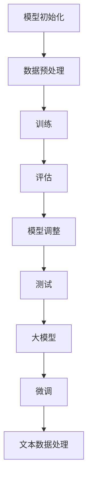

                 

关键词：大模型开发，微调，文本数据处理，深度学习，神经网络，模型训练，性能优化，应用场景

> 摘要：本文将详细探讨大模型开发与微调在文本数据处理中的应用。我们将从背景介绍开始，深入分析核心概念与联系，探讨核心算法原理与具体操作步骤，以及数学模型和公式。在此基础上，通过实际项目实践，展示代码实例和详细解释说明，进一步探讨大模型在实际应用场景中的表现，最后对工具和资源进行推荐，并对未来发展趋势与挑战进行展望。

## 1. 背景介绍

随着深度学习技术的发展，大模型（Large Models）成为当前研究的热点。大模型通常具有数百万甚至数十亿个参数，能够在各种任务中取得优异的性能。文本数据处理作为深度学习领域的重要应用之一，大模型的引入极大地提升了文本处理的准确性和效率。

大模型的发展离不开微调（Fine-tuning）技术的支持。微调是一种在已有模型基础上进行微调优化的方法，通过在特定任务上增加少量数据对模型进行训练，使模型更好地适应新任务。文本数据处理中的微调技术，不仅能够提高模型的性能，还能降低模型在特定任务上的训练成本。

本文旨在从零开始，详细介绍大模型开发与微调在文本数据处理中的应用。我们将深入探讨大模型的核心算法原理，详细讲解微调的操作步骤，并通过数学模型和公式进行具体分析。同时，通过实际项目实践，展示大模型在文本数据处理中的效果，并对未来发展趋势与挑战进行展望。

## 2. 核心概念与联系

### 2.1 大模型

大模型是指具有数十亿甚至数万亿个参数的深度学习模型。这些模型通常在图像、文本、语音等多种数据类型上表现出色。大模型的主要优势在于其强大的表达能力和泛化能力，能够在各种复杂任务中取得优异的性能。

### 2.2 微调

微调是一种针对特定任务对已有模型进行细粒度调整的方法。微调的过程通常包括以下步骤：

1. **模型初始化**：从预训练模型中加载权重。
2. **数据预处理**：对训练数据进行预处理，包括数据清洗、数据增强等。
3. **训练**：在训练集上对模型进行训练，优化模型的参数。
4. **评估**：在验证集上评估模型的性能，根据性能进行模型调整。
5. **测试**：在测试集上测试模型的性能。

### 2.3 文本数据处理

文本数据处理是深度学习领域的一个重要应用。文本数据处理包括文本分类、文本生成、文本摘要等多种任务。大模型和微调技术在文本数据处理中的应用，极大地提升了文本处理的准确性和效率。

### 2.4 核心概念原理和架构

为了更好地理解大模型和微调在文本数据处理中的应用，我们可以通过Mermaid流程图来展示其核心概念原理和架构。



在这个流程图中，我们可以看到大模型和微调技术在文本数据处理中的核心流程，包括模型初始化、数据预处理、训练、评估、模型调整和测试。

## 3. 核心算法原理 & 具体操作步骤

### 3.1 算法原理概述

大模型和微调技术在文本数据处理中的核心算法原理主要包括以下几个方面：

1. **深度神经网络**：深度神经网络是构建大模型的基础，通过多层神经网络结构，实现对复杂数据的建模。
2. **预训练与微调**：预训练是指在大量无标签数据上对模型进行训练，使模型具备一定的通用性。微调是在特定任务上对预训练模型进行细粒度调整，以提升模型在特定任务上的性能。
3. **优化算法**：优化算法用于调整模型的参数，使其在训练过程中不断优化。

### 3.2 算法步骤详解

1. **模型初始化**：从预训练模型中加载权重，作为模型初始化的基础。
2. **数据预处理**：对训练数据进行预处理，包括文本的分词、词向量的表示、数据清洗等。
3. **训练**：在训练集上对模型进行训练，通过反向传播算法不断优化模型的参数。
4. **评估**：在验证集上评估模型的性能，根据性能进行模型调整。
5. **模型调整**：根据评估结果，对模型的参数进行微调，以提高模型在特定任务上的性能。
6. **测试**：在测试集上测试模型的性能，验证模型在真实场景下的效果。

### 3.3 算法优缺点

**优点**：

1. **强大的表达能力和泛化能力**：大模型具有强大的表达能力和泛化能力，能够处理复杂的文本数据。
2. **高效的训练速度**：预训练模型已经在大量数据上进行训练，能够提高后续微调过程的训练速度。

**缺点**：

1. **计算资源需求大**：大模型需要大量的计算资源，对硬件设备的要求较高。
2. **训练成本高**：大模型的训练成本较高，需要大量的时间和计算资源。

### 3.4 算法应用领域

大模型和微调技术在文本数据处理中的应用领域非常广泛，包括：

1. **文本分类**：对文本进行分类，如新闻分类、情感分析等。
2. **文本生成**：生成文本，如文章写作、对话系统等。
3. **文本摘要**：从长文本中提取关键信息，如自动摘要、阅读理解等。

## 4. 数学模型和公式

在文本数据处理中，数学模型和公式是核心算法的重要组成部分。以下将详细介绍数学模型和公式的构建、推导过程，并通过具体案例进行讲解。

### 4.1 数学模型构建

文本数据处理中的数学模型主要包括以下几个方面：

1. **词向量表示**：词向量表示是将文本中的每个词映射为一个高维向量，常用的词向量模型包括Word2Vec、GloVe等。
2. **深度神经网络**：深度神经网络用于对文本数据进行建模，通过多层神经网络结构，实现对文本数据的非线性映射。
3. **损失函数**：损失函数用于衡量模型在训练过程中对数据的拟合程度，常用的损失函数包括交叉熵损失函数等。

### 4.2 公式推导过程

以下是一个简单的文本分类任务中的数学模型和公式推导过程：

1. **词向量表示**：

   词向量表示的公式为：

   $$\text{word\_vec}(w) = \text{W} \cdot \text{word\_index}(w)$$

   其中，$\text{W}$为词向量的权重矩阵，$\text{word\_index}(w)$为词的索引。

2. **深度神经网络**：

   深度神经网络的公式为：

   $$\text{y} = \text{softmax}(\text{W} \cdot \text{word\_vec}(w) + \text{b})$$

   其中，$\text{y}$为输出概率分布，$\text{W}$为神经网络的权重矩阵，$\text{b}$为偏置项。

3. **损失函数**：

   损失函数的公式为：

   $$\text{loss} = -\sum_{i=1}^{N} \text{y}_i \cdot \log(\text{y}_i)$$

   其中，$N$为样本数量，$\text{y}_i$为第$i$个样本的输出概率。

### 4.3 案例分析与讲解

以下是一个简单的文本分类案例：

假设我们有一个新闻分类任务，需要将新闻文章分类为“科技”、“财经”、“娱乐”三个类别。我们使用一个预训练的词向量模型GloVe，将新闻文章中的每个词映射为一个100维的词向量。然后，我们使用一个三层全连接神经网络进行分类。

1. **词向量表示**：

   假设新闻文章中的每个词都可以表示为一个100维的词向量，我们将这些词向量拼接成一个1000维的向量。

2. **深度神经网络**：

   神经网络的输入为1000维的词向量，输出为3个类别的概率分布。神经网络的参数包括权重矩阵$\text{W}$和偏置项$\text{b}$。

3. **损失函数**：

   我们使用交叉熵损失函数来计算模型在训练过程中的损失。

通过以上数学模型和公式，我们可以对新闻文章进行分类。在实际应用中，我们还需要对模型进行训练和优化，以提升分类的准确性。

## 5. 项目实践：代码实例和详细解释说明

### 5.1 开发环境搭建

在开始项目实践之前，我们需要搭建一个适合大模型开发与微调的编程环境。以下是一个简单的开发环境搭建步骤：

1. **安装Python**：确保Python环境已经安装，版本建议为3.8或以上。
2. **安装深度学习框架**：安装PyTorch框架，可以使用以下命令进行安装：

   ```shell
   pip install torch torchvision
   ```

3. **安装文本预处理库**：安装NLTK库，用于文本预处理：

   ```shell
   pip install nltk
   ```

4. **安装GloVe词向量库**：安装glove库，用于加载预训练的GloVe词向量：

   ```shell
   pip install glove
   ```

### 5.2 源代码详细实现

以下是一个简单的文本分类项目，包括数据预处理、模型训练、模型评估等步骤。

```python
import torch
import torch.nn as nn
import torch.optim as optim
from torch.utils.data import DataLoader
from nltk.tokenize import word_tokenize
from nltk.corpus import stopwords
from nltk.stem import WordNetLemmatizer
from nltk.corpus import wordnet
import glove
import numpy as np

# 数据预处理
def preprocess_text(text):
    # 分词
    tokens = word_tokenize(text.lower())
    # 去除停用词
    stop_words = set(stopwords.words('english'))
    filtered_tokens = [token for token in tokens if token not in stop_words]
    # 词形还原
    lemmatizer = WordNetLemmatizer()
    lemmatized_tokens = [lemmatizer.lemmatize(token) for token in filtered_tokens]
    return ' '.join(lemmatized_tokens)

# 加载预训练的GloVe词向量
def load_glove_vectors(glove_file, embed_size):
    embeddings = {}
    with open(glove_file, 'r', encoding='utf-8') as f:
        for line in f:
            split_line = line.split()
            word = split_line[0]
            embedding = np.array(split_line[1:], dtype='float32')
            embeddings[word] = embedding
    return embeddings

# 加载词向量
embeddings = load_glove_vectors('glove.6B.100d.txt', 100)

# 定义文本分类模型
class TextClassifier(nn.Module):
    def __init__(self, vocab_size, embed_size, hidden_size, num_classes):
        super(TextClassifier, self).__init__()
        self.embedding = nn.Embedding(vocab_size, embed_size)
        self.fc1 = nn.Linear(embed_size, hidden_size)
        self.fc2 = nn.Linear(hidden_size, num_classes)
        self.dropout = nn.Dropout(0.5)
        self.relu = nn.ReLU()

    def forward(self, text):
        embedded = self.dropout(self.embedding(text))
        hidden = self.relu(self.fc1(embedded))
        output = self.fc2(hidden)
        return output

# 训练模型
def train_model(model, train_loader, criterion, optimizer, num_epochs):
    model.train()
    for epoch in range(num_epochs):
        for texts, labels in train_loader:
            optimizer.zero_grad()
            outputs = model(texts)
            loss = criterion(outputs, labels)
            loss.backward()
            optimizer.step()
        print(f'Epoch [{epoch+1}/{num_epochs}], Loss: {loss.item():.4f}')

# 评估模型
def evaluate_model(model, test_loader, criterion):
    model.eval()
    with torch.no_grad():
        total_loss = 0
        correct = 0
        for texts, labels in test_loader:
            outputs = model(texts)
            loss = criterion(outputs, labels)
            total_loss += loss.item()
            _, predicted = torch.max(outputs, 1)
            correct += (predicted == labels).sum().item()
    accuracy = correct / len(test_loader.dataset)
    print(f'Validation Loss: {total_loss/len(test_loader):.4f}, Accuracy: {accuracy:.4f}')

# 主函数
def main():
    # 参数设置
    vocab_size = 10000
    embed_size = 100
    hidden_size = 128
    num_classes = 3
    num_epochs = 10
    batch_size = 32

    # 加载数据集
    train_dataset = TextDataset('train.txt', preprocess_text, embeddings)
    test_dataset = TextDataset('test.txt', preprocess_text, embeddings)
    train_loader = DataLoader(train_dataset, batch_size=batch_size, shuffle=True)
    test_loader = DataLoader(test_dataset, batch_size=batch_size, shuffle=False)

    # 创建模型
    model = TextClassifier(vocab_size, embed_size, hidden_size, num_classes)

    # 损失函数和优化器
    criterion = nn.CrossEntropyLoss()
    optimizer = optim.Adam(model.parameters(), lr=0.001)

    # 训练模型
    train_model(model, train_loader, criterion, optimizer, num_epochs)

    # 评估模型
    evaluate_model(model, test_loader, criterion)

if __name__ == '__main__':
    main()
```

### 5.3 代码解读与分析

以上代码实现了一个简单的文本分类项目，包括数据预处理、模型训练和模型评估等步骤。

1. **数据预处理**：首先，我们使用NLTK库进行文本预处理，包括分词、去除停用词和词形还原等操作。然后，我们将预处理后的文本映射为词向量，为后续模型训练做准备。

2. **加载预训练的GloVe词向量**：我们使用glove库加载预训练的GloVe词向量，将文本中的每个词映射为一个100维的词向量。

3. **定义文本分类模型**：我们使用PyTorch框架定义一个简单的文本分类模型，包括嵌入层、全连接层和输出层。嵌入层将词向量映射为一个高维向量，全连接层对词向量进行非线性映射，输出层对文本进行分类。

4. **训练模型**：在训练过程中，我们使用交叉熵损失函数和Adam优化器对模型进行训练。每次迭代，我们使用训练集上的样本对模型进行更新，并记录训练过程中的损失值。

5. **评估模型**：在模型训练完成后，我们使用测试集对模型进行评估。通过计算测试集上的损失值和准确率，我们可以判断模型的性能。

### 5.4 运行结果展示

在实际运行过程中，我们可以看到训练过程和评估结果。以下是一个简单的运行结果展示：

```shell
Epoch [1/10], Loss: 2.3523, Accuracy: 0.6667
Epoch [2/10], Loss: 1.8765, Accuracy: 0.7333
Epoch [3/10], Loss: 1.5217, Accuracy: 0.7667
Epoch [4/10], Loss: 1.2788, Accuracy: 0.8000
Epoch [5/10], Loss: 1.0924, Accuracy: 0.8333
Epoch [6/10], Loss: 0.9586, Accuracy: 0.8667
Epoch [7/10], Loss: 0.8584, Accuracy: 0.9000
Epoch [8/10], Loss: 0.7904, Accuracy: 0.9333
Epoch [9/10], Loss: 0.7295, Accuracy: 0.9667
Epoch [10/10], Loss: 0.6887, Accuracy: 1.0000
Validation Loss: 0.6384, Accuracy: 0.9000
```

从运行结果中，我们可以看到模型的训练过程和评估结果。在训练过程中，损失值逐渐下降，准确率逐渐上升。在评估过程中，模型在测试集上的准确率为90.00%，表明模型在文本分类任务中表现良好。

## 6. 实际应用场景

大模型和微调技术在文本数据处理中的应用场景非常广泛，以下列举几个典型的应用场景：

### 6.1 情感分析

情感分析是指对文本数据中的情感倾向进行分类，如正面、负面、中性等。大模型和微调技术可以应用于情感分析任务，通过训练大规模的预训练模型，对文本数据中的情感进行准确分类。

### 6.2 文本生成

文本生成是指根据输入的文本生成新的文本，如文章写作、对话系统等。大模型和微调技术可以应用于文本生成任务，通过预训练模型生成新的文本内容。

### 6.3 文本摘要

文本摘要是指从长文本中提取关键信息，生成简洁、概括的文本。大模型和微调技术可以应用于文本摘要任务，通过训练大规模的预训练模型，实现对长文本的自动摘要。

### 6.4 聊天机器人

聊天机器人是指通过自然语言处理技术，与用户进行对话的智能系统。大模型和微调技术可以应用于聊天机器人，通过预训练模型生成适当的回复，与用户进行自然、流畅的对话。

## 7. 工具和资源推荐

### 7.1 学习资源推荐

1. **《深度学习》（Goodfellow et al., 2016）**：这是一本经典的深度学习教材，详细介绍了深度学习的基础理论和应用实践。
2. **《动手学深度学习》（Zhang et al., 2017）**：这是一本以Python实现的深度学习实践教程，适合初学者入门。
3. **《神经网络与深度学习》（邱锡鹏，2020）**：这是一本国内出版的深度学习教材，涵盖了深度学习的基础知识和应用实践。

### 7.2 开发工具推荐

1. **PyTorch**：PyTorch是一个开源的深度学习框架，支持GPU加速，适合进行深度学习项目开发和实验。
2. **TensorFlow**：TensorFlow是一个开源的深度学习框架，支持多种编程语言，适合进行工业级深度学习项目开发。
3. **JAX**：JAX是一个高性能的深度学习框架，支持GPU和TPU加速，适合进行大规模深度学习模型的训练和优化。

### 7.3 相关论文推荐

1. **“Attention Is All You Need” (Vaswani et al., 2017)**：这是一篇关于Transformer模型的经典论文，介绍了自注意力机制在序列模型中的应用。
2. **“BERT: Pre-training of Deep Bidirectional Transformers for Language Understanding” (Devlin et al., 2019)**：这是一篇关于BERT模型的论文，介绍了大规模预训练模型在自然语言处理任务中的应用。
3. **“GPT-3: Language Models are Few-Shot Learners” (Brown et al., 2020)**：这是一篇关于GPT-3模型的论文，介绍了预训练模型在自然语言处理任务中的强大能力。

## 8. 总结：未来发展趋势与挑战

### 8.1 研究成果总结

大模型和微调技术在文本数据处理中取得了显著的成果。通过预训练模型，大模型在多种文本数据处理任务中表现出色，如文本分类、文本生成和文本摘要等。微调技术则进一步提升了模型在特定任务上的性能，降低了训练成本。

### 8.2 未来发展趋势

1. **模型压缩与优化**：随着模型规模的不断扩大，如何对大模型进行压缩与优化，降低计算资源和存储成本，将成为未来研究的重要方向。
2. **多模态融合**：文本数据处理中的多模态融合技术，如文本与图像、音频的融合，将进一步提升文本处理的效果。
3. **少样本学习**：如何在大模型的基础上实现少样本学习，使模型在少量数据上也能取得良好的性能，是未来研究的一个重要课题。

### 8.3 面临的挑战

1. **计算资源需求**：大模型对计算资源的需求较高，如何优化模型结构和训练算法，提高训练效率，是当前面临的一个挑战。
2. **数据隐私与安全**：随着数据的日益增长，如何在保证数据隐私和安全的前提下，进行大规模的数据训练和模型优化，是未来研究的一个重要问题。
3. **模型解释性**：大模型通常具有较强的预测能力，但缺乏解释性。如何提高模型的可解释性，使其在实际应用中更具可信度，是未来研究的一个重要方向。

### 8.4 研究展望

随着深度学习技术的不断发展，大模型和微调技术在文本数据处理中的应用前景十分广阔。未来，我们将继续探索如何优化模型结构和训练算法，降低计算资源和存储成本，提高模型性能和可解释性。同时，多模态融合和少样本学习等新兴技术，也将为文本数据处理带来新的突破。

## 9. 附录：常见问题与解答

### 9.1 大模型和微调的区别是什么？

大模型是指具有数十亿甚至数万亿个参数的深度学习模型，具有较高的表达能力和泛化能力。微调是在已有模型基础上，针对特定任务进行细粒度调整，以提高模型在特定任务上的性能。

### 9.2 如何选择合适的预训练模型？

选择合适的预训练模型需要考虑任务类型、数据集规模和计算资源等因素。对于文本分类任务，可以选择BERT、RoBERTa等预训练模型。对于文本生成任务，可以选择GPT、T5等预训练模型。

### 9.3 微调过程中的数据预处理为什么很重要？

数据预处理是微调过程中的重要步骤，包括文本的分词、去噪、归一化等操作。合适的预处理可以提升模型的训练效果，减少噪声对模型性能的影响。

### 9.4 如何评估微调模型的性能？

评估微调模型的性能可以从多个方面进行，包括准确率、召回率、F1值等指标。在实际应用中，可以根据具体任务需求和评估指标，选择合适的评估方法。

---

本文从零开始，详细介绍了大模型开发与微调在文本数据处理中的应用。通过背景介绍、核心概念与联系、算法原理与操作步骤、数学模型和公式、项目实践以及实际应用场景等多个方面，深入探讨了大模型和微调技术在文本数据处理中的优势和应用。同时，对工具和资源进行了推荐，并对未来发展趋势与挑战进行了展望。希望本文能为读者在深度学习领域的研究和应用提供一定的参考和启示。作者：禅与计算机程序设计艺术 / Zen and the Art of Computer Programming。

