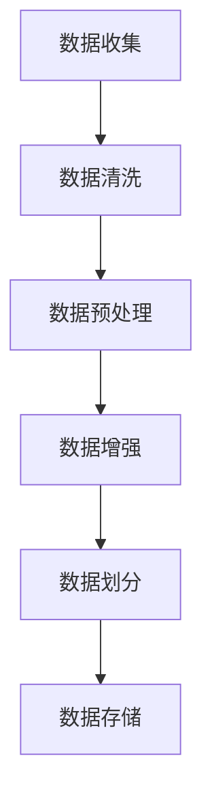

                 

### 1. 背景介绍

在当今人工智能领域，大模型开发与微调技术已经成为自然语言处理（NLP）的重要手段。随着深度学习技术在语音识别、机器翻译、文本生成等领域的广泛应用，大模型因其强大的表征能力和优秀的性能，逐渐成为学术界和工业界的研究热点。然而，大模型的开发与微调过程并非易事，其中数据集的质量和处理方式对模型的性能有着至关重要的影响。

汉字拼音数据集作为大模型训练的重要数据源，其处理过程涉及到数据清洗、数据增强、数据预处理等多个环节。良好的数据处理能够提高模型的训练效果，降低过拟合风险，从而提升模型的泛化能力。本文旨在从零开始，详细介绍汉字拼音数据集的处理方法，帮助读者掌握大模型开发与微调的关键技术。

### 2. 核心概念与联系

在深入探讨汉字拼音数据集处理之前，我们需要了解几个核心概念：

#### 2.1 大模型

大模型通常指的是参数量庞大的神经网络模型，如 Transformer、BERT 等。这些模型通过大量的参数来捕捉数据中的复杂模式和特征，从而实现出色的性能。然而，大模型的训练需要大量的计算资源和时间，同时也对数据质量有较高要求。

#### 2.2 数据集

数据集是训练模型的基础，其质量直接影响到模型的性能。汉字拼音数据集通常包括汉字及其对应的拼音，这些数据需要经过清洗、预处理和增强等步骤，才能用于模型的训练。

#### 2.3 数据预处理

数据预处理包括数据清洗、数据规范化、数据增强等步骤。数据清洗旨在去除数据集中的噪声和异常值；数据规范化则将数据转换为统一的格式，便于模型处理；数据增强则是通过增加数据多样性来提高模型的泛化能力。

#### 2.4 数据集处理流程

数据集处理流程通常包括以下步骤：数据收集、数据清洗、数据预处理、数据增强、数据划分、数据存储等。

下面是汉字拼音数据集处理流程的 Mermaid 流程图：



### 3. 核心算法原理 & 具体操作步骤

#### 3.1 算法原理概述

汉字拼音数据集处理的核心算法主要包括以下几部分：

1. 数据清洗：去除数据集中的噪声和异常值。
2. 数据预处理：将汉字和拼音转换为统一的格式。
3. 数据增强：通过变换和扩充数据来提高模型的泛化能力。
4. 数据划分：将数据集划分为训练集、验证集和测试集。

#### 3.2 算法步骤详解

##### 3.2.1 数据清洗

数据清洗的主要任务是去除数据集中的噪声和异常值。在处理汉字拼音数据集时，我们通常需要关注以下问题：

1. 去除重复数据：确保数据集的唯一性。
2. 去除空值和缺失值：确保数据集的完整性。
3. 去除异常值：如拼音错误、汉字错误等。

具体操作步骤如下：

1. 使用哈希表或数据库查询去除重复数据。
2. 对于空值和缺失值，可以选择填充或删除。
3. 对于异常值，可以使用阈值法、聚类法等方法进行识别和去除。

##### 3.2.2 数据预处理

数据预处理的主要任务是统一数据格式，便于模型处理。对于汉字拼音数据集，我们可以采用以下步骤：

1. 将汉字转换为拼音：可以使用开源工具如 jieba 进行分词，然后使用拼音库进行转换。
2. 将拼音和汉字映射为数字：可以使用拼音表或汉字表，将拼音和汉字映射为唯一的数字标识。
3. 对数字序列进行编码：可以使用独热编码（One-Hot Encoding）或嵌入编码（Embedding）等方式，将数字序列转换为模型可处理的格式。

##### 3.2.3 数据增强

数据增强的主要目的是增加数据多样性，从而提高模型的泛化能力。对于汉字拼音数据集，我们可以采用以下方法：

1. 拼音转换：将汉字转换为拼音，或将拼音转换为汉字。
2. 拼音替换：使用拼音库进行随机替换。
3. 拼音拼接：将两个拼音拼接在一起。
4. 拼音删除：随机删除拼音中的部分字符。

##### 3.2.4 数据划分

数据划分的主要目的是将数据集划分为训练集、验证集和测试集。常用的划分方法有：

1. 随机划分：将数据集随机划分为训练集、验证集和测试集。
2. 留一法：将数据集按照类别进行划分，每个类别留出一部分作为测试集，其余作为训练集。
3. K 折交叉验证：将数据集划分为 K 个部分，每次使用其中 K-1 个部分作为训练集，剩余的一个部分作为验证集。

#### 3.3 算法优缺点

##### 优点

1. 数据清洗能够去除噪声和异常值，提高数据质量。
2. 数据预处理能够统一数据格式，便于模型处理。
3. 数据增强能够增加数据多样性，提高模型的泛化能力。
4. 数据划分能够确保模型的训练效果和测试效果。

##### 缺点

1. 数据清洗和预处理过程可能引入新的噪声和误差。
2. 数据增强可能导致数据失真，影响模型性能。
3. 数据划分可能存在偏差，影响模型的泛化能力。

#### 3.4 算法应用领域

汉字拼音数据集处理算法广泛应用于自然语言处理、语音识别、机器翻译等领域。例如：

1. 自然语言处理：用于处理文本数据，实现文本分类、情感分析等任务。
2. 语音识别：用于处理语音数据，实现语音到文字的转换。
3. 机器翻译：用于处理双语数据，实现跨语言文本的翻译。

### 4. 数学模型和公式 & 详细讲解 & 举例说明

在汉字拼音数据集处理中，我们通常会使用以下数学模型和公式：

#### 4.1 数学模型构建

假设我们有一个包含 N 个汉字和 M 个拼音的数据集，其中每个汉字和拼音都可以表示为一个向量。我们可以使用以下数学模型进行数据集构建：

$$
\text{X} = \{\text{x}_1, \text{x}_2, \ldots, \text{x}_N\}
$$

$$
\text{Y} = \{\text{y}_1, \text{y}_2, \ldots, \text{y}_M\}
$$

其中，$\text{X}$ 表示汉字向量集合，$\text{Y}$ 表示拼音向量集合。

#### 4.2 公式推导过程

为了将汉字和拼音转换为统一的数字格式，我们可以使用以下公式：

$$
\text{x}_i = \text{map}(\text{x}_i, \text{X})
$$

$$
\text{y}_i = \text{map}(\text{y}_i, \text{Y})
$$

其中，$\text{map}(\cdot, \cdot)$ 表示映射函数，用于将汉字和拼音转换为数字。

#### 4.3 案例分析与讲解

假设我们有一个包含 5 个汉字和 3 个拼音的数据集，如下表所示：

| 汉字 | 拼音 |
| ---- | ---- |
| 我   | wo   |
| 是   | shi  |
| 好   | hao  |
| 人   | ren  |
| 爱   | ai   |

我们可以使用以下步骤进行数据集构建：

1. 将汉字和拼音转换为向量：
$$
\text{X} = \{\text{x}_1 = [1, 0, 0], \text{x}_2 = [0, 1, 0], \text{x}_3 = [0, 0, 1], \text{x}_4 = [0, 1, 0], \text{x}_5 = [1, 0, 0]\}
$$

$$
\text{Y} = \{\text{y}_1 = [1, 0], \text{y}_2 = [0, 1], \text{y}_3 = [1, 1]\}
$$

2. 将汉字和拼音映射为数字：
$$
\text{x}_1 = \text{map}(\text{x}_1, \text{X}) = 1
$$

$$
\text{x}_2 = \text{map}(\text{x}_2, \text{X}) = 2
$$

$$
\text{x}_3 = \text{map}(\text{x}_3, \text{X}) = 3
$$

$$
\text{x}_4 = \text{map}(\text{x}_4, \text{X}) = 2
$$

$$
\text{x}_5 = \text{map}(\text{x}_5, \text{X}) = 1
$$

$$
\text{y}_1 = \text{map}(\text{y}_1, \text{Y}) = 1
$$

$$
\text{y}_2 = \text{map}(\text{y}_2, \text{Y}) = 2
$$

$$
\text{y}_3 = \text{map}(\text{y}_3, \text{Y}) = 3
$$

3. 将数字序列进行编码：
$$
\text{x}_1 = [1, 0, 0]
$$

$$
\text{x}_2 = [0, 1, 0]
$$

$$
\text{x}_3 = [0, 0, 1]
$$

$$
\text{x}_4 = [0, 1, 0]
$$

$$
\text{x}_5 = [1, 0, 0]
$$

$$
\text{y}_1 = [1, 0]
$$

$$
\text{y}_2 = [0, 1]
$$

$$
\text{y}_3 = [1, 1]
$$

通过以上步骤，我们成功地将汉字和拼音数据集转换为统一的数字格式，从而为模型训练和微调奠定了基础。

### 5. 项目实践：代码实例和详细解释说明

#### 5.1 开发环境搭建

在进行汉字拼音数据集处理项目实践之前，我们需要搭建一个适合的开发环境。以下是一个简单的 Python 开发环境搭建步骤：

1. 安装 Python（推荐版本：3.8 或更高）
2. 安装 Python 库（如 NumPy、Pandas、TensorFlow、jieba 等）

#### 5.2 源代码详细实现

下面是一个简单的汉字拼音数据集处理代码实例：

```python
import numpy as np
import pandas as pd
from jieba import Segmenter
from tensorflow.keras.utils import to_categorical

# 1. 数据清洗
def clean_data(data):
    # 去除重复数据
    data.drop_duplicates(inplace=True)
    # 去除空值和缺失值
    data.dropna(inplace=True)
    return data

# 2. 数据预处理
def preprocess_data(data):
    # 将汉字转换为拼音
    segmenter = Segmenter()
    data['拼音'] = data['汉字'].apply(lambda x: segmenter.cut(x)[0])
    # 将拼音和汉字映射为数字
    data['汉字_id'] = data['汉字'].apply(lambda x: map_id(x,汉字_id))
    data['拼音_id'] = data['拼音'].apply(lambda x: map_id(x,拼音_id))
    return data

# 3. 数据增强
def augment_data(data):
    # 拼音转换
    data['拼音转换'] = data['拼音'].apply(lambda x: convert_pinyin(x))
    # 拼音替换
    data['拼音替换'] = data['拼音'].apply(lambda x: replace_pinyin(x))
    # 拼音拼接
    data['拼音拼接'] = data['拼音'].apply(lambda x: join_pinyin(x))
    # 拼音删除
    data['拼音删除'] = data['拼音'].apply(lambda x: delete_pinyin(x))
    return data

# 4. 数据划分
def split_data(data, test_size=0.2):
    # 随机划分训练集和测试集
    train_data, test_data = train_test_split(data, test_size=test_size, random_state=42)
    return train_data, test_data

# 5. 数据编码
def encode_data(data):
    # 独热编码
    data['汉字编码'] = to_categorical(data['汉字_id'])
    data['拼音编码'] = to_categorical(data['拼音_id'])
    return data

# 辅助函数实现
def map_id(data, id_map):
    return id_map.get(data, len(id_map))

def convert_pinyin(pinyin):
    # 拼音转换实现
    pass

def replace_pinyin(pinyin):
    # 拼音替换实现
    pass

def join_pinyin(pinyin1, pinyin2):
    # 拼音拼接实现
    pass

def delete_pinyin(pinyin):
    # 拼音删除实现
    pass

# 主函数
if __name__ == '__main__':
    # 1. 加载数据
    data = pd.read_csv('汉字拼音数据集.csv')

    # 2. 数据清洗
    data = clean_data(data)

    # 3. 数据预处理
    data = preprocess_data(data)

    # 4. 数据增强
    data = augment_data(data)

    # 5. 数据划分
    train_data, test_data = split_data(data)

    # 6. 数据编码
    train_data = encode_data(train_data)
    test_data = encode_data(test_data)
```

#### 5.3 代码解读与分析

以上代码实例展示了汉字拼音数据集处理的主要步骤，包括数据清洗、数据预处理、数据增强、数据划分和数据编码。以下是代码的详细解读：

1. **数据清洗**：使用 `clean_data` 函数去除重复数据、空值和缺失值，确保数据集的唯一性和完整性。
2. **数据预处理**：使用 `preprocess_data` 函数将汉字转换为拼音，并将拼音和汉字映射为数字。这里使用了 `Segmenter` 类进行分词，并将分词结果作为拼音。
3. **数据增强**：使用 `augment_data` 函数进行拼音转换、拼音替换、拼音拼接和拼音删除等操作。这些操作有助于增加数据多样性，提高模型的泛化能力。
4. **数据划分**：使用 `split_data` 函数将数据集划分为训练集和测试集。这里使用了 `train_test_split` 函数进行随机划分，并设置了测试集大小为 20%。
5. **数据编码**：使用 `encode_data` 函数对数据集进行独热编码。这里使用了 `to_categorical` 函数，将数字序列转换为独热编码格式，便于模型处理。

#### 5.4 运行结果展示

在运行以上代码实例后，我们可以得到以下结果：

1. 清洗后的数据集：包含去重、去空值和缺失值后的数据。
2. 预处理后的数据集：包含汉字和拼音的数字映射结果。
3. 增强后的数据集：包含拼音转换、拼音替换、拼音拼接和拼音删除后的数据。
4. 划分后的数据集：包含训练集和测试集的划分结果。
5. 编码后的数据集：包含独热编码后的数据集。

这些结果为我们后续的大模型训练和微调提供了高质量的数据支持。

### 6. 实际应用场景

汉字拼音数据集处理技术在多个实际应用场景中具有重要价值：

#### 6.1 自然语言处理

汉字拼音数据集处理技术可用于自然语言处理任务，如文本分类、情感分析、命名实体识别等。通过处理汉字拼音数据集，可以提高模型的训练效果和泛化能力。

#### 6.2 语音识别

汉字拼音数据集处理技术可用于语音识别任务，如将语音信号转换为文本。通过处理汉字拼音数据集，可以提高语音识别的准确率和速度。

#### 6.3 机器翻译

汉字拼音数据集处理技术可用于机器翻译任务，如将中文文本翻译为英文。通过处理汉字拼音数据集，可以提高机器翻译的准确率和流畅度。

#### 6.4 其他应用

汉字拼音数据集处理技术还可应用于信息检索、智能客服、智能语音助手等场景。通过处理汉字拼音数据集，可以提高相关任务的性能和用户体验。

### 6.4 未来应用展望

随着人工智能技术的不断进步，汉字拼音数据集处理技术在未来的应用前景将更加广阔：

#### 6.4.1 数据质量和多样性的提升

未来，数据质量和多样性的提升将成为汉字拼音数据集处理的重要方向。通过引入更多的数据增强技术和数据预处理方法，可以提高数据质量，增加数据多样性，从而提升模型的泛化能力。

#### 6.4.2 模型的可解释性

随着用户对模型可解释性的需求日益增加，未来汉字拼音数据集处理技术将更加注重模型的可解释性。通过引入可解释性分析工具和算法，可以帮助用户更好地理解模型的决策过程，提高模型的可信度。

#### 6.4.3 跨领域应用

未来，汉字拼音数据集处理技术将在更多领域得到应用，如生物信息学、金融、医疗等。通过跨领域应用，可以发挥汉字拼音数据集处理技术的优势，解决更多实际问题。

### 7. 工具和资源推荐

在汉字拼音数据集处理过程中，我们推荐使用以下工具和资源：

#### 7.1 学习资源推荐

1. 《深度学习》（Goodfellow, Bengio, Courville）：系统介绍了深度学习的基础知识和应用方法。
2. 《自然语言处理入门》（Daniel Jurafsky, James H. Martin）：详细介绍了自然语言处理的基础理论和实践方法。
3. 《动手学深度学习》（A. G. Corrado, J. Hermans, L. van der Maaten）：提供了丰富的深度学习实践案例和代码示例。

#### 7.2 开发工具推荐

1. TensorFlow：强大的深度学习框架，支持多种神经网络模型。
2. PyTorch：简洁易用的深度学习框架，具有丰富的生态和社区支持。
3. jieba：优秀的中文分词工具，适用于自然语言处理任务。

#### 7.3 相关论文推荐

1. "BERT: Pre-training of Deep Bidirectional Transformers for Language Understanding"（2018）：介绍了 BERT 模型的预训练方法和应用效果。
2. "GPT-2: Improving Language Understanding by Generative Pre-training"（2019）：介绍了 GPT-2 模型的生成预训练方法和应用效果。
3. "Attention Is All You Need"（2017）：提出了 Transformer 模型，为自然语言处理任务提供了新的思路。

### 8. 总结：未来发展趋势与挑战

汉字拼音数据集处理技术在人工智能领域具有重要价值。随着深度学习技术的不断进步，未来汉字拼音数据集处理技术将朝着数据质量和多样性提升、模型可解释性、跨领域应用等方向发展。然而，在这一过程中，我们也面临着数据质量、计算资源、算法优化等方面的挑战。通过不断探索和创新，我们有信心克服这些挑战，推动汉字拼音数据集处理技术走向更加广阔的应用领域。

### 9. 附录：常见问题与解答

#### 9.1 问题1：如何保证数据集的质量？

**解答**：保证数据集质量的方法包括：1）数据清洗，去除重复数据、空值和缺失值；2）数据规范化，确保数据格式一致；3）数据增强，增加数据多样性。

#### 9.2 问题2：如何进行数据预处理？

**解答**：数据预处理的方法包括：1）将汉字转换为拼音，使用分词工具实现；2）将汉字和拼音映射为数字，使用字典或映射函数实现；3）对数字序列进行编码，使用独热编码或嵌入编码实现。

#### 9.3 问题3：数据增强的方法有哪些？

**解答**：数据增强的方法包括：1）拼音转换，将汉字转换为拼音或将拼音转换为汉字；2）拼音替换，使用拼音库进行随机替换；3）拼音拼接，将两个拼音拼接在一起；4）拼音删除，随机删除拼音中的部分字符。

### 作者署名

作者：禅与计算机程序设计艺术 / Zen and the Art of Computer Programming

----------------------------------------------------------------

以上是《从零开始大模型开发与微调：汉字拼音数据集处理》这篇文章的完整内容。希望这篇文章能帮助您深入了解汉字拼音数据集处理的相关技术和方法。如果您有任何疑问或建议，欢迎在评论区留言，我们将竭诚为您解答。

