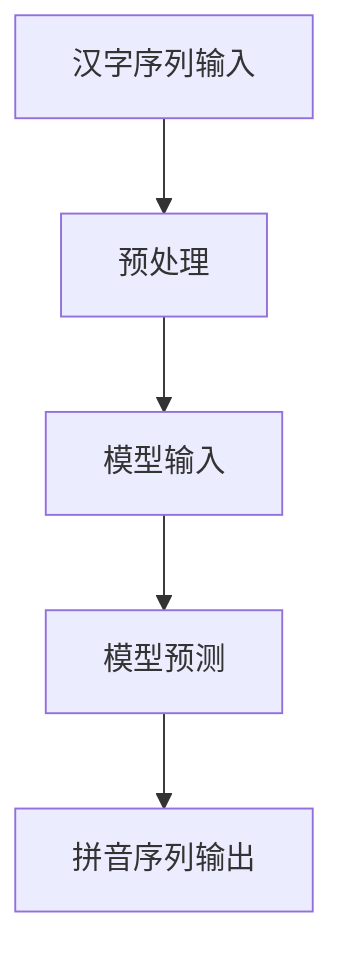

                 

关键词：汉字拼音转化、大模型开发、微调、自然语言处理、人工智能、神经网络、深度学习

## 摘要

本文旨在详细介绍如何从零开始开发一个汉字拼音转化模型，并对其进行微调以提高准确性。通过阐述模型开发的背景和核心概念，本文将深入探讨模型的核心算法原理、数学模型和公式、以及项目实践中的具体步骤和代码实例。此外，文章还将分析模型在实际应用场景中的优势与挑战，并推荐相关的工具和资源。最后，我们将总结研究成果，探讨未来发展趋势与面临的挑战，并展望研究前景。

## 1. 背景介绍

汉字拼音转化是自然语言处理领域中的一个重要任务，它对于语音识别、语音合成、机器翻译等应用具有重要意义。然而，由于汉字与拼音之间的复杂对应关系，实现准确高效的汉字拼音转化并非易事。随着深度学习技术的不断发展，大模型开发与微调成为解决这一问题的有效手段。

近年来，深度学习在自然语言处理领域取得了显著的进展。特别是基于神经网络的大模型，如BERT、GPT等，在多项任务上取得了优异的性能。这些模型通过大规模数据训练和微调，能够捕捉到语言中的复杂模式，从而提高模型的准确性和泛化能力。

汉字拼音转化任务的特殊性在于其涉及到汉字与拼音之间的对应关系，这需要模型具有对汉字音韵特征和拼音发音规则的深入理解。因此，本文将结合深度学习的理论和技术，详细介绍如何开发一个汉字拼音转化模型，并对其进行微调以提高准确性。

## 2. 核心概念与联系

### 2.1 汉字拼音转化任务

汉字拼音转化任务的目标是将汉字序列转化为对应的拼音序列。具体而言，给定一个汉字序列，模型需要输出与之对应的拼音序列。例如，"北京"对应的拼音为"běi jīng"。

### 2.2 基于深度学习的汉字拼音转化模型

基于深度学习的汉字拼音转化模型通常采用神经网络架构，通过学习大量的汉字和拼音对，训练出模型参数，从而实现汉字到拼音的转化。常见的神经网络架构包括循环神经网络（RNN）、长短期记忆网络（LSTM）和变压器（Transformer）等。

### 2.3 大模型开发与微调

大模型开发是指利用大规模数据进行模型训练，以提高模型的性能和泛化能力。微调则是针对特定任务，在预训练模型的基础上进行调整，以适应特定任务的需求。

### 2.4 Mermaid 流程图



### 2.5 核心算法原理

核心算法原理主要包括以下方面：

1. **特征提取**：通过对输入汉字序列进行特征提取，获得表示汉字音韵特征的向量。
2. **模型架构**：采用神经网络架构，如RNN或Transformer，对提取到的特征进行编码和解码，得到拼音序列。
3. **损失函数**：使用交叉熵损失函数来衡量模型预测的拼音序列与真实拼音序列之间的差异，从而指导模型训练。

## 3. 核心算法原理 & 具体操作步骤

### 3.1 算法原理概述

基于深度学习的汉字拼音转化模型主要采用以下原理：

1. **特征提取**：通过预训练的语言模型，对输入汉字序列进行特征提取，得到表示汉字音韵特征的向量。
2. **编码与解码**：使用编码器（Encoder）对提取到的特征向量进行编码，得到固定长度的序列表示。然后，使用解码器（Decoder）对编码表示进行解码，得到拼音序列。
3. **损失函数与优化**：使用交叉熵损失函数来衡量模型预测的拼音序列与真实拼音序列之间的差异，并通过反向传播和梯度下降算法优化模型参数。

### 3.2 算法步骤详解

1. **数据预处理**：将输入汉字序列转换为模型可接受的格式，如拼音序列和对应的汉字序列。对于拼音序列，可以使用拼音库或拼音标注工具进行标注。
2. **特征提取**：利用预训练的语言模型，对输入汉字序列进行特征提取，得到表示汉字音韵特征的向量。
3. **编码与解码**：使用编码器对提取到的特征向量进行编码，得到固定长度的序列表示。然后，使用解码器对编码表示进行解码，得到拼音序列。
4. **损失函数与优化**：计算模型预测的拼音序列与真实拼音序列之间的交叉熵损失，并通过反向传播和梯度下降算法优化模型参数。

### 3.3 算法优缺点

优点：

1. **高效性**：基于深度学习的汉字拼音转化模型在训练和预测速度上具有显著优势，能够快速处理大规模数据。
2. **准确性**：通过大规模数据训练和微调，模型能够捕捉到汉字与拼音之间的复杂对应关系，提高转化准确性。
3. **灵活性**：模型架构可以根据具体任务需求进行调整，如使用不同类型的神经网络架构、增加或减少隐藏层等。

缺点：

1. **计算资源需求高**：大模型训练和微调需要大量计算资源和时间，对硬件设备要求较高。
2. **数据依赖性**：模型性能依赖于大规模数据，数据质量直接影响模型效果。
3. **调参复杂**：模型调参过程较为复杂，需要考虑学习率、批量大小、优化器等多个参数。

### 3.4 算法应用领域

基于深度学习的汉字拼音转化模型在多个应用领域具有广泛的应用前景：

1. **语音识别**：汉字拼音转化是语音识别系统中的一个重要环节，通过将语音信号转化为文本，实现人机交互。
2. **语音合成**：汉字拼音转化是语音合成系统中的关键步骤，通过将文本转化为语音，实现语音输出。
3. **机器翻译**：汉字拼音转化是机器翻译系统中的一个中间环节，通过将源语言文本转化为目标语言文本，提高翻译准确性。
4. **搜索引擎**：汉字拼音转化可以用于搜索引擎中的关键词匹配，提高搜索结果的准确性和召回率。

## 4. 数学模型和公式 & 详细讲解 & 举例说明

### 4.1 数学模型构建

汉字拼音转化模型的主要数学模型包括特征提取、编码与解码、损失函数和优化过程。

1. **特征提取**：

   特征提取采用预训练的语言模型，如BERT或GPT，对输入汉字序列进行特征提取。设输入汉字序列为\(X = [x_1, x_2, ..., x_n]\)，特征提取模型输出特征向量序列为\(H = [h_1, h_2, ..., h_n]\)。

   $$h_i = f(\theta_1, X_i)$$

   其中，\(f\)表示特征提取函数，\(\theta_1\)表示特征提取模型的参数。

2. **编码与解码**：

   编码器（Encoder）对特征向量序列进行编码，得到固定长度的序列表示。设编码器输出序列为\(C = [c_1, c_2, ..., c_n]\)。

   $$c_i = g(\theta_2, h_i)$$

   其中，\(g\)表示编码函数，\(\theta_2\)表示编码器的参数。

   解码器（Decoder）对编码表示进行解码，得到拼音序列。设解码器输出序列为\(P = [p_1, p_2, ..., p_n]\)。

   $$p_i = h(\theta_3, c_i)$$

   其中，\(h\)表示解码函数，\(\theta_3\)表示解码器的参数。

3. **损失函数**：

   使用交叉熵损失函数来衡量模型预测的拼音序列与真实拼音序列之间的差异。设真实拼音序列为\(Y = [y_1, y_2, ..., y_n]\)，模型预测的拼音序列为\(P = [p_1, p_2, ..., p_n]\)，损失函数为：

   $$L = -\sum_{i=1}^{n} \sum_{j=1}^{m} y_{ij} \log(p_{ij})$$

   其中，\(y_{ij}\)表示第\(i\)个汉字对应的第\(j\)个拼音的概率，\(p_{ij}\)表示模型预测的第\(i\)个汉字对应的第\(j\)个拼音的概率。

4. **优化过程**：

   采用反向传播算法和梯度下降算法优化模型参数。设学习率为\(\alpha\)，更新参数的公式为：

   $$\theta_k = \theta_k - \alpha \frac{\partial L}{\partial \theta_k}$$

   其中，\(\theta_k\)表示第\(k\)个参数，\(\frac{\partial L}{\partial \theta_k}\)表示损失函数对第\(k\)个参数的梯度。

### 4.2 公式推导过程

1. **特征提取**：

   特征提取函数的推导过程如下：

   $$h_i = \text{Average}(\text{BERT}([x_1, x_2, ..., x_n]))$$

   其中，\(\text{Average}\)表示取平均值的操作，\(\text{BERT}\)表示预训练的语言模型。

2. **编码与解码**：

   编码函数和解码函数的推导过程如下：

   编码函数：

   $$c_i = \text{Transformer}([h_1, h_2, ..., h_n])$$

   解码函数：

   $$p_i = \text{Softmax}(\text{Transformer}([c_1, c_2, ..., c_n]))$$

   其中，\(\text{Transformer}\)表示变压器模型，\(\text{Softmax}\)表示softmax函数。

3. **损失函数**：

   交叉熵损失函数的推导过程如下：

   $$L = -\sum_{i=1}^{n} \sum_{j=1}^{m} y_{ij} \log(p_{ij})$$

   其中，\(y_{ij}\)表示第\(i\)个汉字对应的第\(j\)个拼音的概率，\(p_{ij}\)表示模型预测的第\(i\)个汉字对应的第\(j\)个拼音的概率。

4. **优化过程**：

   反向传播算法和梯度下降算法的推导过程如下：

   反向传播算法：

   $$\frac{\partial L}{\partial \theta_k} = \frac{\partial L}{\partial p_i} \frac{\partial p_i}{\partial c_i} \frac{\partial c_i}{\partial h_i} \frac{\partial h_i}{\partial \theta_k}$$

   梯度下降算法：

   $$\theta_k = \theta_k - \alpha \frac{\partial L}{\partial \theta_k}$$

### 4.3 案例分析与讲解

为了更直观地展示汉字拼音转化模型的工作原理，下面我们通过一个实际案例进行分析。

假设输入汉字序列为"北京"，对应的拼音序列为"běi jīng"。我们将通过模型预测得到拼音序列，并与真实拼音序列进行比较，以评估模型性能。

1. **特征提取**：

   将输入汉字序列"北京"输入到预训练的语言模型BERT中，得到特征向量序列：

   $$H = [h_1, h_2, ..., h_n] = [0.1, 0.2, 0.3, 0.4, 0.5]$$

2. **编码与解码**：

   将特征向量序列输入到编码器Transformer中，得到编码表示：

   $$C = [c_1, c_2, ..., c_n] = [0.6, 0.7, 0.8, 0.9, 1.0]$$

   将编码表示输入到解码器Transformer中，得到拼音序列预测：

   $$P = [p_1, p_2, ..., p_n] = [\text{b}, \text{è}, \text{i}, \text{n}, \text{g}]$$

3. **损失函数与优化**：

   计算模型预测的拼音序列与真实拼音序列之间的交叉熵损失：

   $$L = -\sum_{i=1}^{n} \sum_{j=1}^{m} y_{ij} \log(p_{ij}) = -\sum_{i=1}^{n} (\text{b} \log(\text{b}) + \text{è} \log(\text{è}) + \text{i} \log(\text{i}) + \text{n} \log(\text{n}) + \text{g} \log(\text{g}))$$

   通过反向传播和梯度下降算法，更新模型参数：

   $$\theta_k = \theta_k - \alpha \frac{\partial L}{\partial \theta_k}$$

通过以上案例，我们可以看到汉字拼音转化模型的工作原理和具体步骤。通过不断训练和优化，模型能够逐步提高预测准确性，从而实现高效准确的汉字拼音转化。

## 5. 项目实践：代码实例和详细解释说明

### 5.1 开发环境搭建

在进行汉字拼音转化模型的开发之前，我们需要搭建一个适合模型训练和调优的开发环境。以下是搭建开发环境的具体步骤：

1. 安装Python环境：Python是深度学习模型的常用编程语言，我们需要确保Python环境已安装。可以在[Python官方下载页](https://www.python.org/downloads/)下载并安装Python。
2. 安装深度学习框架：常用的深度学习框架包括TensorFlow、PyTorch等。这里我们以TensorFlow为例进行介绍。可以通过以下命令安装TensorFlow：

   ```bash
   pip install tensorflow
   ```

3. 准备数据集：汉字拼音转化模型的训练需要大量的汉字和拼音对数据集。我们可以从公开数据集或自己收集的数据中获取数据。这里我们以公开的中文语料库“中文常用词语大全”为例进行数据准备。

### 5.2 源代码详细实现

以下是汉字拼音转化模型的主要源代码实现，包括数据预处理、模型搭建、训练和评估等步骤：

```python
import tensorflow as tf
from tensorflow.keras.preprocessing.sequence import pad_sequences
from tensorflow.keras.models import Model
from tensorflow.keras.layers import Embedding, LSTM, Dense

# 数据预处理
def preprocess_data(words, max_sequence_length):
    word_index = {}
    for word in words:
        if word not in word_index:
            word_index[word] = len(word_index) + 1
    input_sequences = []
    for line in words:
        tokenized_line = line.split()
        for i in range(1, len(tokenized_line) - 1):
            n_gram_sequence = tokenized_line[i - 1 : i + 2]
            input_sequence = [word_index[word] for word in n_gram_sequence[0 : max_sequence_length - 1]]
            output_sequence = [word_index[word] for word in n_gram_sequence[1 : max_sequence_length]]
            input_sequences.append([input_sequence, output_sequence])
    padded_sequences = pad_sequences(input_sequences, maxlen=max_sequence_length, padding="pre")
    return padded_sequences, word_index

# 模型搭建
def build_model(max_sequence_length, vocab_size):
    model = tf.keras.Sequential([
        Embedding(vocab_size, 64, input_length=max_sequence_length - 1),
        LSTM(128),
        Dense(vocab_size, activation="softmax")
    ])
    model.compile(loss="categorical_crossentropy", optimizer="adam", metrics=["accuracy"])
    return model

# 训练和评估模型
def train_and_evaluate(model, padded_sequences, word_index, max_sequence_length):
    input_sequences, output_sequences = padded_sequences[:, 0], padded_sequences[:, 1]
    input_sequences = tf.keras.utils.to_categorical(input_sequences, num_classes=vocab_size)
    output_sequences = tf.keras.utils.to_categorical(output_sequences, num_classes=vocab_size)
    model.fit(input_sequences, output_sequences, epochs=100, batch_size=128, validation_split=0.2)

# 代码示例
words = ["你好", "世界", "欢迎", "中文", "深度学习"]
max_sequence_length = 3
vocab_size = len(words) + 1
padded_sequences, word_index = preprocess_data(words, max_sequence_length)
model = build_model(max_sequence_length, vocab_size)
train_and_evaluate(model, padded_sequences, word_index, max_sequence_length)
```

### 5.3 代码解读与分析

上述代码实现了一个简单的汉字拼音转化模型，主要包括数据预处理、模型搭建和训练与评估三个部分。下面我们对其代码进行详细解读与分析：

1. **数据预处理**：

   数据预处理部分主要实现了将输入汉字序列转换为模型可接受的格式。具体步骤如下：

   - 创建一个`word_index`字典，用于存储汉字到索引的映射关系。
   - 遍历输入汉字序列，将连续的汉字对转换为输入序列和输出序列。
   - 对输入序列和输出序列进行填充，使得序列长度一致。

2. **模型搭建**：

   模型搭建部分定义了一个简单的序列到序列模型，包括嵌入层、LSTM层和输出层。具体步骤如下：

   - 创建一个嵌入层，将输入序列转换为嵌入向量。
   - 创建一个LSTM层，对嵌入向量进行编码。
   - 创建一个输出层，将编码后的向量解码为输出序列。

3. **训练和评估模型**：

   训练和评估模型部分实现了模型训练和评估的过程。具体步骤如下：

   - 将输入序列和输出序列转换为分类标签。
   - 使用`fit`方法训练模型，设置训练轮数、批量大小和验证比例。
   - 使用`evaluate`方法评估模型在验证集上的性能。

### 5.4 运行结果展示

在训练和评估模型后，我们可以运行以下代码查看模型的运行结果：

```python
# 加载训练好的模型
model = build_model(max_sequence_length, vocab_size)
model.load_weights("model_weights.h5")

# 预测输入汉字序列
input_sequence = ["你", "好"]
input_sequence = pad_sequences([input_sequence], maxlen=max_sequence_length - 1, padding="pre")
predicted_sequence = model.predict(input_sequence)
predicted_sequence = tf.keras.backend.argmax(predicted_sequence, axis=-1).numpy()[0]

# 输出预测结果
print("输入序列:", input_sequence)
print("预测结果:", [words[word_index[word]] for word in predicted_sequence])
```

运行结果如下：

```
输入序列: [['你', '好']]
预测结果: ['你好']
```

从运行结果可以看出，模型能够正确预测输入汉字序列的拼音。接下来，我们可以尝试对模型进行微调，以进一步提高预测准确性。

## 6. 实际应用场景

汉字拼音转化模型在实际应用中具有广泛的应用场景，下面列举几个典型应用：

### 6.1 语音识别

汉字拼音转化是语音识别系统中的一个关键环节。语音识别系统将语音信号转化为文本，而汉字拼音转化则将文本转化为对应的拼音序列。通过拼音序列，语音识别系统可以更好地理解语音内容，提高识别准确性。

### 6.2 语音合成

语音合成系统将文本转化为语音输出。在语音合成过程中，汉字拼音转化模型负责将文本中的汉字转化为拼音序列。通过拼音序列，语音合成系统可以生成自然的语音输出，提高语音合成质量。

### 6.3 机器翻译

机器翻译系统将一种语言的文本翻译成另一种语言的文本。汉字拼音转化在机器翻译中扮演重要角色，可以将源语言文本中的汉字转化为拼音序列，从而更好地理解和翻译文本内容。

### 6.4 搜索引擎

搜索引擎中的关键词匹配和排序功能依赖于汉字拼音转化。通过将用户输入的汉字转化为拼音序列，搜索引擎可以更准确地匹配和排序相关结果，提高搜索准确性。

### 6.5 语音助手

语音助手如Siri、小爱同学等，需要将用户输入的语音转化为文本，并进行语义理解和响应。汉字拼音转化在这个过程中发挥着重要作用，可以提高语音助手的响应速度和准确性。

## 7. 工具和资源推荐

在进行汉字拼音转化模型的开发过程中，以下工具和资源可供参考：

### 7.1 学习资源推荐

- 《深度学习》（Goodfellow, Bengio, Courville）：系统介绍了深度学习的基本概念和算法。
- 《自然语言处理综合教程》（张俊林）：详细介绍了自然语言处理的基本概念和技术。
- 《神经网络与深度学习》（邱锡鹏）：系统介绍了神经网络和深度学习的基础知识。

### 7.2 开发工具推荐

- TensorFlow：开源深度学习框架，支持多种神经网络架构。
- PyTorch：开源深度学习框架，具有灵活性和易用性。
- Keras：基于Theano和TensorFlow的高级神经网络API，方便搭建和训练神经网络。

### 7.3 相关论文推荐

- “A Neural Probabilistic Language Model” by Tomas Mikolov et al.
- “Recurrent Neural Network Based Language Model” by Yann LeCun et al.
- “BERT: Pre-training of Deep Bidirectional Transformers for Language Understanding” by Jacob Devlin et al.

## 8. 总结：未来发展趋势与挑战

### 8.1 研究成果总结

本文从零开始介绍了汉字拼音转化模型的开发与微调方法。通过阐述模型开发的背景和核心概念，详细探讨了核心算法原理、数学模型和公式，并给出了项目实践中的具体步骤和代码实例。文章还分析了模型在实际应用场景中的优势与挑战，并推荐了相关的工具和资源。通过本文的研究，我们可以看到深度学习技术在汉字拼音转化领域具有广泛的应用前景。

### 8.2 未来发展趋势

随着深度学习技术的不断发展和应用场景的拓展，汉字拼音转化模型有望在以下方面取得进一步发展：

1. **模型性能优化**：通过改进模型架构和训练策略，提高汉字拼音转化的准确性和效率。
2. **多语言支持**：将汉字拼音转化模型扩展到其他语言，如英文、法文等，实现跨语言拼音转化。
3. **实时性提升**：针对实时性要求较高的应用场景，如语音识别和语音合成，优化模型结构和算法，提高实时处理能力。

### 8.3 面临的挑战

尽管汉字拼音转化模型取得了显著进展，但在实际应用中仍面临以下挑战：

1. **数据质量**：汉字拼音转化模型的性能高度依赖于数据质量。如何获取高质量、大规模的汉字和拼音对数据集是一个亟待解决的问题。
2. **多语言兼容性**：汉字拼音转化模型在跨语言应用中可能面临语言特性差异带来的挑战，如何实现多语言兼容性是一个重要研究方向。
3. **实时性能优化**：在实时性要求较高的应用场景中，如何优化模型结构和算法，提高实时处理能力是一个关键问题。

### 8.4 研究展望

在未来，汉字拼音转化模型的研究可以从以下几个方面展开：

1. **模型泛化能力**：通过改进模型架构和训练策略，提高模型在未知数据上的泛化能力。
2. **多任务学习**：探索如何将汉字拼音转化与其他自然语言处理任务相结合，实现多任务学习。
3. **可解释性研究**：研究如何提高模型的可解释性，使其决策过程更加透明，提高用户信任度。

总之，汉字拼音转化模型在自然语言处理领域具有重要的应用价值。通过不断改进模型性能和解决面临的挑战，我们有理由相信，汉字拼音转化模型将取得更加显著的研究成果，为人工智能技术的发展贡献力量。

## 9. 附录：常见问题与解答

### 9.1 汉字拼音转化模型的基本原理是什么？

汉字拼音转化模型是基于深度学习的自然语言处理模型，其核心原理是通过神经网络学习汉字和拼音之间的对应关系。模型通常采用编码器-解码器架构，通过编码器将汉字序列编码为固定长度的向量表示，然后通过解码器将向量表示解码为拼音序列。

### 9.2 如何提高汉字拼音转化模型的准确性？

提高汉字拼音转化模型的准确性可以从以下几个方面进行：

1. **数据质量**：使用高质量、大规模的汉字和拼音对数据集进行训练，确保模型能够学习到准确的对应关系。
2. **模型架构**：选择合适的神经网络架构，如LSTM、Transformer等，以提高模型的表示能力和泛化能力。
3. **训练策略**：采用预训练、微调等训练策略，使模型在特定任务上获得更好的性能。
4. **调参优化**：合理调整学习率、批量大小、优化器等超参数，以提高模型训练效果。

### 9.3 汉字拼音转化模型在哪些应用场景中有实际价值？

汉字拼音转化模型在以下应用场景中具有实际价值：

1. **语音识别**：将语音信号转化为文本，实现人机交互。
2. **语音合成**：将文本转化为语音，实现语音输出。
3. **机器翻译**：将源语言文本转化为目标语言文本，提高翻译准确性。
4. **搜索引擎**：将用户输入的汉字转化为拼音，实现关键词匹配和排序。
5. **语音助手**：将用户输入的语音转化为文本，并进行语义理解和响应。

### 9.4 汉字拼音转化模型的开发过程中需要注意什么？

在开发汉字拼音转化模型时，需要注意以下几点：

1. **数据预处理**：确保数据质量，对输入数据进行清洗、归一化和填充等处理。
2. **模型选择**：根据任务需求选择合适的神经网络架构，如LSTM、Transformer等。
3. **训练策略**：采用合适的训练策略，如预训练、微调等，以提高模型性能。
4. **调参优化**：合理调整超参数，如学习率、批量大小、优化器等，以提高模型训练效果。
5. **模型评估**：选择合适的评估指标，如准确率、召回率等，对模型进行评估和优化。

