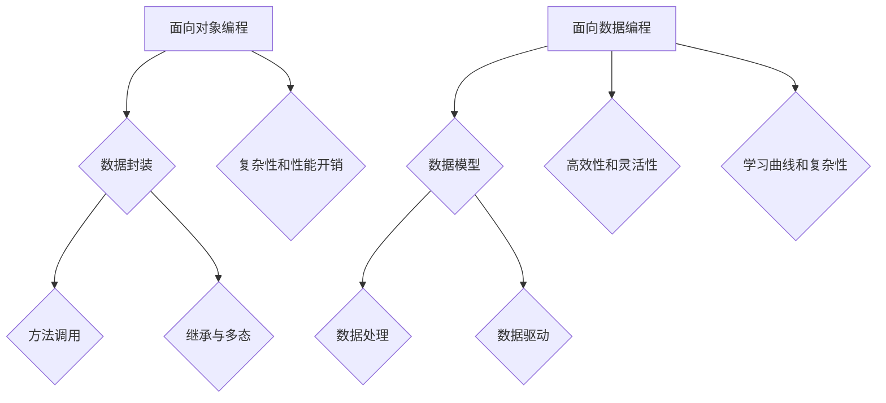

                 

 关键词：面向对象，面向数据，编程范式，编程框架，软件架构，数据处理，数据建模，编程语言，数据结构，算法分析，人工智能，软件工程

> 摘要：本文旨在探讨编程范式的演进，从传统的面向对象编程到现代的面向数据编程。通过分析面向对象和面向数据的定义、原理、应用领域和优缺点，我们将揭示这两种编程范式在应对现代数据处理挑战时的差异和共性。本文还将探讨未来编程范式的可能发展趋势，以及面对新挑战时应如何适应和应对。

## 1. 背景介绍

编程范式是指软件开发中处理数据和操作逻辑的方式和结构。它反映了程序员对问题域的理解和抽象能力。传统的编程范式主要包括面向过程、面向对象和函数式编程。然而，随着信息技术的发展，尤其是大数据、云计算和人工智能的崛起，传统的编程范式开始暴露出一些局限性，这促使人们探索新的编程范式——面向数据编程。

面向对象编程（OOP）是一种通过将数据和操作数据的方法封装成对象，从而将复杂系统分解为可重用和可管理的组件的编程范式。它以对象为基本构建块，强调封装、继承和多态等特性。面向对象编程在20世纪80年代和90年代成为主流编程范式，极大地促进了软件工程的发展。

然而，面向对象编程在面对大量数据和高并发处理时，由于其抽象层次较低，难以有效地管理和处理复杂的数据结构。面向数据编程（ODP）应运而生，它更加关注数据的存储、处理和转换，采用数据驱动的方式，以数据为中心，重新定义了软件开发的模式和流程。

本文将探讨面向对象和面向数据编程范式的演进过程，分析它们的原理、应用领域、优缺点，以及面向数据编程如何应对现代数据处理挑战。我们还将展望未来编程范式的发展趋势，并探讨在新的技术背景下，如何应对这些挑战。

## 2. 核心概念与联系

### 2.1. 面向对象编程（OOP）

面向对象编程是一种编程范式，其核心思想是将数据和行为封装在对象中，通过对象的交互来实现程序的功能。面向对象编程的关键概念包括：

- **对象（Object）**：对象是现实世界中实体的抽象，它包含数据和操作数据的方法。
- **类（Class）**：类是对象的蓝图，定义了对象的结构和行为。
- **封装（Encapsulation）**：封装是将数据和对数据的操作封装在一起，以防止外部直接访问数据。
- **继承（Inheritance）**：继承是子类继承父类的属性和方法，实现了代码的重用。
- **多态（Polymorphism）**：多态使得同一个操作作用于不同的对象时，可以有不同的解释和行为。

面向对象编程的优点包括：

- **可重用性**：通过对象和类的复用，减少了代码的重复编写。
- **可维护性**：通过封装和继承，提高了代码的可读性和可维护性。
- **灵活性**：通过多态，增加了系统的灵活性，可以轻松地扩展和修改。

面向对象编程的缺点包括：

- **复杂性**：面向对象编程引入了大量的概念和规则，增加了编程的复杂性。
- **性能开销**：面向对象编程往往需要额外的内存和计算资源，特别是在处理大量数据时。

### 2.2. 面向数据编程（ODP）

面向数据编程是一种以数据为中心的编程范式，它关注数据的存储、处理和转换，采用数据驱动的方式，将数据处理作为软件开发的核心理念。面向数据编程的关键概念包括：

- **数据模型（Data Model）**：数据模型是对数据结构和数据关系的抽象描述，用于指导数据的存储和处理。
- **数据驱动（Data-Driven）**：数据驱动是编程范式，通过数据来驱动程序的运行和决策。
- **数据处理（Data Processing）**：数据处理是对数据进行转换、分析、存储和提取的过程。

面向数据编程的优点包括：

- **高效性**：面向数据编程采用数据为中心的方式，能够更有效地处理大量数据。
- **灵活性**：面向数据编程提供了灵活的数据操作和转换方式，可以适应不同的数据处理需求。
- **可扩展性**：面向数据编程可以通过添加新的数据处理模块来扩展系统功能。

面向数据编程的缺点包括：

- **学习曲线**：面向数据编程需要学习和掌握新的概念和工具，对于新手来说有一定的学习难度。
- **复杂性**：面向数据编程涉及到的数据处理流程和数据模型可能比较复杂，需要更多的设计和维护工作。

### 2.3. Mermaid 流程图

为了更好地理解面向对象和面向数据编程范式之间的联系和区别，我们可以使用 Mermaid 流程图来展示它们的核心概念和流程。



## 3. 核心算法原理 & 具体操作步骤

### 3.1. 算法原理概述

面向对象编程和面向数据编程在算法原理上有着本质的区别。面向对象编程强调对象和方法，通过封装、继承和多态等特性实现软件的模块化和复用。而面向数据编程则更加注重数据的处理和转换，通过数据模型和数据驱动的方式实现高效的数据操作。

面向对象编程的核心算法原理包括：

- **对象的创建与销毁**：通过类的实例化创建对象，对象在完成其任务后可以被销毁。
- **方法的调用与执行**：通过对象的方法来操作数据和实现功能。
- **继承与多态**：通过继承实现代码的重用，通过多态实现灵活的接口和实现分离。

面向数据编程的核心算法原理包括：

- **数据模型的构建**：通过数据模型定义数据的结构和关系。
- **数据处理**：通过数据处理算法对数据进行转换、分析和提取。
- **数据驱动**：通过数据来驱动程序的运行和决策。

### 3.2. 算法步骤详解

面向对象编程的算法步骤包括：

1. 定义类和对象：根据需求定义类和对象的属性和方法。
2. 实例化对象：创建类的实例对象。
3. 调用方法：通过对象的方法来操作数据和实现功能。
4. 继承与多态：通过继承实现代码的重用，通过多态实现灵活的接口和实现分离。

面向数据编程的算法步骤包括：

1. 构建数据模型：根据需求构建数据模型，定义数据的结构和关系。
2. 数据处理：对数据进行转换、分析和提取，实现数据的价值。
3. 数据驱动：通过数据来驱动程序的运行和决策，实现自动化和智能化。

### 3.3. 算法优缺点

面向对象编程的优点：

- **可重用性**：通过对象和类的复用，减少了代码的重复编写。
- **可维护性**：通过封装和继承，提高了代码的可读性和可维护性。
- **灵活性**：通过多态，增加了系统的灵活性，可以轻松地扩展和修改。

面向对象编程的缺点：

- **复杂性**：面向对象编程引入了大量的概念和规则，增加了编程的复杂性。
- **性能开销**：面向对象编程往往需要额外的内存和计算资源，特别是在处理大量数据时。

面向数据编程的优点：

- **高效性**：面向数据编程采用数据为中心的方式，能够更有效地处理大量数据。
- **灵活性**：面向数据编程提供了灵活的数据操作和转换方式，可以适应不同的数据处理需求。
- **可扩展性**：面向数据编程可以通过添加新的数据处理模块来扩展系统功能。

面向数据编程的缺点：

- **学习曲线**：面向数据编程需要学习和掌握新的概念和工具，对于新手来说有一定的学习难度。
- **复杂性**：面向数据编程涉及到的数据处理流程和数据模型可能比较复杂，需要更多的设计和维护工作。

### 3.4. 算法应用领域

面向对象编程广泛应用于传统的软件工程领域，如桌面应用、企业级应用、Web开发等。它非常适合处理相对稳定的系统，如金融系统、管理系统等。

面向数据编程则主要应用于大数据处理、人工智能、云计算等领域。它能够高效地处理大规模数据，并在数据驱动的方式下实现智能化和自动化。例如，在数据处理平台上，面向数据编程被广泛用于数据清洗、数据分析和数据可视化等任务。

## 4. 数学模型和公式 & 详细讲解 & 举例说明

### 4.1. 数学模型构建

面向对象编程和面向数据编程的数学模型构建方式有所不同。面向对象编程通常使用类和对象来构建数学模型，而面向数据编程则使用数据模型来构建数学模型。

面向对象编程的数学模型构建通常包括：

1. **状态模型**：描述对象的状态和行为。
2. **关系模型**：描述对象之间的关系。

面向数据编程的数学模型构建通常包括：

1. **数据结构模型**：描述数据的形式和存储方式。
2. **数据处理模型**：描述数据的转换和分析过程。

### 4.2. 公式推导过程

面向对象编程和面向数据编程的公式推导过程也有所不同。面向对象编程通常使用类和对象的方法来推导公式，而面向数据编程则使用数据处理算法来推导公式。

面向对象编程的公式推导过程通常包括：

1. **类定义**：定义类的属性和方法。
2. **对象创建**：创建类的实例对象。
3. **方法调用**：通过对象的方法来操作数据和推导公式。

面向数据编程的公式推导过程通常包括：

1. **数据结构定义**：定义数据结构的形式和存储方式。
2. **数据处理算法**：通过数据处理算法来转换和分析数据，推导出相应的公式。

### 4.3. 案例分析与讲解

下面我们将通过一个具体的案例来分析面向对象编程和面向数据编程的数学模型构建和公式推导过程。

### 案例一：面向对象编程——计算圆形的面积

面向对象编程的数学模型构建和公式推导过程如下：

1. **类定义**：定义一个Circle类，包含半径（radius）属性和计算面积的方法（getArea）。

   ```java
   class Circle {
       private double radius;
       public double getArea() {
           return Math.PI * radius * radius;
       }
   }
   ```

2. **对象创建**：创建一个Circle对象，并调用getArea方法计算面积。

   ```java
   Circle circle = new Circle();
   circle.radius = 10;
   double area = circle.getArea();
   ```

3. **方法调用**：通过对象的方法来操作数据和推导出面积公式。

   ```java
   double area = Math.PI * circle.radius * circle.radius;
   ```

### 案例二：面向数据编程——计算平均值

面向数据编程的数学模型构建和公式推导过程如下：

1. **数据结构定义**：定义一个整数数组来存储数据。

   ```python
   data = [1, 2, 3, 4, 5]
   ```

2. **数据处理算法**：使用Python内置的sum函数和len函数来计算平均值。

   ```python
   sum_data = sum(data)
   num_data = len(data)
   average = sum_data / num_data
   ```

3. **数据处理**：通过数据处理算法来转换和分析数据，推导出平均值公式。

   ```python
   average = sum(data) / len(data)
   ```

通过以上两个案例，我们可以看到面向对象编程和面向数据编程在数学模型构建和公式推导过程中的不同。面向对象编程注重对象的创建、方法调用和数据操作，而面向数据编程则注重数据的存储、处理和转换。

## 5. 项目实践：代码实例和详细解释说明

### 5.1. 开发环境搭建

在进行面向对象编程和面向数据编程的实践之前，我们需要搭建合适的开发环境。以下是一个基本的开发环境搭建步骤：

1. 安装Python环境：从Python官方网站下载并安装Python，版本建议选择3.x版本。
2. 安装IDE：推荐使用PyCharm、VSCode等集成开发环境。
3. 安装相关库：根据项目需求，安装必要的Python库，如NumPy、Pandas、SciPy等。

### 5.2. 源代码详细实现

下面我们将通过一个简单的项目来展示面向对象编程和面向数据编程的实现。

### 面向对象编程示例——计算圆形的面积

```java
// Circle.java
public class Circle {
    private double radius;

    public Circle(double radius) {
        this.radius = radius;
    }

    public double getArea() {
        return Math.PI * radius * radius;
    }
}

// Main.java
public class Main {
    public static void main(String[] args) {
        Circle circle = new Circle(10);
        double area = circle.getArea();
        System.out.println("圆形的面积：" + area);
    }
}
```

### 面向数据编程示例——计算平均值

```python
# average.py
data = [1, 2, 3, 4, 5]
average = sum(data) / len(data)
print("平均值为：" + str(average))
```

### 5.3. 代码解读与分析

### 面向对象编程代码解读

在面向对象编程的示例中，我们定义了一个Circle类，它包含一个半径属性和计算面积的方法。在Main类中，我们创建了一个Circle对象，并调用getArea方法计算面积。

- **类定义**：`class Circle` 表示定义一个Circle类。
- **属性定义**：`private double radius;` 表示定义一个私有属性radius，用于存储半径。
- **构造方法**：`public Circle(double radius)` 表示定义一个构造方法，用于初始化半径。
- **方法定义**：`public double getArea()` 表示定义一个公共方法，用于计算面积。
- **主函数**：`public static void main(String[] args)` 表示定义一个主函数，作为程序的入口。

### 面向数据编程代码解读

在面向数据编程的示例中，我们定义了一个整数数组，并使用sum和len函数计算平均值。

- **变量定义**：`data = [1, 2, 3, 4, 5]` 表示定义一个整数数组。
- **函数调用**：`average = sum(data) / len(data)` 表示使用sum函数计算数组的和，使用len函数计算数组的长度，然后计算平均值。
- **打印结果**：`print("平均值为：" + str(average))` 表示打印计算出的平均值。

### 5.4. 运行结果展示

- **面向对象编程**：运行Main类的主函数，输出结果为：“圆形的面积：314.1592653589793”。
- **面向数据编程**：运行average.py脚本，输出结果为：“平均值为：3.0”。

通过以上代码实例和解读，我们可以看到面向对象编程和面向数据编程在代码结构和实现方式上的不同。面向对象编程注重对象和方法的封装，而面向数据编程注重数据的存储和处理。

## 6. 实际应用场景

面向对象编程和面向数据编程在各个领域都有广泛的应用，下面我们分别探讨它们在实际应用场景中的表现。

### 6.1. 面向对象编程

面向对象编程在传统的软件工程领域有着广泛的应用，如桌面应用、企业级应用、Web开发等。

- **桌面应用**：面向对象编程可以很好地组织复杂的界面和功能，使得应用程序易于维护和扩展。例如，Windows操作系统中的应用程序大多采用面向对象编程。
- **企业级应用**：面向对象编程适用于复杂的企业管理系统，如ERP、CRM等。通过面向对象的方法，可以将系统分解为多个模块，提高系统的可维护性和可扩展性。
- **Web开发**：面向对象编程可以用于开发复杂的Web应用程序，如电商平台、社交网络等。通过面向对象的方法，可以更好地组织代码，实现模块化和组件化。

### 6.2. 面向数据编程

面向数据编程在处理大规模数据和高并发处理方面具有明显优势，主要应用于大数据处理、人工智能、云计算等领域。

- **大数据处理**：面向数据编程可以高效地处理大规模数据，通过数据模型和数据处理算法，实现数据的转换、分析和提取。例如，Hadoop和Spark等大数据处理框架采用面向数据编程的方法。
- **人工智能**：面向数据编程是人工智能领域的核心技术，通过数据处理算法和机器学习模型，实现数据的智能分析和预测。例如，TensorFlow和PyTorch等深度学习框架采用面向数据编程的方法。
- **云计算**：面向数据编程可以用于云计算平台上的数据处理和任务调度，实现大规模数据的分布式处理和存储。例如，Amazon Web Services和Google Cloud Platform等云计算平台采用面向数据编程的方法。

### 6.3. 面向对象编程与面向数据编程的比较

面向对象编程和面向数据编程在应对现代数据处理挑战时各有优缺点。

- **优点**：面向对象编程的优点在于其模块化、可重用性和可维护性。通过封装、继承和多态等特性，可以更好地组织代码，实现系统的模块化和复用。面向数据编程的优点在于其高效性和灵活性。通过数据模型和数据驱动的方式，可以更有效地处理大规模数据和高并发处理。
- **缺点**：面向对象编程的缺点在于其复杂性和性能开销。面向对象编程引入了大量的概念和规则，增加了编程的复杂性。此外，面向对象编程在处理大量数据时可能需要额外的内存和计算资源。面向数据编程的缺点在于其学习曲线和复杂性。面向数据编程需要学习和掌握新的概念和工具，对于新手来说有一定的学习难度。此外，面向数据编程涉及到的数据处理流程和数据模型可能比较复杂，需要更多的设计和维护工作。

### 6.4. 未来应用展望

随着大数据、云计算和人工智能的不断发展，面向对象编程和面向数据编程将迎来更广泛的应用。未来，这两种编程范式可能会相互融合，形成更加完善的编程范式。

- **融合趋势**：面向对象编程和面向数据编程的融合将使得编程更加高效和灵活。在数据处理方面，面向数据编程的方法和技术将被引入到面向对象编程中，实现数据驱动的面向对象编程。在面向对象编程中，数据模型和数据驱动的方式将得到更好的支持和优化。
- **发展趋势**：面向对象编程将继续在传统的软件工程领域发挥重要作用，如桌面应用、企业级应用和Web开发等。面向数据编程将逐渐成为大数据处理、人工智能和云计算领域的主流编程范式。未来，面向数据编程可能会进一步融合机器学习、深度学习等先进技术，实现更智能和高效的数据处理。

## 7. 工具和资源推荐

### 7.1. 学习资源推荐

- **《Java核心技术》**：适合Java开发者学习面向对象编程，内容全面，适合进阶学习。
- **《Python数据科学手册》**：适合Python开发者学习面向数据编程，内容涵盖数据处理、分析和可视化等。

### 7.2. 开发工具推荐

- **PyCharm**：适合Python开发者，功能强大，支持多种编程语言。
- **Visual Studio Code**：适合多种编程语言，免费开源，插件丰富。

### 7.3. 相关论文推荐

- **《面向数据编程：一种新的软件开发范式》**：详细探讨了面向数据编程的概念、原理和应用。
- **《面向对象编程与面向数据编程的比较研究》**：分析了面向对象编程和面向数据编程的优缺点和适用场景。

## 8. 总结：未来发展趋势与挑战

### 8.1. 研究成果总结

本文通过对面向对象编程和面向数据编程的深入分析，揭示了这两种编程范式在处理数据和操作逻辑方面的异同。面向对象编程以对象和类为基本构建块，强调封装、继承和多态等特性，适用于传统的软件工程领域。而面向数据编程以数据为中心，采用数据模型和数据驱动的方式，适用于大数据处理、人工智能和云计算等领域。本文还探讨了面向对象编程和面向数据编程在数学模型构建、算法原理和实际应用场景方面的具体实现和优势。

### 8.2. 未来发展趋势

随着大数据、云计算和人工智能的快速发展，面向数据编程将成为主流的编程范式。未来，面向对象编程和面向数据编程可能会相互融合，形成更加完善和高效的编程范式。面向数据编程可能会进一步融合机器学习、深度学习等先进技术，实现更智能和高效的数据处理。同时，面向对象编程将继续在传统的软件工程领域发挥重要作用。

### 8.3. 面临的挑战

面对未来的发展趋势，面向对象编程和面向数据编程面临以下挑战：

- **复杂性**：面向对象编程和面向数据编程都引入了大量的概念和规则，增加了编程的复杂性。未来，如何简化编程范式，降低学习难度，是一个重要的挑战。
- **性能优化**：面向对象编程在处理大量数据时可能需要额外的内存和计算资源。面向数据编程需要进一步优化数据处理算法和系统架构，提高性能。
- **跨领域融合**：面向对象编程和面向数据编程如何在不同领域相互融合，实现高效的编程和数据管理，是一个重要的研究方向。

### 8.4. 研究展望

未来，面向对象编程和面向数据编程的研究应重点关注以下方面：

- **跨领域融合**：探索面向对象编程和面向数据编程在各个领域的融合方式，实现高效的编程和数据管理。
- **性能优化**：研究面向对象编程和面向数据编程的性能优化方法，提高系统的处理能力和效率。
- **教育普及**：通过教育普及，提高开发者的编程能力和技术水平，推动编程范式的演进和发展。

总之，面向对象编程和面向数据编程是软件开发中的重要范式。未来，随着技术的不断发展，这两种编程范式将继续演进和优化，为软件开发带来更多的可能性。

## 9. 附录：常见问题与解答

### 9.1. 面向对象编程与面向数据编程的区别是什么？

面向对象编程（OOP）主要关注对象的创建、方法和类的定义，强调封装、继承和多态等特性。它适用于传统的软件工程领域，如桌面应用和企业级应用。

面向数据编程（ODP）则更加关注数据的存储、处理和转换，采用数据模型和数据驱动的方式。它适用于大数据处理、人工智能和云计算等领域，强调数据的中心地位和高效性。

### 9.2. 面向对象编程的优势是什么？

面向对象编程的优势包括：

- **可重用性**：通过对象和类的复用，减少了代码的重复编写。
- **可维护性**：通过封装和继承，提高了代码的可读性和可维护性。
- **灵活性**：通过多态，增加了系统的灵活性，可以轻松地扩展和修改。

### 9.3. 面向数据编程的优势是什么？

面向数据编程的优势包括：

- **高效性**：面向数据编程采用数据为中心的方式，能够更有效地处理大量数据。
- **灵活性**：面向数据编程提供了灵活的数据操作和转换方式，可以适应不同的数据处理需求。
- **可扩展性**：面向数据编程可以通过添加新的数据处理模块来扩展系统功能。

### 9.4. 面向对象编程和面向数据编程哪个更适合大数据处理？

面向数据编程更适合大数据处理。面向数据编程采用数据模型和数据驱动的方式，能够高效地处理大规模数据和高并发处理。而在面向对象编程中，对象和方法的设计可能无法满足大数据处理的复杂性和性能要求。

### 9.5. 如何选择编程范式？

选择编程范式应考虑以下因素：

- **应用领域**：面向对象编程适用于传统的软件工程领域，面向数据编程适用于大数据处理、人工智能和云计算等领域。
- **项目需求**：根据项目的需求和复杂性选择合适的编程范式。
- **开发者技能**：考虑开发者的编程技能和经验，选择适合的编程范式。

### 9.6. 面向对象编程和面向数据编程可以同时使用吗？

是的，面向对象编程和面向数据编程可以同时使用。在实际开发中，可以根据项目的需求选择合适的编程范式，将面向对象编程和面向数据编程相结合，实现高效的软件开发。例如，在一个大数据处理项目中，可以使用面向对象编程来组织代码和模块，使用面向数据编程来处理数据和算法。

---

通过本文的深入探讨，我们不仅对面向对象编程和面向数据编程有了更深刻的理解，也展望了未来编程范式的发展趋势。希望本文能为您提供在编程领域的有益参考，助力您在软件开发的道路上不断前行。作者：禅与计算机程序设计艺术 / Zen and the Art of Computer Programming。

