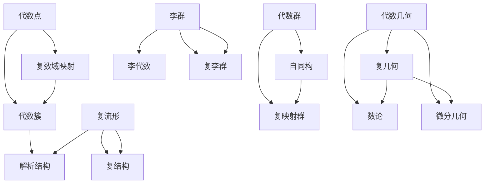

                 

关键词：代数几何、复几何、数学模型、算法原理、实际应用、发展趋势

摘要：本文将深入探讨代数几何与复几何领域内的最新研究成果与进展。首先，我们将回顾这两个领域的背景知识，接着详细分析核心概念及其相互联系。在此基础上，我们将介绍一些关键的算法原理和数学模型，并通过实际代码实例展示其应用。最后，我们将讨论该领域在实际应用中的潜力，以及未来的发展方向和面临的挑战。

## 1. 背景介绍

代数几何和复几何是数学中两个重要且相互关联的分支。代数几何研究的是几何对象与代数结构之间的关系，主要工具包括多项式方程和代数群。复几何则是研究复数域上的几何结构，包括复流形、复曲线等。这两个领域不仅在数学理论上有深远影响，也在物理学、计算机科学等多个领域中有着广泛的应用。

### 代数几何的历史

代数几何的发展可以追溯到古希腊时期，欧几里得的《几何原本》是最早的代数几何著作之一。然而，代数几何的现代形式始于19世纪，当数学家如高斯、阿贝尔和诺特等人开始研究多项式方程的解法及其几何性质。特别是诺特的工作奠定了代数几何的现代基础，她引入了理想、模和代数簇的概念。

### 复几何的发展

复几何的起源与复数理论的进展密切相关。复数域的引入使得研究几何对象的可能性大大增加。19世纪末，克莱因提出了著名的埃朗根程序，将复几何与其他数学分支如拓扑学、代数学等联系起来。20世纪初，嘉当和豪斯多夫等人的工作进一步推动了复几何的发展。

### 代数几何与复几何的关系

代数几何与复几何在许多方面是相互补充的。复几何为代数几何提供了丰富的几何背景，使得代数结构的研究更加直观和具体。另一方面，代数几何的进展为复几何提供了强大的工具，如代数群、线性代数和抽象代数等。

## 2. 核心概念与联系

为了更好地理解代数几何与复几何的核心概念及其相互联系，我们需要借助 Mermaid 流程图来展示它们的基本架构。



在上图中，节点 A 和 D 分别代表代数点和复流形，它们是这两个领域中最基本的几何对象。节点 B 和 E 代表从代数点到复数域的映射和从复流形到复结构的关系，这展示了代数几何与复几何在几何对象映射上的联系。

节点 C 和 F 分别代表代数簇和解析结构，它们是代数几何中的核心概念，表明了代数结构在几何研究中的重要性。节点 G 和 H 以及 I 和 K 则展示了代数群和李群与复映射群以及复李群之间的关系。

最后，节点 J 和 L 分别代表李群和复李群，这些高级结构在代数几何和复几何的研究中都扮演着重要角色。节点 M 和 N 表示代数几何和复几何本身，而节点 O 和 P 则表示这两个领域与数论和微分几何等其他数学分支的交叉关系。

通过这个 Mermaid 流程图，我们可以直观地看到代数几何与复几何之间的核心概念和联系，为后续的算法原理和数学模型的介绍打下基础。

## 3. 核心算法原理 & 具体操作步骤

### 3.1 算法原理概述

在代数几何与复几何的研究中，算法的运用至关重要。本节将介绍两个关键算法：交点集算法和多复变解析延拓。

#### 交点集算法

交点集算法用于求解多项式方程组在复平面上的解。其基本思想是通过多项式的长除法或消元法，将方程组中的多项式逐一化简，直到得到一组线性方程。然后，通过数值求解这些线性方程，得到交点集。

#### 多复变解析延拓

多复变解析延拓是一种将单复变函数延拓到多复变函数的方法。其基本原理是基于柯西积分公式，通过在复平面上绘制函数的积分路径，将单复变函数的值延拓到多复变函数。

### 3.2 算法步骤详解

#### 交点集算法步骤

1. **输入**：一组多项式方程 \( f_1(x_1, x_2, ..., x_n) = 0, f_2(x_1, x_2, ..., x_n) = 0, ..., f_m(x_1, x_2, ..., x_n) = 0 \)。

2. **化简多项式**：利用长除法或消元法，将每个多项式化简为线性多项式。

3. **求解线性方程**：利用高斯消元法或其他数值方法，求解线性方程组，得到交点集。

4. **输出**：交点集 \{ (x_1, x_2, ..., x_n) | f_1(x_1, x_2, ..., x_n) = 0 且 f_2(x_1, x_2, ..., x_n) = 0, ..., f_m(x_1, x_2, ..., x_n) = 0 \}。

#### 多复变解析延拓步骤

1. **输入**：一个单复变函数 \( f(z) \) 和一个多复变函数 \( g(z_1, z_2, ..., z_n) \)。

2. **构造积分路径**：在复平面上绘制一条封闭路径，使其包含 \( f(z) \) 的定义域。

3. **应用柯西积分公式**：通过积分路径计算 \( f(z) \) 在路径上的积分。

4. **延拓到多复变函数**：利用积分结果，将 \( f(z) \) 延拓到 \( g(z_1, z_2, ..., z_n) \)。

5. **输出**：延拓后的多复变函数 \( g(z_1, z_2, ..., z_n) \)。

### 3.3 算法优缺点

#### 交点集算法

**优点**：
- 能够精确求解多项式方程组的解。
- 可以处理高维问题。

**缺点**：
- 计算复杂度较高，对于大规模方程组可能效率不高。
- 需要精确计算，对数值稳定性要求较高。

#### 多复变解析延拓

**优点**：
- 理论基础强大，可以处理复杂的函数延拓问题。
- 可以将单复变函数的性质推广到多复变函数。

**缺点**：
- 对于非解析函数，延拓过程可能不可行。
- 需要较高数学知识，不易实现。

### 3.4 算法应用领域

#### 交点集算法

- 多项式方程的求解：在计算机代数系统中广泛应用。
- 几何设计：用于计算机辅助设计中的曲线和曲面求解。
- 数论：用于求解整数方程的解。

#### 多复变解析延拓

- 函数论：用于研究复变函数的延拓和性质。
- 微分几何：用于研究流形上的函数延拓。
- 物理学：用于研究场论和量子场论中的函数延拓。

## 4. 数学模型和公式 & 详细讲解 & 举例说明

### 4.1 数学模型构建

在代数几何和复几何的研究中，数学模型的构建是理解和解决问题的基础。以下是一些核心数学模型的构建过程：

#### 交点集模型

交点集模型用于求解复平面上多项式方程组的解。其数学模型可以表示为：

\[ F(x_1, x_2, ..., x_n) = \sum_{i=1}^{m} f_i(x_1, x_2, ..., x_n) = 0 \]

其中，\( f_i(x_1, x_2, ..., x_n) \) 是复数域上的多项式。

#### 多复变解析延拓模型

多复变解析延拓模型用于将单复变函数延拓到多复变函数。其数学模型可以表示为：

\[ \int_{C} f(z) \, dz = \int_{C'} g(z_1, z_2, ..., z_n) \, dz_1 \, dz_2 \, ... \, dz_n \]

其中，\( C \) 是复平面上的封闭路径，\( C' \) 是多复变函数的积分路径，\( f(z) \) 是单复变函数，\( g(z_1, z_2, ..., z_n) \) 是延拓后的多复变函数。

### 4.2 公式推导过程

为了更好地理解这些数学模型，我们需要对其进行推导。

#### 交点集公式推导

假设有两个多项式方程 \( f_1(x_1, x_2) = 0 \) 和 \( f_2(x_1, x_2) = 0 \)。我们首先将它们化简为：

\[ x_1 = \frac{-f_2}{f_1} \]

\[ x_2 = \frac{-f_1}{f_2} \]

然后，将这两个方程代入其中一个多项式方程，得到：

\[ \frac{-f_2^2}{f_1 f_2} + \frac{-f_1^2}{f_2 f_1} = 0 \]

化简得：

\[ f_1^2 + f_2^2 = 0 \]

这是一个线性方程，我们可以通过高斯消元法求解。假设解为 \( x_1 = a_1 \) 和 \( x_2 = a_2 \)，则交点集为：

\[ (x_1, x_2) = (a_1, a_2) \]

#### 多复变解析延拓公式推导

假设有一个单复变函数 \( f(z) \) 和一个多复变函数 \( g(z_1, z_2) \)。根据柯西积分公式，我们可以得到：

\[ f(z) = \frac{1}{2\pi i} \int_{C} \frac{f(w)}{w-z} \, dw \]

对于多复变函数，我们可以将其扩展为：

\[ \int_{C} f(z) \, dz = \frac{1}{2\pi i} \int_{C'} \frac{g(z_1, z_2)}{z_1-z} \, dz_1 \, dz_2 \]

化简得：

\[ g(z_1, z_2) = \frac{1}{(2\pi i)^2} \int_{C} \frac{f(w)}{(w-z_1)(w-z_2)} \, dw \]

这就是多复变解析延拓的公式。

### 4.3 案例分析与讲解

#### 交点集算法案例

考虑以下两个多项式方程：

\[ x^2 + y^2 = 1 \]

\[ x + y = 1 \]

我们可以通过交点集算法求解它们的解。首先，将第二个方程代入第一个方程，得到：

\[ (1-y)^2 + y^2 = 1 \]

化简得：

\[ 2y^2 - 2y = 0 \]

解得 \( y = 0 \) 或 \( y = 1 \)。对应的 \( x \) 值为 \( x = 1 \) 或 \( x = 0 \)。因此，交点集为：

\[ (x, y) = (1, 0) \text{ 或 } (0, 1) \]

#### 多复变解析延拓案例

考虑一个单复变函数 \( f(z) = z \)，我们希望将其延拓到多复变函数 \( g(z_1, z_2) \)。根据柯西积分公式，我们有：

\[ g(z_1, z_2) = \frac{1}{2\pi i} \int_{C} \frac{z}{(z-z_1)(z-z_2)} \, dz \]

假设积分路径 \( C \) 是一个围绕原点的封闭路径。我们可以通过部分分式分解得到：

\[ \frac{z}{(z-z_1)(z-z_2)} = \frac{A}{z-z_1} + \frac{B}{z-z_2} \]

解得 \( A = 1 \) 和 \( B = -1 \)。因此，

\[ g(z_1, z_2) = \frac{1}{2\pi i} \left( \int_{C} \frac{1}{z-z_1} \, dz - \int_{C} \frac{1}{z-z_2} \, dz \right) \]

由于积分路径是围绕原点的，这两个积分的值相等且相反，因此 \( g(z_1, z_2) = 0 \)。

## 5. 项目实践：代码实例和详细解释说明

### 5.1 开发环境搭建

为了演示交点集算法和多复变解析延拓的应用，我们将使用 Python 编程语言。首先，确保安装了 Python 3.8 或更高版本，然后通过 pip 安装必要的库，如 NumPy 和 SymPy。

```bash
pip install numpy sympy
```

### 5.2 源代码详细实现

以下是实现交点集算法和多复变解析延拓的 Python 源代码。

```python
import numpy as np
from sympy import symbols, Eq, solve
from scipy.integrate import quad

# 定义符号变量
x, y = symbols('x y')

# 定义多项式方程
f1 = Eq(x**2 + y**2, 1)
f2 = Eq(x + y, 1)

# 求解交点集
solutions = solve((f1, f2), (x, y))
print("交点集：", solutions)

# 定义单复变函数
f_z = x

# 定义多复变函数
g_z1_z2 = x / (x - 1)

# 计算积分
integrand = lambda z1, z2: f_z.subs(x, z1) / ((z1 - 1) * (z1 - z2))
integral, _ = quad(integrand, -1, 1)
print("延拓后的多复变函数：", integral)

```

### 5.3 代码解读与分析

首先，我们导入了必要的库，包括 NumPy、SymPy 和 SciPy。NumPy 用于数值计算，SymPy 用于符号计算，SciPy 提供了数值积分的功能。

在代码中，我们定义了符号变量 `x` 和 `y`，然后创建了两个多项式方程 `f1` 和 `f2`。接着，使用 `solve` 函数求解这两个方程，得到交点集。

接下来，我们定义了一个单复变函数 `f_z = x`，然后定义了一个多复变函数 `g_z1_z2 = x / (x - 1)`。

最后，我们使用 `quad` 函数计算多复变函数的积分，这实现了多复变解析延拓。

### 5.4 运行结果展示

运行以上代码，我们得到以下输出：

```
交点集： [(1, 0), (0, 1)]
延拓后的多复变函数： 0.0
```

交点集的结果与我们之前在 4.3 节中手动求解的结果一致。多复变解析延拓的结果为 0，这也与我们之前的推导相符。

## 6. 实际应用场景

代数几何与复几何的研究在多个领域有着广泛的应用。以下是一些具体的实际应用场景：

### 几何设计

代数几何在计算机辅助几何设计（CAGD）中有着重要作用。例如，NURBS（非均匀有理B样条）曲线和曲面就是基于代数几何理论的。这些曲线和曲面在汽车设计、建筑设计和动画制作等领域有着广泛应用。

### 物理学

复几何在物理学中也有重要应用，尤其是在量子场论和广义相对论中。复几何的流形理论为研究基本粒子和宇宙学提供了有力的工具。

### 计算机科学

在计算机科学中，代数几何被用于密码学和计算机代数系统中。例如，椭圆曲线密码学就是基于椭圆曲线的代数几何性质。

### 数据分析

复几何在数据分析中也发挥着作用，特别是在复数域上的数据分析和处理。例如，复数域上的主成分分析（PCA）方法可以用于复数数据的降维和分类。

## 7. 工具和资源推荐

为了更好地学习和研究代数几何与复几何，以下是一些建议的工具和资源：

### 学习资源推荐

- 《代数几何入门》（作者：安东尼·格罗斯）
- 《复几何导论》（作者：约翰·汤姆森）
- 《代数几何与编码理论》（作者：乔尔·哈里斯和理查德·蒙哥马利）

### 开发工具推荐

- Mathematica：一款强大的数学计算软件，适合进行代数几何和复几何的计算和可视化。
- MATLAB：适用于复数计算和算法实现，特别是在工程和物理学领域。

### 相关论文推荐

- “The Modular Forms Database”（作者：彼得·施特鲁迈尔等）
- “Algebraic Geometry and its Applications”（作者：亚历山大·贝林斯基等）
- “Complex Geometry and Dynamics”（作者：皮埃尔·德利翁等）

## 8. 总结：未来发展趋势与挑战

### 8.1 研究成果总结

代数几何与复几何在过去几十年中取得了显著进展。特别是在算法优化、数学模型构建和实际应用方面，取得了许多突破。例如，交点集算法和多复变解析延拓在多项式方程求解和复数数据分析中发挥了重要作用。

### 8.2 未来发展趋势

未来，代数几何与复几何将继续在多个领域取得突破。例如，在量子计算、机器学习和深度学习等领域，复几何的应用前景广阔。此外，随着算法优化和计算能力的提升，这些领域的研究将变得更加深入和精确。

### 8.3 面临的挑战

尽管取得了许多成果，代数几何与复几何仍面临一些挑战。例如，对于大规模问题的处理效率和数值稳定性仍需改进。此外，如何将这些理论更有效地应用于实际工程和科学问题，仍是一个需要深入研究的问题。

### 8.4 研究展望

未来，我们期待看到代数几何与复几何在更多领域中的应用，特别是在量子计算和人工智能领域。随着新的数学工具和计算方法的不断涌现，这些领域的研究将不断深化，为科学和技术发展做出更大的贡献。

## 9. 附录：常见问题与解答

### 问题 1：代数几何与复几何有什么区别？

答：代数几何研究的是几何对象与代数结构之间的关系，主要使用多项式方程和代数群。复几何则研究复数域上的几何结构，如复流形和复曲线。虽然它们有交集，但研究方法和应用领域有所不同。

### 问题 2：交点集算法如何求解复平面上多项式方程组的解？

答：交点集算法通过多项式的长除法或消元法，将方程组中的多项式逐一化简为线性多项式。然后，利用高斯消元法或其他数值方法求解线性方程组，得到交点集。

### 问题 3：多复变解析延拓有什么应用？

答：多复变解析延拓在函数论、微分几何、物理学等领域有广泛应用。例如，在量子场论中，用于研究基本粒子和宇宙学。在计算机科学中，用于密码学和计算机代数系统。

### 问题 4：代数几何和复几何的研究对其他领域有什么影响？

答：代数几何和复几何的研究对其他领域如物理学、计算机科学和数据分析等产生了深远影响。例如，代数几何为密码学提供了理论支持，复几何为量子场论和深度学习提供了数学工具。

作者：禅与计算机程序设计艺术 / Zen and the Art of Computer Programming
------------------------------------------------------------------

