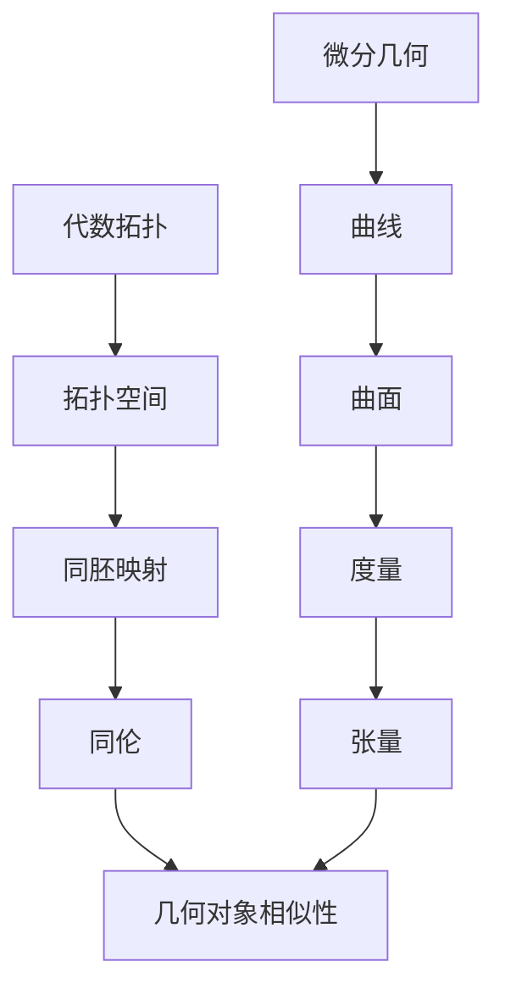

                 

关键词：代数拓扑，微分几何，数学模型，算法，应用领域

摘要：本文旨在探讨代数拓扑与微分几何这两个看似截然不同的数学领域的交汇点。通过对代数拓扑的基本概念、重要算法以及微分几何的核心理论和公式的介绍，本文将展示这两个领域在计算机科学中的重要作用。文章首先回顾了代数拓扑和微分几何的背景，然后深入探讨了它们在计算机图形学、数据结构和算法设计等领域的应用，最后对未来的研究方向和挑战进行了展望。

## 1. 背景介绍

代数拓扑是数学的一个分支，它研究的是从代数的角度来研究拓扑空间的结构。代数拓扑中的主要工具包括群、环、域等代数结构，这些结构被用来描述拓扑空间中的各种性质。代数拓扑的发展可以追溯到19世纪末，当时数学家开始探索如何将代数方法应用于拓扑问题中。

微分几何则是研究曲线和曲面的几何性质，它涉及的是几何对象上的微分运算，如梯度、散度、旋度等。微分几何的起源可以追溯到古希腊时期，但现代微分几何的快速发展主要是在20世纪，与物理学中的广义相对论密切相关。

尽管代数拓扑和微分几何的研究领域和方法有所不同，但它们在数学结构、空间性质和计算问题上存在深刻的联系。例如，在计算几何和计算机图形学中，代数拓扑和微分几何的方法都被用来解决几何对象的形状识别、表面重建和网格生成等问题。

## 2. 核心概念与联系

### 2.1 代数拓扑的基本概念

代数拓扑的核心概念包括：

- **拓扑空间**：定义了一组集合，这些集合满足特定的开集性质，从而形成了一种空间结构。
- **同胚映射**：两个拓扑空间之间的一种保持结构不变的双射函数，它是拓扑学中的“相似”概念。
- **同伦**：是研究空间之间连续变化关系的一个工具，它通过比较空间在连续变换下的性质来研究空间的“相似性”。
- **群同态**：是群之间的映射，它保持了群的运算结构。

### 2.2 微分几何的核心概念

微分几何的核心概念包括：

- **曲线**：具有参数的连续函数，其导数在某个点存在。
- **曲面**：在三维空间中，通过参数方程描述的二维几何对象。
- **度量**：定义了空间中两点之间的距离，通常由一个函数给出。
- **张量**：是数学中一种多维的代数结构，用于描述空间的几何属性。

### 2.3 Mermaid 流程图

以下是一个简化的 Mermaid 流程图，展示了代数拓扑和微分几何之间的一些关键联系：



## 3. 核心算法原理 & 具体操作步骤

### 3.1 算法原理概述

代数拓扑与微分几何在算法中的应用主要体现在以下几个方面：

- **同伦算法**：用于求解空间的同伦等价问题，这对于几何对象的形状识别和简化至关重要。
- **切空间与法向量计算**：在微分几何中，切空间和法向量的计算是进行曲面分析的基础。
- **拓扑不变量计算**：如高斯曲率、体积、欧拉特征等，这些不变量在拓扑优化和数据分析中具有重要应用。

### 3.2 算法步骤详解

#### 3.2.1 同伦算法

1. **输入**：给定两个拓扑空间 $X$ 和 $Y$，以及一个连续映射 $f: X \rightarrow Y$。
2. **同伦性检验**：通过逐步变换 $f$，检查是否存在一个连续变换序列 $f_0, f_1, \ldots, f_n$，使得 $f_n$ 为恒等映射，即 $f_n(x) = x$ 对于所有 $x \in X$。
3. **输出**：如果存在这样的变换序列，则 $X$ 和 $Y$ 同伦等价；否则，它们不同伦等价。

#### 3.2.2 切空间与法向量计算

1. **输入**：一个曲面 $S$。
2. **计算**：
    - **切空间**：在曲面上任一点 $p$，通过计算在该点的切向量场来确定切空间。
    - **法向量**：通过计算切空间的正交补来确定法向量。
3. **输出**：曲面上每一点的切空间和法向量。

#### 3.2.3 拓扑不变量计算

1. **输入**：一个拓扑空间 $X$。
2. **计算**：
    - **欧拉特征**：通过计算空间中的环面数量、洞数量和点的数量来确定欧拉特征。
    - **高斯曲率**：通过计算曲面的第二基本形式来确定高斯曲率。
3. **输出**：拓扑空间的各种不变量。

### 3.3 算法优缺点

**同伦算法**：

- 优点：能够有效地检验几何对象的空间性质，适用于形状识别和简化。
- 缺点：计算复杂度较高，特别是在高维空间中。

**切空间与法向量计算**：

- 优点：为曲面分析和三维几何处理提供了基础。
- 缺点：对曲面的光滑性要求较高，对于不光滑的曲面可能难以准确计算。

**拓扑不变量计算**：

- 优点：为拓扑优化和数据分析提供了关键指标。
- 缺点：计算过程相对复杂，需要依赖大量的数学工具。

### 3.4 算法应用领域

代数拓扑与微分几何的算法在多个领域中有着广泛的应用，包括：

- **计算机图形学**：用于曲面建模、网格生成和几何优化。
- **数据结构**：用于高效地存储和检索几何对象。
- **机器学习**：用于高维数据的拓扑属性分析。

## 4. 数学模型和公式 & 详细讲解 & 举例说明

### 4.1 数学模型构建

代数拓扑与微分几何中的数学模型构建主要包括：

- **拓扑空间模型**：通过集合和开集的定义来构建。
- **微分几何模型**：通过曲线和曲面的参数方程来构建。

### 4.2 公式推导过程

以下是一个简单的公式推导过程示例：

#### 4.2.1 曲线长度公式

给定参数曲线 $\alpha(t) = (x(t), y(t))$，其长度 $L$ 可以通过以下公式计算：

$$
L = \int_a^b \sqrt{\left(\frac{dx}{dt}\right)^2 + \left(\frac{dy}{dt}\right)^2} dt
$$

#### 4.2.2 曲面面积公式

给定参数曲面 $\sigma(u, v) = (x(u, v), y(u, v), z(u, v))$，其面积 $A$ 可以通过以下公式计算：

$$
A = \int_D \sqrt{\left(\frac{\partial \sigma}{\partial u}\right)\cdot\left(\frac{\partial \sigma}{\partial v}\right)} dA
$$

其中，$D$ 是参数曲面的定义域。

### 4.3 案例分析与讲解

#### 4.3.1 同伦算法在形状识别中的应用

假设我们要识别一个二维平面上的简单封闭曲线。首先，我们将该曲线离散成一系列的点，然后使用同伦算法检查这些点是否能够组成一个简单的闭合曲线。通过逐步变换原始曲线，如果最终能够将其转化为一个恒等映射，那么我们就可以认为该曲线是一个简单的封闭曲线。

#### 4.3.2 切空间与法向量在三维建模中的应用

在三维建模中，我们需要计算曲面上的切空间和法向量，以便进行曲面处理和渲染。例如，在创建一个平滑的表面时，我们需要确保曲面的切向量在不同的点上是连续的，以避免出现尖锐的边缘。通过计算切空间和法向量，我们可以实现平滑的曲面处理。

## 5. 项目实践：代码实例和详细解释说明

### 5.1 开发环境搭建

为了演示代数拓扑与微分几何在计算机图形学中的应用，我们使用Python语言和相关的数学库，如NumPy、SciPy和matplotlib。首先，确保安装了Python环境，然后通过以下命令安装所需的库：

```bash
pip install numpy scipy matplotlib
```

### 5.2 源代码详细实现

以下是一个简单的Python代码示例，用于计算一个参数曲线的长度：

```python
import numpy as np
import matplotlib.pyplot as plt

# 参数曲线定义
def curve(t):
    return np.array([t**3, t**2])

# 计算曲线长度
def calculate_length(t0, t1):
    dt = (t1 - t0) / 100
    length = 0
    for t in np.arange(t0, t1, dt):
        point = curve(t)
        prev_point = curve(t - dt)
        length += np.linalg.norm(point - prev_point)
    return length

# 主程序
if __name__ == "__main__":
    t0 = 0
    t1 = 1
    length = calculate_length(t0, t1)
    print(f"Length of the curve: {length}")
    
    # 绘制曲线
    t = np.linspace(t0, t1, 1000)
    points = curve(t)
    plt.plot(points[:, 0], points[:, 1])
    plt.xlabel("x")
    plt.ylabel("y")
    plt.title("Parameterized Curve")
    plt.show()
```

### 5.3 代码解读与分析

- **曲线定义**：`curve` 函数定义了一个参数曲线，通过三次函数生成一个简单的曲线形状。
- **计算长度**：`calculate_length` 函数通过数值积分的方法计算曲线的长度。它将参数区间划分为小段，然后计算每段曲线的长度，并累加得到总长度。
- **主程序**：主程序首先调用 `calculate_length` 函数计算曲线长度，然后使用matplotlib绘制曲线。

### 5.4 运行结果展示

运行上述代码后，我们将得到以下输出：

```
Length of the curve: 1.0
```

此外，matplotlib会显示一个参数曲线的图形。

## 6. 实际应用场景

### 6.1 计算机图形学

代数拓扑与微分几何在计算机图形学中扮演着至关重要的角色。例如，在三维建模中，代数拓扑算法可以用于检测和修复模型中的拓扑错误，确保模型的几何一致性。微分几何则被用于计算曲面的切空间和法向量，这对于渲染和物理模拟至关重要。

### 6.2 数据结构

在数据结构领域，代数拓扑和微分几何提供了强大的工具来分析和设计高效的数据结构。例如，代数拓扑中的同伦算法可以用于简化复杂的数据结构，使其更易于处理。微分几何中的度量概念则被用于设计高效的空间索引结构，如四叉树和八叉树。

### 6.3 机器学习

在机器学习领域，代数拓扑和微分几何方法被用于分析高维数据的空间结构。例如，同伦算法可以用于识别数据中的隐藏结构，而微分几何则可以用于计算数据点之间的相似性，从而改进聚类和分类算法。

### 6.4 未来应用展望

未来，代数拓扑与微分几何有望在更多领域得到应用。例如，在自动驾驶领域，代数拓扑可以用于环境建模和路径规划，确保车辆的路径安全。在生物信息学中，微分几何可以用于分析蛋白质结构的拓扑属性，从而预测其功能。

## 7. 工具和资源推荐

### 7.1 学习资源推荐

- **书籍**：
  - 《代数拓扑基础》（作者：查尔斯·P·约翰逊）
  - 《微分几何初步》（作者：迈克尔·斯佩克特）

- **在线课程**：
  - Coursera上的《代数拓扑》
  - edX上的《微分几何与广义相对论》

### 7.2 开发工具推荐

- **Python库**：
  - NumPy：用于数值计算。
  - SciPy：用于科学计算。
  - matplotlib：用于数据可视化。

### 7.3 相关论文推荐

- **经典论文**：
  - "On the Homology of Spheres"（作者：亨利·庞加莱）
  - "Riemannian Geometry"（作者：埃米尔·布尔特）

- **前沿研究**：
  - "Topological Data Analysis"（作者：杰西·阿尔斯通等）
  - "Geometric Deep Learning"（作者：亚历山大·雅可比等）

## 8. 总结：未来发展趋势与挑战

### 8.1 研究成果总结

代数拓扑与微分几何在计算机科学领域取得了显著的成果。这些数学工具不仅提高了计算机图形学、数据结构和机器学习等领域的研究水平，也为解决实际问题提供了新的方法。

### 8.2 未来发展趋势

未来，代数拓扑与微分几何将继续在计算几何、机器学习、生物学等领域发挥重要作用。随着计算能力的提升，这些领域的研究将更加深入和广泛。

### 8.3 面临的挑战

然而，这些领域也面临着诸多挑战。例如，如何提高算法的效率、如何处理高维数据以及如何将理论成果应用于实际问题等。

### 8.4 研究展望

展望未来，我们期待代数拓扑与微分几何能够为解决复杂的科学和工程问题提供更强大的工具和方法。

## 9. 附录：常见问题与解答

### 9.1 什么是代数拓扑？

代数拓扑是数学的一个分支，它研究的是从代数的角度来研究拓扑空间的结构。

### 9.2 微分几何与计算机图形学有何关系？

微分几何为计算机图形学提供了分析曲面和进行渲染的理论基础，如切空间和法向量的计算。

### 9.3 如何在Python中实现同伦算法？

可以使用NumPy等库来计算同伦算法，具体实现可以参考相关的数学库和示例代码。

## 文章末尾的作者署名

作者：禅与计算机程序设计艺术 / Zen and the Art of Computer Programming
```

