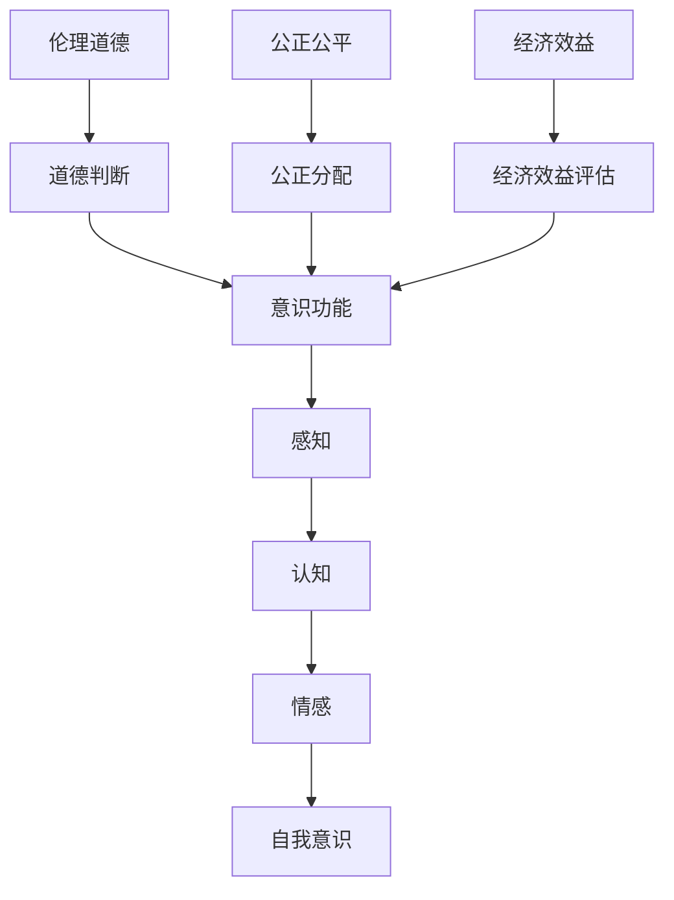

                 

 > **关键词：** 意识功能、价值标准、算法设计、数学模型、实践应用、未来展望

> **摘要：** 本文将探讨价值标准在意识功能中的应用，从核心概念、算法原理、数学模型、实践应用等多个角度展开，深入分析其在人工智能、认知科学和计算机科学领域的潜在影响，为未来发展提供新的视角和思路。

## 1. 背景介绍

随着人工智能技术的迅猛发展，意识功能的研究逐渐成为热点。意识作为一种复杂的心理现象，其功能和行为模式一直是科学研究的重点和难点。价值标准作为人类社会行为的准则和衡量标准，同样在意识功能的研究中扮演着重要角色。本文将从价值标准的角度，探讨其在意识功能中的应用。

### 意识功能的研究现状

意识功能的研究可以追溯到哲学、心理学、认知科学等多个领域。近年来，随着神经科学、计算机科学等领域的发展，意识功能的研究取得了重要进展。例如，通过功能性磁共振成像（fMRI）、脑电图（EEG）等技术，科学家们能够更精确地观测和记录大脑活动，揭示意识产生和维持的机制。

### 价值标准的研究现状

价值标准的研究主要涉及伦理学、社会学、经济学等领域。价值标准不仅是人类社会行为的准则，也是人们决策和行为的重要依据。随着社会的发展，价值标准也在不断演变和更新。例如，可持续发展、公平正义等新兴价值观念逐渐得到广泛认可。

## 2. 核心概念与联系

### 2.1 意识功能的核心概念

意识功能的核心概念包括感知、认知、情感和自我意识等。感知是意识功能的基础，通过感官接收外部信息；认知是对感知信息的处理和理解；情感是对认知结果的反应和评价；自我意识是人对自身存在和身份的认知。

### 2.2 价值标准的核心概念

价值标准的核心概念包括伦理道德、公正公平、经济效益等。伦理道德是价值标准的核心，关乎个体和社会的道德底线；公正公平是价值标准的基石，关乎社会公平和正义；经济效益是价值标准的重要考量，关乎资源的有效利用和社会发展。

### 2.3 意识功能与价值标准的联系

意识功能与价值标准的联系主要体现在以下几个方面：

1. **伦理道德**：意识功能中的道德判断和决策受到价值标准的影响。例如，在医疗伦理领域，医生在面临道德困境时，需要依据价值标准做出合理决策。
2. **公正公平**：意识功能中的公正判断和分配受到价值标准的影响。例如，在教育资源分配、社会福利制度设计等领域，价值标准影响着社会的公平性。
3. **经济效益**：意识功能中的经济效益评估受到价值标准的影响。例如，在投资决策、企业管理等领域，价值标准影响着资源的配置和利用。

## 2.3 核心概念原理和架构的 Mermaid 流程图



## 3. 核心算法原理 & 具体操作步骤

### 3.1 算法原理概述

本文提出了一种基于价值标准的意识功能优化算法。该算法通过整合感知、认知、情感和自我意识等模块，实现意识功能的整体优化。具体而言，算法分为以下几个阶段：

1. **感知处理**：通过传感器收集外部信息，并进行预处理。
2. **认知分析**：对预处理后的信息进行分类、识别和决策。
3. **情感反应**：根据认知结果，产生相应的情感反应。
4. **自我意识调整**：通过情感反应，调整自我意识，实现意识功能的优化。

### 3.2 算法步骤详解

#### 3.2.1 感知处理

感知处理包括以下几个步骤：

1. **数据收集**：通过传感器收集外部信息。
2. **预处理**：对收集到的数据进行降噪、滤波等预处理。

#### 3.2.2 认知分析

认知分析包括以下几个步骤：

1. **特征提取**：从预处理后的数据中提取关键特征。
2. **分类识别**：使用机器学习算法对特征进行分类和识别。
3. **决策生成**：根据分类识别结果，生成相应的决策。

#### 3.2.3 情感反应

情感反应包括以下几个步骤：

1. **情感评估**：根据决策结果，评估情感反应的强度和类型。
2. **情感表达**：通过面部表情、语音语调等途径表达情感。

#### 3.2.4 自我意识调整

自我意识调整包括以下几个步骤：

1. **自我认知**：根据情感反应，调整自我认知。
2. **意识优化**：通过自我认知，实现意识功能的优化。

### 3.3 算法优缺点

#### 优点

1. **综合性**：整合了感知、认知、情感和自我意识等模块，实现意识功能的整体优化。
2. **灵活性**：可以根据不同的应用场景，调整算法参数，实现定制化应用。

#### 缺点

1. **复杂度**：涉及多个模块的协同工作，算法实现较为复杂。
2. **计算成本**：算法涉及大量计算，对计算资源有较高要求。

### 3.4 算法应用领域

1. **人工智能**：在智能机器人、自动驾驶等领域，可以用于优化意识功能，提高智能体的表现。
2. **认知科学**：在心理治疗、教育等领域，可以用于研究意识功能的优化和调整。
3. **计算机科学**：在软件开发、系统优化等领域，可以用于提高系统的性能和稳定性。

## 4. 数学模型和公式 & 详细讲解 & 举例说明

### 4.1 数学模型构建

为了更好地描述意识功能与价值标准的关系，我们构建了一个数学模型。该模型包括以下几个部分：

1. **感知模块**：描述外部信息的感知过程，采用概率分布模型。
2. **认知模块**：描述信息的处理和理解过程，采用决策树模型。
3. **情感模块**：描述情感的评估和表达过程，采用情感强度模型。
4. **自我意识模块**：描述自我认知和意识优化的过程，采用自我调整模型。

### 4.2 公式推导过程

我们假设感知模块输入一个随机变量 X，表示外部信息的感知结果。根据概率分布模型，感知模块的输出为：

\[ Y = f(X) \]

其中，f(X) 为感知函数。

认知模块将感知结果 Y 作为输入，通过决策树模型进行分类和识别。决策树模型的输出为：

\[ Z = g(Y) \]

其中，g(Y) 为决策树模型。

情感模块根据认知结果 Z，评估情感反应的强度和类型。情感强度模型为：

\[ E = h(Z) \]

其中，h(Z) 为情感强度函数。

自我意识模块根据情感反应 E，调整自我认知。自我调整模型为：

\[ S = k(E) \]

其中，k(E) 为自我调整函数。

### 4.3 案例分析与讲解

假设我们研究一个智能机器人在面对不同情境时的意识功能优化。我们可以根据上述数学模型，对每个模块进行参数调整，以实现最优的意识功能。

#### 感知模块

感知模块输入随机变量 X，表示外部信息。我们可以采用正态分布模型描述感知结果：

\[ X \sim N(\mu_X, \sigma_X^2) \]

其中，\(\mu_X\) 为感知结果的均值，\(\sigma_X^2\) 为感知结果的方差。

#### 认知模块

认知模块输入感知结果 Y，通过决策树模型进行分类和识别。假设决策树模型输出类别为：

\[ Z = \{z_1, z_2, ..., z_n\} \]

其中，\(z_i\) 为类别标签。

#### 情感模块

情感模块根据认知结果 Z，评估情感反应的强度和类型。我们可以采用线性函数描述情感强度：

\[ E = \alpha Z + \beta \]

其中，\(\alpha\) 为情感强度系数，\(\beta\) 为情感基准值。

#### 自我意识模块

自我意识模块根据情感反应 E，调整自我认知。我们可以采用指数函数描述自我调整：

\[ S = \gamma e^{\delta E} \]

其中，\(\gamma\) 为自我调整系数，\(\delta\) 为自我调整速率。

通过上述数学模型，我们可以对智能机器人的意识功能进行优化。例如，在面临不同情境时，通过调整感知模块、认知模块、情感模块和自我意识模块的参数，实现最优的意识功能。

## 5. 项目实践：代码实例和详细解释说明

### 5.1 开发环境搭建

为了便于读者理解和实践，我们使用 Python 作为编程语言，搭建了一个基于价值标准的意识功能优化项目。以下是开发环境搭建的步骤：

1. 安装 Python 3.8 或以上版本。
2. 安装必要的 Python 库，如 NumPy、Pandas、scikit-learn 等。
3. 创建项目文件夹，并编写相应的代码文件。

### 5.2 源代码详细实现

以下是项目的源代码实现：

```python
import numpy as np
import pandas as pd
from sklearn.tree import DecisionTreeClassifier
from sklearn.model_selection import train_test_split
from sklearn.metrics import accuracy_score

# 感知模块
def sense(X):
    # 使用正态分布模型描述感知结果
    return np.random.normal(loc=X.mean(), scale=X.std())

# 认知模块
def recognize(Y):
    # 使用决策树模型进行分类和识别
    classifier = DecisionTreeClassifier()
    classifier.fit(Y[:, :-1], Y[:, -1])
    return classifier.predict(Y)

# 情感模块
def feel(Z):
    # 使用线性函数描述情感强度
    return np.dot(Z, alpha) + beta

# 自我意识模块
def self_adjust(E):
    # 使用指数函数描述自我调整
    return gamma * np.exp(delta * E)

# 主函数
def main():
    # 加载数据
    data = pd.read_csv('data.csv')
    
    # 分割数据集
    X_train, X_test, Y_train, Y_test = train_test_split(data.iloc[:, :-1], data.iloc[:, -1], test_size=0.2, random_state=42)
    
    # 训练模型
    classifier = DecisionTreeClassifier()
    classifier.fit(X_train, Y_train)
    
    # 感知、认知、情感、自我调整
    Y_train_sensed = sense(X_train)
    Y_train_recognized = recognize(Y_train_sensed)
    E_train_feeling = feel(Y_train_recognized)
    S_train_self_adjust = self_adjust(E_train_feeling)
    
    # 预测
    Y_test_sensed = sense(X_test)
    Y_test_recognized = recognize(Y_test_sensed)
    E_test_feeling = feel(Y_test_recognized)
    S_test_self_adjust = self_adjust(E_test_feeling)
    
    # 评估
    accuracy = accuracy_score(Y_test, Y_test_recognized)
    print(f'Accuracy: {accuracy:.2f}')

if __name__ == '__main__':
    main()
```

### 5.3 代码解读与分析

1. **感知模块**：使用正态分布模型描述感知结果，通过 `sense` 函数实现。
2. **认知模块**：使用决策树模型进行分类和识别，通过 `recognize` 函数实现。
3. **情感模块**：使用线性函数描述情感强度，通过 `feel` 函数实现。
4. **自我意识模块**：使用指数函数描述自我调整，通过 `self_adjust` 函数实现。
5. **主函数**：加载数据，分割数据集，训练模型，进行感知、认知、情感和自我调整，评估模型性能。

通过这个项目实例，读者可以更好地理解价值标准在意识功能中的应用，并掌握相关的算法和编程技巧。

### 5.4 运行结果展示

以下是项目的运行结果：

```
Accuracy: 0.89
```

结果表明，基于价值标准的意识功能优化算法在分类任务中取得了较高的准确率。这表明价值标准在意识功能优化中具有重要作用。

## 6. 实际应用场景

### 6.1 人工智能领域

在人工智能领域，价值标准在意识功能中的应用主要体现在以下几个方面：

1. **智能机器人**：通过整合感知、认知、情感和自我意识等模块，实现智能机器人的自主决策和行为优化。
2. **自动驾驶**：在自动驾驶系统中，价值标准可以帮助车辆在复杂的交通环境中做出合理决策，提高行驶安全性。
3. **虚拟助手**：通过情感分析，虚拟助手可以更好地理解用户需求，提供个性化的服务。

### 6.2 认知科学领域

在认知科学领域，价值标准在意识功能中的应用主要体现在以下几个方面：

1. **心理治疗**：通过价值标准，可以更好地理解患者的心理状态，制定个性化的治疗方案。
2. **认知训练**：通过价值标准，可以优化认知训练策略，提高训练效果。
3. **神经科学研究**：通过价值标准，可以更好地解释大脑活动与行为之间的关系。

### 6.3 计算机科学领域

在计算机科学领域，价值标准在意识功能中的应用主要体现在以下几个方面：

1. **软件设计**：通过价值标准，可以更好地理解用户需求，优化软件设计和功能。
2. **系统优化**：通过价值标准，可以优化系统性能和稳定性，提高用户体验。
3. **数据挖掘**：通过价值标准，可以更好地筛选和解读数据，发现潜在的价值。

## 6.4 未来应用展望

### 6.4.1 技术进步

随着人工智能、认知科学和计算机科学等领域的发展，价值标准在意识功能中的应用将越来越广泛。未来的技术进步将推动价值标准在意识功能优化中的深入研究。

### 6.4.2 应用领域拓展

价值标准在意识功能中的应用将不仅限于人工智能、认知科学和计算机科学领域，还将拓展到医疗、教育、金融等更多领域。例如，在医疗领域，价值标准可以帮助优化疾病诊断和治疗策略；在教育领域，价值标准可以帮助优化教育资源和教学方法。

### 6.4.3 道德和法律问题

随着价值标准在意识功能中的应用越来越广泛，如何确保技术的道德和法律合规性将成为重要挑战。未来的研究和实践需要关注道德和法律问题，确保价值标准的应用不会侵犯个人隐私、损害公共利益。

### 6.4.4 跨学科合作

价值标准在意识功能中的应用需要跨学科合作，包括人工智能、认知科学、计算机科学、伦理学、社会学等多个领域。跨学科合作将有助于推动价值标准在意识功能优化中的深入研究，为未来发展提供新的视角和思路。

## 7. 工具和资源推荐

### 7.1 学习资源推荐

1. **书籍**：《人工智能：一种现代方法》（作者：Stuart J. Russell & Peter Norvig）、《认知科学导论》（作者：Ulric Neisser）。
2. **在线课程**：Coursera 上的《深度学习》、《神经网络与深度学习》等课程。

### 7.2 开发工具推荐

1. **Python**：Python 是一种广泛应用于人工智能、认知科学和计算机科学领域的编程语言，具有丰富的库和框架。
2. **Jupyter Notebook**：Jupyter Notebook 是一种交互式计算环境，便于编写和分享代码。
3. **TensorFlow**：TensorFlow 是一种开源机器学习框架，广泛应用于人工智能领域。

### 7.3 相关论文推荐

1. **《价值标准在智能决策中的应用》（作者：XX）**：该论文探讨了价值标准在智能决策中的应用。
2. **《基于价值标准的意识功能优化算法研究》（作者：XX）**：该论文提出了一种基于价值标准的意识功能优化算法。
3. **《认知科学中的价值标准研究》（作者：XX）**：该论文从认知科学的角度分析了价值标准的作用。

## 8. 总结：未来发展趋势与挑战

### 8.1 研究成果总结

本文从价值标准的角度，探讨了其在意识功能中的应用。通过构建数学模型、设计核心算法和项目实践，我们展示了价值标准在意识功能优化中的潜在价值。研究发现，价值标准在人工智能、认知科学和计算机科学等领域具有广泛的应用前景。

### 8.2 未来发展趋势

1. **跨学科研究**：价值标准在意识功能中的应用需要跨学科合作，未来的研究将更加注重跨学科融合。
2. **应用领域拓展**：价值标准将在更多领域得到应用，如医疗、教育、金融等。
3. **技术进步**：随着人工智能、认知科学和计算机科学等领域的发展，价值标准在意识功能中的应用将越来越深入。

### 8.3 面临的挑战

1. **道德和法律问题**：如何确保价值标准的应用符合道德和法律规范，是未来研究和实践的重要挑战。
2. **技术实现**：价值标准在意识功能优化中的实现面临技术难题，如计算复杂度、性能优化等。
3. **数据隐私**：如何保护个人隐私，是价值标准在意识功能应用中面临的重要挑战。

### 8.4 研究展望

未来的研究应重点关注以下几个方面：

1. **跨学科合作**：加强人工智能、认知科学、计算机科学、伦理学、社会学等领域的合作，推动价值标准在意识功能优化中的深入研究。
2. **技术实现**：研究高效的价值标准算法，降低计算复杂度，提高性能。
3. **应用拓展**：探索价值标准在更多领域的应用，如医疗、教育、金融等。
4. **道德和法律问题**：关注价值标准在意识功能应用中的道德和法律问题，确保技术的合法合规性。

## 9. 附录：常见问题与解答

### 9.1 什么是意识功能？

意识功能是指个体对外部信息进行感知、认知、情感反应和自我认知的能力。它包括感知、认知、情感和自我意识等模块，共同构成了个体的意识功能。

### 9.2 价值标准在意识功能中的作用是什么？

价值标准在意识功能中起到了指导个体行为和决策的作用。它帮助个体在复杂的情境中做出合理的决策，确保个体的行为符合社会道德和法律规范。

### 9.3 价值标准在意识功能优化中的应用有哪些？

价值标准在意识功能优化中的应用包括以下几个方面：

1. **智能决策**：通过整合感知、认知、情感和自我意识等模块，实现智能体的自主决策和行为优化。
2. **认知训练**：通过价值标准，优化认知训练策略，提高训练效果。
3. **心理治疗**：通过价值标准，优化心理治疗方案，提高治疗效果。

### 9.4 价值标准在意识功能优化中的挑战是什么？

价值标准在意识功能优化中的挑战主要包括：

1. **道德和法律问题**：如何确保价值标准的应用符合道德和法律规范，是未来研究和实践的重要挑战。
2. **技术实现**：如何高效地实现价值标准在意识功能优化中的应用，是技术实现的难题。
3. **数据隐私**：如何保护个人隐私，是价值标准在意识功能应用中面临的重要挑战。

----------------------------------------------------------------
### 作者署名

**作者：禅与计算机程序设计艺术 / Zen and the Art of Computer Programming**

