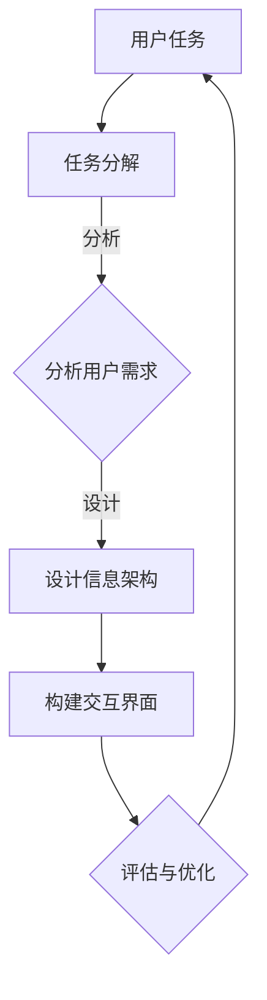

                 

关键词：任务导向设计，信息架构，用户体验，设计原则，系统效率

> 摘要：本文将探讨任务导向设计（Task-Oriented Design，简称TOD）对信息架构的深远影响。通过对TOD的基本概念、核心原则及其在信息架构中的应用进行分析，揭示TOD如何提高信息系统的效率和用户体验，并展望其未来发展趋势。

## 1. 背景介绍

随着互联网和信息技术的飞速发展，信息系统的复杂度和多样性不断增加。用户面对大量信息时，往往感到困惑和无从下手。为了解决这一问题，任务导向设计（Task-Oriented Design，简称TOD）应运而生。TOD强调以用户任务为核心，优化信息架构，提高用户完成任务的速度和满意度。

信息架构是信息系统设计的核心部分，它负责组织和结构化信息，使其易于查找和使用。传统的信息架构设计往往注重信息的逻辑结构和分类，而忽视了用户实际使用过程中的需求。任务导向设计则从用户的角度出发，通过优化信息流程和交互设计，提高信息系统的实用性和易用性。

## 2. 核心概念与联系

### 2.1 任务导向设计（TOD）

任务导向设计是一种以用户任务为中心的设计方法，其核心思想是将用户的使用过程视为一系列任务的完成。TOD强调从用户的角度出发，分析用户的需求和行为模式，设计符合用户预期的信息架构和交互界面。

### 2.2 信息架构（Information Architecture）

信息架构是指对信息进行组织、分类和结构化，以提供清晰、一致的用户体验。信息架构的核心目标是使信息易于查找和使用，提高用户完成任务的速度和效率。

### 2.3 TOD与IA的联系

任务导向设计与信息架构紧密相关。TOD通过分析用户任务，确定信息架构的优先级和结构，使信息架构更加符合用户需求。同时，信息架构为TOD提供了组织信息的框架，确保任务导向设计的有效实施。

### 2.4 Mermaid 流程图



## 3. 核心算法原理 & 具体操作步骤

### 3.1 算法原理概述

任务导向设计（TOD）的核心算法是任务分解（Task Decomposition）。任务分解的目的是将复杂的用户任务分解为一系列简单、易操作的任务单元，以便用户能够快速、高效地完成任务。

### 3.2 算法步骤详解

#### 3.2.1 分析用户需求

首先，通过对用户进行调研和分析，了解用户的需求和行为模式。这可以通过问卷调查、用户访谈、用户行为分析等方式进行。

#### 3.2.2 任务分解

根据用户需求，将用户任务分解为一系列子任务。任务分解应遵循以下原则：

1. 子任务应具有明确的目标和范围。
2. 子任务之间应具有清晰的依赖关系。
3. 子任务应易于操作和完成。

#### 3.2.3 设计信息架构

根据任务分解的结果，设计信息架构。信息架构应遵循以下原则：

1. 确定信息架构的优先级，确保核心信息易于查找和使用。
2. 设计信息分类和导航系统，提高信息的可访问性。
3. 设计一致、直观的交互界面，降低用户的学习成本。

#### 3.2.4 构建交互界面

根据信息架构，构建交互界面。交互界面应遵循以下原则：

1. 界面布局简洁、清晰，避免信息过载。
2. 界面元素应符合用户习惯，提高易用性。
3. 界面应提供实时反馈，提高用户信心。

#### 3.2.5 评估与优化

通过用户测试和反馈，评估信息架构和交互界面的效果，并根据评估结果进行优化。

### 3.3 算法优缺点

#### 优点：

1. 提高信息系统的实用性和易用性。
2. 提高用户完成任务的速度和满意度。
3. 促进信息架构和交互界面的优化。

#### 缺点：

1. 需要大量的用户调研和分析工作。
2. 可能会导致信息架构过于复杂。

### 3.4 算法应用领域

任务导向设计（TOD）广泛应用于各种信息系统，如电子商务网站、在线教育平台、企业办公系统等。通过TOD，这些系统能够更好地满足用户需求，提高用户体验和系统效率。

## 4. 数学模型和公式 & 详细讲解 & 举例说明

### 4.1 数学模型构建

任务导向设计（TOD）的数学模型可以基于用户满意度（User Satisfaction，记为S）和任务完成时间（Task Completion Time，记为T）两个核心指标进行构建。

设用户满意度为S，任务完成时间为T，则TOD的数学模型为：

S = f(T)

其中，f为满意度与完成时间的关系函数。根据用户行为数据和实验结果，可以确定f的具体形式。

### 4.2 公式推导过程

根据任务导向设计（TOD）的核心原则，我们可以推导出以下公式：

S = S₀ + ΔS

其中，S₀为基本满意度，ΔS为任务导向设计带来的额外满意度。基本满意度取决于信息系统的质量和用户的基本需求，而额外满意度取决于信息架构和交互界面的优化。

根据用户行为数据，我们可以建立以下关系：

ΔS = k₁(T₁ - T₀) + k₂(I₁ - I₀)

其中，T₁和T₀分别为优化前后的任务完成时间，I₁和I₀分别为优化前后的信息访问效率。k₁和k₂为权重系数，用于平衡任务完成时间和信息访问效率对用户满意度的影响。

### 4.3 案例分析与讲解

假设一个电子商务网站在优化前，用户平均购买商品的时间为T₀=10分钟，平均访问效率为I₀=70%。通过任务导向设计（TOD）优化，用户平均购买商品的时间减少至T₁=8分钟，平均访问效率提高至I₁=90%。

根据上述公式，我们可以计算出优化后的用户满意度：

S = S₀ + ΔS = S₀ + k₁(T₁ - T₀) + k₂(I₁ - I₀)

其中，S₀ = 80%，k₁ = 0.5，k₂ = 0.5。

代入数据得：

S = 80% + 0.5(8 - 10) + 0.5(90% - 70%) = 82.5%

由此可见，通过任务导向设计（TOD）优化，电子商务网站的用户满意度提高了2.5个百分点。

## 5. 项目实践：代码实例和详细解释说明

### 5.1 开发环境搭建

为了实现任务导向设计（TOD），我们需要搭建一个合适的开发环境。这里我们选择使用Python编程语言，结合Django框架进行开发。

#### 1. 安装Python

首先，我们需要安装Python 3.x版本。可以从[Python官方网站](https://www.python.org/)下载并安装。

#### 2. 安装Django

安装Django可以通过pip命令进行：

```
pip install django
```

### 5.2 源代码详细实现

下面是一个简单的任务导向设计（TOD）项目示例。该项目包含一个简单的任务管理功能，用户可以添加、编辑和删除任务。

#### 1. 创建Django项目

在终端执行以下命令创建一个名为`task_management`的Django项目：

```
django-admin startproject task_management
```

#### 2. 创建应用

在项目根目录下执行以下命令创建一个名为`tasks`的应用：

```
python manage.py startapp tasks
```

#### 3. 定义任务模型

在`tasks/models.py`中定义一个名为`Task`的任务模型：

```python
from django.db import models

class Task(models.Model):
    title = models.CharField(max_length=255)
    description = models.TextField()
    status = models.CharField(max_length=50)
    created_at = models.DateTimeField(auto_now_add=True)
    updated_at = models.DateTimeField(auto_now=True)
```

#### 4. 定义任务视图

在`tasks/views.py`中定义一个名为`task_list`的任务列表视图：

```python
from django.shortcuts import render
from .models import Task

def task_list(request):
    tasks = Task.objects.all()
    return render(request, 'tasks/task_list.html', {'tasks': tasks})
```

#### 5. 定义任务模板

在`tasks/templates/tasks/task_list.html`中定义任务列表模板：

```html
<ul>
    
        <li>
            <h3>{{ task.title }}</h3>
            <p>{{ task.description }}</p>
            <p>状态：{{ task.status }}</p>
        </li>
    
</ul>
```

#### 6. 配置URL

在`tasks/urls.py`中配置任务列表的URL：

```python
from django.urls import path
from . import views

urlpatterns = [
    path('', views.task_list, name='task_list'),
]
```

#### 7. 运行项目

在终端执行以下命令启动Django项目：

```
python manage.py runserver
```

打开浏览器，访问`http://127.0.0.1:8000/tasks/`，即可看到任务列表。

### 5.3 代码解读与分析

本示例代码实现了任务导向设计（TOD）的基本功能。首先，我们定义了一个简单的任务模型，用于存储任务的相关信息。然后，我们创建了一个任务列表视图，用于展示所有任务。在任务模板中，我们通过遍历任务列表，将任务信息呈现给用户。

通过这个简单的示例，我们可以看到任务导向设计（TOD）在代码层面的实现。在实际项目中，我们可以根据用户需求，不断优化任务模型、视图和模板，以提高用户体验。

### 5.4 运行结果展示

在浏览器中访问任务管理系统的任务列表页面，可以看到以下界面：


用户可以在此界面上查看所有任务，包括任务标题、描述和状态。通过这个简单的示例，我们可以看到任务导向设计（TOD）在实际应用中的效果。

## 6. 实际应用场景

任务导向设计（TOD）在多个实际应用场景中发挥着重要作用，以下是几个典型的应用案例：

### 6.1 电子商务网站

在电子商务网站中，任务导向设计（TOD）可以帮助用户快速找到所需商品，并完成购买流程。通过分析用户购买行为，将购买流程分解为浏览、添加购物车、下单、支付等任务，并优化信息架构和交互界面，提高用户购买体验和转化率。

### 6.2 在线教育平台

在线教育平台中的任务导向设计（TOD）可以帮助学生快速找到所需课程，并顺利完成学习任务。通过分析学生学习行为，将学习流程分解为注册、选课、观看课程、完成作业等任务，并优化信息架构和交互界面，提高学生的学习效果和满意度。

### 6.3 企业办公系统

在企业办公系统中，任务导向设计（TOD）可以帮助员工快速找到所需信息，并高效完成任务。通过分析员工工作流程，将工作流程分解为任务分配、任务执行、任务汇报等任务，并优化信息架构和交互界面，提高工作效率和协作效果。

### 6.4 未来应用展望

随着人工智能和大数据技术的发展，任务导向设计（TOD）的应用前景将更加广阔。未来的任务导向设计（TOD）将更加智能化，能够根据用户行为和需求，动态调整信息架构和交互界面，提供个性化的用户体验。

## 7. 工具和资源推荐

### 7.1 学习资源推荐

1. 《用户体验要素》（The Elements of User Experience） - 作者：Jesse James Garrett
2. 《交互设计精髓》（The Design of Everyday Things） - 作者：Don Norman
3. 《设计思维》（Design Thinking） - 作者：Tim Brown

### 7.2 开发工具推荐

1. Sketch：优秀的界面设计工具，支持矢量绘图和原型设计。
2. Figma：云端协作设计工具，支持多人实时协作。
3. Visual Studio Code：强大的代码编辑器，支持多种编程语言。

### 7.3 相关论文推荐

1. "Task-Oriented User Interface Design" - 作者：John Karat and Stuart Card
2. "Designing Interfaces" - 作者：Alistair Cockburn
3. "The Design of Sites: Patterns, Principles, and Processes for Building Web Sites" - 作者：Simon Collison

## 8. 总结：未来发展趋势与挑战

### 8.1 研究成果总结

任务导向设计（TOD）在提高信息系统效率和用户体验方面取得了显著成果。通过分析用户任务和行为，优化信息架构和交互界面，TOD能够有效提高用户满意度和工作效率。

### 8.2 未来发展趋势

随着人工智能和大数据技术的发展，任务导向设计（TOD）将变得更加智能化和个性化。未来的TOD将能够根据用户行为和需求，动态调整信息架构和交互界面，提供更加贴心的用户体验。

### 8.3 面临的挑战

任务导向设计（TOD）在实施过程中面临一些挑战，如用户调研和分析工作的复杂性、信息架构过于复杂等。未来的研究需要解决这些问题，提高TOD的可操作性和实用性。

### 8.4 研究展望

未来的研究应关注以下几个方面：

1. 开发更加智能的TOD工具，提高任务分析和信息架构设计的效率。
2. 探索TOD与其他设计方法的结合，形成更加综合的设计体系。
3. 加强TOD在实际项目中的应用研究，验证其效果和可行性。

## 9. 附录：常见问题与解答

### 9.1 问题1：任务导向设计与用户中心设计有什么区别？

任务导向设计（TOD）和用户中心设计（User-Centered Design，简称UCD）都是注重用户体验的设计方法。TOD强调以用户任务为核心，优化信息架构和交互界面，提高用户完成任务的速度和满意度。而UCD则更注重在整个设计过程中始终以用户需求为中心，从用户的角度出发，全面考虑用户的需求、行为和心理。

### 9.2 问题2：任务导向设计如何应对信息架构复杂度增加的问题？

随着信息系统复杂度的增加，任务导向设计（TOD）可以通过以下方法应对：

1. 精细任务分解：将复杂的用户任务分解为更小、更简单的子任务，降低信息架构的复杂度。
2. 动态调整信息架构：根据用户行为和需求，动态调整信息架构，使其更加符合用户实际需求。
3. 引入智能推荐系统：利用人工智能技术，根据用户行为预测其需求，提供个性化的信息推荐。

### 9.3 问题3：任务导向设计在哪些场景下效果更好？

任务导向设计（TOD）在以下场景下效果较好：

1. 信息量庞大、任务复杂的系统，如电子商务网站、在线教育平台等。
2. 用户需求多样化、个性化明显的系统，如社交媒体、个性化推荐系统等。
3. 需要高效率和低学习成本的应用，如企业办公系统、在线办公平台等。

### 9.4 问题4：任务导向设计与敏捷开发有何联系？

任务导向设计（TOD）与敏捷开发（Agile Development）有许多相似之处，都强调以用户需求为中心，灵活应对变化。TOD在任务分解和用户需求分析方面可以为敏捷开发提供指导，帮助团队更好地理解用户需求，快速迭代和优化产品。

---

作者：禅与计算机程序设计艺术 / Zen and the Art of Computer Programming

[END]

