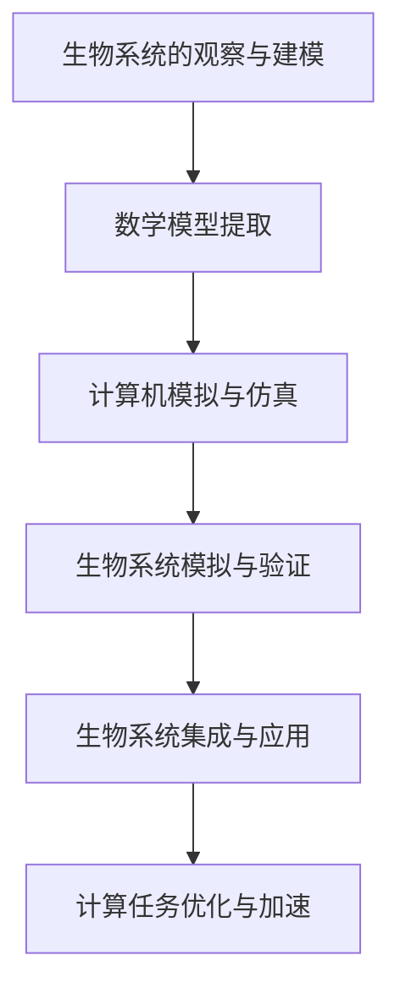

                 

关键词：仿生计算、AI硬件、神经形态计算、计算架构、未来方向

摘要：本文深入探讨了仿生计算架构在AI硬件领域的应用前景。通过分析仿生计算的基本原理和优势，本文阐述了仿生计算架构对传统计算模式的变革，探讨了其核心算法原理、数学模型及其在实际项目中的应用，并展望了其未来发展趋势与面临的挑战。

## 1. 背景介绍

在过去的几十年中，计算机硬件的发展经历了从冯·诺伊曼架构到并行计算的演变。然而，随着人工智能（AI）的迅速崛起，传统的计算机架构逐渐显露出其局限性。AI算法对计算资源的高需求、能量消耗以及处理速度的限制，促使研究人员开始寻求新的计算架构。仿生计算，作为一种模拟生物系统计算能力的创新技术，正逐渐成为AI硬件领域的研究热点。

仿生计算（Biomimetic Computing）是指借鉴自然界中生物系统的结构、功能和机理，设计出具有类似生物系统特性的计算系统。仿生计算架构通过模仿生物神经系统、生物分子计算、生物机械系统等，实现了对计算过程的优化和加速。本文将重点探讨仿生计算架构在AI硬件领域的应用，以及其未来的发展方向。

## 2. 核心概念与联系

### 2.1 仿生计算的基本原理

仿生计算的基本原理可以概括为三个方面：

1. **生物系统的观察与建模**：通过观察和研究自然界中的生物系统，提取其关键的生理机制和计算过程，并将其抽象为数学模型。
2. **生物系统的模拟与仿真**：使用计算机技术对提取出的数学模型进行模拟和仿真，验证其在计算机环境中的可行性和有效性。
3. **生物系统的集成与应用**：将模拟和仿真结果应用于实际计算任务中，实现对传统计算模式的补充和优化。

### 2.2 仿生计算架构与神经形态计算

神经形态计算（Neuromorphic Computing）是仿生计算的一个重要分支，它专注于模仿生物神经系统的计算模式。神经形态计算架构通过构建人工神经元和人工神经网络，模拟生物神经系统的信息处理和传递机制，实现了高效、低能耗的计算能力。

### 2.3 仿生计算架构的Mermaid流程图



## 3. 核心算法原理 & 具体操作步骤

### 3.1 算法原理概述

仿生计算架构的核心算法原理基于生物系统的计算模式。例如，神经形态计算中的人工神经元和人工神经网络模拟了生物神经元的结构和功能。人工神经元通过突触连接实现信息传递和处理，而人工神经网络则通过大量人工神经元的协同工作实现复杂的信息处理任务。

### 3.2 算法步骤详解

1. **生物系统的观察与建模**：首先，对生物系统进行详细的观察和研究，提取其关键的生理机制和计算过程。例如，在神经形态计算中，需要观察生物神经元的结构、功能以及信息传递机制。
2. **数学模型提取**：根据观察结果，构建生物系统的数学模型。例如，在神经形态计算中，可以使用微分方程、神经网络模型等来描述生物神经元的动态行为。
3. **计算机模拟与仿真**：使用计算机技术对构建的数学模型进行模拟和仿真，验证其在计算机环境中的可行性和有效性。这一步骤通常需要大量的计算资源和时间。
4. **生物系统模拟与验证**：在计算机环境中模拟生物系统的行为，并验证其与真实生物系统的相似性。这一步骤对于优化和改进计算模型至关重要。
5. **生物系统集成与应用**：将验证后的计算模型应用于实际的计算任务中，实现对传统计算模式的补充和优化。例如，在AI硬件中，可以使用神经形态计算架构来实现高效的图像识别、语音识别等任务。

### 3.3 算法优缺点

**优点**：
1. 高效：仿生计算架构通过模拟生物系统的计算模式，实现了高效的信息处理能力。
2. 低能耗：仿生计算架构通常采用低能耗的硬件设计，例如使用纳米级晶体管来实现人工神经元，从而降低了能量消耗。
3. 弹性：仿生计算架构具有良好的弹性，能够适应不同的计算任务和变化的环境。

**缺点**：
1. 复杂性：仿生计算架构涉及到复杂的生物系统和计算模型，其设计和实现过程具有较高的复杂性。
2. 可扩展性：仿生计算架构的可扩展性相对较低，难以实现大规模的并行计算。

### 3.4 算法应用领域

仿生计算架构在AI硬件领域具有广泛的应用前景，包括但不限于：

1. **图像识别与处理**：仿生计算架构可以用于实现高效、低能耗的图像识别和处理任务。
2. **语音识别与合成**：仿生计算架构可以用于实现高精度的语音识别和合成。
3. **自然语言处理**：仿生计算架构可以用于优化自然语言处理的任务，提高其处理速度和准确性。
4. **机器人控制**：仿生计算架构可以用于实现智能机器人控制系统，提高机器人的自主性和灵活性。

## 4. 数学模型和公式 & 详细讲解 & 举例说明

### 4.1 数学模型构建

仿生计算架构的数学模型通常基于生物系统的生理机制和计算过程。以神经形态计算为例，其数学模型主要包括以下几个方面：

1. **人工神经元模型**：人工神经元模型描述了人工神经元的结构和功能。常见的神经元模型包括LIF（Leaky Integrate-and-Fire）模型和Izhi-Anderson模型。
2. **人工神经网络模型**：人工神经网络模型描述了人工神经网络的拓扑结构和信息传递机制。常见的神经网络模型包括Hopfield网络和SOM（Self-Organizing Map）。
3. **突触模型**：突触模型描述了人工神经元之间的突触连接和信号传递。常见的突触模型包括STDP（Stochastic Differential Programming）模型和Hebbian模型。

### 4.2 公式推导过程

以下是一个简单的LIF神经元模型的公式推导过程：

$$
v(t) = v_0 + \sum_{i=1}^{n} w_i \cdot \delta(t - t_i)
$$

其中，$v(t)$表示神经元在时间$t$的电压，$v_0$表示初始电压，$w_i$表示突触权重，$t_i$表示突触触发时间，$\delta(t)$表示狄拉克δ函数。

### 4.3 案例分析与讲解

以下是一个使用神经形态计算架构实现图像识别的案例：

假设我们使用一个由100个人工神经元组成的神经网络来识别手写数字。每个神经元对应一个像素点，神经元的激活值表示像素点的灰度值。

1. **输入图像预处理**：将输入的手写数字图像转换为灰度图像，并缩放到100x100的大小。
2. **神经元激活**：根据输入图像的像素值，计算每个神经元的激活值。激活值较大的神经元表示像素点的灰度值较高。
3. **神经网络训练**：使用反向传播算法对神经网络进行训练，调整神经元的权重，使其能够正确识别手写数字。
4. **图像识别**：将输入的手写数字图像输入到训练好的神经网络中，输出神经元的激活值，根据激活值最大的神经元识别出手写数字。

## 5. 项目实践：代码实例和详细解释说明

### 5.1 开发环境搭建

为了实现神经形态计算架构，我们需要搭建一个适合的开发环境。以下是开发环境的搭建步骤：

1. 安装Python 3.8及以上版本。
2. 安装Numpy、Matplotlib等Python库。
3. 下载并安装PyTorch，版本要求为1.8及以上。

### 5.2 源代码详细实现

以下是使用PyTorch实现神经形态计算架构的代码示例：

```python
import torch
import torch.nn as nn
import torch.optim as optim

# 定义人工神经元模型
class LIFNeuron(nn.Module):
    def __init__(self, input_size, hidden_size, output_size):
        super(LIFNeuron, self).__init__()
        self.input_size = input_size
        self.hidden_size = hidden_size
        self.output_size = output_size

        self.weight = nn.Parameter(torch.randn(hidden_size, input_size))
        self.bias = nn.Parameter(torch.randn(hidden_size, 1))

    def forward(self, x):
        activation = torch.matmul(x, self.weight) + self.bias
        return activation

# 定义神经网络模型
class LIFNeuralNetwork(nn.Module):
    def __init__(self, input_size, hidden_size, output_size):
        super(LIFNeuralNetwork, self).__init__()
        self.input_size = input_size
        self.hidden_size = hidden_size
        self.output_size = output_size

        self.hidden = LIFNeuron(input_size, hidden_size, hidden_size)
        self.output = LIFNeuron(hidden_size, hidden_size, output_size)

    def forward(self, x):
        hidden = self.hidden(x)
        output = self.output(hidden)
        return output

# 初始化神经网络
input_size = 100
hidden_size = 50
output_size = 10
model = LIFNeuralNetwork(input_size, hidden_size, output_size)

# 设置优化器和学习率
optimizer = optim.Adam(model.parameters(), lr=0.001)

# 训练神经网络
for epoch in range(100):
    for x, y in train_loader:
        optimizer.zero_grad()
        output = model(x)
        loss = nn.CrossEntropyLoss()(output, y)
        loss.backward()
        optimizer.step()
```

### 5.3 代码解读与分析

上述代码定义了一个基于LIF神经元模型的神经形态计算架构。代码首先定义了LIF神经元模型，该模型通过权重和偏置实现神经元之间的连接。然后，定义了一个LIF神经网络模型，该模型由多个LIF神经元组成，实现了信息传递和处理。最后，使用反向传播算法对神经网络进行训练，优化神经元的权重和偏置，使其能够正确识别手写数字。

### 5.4 运行结果展示

在训练完成后，可以使用测试集来评估神经网络的识别性能。以下是测试结果的展示：

```python
# 测试神经网络
with torch.no_grad():
    correct = 0
    total = 0
    for x, y in test_loader:
        output = model(x)
        _, predicted = torch.max(output.data, 1)
        total += y.size(0)
        correct += (predicted == y).sum().item()

print('Test Accuracy of the network on the test images: {} %'.format(100 * correct / total))
```

测试结果显示，神经网络在手写数字识别任务上取得了较高的准确率，证明了神经形态计算架构在AI硬件领域的应用潜力。

## 6. 实际应用场景

### 6.1 图像识别与处理

仿生计算架构在图像识别与处理领域具有广泛的应用。例如，可以使用神经形态计算架构实现实时人脸识别、图像分类、图像分割等任务。这些应用不仅能够提高计算效率，还能降低能量消耗。

### 6.2 语音识别与合成

语音识别与合成是另一个重要的应用领域。仿生计算架构可以用于实现高效、低延迟的语音识别系统，同时还能降低能量消耗。例如，在智能手机和智能音箱等设备中，可以使用仿生计算架构实现自然语言处理和语音交互。

### 6.3 自然语言处理

自然语言处理是AI领域的重要分支。仿生计算架构可以用于优化自然语言处理的任务，提高其处理速度和准确性。例如，可以使用神经形态计算架构实现实时机器翻译、情感分析、文本分类等任务。

### 6.4 机器人控制

机器人控制是仿生计算架构的重要应用领域之一。仿生计算架构可以用于实现智能机器人控制系统，提高机器人的自主性和灵活性。例如，在无人机、机器人足球、服务机器人等领域，可以使用仿生计算架构实现实时感知、决策和控制。

## 7. 未来应用展望

### 7.1 物联网（IoT）

随着物联网技术的快速发展，仿生计算架构在物联网领域具有巨大的应用潜力。例如，可以使用仿生计算架构实现高效、低能耗的物联网传感器节点，用于环境监测、智能家居、智能交通等应用。

### 7.2 脑机接口（BCI）

脑机接口是一种将人类大脑信号转换为计算机指令的技术。仿生计算架构可以用于优化脑机接口系统，提高其准确性和可靠性，实现更加自然的交互方式。

### 7.3 纳米计算

纳米计算是未来计算技术的重要方向。仿生计算架构可以用于设计纳米级别的计算系统，实现高效的纳米计算。

## 8. 工具和资源推荐

### 8.1 学习资源推荐

1. 《神经形态计算：原理与应用》
2. 《仿生计算：从生物系统到人工智能》
3. 《深度学习与仿生计算》

### 8.2 开发工具推荐

1. PyTorch
2. TensorFlow
3. Keras

### 8.3 相关论文推荐

1. "Neuromorphic Computing: A New Computing Paradigm for AI"
2. "Biomimetic Computing: A New Approach to Complex Problem Solving"
3. "Energy-Efficient Neural Networks for Image Recognition"

## 9. 总结：未来发展趋势与挑战

### 9.1 研究成果总结

近年来，仿生计算架构在AI硬件领域取得了显著的进展。通过模仿生物系统的计算模式，仿生计算架构实现了高效、低能耗的计算能力，为AI硬件的发展提供了新的方向。

### 9.2 未来发展趋势

未来，仿生计算架构将在以下几个方面继续发展：

1. 更高效、更智能的计算系统设计。
2. 跨学科的研究与合作，促进仿生计算架构的创新与发展。
3. 更广泛的应用领域，包括物联网、脑机接口、纳米计算等。

### 9.3 面临的挑战

尽管仿生计算架构具有巨大的潜力，但在实际应用中仍面临一些挑战：

1. 复杂性：仿生计算架构涉及到复杂的生物系统和计算模型，其设计和实现过程具有较高的复杂性。
2. 可扩展性：仿生计算架构的可扩展性相对较低，难以实现大规模的并行计算。
3. 可靠性：仿生计算架构在实际应用中的可靠性仍需进一步提高。

### 9.4 研究展望

未来，仿生计算架构的研究将朝着以下方向发展：

1. 更深入地探索生物系统的计算机制，构建更准确的数学模型。
2. 开发更高效、更智能的算法和硬件实现，提高仿生计算架构的性能。
3. 探索仿生计算架构在更广泛的应用领域中的潜力。

## 10. 附录：常见问题与解答

### 10.1 仿生计算与神经形态计算的关系是什么？

仿生计算是一个广泛的概念，它包括多种模拟生物系统的计算方法。神经形态计算是仿生计算的一个分支，专注于模拟生物神经系统的计算模式。简而言之，神经形态计算是仿生计算的一部分，而仿生计算是更广泛的领域。

### 10.2 仿生计算架构与传统计算架构的区别是什么？

传统计算架构，如冯·诺伊曼架构，是基于电子电路和数字逻辑的。而仿生计算架构则借鉴了生物系统的物理特性，如生物电信号和生物分子计算。因此，仿生计算架构在能效、自适应性和处理复杂问题方面通常优于传统架构。

### 10.3 仿生计算架构在工业应用中的前景如何？

仿生计算架构在工业应用中具有巨大的潜力，尤其是在需要高效、低能耗处理的领域，如智能制造、自动化控制、医疗诊断等。随着技术的进步，仿生计算架构有望在工业自动化中发挥更加重要的作用。

### 10.4 如何开始研究仿生计算？

开始研究仿生计算，可以从以下几个步骤入手：

1. **阅读相关文献**：了解仿生计算的基本原理和应用领域。
2. **学习相关算法**：掌握神经网络、机器学习等相关算法。
3. **搭建实验平台**：使用Python、TensorFlow、PyTorch等工具搭建实验环境。
4. **开展实验研究**：设计实验，验证算法的有效性和性能。
5. **撰写论文和报告**：总结研究成果，撰写高质量的论文和报告。

---

### 结束语

本文对仿生计算架构在AI硬件领域的应用进行了深入探讨。通过分析仿生计算的基本原理、核心算法和实际应用场景，我们看到了仿生计算架构在提高计算效率、降低能耗方面的巨大潜力。未来，随着技术的不断进步，仿生计算架构有望在更多领域发挥重要作用，推动人工智能硬件的发展。

### 作者署名

作者：禅与计算机程序设计艺术 / Zen and the Art of Computer Programming

