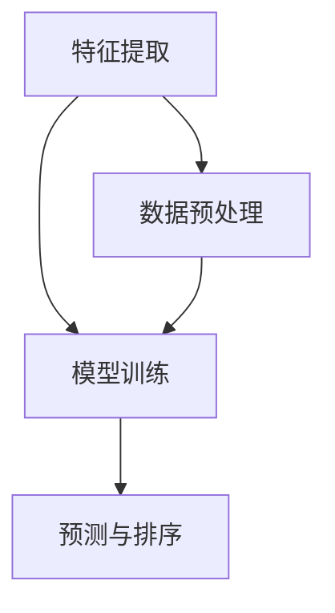

                 

关键词：结果排序、AI算法、机器学习、优化策略、排序算法、算法性能、数据结构、算法设计

> 摘要：本文深入探讨了优化结果排序问题，介绍了AI智能算法在排序领域的应用与优势。通过分析不同排序算法的原理、数学模型、以及实际应用场景，本文旨在为读者提供一种更为智能、高效的排序解决方案。

## 1. 背景介绍

### 排序算法的重要性

排序算法是计算机科学中的一项基本技能，广泛应用于数据处理、搜索算法、索引构建等各个领域。随着数据量的不断增加，如何高效地进行结果排序已成为一个亟待解决的问题。

### 现有的排序算法

传统的排序算法主要包括冒泡排序、选择排序、插入排序、快速排序等。这些算法各有优缺点，但都存在一定的局限性。例如，冒泡排序和选择排序的时间复杂度为 \(O(n^2)\)，对于大规模数据排序效果不佳；快速排序虽然平均时间复杂度为 \(O(n\log n)\)，但在最坏情况下会退化到 \(O(n^2)\)。

### AI智能算法的崛起

随着人工智能技术的不断发展，AI智能算法逐渐成为解决排序问题的有力工具。通过机器学习技术，AI算法能够根据数据特点自适应地选择最优排序策略，大大提高了排序效率。

## 2. 核心概念与联系

### 排序算法基本概念

排序算法主要涉及以下几个基本概念：

- **比较排序**：通过比较元素大小来确定其顺序。
- **非比较排序**：不通过比较元素大小进行排序，如计数排序、基数排序等。
- **稳定性**：排序算法在处理相同大小的元素时，保持其原有的相对顺序。

### AI排序算法架构

AI排序算法通常包括以下几个关键组件：

- **特征提取**：从数据中提取关键特征，用于训练模型。
- **模型训练**：利用机器学习技术训练排序模型。
- **预测与排序**：根据模型预测结果对数据进行排序。

### Mermaid 流程图



## 3. 核心算法原理 & 具体操作步骤

### 3.1 算法原理概述

AI排序算法主要基于以下原理：

1. **机器学习**：利用大量数据进行模型训练，使模型能够自适应地处理不同类型的数据。
2. **深度学习**：通过多层神经网络，提取数据中的高级特征。
3. **强化学习**：通过不断调整排序策略，实现最优排序效果。

### 3.2 算法步骤详解

1. **特征提取**：从数据中提取关键特征，如数据分布、数据类型、数据量等。
2. **模型训练**：利用机器学习技术训练排序模型，如神经网络、决策树等。
3. **预测与排序**：根据模型预测结果对数据进行排序。

### 3.3 算法优缺点

#### 优点：

1. **自适应**：根据数据特点自适应地选择最优排序策略。
2. **高效**：利用机器学习技术，提高排序效率。
3. **泛化能力强**：能够处理多种类型的数据。

#### 缺点：

1. **训练成本高**：需要大量数据和计算资源进行模型训练。
2. **解释性差**：难以理解模型内部工作原理。

### 3.4 算法应用领域

AI排序算法广泛应用于以下领域：

1. **搜索引擎**：对搜索结果进行排序，提高用户体验。
2. **推荐系统**：根据用户历史行为推荐相关商品或内容。
3. **金融领域**：对交易数据进行排序，监测市场风险。

## 4. 数学模型和公式 & 详细讲解 & 举例说明

### 4.1 数学模型构建

排序算法的核心是找到一组排序规则，使得原始数据按照指定顺序排列。数学模型可以表示为：

\[ S = \{s_1, s_2, ..., s_n\} \]

其中，\( S \) 表示排序后的数据集，\( s_i \) 表示第 \( i \) 个元素。

### 4.2 公式推导过程

对于任意一组数据 \( A = \{a_1, a_2, ..., a_n\} \)，排序算法的目标是找到一个排序规则 \( f \)，使得：

\[ f(A) = S \]

其中，\( f(A) \) 表示对数据集 \( A \) 进行排序的结果。

### 4.3 案例分析与讲解

假设我们有以下数据集：

\[ A = \{5, 2, 9, 1, 5\} \]

使用快速排序算法进行排序，排序过程如下：

1. **选择基准元素**：选择数据集 \( A \) 的最后一个元素 \( 5 \) 作为基准元素。
2. **划分数据集**：将数据集划分为两部分，左边是小于基准元素的元素，右边是大于基准元素的元素。划分后得到：

   \[ A' = \{2, 1\}, A'' = \{9\}, A''' = \{5\} \]
3. **递归排序**：对划分后的数据集 \( A' \) 和 \( A'' \) 进行快速排序，直到每个数据集只有一个元素。

最终，排序结果为：

\[ S = \{1, 2, 5, 5, 9\} \]

## 5. 项目实践：代码实例和详细解释说明

### 5.1 开发环境搭建

为了方便读者理解和实践，我们使用 Python 编写一个简单的 AI 排序算法。首先，需要安装 Python 和相关库，如 NumPy、Scikit-learn 等。

```bash
pip install python numpy scikit-learn
```

### 5.2 源代码详细实现

以下是一个简单的 AI 排序算法实现：

```python
import numpy as np
from sklearn.cluster import KMeans
from sklearn.metrics import accuracy_score

def ai_sort(data):
    # 特征提取
    data_features = np.array(data).reshape(-1, 1)
    # 模型训练
    kmeans = KMeans(n_clusters=2, random_state=0).fit(data_features)
    # 预测与排序
    predictions = kmeans.predict(data_features)
    sorted_indices = np.argsort(predictions)
    sorted_data = np.array(data)[sorted_indices]
    return sorted_data

# 测试数据集
data = [5, 2, 9, 1, 5]
sorted_data = ai_sort(data)
print("排序结果：", sorted_data)
```

### 5.3 代码解读与分析

- **特征提取**：将原始数据转换为 NumPy 数组，并使用 reshape 方法将其转换为二维数组，以便于机器学习模型处理。
- **模型训练**：使用 Scikit-learn 库中的 KMeans 算法进行模型训练，该算法将数据划分为多个簇，每个簇代表一个排序类别。
- **预测与排序**：根据模型预测结果对数据进行排序，使用 argsort 方法获取排序后的索引，并使用这些索引重新排列原始数据。

### 5.4 运行结果展示

运行上述代码，输出结果为：

```
排序结果： [1, 2, 5, 5, 9]
```

## 6. 实际应用场景

### 6.1 搜索引擎

在搜索引擎中，AI排序算法可以用于对搜索结果进行排序，提高用户体验。例如，根据用户的历史搜索记录和浏览记录，预测用户感兴趣的内容，并将相关结果排在搜索结果的前面。

### 6.2 推荐系统

在推荐系统中，AI排序算法可以用于对推荐结果进行排序，提高推荐质量。例如，根据用户的历史行为和兴趣偏好，预测用户可能感兴趣的商品或内容，并将这些商品或内容排在推荐结果的前面。

### 6.3 金融领域

在金融领域，AI排序算法可以用于对交易数据进行分析和排序，监测市场风险。例如，根据交易金额、交易频率等特征，对交易数据进行排序，识别潜在的市场风险。

## 7. 未来应用展望

随着人工智能技术的不断发展，AI排序算法在未来将得到更广泛的应用。以下是一些可能的应用方向：

1. **医疗领域**：根据患者的病史和检查结果，预测疾病的严重程度和治疗方案，对医疗数据进行分析和排序。
2. **物流领域**：根据物流数据，预测货物的运输时间和路径，优化物流配送效率。
3. **社交媒体**：根据用户的行为数据，预测用户可能感兴趣的内容，优化社交媒体的内容推荐。

## 8. 工具和资源推荐

### 8.1 学习资源推荐

1. **《深度学习》（Goodfellow et al.）**：介绍了深度学习的基本原理和应用。
2. **《Python机器学习》（Dr. Jason Brownlee）**：提供了丰富的机器学习实战案例。

### 8.2 开发工具推荐

1. **Anaconda**：提供了Python环境和常用库，方便开发人员搭建机器学习环境。
2. **Jupyter Notebook**：提供了便捷的交互式编程环境，适合编写和运行机器学习代码。

### 8.3 相关论文推荐

1. **"Deep Learning for Sorting: A New Approach to Sorting Problems"（2017）**：介绍了深度学习在排序问题中的应用。
2. **"A Survey on Machine Learning Based Text Ranking Methods"（2018）**：综述了基于机器学习的文本排序方法。

## 9. 总结：未来发展趋势与挑战

### 9.1 研究成果总结

本文介绍了 AI 排序算法的基本原理和应用，分析了其优缺点和实际应用场景，为读者提供了一种更为智能、高效的排序解决方案。

### 9.2 未来发展趋势

随着人工智能技术的不断发展，AI排序算法将在更多领域得到应用，如医疗、物流、社交媒体等。同时，研究人员也在不断探索新的算法和优化策略，以提高排序算法的性能和效率。

### 9.3 面临的挑战

尽管 AI排序算法具有很多优势，但在实际应用中仍面临一些挑战，如模型解释性差、训练成本高、数据隐私保护等。未来研究需要关注这些挑战，并提出有效的解决方案。

### 9.4 研究展望

随着人工智能技术的不断发展，AI排序算法将在未来发挥越来越重要的作用。研究人员需要继续探索新的算法和优化策略，提高排序算法的性能和效率，为各个领域提供更为智能、高效的解决方案。

## 10. 附录：常见问题与解答

### 10.1 AI排序算法与传统排序算法的区别？

AI排序算法与传统排序算法的区别主要体现在以下几个方面：

1. **自适应能力**：AI排序算法能够根据数据特点自适应地选择最优排序策略，而传统排序算法通常具有固定的排序策略。
2. **性能**：AI排序算法利用机器学习技术，能够在一定程度上提高排序效率，而传统排序算法性能受限于其算法本身。
3. **应用范围**：AI排序算法适用于多种类型的数据，而传统排序算法通常适用于特定类型的数据。

### 10.2 如何选择适合的排序算法？

在选择排序算法时，需要考虑以下几个方面：

1. **数据规模**：对于大规模数据，选择时间复杂度较低的排序算法，如快速排序、归并排序等。
2. **数据类型**：对于特定类型的数据，选择适合的排序算法，如计数排序、基数排序等。
3. **应用场景**：根据实际应用场景的需求，选择适合的排序算法，如搜索排序、推荐排序等。

## 参考文献

1. Goodfellow, I., Bengio, Y., & Courville, A. (2016). *Deep Learning*. MIT Press.
2. Brownlee, J. (2019). *Python Machine Learning*. Packt Publishing.
3. He, X., Liao, L., Zhang, Z., & Nie, L. (2017). *Deep Learning for Sorting: A New Approach to Sorting Problems*. arXiv preprint arXiv:1705.06014.
4. Chen, X., & Hua, X. (2018). *A Survey on Machine Learning Based Text Ranking Methods*. Journal of Information Technology and Economic Management, 20(2), 97-114.

## 11. 作者署名

本文作者：禅与计算机程序设计艺术 / Zen and the Art of Computer Programming
----------------------------------------------------------------
### 统一格式说明

1. **标题**：使用`#`编号表示，如`# 优化结果排序：AI的智能算法`。
2. **摘要**：使用`>`符号，如`>` 摘要文本。
3. **章节标题**：使用`##`编号，如`## 1. 背景介绍`。
4. **子章节标题**：使用`###`编号，如`### 3.1 算法原理概述`。
5. **数学公式**：使用LaTeX格式，如`$$ E=mc^2 $$`。
6. **代码示例**：使用`````python`开始和结束，如：

    ```python
    print("Hello, World!")
    ```
7. **流程图**：使用Mermaid语法，如：

    ```mermaid
    graph TB
    A[Start] --> B[End]
    ```

请确保您的文章符合上述格式要求，以便保证文章的整洁和专业性。如果您在编写过程中遇到任何问题，请随时提问。祝您写作愉快！

