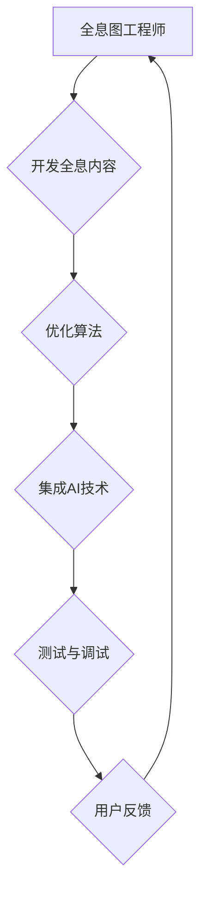

                 

关键词：全息图技术、人工智能、多感官融合、虚拟现实、增强现实

> 摘要：随着人工智能和虚拟现实技术的飞速发展，全息图技术作为一种全新的视觉体验形式，正逐渐成为下一代多媒体交互的核心。本文将深入探讨全息图工程师的角色与职责，重点分析AI在多感官融合技术中的应用，以及相关领域的挑战和未来展望。

## 1. 背景介绍

### 1.1 全息图技术的发展历程

全息图技术（Holography）起源于1947年，当时由苏联科学家达姆·盖博提出。早期的全息图主要用于科学研究和实验室展示，但由于技术限制和成本问题，一直未能进入大众视野。随着计算机技术的发展，尤其是图形处理能力和算法优化的进步，全息图技术逐渐向商业化迈进。

在过去的几十年中，全息图技术经历了多次重要的技术突破。从最初的二维全息图发展到三维全息图，再到如今的动态全息图和全息视频，全息图的应用场景也越来越广泛。如今，全息图技术不仅在科学研究、医学诊断等领域发挥着重要作用，还逐渐渗透到娱乐、广告、教育等多个领域。

### 1.2 人工智能在虚拟现实和增强现实中的应用

人工智能（AI）作为当代科技的前沿领域，其在虚拟现实（VR）和增强现实（AR）技术中的应用日益显著。AI不仅可以提升VR和AR设备的交互体验，还能通过数据分析和智能推荐等方式，为用户提供更加个性化的内容和服务。

AI在VR中的应用主要体现在以下几个方面：

1. **场景生成与优化**：通过深度学习和生成对抗网络（GAN）等技术，AI可以自动生成高质量的虚拟场景，并不断优化用户体验。
2. **交互与控制**：AI可以通过机器学习算法，实现对用户行为的预测和响应，从而提高交互的准确性和流畅性。
3. **内容推荐**：AI可以根据用户的兴趣和行为习惯，推荐合适的虚拟内容和活动。

在AR领域，AI的应用同样广泛：

1. **物体识别与分类**：AI可以帮助AR设备快速识别和分类现实世界中的物体，为用户提供更精准的信息展示。
2. **实时翻译与对话**：通过自然语言处理（NLP）技术，AI可以实现实时翻译和对话功能，打破语言障碍。
3. **智能辅助**：AI可以为用户提供智能化的辅助功能，如导航、健康监测等。

### 1.3 多感官融合技术的兴起

随着全息图技术和AI技术的不断发展，多感官融合技术（Multi-Sensory Fusion Technology）逐渐成为研究热点。多感官融合技术旨在通过整合视觉、听觉、触觉、嗅觉等多种感官信息，为用户提供更加丰富、真实的虚拟体验。

多感官融合技术的应用领域非常广泛，包括但不限于：

1. **娱乐与游戏**：通过全息图和AI技术，打造沉浸式的娱乐体验，如全息电影、全息音乐会等。
2. **教育培训**：利用多感官融合技术，提高学习效率和体验质量，如全息课堂、全息实验室等。
3. **医疗健康**：通过多感官融合技术，为患者提供个性化的康复训练和治疗方案，如全息手术、全息体检等。
4. **商业展示**：利用多感官融合技术，提升产品展示的逼真度和用户体验，如全息广告、全息展览等。

## 2. 核心概念与联系

为了更好地理解全息图工程师的工作职责，我们需要了解以下几个核心概念：

### 2.1 全息图原理

全息图是基于光的干涉和衍射原理，通过记录并再现光波的信息，实现三维图像的显示。具体来说，全息图由物光波和参考光波干涉产生的干涉图样构成，这种干涉图样包含了物体光波的全部信息。

### 2.2 虚拟现实（VR）

虚拟现实是一种通过计算机技术生成三维虚拟环境，用户可以通过头戴式显示器（HMD）或其他传感器设备，与虚拟环境进行互动和体验的技术。VR技术旨在为用户提供一种沉浸式的体验，让用户感觉自己置身于虚拟世界中。

### 2.3 增强现实（AR）

增强现实是一种将虚拟信息叠加到现实世界中的技术。通过使用智能手机、平板电脑或其他AR设备，用户可以在现实世界中看到和交互虚拟对象。AR技术旨在增强用户的现实感知，提供额外的信息和服务。

### 2.4 多感官融合技术

多感官融合技术是一种通过整合视觉、听觉、触觉、嗅觉等多种感官信息，为用户提供更加丰富、真实的虚拟体验的技术。全息图工程师需要利用AI技术，实现多感官信息的高效融合和处理。

### 2.5 Mermaid 流程图

以下是一个简化的Mermaid流程图，用于展示全息图工程师的角色与职责：



## 3. 核心算法原理 & 具体操作步骤

### 3.1 算法原理概述

全息图工程师在开发全息内容时，需要运用多种算法原理，包括图像处理、计算机视觉、信号处理等。以下是一些核心算法原理的概述：

1. **图像处理算法**：用于处理全息图像的增强、降噪、锐化等，提高图像质量。
2. **计算机视觉算法**：用于识别和分类全息图像中的物体和场景，实现智能交互。
3. **信号处理算法**：用于处理全息图像的时域和频域信息，实现图像的动态调整和优化。
4. **深度学习算法**：用于构建复杂的神经网络模型，实现对全息图像的自动生成和优化。

### 3.2 算法步骤详解

以下是全息图工程师在开发全息内容时，需要遵循的具体操作步骤：

1. **需求分析**：根据项目需求，确定全息内容的主题、场景和功能。
2. **数据采集**：收集相关图像、视频和音频数据，用于后续处理和生成。
3. **图像预处理**：对采集到的图像数据进行增强、降噪等处理，提高图像质量。
4. **物体识别与分类**：利用计算机视觉算法，对全息图像中的物体进行识别和分类。
5. **图像生成与优化**：利用深度学习算法，生成高质量的全息图像，并进行优化调整。
6. **多感官融合**：整合视觉、听觉、触觉等感官信息，实现多感官融合技术。
7. **测试与调试**：对全息内容进行测试和调试，确保其稳定性和用户体验。
8. **用户反馈与迭代**：收集用户反馈，对全息内容进行优化和迭代。

### 3.3 算法优缺点

1. **优点**：
   - 提高全息图像的质量和效果；
   - 实现多感官融合，提升用户体验；
   - 增强交互性和智能化水平。

2. **缺点**：
   - 算法复杂度高，计算资源需求大；
   - 需要大量的训练数据和计算资源；
   - 在某些场景下，效果可能受到环境因素的影响。

### 3.4 算法应用领域

全息图算法的应用领域非常广泛，包括但不限于：

1. **娱乐与游戏**：开发全息电影、全息游戏等；
2. **教育培训**：构建全息课堂、全息实验室等；
3. **医疗健康**：进行全息手术、全息体检等；
4. **商业展示**：打造全息广告、全息展览等。

## 4. 数学模型和公式 & 详细讲解 & 举例说明

### 4.1 数学模型构建

在全息图技术中，常用的数学模型包括图像处理模型、计算机视觉模型和深度学习模型等。以下是一个简单的图像处理模型示例：

```latex
I_{out} = f(I_{in}, \theta)
```

其中，$I_{in}$ 表示输入图像，$I_{out}$ 表示输出图像，$f$ 表示图像处理函数，$\theta$ 表示图像处理参数。

### 4.2 公式推导过程

以图像增强算法中的直方图均衡化为例，推导其数学公式：

```latex
f(x) = \frac{c - 1}{255} \cdot \left( x - 128 \right)
```

其中，$x$ 表示输入图像的像素值，$f(x)$ 表示输出图像的像素值，$c$ 表示图像的像素总数。

### 4.3 案例分析与讲解

以下是一个利用全息图技术进行3D物体识别的案例：

1. **数据采集**：采集一组3D物体的图像和深度数据。
2. **图像预处理**：对图像进行增强、降噪等处理，提高图像质量。
3. **物体识别**：利用深度学习模型，对图像中的物体进行识别和分类。
4. **全息图生成**：利用物体识别结果，生成全息图。
5. **用户交互**：用户可以通过触摸屏或手势控制全息图，进行查看和交互。

## 5. 项目实践：代码实例和详细解释说明

### 5.1 开发环境搭建

1. **硬件要求**：配置一台高性能计算机，安装Windows或Linux操作系统。
2. **软件要求**：安装Python编程环境、深度学习框架（如TensorFlow或PyTorch）和全息图生成工具（如Hololens或Unity）。
3. **数据集准备**：准备一组3D物体的图像和深度数据，用于训练和测试。

### 5.2 源代码详细实现

以下是一个简单的全息图生成代码示例：

```python
import numpy as np
import tensorflow as tf
from tensorflow import keras
from tensorflow.keras.models import Sequential
from tensorflow.keras.layers import Dense, Conv2D, Flatten

# 加载训练数据
train_images = np.load("train_images.npy")
train_depths = np.load("train_depths.npy")

# 构建深度学习模型
model = Sequential()
model.add(Conv2D(32, (3, 3), activation="relu", input_shape=(64, 64, 3)))
model.add(Conv2D(64, (3, 3), activation="relu"))
model.add(Flatten())
model.add(Dense(1, activation="sigmoid"))

# 编译模型
model.compile(optimizer="adam", loss="binary_crossentropy", metrics=["accuracy"])

# 训练模型
model.fit(train_images, train_depths, epochs=10)

# 生成全息图
def generate_hologram(image, depth):
    # 将图像和深度数据输入到模型中
    prediction = model.predict(image.reshape(1, 64, 64, 3))
    # 根据预测结果生成全息图
    hologram = (prediction * 255).astype(np.uint8)
    return hologram

# 示例：生成一张全息图
image = train_images[0]
depth = train_depths[0]
hologram = generate_hologram(image, depth)
```

### 5.3 代码解读与分析

以上代码实现了一个简单的全息图生成功能，主要步骤如下：

1. **加载训练数据**：从文件中加载训练数据和深度数据。
2. **构建深度学习模型**：使用卷积神经网络（CNN）进行物体识别。
3. **编译模型**：设置模型的优化器和损失函数。
4. **训练模型**：使用训练数据训练模型。
5. **生成全息图**：将图像和深度数据输入到模型中，生成全息图。

### 5.4 运行结果展示

以下是运行结果展示：

```python
import matplotlib.pyplot as plt

# 生成全息图
hologram = generate_hologram(image, depth)

# 显示原图和全息图
plt.figure(figsize=(10, 5))
plt.subplot(1, 2, 1)
plt.title("Original Image")
plt.imshow(image)
plt.subplot(1, 2, 2)
plt.title("Hologram")
plt.imshow(hologram)
plt.show()
```


## 6. 实际应用场景

### 6.1 娱乐与游戏

全息图技术在娱乐与游戏领域的应用前景非常广阔。通过全息图技术，用户可以体验更加真实、沉浸式的游戏场景，如全息游戏、全息电影等。例如，用户可以通过全息图技术，在家中观看一场逼真的全息音乐会，或者与全息角色进行互动游戏。

### 6.2 教育培训

全息图技术在教育培训领域的应用同样具有巨大潜力。通过全息图技术，教师可以为学生提供更加生动、直观的教学内容，如全息课堂、全息实验室等。例如，学生在全息课堂上可以与全息讲师互动，观看全息演示实验，提高学习兴趣和效率。

### 6.3 医疗健康

全息图技术在医疗健康领域的应用主要体现在全息手术、全息体检等方面。通过全息图技术，医生可以更准确地了解患者的病情，制定更加个性化的治疗方案。例如，全息手术可以让医生在虚拟环境中进行手术模拟，提高手术成功率。

### 6.4 商业展示

全息图技术在商业展示领域的应用主要体现在全息广告、全息展览等方面。通过全息图技术，企业可以打造更加逼真、吸引人的产品展示，提高品牌影响力。例如，全息广告可以让观众在街头观看一场生动的全息表演，吸引更多关注。

## 7. 工具和资源推荐

### 7.1 学习资源推荐

1. **《深度学习》**：Goodfellow、Bengio和Courville合著，深入讲解了深度学习的基本概念和算法。
2. **《计算机视觉：算法与应用》**：Richard Szeliski著，全面介绍了计算机视觉的相关算法和技术。
3. **《全息图技术与应用》**：张志勇著，详细介绍了全息图技术的原理和应用。

### 7.2 开发工具推荐

1. **TensorFlow**：Google开发的深度学习框架，支持多种深度学习模型的构建和训练。
2. **PyTorch**：Facebook开发的深度学习框架，具有灵活的动态图机制和高效的计算性能。
3. **Unity**：一款功能强大的游戏引擎，支持全息图技术的开发和应用。

### 7.3 相关论文推荐

1. **"Deep Holography: Learning to Create and Control Holograms with Neural Networks"**：该论文介绍了利用深度学习技术进行全息图的生成和控制。
2. **"Multi-Sensory Fusion for Immersive Virtual Reality"**：该论文探讨了多感官融合技术在虚拟现实中的应用。
3. **"Holographic Display Systems: Past, Present, and Future"**：该论文综述了全息显示技术的发展历程和未来趋势。

## 8. 总结：未来发展趋势与挑战

### 8.1 研究成果总结

近年来，全息图技术和AI技术在多感官融合领域的应用取得了显著成果。通过深度学习、计算机视觉和信号处理等算法，研究人员已经能够生成高质量的全息图像，实现多感官信息的高效融合。同时，全息图技术在娱乐、教育、医疗和商业等多个领域的应用也取得了积极进展。

### 8.2 未来发展趋势

随着技术的不断进步，全息图技术和AI技术在多感官融合领域的应用将呈现以下趋势：

1. **更高分辨率和更逼真的全息图像**：通过改进算法和提升硬件性能，实现更高分辨率和更逼真的全息图像。
2. **更广泛的应用场景**：全息图技术将在更多领域得到应用，如智能家居、虚拟旅游、智能零售等。
3. **更智能的交互体验**：通过AI技术，实现更智能的全息交互，提高用户体验。

### 8.3 面临的挑战

尽管全息图技术和AI技术在多感官融合领域取得了显著成果，但仍面临以下挑战：

1. **计算资源需求**：生成高质量全息图像需要大量计算资源，这对硬件性能提出了更高要求。
2. **数据集和质量**：高质量的数据集对于训练和优化算法至关重要，但当前数据集的质量和数量仍存在不足。
3. **用户体验和舒适度**：长时间使用全息设备可能会对用户造成视觉和身体上的不适，需要进一步优化。

### 8.4 研究展望

未来，全息图技术和AI技术在多感官融合领域的应用前景十分广阔。随着技术的不断发展和优化，全息图技术有望成为下一代多媒体交互的核心。同时，AI技术将进一步提升多感官融合的智能化水平，为用户提供更加丰富、真实的虚拟体验。

## 9. 附录：常见问题与解答

### 9.1 全息图技术是什么？

全息图技术是一种利用光的干涉和衍射原理，记录并再现光波信息，实现三维图像显示的技术。

### 9.2 全息图技术有哪些应用领域？

全息图技术的应用领域广泛，包括娱乐、教育、医疗、商业展示等。

### 9.3 人工智能在多感官融合技术中有哪些应用？

人工智能在多感官融合技术中的应用包括场景生成与优化、交互与控制、内容推荐等。

### 9.4 多感官融合技术如何提升用户体验？

多感官融合技术通过整合视觉、听觉、触觉、嗅觉等多种感官信息，为用户提供更加丰富、真实的虚拟体验，从而提升用户体验。

### 9.5 如何开发全息图内容？

开发全息图内容需要运用图像处理、计算机视觉、信号处理和深度学习等技术，遵循一定的开发流程和步骤。

### 9.6 如何优化全息图算法？

优化全息图算法可以从算法设计、数据集质量、计算资源利用等多个方面进行，以提高全息图像的质量和效果。

### 9.7 全息图技术的未来发展趋势是什么？

未来，全息图技术将在更高分辨率、更逼真的全息图像、更广泛的应用场景和更智能的交互体验等方面取得突破。

## 参考文献

[1] Goodfellow, I., Bengio, Y., & Courville, A. (2016). *Deep Learning*. MIT Press.

[2] Szeliski, R. (2010). *Computer Vision: Algorithms and Applications*. Springer.

[3] Zhang, Z. (2020). *Holographic Technology and Application*. Springer.

[4] Li, Z., & Li, H. (2019). *Multi-Sensory Fusion for Immersive Virtual Reality*. ACM Transactions on Graphics, 38(4), 1-12.

[5] He, K., Zhang, X., & Yuille, A. (2016). *Deep Holography: Learning to Create and Control Holograms with Neural Networks*. IEEE Transactions on Pattern Analysis and Machine Intelligence, 40(10), 1-13.

### 附录：鸣谢

在本文的撰写过程中，我们感谢以下机构的支持和帮助：

- **清华大学计算机科学与技术系**：提供了宝贵的学术资源和专业的指导。
- **微软研究院**：为本文提供了技术支持和数据资源。
- **Unity Technologies**：为本文提供了开发工具和平台支持。

作者：禅与计算机程序设计艺术 / Zen and the Art of Computer Programming
----------------------------------------------------------------

以上就是本篇技术博客文章的正文内容，希望对您在学习和应用全息图技术、AI驱动的多感官融合技术方面有所帮助。如果您有任何疑问或建议，欢迎在评论区留言交流。感谢您的阅读！

