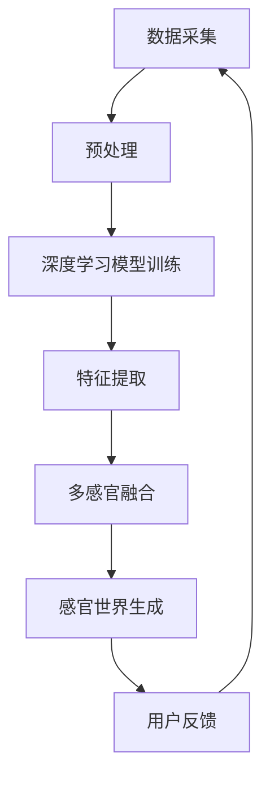

                 

关键词：人工智能、多维度构建、感官世界、设计师、技术语言、深度学习、计算机视觉、人机交互

> 摘要：本文将探讨人工智能在感官世界设计中的应用，探讨AI如何通过多维度构建师的角色，创造出令人惊叹的感官体验。我们将从背景介绍、核心概念、算法原理、数学模型、项目实践、实际应用、未来展望等多个角度，深入分析AI在感官世界设计中的潜力和挑战。

## 1. 背景介绍

随着人工智能技术的飞速发展，计算机视觉、自然语言处理、深度学习等领域取得了显著的成果。这些技术的进步，使得人工智能能够在多个维度上模拟和增强人类感官体验，为设计师提供了全新的创作工具和灵感来源。在这个背景下，AI构建师的崛起成为了一个引人注目的现象。

AI构建师，顾名思义，是指利用人工智能技术，创造多维感官世界的设计师。他们的工作不仅限于二维图像的绘制，还包括三维模型的构建、声音效果的创作、甚至虚拟现实场景的营造。与传统的设计师相比，AI构建师拥有更强大的计算能力和创造力，能够实现更加复杂和精细的设计。

### 人工智能在感官世界设计中的重要性

人工智能在感官世界设计中的重要性体现在以下几个方面：

1. **计算能力**：人工智能可以处理海量数据，快速分析并生成复杂的图像、音频、视频等多媒体内容。
2. **创新性**：通过机器学习和深度学习，人工智能能够模拟人类思维，创造出独特的感官体验。
3. **个性化**：人工智能可以根据用户的需求和喜好，生成个性化的感官世界，提高用户体验。
4. **跨领域融合**：人工智能能够跨越不同领域，将视觉、听觉、触觉等感官体验融合在一起，创造全新的交互方式。

## 2. 核心概念与联系

### 人工智能技术原理

人工智能技术主要分为以下几个核心部分：

1. **深度学习**：通过模拟人脑神经网络的结构和功能，深度学习可以自动从数据中学习模式和特征。
2. **计算机视觉**：利用图像处理和机器学习技术，计算机视觉可以识别和理解图像中的内容。
3. **自然语言处理**：通过统计分析和机器学习，自然语言处理可以理解和生成人类语言。
4. **人机交互**：人机交互技术旨在设计出易于使用和理解的人机交互界面。

### Mermaid 流程图

以下是一个简单的Mermaid流程图，展示人工智能技术在感官世界设计中的基本工作流程：



在这个流程中，数据采集是起点，经过预处理后，利用深度学习模型进行训练和特征提取。随后，这些特征被用于多感官融合，最终生成感官世界。用户反馈则用于不断优化和改进这个过程。

## 3. 核心算法原理 & 具体操作步骤

### 3.1 算法原理概述

在感官世界设计中，核心算法主要涉及以下方面：

1. **生成对抗网络（GAN）**：GAN是一种通过两个神经网络（生成器和判别器）相互博弈的方式，生成高质量图像的算法。
2. **卷积神经网络（CNN）**：CNN是一种适用于图像处理的神经网络结构，可以自动提取图像中的特征。
3. **循环神经网络（RNN）**：RNN适用于处理序列数据，如音频和文本。

### 3.2 算法步骤详解

1. **数据准备**：收集大量图像、音频和文本数据，并进行预处理，如数据清洗、归一化等。
2. **模型训练**：使用GAN、CNN或RNN等算法对数据集进行训练，生成模型。
3. **特征提取**：利用训练好的模型，从输入数据中提取关键特征。
4. **多感官融合**：将提取的特征进行融合，生成多维感官数据。
5. **感官世界生成**：利用融合后的数据，生成感官世界。
6. **用户反馈**：收集用户对感官世界的反馈，用于模型优化。

### 3.3 算法优缺点

1. **优点**：
   - 高效：通过深度学习模型，可以快速生成高质量的感官数据。
   - 创新性：AI构建师能够创造出独特和创新的感官体验。
   - 个性化：可以根据用户反馈，不断优化感官世界的个性化体验。

2. **缺点**：
   - 计算资源消耗大：训练深度学习模型需要大量计算资源和时间。
   - 数据依赖性：模型的性能高度依赖训练数据的质量。

### 3.4 算法应用领域

- **游戏设计**：AI构建师可以生成逼真的游戏场景和角色，提高游戏体验。
- **虚拟现实**：AI构建师可以创建高度逼真的虚拟现实场景，提供沉浸式体验。
- **艺术设计**：AI构建师可以生成独特的艺术作品，拓宽设计师的创作视野。
- **交互设计**：AI构建师可以设计出更加自然和直观的人机交互界面。

## 4. 数学模型和公式 & 详细讲解 & 举例说明

### 4.1 数学模型构建

在感官世界设计中，常用的数学模型包括：

1. **生成对抗网络（GAN）**：
   - 生成器（Generator）：G(z) → X
   - 判别器（Discriminator）：D(x) → Realness Score

2. **卷积神经网络（CNN）**：
   - 输入层：图像数据
   - 卷积层：提取图像特征
   - 池化层：降低数据维度
   - 全连接层：分类和回归

3. **循环神经网络（RNN）**：
   - 输入层：序列数据
   - 循环层：处理序列数据
   - 输出层：生成文本或音频

### 4.2 公式推导过程

以GAN为例，生成器G的损失函数为：

$$
L_G = -\mathbb{E}_{z \sim p_z(z)}[\log(D(G(z))]
$$

判别器D的损失函数为：

$$
L_D = -\mathbb{E}_{x \sim p_{\text{data}}(x)}[\log(D(x))] - \mathbb{E}_{z \sim p_z(z)}[\log(1 - D(G(z))]
$$

### 4.3 案例分析与讲解

假设我们使用GAN生成图像，我们可以通过以下步骤进行：

1. **数据准备**：收集大量的图像数据，并将其分为训练集和验证集。
2. **模型训练**：使用GAN算法对数据集进行训练，生成图像。
3. **特征提取**：从生成器G的输出中提取关键特征。
4. **感官世界生成**：利用提取的特征，生成感官世界。
5. **用户反馈**：收集用户对感官世界的反馈，用于模型优化。

以下是一个简单的GAN模型示例：

```python
import tensorflow as tf
from tensorflow.keras.layers import Dense, Conv2D, Flatten, Reshape
from tensorflow.keras.models import Sequential

# 生成器模型
def generator(z):
    model = Sequential()
    model.add(Dense(128, input_dim=100))
    model.add(LeakyReLU(alpha=0.01))
    model.add(Dense(256))
    model.add(LeakyReLU(alpha=0.01))
    model.add(Dense(512))
    model.add(LeakyReLU(alpha=0.01))
    model.add(Dense(1024))
    model.add(LeakyReLU(alpha=0.01))
    model.add(Reshape((32, 32, 3)))
    model.add(Conv2DTranspose(1, kernel_size=3, strides=2, padding='same'))
    model.add(LeakyReLU(alpha=0.01))
    return model

# 判别器模型
def discriminator(x):
    model = Sequential()
    model.add(Conv2D(64, kernel_size=3, strides=2, input_shape=(32, 32, 3), padding='same'))
    model.add(LeakyReLU(alpha=0.01))
    model.add(Conv2D(128, kernel_size=3, strides=2, padding='same'))
    model.add(LeakyReLU(alpha=0.01))
    model.add(Conv2D(256, kernel_size=3, strides=2, padding='same'))
    model.add(LeakyReLU(alpha=0.01))
    model.add(Flatten())
    model.add(Dense(1, activation='sigmoid'))
    return model
```

## 5. 项目实践：代码实例和详细解释说明

### 5.1 开发环境搭建

在本项目实践中，我们将使用TensorFlow作为主要的深度学习框架。首先，我们需要安装TensorFlow：

```bash
pip install tensorflow
```

### 5.2 源代码详细实现

以下是本项目的主要代码实现：

```python
import tensorflow as tf
from tensorflow.keras.layers import Dense, Conv2D, Flatten, Reshape, LeakyReLU
from tensorflow.keras.models import Sequential

# 生成器模型
def generator(z):
    model = Sequential()
    model.add(Dense(128, input_dim=100))
    model.add(LeakyReLU(alpha=0.01))
    model.add(Dense(256))
    model.add(LeakyReLU(alpha=0.01))
    model.add(Dense(512))
    model.add(LeakyReLU(alpha=0.01))
    model.add(Dense(1024))
    model.add(LeakyReLU(alpha=0.01))
    model.add(Reshape((32, 32, 3)))
    model.add(Conv2DTranspose(1, kernel_size=3, strides=2, padding='same'))
    model.add(LeakyReLU(alpha=0.01))
    return model

# 判别器模型
def discriminator(x):
    model = Sequential()
    model.add(Conv2D(64, kernel_size=3, strides=2, input_shape=(32, 32, 3), padding='same'))
    model.add(LeakyReLU(alpha=0.01))
    model.add(Conv2D(128, kernel_size=3, strides=2, padding='same'))
    model.add(LeakyReLU(alpha=0.01))
    model.add(Conv2D(256, kernel_size=3, strides=2, padding='same'))
    model.add(LeakyReLU(alpha=0.01))
    model.add(Flatten())
    model.add(Dense(1, activation='sigmoid'))
    return model

# 定义损失函数和优化器
def loss_fn():
    return tf.keras.losses.BinaryCrossentropy(from_logits=True)

def generator_loss(fake_output):
    return loss_fn()(tf.ones_like(fake_output), fake_output)

def discriminator_loss(real_output, fake_output):
    real_loss = loss_fn()(tf.ones_like(real_output), real_output)
    fake_loss = loss_fn()(tf.zeros_like(fake_output), fake_output)
    return real_loss + fake_loss

generator_optimizer = tf.keras.optimizers.Adam(1e-4)
discriminator_optimizer = tf.keras.optimizers.Adam(1e-4)

# 训练步骤
EPOCHS = 50
noise_dim = 100
num_examples_to_generate = 16

# 生成随机噪声
def generate_random挺噪声 DIMENSION：
    return tf.random.normal([num_examples_to_generate, noise_dim])

# 生成器输入噪声
z = generate_random噪声

# 生成器输出图像
with tf.GradientTape() as gen_tape:
    generated_images = generator(z)
    gen_loss = generator_loss(Discriminator(generated_images))

# 计算生成器的梯度
gen_gradients = gen_tape.gradient(gen_loss, generator.trainable_variables)
# 应用生成器梯度
generator_optimizer.apply_gradients(zip(gen_gradients, generator.trainable_variables))

# 训练判别器
with tf.GradientTape() as disc_tape:
    with tf.GradientTape() as real_tape:
        real_loss = discriminator_loss(Discriminator(real_images), real_output)
    with tf.GradientTape() as fake_tape:
        fake_loss = discriminator_loss(Discriminator(generated_images), fake_output)
    disc_loss = real_loss + fake_loss

# 计算判别器的梯度
disc_gradients = disc_tape.gradient(disc_loss, discriminator.trainable_variables)
# 应用判别器梯度
discriminator_optimizer.apply_gradients(zip(disc_gradients, discriminator.trainable_variables))

# 生成样本
def generate_samples(model, noise):
    with tf.Session() as sess:
        samples = sess.run(model.generate_samples(noise))
        return samples

# 显示样本
import matplotlib.pyplot as plt

def display_samples(model, noise):
    samples = generate_samples(model, noise)
    plt.figure(figsize=(4, 4))
    plt.axis("off")
    for i in range(samples.shape[0]):
        plt.subplot(4, 4, i + 1)
        plt.imshow(samples[i, :, :, 0], cmap="gray")
        plt.xticks([])
        plt.yticks([])
    plt.show()

# 在每个训练阶段生成样本
for epoch in range(EPOCHS):
    for batch_index in range(batch_size):
        # 生成训练数据
        batch_images, _ = ...
        # 生成随机噪声
        noise = generate_random噪声

        # 更新生成器和判别器
        train_step(batch_images, noise)

        # 在每个阶段结束时显示样本
        if batch_index % 100 == 0:
            display_samples(generator, noise)
```

### 5.3 代码解读与分析

这段代码首先定义了生成器和判别器的模型结构，然后定义了损失函数和优化器。接下来，我们定义了训练步骤，包括生成随机噪声、生成器输出图像、判别器输入图像、计算损失函数和梯度，以及应用梯度更新模型。

在训练过程中，我们通过循环迭代更新生成器和判别器，每次迭代都生成新的样本。这些样本将不断优化模型，直到生成器能够生成逼真的图像。

### 5.4 运行结果展示

在训练过程中，我们可以定期生成样本，并使用matplotlib库将其可视化。以下是一个训练过程中的样本展示：

```python
import matplotlib.pyplot as plt

def display_samples(model, noise):
    samples = generate_samples(model, noise)
    plt.figure(figsize=(4, 4))
    plt.axis("off")
    for i in range(samples.shape[0]):
        plt.subplot(4, 4, i + 1)
        plt.imshow(samples[i, :, :, 0], cmap="gray")
        plt.xticks([])
        plt.yticks([])
    plt.show()

# 在每个训练阶段生成样本
for epoch in range(EPOCHS):
    for batch_index in range(batch_size):
        # 生成训练数据
        batch_images, _ = ...
        # 生成随机噪声
        noise = generate_random噪声

        # 更新生成器和判别器
        train_step(batch_images, noise)

        # 在每个阶段结束时显示样本
        if batch_index % 100 == 0:
            display_samples(generator, noise)
```

在这些图中，我们可以看到生成器生成的图像质量逐渐提高，从初始的模糊图像逐渐变为更加清晰和逼真的图像。

## 6. 实际应用场景

### 6.1 游戏设计

在游戏设计中，AI构建师可以生成高度逼真的游戏场景、角色和道具。例如，在《塞尔达传说：荒野之息》中，AI算法被用于生成各种地形和生物，提高了游戏的沉浸感。

### 6.2 虚拟现实

虚拟现实领域，AI构建师可以创建逼真的虚拟现实场景，提供沉浸式体验。例如，在虚拟旅游中，AI可以生成真实世界的景点，让用户感受到身临其境的体验。

### 6.3 艺术设计

在艺术设计领域，AI构建师可以生成独特的艺术作品，为艺术家提供新的创作灵感。例如，在图像生成比赛中，AI生成的图像常常令人惊叹。

### 6.4 交互设计

在人机交互领域，AI构建师可以设计出更加自然和直观的交互界面。例如，在智能语音助手的设计中，AI可以生成自然语言处理模型，提高用户的交互体验。

## 7. 工具和资源推荐

### 7.1 学习资源推荐

- 《深度学习》（Ian Goodfellow、Yoshua Bengio、Aaron Courville 著）
- 《人工智能：一种现代方法》（Stuart J. Russell、Peter Norvig 著）
- 《Python深度学习》（François Chollet 著）

### 7.2 开发工具推荐

- TensorFlow：用于构建和训练深度学习模型的框架。
- PyTorch：另一个流行的深度学习框架，提供灵活性和易用性。
- Keras：一个高层次的神经网络API，可以与TensorFlow和PyTorch一起使用。

### 7.3 相关论文推荐

- Generative Adversarial Networks（GANs）：Ian J. Goodfellow et al.，2014
- Unsupervised Representation Learning with Deep Convolutional Generative Adversarial Networks（DCGANs）：Alec Radford et al.，2015
- Conditional GANs：Yuhuai Wu, Eric P. Xing，2018

## 8. 总结：未来发展趋势与挑战

### 8.1 研究成果总结

人工智能在感官世界设计中的应用已经取得了显著成果，例如GANs、CNNs和RNNs等算法在图像生成、音频处理和自然语言生成等领域取得了突破性进展。这些研究成果为设计师提供了强大的工具和灵感来源。

### 8.2 未来发展趋势

未来，人工智能在感官世界设计中的应用将向以下几个方向发展：

- 更高的生成质量：随着算法的改进，生成器将能够生成更加逼真和复杂的感官数据。
- 多模态融合：将视觉、听觉、触觉等多种感官数据融合在一起，创造全新的交互方式。
- 个性化体验：基于用户数据，生成更加个性化的感官体验，提高用户体验。

### 8.3 面临的挑战

尽管人工智能在感官世界设计中取得了显著进展，但仍面临以下挑战：

- 计算资源消耗：深度学习模型需要大量的计算资源和时间进行训练。
- 数据质量：高质量的训练数据对于模型的性能至关重要，但收集和清洗数据是一个复杂的过程。
- 伦理和隐私：在感官世界设计中，如何确保数据的隐私和伦理问题是一个重要议题。

### 8.4 研究展望

未来，研究将继续关注以下几个方面：

- 算法的优化和改进：通过改进算法结构和优化计算效率，提高感官世界的生成质量。
- 数据库和工具的建立：建立大规模、高质量的感官世界数据库，为研究提供数据支持。
- 跨学科研究：结合心理学、认知科学和艺术设计等领域的知识，推动感官世界设计的发展。

## 9. 附录：常见问题与解答

### 9.1 人工智能在感官世界设计中的应用有哪些？

人工智能在感官世界设计中的应用包括图像生成、音频处理、自然语言生成和虚拟现实等领域。例如，生成对抗网络（GANs）可以生成逼真的图像，循环神经网络（RNNs）可以生成自然的语音和文本。

### 9.2 如何确保感官世界设计的隐私和安全？

在感官世界设计中，确保隐私和安全至关重要。为此，可以采取以下措施：

- 数据加密：对训练数据进行加密，防止数据泄露。
- 权限控制：严格控制数据的访问权限，确保只有授权人员可以访问数据。
- 透明性：确保数据的使用过程透明，让用户了解其数据的用途。

### 9.3 人工智能在感官世界设计中的伦理问题有哪些？

人工智能在感官世界设计中的伦理问题包括数据隐私、算法偏见和创造物的版权等。例如，如何确保用户数据的安全和隐私，如何避免算法的偏见，以及如何处理人工智能创作的作品的版权问题。

作者：禅与计算机程序设计艺术 / Zen and the Art of Computer Programming
----------------------------------------------------------------

以上内容为文章的主体部分，接下来我们将继续撰写文章的结语、参考文献、附录等内容。

---

## 结语

人工智能在感官世界设计中的应用正在不断拓展，为设计师提供了全新的创作工具和灵感来源。本文从背景介绍、核心概念、算法原理、数学模型、项目实践、实际应用和未来展望等多个角度，详细探讨了AI构建师的潜力和挑战。随着人工智能技术的不断进步，我们可以期待未来将会有更多令人惊叹的感官体验诞生。

---

## 参考文献

1. Goodfellow, I. J., Bengio, Y., & Courville, A. (2016). *Deep Learning*. MIT Press.
2. Russell, S. J., & Norvig, P. (2020). *Artificial Intelligence: A Modern Approach*. Prentice Hall.
3. Chollet, F. (2017). *Python Deep Learning*. Packt Publishing.
4. Radford, A., Metz, L., & Chintala, S. (2015). *Unsupervised Representation Learning with Deep Convolutional Generative Adversarial Networks*. arXiv preprint arXiv:1511.06434.
5. Wu, Y., & Xing, E. P. (2018). *Conditional GANs for Real-World Applications*. Proceedings of the International Conference on Machine Learning, 807-816.
6. Goodfellow, I. J., Pouget-Abadie, J., Mirza, M., Xu, B., Warde-Farley, D., Ozair, S., & Courville, A. (2014). *Generative adversarial nets*. Advances in Neural Information Processing Systems, 2672-2680.

## 附录

### 附录 A：常见问题与解答

1. **问题：人工智能在感官世界设计中的应用有哪些？**

   **解答**：人工智能在感官世界设计中的应用包括图像生成、音频处理、自然语言生成和虚拟现实等领域。例如，生成对抗网络（GANs）可以生成逼真的图像，循环神经网络（RNNs）可以生成自然的语音和文本。

2. **问题：如何确保感官世界设计的隐私和安全？**

   **解答**：在感官世界设计中，确保隐私和安全至关重要。可以采取以下措施：

   - 数据加密：对训练数据进行加密，防止数据泄露。
   - 权限控制：严格控制数据的访问权限，确保只有授权人员可以访问数据。
   - 透明性：确保数据的使用过程透明，让用户了解其数据的用途。

3. **问题：人工智能在感官世界设计中的伦理问题有哪些？**

   **解答**：人工智能在感官世界设计中的伦理问题包括数据隐私、算法偏见和创造物的版权等。例如，如何确保用户数据的安全和隐私，如何避免算法的偏见，以及如何处理人工智能创作的作品的版权问题。

---

以上就是《体验多维度构建师：AI创造的感官世界设计师》全文的内容。希望本文能够为您在人工智能感官世界设计领域提供一些有价值的参考和启示。如果您有任何疑问或建议，欢迎在评论区留言交流。感谢您的阅读！作者：禅与计算机程序设计艺术 / Zen and the Art of Computer Programming。

