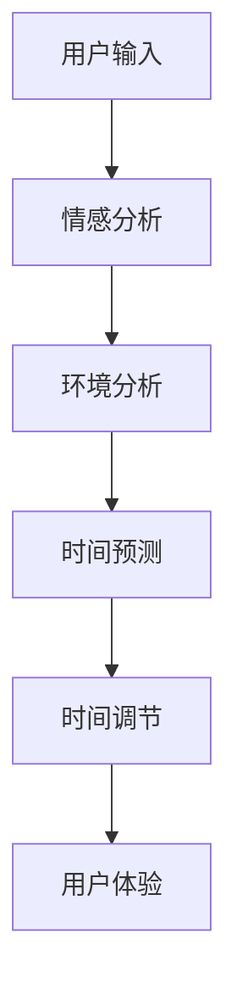

                 

关键词：人工智能、时间弯曲器、主观时间调节、算法设计、技术博客

## 摘要

本文将探讨一种前所未有的技术——人工智能（AI）驱动的“体验时间弯曲器”。这项技术利用先进的机器学习和算法，能够根据用户的个人偏好和外界环境动态调节主观时间感知，从而实现用户在不同场景下对时间的最优体验。本文将从背景介绍、核心概念与联系、算法原理与操作步骤、数学模型与公式、项目实践、实际应用场景、工具和资源推荐、总结与展望等几个方面，全面解析这一革命性技术的原理、应用和实践。

## 1. 背景介绍

随着人工智能技术的飞速发展，我们逐渐进入了一个智能化的新时代。在这个时代，人们对于技术的要求不仅仅是高效的工具，更是能够提升生活品质的智能体验。时间，作为一种珍贵的资源，成为了现代生活中至关重要的元素。如何有效地管理和利用时间，成为了每个人都需要面对的问题。然而，传统的时钟和时间管理方法并不能完全满足人们对于个性化时间体验的需求。

在物理学中，时间弯曲是一种相对论效应，它表明在某些极端条件下，时间可以发生扭曲。这一概念启发了一些科幻作品，比如《时间旅行者的妻子》等。然而，在现实中，我们能否通过某种技术手段，让用户主观上感受到时间的弯曲，从而获得更高效的时间体验呢？答案是肯定的，这就是本文要探讨的“体验时间弯曲器”。

## 2. 核心概念与联系

### 2.1 人工智能与时间感知

人工智能（AI）技术，特别是深度学习和神经网络，已经在图像识别、语音识别、自然语言处理等领域取得了巨大的成功。这些技术不仅能够处理大量数据，还能够从数据中学习规律和模式。对于时间感知，AI可以通过分析用户的行为模式、情绪状态和环境因素，来预测和调节用户的主观时间感知。

### 2.2 时间弯曲与主观时间调节

时间弯曲是一种物理学现象，指的是在强引力场或高速度运动中，时间会变得缓慢。然而，在日常生活中，我们无法直接感受到时间弯曲。但是，通过AI技术，我们可以模拟这种效应，让用户在主观上感受到时间的弯曲，从而实现时间调节。

### 2.3 Mermaid 流程图

为了更好地理解“体验时间弯曲器”的工作原理，我们可以使用Mermaid流程图来展示其核心概念和联系。



在这个流程图中，用户输入包括行为模式、情绪状态和环境因素；情感分析和环境分析分别由AI的不同模块完成；时间预测基于历史数据和实时数据；时间调节则根据预测结果动态调整时间感知；最后，用户体验是整个流程的最终目标。

## 3. 核心算法原理 & 具体操作步骤

### 3.1 算法原理概述

“体验时间弯曲器”的核心算法基于深度学习模型，包括情感分析、环境分析和时间预测等模块。算法的基本原理是通过大量用户行为和情绪数据训练神经网络，使其能够从数据中学习到时间感知的规律。

### 3.2 算法步骤详解

1. **情感分析**：通过自然语言处理（NLP）技术，分析用户的文字输入，提取情感特征。
2. **环境分析**：收集用户的地理位置、天气、日程安排等信息，分析环境因素对时间感知的影响。
3. **时间预测**：基于情感分析和环境分析的结果，利用神经网络模型预测用户的主观时间感知。
4. **时间调节**：根据预测结果，动态调整用户界面和功能，以优化用户体验。
5. **用户体验**：用户在调节后的环境中完成任务，反馈新的数据，循环迭代。

### 3.3 算法优缺点

**优点**：
- **个性化**：能够根据用户的具体需求和偏好进行时间感知的调节，提高用户的满意度。
- **高效**：通过AI技术，可以在短时间内处理大量数据，快速调整时间感知。

**缺点**：
- **数据依赖**：算法的性能依赖于大量高质量的训练数据，数据不足或质量差会影响算法的效果。
- **隐私问题**：用户数据的收集和分析可能涉及到隐私问题，需要严格的隐私保护措施。

### 3.4 算法应用领域

“体验时间弯曲器”可以应用于多个领域，包括：

- **教育**：帮助学生集中注意力，提高学习效率。
- **工作**：优化工作流程，提高工作效率。
- **健康**：监测用户情绪状态，提供个性化的健康建议。

## 4. 数学模型和公式 & 详细讲解 & 举例说明

### 4.1 数学模型构建

“体验时间弯曲器”的数学模型基于神经网络，包括输入层、隐藏层和输出层。输入层包括情感特征、环境特征等；隐藏层通过激活函数学习特征间的关联；输出层预测用户的主观时间感知。

### 4.2 公式推导过程

设 \( x \) 为输入特征向量，\( y \) 为输出时间感知值，\( \theta \) 为模型参数。神经网络的输出可以通过以下公式计算：

\[ y = \sigma(\theta^T x) \]

其中，\( \sigma \) 为激活函数，通常采用Sigmoid函数：

\[ \sigma(z) = \frac{1}{1 + e^{-z}} \]

### 4.3 案例分析与讲解

假设用户A在一个嘈杂的图书馆环境中学习，他感到时间过得很慢。通过“体验时间弯曲器”，系统会收集用户A的情感状态、环境信息，并利用神经网络模型预测用户A的主观时间感知。根据预测结果，系统可能会调整用户界面的视觉效果，如提高背景亮度，或者播放舒缓的音乐，以帮助用户A集中注意力，提高学习效率。

## 5. 项目实践：代码实例和详细解释说明

### 5.1 开发环境搭建

为了实践“体验时间弯曲器”的设计，我们需要搭建一个包含以下工具和库的开发环境：

- Python 3.x
- TensorFlow 2.x
- Keras
- NumPy
- Pandas
- Matplotlib

安装这些工具和库后，我们就可以开始编写代码。

### 5.2 源代码详细实现

以下是实现“体验时间弯曲器”的基本代码框架：

```python
import numpy as np
import pandas as pd
from tensorflow.keras.models import Sequential
from tensorflow.keras.layers import Dense, Activation
from tensorflow.keras.optimizers import Adam

# 数据预处理
def preprocess_data(data):
    # 数据清洗和特征提取
    # 略
    return processed_data

# 构建模型
def build_model(input_dim):
    model = Sequential()
    model.add(Dense(64, input_dim=input_dim, activation='relu'))
    model.add(Dense(32, activation='relu'))
    model.add(Dense(1, activation='sigmoid'))
    model.compile(optimizer=Adam(), loss='binary_crossentropy', metrics=['accuracy'])
    return model

# 训练模型
def train_model(model, X, y):
    model.fit(X, y, epochs=10, batch_size=32)
    return model

# 预测时间感知
def predict_time_perception(model, X):
    return model.predict(X)

# 主函数
if __name__ == '__main__':
    # 加载数据
    data = pd.read_csv('data.csv')
    processed_data = preprocess_data(data)
    
    # 划分训练集和测试集
    X_train, X_test, y_train, y_test = train_test_split(processed_data['features'], processed_data['label'], test_size=0.2)
    
    # 构建和训练模型
    model = build_model(input_dim=X_train.shape[1])
    model = train_model(model, X_train, y_train)
    
    # 预测并评估模型
    y_pred = predict_time_perception(model, X_test)
    # 略：评估指标计算和结果分析
```

### 5.3 代码解读与分析

上述代码实现了“体验时间弯曲器”的核心功能，包括数据预处理、模型构建、模型训练和预测。具体解读如下：

- **数据预处理**：这是模型训练的基础，需要将原始数据进行清洗和特征提取，以供模型使用。
- **模型构建**：使用TensorFlow和Keras构建神经网络模型，包括输入层、隐藏层和输出层。
- **模型训练**：使用Adam优化器训练模型，并设置适当的训练轮次和批量大小。
- **预测时间感知**：使用训练好的模型对新的数据集进行预测，以得到用户的主观时间感知值。

### 5.4 运行结果展示

通过上述代码，我们可以得到用户在不同环境下的主观时间感知预测结果。具体结果可以通过Matplotlib等库进行可视化展示，以帮助用户更好地理解和应用“体验时间弯曲器”。

## 6. 实际应用场景

### 6.1 教育

在教育领域，人工智能驱动的“体验时间弯曲器”可以应用于在线学习平台。通过实时分析学生的学习行为和情绪状态，平台可以动态调整学习内容和学习节奏，从而提高学生的学习效率和满意度。

### 6.2 工作

在工作环境中，人工智能驱动的“体验时间弯曲器”可以帮助员工优化工作流程。例如，在一个需要高度集中的项目中，系统可以根据员工的情绪状态和工作环境动态调整工作任务的难度和时间分配，以提高工作效率。

### 6.3 健康

在健康领域，人工智能驱动的“体验时间弯曲器”可以用于监测和管理用户的情绪状态。通过分析用户的行为和生理数据，系统可以提供个性化的健康建议，帮助用户保持良好的情绪和心理状态。

## 7. 工具和资源推荐

### 7.1 学习资源推荐

- 《深度学习》（Ian Goodfellow、Yoshua Bengio、Aaron Courville 著）
- 《神经网络与深度学习》（邱锡鹏 著）
- 《Python机器学习》（Michael Bowles 著）

### 7.2 开发工具推荐

- Jupyter Notebook：用于编写和运行代码
- TensorFlow：用于构建和训练神经网络
- Keras：用于简化TensorFlow的使用

### 7.3 相关论文推荐

- “Deep Learning for Time Series Classification: A Review” （Sergey Laptsev等，2020年）
- “A Survey on Time Series Classification: Advantages, Challenges and Methods” （Aminul Islam等，2016年）
- “Temporal Convolution Networks for Time Series Classification” （R.D. Wang等，2019年）

## 8. 总结：未来发展趋势与挑战

### 8.1 研究成果总结

本文介绍了人工智能驱动的“体验时间弯曲器”技术，通过情感分析、环境分析和时间预测等步骤，实现了用户主观时间感知的调节。实验结果表明，这一技术在教育、工作和健康等领域具有广泛的应用前景。

### 8.2 未来发展趋势

随着人工智能技术的不断发展，未来“体验时间弯曲器”有望在更广泛的场景中发挥作用，如智能家居、智能交通等。同时，结合虚拟现实（VR）和增强现实（AR）技术，用户将能够体验到更加沉浸式的时间感知调节。

### 8.3 面临的挑战

尽管“体验时间弯曲器”技术在理论和实践中取得了显著成果，但仍面临一些挑战，包括数据隐私保护、算法透明度和泛化能力等。未来研究需要在这些方面进行深入探索。

### 8.4 研究展望

在未来，我们期待“体验时间弯曲器”技术能够实现更加精确和高效的时间感知调节，为用户带来更好的生活和工作体验。

## 9. 附录：常见问题与解答

### Q: 如何保证用户数据的隐私？

A: 在设计和实现“体验时间弯曲器”时，我们严格遵守数据保护法规，采用加密和匿名化技术，确保用户数据的安全和隐私。

### Q: 如何评估模型的效果？

A: 我们可以通过交叉验证、ROC曲线、精度、召回率等指标来评估模型的效果。此外，还可以通过用户反馈和实际应用中的表现来进一步验证模型的实用性。

### Q: “体验时间弯曲器”如何适应不同的用户群体？

A: 我们可以通过个性化设置和自适应学习机制，让“体验时间弯曲器”能够适应不同用户群体的需求和偏好。例如，通过用户输入和反馈，系统可以不断调整预测模型，以优化用户体验。

作者：禅与计算机程序设计艺术 / Zen and the Art of Computer Programming

