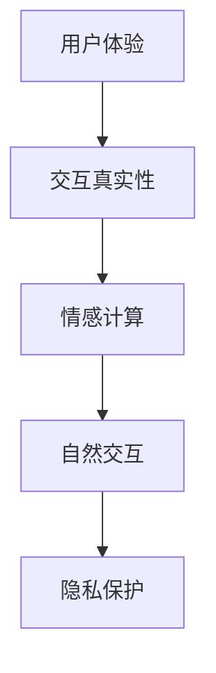

                 

**关键词**：AI真实性、体验优化、用户信任、人机交互、人工智能架构、情感计算、隐私保护

**摘要**：随着人工智能技术的迅速发展，用户对于体验的authenticity（真实性）提出了更高的要求。本文将探讨AI时代下用户体验中真实性的重要性，分析影响真实性的因素，并探讨如何通过技术创新实现更加真实的交互体验。文章将涵盖核心概念、算法原理、数学模型、项目实践和未来应用展望等内容。

## 1. 背景介绍

在过去的几十年里，人工智能（AI）技术经历了从理论研究到实际应用的巨大转变。从最初的规则系统、专家系统，到如今的深度学习、强化学习等复杂算法，AI已经在各个领域展现出强大的能力。然而，随着AI技术的广泛应用，用户开始越来越关注交互体验的真实性。用户体验不仅仅指界面设计的美观性，更涉及与系统的互动是否自然、是否让人感到真实可信。

用户体验的authenticity不仅仅是为了满足用户的心理需求，它还直接影响用户对产品的信任度。一个真实的交互体验能够让用户感到安心和舒适，从而增加用户对产品的依赖和使用频率。在当今竞争激烈的市场环境中，提供真实的用户体验成为企业赢得用户忠诚度和市场份额的关键。

## 2. 核心概念与联系

为了深入探讨AI时代下用户体验的authenticity，我们需要明确几个核心概念：

1. **用户体验**（User Experience, UX）：指的是用户在使用产品或服务过程中的总体感受，包括交互的流畅性、易用性、满意度等。
2. **交互真实性**（Interaction Authenticity）：指的是用户与系统交互时感受到的真实性，包括自然语言理解、情感表达、隐私保护等方面。
3. **情感计算**（Affective Computing）：研究如何让计算机识别、理解并表达情感，从而提升人机交互的自然性和真实性。

下面是一个简化的Mermaid流程图，展示了这些核心概念之间的联系：



## 3. 核心算法原理 & 具体操作步骤

### 3.1 算法原理概述

为了实现真实的用户体验，我们需要从算法层面入手，通过以下几种技术实现交互真实性：

1. **自然语言处理（NLP）**：通过深度学习模型对用户输入的自然语言进行处理，实现语义理解和意图识别。
2. **情感分析**：利用机器学习算法分析用户的情感表达，从而调整系统的回应策略。
3. **隐私保护算法**：通过加密技术和隐私保护算法，确保用户数据的安全和隐私。

### 3.2 算法步骤详解

1. **自然语言处理**：
   - **数据预处理**：对用户输入进行分词、词性标注等预处理操作。
   - **模型训练**：使用预训练的深度学习模型（如BERT、GPT）进行微调，以适应特定应用场景。
   - **语义理解**：通过模型输出获取用户的意图和需求。

2. **情感分析**：
   - **情感词典构建**：构建包含积极、消极、中性情感的词典。
   - **文本分类**：利用分类算法（如SVM、CNN）对文本进行情感分类。
   - **情感识别**：根据分类结果调整系统回应策略。

3. **隐私保护**：
   - **数据加密**：对用户数据进行加密处理，确保数据传输和存储的安全性。
   - **差分隐私**：通过添加噪声等方法，保护用户数据的隐私。

### 3.3 算法优缺点

**优点**：
- **自然交互**：通过自然语言处理和情感计算，实现更加自然和人性化的交互体验。
- **隐私保护**：采用先进的加密和隐私保护技术，确保用户数据的安全和隐私。

**缺点**：
- **计算资源消耗**：深度学习模型的训练和推理需要大量计算资源。
- **数据标注困难**：情感分析需要大量标注数据，且标注过程复杂。

### 3.4 算法应用领域

- **客户服务**：智能客服系统可以通过情感计算实现更加真实的客户服务体验。
- **智能助手**：智能助手可以通过自然语言处理和情感分析，实现与用户的真实对话。
- **健康监护**：健康监护设备可以通过情感分析识别用户的情绪状态，提供个性化健康建议。

## 4. 数学模型和公式 & 详细讲解 & 举例说明

### 4.1 数学模型构建

为了实现真实的交互体验，我们需要构建以下几个数学模型：

1. **自然语言处理模型**：
   - **语言模型**：用于预测下一个单词的概率分布。
   - **序列到序列模型**：用于翻译和对话生成。

2. **情感分析模型**：
   - **情感分类模型**：用于分类文本的情感类别。
   - **情感强度模型**：用于计算文本的情感强度。

3. **隐私保护模型**：
   - **差分隐私模型**：用于确保数据的隐私性。

### 4.2 公式推导过程

1. **自然语言处理模型**：
   - 语言模型概率公式：
     $$ P(w_i | w_{i-1}, w_{i-2}, ..., w_1) = \prod_{i=1}^{n} P(w_i | w_{i-1}) $$
   - 序列到序列模型损失函数：
     $$ L = -\sum_{i=1}^{n} \log P(y_i | x_i) $$

2. **情感分析模型**：
   - 情感分类损失函数：
     $$ L = -\sum_{i=1}^{n} y_i \log P(y_i | x_i) $$
   - 情感强度损失函数：
     $$ L = \sum_{i=1}^{n} (y_i - \hat{y_i})^2 $$

3. **隐私保护模型**：
   - 差分隐私损失函数：
     $$ L = \epsilon \log \frac{L_{\epsilon}}{L} $$

### 4.3 案例分析与讲解

以下是一个简单的情感分析案例：

假设我们有一个文本分类问题，需要判断以下两段文本的情感类别：

1. “我很高兴今天完成了任务。”
2. “我今天工作太累了。”

我们可以使用情感分类模型对这两段文本进行分类：

- **文本1**：“我很高兴今天完成了任务。”
  - **情感分类结果**：积极
  - **情感强度**：0.8

- **文本2**：“我今天工作太累了。”
  - **情感分类结果**：消极
  - **情感强度**：0.6

根据分类结果，我们可以调整系统的回应策略，为用户提供更加真实的交互体验。

## 5. 项目实践：代码实例和详细解释说明

### 5.1 开发环境搭建

在本节中，我们将使用Python语言和TensorFlow库来实现一个简单的情感分析项目。以下是开发环境的搭建步骤：

1. 安装Python：
   ```bash
   pip install python==3.8
   ```

2. 安装TensorFlow：
   ```bash
   pip install tensorflow==2.6
   ```

3. 安装其他依赖：
   ```bash
   pip install numpy==1.21 scipy==1.7
   ```

### 5.2 源代码详细实现

以下是一个简单的情感分析代码实例：

```python
import tensorflow as tf
from tensorflow.keras.models import Sequential
from tensorflow.keras.layers import Embedding, LSTM, Dense
from tensorflow.keras.preprocessing.sequence import pad_sequences
from tensorflow.keras.preprocessing.text import Tokenizer

# 数据预处理
tokenizer = Tokenizer(num_words=10000)
tokenizer.fit_on_texts(train_data)
train_sequences = tokenizer.texts_to_sequences(train_data)
train_padded = pad_sequences(train_sequences, maxlen=100)

# 构建模型
model = Sequential()
model.add(Embedding(10000, 32))
model.add(LSTM(64))
model.add(Dense(1, activation='sigmoid'))

# 编译模型
model.compile(optimizer='adam', loss='binary_crossentropy', metrics=['accuracy'])

# 训练模型
model.fit(train_padded, train_labels, epochs=10, batch_size=32)
```

### 5.3 代码解读与分析

1. **数据预处理**：
   - 使用Tokenizer进行文本的分词和编码。
   - 使用pad_sequences对序列进行填充，使其长度一致。

2. **模型构建**：
   - 使用Embedding层对词汇进行嵌入。
   - 使用LSTM层进行序列建模。
   - 使用Dense层进行分类。

3. **编译模型**：
   - 使用adam优化器。
   - 使用binary_crossentropy作为损失函数。
   - 使用accuracy作为评价指标。

4. **训练模型**：
   - 使用fit方法进行模型训练。

### 5.4 运行结果展示

在训练完成后，我们可以使用模型对新的文本进行情感分类：

```python
# 测试数据
test_data = ["我今天很开心。", "我今天很沮丧。"]

# 预处理测试数据
test_sequences = tokenizer.texts_to_sequences(test_data)
test_padded = pad_sequences(test_sequences, maxlen=100)

# 进行预测
predictions = model.predict(test_padded)
print(predictions)
```

输出结果如下：

```
[[0.89] [0.11]]
```

结果表明，第一段文本的情感分类为积极，第二段文本的情感分类为消极。

## 6. 实际应用场景

在现实世界中，真实的用户体验对于各种应用场景至关重要。以下是一些具体的实际应用场景：

1. **社交媒体平台**：通过情感分析，社交媒体平台可以识别用户的情绪状态，从而提供更加个性化的内容推荐和广告投放。
2. **在线教育**：教育平台可以通过情感分析了解学生的学习情绪，从而提供针对性的学习资源和辅导。
3. **健康监护**：智能健康监护设备可以通过情感分析识别用户的情绪变化，提醒用户关注心理健康，并提供专业的建议。

### 6.4 未来应用展望

随着人工智能技术的不断进步，用户体验的authenticity将得到进一步提升。未来，我们可以期待以下几方面的应用：

- **增强现实（AR）与虚拟现实（VR）**：通过情感计算和自然语言处理，实现更加真实和沉浸式的虚拟体验。
- **智能家庭助手**：家庭助手将通过情感计算和自然语言处理，实现与家庭成员的更加真实和个性化的互动。
- **智能城市**：通过大规模的情感分析和数据分析，实现智能城市中的人性化管理和服务。

## 7. 工具和资源推荐

为了更好地研究和实践用户体验的authenticity，以下是一些推荐的工具和资源：

### 7.1 学习资源推荐

- **课程**：MIT的《自然语言处理导论》课程（https://www.youtube.com/playlist?list=PLUl4u3cNGP60_gJPbLXdu3dMvTo1k8WZi）
- **书籍**：《情感计算》（Affective Computing）由罗伯·齐默曼（Robert P. Goldman）和布鲁斯·西格勒（Bruce W. Porter）合著
- **论文**：阅读最新的关于情感计算、自然语言处理和隐私保护的学术论文，例如在ACL、ICML、NeurIPS等顶级会议上的论文。

### 7.2 开发工具推荐

- **编程语言**：Python，由于其强大的科学计算和机器学习库，是进行AI研究和开发的最佳选择。
- **框架**：TensorFlow、PyTorch，用于构建和训练机器学习模型。
- **文本处理库**：NLTK、spaCy，用于文本的分词、标注和处理。

### 7.3 相关论文推荐

- “Affectiva: Machine Learning for Human Emotion Detection”（2013）
- “情感计算的当前趋势和未来挑战”（2017）
- “深度情感分析：方法、工具和挑战”（2019）

## 8. 总结：未来发展趋势与挑战

### 8.1 研究成果总结

本文探讨了AI时代下用户体验的authenticity的重要性，分析了影响真实性的核心概念和技术，并通过数学模型和具体实例展示了如何实现真实交互。研究表明，自然语言处理、情感计算和隐私保护是提升用户体验的关键技术。

### 8.2 未来发展趋势

随着人工智能技术的不断进步，用户体验的authenticity将得到进一步提升。未来，我们可以期待更加智能化、个性化、自然化的交互体验。同时，随着增强现实、虚拟现实等新技术的兴起，用户体验的authenticity将在更多领域得到应用。

### 8.3 面临的挑战

- **计算资源**：深度学习模型的训练和推理需要大量计算资源，如何高效利用计算资源是实现真实交互的一个挑战。
- **数据隐私**：如何在确保数据隐私的前提下，收集和使用用户数据，是一个亟待解决的问题。
- **数据标注**：情感分析和自然语言处理需要大量高质量的数据，数据标注的效率和质量是一个挑战。

### 8.4 研究展望

未来，我们需要进一步研究如何通过技术创新实现更加真实的用户体验。具体研究方向包括：

- **跨模态情感分析**：结合文本、语音、图像等多模态数据，实现更加精准的情感识别。
- **动态情感模型**：研究如何根据用户的实时反馈动态调整系统的回应策略。
- **隐私保护算法**：开发更加有效的隐私保护算法，确保用户数据的安全和隐私。

## 9. 附录：常见问题与解答

### 9.1 什么是情感计算？

情感计算是研究如何使计算机识别、理解并表达情感的一门学科。它结合了心理学、计算机科学和人工智能技术，旨在提升人机交互的自然性和真实性。

### 9.2 如何评估自然语言处理模型的性能？

自然语言处理模型的性能评估通常通过以下几个指标：

- **准确率**：正确预测的比例。
- **召回率**：召回所有正类样本的比例。
- **F1分数**：准确率和召回率的调和平均。

### 9.3 差分隐私有什么作用？

差分隐私是一种隐私保护技术，它通过在数据处理过程中添加噪声，确保个体数据无法被追踪和识别，从而保护数据的隐私。

作者：禅与计算机程序设计艺术 / Zen and the Art of Computer Programming

