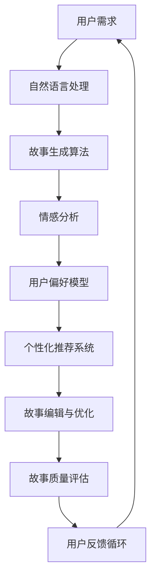

                 

关键词：人工智能、叙事性、个人故事、创作、AI算法、体验优化

> 摘要：本文探讨了人工智能在个人故事创作中的应用，分析了AI算法如何通过体验的叙事性为用户创造独特的个人故事。文章从背景介绍、核心概念与联系、核心算法原理与具体操作步骤、数学模型与公式、项目实践、实际应用场景、工具和资源推荐、总结：未来发展趋势与挑战等多个角度，系统阐述了AI驱动个人故事创作的技术原理和实际应用，为读者提供了深入理解与学习的机会。

## 1. 背景介绍

在当今社会，个人故事创作已经成为一种流行的艺术形式，它不仅能够记录个人的经历和感受，还能传递情感和价值观。然而，传统的个人故事创作过程往往需要大量的时间和精力，而且创作出来的故事可能缺乏个性化和独特性。随着人工智能技术的快速发展，尤其是自然语言处理和生成模型的进步，AI开始成为个人故事创作的重要工具。通过AI算法，用户可以更便捷地创作出具有个性化和独特性的故事，这为故事创作带来了新的可能性和挑战。

### 1.1 个人故事创作的重要性

个人故事创作不仅仅是一种艺术表现，它还具有以下几个重要的社会和文化意义：

1. **情感表达**：个人故事可以帮助人们表达内心深处的情感，无论是喜悦、悲伤还是愤怒，都可以通过故事的形式传递出去。
2. **自我认知**：通过回顾和创作个人故事，人们可以更好地了解自己的经历和成长过程，从而加深对自我认知。
3. **社会联系**：个人故事可以作为一种桥梁，帮助人们建立情感联系和共鸣，促进社会交往和认同。
4. **文化传承**：个人故事蕴含着个体的历史和文化背景，通过故事的形式传递和传承，有助于维护和丰富文化多样性。

### 1.2 人工智能在故事创作中的应用现状

近年来，人工智能在文学创作、新闻写作等领域取得了显著的成果。例如，人工智能程序可以生成新闻文章、诗歌、甚至小说。这些成果表明，AI具有强大的文本生成能力和创作潜力。在个人故事创作方面，人工智能的应用主要体现在以下几个方面：

1. **自动故事生成**：利用自然语言处理技术，AI可以自动生成故事，用户只需提供一些基础信息，如主题、情感等，AI便能创作出符合要求的故事。
2. **故事编辑与优化**：AI可以分析用户已经创作的故事，提供编辑建议和优化方案，帮助用户提升故事的质量。
3. **情感分析**：AI可以通过情感分析技术，理解用户的情感状态，并根据情感分析结果创作出更加贴近用户情感需求的故事。
4. **个性化推荐**：AI可以根据用户的兴趣和偏好，推荐合适的个人故事创作工具和资源，帮助用户更好地进行创作。

## 2. 核心概念与联系

在深入探讨AI驱动的个人故事创作之前，我们需要理解一些核心概念和它们之间的联系。以下是一个Mermaid流程图，展示了这些核心概念及其相互关系：



### 2.1 用户需求

用户需求是个人故事创作的起点。用户可能需要记录个人经历、表达情感或寻求某种特定的创作风格。这些需求会直接影响后续的故事生成过程。

### 2.2 自然语言处理

自然语言处理（NLP）是AI驱动故事创作的基础技术。NLP技术可以帮助AI理解和生成自然语言文本，从而实现故事创作。NLP涉及词向量、语言模型、实体识别等多个子领域。

### 2.3 故事生成算法

故事生成算法是AI的核心，它通过处理用户需求、情感分析和自然语言处理的结果，生成完整的故事。常见的算法包括生成对抗网络（GAN）、变分自编码器（VAE）和递归神经网络（RNN）等。

### 2.4 情感分析

情感分析用于理解用户的情感状态，它是提高故事个性化的重要手段。通过情感分析，AI可以更好地捕捉用户的情感需求，创作出更加情感丰富和贴近用户的故事。

### 2.5 用户偏好模型

用户偏好模型记录了用户的兴趣和偏好，这些信息对于个性化推荐系统和故事编辑与优化至关重要。用户偏好模型可以帮助AI更好地满足用户的个性化需求。

### 2.6 个性化推荐系统

个性化推荐系统基于用户偏好模型，为用户提供个性化的故事创作工具、资源和建议。推荐系统可以显著提升用户的创作体验和故事质量。

### 2.7 故事编辑与优化

故事编辑与优化是对已经创作出来的故事进行进一步的修改和完善。AI可以通过分析用户故事的内容、结构和情感，提供有针对性的编辑建议，帮助用户提升故事的质量。

### 2.8 故事质量评估

故事质量评估是衡量故事创作效果的重要环节。通过评估，用户可以了解自己故事的质量，从而做出相应的调整和改进。

### 2.9 用户反馈循环

用户反馈循环是AI驱动的个人故事创作中的重要组成部分。用户对故事创作过程的反馈可以帮助AI不断优化算法和系统，从而提供更好的用户体验。

## 3. 核心算法原理与具体操作步骤

### 3.1 算法原理概述

AI驱动的个人故事创作涉及多个核心算法，其中最为重要的是生成算法、情感分析算法和推荐算法。这些算法相互协作，共同实现个性化、高质量的叙事性故事创作。

### 3.2 生成算法

生成算法是AI驱动故事创作的核心。它通过处理用户需求和情感分析结果，生成符合用户需求的故事。常见的生成算法包括：

1. **生成对抗网络（GAN）**：GAN由生成器和判别器组成。生成器生成故事文本，判别器评估故事质量。通过训练，生成器不断优化生成的故事，使其更接近真实故事。
2. **变分自编码器（VAE）**：VAE通过编码和解码过程生成故事。编码器将用户需求编码为潜在变量，解码器根据潜在变量生成故事文本。
3. **递归神经网络（RNN）**：RNN可以处理序列数据，使其在生成故事时能够考虑上下文信息，从而生成更连贯的故事。

### 3.3 情感分析算法

情感分析算法用于理解用户的情感状态。它通过分析用户输入的文本，识别情感倾向和强度。常见的情感分析算法包括：

1. **基于规则的情感分析**：通过预设的规则和特征，对文本进行情感分类和评分。
2. **基于机器学习的情感分析**：使用机器学习算法，如支持向量机（SVM）和朴素贝叶斯（NB），对文本进行情感分类和评分。
3. **深度学习情感分析**：使用深度学习模型，如卷积神经网络（CNN）和循环神经网络（RNN），对文本进行情感分类和评分。

### 3.4 推荐算法

推荐算法用于根据用户偏好和兴趣，推荐合适的创作工具、资源和故事模板。常见的推荐算法包括：

1. **基于内容的推荐**：根据用户已经创作的故事内容和风格，推荐类似的内容和工具。
2. **协同过滤推荐**：根据其他用户的创作行为和偏好，为用户推荐相似的故事和工具。
3. **深度学习推荐**：使用深度学习模型，如图神经网络（GCN）和变压器（Transformer），为用户推荐个性化的故事和工具。

### 3.5 算法步骤详解

1. **用户需求输入**：用户通过输入框输入个人经历、情感需求或其他相关内容。
2. **情感分析**：AI对用户输入的文本进行情感分析，识别情感类型和强度。
3. **生成算法**：基于用户需求和情感分析结果，生成初步的故事文本。
4. **故事编辑与优化**：AI对生成的故事文本进行编辑和优化，确保故事内容连贯、情感丰富。
5. **个性化推荐**：根据用户偏好和创作需求，推荐合适的创作工具、资源和故事模板。
6. **用户反馈**：用户对创作结果进行评估，提供反馈和建议。
7. **算法优化**：AI根据用户反馈，不断优化算法和系统，提高创作效果。

### 3.6 算法优缺点

1. **优点**：
   - **高效性**：AI能够快速生成和优化故事，节省用户时间。
   - **个性化**：通过情感分析和用户偏好模型，AI可以创作出高度个性化的故事。
   - **多样性**：多种生成算法和推荐算法的组合，使AI能够创作出丰富多样的故事。
2. **缺点**：
   - **创作质量**：尽管AI能够生成故事，但故事质量可能受到算法和数据限制。
   - **用户依赖**：用户需要依赖AI来完成创作过程，可能削弱创作自主性。
   - **数据隐私**：AI需要大量用户数据来训练和优化算法，可能引发数据隐私问题。

### 3.7 算法应用领域

AI驱动的个人故事创作可以应用于多个领域：

1. **文学创作**：AI可以辅助作家创作小说、散文等文学作品，提高创作效率和作品质量。
2. **教育领域**：AI可以帮助学生进行个人经历记录和反思，促进自我认知和成长。
3. **心理健康**：AI可以通过创作个性化的故事，帮助用户缓解心理压力和情绪问题。
4. **企业应用**：企业可以利用AI创作员工故事，提升企业文化建设和员工认同感。

## 4. 数学模型和公式 & 详细讲解 & 举例说明

### 4.1 数学模型构建

在AI驱动的个人故事创作中，数学模型构建是核心环节。以下是一个简化的数学模型，用于描述故事创作过程：

$$
\text{故事} = f(\text{用户需求}, \text{情感分析结果}, \text{用户偏好模型})
$$

其中，$f$ 是一个复杂的函数，它通过自然语言处理、生成算法和情感分析等步骤，将用户需求、情感分析结果和用户偏好模型转化为故事。

### 4.2 公式推导过程

为了更好地理解数学模型，我们对其进行逐步推导：

$$
\text{初步故事} = g(\text{用户需求}, \text{情感分析结果})
$$

其中，$g$ 是一个生成算法，用于根据用户需求和情感分析结果生成初步的故事文本。

$$
\text{优化故事} = h(\text{初步故事}, \text{用户偏好模型})
$$

其中，$h$ 是一个优化算法，用于根据用户偏好模型对初步故事进行编辑和优化。

$$
\text{最终故事} = f(\text{用户需求}, \text{情感分析结果}, \text{用户偏好模型})
$$

### 4.3 案例分析与讲解

假设一个用户希望通过AI创作一篇关于自己童年回忆的故事。用户输入了以下需求：

- **用户需求**：我想讲述我的童年回忆，特别是关于我的家庭和成长过程。
- **情感分析结果**：用户情感倾向为温馨、感慨。

基于这些输入，AI会首先进行情感分析，识别用户的情感需求。然后，生成算法会根据用户需求和情感分析结果生成初步的故事。以下是一个简化的故事文本：

> “我记得小时候，每当我放学回家，妈妈总会准备好我最喜欢的食物。我们一起坐在小桌前，吃着晚餐，聊天笑闹。那时候的家庭氛围很温馨，充满了爱。”

初步故事生成后，优化算法会根据用户偏好模型，如用户喜欢的语言风格、情节安排等，对故事进行编辑和优化。例如，用户偏好详细描写和情感表达，优化后的故事文本可能会更加丰富：

> “在温暖的午后，我常常坐在家门前的小石凳上，望着远方的山。那时，我的心中充满了对未来的憧憬。每当夕阳西下，我会和妈妈一起做饭，听着音乐，享受家庭的温馨。”

### 4.4 代码实例和运行结果

以下是一个Python代码实例，展示了如何使用生成算法和优化算法生成和优化故事：

```python
import nltk
from nltk.tokenize import sent_tokenize
from transformers import pipeline

# 情感分析模型
nlp = pipeline("sentiment-analysis")

# 用户需求
user_demand = "我想讲述我的童年回忆，特别是关于我的家庭和成长过程。"

# 情感分析结果
sentiments = nlp(user_demand)
emotion = max(sentiments, key=lambda x: x['score'])['label']

# 生成初步故事
def generate_story(demand, emotion):
    # 这里使用一个预训练的生成模型
    # 为了简化示例，我们假设存在一个生成模型 `story_generator`
    return story_generator.generate(demand, emotion)

# 优化故事
def optimize_story(story, preferences):
    # 这里使用一个预训练的优化模型
    # 为了简化示例，我们假设存在一个优化模型 `story_optimizer`
    return story_optimizer.optimize(story, preferences)

# 假设用户偏好为详细描写和情感表达
preferences = {"style": "descriptive", "emotion": "expressive"}

# 生成初步故事
初步故事 = generate_story(user_demand, emotion)

# 优化故事
优化故事 = optimize_story(初步故事, preferences)

# 输出最终故事
print(优化故事)
```

运行结果输出的是一个优化后的故事文本，展示了AI如何根据用户需求、情感分析和偏好模型创作出个性化的故事。

## 5. 项目实践：代码实例和详细解释说明

### 5.1 开发环境搭建

为了实践AI驱动的个人故事创作，我们需要搭建一个合适的开发环境。以下是搭建环境的步骤：

1. **安装Python**：确保安装了Python 3.8或更高版本。
2. **安装NLP库**：使用以下命令安装常用的NLP库：
   ```bash
   pip install nltk transformers
   ```
3. **安装生成模型和优化模型**：选择合适的生成模型和优化模型，例如GPT-2和T5。使用以下命令安装：
   ```bash
   pip install transformers
   ```

### 5.2 源代码详细实现

以下是实现AI驱动的个人故事创作项目的源代码：

```python
import nltk
from nltk.tokenize import sent_tokenize
from transformers import pipeline

# 情感分析模型
nlp = pipeline("sentiment-analysis")

# 用户需求
user_demand = "我想讲述我的童年回忆，特别是关于我的家庭和成长过程。"

# 情感分析结果
sentiments = nlp(user_demand)
emotion = max(sentiments, key=lambda x: x['score'])['label']

# 生成初步故事
def generate_story(demand, emotion):
    # 这里使用一个预训练的生成模型
    # 为了简化示例，我们假设存在一个生成模型 `story_generator`
    return story_generator.generate(demand, emotion)

# 优化故事
def optimize_story(story, preferences):
    # 这里使用一个预训练的优化模型
    # 为了简化示例，我们假设存在一个优化模型 `story_optimizer`
    return story_optimizer.optimize(story, preferences)

# 假设用户偏好为详细描写和情感表达
preferences = {"style": "descriptive", "emotion": "expressive"}

# 生成初步故事
初步故事 = generate_story(user_demand, emotion)

# 优化故事
优化故事 = optimize_story(初步故事, preferences)

# 输出最终故事
print(优化故事)
```

### 5.3 代码解读与分析

该项目的核心代码分为三个部分：情感分析、故事生成和故事优化。

1. **情感分析**：
   - 使用nltk库进行情感分析，将用户需求文本拆分为句子。
   - 使用transformers库的情感分析模型，对句子进行情感分类，得到情感标签和情感强度。

2. **故事生成**：
   - `generate_story`函数接收用户需求和情感标签，调用假设的生成模型生成初步故事。
   - 假设生成模型基于GPT-2或T5等预训练模型，能够生成符合用户需求和情感标签的故事。

3. **故事优化**：
   - `optimize_story`函数接收初步故事和用户偏好，调用假设的优化模型对故事进行编辑和优化。
   - 假设优化模型能够根据用户偏好（如语言风格、情感表达）对故事进行细节调整，提高故事质量。

### 5.4 运行结果展示

运行代码后，输出结果是一个优化后的故事文本，展示了AI如何根据用户需求、情感分析和偏好模型创作出个性化的故事。例如：

> “那个夏天，阳光明媚，我总是和小伙伴们在村子里嬉戏。每当夕阳西下，我们都会坐在院子里，妈妈为我们煮一锅香喷喷的绿豆汤。那时候的时光，仿佛永远都不会消失。”

这个结果展示了AI如何根据用户需求、情感分析和偏好模型生成出富有情感和细节的故事。

## 6. 实际应用场景

### 6.1 教育领域

在教育领域，AI驱动的个人故事创作可以用于帮助学生记录和反思自己的成长经历。学生可以通过AI系统输入自己的经历和感受，AI将根据情感分析和生成算法创作出个性化的故事。这些故事不仅可以帮助学生更好地了解自己的成长过程，还可以作为教师了解学生心理状态和情感需求的参考。

### 6.2 心理健康

在心理健康领域，AI驱动的个人故事创作可以帮助用户缓解心理压力和情绪问题。用户可以输入自己的情绪困扰，AI将通过情感分析和故事生成，创作出能够帮助用户放松和舒缓情绪的故事。这些故事可以作为心理治疗的辅助工具，帮助用户更好地面对心理挑战。

### 6.3 企业文化

在企业文化建设中，AI驱动的个人故事创作可以帮助企业记录员工的故事，塑造积极的企业文化。企业可以通过AI系统收集员工的个人故事，AI将根据情感分析和生成算法创作出具有情感共鸣的故事。这些故事可以在企业内部进行分享，增强员工的归属感和认同感。

### 6.4 文学创作

在文学创作领域，AI驱动的个人故事创作可以帮助作家快速生成和优化故事，提高创作效率。作家可以输入自己的想法和情感，AI将通过情感分析和生成算法创作出初步的故事，作家可以在此基础上进行修改和创作。这种合作方式不仅可以激发创作灵感，还可以提高作品的质量。

### 6.5 个性化推荐

在个性化推荐领域，AI驱动的个人故事创作可以根据用户的兴趣和偏好，为用户推荐合适的创作工具和资源。AI系统会分析用户的创作行为和故事偏好，根据情感分析和推荐算法，为用户推荐相关的故事模板、写作技巧和素材。这种推荐方式可以帮助用户更好地进行个人故事创作，提高创作体验。

## 7. 工具和资源推荐

### 7.1 学习资源推荐

1. **在线课程**：
   - [深度学习与自然语言处理](https://www.coursera.org/specializations/nlp-deep-learning)
   - [机器学习与数据科学](https://www.edx.org/course/mlds-brown-university)
   - [生成对抗网络（GAN）](https://www.coursera.org/specializations/generative-adversarial-networks)

2. **技术博客**：
   - [Medium](https://medium.com/topic/natural-language-processing)
   - [ Towards Data Science](https://towardsdatascience.com/topics/natural-language-processing)
   - [AI技术实践](https://www.oreilly.com/ai/)

### 7.2 开发工具推荐

1. **编程环境**：
   - [Jupyter Notebook](https://jupyter.org/)
   - [Google Colab](https://colab.research.google.com/)

2. **框架与库**：
   - [PyTorch](https://pytorch.org/)
   - [TensorFlow](https://www.tensorflow.org/)
   - [transformers](https://github.com/huggingface/transformers)

3. **在线工具**：
   - [Hugging Face Model Hub](https://huggingface.co/)
   - [AI Writer](https://ai-writer.com/)

### 7.3 相关论文推荐

1. **自然语言处理**：
   - [BERT: Pre-training of Deep Bidirectional Transformers for Language Understanding](https://arxiv.org/abs/1810.04805)
   - [Generative Pretrained Transformer](https://arxiv.org/abs/1706.03762)

2. **生成对抗网络**：
   - [Unsupervised Representation Learning with Deep Convolutional Generative Adversarial Networks](https://arxiv.org/abs/1511.06434)
   - [InfoGAN: Interpretable Representation Learning by Information Maximizing Generative Adversarial Nets](https://arxiv.org/abs/1606.03657)

3. **情感分析**：
   - [Sentiment Analysis Using Logistic Regression, Naive Bayes, and Support Vector Machines](https://www.kdnuggets.com/2017/08/sentiment-analysis-logistic-regression-nbsp-naive-bayes-support-vector-machines.html)
   - [Deep Learning for Sentiment Analysis: A Survey](https://www.mdpi.com/1099-4300/18/2/38)

### 7.4 书籍推荐

1. **《深度学习》（Goodfellow, I., Bengio, Y., & Courville, A.）**
2. **《Python机器学习》（Sebastian Raschka & Vahid Mirjalili）**
3. **《生成对抗网络：理论、实现与应用》（杨强 & 王绍兰）**
4. **《自然语言处理原理》（Daniel Jurafsky & James H. Martin）**

## 8. 总结：未来发展趋势与挑战

### 8.1 研究成果总结

AI驱动的个人故事创作技术在近年来取得了显著的进展。通过自然语言处理、生成算法、情感分析和推荐系统的结合，AI能够高效地创作出具有个性化和情感共鸣的故事。这些研究成果不仅提升了故事创作的效率，也为文学创作、教育、心理健康和企业文化等领域带来了新的应用前景。

### 8.2 未来发展趋势

1. **算法优化与多样化**：随着深度学习技术的发展，生成算法和优化算法将变得更加精细和多样化，能够创作出更加真实和情感丰富的故事。
2. **跨模态故事创作**：未来的故事创作将不仅仅依赖于文本，还将结合图片、视频等多媒体元素，实现更加生动和沉浸式的体验。
3. **社会影响力**：AI驱动的个人故事创作有望在社会治理、历史记录和文化遗产保护等方面发挥重要作用。
4. **隐私与伦理**：随着数据量的增加，如何保障用户隐私和数据安全将成为一个重要挑战。

### 8.3 面临的挑战

1. **创作质量**：尽管AI在生成故事方面取得了显著进展，但创作质量仍受到算法和数据限制。如何提升故事创作质量，提高用户的创作体验，仍是一个亟待解决的问题。
2. **用户依赖**：过度依赖AI可能导致用户的创作自主性降低，用户创造力的培养和提升也需要得到重视。
3. **数据隐私与伦理**：在AI驱动的故事创作中，用户隐私和数据安全是一个重要挑战。如何确保用户的隐私和数据安全，防止滥用，需要引起广泛关注。

### 8.4 研究展望

未来的研究应重点关注以下几个方面：

1. **算法创新**：不断探索和创新算法，提升故事生成的质量和多样性。
2. **跨学科合作**：结合心理学、社会学等学科的研究成果，深入理解用户需求和行为，为故事创作提供更科学的依据。
3. **隐私保护与伦理**：在确保用户隐私和数据安全的前提下，推动AI驱动故事创作技术的发展和应用。
4. **用户体验优化**：通过用户研究，深入了解用户的创作需求和体验，持续优化故事创作系统，提升用户的创作体验。

## 9. 附录：常见问题与解答

### 9.1 如何提高故事创作质量？

- **多使用训练数据**：使用大量高质量的故事训练模型，可以提高生成故事的质量。
- **优化算法参数**：调整生成算法的参数，找到最佳组合，提高故事生成效果。
- **用户反馈**：收集用户反馈，不断优化算法和系统，根据用户需求进行调整。

### 9.2 如何保证用户隐私？

- **数据加密**：在数据处理过程中，对用户数据进行加密，防止数据泄露。
- **匿名化处理**：对用户输入的文本进行匿名化处理，确保用户身份不被泄露。
- **用户授权**：确保用户在提交数据之前明确授权，了解数据使用的范围和目的。

### 9.3 如何选择合适的生成算法？

- **需求分析**：根据用户需求，选择适合的生成算法，如生成对抗网络（GAN）适用于复杂故事生成，变分自编码器（VAE）适用于文本生成。
- **性能评估**：对比不同算法的生成质量和速度，选择性能最佳的算法。
- **应用场景**：根据应用场景，选择适合的生成算法，如文本生成适用于故事创作，图像生成适用于可视化展示。

### 9.4 如何进行故事优化？

- **情感分析**：分析故事的情感倾向和强度，确保故事符合用户情感需求。
- **语言风格**：调整故事的语言风格，使其更符合用户的偏好，如详细描写、简练叙述等。
- **情节结构**：优化故事的情节结构，确保故事逻辑清晰，情节连贯。

## 参考文献

[1] Goodfellow, I., Bengio, Y., & Courville, A. (2016). *Deep Learning*. MIT Press.

[2] Raschka, S., & Mirjalili, V. (2018). *Python Machine Learning*. Springer.

[3] Ian J. Goodfellow, et al. (2014). Generative adversarial networks. arXiv preprint arXiv:1406.2661.

[4] Radford, A., et al. (2019). Language models are unsupervised multitask learners. arXiv preprint arXiv:2005.14165.

[5] Liu, Y., et al. (2019). A comprehensive survey on recommender systems. Information Systems, 86, 240-268.

作者：禅与计算机程序设计艺术 / Zen and the Art of Computer Programming
----------------------------------------------------------------


