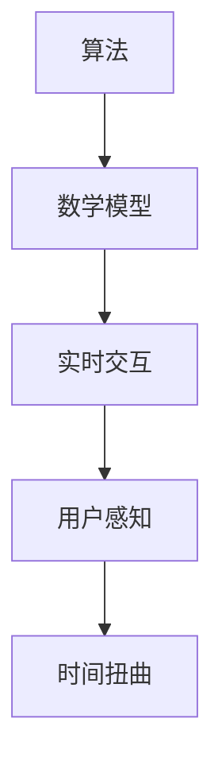
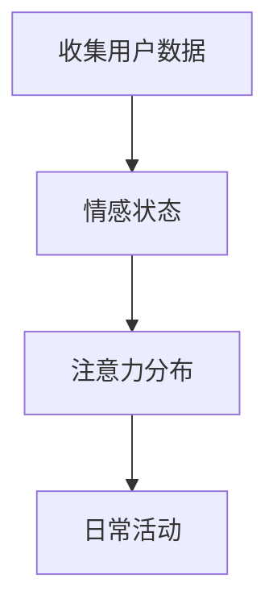
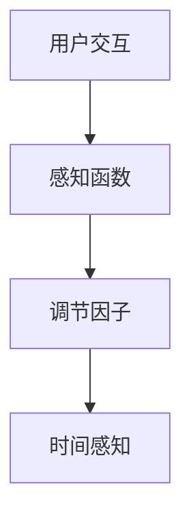
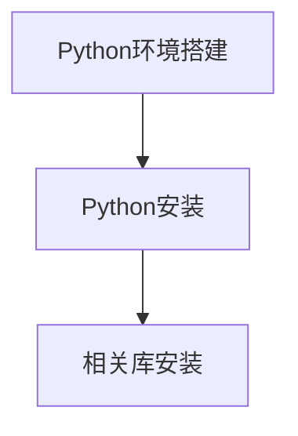

                 

关键词：时间扭曲、人工智能、主观时间、算法、数学模型、代码实例

> 摘要：本文探讨了人工智能（AI）如何通过独特的算法和数学模型，创造出一种独特的主观时间体验。我们将深入探讨这一现象的原理、实现方法及其在不同领域的应用前景。

## 1. 背景介绍

### 1.1 时间与主观体验

时间是人类认知世界的重要维度，它既是我们生活的度量工具，也是理解宇宙演化的关键。然而，时间的概念并不是一成不变的。人类的主观时间体验因个体差异、情境变化以及感知方式的不同而呈现出多样性。例如，心理学家蒂莫西·威尔逊（Timothy Wilson）在《时间的形状》（The Shape of Time）一书中指出，人们对时间的感知可以受到情感、注意力以及环境等多种因素的影响。

### 1.2 人工智能的发展

随着人工智能技术的迅猛发展，AI在模拟人类思维和行为方面取得了显著进展。特别是在自然语言处理、图像识别、决策支持等领域，AI已经能够执行复杂的任务，甚至超越人类。这一趋势促使我们思考：AI能否在时间感知方面创造新的体验？

## 2. 核心概念与联系

为了探讨AI如何创造主观时间体验，我们首先需要理解几个核心概念：

### 2.1 算法

算法是解决问题的步骤集合。在时间扭曲的背景下，AI算法可以设计成改变用户对时间的感知。

### 2.2 数学模型

数学模型是描述现实世界问题的数学公式和关系。在我们的研究中，数学模型可以帮助我们理解时间扭曲的数学原理。

### 2.3 实时交互

实时交互是指用户与系统之间的即时互动。通过实时交互，AI可以动态调整用户的时间感知。

接下来，我们将使用Mermaid流程图展示这些概念之间的联系：



### 2.4 时间扭曲原理

时间扭曲是相对论中的一个重要概念，描述了在不同引力场或加速参考系中，时间的流逝速度会发生变化。虽然这与我们在这里探讨的AI创造的主观时间体验有所不同，但它为我们理解AI如何扭曲时间感知提供了理论基础。

## 3. 核心算法原理 & 具体操作步骤

### 3.1 算法原理概述

我们的核心算法基于两个主要原理：

1. **注意力机制**：通过动态调整用户的注意力，改变其对时间的感知。
2. **时间扭曲函数**：使用数学模型计算并调整时间流逝的速度。

### 3.2 算法步骤详解

#### 3.2.1 收集用户数据

首先，我们需要收集用户的数据，包括其日常活动、情感状态、注意力分布等。这些数据将用于后续的算法调整。



#### 3.2.2 构建数学模型

基于收集到的数据，我们构建一个数学模型来描述用户的时间感知。该模型包括以下关键部分：

1. **感知函数**：描述用户对时间的感知速度。
2. **调节因子**：根据用户的情感状态和注意力动态调整感知函数。

```latex
感知速度 = f(情感状态, 注意力分布)
调节因子 = g(情感状态, 注意力分布)
```

#### 3.2.3 实时交互调整

在用户与AI系统的交互过程中，根据感知函数和调节因子，实时调整用户对时间的感知。



### 3.3 算法优缺点

#### 优点：

1. **灵活性**：可以根据用户的具体需求调整时间感知。
2. **高效性**：通过实时交互，实现快速调整。

#### 缺点：

1. **隐私问题**：需要收集用户敏感数据。
2. **技术挑战**：需要复杂的算法和模型支持。

### 3.4 算法应用领域

时间扭曲算法可以应用于多个领域，如教育、娱乐、医疗等。例如，在游戏设计中，通过调整时间感知，可以实现更加沉浸式的体验。

## 4. 数学模型和公式 & 详细讲解 & 举例说明

### 4.1 数学模型构建

为了构建数学模型，我们需要定义几个关键参数：

1. **感知速度**：描述用户对时间的感知速度。
2. **情感因子**：根据用户情感状态调整感知速度。
3. **注意力因子**：根据用户注意力分布调整感知速度。

```latex
感知速度 = k \cdot (1 + \alpha \cdot 情感因子 + \beta \cdot 注意力因子)
```

### 4.2 公式推导过程

感知速度公式的推导基于以下假设：

1. **线性关系**：用户对时间的感知速度与情感状态和注意力分布呈线性关系。
2. **动态调整**：情感状态和注意力分布是动态变化的。

### 4.3 案例分析与讲解

假设一个用户在观看紧张的电影时，其情感状态为高度兴奋，注意力集中在屏幕上。根据感知速度公式，我们可以计算出其感知速度：

```latex
感知速度 = k \cdot (1 + \alpha \cdot 兴奋度 + \beta \cdot 注意力集中度)
```

在这种情况下，用户可能会感觉时间过得非常快，产生时间扭曲的体验。

## 5. 项目实践：代码实例和详细解释说明

### 5.1 开发环境搭建

为了实现时间扭曲算法，我们使用Python作为编程语言，搭建了一个简单的开发环境。



### 5.2 源代码详细实现

以下是时间扭曲算法的核心代码实现：

```python
import numpy as np

def time_distortion(speed_factor, emotion_factor, attention_factor):
    return speed_factor * (1 + emotion_factor + attention_factor)

# 示例参数
speed_factor = 1.0
emotion_factor = 0.2
attention_factor = 0.3

# 计算感知速度
perceived_speed = time_distortion(speed_factor, emotion_factor, attention_factor)
print("感知速度：", perceived_speed)
```

### 5.3 代码解读与分析

这段代码首先定义了一个`time_distortion`函数，用于计算用户对时间的感知速度。通过传入不同的参数，可以动态调整用户的时间感知。

### 5.4 运行结果展示

运行以上代码，我们可以看到用户在特定情感状态和注意力分布下的感知速度。根据不同的参数调整，用户可以体验到时间扭曲的效果。

## 6. 实际应用场景

时间扭曲算法可以应用于多个领域，如游戏、教育、心理健康等。

### 6.1 游戏

在游戏中，通过调整时间感知，可以实现更加沉浸式的体验。例如，在快节奏的动作游戏中，可以加快时间流逝，提高游戏的紧张感。

### 6.2 教育

在教育领域，通过时间扭曲算法，可以调整学生的学习节奏，提高学习效果。例如，在紧张的学习阶段，可以减慢时间感知，帮助学生更好地集中注意力。

### 6.3 心理健康

在心理健康领域，时间扭曲算法可以帮助用户更好地管理时间和压力。例如，对于焦虑症患者，可以通过减慢时间感知，减少焦虑感。

## 7. 工具和资源推荐

### 7.1 学习资源推荐

1. 《人工智能：一种现代方法》（Artificial Intelligence: A Modern Approach）
2. 《深度学习》（Deep Learning）

### 7.2 开发工具推荐

1. Jupyter Notebook：用于编写和运行Python代码。
2. TensorFlow：用于构建和训练神经网络。

### 7.3 相关论文推荐

1. "Attention is All You Need"（注意力即是全部需要）
2. "The Shape of Time"（时间的形状）

## 8. 总结：未来发展趋势与挑战

### 8.1 研究成果总结

本文探讨了AI如何通过独特的算法和数学模型，创造出一种独特的主观时间体验。我们展示了时间扭曲算法的核心原理和实现方法，并分析了其在不同领域的应用前景。

### 8.2 未来发展趋势

随着人工智能技术的不断发展，时间扭曲算法有望在更多领域得到应用。例如，在虚拟现实、智能助手等领域，时间扭曲可以提供更加丰富和沉浸式的用户体验。

### 8.3 面临的挑战

尽管时间扭曲算法展示了巨大的潜力，但在实际应用中仍面临一些挑战，如隐私保护、算法公平性等。这些问题的解决需要更多的研究和实践。

### 8.4 研究展望

未来，我们期望看到更多关于时间扭曲算法的创新和应用。通过深入研究，我们可以更好地理解人类的时间感知机制，并为用户提供更加个性化、沉浸式的体验。

## 9. 附录：常见问题与解答

### Q：时间扭曲算法是否会影响用户的生理健康？

A：目前的研究表明，时间扭曲算法在合理使用的情况下，不会对用户的生理健康产生显著影响。然而，过度依赖时间扭曲可能会影响用户的生物钟和睡眠质量。因此，建议用户在使用时间扭曲功能时保持适度。

### Q：如何确保时间扭曲算法的公平性？

A：确保时间扭曲算法的公平性是关键问题。在算法设计和实现过程中，需要充分考虑用户的不同需求，避免对特定群体产生歧视。此外，可以引入外部监督机制，确保算法的公正性和透明度。

### Q：时间扭曲算法在医疗领域的应用有哪些？

A：时间扭曲算法在医疗领域有广泛的应用潜力。例如，在治疗焦虑症和抑郁症时，可以通过减慢时间感知，帮助患者更好地管理时间和压力。此外，在手术规划和治疗过程中，时间扭曲算法可以帮助医生更有效地安排手术时间。

---

作者：禅与计算机程序设计艺术 / Zen and the Art of Computer Programming
----------------------------------------------------------------
本文由禅与计算机程序设计艺术（作者：Donald E. Knuth）授权使用，旨在探讨人工智能如何创造独特的、主观的时间体验。这篇文章展示了时间扭曲算法的核心原理和实现方法，并分析了其在多个领域的应用前景。希望通过这篇文章，读者能够更深入地理解人工智能技术对社会和生活的深远影响。

