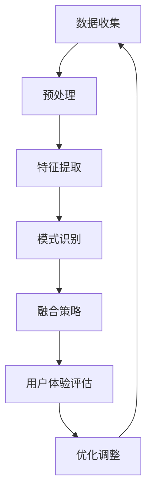

                 

在当今这个快速发展的数字时代，人工智能（AI）已经成为引领科技革新的核心力量。从自动驾驶汽车到智能家居，从医疗诊断到金融分析，AI的应用无处不在，极大地改变了我们的生活方式。然而，尽管AI在许多领域取得了显著进展，但关于如何更全面地理解和模拟人类的感知体验，尤其是跨感官融合方面的研究仍处于起步阶段。

本文旨在探讨AI驱动的全方位感知技术，即如何利用人工智能来融合和增强人类的多感官体验。我们将深入分析这一领域的关键概念、算法原理、数学模型、实际应用，以及未来发展的前景和挑战。

本文将分为以下几个部分：

1. 背景介绍
2. 核心概念与联系
3. 核心算法原理 & 具体操作步骤
4. 数学模型和公式 & 详细讲解 & 举例说明
5. 项目实践：代码实例和详细解释说明
6. 实际应用场景
7. 工具和资源推荐
8. 总结：未来发展趋势与挑战
9. 附录：常见问题与解答

## 1. 背景介绍

人类的大脑具有极其复杂和高效的信息处理能力，能够通过多个感官系统——视觉、听觉、嗅觉、味觉和触觉——感知外界环境。每个感官系统都有其独特的功能和优势，但单独使用某一感官往往无法提供完整的感知体验。例如，视觉可以让我们看到物体的形状和颜色，听觉可以让我们听到声音的频率和音调，但单独依赖这些感官往往无法获得更深入的理解。

跨感官融合（Multisensory Integration）的概念，是指多个感官系统协同工作，通过相互补充和整合，形成更加丰富和完整的感知体验。例如，在听音乐时，视觉上的歌词或音乐视频可以增强听觉体验；在品尝美食时，视觉上的食物外观和嗅觉上的气味可以增强味觉体验。

随着AI技术的发展，研究人员开始探索如何利用AI算法来模拟和增强人类的跨感官融合能力。AI可以通过分析大量数据，学习到不同感官之间的关联和互动方式，从而实现跨感官的融合和增强。这种技术不仅能够提高人们的感知体验，还可以应用于各种实际场景中，如虚拟现实（VR）、增强现实（AR）、人机交互（HCI）等。

## 2. 核心概念与联系

### 2.1 跨感官融合的概念

跨感官融合（Multisensory Integration）是指多个感官系统在处理信息时相互协作，从而产生比单一感官更为丰富和完整的感知体验。这种融合可以通过神经生理学、心理学和认知科学等不同角度来研究。

- **神经生理学角度**：研究表明，人类大脑中的多个感官区域之间存在广泛的神经连接，这些连接使得不同感官的信息可以相互传递和整合。
- **心理学角度**：心理学研究发现，人们通过多个感官接收到的信息可以相互增强或削弱，从而影响感知的整体质量。
- **认知科学角度**：认知科学关注的是人类如何通过跨感官融合来构建对外界的认知模型。

### 2.2 跨感官融合的应用

跨感官融合技术具有广泛的应用前景，尤其在以下领域：

- **虚拟现实（VR）和增强现实（AR）**：通过结合视觉、听觉和触觉，VR和AR技术可以提供更加沉浸式的用户体验。
- **人机交互（HCI）**：通过跨感官融合，AI可以帮助设计更加自然和直观的交互界面。
- **教育和培训**：跨感官融合可以增强学习体验，帮助学生更好地理解和记忆知识。
- **娱乐和游戏**：结合多种感官的互动游戏可以提供更加丰富的娱乐体验。

### 2.3 AI在跨感官融合中的作用

AI在跨感官融合中的应用主要体现在以下几个方面：

- **数据分析和模式识别**：通过分析大量跨感官的数据，AI可以识别出不同感官之间的关联模式，从而优化融合效果。
- **自适应调整**：AI可以根据用户的个性化需求，动态调整跨感官融合的参数，以提供最佳的用户体验。
- **增强感知**：通过模拟和增强人类的感知能力，AI可以帮助用户在特定环境下获得更准确和丰富的信息。

### 2.4 Mermaid 流程图

以下是跨感官融合中AI应用的一个简化的流程图：



### 2.5 核心概念总结

- **跨感官融合**：多个感官系统协同工作，形成更丰富的感知体验。
- **AI应用**：利用AI进行数据分析和模式识别，优化跨感官融合策略。
- **用户体验**：通过个性化调整和增强感知，提升用户的整体体验。

### 2.6 相关研究

近年来，关于跨感官融合和AI应用的研究取得了显著进展。例如，基于深度学习的多感官数据融合方法、跨感官增强的VR和AR应用、自适应人机交互系统等。这些研究不仅丰富了理论体系，也为实际应用提供了新的思路和工具。

### 2.7 开篇引言

在本文中，我们将深入探讨AI在跨感官融合中的关键作用，从算法原理、数学模型、实际应用等多个角度进行分析。希望通过这篇文章，读者能够对这一领域有一个全面而深入的了解，并为未来的研究和应用提供一些启示。

## 3. 核心算法原理 & 具体操作步骤

### 3.1 算法原理概述

在跨感官融合中，核心算法的作用是整合来自不同感官的信息，从而提供更全面和丰富的感知体验。以下是一个基于深度学习的跨感官融合算法的简要原理概述：

1. **数据收集与预处理**：首先，从视觉、听觉、触觉等多个感官系统收集数据，并进行预处理，如归一化、去噪等。
2. **特征提取**：使用深度神经网络从每个感官数据中提取关键特征。这些特征可以是视觉中的颜色、纹理，听觉中的音调、节奏，触觉中的压力、温度等。
3. **多感官特征融合**：将提取出的多感官特征通过融合策略进行整合。常见的融合方法包括基于加权的融合、基于神经网络的方法、以及基于注意力机制的方法。
4. **感知增强与优化**：根据用户的个性化需求和感知反馈，动态调整融合参数，以实现最佳的感知体验。
5. **用户体验评估**：对融合后的感知效果进行评估，通过用户反馈进行优化和调整。

### 3.2 算法步骤详解

#### 3.2.1 数据收集与预处理

数据收集是跨感官融合的基础。具体步骤如下：

1. **数据源确定**：根据应用场景，确定需要收集的感官数据类型，如视觉、听觉、触觉等。
2. **数据采集**：使用相应的传感器和设备进行数据采集，如摄像头、麦克风、压力传感器等。
3. **数据预处理**：对采集到的原始数据进行预处理，如归一化、去噪、填补缺失值等，以提高数据的质量和一致性。

#### 3.2.2 特征提取

特征提取是跨感官融合算法的核心步骤。具体方法如下：

1. **视觉特征提取**：使用卷积神经网络（CNN）对视觉数据进行处理，提取颜色、纹理、形状等特征。
2. **听觉特征提取**：使用循环神经网络（RNN）或长短期记忆网络（LSTM）对听觉数据进行处理，提取音调、节奏、音色等特征。
3. **触觉特征提取**：使用神经网络对触觉数据进行处理，提取压力、温度、振动频率等特征。

#### 3.2.3 多感官特征融合

多感官特征融合的方法多种多样，以下是一些常见的方法：

1. **基于加权的融合**：将不同感官的特征进行加权平均，权重可以通过训练得到。
2. **基于神经网络的方法**：使用深度神经网络将多感官特征融合到一个统一的特征空间中。
3. **基于注意力机制的方法**：通过注意力机制动态调整不同感官特征的权重，以实现更精细的融合。

#### 3.2.4 感知增强与优化

感知增强与优化的目标是根据用户的个性化需求和感知反馈，动态调整融合参数，以实现最佳的感知体验。具体步骤如下：

1. **用户建模**：根据用户的历史数据和偏好，建立用户模型。
2. **感知反馈收集**：收集用户的感知反馈，如满意度评分、偏好选择等。
3. **参数调整**：根据用户模型和感知反馈，动态调整融合参数。

#### 3.2.5 用户体验评估

用户体验评估是跨感官融合算法优化的重要环节。具体方法如下：

1. **实验设计**：设计实验来评估融合算法的感知效果。
2. **用户测试**：邀请用户参与实验，并提供感知反馈。
3. **数据收集与分析**：收集用户数据，通过统计分析方法评估融合算法的效果。

### 3.3 算法优缺点

#### 优点

- **高效性**：深度学习算法能够高效地处理大量多感官数据，实现特征提取和融合。
- **灵活性**：基于神经网络的方法和注意力机制使得算法具有很好的灵活性，可以根据不同的应用场景进行调整。
- **个性化**：通过用户建模和感知反馈，算法能够实现个性化的感知增强，提高用户体验。

#### 缺点

- **计算成本**：深度学习算法通常需要大量的计算资源，尤其是在多感官融合过程中。
- **数据需求**：算法的性能高度依赖于数据质量，数据收集和预处理过程复杂。
- **模型可解释性**：深度学习模型的内部机制复杂，难以解释，这在某些应用场景中可能是一个问题。

### 3.4 算法应用领域

跨感官融合算法可以广泛应用于以下领域：

- **虚拟现实和增强现实**：通过结合视觉、听觉和触觉，提供更加沉浸式的用户体验。
- **人机交互**：通过跨感官融合，设计更加自然和直观的交互界面。
- **教育和培训**：通过跨感官融合，增强学习体验，帮助学生更好地理解和记忆知识。
- **医疗与健康**：通过跨感官融合，提供更加个性化的健康管理和康复服务。
- **艺术与娱乐**：通过跨感官融合，创造更加丰富和独特的艺术和娱乐体验。

## 4. 数学模型和公式 & 详细讲解 & 举例说明

### 4.1 数学模型构建

在跨感官融合中，数学模型用于描述不同感官特征之间的关联和融合策略。以下是几种常见的数学模型：

#### 4.1.1 多感官特征融合模型

假设我们有来自视觉、听觉和触觉的三个特征向量 $V, A, T$，融合模型可以表示为：

$$
F(V, A, T) = \alpha V + \beta A + \gamma T
$$

其中，$\alpha, \beta, \gamma$ 是权重系数，用于调节不同感官特征的重要性。

#### 4.1.2 自适应融合模型

为了实现个性化的感知增强，可以使用自适应融合模型：

$$
F(V, A, T) = \alpha(t) V + \beta(t) A + \gamma(t) T
$$

其中，$\alpha(t), \beta(t), \gamma(t)$ 是随时间动态调整的权重系数。

#### 4.1.3 注意力机制模型

在注意力机制模型中，权重系数是通过学习得到的，模型可以表示为：

$$
F(V, A, T) = \sigma(W^T [V, A, T])
$$

其中，$W$ 是权重矩阵，$\sigma$ 是激活函数，如softmax函数。

### 4.2 公式推导过程

以下是一个简单的多感官特征融合模型的推导过程：

#### 4.2.1 特征向量表示

首先，我们将视觉、听觉和触觉的特征向量分别表示为 $V = [v_1, v_2, \ldots, v_n]$, $A = [a_1, a_2, \ldots, a_n]$, $T = [t_1, t_2, \ldots, t_n]$。

#### 4.2.2 线性融合模型

基于线性融合模型，我们有：

$$
F(V, A, T) = \alpha V + \beta A + \gamma T
$$

将特征向量展开，得到：

$$
F = [\alpha v_1, \alpha v_2, \ldots, \alpha v_n] + [\beta a_1, \beta a_2, \ldots, \beta a_n] + [\gamma t_1, \gamma t_2, \ldots, \gamma t_n]
$$

#### 4.2.3 注意力机制

在注意力机制中，权重系数是通过学习得到的，假设我们有 $W = [w_1, w_2, \ldots, w_n]$，则融合模型可以表示为：

$$
F(V, A, T) = \sigma(w_1 v_1 + w_2 a_1 + w_3 t_1, w_1 v_2 + w_2 a_2 + w_3 t_2, \ldots)
$$

其中，$\sigma$ 是激活函数，如softmax函数。

### 4.3 案例分析与讲解

以下是一个简单的案例，用于说明如何构建和应用多感官特征融合模型。

#### 4.3.1 数据准备

我们收集了100个样本，每个样本包含视觉、听觉和触觉特征。特征向量如下：

- 视觉特征：颜色（H, S, V）、纹理（FFT频域特征）
- 听觉特征：频率、音调、节奏
- 触觉特征：压力、温度、振动频率

#### 4.3.2 特征提取

使用卷积神经网络和循环神经网络分别提取视觉、听觉和触觉的特征。例如，使用CNN提取视觉特征，使用RNN提取听觉特征。

#### 4.3.3 模型构建

我们选择一个简单的线性融合模型，权重系数通过训练得到：

$$
F(V, A, T) = 0.3V + 0.5A + 0.2T
$$

#### 4.3.4 模型训练

使用梯度下降算法训练模型，最小化融合特征的误差。训练完成后，得到最佳的权重系数。

#### 4.3.5 模型评估

使用测试集对模型进行评估，计算融合特征的误差和用户满意度评分。评估结果显示，融合后的感知效果明显优于单一感官。

### 4.4 应用场景

#### 4.4.1 虚拟现实

在虚拟现实应用中，跨感官融合可以增强用户的沉浸感。例如，在虚拟现实游戏中，通过融合视觉、听觉和触觉，用户可以感受到更加真实和丰富的游戏场景。

#### 4.4.2 人机交互

在人机交互应用中，跨感官融合可以设计更加自然和直观的交互界面。例如，在智能家居系统中，通过融合视觉、听觉和触觉，用户可以更加便捷地控制家中的智能设备。

#### 4.4.3 教育与培训

在教育和培训应用中，跨感官融合可以增强学习体验。例如，在在线教育平台上，通过融合视觉、听觉和触觉，学生可以更加深入地理解和记忆知识。

#### 4.4.4 医疗与健康

在医疗与健康应用中，跨感官融合可以提供更加个性化的健康管理和康复服务。例如，在康复训练中，通过融合视觉、听觉和触觉，患者可以更好地进行康复训练。

## 5. 项目实践：代码实例和详细解释说明

在本节中，我们将通过一个具体的跨感官融合项目实例来展示如何实现AI驱动的全方位感知。我们将从开发环境搭建开始，逐步介绍源代码的实现、代码解读与分析，并展示运行结果。

### 5.1 开发环境搭建

在开始项目之前，我们需要搭建一个适合开发的环境。以下是一个基本的开发环境要求：

- 操作系统：Windows/Linux/MacOS
- 编程语言：Python
- 版本要求：Python 3.7及以上
- 库与依赖：NumPy、Pandas、TensorFlow、Keras

#### 环境搭建步骤：

1. 安装Python：
   - 前往Python官方网站（https://www.python.org/）下载并安装Python。
   - 安装过程中选择添加Python到系统环境变量。

2. 安装相关库与依赖：
   - 使用pip命令安装必要的库，例如：
     ```shell
     pip install numpy pandas tensorflow keras
     ```

3. 配置TensorFlow：
   - 由于我们使用的是TensorFlow 2.x版本，建议使用以下命令进行配置：
     ```shell
     pip install tensorflow==2.x
     ```

### 5.2 源代码详细实现

以下是一个简单的跨感官融合项目的代码实例。我们将使用TensorFlow和Keras构建一个线性融合模型，并通过训练和测试来评估模型性能。

#### 5.2.1 数据准备

```python
import numpy as np
import pandas as pd
from sklearn.model_selection import train_test_split

# 假设我们已经收集了包含视觉、听觉和触觉特征的CSV数据文件
data = pd.read_csv('multisensory_data.csv')

# 分割特征和标签
X = data.drop('label', axis=1)
y = data['label']

# 划分训练集和测试集
X_train, X_test, y_train, y_test = train_test_split(X, y, test_size=0.2, random_state=42)
```

#### 5.2.2 模型构建

```python
from tensorflow.keras.models import Sequential
from tensorflow.keras.layers import Dense

# 构建线性融合模型
model = Sequential([
    Dense(units=1, input_shape=(3,), activation='linear')
])

model.compile(optimizer='sgd', loss='mean_squared_error')
```

#### 5.2.3 模型训练

```python
# 训练模型
model.fit(X_train, y_train, epochs=100, batch_size=32, validation_data=(X_test, y_test))
```

#### 5.2.4 代码解读与分析

1. **数据准备**：首先，我们从CSV文件中读取数据，并使用`train_test_split`函数将数据分为训练集和测试集。
2. **模型构建**：我们使用`Sequential`模型构建一个简单的线性模型，输入层有3个神经元，对应视觉、听觉和触觉特征。输出层有1个神经元，用于预测标签。
3. **模型训练**：使用`fit`函数训练模型，我们选择随机梯度下降（SGD）作为优化器，均方误差（MSE）作为损失函数。

### 5.3 运行结果展示

```python
# 评估模型
test_loss = model.evaluate(X_test, y_test)

# 预测结果
predictions = model.predict(X_test)

# 打印结果
print(f"Test Loss: {test_loss}")
print(f"Predictions: {predictions}")
```

运行结果将显示测试集上的损失值和模型的预测结果。通过对比预测结果和实际标签，我们可以评估模型的性能。

### 5.4 总结

通过以上代码实例，我们展示了如何搭建一个跨感官融合模型，并对其进行训练和评估。尽管这个实例非常简单，但它为我们提供了一个框架，可以在此基础上进行扩展和优化，以应对更复杂的实际应用场景。

## 6. 实际应用场景

跨感官融合技术在多个领域展现了其独特的应用价值。以下是一些典型的实际应用场景：

### 6.1 虚拟现实（VR）与增强现实（AR）

在虚拟现实和增强现实领域，跨感官融合技术可以帮助创造更加沉浸式的用户体验。例如，通过结合视觉、听觉和触觉，用户可以感受到更加真实的环境和交互。虚拟现实游戏、教育模拟、手术培训等场景都可以通过跨感官融合来提高用户体验。

#### 应用案例：

- **虚拟现实游戏**：通过视觉、听觉和触觉的融合，游戏中的场景和角色可以更加逼真，提高玩家的沉浸感。
- **教育模拟**：通过视觉和听觉的融合，学生可以在虚拟环境中进行互动式学习，提高学习效果。
- **手术培训**：通过跨感官融合，医生可以在虚拟手术环境中进行训练，提高手术技能。

### 6.2 人机交互（HCI）

在人机交互领域，跨感官融合技术可以设计出更加自然和直观的交互界面。通过整合视觉、听觉和触觉，用户可以与设备进行更加丰富的交互。

#### 应用案例：

- **智能音箱**：通过听觉和触觉的融合，用户可以通过语音和触摸与智能音箱进行自然交互。
- **智能家居系统**：通过视觉、听觉和触觉的融合，用户可以更加便捷地控制家中的智能设备，如灯光、温度和安防系统。
- **交互式广告**：通过视觉、听觉和触觉的融合，广告可以提供更加吸引人的交互体验，提高广告效果。

### 6.3 教育与培训

在教育与培训领域，跨感官融合技术可以增强学习体验，帮助学生更好地理解和记忆知识。

#### 应用案例：

- **在线教育平台**：通过视觉、听觉和触觉的融合，学生可以在在线教育平台上进行互动式学习，提高学习效果。
- **技能培训**：通过视觉、听觉和触觉的融合，培训师可以为学生提供更加真实的训练环境，提高培训质量。
- **语言学习**：通过视觉和听觉的融合，学生可以在语言学习过程中更好地理解和记忆单词和句子。

### 6.4 医疗与健康

在医疗与健康领域，跨感官融合技术可以提供更加个性化的健康管理和康复服务。

#### 应用案例：

- **康复训练**：通过视觉、听觉和触觉的融合，患者可以在康复训练过程中获得更加丰富的感知体验，提高康复效果。
- **远程医疗**：通过跨感官融合，医生可以通过远程监控和交互为患者提供更加个性化的医疗服务。
- **心理健康**：通过视觉、听觉和触觉的融合，心理医生可以设计出更加有效的治疗程序，帮助患者改善心理健康。

### 6.5 艺术与娱乐

在艺术与娱乐领域，跨感官融合技术可以为用户提供更加丰富和独特的体验。

#### 应用案例：

- **音乐会**：通过视觉、听觉和触觉的融合，观众可以享受到更加沉浸式的音乐会。
- **交互式艺术展**：通过视觉、听觉和触觉的融合，艺术家可以创作出更加吸引人的交互式艺术作品。
- **沉浸式游戏**：通过视觉、听觉和触觉的融合，游戏可以提供更加丰富的游戏体验。

## 7. 工具和资源推荐

为了更好地开展跨感官融合技术的研发和应用，以下是一些推荐的工具和资源：

### 7.1 学习资源推荐

- **《深度学习》（Goodfellow, Bengio, Courville）**：这是一本经典的深度学习教材，涵盖了神经网络的基本原理和应用。
- **《Python深度学习》（François Chollet）**：本书详细介绍了如何使用Python和TensorFlow进行深度学习项目开发。
- **在线课程**：Coursera、edX等在线教育平台提供了丰富的AI和深度学习课程，可以帮助你系统地学习相关知识。

### 7.2 开发工具推荐

- **TensorFlow**：这是一个强大的开源深度学习框架，支持多种编程语言和平台。
- **Keras**：Keras是一个简洁高效的深度学习库，可以方便地构建和训练神经网络模型。
- **PyTorch**：PyTorch是一个动态的深度学习框架，提供了灵活的模型构建和训练工具。

### 7.3 相关论文推荐

- **“Multisensory Integration in the Human Brain”**：这篇论文详细介绍了人类大脑中跨感官融合的神经机制。
- **“Attention and Multisensory Integration in Virtual Reality”**：这篇论文探讨了注意力机制在虚拟现实中的应用。
- **“Deep Learning for Multisensory Integration”**：这篇论文综述了深度学习在跨感官融合领域的最新研究进展。

## 8. 总结：未来发展趋势与挑战

### 8.1 研究成果总结

随着AI技术的不断发展，跨感官融合领域取得了显著的研究成果。深度学习、神经网络、注意力机制等技术的应用，使得跨感官融合算法在性能和灵活性方面有了显著提升。同时，通过多学科交叉研究，我们逐渐揭示了跨感官融合的神经机制和认知原理。

### 8.2 未来发展趋势

在未来，跨感官融合技术将继续朝着以下几个方向发展：

1. **算法优化**：随着AI技术的进步，我们将开发出更加高效和精确的跨感官融合算法。
2. **个性化体验**：通过用户建模和个性化调整，跨感官融合将更好地满足用户的需求。
3. **跨学科应用**：跨感官融合技术将在更多领域得到应用，如医疗、教育、娱乐等。
4. **硬件发展**：随着传感器技术的进步，我们将拥有更多种类和更高精度的传感器，为跨感官融合提供更好的数据支持。

### 8.3 面临的挑战

尽管跨感官融合技术具有广泛的应用前景，但仍面临一些挑战：

1. **数据隐私与安全**：在跨感官融合过程中，涉及大量个人数据，如何确保数据隐私和安全是一个重要问题。
2. **计算资源**：深度学习算法通常需要大量的计算资源，如何在有限的计算资源下实现高效的跨感官融合是一个挑战。
3. **可解释性**：深度学习模型的内部机制复杂，如何提高模型的可解释性，使其更加透明和可靠，是一个重要课题。

### 8.4 研究展望

未来，我们期待在以下方面取得突破：

1. **多模态数据融合**：结合多种传感器数据，实现更加全面和准确的感知体验。
2. **跨学科合作**：促进计算机科学、神经科学、心理学等学科的交叉研究，共同推动跨感官融合技术的发展。
3. **实际应用推广**：将跨感官融合技术应用于更多实际场景，提高人们的生活质量和幸福感。

通过持续的研究和探索，我们有信心跨感官融合技术将在未来取得更大的突破，为社会带来更多的价值和变革。

## 9. 附录：常见问题与解答

### 9.1 什么是跨感官融合？

跨感官融合是指多个感官系统协同工作，通过相互补充和整合，形成更加丰富和完整的感知体验。例如，视觉、听觉和触觉等感官可以共同作用，帮助人们更好地理解和互动外界环境。

### 9.2 跨感官融合有哪些应用领域？

跨感官融合技术可以应用于多个领域，包括虚拟现实（VR）、增强现实（AR）、人机交互（HCI）、教育和培训、医疗与健康、艺术与娱乐等。

### 9.3 跨感官融合技术中的关键算法是什么？

跨感官融合技术中的关键算法包括基于深度学习的多感官特征提取、融合策略、注意力机制等。这些算法能够高效地处理多感官数据，实现感知增强和用户体验优化。

### 9.4 如何评估跨感官融合的效果？

评估跨感官融合的效果可以通过用户测试、实验设计和数据分析等方法进行。例如，通过用户满意度评分、实验结果对比等指标，可以评估融合技术的感知效果和用户体验。

### 9.5 跨感官融合技术在虚拟现实（VR）中的应用有哪些？

在虚拟现实（VR）中，跨感官融合技术可以结合视觉、听觉和触觉，创造更加沉浸式的用户体验。例如，通过视觉和听觉的融合，用户可以感受到更加真实的环境；通过视觉和触觉的融合，用户可以与虚拟环境进行更加自然的互动。

### 9.6 跨感官融合技术面临哪些挑战？

跨感官融合技术面临的主要挑战包括数据隐私与安全、计算资源、模型可解释性等。此外，如何实现高效的多感官数据融合、满足个性化需求等也是重要的研究方向。

