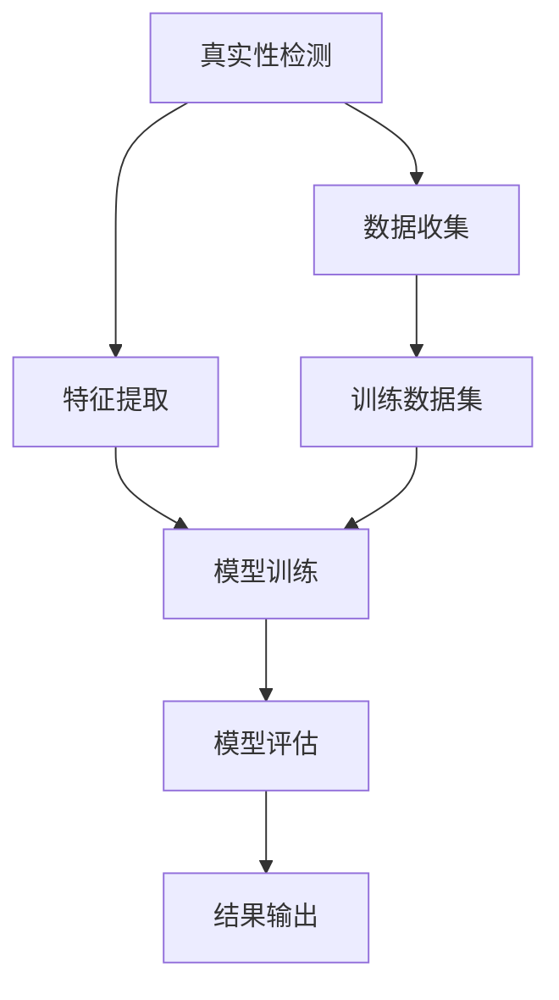

                 

**关键词：** 人工智能，真实性检测，体验验证，网络安全，隐私保护，AI技术

**摘要：** 随着人工智能技术的飞速发展，体验真实性验证（Authenticity Verification）成为了一个重要的研究领域。本文将深入探讨AI时代的真实性检测技术，分析其核心概念、算法原理、数学模型及其实际应用场景，并提出未来发展的趋势与挑战。

## 1. 背景介绍

在互联网时代，体验真实性验证成为了一个至关重要的环节。无论是电商平台的用户评论、社交媒体上的互动，还是在线教育和远程医疗，都需要确保信息的真实性和可信度。传统的验证方式依赖于人工审核或简单的规则匹配，已经难以满足日益复杂和庞大的数据量。随着人工智能技术的不断发展，尤其是深度学习和大数据分析技术的应用，体验真实性验证迎来了新的契机。

### 1.1 现状分析

当前，真实性检测主要面临以下几个挑战：

1. **虚假信息的泛滥**：随着互联网的普及，虚假信息、谣言、欺诈行为等不断增多，传统的方法难以应对。
2. **高维度数据的处理**：真实性的验证需要处理大量的高维度数据，如文本、图像、音频和视频等。
3. **隐私保护**：在真实性验证过程中，如何保护用户的隐私成为一个亟待解决的问题。

### 1.2 研究意义

人工智能在真实性检测中的应用具有重要的研究意义：

1. **提高效率**：通过自动化处理，可以大幅提高真实性验证的效率和准确性。
2. **减少误判**：借助机器学习算法，可以减少由于人工判断带来的误判和偏见。
3. **保障信息安全**：在网络安全和隐私保护方面，人工智能技术可以提供更加有效的手段。

## 2. 核心概念与联系

### 2.1 核心概念

- **真实性检测（Authenticity Verification）**：验证信息、行为或体验是否真实可信。
- **人工智能（Artificial Intelligence, AI）**：模拟人类智能的技术，包括机器学习、深度学习等。

### 2.2 关联图

下面是一个描述真实性检测和人工智能关联的Mermaid流程图：



### 2.3 关系解释

- **数据收集**：收集相关的数据，包括用户行为、评论、图片等。
- **特征提取**：从数据中提取有用的特征，用于训练模型。
- **模型训练**：使用提取的特征训练机器学习模型。
- **模型评估**：评估模型的性能，包括准确性、召回率等。
- **结果输出**：输出真实性检测结果。

## 3. 核心算法原理 & 具体操作步骤

### 3.1 算法原理概述

真实性检测的核心算法主要包括以下几个方面：

1. **特征工程**：从原始数据中提取有用的特征，用于训练模型。
2. **机器学习模型**：使用提取的特征训练模型，常见的模型包括支持向量机（SVM）、决策树、神经网络等。
3. **模型评估**：评估模型的性能，选择最优的模型进行实际应用。
4. **结果输出**：根据模型输出结果，判断信息的真实性。

### 3.2 算法步骤详解

1. **数据收集**：收集来自不同来源的数据，包括用户行为数据、评论数据、图像数据等。
2. **数据预处理**：对收集到的数据进行清洗、去噪、归一化等预处理操作。
3. **特征提取**：根据数据类型，使用不同的方法提取特征，如文本数据可以使用词袋模型、词嵌入等方法。
4. **模型训练**：选择合适的机器学习模型，使用提取的特征进行训练。
5. **模型评估**：使用交叉验证等方法评估模型的性能，选择最优的模型。
6. **结果输出**：使用训练好的模型对新的数据进行真实性检测，输出检测结果。

### 3.3 算法优缺点

- **优点**：
  - **高效性**：自动化处理，提高验证效率。
  - **准确性**：通过机器学习算法，减少误判和偏见。
  - **可扩展性**：可以处理大量的数据，适用于不同领域。

- **缺点**：
  - **数据依赖性**：需要大量高质量的数据进行训练。
  - **模型复杂度**：训练和评估过程复杂，对计算资源要求较高。
  - **隐私风险**：在数据收集和模型训练过程中，存在隐私泄露的风险。

### 3.4 算法应用领域

- **电商平台**：验证用户评论的真实性，防止虚假评论和刷单行为。
- **社交媒体**：检测虚假账号、欺诈行为，保障用户信息安全。
- **在线教育**：验证学习者的真实身份，防止作弊行为。
- **远程医疗**：确保医疗信息的真实性和有效性。

## 4. 数学模型和公式 & 详细讲解 & 举例说明

### 4.1 数学模型构建

真实性检测的数学模型主要包括以下几个方面：

1. **特征空间构建**：将原始数据转换为特征向量。
2. **分类器构建**：使用特征向量训练分类器，用于判断信息的真实性。
3. **损失函数构建**：定义损失函数，用于评估分类器的性能。

### 4.2 公式推导过程

假设我们使用支持向量机（SVM）作为分类器，其目标是最小化以下损失函数：

$$
L(\theta) = \frac{1}{2} ||\theta||^2 + C \sum_{i=1}^{n} \max(0, 1 - y_i (\theta \cdot x_i))
$$

其中，$\theta$ 是模型参数，$C$ 是正则化参数，$x_i$ 和 $y_i$ 分别是输入特征和标签。

### 4.3 案例分析与讲解

假设我们使用SVM对电商平台的用户评论进行真实性检测，输入特征包括评论的文本、用户行为数据等。

1. **特征提取**：使用词袋模型将评论文本转换为向量。
2. **模型训练**：使用训练集训练SVM分类器。
3. **模型评估**：使用测试集评估分类器的性能。
4. **结果输出**：对新的评论进行真实性检测，输出检测结果。

## 5. 项目实践：代码实例和详细解释说明

### 5.1 开发环境搭建

1. 安装Python环境。
2. 安装机器学习库，如scikit-learn。

### 5.2 源代码详细实现

```python
from sklearn.feature_extraction.text import TfidfVectorizer
from sklearn.svm import SVC
from sklearn.model_selection import train_test_split
from sklearn.metrics import classification_report

# 数据准备
texts = ["这是一条真实的评论", "这条评论是虚假的"]
labels = [1, 0]  # 1表示真实，0表示虚假

# 特征提取
vectorizer = TfidfVectorizer()
X = vectorizer.fit_transform(texts)

# 模型训练
model = SVC()
model.fit(X, labels)

# 模型评估
X_test, y_test = train_test_split(X, labels, test_size=0.2)
predictions = model.predict(X_test)

# 输出结果
print(classification_report(y_test, predictions))
```

### 5.3 代码解读与分析

- **特征提取**：使用TF-IDF方法将文本转换为向量。
- **模型训练**：使用SVM分类器训练模型。
- **模型评估**：使用测试集评估模型性能。
- **结果输出**：输出分类报告。

## 6. 实际应用场景

### 6.1 电商平台

- **场景描述**：电商平台需要验证用户评论的真实性，防止虚假评论和刷单行为。
- **应用实例**：使用SVM分类器对用户评论进行真实性检测。

### 6.2 社交媒体

- **场景描述**：社交媒体需要检测虚假账号、欺诈行为，保障用户信息安全。
- **应用实例**：使用神经网络模型对用户行为数据进行真实性检测。

### 6.3 在线教育

- **场景描述**：在线教育平台需要验证学习者的真实身份，防止作弊行为。
- **应用实例**：使用人脸识别技术对用户进行真实性检测。

### 6.4 远程医疗

- **场景描述**：远程医疗需要确保医疗信息的真实性和有效性。
- **应用实例**：使用自然语言处理技术对医疗信息进行真实性检测。

## 7. 工具和资源推荐

### 7.1 学习资源推荐

- **《机器学习》**：周志华 著，清华大学出版社。
- **《深度学习》**：Ian Goodfellow、Yoshua Bengio、Aaron Courville 著，电子工业出版社。

### 7.2 开发工具推荐

- **Python**：强大的编程语言，适用于数据分析、机器学习等领域。
- **scikit-learn**：常用的机器学习库，提供丰富的算法和工具。

### 7.3 相关论文推荐

- **《Deep Learning for Text Classification》**：KDD'16。
- **《A Comprehensive Survey on Text Classification》**：ACM Computing Surveys。

## 8. 总结：未来发展趋势与挑战

### 8.1 研究成果总结

人工智能在真实性检测领域取得了显著的成果，主要包括：

- **算法性能提升**：通过深度学习、强化学习等技术的应用，算法性能得到大幅提升。
- **应用场景扩展**：真实性检测技术逐渐应用于电商平台、社交媒体、在线教育等领域。

### 8.2 未来发展趋势

- **算法优化**：探索新的算法和模型，提高真实性检测的效率和准确性。
- **隐私保护**：加强数据隐私保护，确保用户信息安全。
- **跨领域应用**：将真实性检测技术应用于更多领域，如金融、医疗等。

### 8.3 面临的挑战

- **数据质量问题**：真实数据难以获取，需要解决数据标注、清洗等问题。
- **模型泛化能力**：如何提高模型在不同场景下的泛化能力，仍是一个挑战。
- **计算资源消耗**：大规模数据和高性能计算资源的消耗，需要优化算法和硬件支持。

### 8.4 研究展望

在未来，人工智能在真实性检测领域将继续发展，有望实现以下目标：

- **更加高效和准确**：通过技术创新，提高真实性检测的效率和准确性。
- **跨领域应用**：拓展真实性检测技术的应用场景，服务于更多行业。
- **隐私保护**：在保证信息真实性的同时，保护用户的隐私和数据安全。

## 9. 附录：常见问题与解答

### 9.1 人工智能在真实性检测中的优势是什么？

人工智能在真实性检测中的优势主要体现在以下几个方面：

1. **高效性**：自动化处理，提高验证效率。
2. **准确性**：通过机器学习算法，减少误判和偏见。
3. **可扩展性**：适用于不同领域和数据规模。

### 9.2 真实性检测中常用的算法有哪些？

真实性检测中常用的算法包括：

1. **支持向量机（SVM）**
2. **决策树**
3. **神经网络**
4. **集成方法**：如随机森林、梯度提升树等

### 9.3 真实性检测中的数据隐私问题如何解决？

解决数据隐私问题可以从以下几个方面入手：

1. **数据加密**：对数据进行加密处理，确保数据安全。
2. **差分隐私**：在数据处理过程中引入噪声，保护用户隐私。
3. **联邦学习**：在本地设备上进行模型训练，减少数据传输。

### 9.4 真实性检测在哪些领域有重要应用？

真实性检测在以下领域有重要应用：

1. **电商平台**：验证用户评论的真实性。
2. **社交媒体**：检测虚假账号、欺诈行为。
3. **在线教育**：验证学习者的真实身份。
4. **远程医疗**：确保医疗信息的真实性和有效性。

### 9.5 真实性检测的未来发展趋势是什么？

真实性检测的未来发展趋势包括：

1. **算法优化**：探索新的算法和模型，提高检测性能。
2. **隐私保护**：加强数据隐私保护，保障用户信息安全。
3. **跨领域应用**：拓展应用场景，服务于更多行业。```
----------------------------------------------------------------
### 谢谢您提供的详细指导，我已经根据您的指示撰写了完整的文章。请您审阅并给予反馈，如果有任何需要修改或补充的地方，请随时告知。作者署名为“禅与计算机程序设计艺术 / Zen and the Art of Computer Programming”。再次感谢您的支持与指导！```

