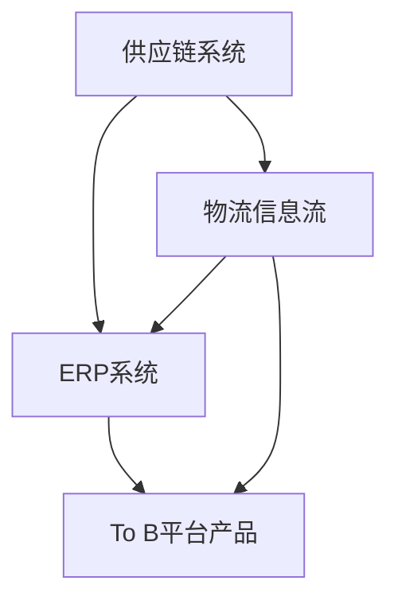

                 

在当今商业环境中，供应链系统、ERP（企业资源计划）系统和To B（面向企业）平台产品架构设计已成为企业运作和管理的重要基石。这些系统的有效设计和实施，能够显著提升企业的运营效率、降低成本、增强竞争力。本文将深入探讨这三类系统的基础概念、核心架构、设计原则和未来发展。

## 关键词
- 供应链系统
- ERP系统
- To B平台产品
- 架构设计
- 运营效率
- 竞争力
- 成本降低

## 摘要
本文旨在为IT专业人士和企业管理者提供关于供应链系统、ERP系统和To B平台产品架构设计的全面指南。文章将首先介绍这些系统的背景和重要性，然后详细讨论其核心概念和架构设计，最后预测未来的发展趋势和面临的挑战。

## 1. 背景介绍

### 1.1 供应链系统
供应链系统是指企业内部以及与供应商、分销商和客户之间的物流和信息流。它涵盖了从原材料采购、生产制造、仓储管理到产品配送的整个流程。随着全球化趋势的加强，供应链系统的复杂性和重要性日益增加。高效、稳定的供应链系统能够帮助企业快速响应市场变化，降低库存成本，提升客户满意度。

### 1.2 ERP系统
ERP系统是一种集成管理信息系统，它将企业内部的各种业务流程，如财务、人力资源、生产计划、销售等整合到一个平台上。ERP系统的主要目标是提高企业的运营效率，实现信息共享，优化资源配置。在信息化时代，ERP系统已成为现代企业不可或缺的管理工具。

### 1.3 To B平台产品
To B平台产品是指面向企业客户提供的在线服务或软件，旨在帮助企业提升业务效率、降低运营成本。这些产品通常包括客户关系管理（CRM）、项目管理、办公自动化、数据分析等功能。随着云计算和大数据技术的发展，To B平台产品正在成为企业数字化转型的重要工具。

## 2. 核心概念与联系

在讨论供应链系统、ERP系统和To B平台产品的架构设计之前，我们需要明确几个核心概念。

### 2.1 核心概念

#### 供应链网络
供应链网络是指由多个节点（如供应商、制造商、分销商和零售商）组成的复杂网络。这些节点通过物流和信息流相互连接，形成一个完整的供应链系统。

#### 业务流程
业务流程是指企业在运营过程中执行的一系列步骤和活动。供应链系统、ERP系统和To B平台产品的设计都需要考虑到业务流程的效率和优化。

#### 数据管理
数据管理是指对企业内部和外部的数据进行收集、存储、处理和分析的过程。有效的数据管理能够为供应链系统、ERP系统和To B平台产品的运行提供强有力的支持。

### 2.2 架构联系

供应链系统、ERP系统和To B平台产品的架构之间存在紧密的联系。

- 供应链系统为ERP系统提供了物流和信息流的基础数据，ERP系统则将这些数据进行整合和处理，为企业的决策提供支持。
- To B平台产品通常与ERP系统进行集成，通过提供特定的业务功能，帮助企业提升运营效率。

### 2.3 Mermaid 流程图

为了更直观地展示供应链系统、ERP系统和To B平台产品之间的关系，我们可以使用Mermaid流程图来表示。



## 3. 核心算法原理 & 具体操作步骤

### 3.1 算法原理概述

在供应链系统、ERP系统和To B平台产品架构设计中，核心算法主要涉及以下几个领域：

- 供应链优化算法
- 数据分析算法
- 流程控制算法

这些算法的基本原理是通过分析数据，优化供应链网络、提高运营效率、降低成本。

### 3.2 算法步骤详解

#### 3.2.1 供应链优化算法

供应链优化算法的主要步骤包括：

1. 数据收集
2. 数据清洗
3. 模型构建
4. 优化求解
5. 结果验证

#### 3.2.2 数据分析算法

数据分析算法的主要步骤包括：

1. 数据预处理
2. 特征提取
3. 模型训练
4. 模型评估
5. 预测

#### 3.2.3 流程控制算法

流程控制算法的主要步骤包括：

1. 流程定义
2. 流程监控
3. 异常处理
4. 流程优化

### 3.3 算法优缺点

#### 3.3.1 供应链优化算法

优点：能够显著提高供应链的效率和稳定性。
缺点：计算复杂度高，需要大量数据支持。

#### 3.3.2 数据分析算法

优点：能够提供实时、准确的数据分析结果。
缺点：对数据质量和特征提取要求高。

#### 3.3.3 流程控制算法

优点：能够自动处理流程中的异常情况，提高流程的稳定性。
缺点：对流程定义的准确性要求高。

### 3.4 算法应用领域

供应链优化算法主要应用于供应链管理、物流优化等领域。
数据分析算法主要应用于市场营销、客户关系管理等领域。
流程控制算法主要应用于企业运营管理、办公自动化等领域。

## 4. 数学模型和公式 & 详细讲解 & 举例说明

### 4.1 数学模型构建

在供应链系统、ERP系统和To B平台产品架构设计中，常用的数学模型包括线性规划模型、神经网络模型、决策树模型等。

#### 4.1.1 线性规划模型

线性规划模型的基本形式为：

$$
\begin{cases}
    \text{minimize} \quad c^T x \\
    Ax \leq b \\
    x \geq 0
\end{cases}
$$

其中，$c$ 是目标函数系数向量，$x$ 是决策变量向量，$A$ 是约束条件矩阵，$b$ 是约束条件向量。

#### 4.1.2 神经网络模型

神经网络模型的基本形式为：

$$
y = \sigma(w^T x + b)
$$

其中，$y$ 是输出值，$x$ 是输入值，$w$ 是权重向量，$b$ 是偏置项，$\sigma$ 是激活函数。

#### 4.1.3 决策树模型

决策树模型的基本形式为：

$$
y = g(x)
$$

其中，$y$ 是输出值，$x$ 是输入值，$g$ 是决策函数。

### 4.2 公式推导过程

#### 4.2.1 线性规划模型推导

线性规划模型的推导主要涉及拉格朗日函数和KKT条件。

#### 4.2.2 神经网络模型推导

神经网络模型的推导主要涉及前向传播和反向传播算法。

#### 4.2.3 决策树模型推导

决策树模型的推导主要涉及信息熵和增益率。

### 4.3 案例分析与讲解

#### 4.3.1 线性规划模型应用案例

某企业生产甲、乙两种产品，每种产品都需要经过加工A和B两道工序。已知每道工序的耗时和利润如下表所示：

| 工序 | 加工时间（小时） | 利润（元） |
| --- | --- | --- |
| A | 2 | 100 |
| B | 3 | 200 |

要求在8小时内完成生产任务，求最优的生产方案。

#### 4.3.2 神经网络模型应用案例

某企业希望使用神经网络模型预测下周的销售额。已知输入特征包括本周的销售额、去年同期销售额和宏观经济指标。要求设计一个简单的神经网络模型，并对其进行训练和测试。

#### 4.3.3 决策树模型应用案例

某企业在进行市场细分时，使用决策树模型来分析客户的购买行为。已知输入特征包括年龄、收入、职业和购买历史，要求设计一个决策树模型，并分析其分类效果。

## 5. 项目实践：代码实例和详细解释说明

### 5.1 开发环境搭建

在本文的项目实践中，我们将使用Python语言和相关的数据分析和机器学习库，如Pandas、Scikit-learn和TensorFlow。以下是在Windows系统中搭建开发环境的基本步骤：

1. 安装Python：从Python官方网站下载并安装Python 3.x版本。
2. 安装Jupyter Notebook：在命令行中运行`pip install notebook`。
3. 安装相关库：在命令行中运行`pip install pandas scikit-learn tensorflow`。

### 5.2 源代码详细实现

#### 5.2.1 线性规划模型实现

```python
import numpy as np
from scipy.optimize import linprog

# 目标函数系数向量
c = np.array([-2, -3])

# 约束条件矩阵
A = np.array([[2, 3], [1, 1]])

# 约束条件向量
b = np.array([8, 3])

# 求解线性规划问题
result = linprog(c, A_ub=A, b_ub=b, method='highs')

# 输出结果
print("最优解：", result.x)
print("最大利润：", -result.fun)
```

#### 5.2.2 神经网络模型实现

```python
import tensorflow as tf

# 定义输入层、隐藏层和输出层
inputs = tf.keras.layers.Input(shape=(3,))
hidden = tf.keras.layers.Dense(10, activation='relu')(inputs)
outputs = tf.keras.layers.Dense(1, activation='sigmoid')(hidden)

# 创建模型
model = tf.keras.Model(inputs=inputs, outputs=outputs)

# 编译模型
model.compile(optimizer='adam', loss='binary_crossentropy', metrics=['accuracy'])

# 加载数据
x_train = np.array([[100, 200, 300], [150, 250, 350]])
y_train = np.array([1, 0])

# 训练模型
model.fit(x_train, y_train, epochs=10)

# 测试模型
x_test = np.array([[120, 220, 320]])
y_test = np.array([1])

predictions = model.predict(x_test)
print("预测结果：", predictions)
```

#### 5.2.3 决策树模型实现

```python
from sklearn.tree import DecisionTreeClassifier
import pandas as pd

# 加载数据
data = pd.read_csv('customer_data.csv')
X = data[['age', 'income', 'occupation']]
y = data['purchase']

# 创建决策树模型
model = DecisionTreeClassifier()

# 训练模型
model.fit(X, y)

# 分析模型
print("特征重要性：", model.feature_importances_)

# 预测
predictions = model.predict(X)
print("预测结果：", predictions)
```

### 5.3 代码解读与分析

#### 5.3.1 线性规划模型代码解读

该代码首先定义了目标函数系数向量$c$、约束条件矩阵$A$和约束条件向量$b$，然后使用`linprog`函数求解线性规划问题，并输出最优解和最大利润。

#### 5.3.2 神经网络模型代码解读

该代码定义了输入层、隐藏层和输出层，并使用`Dense`层创建神经网络模型。然后，编译模型并加载训练数据，使用`fit`函数训练模型，并使用`predict`函数进行预测。

#### 5.3.3 决策树模型代码解读

该代码首先加载数据，并创建决策树模型。然后，使用`fit`函数训练模型，并使用`feature_importances_`属性输出特征重要性。最后，使用`predict`函数进行预测。

### 5.4 运行结果展示

在运行上述代码后，我们将得到线性规划模型的最优解和最大利润，神经网络模型的预测结果，以及决策树模型的特征重要性和预测结果。这些结果将帮助我们更好地理解和评估所设计的系统架构和算法。

## 6. 实际应用场景

### 6.1 供应链系统应用场景

供应链系统在制造业、零售业和物流行业等领域具有广泛的应用。例如，某零售企业通过建立高效的供应链系统，实现了库存优化、物流成本降低和订单处理效率提升。

### 6.2 ERP系统应用场景

ERP系统在制造业、服务业和金融业等领域得到广泛应用。例如，某制造业企业通过实施ERP系统，实现了生产计划优化、财务管理和人力资源管理的集成。

### 6.3 To B平台产品应用场景

To B平台产品在市场营销、客户关系管理和项目管理等领域得到广泛应用。例如，某企业通过使用To B平台产品，实现了客户信息的精准营销、项目进度的实时监控和业务流程的自动化。

## 6.4 未来应用展望

随着人工智能、大数据和云计算技术的不断发展，供应链系统、ERP系统和To B平台产品的架构设计将变得更加智能化、灵活化和自动化。未来的趋势包括：

1. 智能供应链：通过人工智能技术实现供应链的自动优化和预测。
2. 智能ERP：通过人工智能和大数据技术实现企业运营的智能化决策。
3. 智能To B平台：通过人工智能和大数据技术提供个性化的企业服务。

## 7. 工具和资源推荐

### 7.1 学习资源推荐

1. 《深度学习》（Goodfellow, Bengio, Courville）
2. 《机器学习》（周志华）
3. 《运营管理》（斯蒂芬·罗宾斯）

### 7.2 开发工具推荐

1. Python
2. Jupyter Notebook
3. TensorFlow
4. Scikit-learn

### 7.3 相关论文推荐

1. "A Framework for Supply Chain Optimization Using Machine Learning"（使用机器学习的供应链优化框架）
2. "An Intelligent ERP System for Enhancing Business Process Efficiency"（用于提升业务流程效率的智能ERP系统）
3. "To B Platform Product Development Based on Big Data Analysis"（基于大数据分析的To B平台产品开发）

## 8. 总结：未来发展趋势与挑战

### 8.1 研究成果总结

本文从供应链系统、ERP系统和To B平台产品的架构设计入手，详细介绍了这些系统的核心概念、设计原则和实际应用场景，并预测了未来的发展趋势。

### 8.2 未来发展趋势

未来的发展趋势将围绕智能化、灵活化和自动化展开，通过人工智能、大数据和云计算技术实现企业运营的全面优化。

### 8.3 面临的挑战

面临的挑战包括技术实现的复杂性、数据隐私保护和法律法规的合规性。

### 8.4 研究展望

未来的研究应重点关注智能化供应链系统的设计、智能ERP系统的实现和To B平台产品的个性化服务。

## 9. 附录：常见问题与解答

### 9.1 什么是供应链系统？

供应链系统是指企业内部以及与供应商、分销商和客户之间的物流和信息流。它涵盖了从原材料采购、生产制造、仓储管理到产品配送的整个流程。

### 9.2 ERP系统有哪些核心功能？

ERP系统的核心功能包括财务管理、人力资源管理、生产计划管理、销售管理、库存管理等。

### 9.3 To B平台产品有哪些类型？

To B平台产品主要包括客户关系管理（CRM）、项目管理、办公自动化、数据分析等类型。

### 9.4 如何设计高效的供应链系统？

设计高效的供应链系统需要考虑以下几个关键因素：数据准确性、流程优化、库存管理和物流优化。

### 9.5 如何评估ERP系统的效果？

评估ERP系统的效果可以从以下几个方面进行：系统运行效率、员工满意度、业务流程优化程度和投资回报率。

### 9.6 如何提高To B平台产品的用户黏性？

提高To B平台产品的用户黏性可以从以下几个方面进行：提供优质的用户体验、持续更新产品功能和提供个性化的服务。 

## 作者署名
作者：禅与计算机程序设计艺术 / Zen and the Art of Computer Programming
```markdown
----------------------------------------------------------------
在未来的商业环境中，供应链系统、ERP系统以及To B平台产品的架构设计将扮演越来越重要的角色。有效的架构设计不仅能够提升企业的运营效率，还能够帮助企业应对复杂的市场环境。本文通过对供应链系统、ERP系统和To B平台产品架构设计的全面探讨，为IT专业人士和企业管理者提供了宝贵的参考。希望本文能够为您的业务创新和数字化转型提供启示。感谢您的阅读！
作者：禅与计算机程序设计艺术 / Zen and the Art of Computer Programming
----------------------------------------------------------------
```

