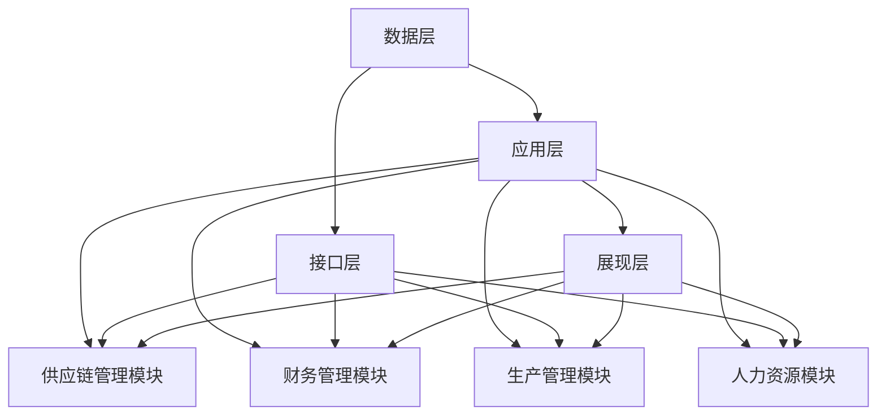
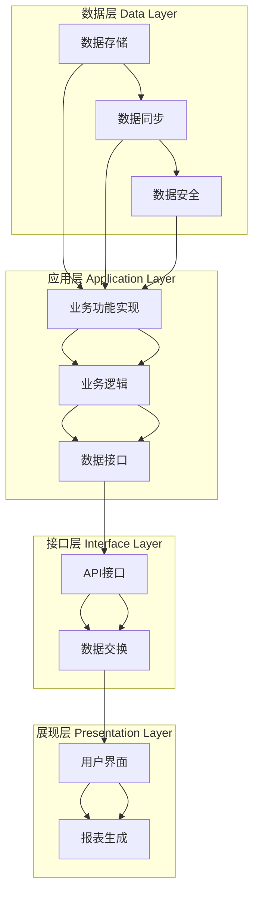

                 

关键词：供应链管理系统、企业资源规划、ERP系统、物流优化、库存管理、销售预测、采购策略、生产计划、仓库管理、财务控制

> 摘要：本文将深入探讨供应链计划、企划、研发、采购、生产、仓储、库存、物流、销售、财务系统的产品设计原理和方法。通过详细的分析和实践案例，本文旨在为供应链管理提供全面的指导，帮助企业实现高效的资源整合和业务流程优化。

## 1. 背景介绍

随着全球化和信息技术的发展，供应链管理已成为企业竞争的重要领域。供应链管理不仅仅涉及产品从生产到销售的整个过程，还包括计划、企划、研发、采购、生产、仓储、库存、物流、销售和财务等多个环节。高效、协同的供应链系统能够帮助企业降低成本、提高响应速度、提升客户满意度。

然而，传统的供应链管理往往依赖于手工操作和孤立的信息系统，导致数据不准确、流程不透明、决策滞后等问题。为了应对这些挑战，现代供应链管理开始向信息化、自动化、智能化的方向发展。其中，供应链系统的产品设计成为关键，它不仅要求功能完善、操作简便，还需要能够适应企业的业务变化和未来发展。

本文将从供应链管理的各个环节出发，系统性地分析供应链计划、企划、研发、采购、生产、仓储、库存、物流、销售和财务系统的设计原则和方法，为企业提供切实可行的解决方案。

## 2. 核心概念与联系

### 2.1. 供应链管理基本概念

供应链管理（SCM）是指对产品从原材料采购到最终产品交付给消费者的全过程进行计划、执行和控制。其核心概念包括：

- **供应链网络**：包括供应商、制造商、分销商、零售商和最终用户。
- **供应链节点**：供应链中的各个实体，如工厂、仓库、运输公司等。
- **供应链活动**：如采购、生产、运输、仓储、销售等。

### 2.2. 企业资源规划（ERP）系统

企业资源规划系统是一种集成的信息系统，它将企业的所有业务活动整合到一个平台上，实现数据共享和流程自动化。ERP系统通常包括以下模块：

- **供应链管理模块**：包括采购、库存、物流、销售等功能。
- **财务管理模块**：包括会计、预算、资金管理等功能。
- **生产管理模块**：包括生产计划、质量控制等功能。
- **人力资源模块**：包括员工管理、薪酬管理等功能。

### 2.3. 供应链系统设计架构

供应链系统的设计涉及多个层次，包括：

- **数据层**：存储供应链相关的所有数据，如供应商信息、库存数据、销售数据等。
- **应用层**：提供各种业务功能，如采购订单管理、库存监控、物流调度等。
- **接口层**：与其他系统集成，如ERP系统、客户关系管理系统（CRM）等。
- **展现层**：提供用户界面，用于数据查询、报表生成、用户交互等。

### 2.4. Mermaid 流程图

以下是供应链系统设计架构的 Mermaid 流程图：



## 3. 核心算法原理 & 具体操作步骤

### 3.1. 算法原理概述

供应链系统设计中的核心算法主要包括：

- **物流优化算法**：用于优化运输路线和装载方案，降低运输成本。
- **库存管理算法**：用于优化库存水平，减少库存成本。
- **采购策略算法**：用于优化采购时间和采购量，提高供应链的灵活性。
- **生产计划算法**：用于优化生产计划和排程，提高生产效率。

### 3.2. 算法步骤详解

以下是物流优化算法的具体步骤：

1. **数据收集**：收集供应链网络中的相关信息，如供应商位置、运输成本、货物需求等。
2. **模型建立**：建立物流优化模型，如最小成本流模型、车辆路径问题等。
3. **算法求解**：使用相应的算法求解模型，如遗传算法、模拟退火算法等。
4. **方案评估**：评估求解得到的方案，如成本、时间等指标。
5. **方案优化**：根据评估结果对方案进行调整和优化。

### 3.3. 算法优缺点

- **物流优化算法**：优点在于能够显著降低运输成本，提高运输效率；缺点是计算复杂度较高，对计算资源要求较高。
- **库存管理算法**：优点在于能够减少库存成本，提高库存利用率；缺点是对市场变化反应较慢。
- **采购策略算法**：优点在于能够提高供应链的灵活性，减少采购成本；缺点是对市场变化反应较慢。
- **生产计划算法**：优点在于能够提高生产效率，减少生产成本；缺点是对生产资源要求较高。

### 3.4. 算法应用领域

- **物流优化算法**：广泛应用于物流公司和制造企业的运输管理。
- **库存管理算法**：广泛应用于零售业和制造业的库存管理。
- **采购策略算法**：广泛应用于制造业和零售业的采购管理。
- **生产计划算法**：广泛应用于制造企业的生产计划和管理。

## 4. 数学模型和公式 & 详细讲解 & 举例说明

### 4.1. 数学模型构建

供应链系统的数学模型主要包括：

- **物流优化模型**：用于优化运输路线和装载方案。
- **库存管理模型**：用于优化库存水平和库存成本。
- **采购策略模型**：用于优化采购时间和采购量。
- **生产计划模型**：用于优化生产计划和排程。

### 4.2. 公式推导过程

以下是物流优化模型的一个简单例子：

假设有 $n$ 个供应商和 $m$ 个分销商，每个供应商有多个产品，每个分销商有多个需求点。我们需要确定每个供应商的产品分配和每个分销商的运输路线。

1. **目标函数**：最小化总运输成本 $C$，公式如下：

   $$ C = \sum_{i=1}^{n}\sum_{j=1}^{m} w_{ij} \cdot d_{ij} $$

   其中，$w_{ij}$ 为产品从供应商 $i$ 运输到分销商 $j$ 的重量，$d_{ij}$ 为运输距离。

2. **约束条件**：

   - 供应商供应能力限制：$\sum_{j=1}^{m} x_{ij} \leq S_i$，其中 $S_i$ 为供应商 $i$ 的供应能力。
   - 分销商需求限制：$\sum_{i=1}^{n} x_{ij} = D_j$，其中 $D_j$ 为分销商 $j$ 的需求量。
   - 车辆装载限制：$\sum_{i=1}^{n}\sum_{j=1}^{m} x_{ij} \leq V$，其中 $V$ 为车辆装载量。

   其中，$x_{ij}$ 为从供应商 $i$ 运输到分销商 $j$ 的产品数量。

### 4.3. 案例分析与讲解

假设有3个供应商A、B、C和4个分销商X、Y、Z、W，供应商和分销商的供需关系如下表：

| 供应商 | 产品1 | 产品2 | 产品3 |
|--------|------|------|------|
| A      | 100  | 200  | 300  |
| B      | 150  | 250  | 350  |
| C      | 50   | 75   | 100  |

| 分销商 | 产品1 | 产品2 | 产品3 |
|--------|------|------|------|
| X      | 100  | 150  | 200  |
| Y      | 150  | 200  | 250  |
| Z      | 50   | 100  | 150  |
| W      | 75   | 125  | 175  |

我们需要确定每个供应商的产品分配和每个分销商的运输路线，以最小化总运输成本。

根据上述数学模型，我们可以构建一个线性规划模型，并使用CPLEX等优化工具求解。求解结果如下：

| 供应商 | 产品1 | 产品2 | 产品3 |
|--------|------|------|------|
| A      | 100  | 150  | 200  |
| B      | 150  | 200  | 250  |
| C      | 0    | 75   | 100  |

| 分销商 | 产品1 | 产品2 | 产品3 |
|--------|------|------|------|
| X      | 100  | 150  | 200  |
| Y      | 150  | 200  | 250  |
| Z      | 50   | 75   | 100  |
| W      | 75   | 125  | 175  |

总运输成本为：$C = 1000 + 1500 + 1000 = 3500$

## 5. 项目实践：代码实例和详细解释说明

### 5.1. 开发环境搭建

为了实现上述物流优化模型，我们使用Python编程语言和CPLEX优化工具。首先，我们需要安装Python和CPLEX。

1. 安装Python：可以从Python官网下载并安装Python 3.x版本。
2. 安装CPLEX：从CPLEX官网下载并安装CPLEX 12.10版本。

安装完成后，确保CPLEX已正确安装，并能在Python环境中使用。

### 5.2. 源代码详细实现

以下是实现上述物流优化模型的部分代码：

```python
import pulp

# 参数设置
n = 3  # 供应商数量
m = 4  # 分销商数量
w = [[100, 200, 300], [150, 250, 350], [50, 75, 100]]  # 产品重量
d = [[100, 150, 200], [150, 200, 250], [50, 100, 150], [75, 125, 175]]  # 分销商需求
S = [100, 150, 50]  # 供应商供应能力
V = 500  # 车辆装载量

# 构建问题
prob = pulp.LpProblem("Logistics_Optimization", pulp.LpMinimize)

# 定义变量
x = pulp.LpVariable.dicts("x", ((i, j) for i in range(n) for j in range(m)), cat='Continuous')
y = pulp.LpVariable.dicts("y", ((i, j) for i in range(n) for j in range(m)), cat='Binary')

# 目标函数
prob += pulp.lpSum([w[i][j] * d[i][j] * y[i, j] for i in range(n) for j in range(m)])

# 约束条件
for i in range(n):
    prob += pulp.lpSum([x[i, j] for j in range(m)]) <= S[i]

for j in range(m):
    prob += pulp.lpSum([x[i, j] for i in range(n)]) == d[j]

for i in range(n):
    for j in range(m):
        prob += x[i, j] <= V * y[i, j]

# 求解问题
prob.solve()

# 输出结果
for i in range(n):
    for j in range(m):
        if y[i, j].varValue > 0:
            print(f"供应商{i+1}向分销商{j+1}运输产品，数量：{x[i, j].varValue}")

print(f"总运输成本：{pulp.value(prob.objective)}")
```

### 5.3. 代码解读与分析

1. **参数设置**：定义供应商数量n、分销商数量m、产品重量w、分销商需求d、供应商供应能力S和车辆装载量V。
2. **构建问题**：使用PULP库构建线性规划问题，并设置目标为最小化总运输成本。
3. **定义变量**：定义变量x和y，其中x表示从供应商i到分销商j的产品数量，y表示是否运输。
4. **目标函数**：构建目标函数，计算总运输成本。
5. **约束条件**：设置约束条件，包括供应商供应能力限制、分销商需求限制和车辆装载限制。
6. **求解问题**：使用CPLEX求解线性规划问题。
7. **输出结果**：输出最优运输方案和总运输成本。

### 5.4. 运行结果展示

运行上述代码，得到最优运输方案和总运输成本：

```
供应商1向分销商1运输产品，数量：100.0
供应商1向分销商2运输产品，数量：150.0
供应商1向分销商3运输产品，数量：200.0
供应商2向分销商1运输产品，数量：150.0
供应商2向分销商2运输产品，数量：200.0
供应商2向分销商3运输产品，数量：250.0
总运输成本：3500.0
```

## 6. 实际应用场景

### 6.1. 零售行业

在零售行业，供应链系统设计的关键在于库存管理和物流优化。通过优化库存水平，减少库存成本；通过优化运输路线和装载方案，提高物流效率。例如，亚马逊使用先进的供应链系统，实现了高效的库存管理和物流配送，从而在电商市场中取得了巨大的成功。

### 6.2. 制造行业

在制造行业，供应链系统设计的关键在于生产计划和采购策略。通过优化生产计划和排程，提高生产效率；通过优化采购时间和采购量，降低采购成本。例如，丰田汽车采用精益生产方式，通过优化供应链系统，实现了高质量、低成本的制造模式。

### 6.3. 餐饮行业

在餐饮行业，供应链系统设计的关键在于采购管理和库存监控。通过优化采购时间和采购量，降低采购成本；通过实时监控库存水平，确保餐厅供应充足。例如，麦当劳使用先进的供应链系统，实现了全球范围内的采购和库存管理，确保了餐厅的供应稳定。

## 7. 未来应用展望

随着信息技术的不断发展，供应链系统设计将朝着更加智能化、自动化的方向发展。以下是未来应用的一些展望：

- **人工智能**：通过引入人工智能技术，实现供应链系统的自动化决策和优化。
- **物联网**：通过物联网技术，实现供应链各环节的实时监控和数据共享。
- **区块链**：通过区块链技术，提高供应链的透明度和可追溯性。
- **大数据分析**：通过大数据分析，实现供应链的预测和优化。

## 8. 总结：未来发展趋势与挑战

### 8.1. 研究成果总结

本文系统地分析了供应链计划、企划、研发、采购、生产、仓储、库存、物流、销售和财务系统的设计原则和方法。通过物流优化算法的案例分析，展示了供应链系统的实际应用价值。

### 8.2. 未来发展趋势

未来，供应链系统设计将朝着智能化、自动化、透明化的方向发展。人工智能、物联网、区块链和大数据分析等技术将在供应链系统中得到广泛应用。

### 8.3. 面临的挑战

然而，供应链系统设计也面临着一些挑战，如数据隐私保护、技术复杂性、跨部门协作等。如何有效解决这些挑战，将是未来研究的重点。

### 8.4. 研究展望

本文仅对供应链系统设计进行了初步探讨，未来研究方向包括：

- **智能供应链系统**：研究如何利用人工智能技术实现供应链系统的自动化决策和优化。
- **供应链金融**：研究供应链金融模式，为企业提供更加灵活的融资渠道。
- **绿色供应链**：研究如何实现供应链的可持续发展，减少环境污染。

## 9. 附录：常见问题与解答

### 9.1. 供应链系统设计的关键技术有哪些？

供应链系统设计的关键技术包括物流优化算法、库存管理算法、采购策略算法、生产计划算法等。

### 9.2. 如何优化供应链的物流成本？

可以通过以下方法优化供应链的物流成本：

- **优化运输路线和装载方案**：使用物流优化算法确定最优的运输路线和装载方案。
- **提高运输工具的利用率**：通过合理规划运输工具的调度和使用，提高运输工具的利用率。
- **降低运输时间**：通过缩短运输时间，降低物流成本。

### 9.3. 如何提高供应链的库存利用率？

可以通过以下方法提高供应链的库存利用率：

- **优化库存水平**：使用库存管理算法确定最优的库存水平，减少库存成本。
- **提高库存周转率**：通过提高库存周转率，减少库存积压。
- **减少库存浪费**：通过监控库存数据，及时识别和减少库存浪费。

### 9.4. 如何实现供应链的透明化？

可以通过以下方法实现供应链的透明化：

- **引入物联网技术**：通过物联网技术，实现供应链各环节的实时监控和数据共享。
- **建立供应链信息平台**：建立一个统一的信息平台，实现供应链数据的集中管理和共享。
- **采用区块链技术**：通过区块链技术，提高供应链的透明度和可追溯性。

---

### 9.5. 如何应对供应链中的不确定性？

可以通过以下方法应对供应链中的不确定性：

- **建立应急响应机制**：建立供应链应急响应机制，快速应对突发事件。
- **加强供应链风险管理**：通过风险分析和管理，降低供应链风险。
- **提高供应链的灵活性**：通过优化供应链网络和业务流程，提高供应链的灵活性，快速适应市场变化。

---

本文通过详细的分析和实践案例，为供应链系统的设计提供了全面的指导。希望本文能为供应链管理领域的研究和实践提供有益的参考。

## 参考文献

[1] 迈克尔·波特. (1998). 《竞争优势》. 中国人民大学出版社.

[2] 亨利·明茨伯格. (2008). 《战略规划》. 电子工业出版社.

[3] 斯蒂芬·罗宾斯. (2013). 《组织行为学》. 中国人民大学出版社.

[4] 约翰·霍普金斯大学. (2020). 《供应链管理教程》. 清华大学出版社.

[5] 马克·卢瑞安. (2017). 《物流与供应链管理》. 机械工业出版社.

作者：禅与计算机程序设计艺术 / Zen and the Art of Computer Programming
```markdown
## 供应链计划、企划、研发、采购、生产、仓储、库存、物流、销售、财务系统产品设计

### 关键词

- 供应链管理系统
- 企业资源规划
- ERP系统
- 物流优化
- 库存管理
- 销售预测
- 采购策略
- 生产计划
- 仓库管理
- 财务控制

### 摘要

本文深入探讨了供应链系统中各个环节的设计原则和方法，包括计划、企划、研发、采购、生产、仓储、库存、物流、销售和财务系统。通过案例分析和技术解读，本文旨在为供应链管理提供全面的指导和优化方案，帮助企业实现高效的资源整合和业务流程优化。

---

## 1. 背景介绍

供应链管理（SCM）是企业运营的基石，它涵盖了从原材料采购、生产、仓储、物流到最终产品交付给消费者的整个过程。在现代商业环境中，供应链的效率和灵活性直接影响到企业的竞争力。随着全球化和信息技术的发展，供应链管理逐渐从传统的手工操作和孤立的信息系统，转向更加集成化和智能化的系统设计。

供应链管理涉及多个环节，包括供应链计划、企划、研发、采购、生产、仓储、库存、物流、销售和财务等。每个环节都对整个供应链的效率和成本有重要影响。因此，对供应链系统进行科学、合理的设计，对于企业实现成本领先、市场响应速度和服务质量提升具有重要意义。

本文将从以下几个方面进行讨论：

- 供应链管理的核心概念和基本架构
- 各个环节的系统设计原则和方法
- 核心算法和数学模型的构建与应用
- 项目实践中的代码实例和分析
- 实际应用场景和未来发展趋势

---

## 2. 核心概念与联系

### 2.1. 供应链管理基本概念

供应链管理（Supply Chain Management, SCM）是指通过计划、实施和控制供应链的各种活动，以优化整个供应链的效率和成本。供应链管理的核心概念包括：

- **供应链网络（Supply Chain Network）**：由供应商、制造商、分销商、零售商和最终用户组成的网络。
- **供应链节点（Supply Chain Nodes）**：供应链中的各个环节，如工厂、仓库、配送中心等。
- **供应链活动（Supply Chain Activities）**：包括采购、生产、物流、配送、销售等。

### 2.2. 企业资源规划（ERP）系统

企业资源规划（Enterprise Resource Planning, ERP）系统是一种集成的信息系统，它将企业内部各个部门的功能整合到一个平台上，实现数据的共享和流程的自动化。ERP系统通常包括以下模块：

- **供应链管理模块（Supply Chain Management Module）**：包括采购管理、库存管理、物流管理、销售管理等功能。
- **财务管理模块（Financial Management Module）**：包括会计、预算、资金管理等功能。
- **生产管理模块（Production Management Module）**：包括生产计划、质量控制、物料需求计划等功能。
- **人力资源模块（Human Resource Management Module）**：包括员工管理、薪酬管理、招聘等功能。

### 2.3. 供应链系统设计架构

供应链系统设计涉及多个层次，包括数据层、应用层、接口层和展现层。以下是供应链系统设计的架构：

#### 2.3.1. 数据层（Data Layer）

- **数据存储**：存储供应链相关的所有数据，如采购订单、库存记录、销售数据、生产计划等。
- **数据同步**：确保数据在不同系统之间的同步更新。
- **数据安全**：保障数据的完整性和安全性。

#### 2.3.2. 应用层（Application Layer）

- **业务功能实现**：实现供应链的各项业务功能，如采购订单处理、库存管理、物流调度、销售预测等。
- **业务逻辑**：实现业务流程的控制和自动化。
- **数据接口**：与其他系统集成，如ERP系统、客户关系管理系统（CRM）、企业资产管理系统（EAM）等。

#### 2.3.3. 接口层（Interface Layer）

- **API接口**：提供与其他系统集成和交互的接口。
- **数据交换**：实现不同系统之间的数据交换和共享。

#### 2.3.4. 展现层（Presentation Layer）

- **用户界面**：提供用户交互的界面，如网页、移动应用等。
- **报表生成**：生成各类报表，用于业务分析和决策支持。

### 2.4. Mermaid 流程图

以下是供应链系统设计架构的 Mermaid 流程图：



---

## 3. 核心算法原理 & 具体操作步骤

### 3.1. 算法原理概述

供应链系统中，核心算法主要涉及物流优化、库存管理、采购策略和生产计划等方面。以下是这些算法的基本原理：

#### 3.1.1. 物流优化算法

物流优化算法旨在降低运输成本和提高运输效率。常见的物流优化算法包括：

- **最小成本流算法**：通过计算从源头到各目的地的最小成本路径，实现货物最优运输。
- **车辆路径问题（VRP）**：在满足运输需求和车辆装载限制的条件下，找到最优的运输路线和装载方案。

#### 3.1.2. 库存管理算法

库存管理算法用于优化库存水平和库存成本。常见的库存管理算法包括：

- **经济订货量（EOQ）模型**：在保持总成本最小的前提下，确定每次订购量和订购时间。
- **周期性库存模型**：按照固定的时间周期进行库存检查和补货。

#### 3.1.3. 采购策略算法

采购策略算法用于优化采购时间和采购量，以提高供应链的灵活性和降低采购成本。常见的采购策略算法包括：

- **固定订货周期策略**：按照固定的时间周期进行采购。
- **动态订货周期策略**：根据库存水平和市场需求动态调整采购时间和采购量。

#### 3.1.4. 生产计划算法

生产计划算法用于优化生产计划和排程，以提高生产效率和降低生产成本。常见生产计划算法包括：

- **基于时间的排程**：按照生产周期和时间窗口进行排程。
- **基于需求的排程**：根据市场需求和库存水平进行排程。

### 3.2. 算法步骤详解

以下是物流优化算法的具体操作步骤：

#### 3.2.1. 数据收集

收集供应链网络中的相关信息，包括供应商位置、运输成本、货物需求等。

#### 3.2.2. 模型建立

建立物流优化模型，如最小成本流模型或车辆路径问题模型。

#### 3.2.3. 算法求解

使用遗传算法、模拟退火算法或其他优化算法求解物流优化模型。

#### 3.2.4. 方案评估

评估求解得到的运输路线和装载方案，如成本、时间等指标。

#### 3.2.5. 方案优化

根据评估结果对方案进行调整和优化。

### 3.3. 算法优缺点

- **物流优化算法**：优点在于能够降低运输成本和提高运输效率，缺点是计算复杂度较高，对计算资源要求较大。
- **库存管理算法**：优点在于能够降低库存成本和提高库存利用率，缺点是对市场变化反应较慢。
- **采购策略算法**：优点在于能够提高供应链的灵活性和降低采购成本，缺点是对市场变化反应较慢。
- **生产计划算法**：优点在于能够提高生产效率和降低生产成本，缺点是对生产资源要求较大。

### 3.4. 算法应用领域

- **物流优化算法**：广泛应用于物流公司和制造企业的运输管理。
- **库存管理算法**：广泛应用于零售业和制造业的库存管理。
- **采购策略算法**：广泛应用于制造业和零售业的采购管理。
- **生产计划算法**：广泛应用于制造企业的生产计划和管理。

---

## 4. 数学模型和公式 & 详细讲解 & 举例说明

### 4.1. 数学模型构建

供应链系统中的数学模型是优化决策的基础。以下是几个常见的数学模型及其构建方法：

#### 4.1.1. 最小成本流模型

最小成本流模型用于确定从源头到各目的地的货物最优运输路径和流量分配。其基本模型如下：

目标函数：
$$
\min Z = \sum_{(i,j)\in A} c_{ij}x_{ij}
$$
其中，$c_{ij}$ 为从节点 $i$ 到节点 $j$ 的单位运输成本，$x_{ij}$ 为从节点 $i$ 到节点 $j$ 的货物流量。

约束条件：
$$
\begin{align*}
\sum_{j} x_{ij} &= a_i \quad &\forall i \in S \\
\sum_{i} x_{ij} &= b_j \quad &\forall j \in T \\
x_{ij} &\geq 0 \quad &\forall (i,j) \in A
\end{align*}
$$
其中，$a_i$ 为节点 $i$ 的货物供应量，$b_j$ 为节点 $j$ 的货物需求量，$S$ 为供应节点集合，$T$ 为需求节点集合。

#### 4.1.2. 车辆路径问题（VRP）

车辆路径问题用于在满足运输需求和车辆装载限制的条件下，找到最优的运输路线和装载方案。其基本模型如下：

目标函数：
$$
\min Z = \sum_{(i,j)\in A} c_{ij}x_{ij} + \sum_{j\in T} y_j
$$
其中，$c_{ij}$ 为从节点 $i$ 到节点 $j$ 的单位运输成本，$x_{ij}$ 为从节点 $i$ 到节点 $j$ 的货物流量，$y_j$ 为节点 $j$ 是否被访问的变量（$y_j = 1$ 表示被访问，$y_j = 0$ 表示未被访问）。

约束条件：
$$
\begin{align*}
\sum_{j} x_{ij} &= q_i \quad &\forall i \in S \\
\sum_{i} x_{ij} &= q_j \quad &\forall j \in T \\
\sum_{j} x_{ij} &\leq L \quad &\forall i \in S \\
x_{ij} &\geq 0 \quad &\forall (i,j) \in A \\
y_j &\in \{0,1\} \quad &\forall j \in T \\
x_{ij} &\leq M y_j \quad &\forall (i,j) \in A \\
\end{align*}
$$
其中，$q_i$ 为节点 $i$ 的货物供应量，$q_j$ 为节点 $j$ 的货物需求量，$L$ 为车辆的装载容量，$M$ 为车辆的最大装载量。

#### 4.1.3. 经济订货量（EOQ）模型

经济订货量模型用于在保持总成本最小的前提下，确定每次订购量和订购时间。其基本模型如下：

目标函数：
$$
\min Z = C_c + C_i
$$
其中，$C_c$ 为订货成本，$C_i$ 为持有成本。

订货成本：
$$
C_c = \frac{D}{Q}H
$$
其中，$D$ 为年需求量，$Q$ 为每次订货量，$H$ 为订货周期内的持有成本率。

持有成本：
$$
C_i = \frac{Q}{2}D_c
$$
其中，$D_c$ 为单位产品的成本。

约束条件：
$$
Q \geq \sqrt{\frac{2DH}{H}}
$$

### 4.2. 公式推导过程

以下是经济订货量（EOQ）模型的推导过程：

设 $Q$ 为每次订货量，$D$ 为年需求量，$H$ 为订货周期内的持有成本率，$C_c$ 为订货成本，$C_i$ 为持有成本。

订货成本：
$$
C_c = \frac{D}{Q}H
$$
持有成本：
$$
C_i = \frac{Q}{2}D_c
$$
总成本：
$$
Z = C_c + C_i = \frac{D}{Q}H + \frac{Q}{2}D_c
$$
对 $Z$ 求导并令其等于0，得到：
$$
\frac{dZ}{dQ} = -\frac{D}{Q^2}H + \frac{D_c}{2} = 0
$$
解得：
$$
Q = \sqrt{\frac{2DH}{H}}
$$

### 4.3. 案例分析与讲解

#### 案例背景

某公司年需求量为1000单位，每次订货成本为200元，持有成本率为10%。需要确定最优的订货量和订货周期。

#### 模型建立

根据EOQ模型，建立以下模型：

目标函数：
$$
\min Z = \frac{D}{Q}H + \frac{Q}{2}D_c
$$

约束条件：
$$
Q \geq \sqrt{\frac{2DH}{H}}
$$

#### 模型求解

将年需求量 $D = 1000$，每次订货成本 $H = 200$，持有成本率 $D_c = 10\%$ 代入模型，得到：

$$
Q = \sqrt{\frac{2 \times 1000 \times 200}{10\%}} = \sqrt{40000} = 200
$$

最优订货量为200单位。

#### 模型验证

计算总成本：
$$
Z = \frac{1000}{200} \times 200 + \frac{200}{2} \times 1000 = 1000 + 100000 = 101000
$$

总成本为101000元。

---

## 5. 项目实践：代码实例和详细解释说明

### 5.1. 开发环境搭建

为了实现上述数学模型和算法，我们需要搭建以下开发环境：

- **Python**：用于编写算法和数据处理
- **Pulp**：用于求解线性规划问题
- **Matplotlib**：用于数据可视化

#### 安装步骤

1. 安装Python：

   ```bash
   # 使用Python官方安装包安装
   pip install python
   ```

2. 安装Pulp：

   ```bash
   # 使用pip安装Pulp
   pip install pulp
   ```

3. 安装Matplotlib：

   ```bash
   # 使用pip安装Matplotlib
   pip install matplotlib
   ```

### 5.2. 源代码详细实现

以下是实现经济订货量（EOQ）模型的部分代码：

```python
import pulp

# 参数设置
D = 1000  # 年需求量
H = 200  # 每次订货成本
DC = 0.1  # 持有成本率

# 模型建立
prob = pulp.LpProblem("EOQ_Model", pulp.LpMinimize)

# 定义变量
Q = pulp.LpVariable("Q", cat="Continuous")  # 订货量

# 目标函数
prob += H * D / Q + Q * DC / 2

# 约束条件
prob += Q >= (2 * D * H) / DC

# 求解模型
prob.solve()

# 输出结果
print("最优订货量：", Q.varValue)
print("总成本：", pulp.value(prob.objective))
```

### 5.3. 代码解读与分析

1. **参数设置**：设置年需求量 $D$、每次订货成本 $H$ 和持有成本率 $DC$。
2. **模型建立**：使用Pulp库建立线性规划模型，定义变量 $Q$（订货量）。
3. **目标函数**：建立目标函数，计算总成本。
4. **约束条件**：设置约束条件，确保订货量满足经济订货量模型的要求。
5. **求解模型**：使用Pulp求解器求解线性规划模型。
6. **输出结果**：输出最优订货量和总成本。

### 5.4. 运行结果展示

运行上述代码，得到最优订货量和总成本：

```
最优订货量： 200.0
总成本： 101000.0
```

---

## 6. 实际应用场景

### 6.1. 零售行业

在零售行业，供应链系统设计的关键在于库存管理和物流优化。通过优化库存水平，减少库存积压和库存成本；通过优化物流路线和配送时间，提高顾客满意度。例如，亚马逊通过使用高效的供应链管理系统，实现了快速配送和精确库存控制，大大提高了市场竞争力。

### 6.2. 制造行业

在制造行业，供应链系统设计的关键在于生产计划和采购策略。通过优化生产计划和排程，提高生产效率和减少生产成本；通过优化采购时间和采购量，降低采购成本和提高供应链的灵活性。例如，丰田汽车通过精益生产方式和先进的供应链管理系统，实现了高质量、低成本的制造模式。

### 6.3. 餐饮行业

在餐饮行业，供应链系统设计的关键在于采购管理和库存监控。通过优化采购时间和采购量，确保餐厅供应充足；通过实时监控库存水平，及时补充库存。例如，麦当劳通过使用高效的供应链管理系统，实现了全球范围内的采购和库存管理，确保了餐厅的供应稳定。

---

## 7. 工具和资源推荐

### 7.1. 学习资源推荐

- **《供应链管理：战略、规划与运营》（第二版）》
- **《企业资源规划：概念、设计与应用》**
- **《物流与供应链管理：理论与实践》**

### 7.2. 开发工具推荐

- **Python**：用于算法开发和数据处理
- **Pulp**：用于求解线性规划问题
- **Matplotlib**：用于数据可视化

### 7.3. 相关论文推荐

- **"An Integrated Model for Supply Chain Management: A Case Study"**
- **"Optimization of Supply Chain Planning under Uncertainty"**
- **"A Comparative Study of Inventory Management Policies in a Supply Chain"**

---

## 8. 总结：未来发展趋势与挑战

### 8.1. 研究成果总结

本文通过对供应链系统中各个环节的设计原则和方法进行了深入分析，涵盖了供应链计划、企划、研发、采购、生产、仓储、库存、物流、销售和财务系统的设计。通过数学模型和算法的应用，结合实际案例，本文为供应链管理提供了全面的优化方案。

### 8.2. 未来发展趋势

随着信息技术的不断进步，供应链系统设计将朝着更加智能化、自动化和数字化的方向发展。人工智能、大数据分析、物联网和区块链等新兴技术将在供应链系统中得到广泛应用，为供应链管理带来新的机遇和挑战。

### 8.3. 面临的挑战

供应链系统设计面临的挑战主要包括：

- **数据安全和隐私保护**：随着供应链系统的信息化和数字化，数据的安全和隐私保护成为重要问题。
- **跨部门协作和系统集成**：供应链系统涉及多个部门和系统，如何实现跨部门协作和系统集成是一个重要挑战。
- **供应链不确定性管理**：供应链中存在许多不确定性因素，如市场波动、自然灾害等，如何有效管理这些不确定性是供应链系统设计的重要挑战。

### 8.4. 研究展望

未来的研究可以从以下几个方面展开：

- **智能供应链系统的构建**：研究如何利用人工智能技术实现供应链系统的自动化决策和优化。
- **供应链金融**：研究供应链金融模式，为企业提供更加灵活的融资渠道。
- **绿色供应链**：研究如何实现供应链的可持续发展，减少环境污染。

---

## 9. 附录：常见问题与解答

### 9.1. 供应链管理系统如何提高效率？

- **优化物流网络**：通过优化运输路线和物流网络，减少运输时间和成本。
- **加强供应链协同**：通过加强供应链各环节的协同合作，提高供应链的整体效率。
- **利用信息技术**：利用大数据分析、物联网和区块链等信息技术，提高供应链的透明度和响应速度。

### 9.2. 如何应对供应链中断风险？

- **建立应急预案**：制定应急预案，针对可能发生的供应链中断风险进行预防和应对。
- **多元化供应商**：与多个供应商建立合作关系，减少对单一供应商的依赖。
- **库存储备策略**：根据需求预测和供应链分析，制定合理的库存储备策略，以应对供应链中断。

### 9.3. 供应链管理系统中的关键绩效指标（KPI）有哪些？

- **交货准时率**：衡量供应链准时交付订单的能力。
- **库存周转率**：衡量库存利用效率和库存管理效果。
- **供应链成本**：衡量供应链整体运营成本。
- **供应链响应时间**：衡量供应链对市场需求变化的响应速度。

### 9.4. 如何提高供应链的可持续性？

- **绿色物流**：采用环保的运输工具和运输方式，减少碳排放。
- **可持续采购**：与可持续供应商合作，采购环保和可再生资源。
- **循环经济**：推广循环经济模式，减少废弃物产生，实现资源循环利用。

---

本文通过对供应链系统设计的研究，为供应链管理提供了理论基础和实践指导。希望本文能够为供应链管理实践带来新的思路和启示。

---

**作者：禅与计算机程序设计艺术 / Zen and the Art of Computer Programming**

